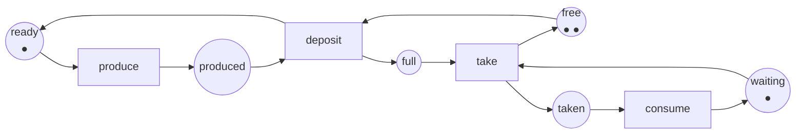
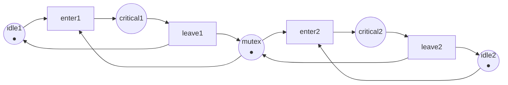

Full code: [`code/petri-nets`](https://github.com/spareilleux/learn/tree/main/code/petri-nets). This lesson is printed by `dotnet run --project Examples -c Release -- l1`, and its output is compared with [`expected/l1.txt`](https://github.com/spareilleux/learn/blob/main/code/petri-nets/expected/l1.txt) by [`check.sh`](https://github.com/spareilleux/learn/blob/main/code/petri-nets/check.sh). On Windows, run `check.sh` from Git Bash; everything else is plain `dotnet`.

## The problem a state machine will not model

Here is a bounded buffer with one producer and one consumer, the shape of every [`Channel<T>`](https://learn.microsoft.com/dotnet/api/system.threading.channels.channel-1) and every [`ArrayBlockingQueue`](https://docs.oracle.com/en/java/javase/21/docs/api/java.base/java/util/concurrent/ArrayBlockingQueue.html) you have written:

```csharp
// Two threads, one queue of two slots. What are the states of this system?
var buffer = Channel.CreateBounded<Item>(2);

// producer thread
while (true)
{
    var item = Produce();               // takes time
    await buffer.Writer.WriteAsync(item); // blocks when the buffer is full
}

// consumer thread
while (true)
{
    var item = await buffer.Reader.ReadAsync(); // blocks when the buffer is empty
    Consume(item);                              // takes time
}
```

Try to draw that as a state machine. The producer has two states, "about to produce" and "holding an item it has not deposited". The consumer has two. The buffer has three, because it holds zero, one or two items. A state machine has one current state, so it needs one state per combination: 2 × 2 × 3 = 12, and each transition has to be drawn from every state where it applies. Add a second producer and the drawing is unusable.

The problem is not the drawing. It is that the state of this system is not a point. It is a *distribution*: some things are here, some things are there, and several of them move independently. A state machine can only say "the system is in state S". I want to say "the producer holds an item, one slot is taken, one slot is free, and the consumer is waiting" — four facts that are true at the same time and change at different moments.

A Petri net says exactly that. It was introduced by [Carl Adam Petri](https://www.informatik.uni-hamburg.de/TGI/PetriNets/history/) in his 1962 dissertation *Kommunikation mit Automaten*, and the definition below is the one Murata gives in his 1989 survey (section II).

## Places, transitions, arcs, tokens

A Petri net has two kinds of node and nothing else:

- a **place**, drawn as a circle, is a condition or a container: "the producer is ready", "a slot is free". A place holds a number of **tokens**, drawn as dots;
- a **transition**, drawn as a bar or a rectangle, is an event: "produce", "deposit";
- an **arc** goes from a place to a transition, or from a transition to a place, never between two nodes of the same kind. An arc carries a **weight**, which is 1 unless it is written.

The tokens, place by place, are the **marking**. The marking is the state of the whole net, and the initial marking is written M0. Here is the bounded buffer as a net:



Six places, four transitions, twelve arcs. The producer is the token that moves between `ready` and `produced`; the consumer is the token that moves between `waiting` and `taken`; the buffer is two tokens shared between `free` and `full`. That last pair is worth dwelling on: **a free slot is a token too**. `free` holds the slots nobody has filled yet, and it is the only reason the producer can be stopped.

The analyser prints the same net as text:

```
== The net ==
net producer-consumer
places      ready produced free full waiting taken
transitions produce deposit take consume
M0          (1, 0, 2, 0, 1, 0) = ready:1 free:2 waiting:1
arc         ready -> produce
arc         produce -> produced
arc         produced -> deposit
arc         free -> deposit
arc         deposit -> full
arc         deposit -> ready
arc         full -> take
arc         waiting -> take
arc         take -> taken
arc         take -> free
arc         taken -> consume
arc         consume -> waiting
```

The marking `(1, 0, 2, 0, 1, 0)` is a vector, one entry per place, in the order the places are listed. That order never changes, and the whole of lesson 2 rests on it.

## The firing rule

This is the entire semantics, and it fits in two sentences.

> A transition is **enabled** at a marking when every place with an arc into it holds at least the weight of that arc.
> Firing an enabled transition removes those tokens from its input places and adds, to each output place, the weight of the arc leading to it. Both happen at once.

Nothing says *which* enabled transition fires, or when. A Petri net does not schedule; it describes what is possible. That is why it can answer "can this ever happen" — the answer covers every schedule at once.

In C# the rule is four lines, and it is the whole of [`PetriNet.cs`](https://github.com/spareilleux/learn/blob/main/code/petri-nets/PetriNets/PetriNet.cs) that anything else is built on:

```csharp
/// <summary>True when every input place of the transition holds at least the arc weight.</summary>
public bool IsEnabled(Marking marking, int transition)
{
    for (var p = 0; p < Places.Count; p++)
    {
        if (marking[p] != Marking.Omega && marking[p] < Pre[p, transition]) return false;
    }
    return true;
}

public Marking Fire(Marking marking, int transition)
{
    if (!IsEnabled(marking, transition))
        throw new InvalidOperationException($"Transition {Transitions[transition].Name} is not enabled at {marking}.");
    var next = marking.ToArray();
    for (var p = 0; p < Places.Count; p++)
        next[p] = Marking.Add(next[p], Post[p, transition] - Pre[p, transition]);
    return new Marking(next);
}
```

`Pre[p, t]` is what firing `t` takes from `p`, `Post[p, t]` is what it gives back. Lesson 2 gives those two matrices a name and a use. `Marking.Omega` is a sentinel that only lesson 3 needs; ignore it for now.

At the initial marking only one transition is enabled, because the consumer has nothing to take and the producer has nothing to deposit:

```
== Enabled at the initial marking ==
produce
```

A full round trip moves the tokens and comes back where it started:

```
== One round trip: produce, deposit, take, consume ==
          (1, 0, 2, 0, 1, 0)  ready:1 free:2 waiting:1
produce   (0, 1, 2, 0, 1, 0)  produced:1 free:2 waiting:1
deposit   (1, 0, 1, 1, 1, 0)  ready:1 free:1 full:1 waiting:1
take      (1, 0, 2, 0, 0, 1)  ready:1 free:2 taken:1
consume   (1, 0, 2, 0, 1, 0)  ready:1 free:2 waiting:1
```

Read `deposit` closely. It takes one token from `produced` **and** one from `free`, and it puts one into `full` **and** one back into `ready`. One event, four places touched, atomically. A state machine edge cannot do that: it changes one current state into another.

## Backpressure, drawn

Now fill the buffer and watch the producer stop:

```
== Filling the buffer: the producer is stopped by the empty place free ==
          (1, 0, 2, 0, 1, 0)  ready:1 free:2 waiting:1
produce   (0, 1, 2, 0, 1, 0)  produced:1 free:2 waiting:1
deposit   (1, 0, 1, 1, 1, 0)  ready:1 free:1 full:1 waiting:1
produce   (0, 1, 1, 1, 1, 0)  produced:1 free:1 full:1 waiting:1
deposit   (1, 0, 0, 2, 1, 0)  ready:1 full:2 waiting:1
enabled now: produce take
after produce: (0, 1, 0, 2, 1, 0) produced:1 full:2 waiting:1
enabled now: take
deposit enabled: False  (free holds 0 tokens)
```

The producer may still `produce` — it can hold one item in its hand — but `deposit` is not enabled, because `free` is empty. That is `WriteAsync` blocking, and it is not a special rule the model needed: it falls out of the firing rule applied to an empty place.

This is the first thing the net buys you. In the C# code, backpressure is a property of the `Channel` implementation, documented in prose and observed at runtime. In the net it is a token count, and a program can check it.

## Two things at once

The consumer taking an item and the producer producing the next one are independent. Nothing in the net makes one wait for the other, and the marking they arrive at is the same whichever fires first:

```
== Concurrency: produce and take do not compete, and the order does not matter ==
from (1, 0, 1, 1, 1, 0) ready:1 free:1 full:1 waiting:1
produce then take: (0, 1, 2, 0, 0, 1)
take then produce: (0, 1, 2, 0, 0, 1)
same marking: True
```

Two enabled transitions with no input place in common are **concurrent**: they can fire in either order, or, if you like, at the same time. Two enabled transitions that share an input place with only enough tokens for one of them are in **conflict**: firing one disables the other. Lesson 4 turns that distinction into the property called persistence, and lesson 7 shows that conflict is exactly where a lock lives.

## What the model costs

The net has six places and four transitions. Its reachable markings number twelve — the 2 × 2 × 3 from the beginning of this lesson:

```
== A state machine would need one state per combination ==
markings of this net: 12
tokens in the net: 4
```

So the state machine is not wrong, it is just the *expanded* form. The net is the compressed one, and the compression is where the leverage is: the drawing has 10 nodes and 12 arcs where the state machine has 12 states and 20 edges, and it keeps its size when you add a second producer, where the state machine multiplies.

The second line is a free gift. The total number of tokens never changes, in any of the twelve markings, because every transition of this net takes exactly as many tokens as it gives. Lesson 5 calls that a place invariant and proves it without enumerating anything.

## The same net as a file

Nets are exchanged between tools as [PNML](https://www.pnml.org/), an XML format standardised as [ISO/IEC 15909-2:2011](https://www.iso.org/standard/43538.html). The analyser writes it, and `check.sh` compares what it writes with the files in [`nets/`](https://github.com/spareilleux/learn/tree/main/code/petri-nets/nets), so the net in the picture and the net in the file cannot drift apart:

```xml
<?xml version="1.0" encoding="utf-8"?>
<pnml xmlns="http://www.pnml.org/version-2009/grammar/pnml">
  <net id="n1" type="http://www.pnml.org/version-2009/grammar/ptnet">
    <name>
      <text>producer-consumer</text>
    </name>
    <page id="page1">
      <place id="ready">
        <name>
          <text>ready</text>
        </name>
        <initialMarking>
          <text>1</text>
        </initialMarking>
      </place>
      <place id="produced">
        <name>
          <text>produced</text>
        </name>
      </place>
      <!-- free, full, waiting, taken follow, then the transitions -->
      <transition id="produce">
        <name>
          <text>produce</text>
        </name>
      </transition>
      <arc id="a1" source="ready" target="produce" />
      <arc id="a2" source="produce" target="produced" />
    </page>
  </net>
</pnml>
```

The whole file is [`nets/producer-consumer.pnml`](https://github.com/spareilleux/learn/blob/main/code/petri-nets/nets/producer-consumer.pnml). The type attribute says which kind of net this is: `ptnet` is the place/transition net of this lesson. Lesson 8 meets another type, and lesson 11 meets the tools that read them.

## Key takeaways

- A place is a condition or a container, a transition is an event, and the tokens in the places are the marking. The marking is a vector, not a single state.
- A transition is enabled when each of its input places holds at least the arc weight, and firing consumes and produces in one step.
- The net never says which enabled transition fires. That silence is what lets one model cover every interleaving.
- An empty place is a blocked event. A bounded buffer is modelled by a place holding its free slots, and backpressure needs no extra rule.
- Two enabled transitions that share no input place are concurrent, and firing them in either order lands on the same marking. Two that compete for the same tokens are in conflict.
- A net is the compressed form of the state machine you would otherwise draw, and the compression grows with the number of independent components.

## Exercises

1. In the net above, remove the place `free` and its two arcs. Which transition is no longer constrained, and what does that mean for the buffer?
2. Model a lock: two threads, each with a place `idle` and a place `critical`, sharing one place `mutex` holding one token. Which two transitions are in conflict, and at which marking?
3. Give the net above a buffer of one slot instead of two, by changing one number. How many markings does it have now? Check with the analyser.
4. The arc from `deposit` to `ready` puts the producer back to work. What would the net mean if that arc were missing?

<details>
<summary>Solutions</summary>

**1.** `deposit` is no longer constrained: it only needs a token in `produced`. The producer can then deposit for ever without the consumer taking anything, so `full` grows without limit and the set of reachable markings becomes infinite. That net is [`UnboundedProducer`](https://github.com/spareilleux/learn/blob/main/code/petri-nets/Examples/Nets.cs) in the code, and lesson 3 is about what you can still say about it.

**2.** The net is [`MutualExclusion`](https://github.com/spareilleux/learn/blob/main/code/petri-nets/Examples/Nets.cs):



`enter1` and `enter2` are in conflict at the initial marking `(1, 0, 1, 0, 1)`: both are enabled, both need the single token in `mutex`, and firing either one disables the other. That is the lock. Lesson 4 checks that the two threads are never both in their critical section, and lesson 5 proves it with one invariant instead of a search.

**3.** Change the initial marking of `free` from 2 to 1. The analyser prints the answer in lesson 3's growth table: 8 markings instead of 12. The producer, the consumer and the buffer now have 2 × 2 × 2 combinations.

**4.** Without the arc `deposit -> ready`, the token that stands for the producer would be consumed by `deposit` and never come back. `produce` would fire once, `deposit` once, and the producer half of the net would then be dead for ever, while the consumer drained the single item and stopped. Lesson 4 gives that failure its name: the transition `produce` would be *L1-live* — able to fire once — instead of live.

</details>

## Sources

- Tadao Murata, *Petri nets: Properties, analysis and applications*, **Proceedings of the IEEE** 77(4), April 1989, pages 541–580, [doi:10.1109/5.24143](https://doi.org/10.1109/5.24143). Section II defines places, transitions, arcs, markings and the firing rule used here.
- Wolfgang Reisig, *Understanding Petri Nets*, Springer, 2013, [doi:10.1007/978-3-642-33278-4](https://doi.org/10.1007/978-3-642-33278-4).
- [Petri Nets World](https://www.informatik.uni-hamburg.de/TGI/PetriNets/) and its [history page](https://www.informatik.uni-hamburg.de/TGI/PetriNets/history/), for Carl Adam Petri's 1962 dissertation.
- [PNML](https://www.pnml.org/) and [ISO/IEC 15909-2:2011](https://www.iso.org/standard/43538.html), *Systems and software engineering — High-level Petri nets — Part 2: Transfer format*.
- [`Channel<T>`](https://learn.microsoft.com/dotnet/api/system.threading.channels.channel-1) and [`ArrayBlockingQueue`](https://docs.oracle.com/en/java/javase/21/docs/api/java.base/java/util/concurrent/ArrayBlockingQueue.html), the two bounded buffers this lesson models.
