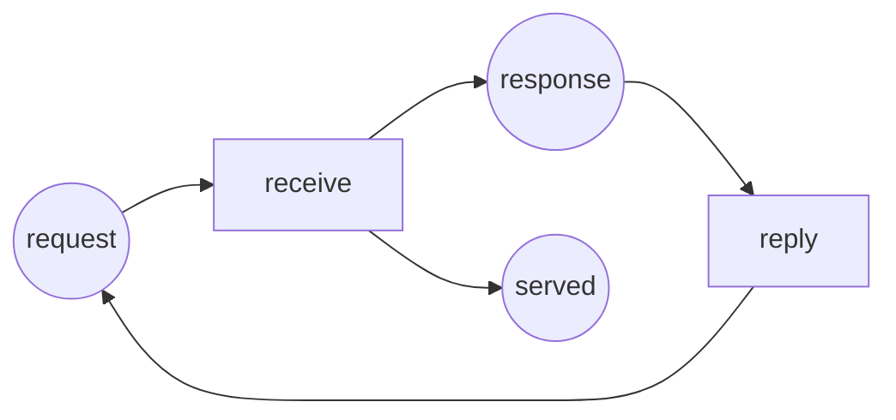

Full code: [`code/petri-nets`](https://github.com/spareilleux/learn/tree/main/code/petri-nets). This lesson is printed by `dotnet run --project Examples -c Release -- l2`, compared with [`expected/l2.txt`](https://github.com/spareilleux/learn/blob/main/code/petri-nets/expected/l2.txt).

Lesson 1 drew a net and fired it. This lesson writes the same thing as numbers, because a picture cannot be handed to a program, and because one matrix product replaces a whole firing sequence.

## The definition

A **place/transition net** is a tuple *N* = (*P*, *T*, *F*, *W*, *M0*) where

- *P* is a finite set of places and *T* a finite set of transitions, with *P* and *T* disjoint and not both empty;
- *F* ⊆ (*P* × *T*) ∪ (*T* × *P*) is the set of arcs — from a place to a transition or from a transition to a place, never between two of the same kind;
- *W* : *F* → {1, 2, 3, …} gives each arc a positive weight;
- *M0* : *P* → {0, 1, 2, …} is the initial marking.

That is Murata's definition (1989, section II-A), and it is what [`PetriNet.cs`](https://github.com/spareilleux/learn/blob/main/code/petri-nets/PetriNets/PetriNet.cs) stores: a list of places, a list of transitions, a list of weighted arcs and a marking. A marking is a vector in ℕ^|*P*|, and fixing the order of the places once is what lets us write it as `(1, 0, 2, 0, 1, 0)`.

## Three matrices

Instead of keeping the arcs as a list, put them in two tables indexed by place and transition:

- **Pre**[*p*, *t*] is the weight of the arc from *p* to *t*, or 0 when there is none: what firing *t* **takes** from *p*;
- **Post**[*p*, *t*] is the weight of the arc from *t* to *p*: what firing *t* **gives** to *p*.

The analyser prints them for the producer and consumer of lesson 1:

```
Pre (tokens a firing takes from the place)
          produce deposit    take consume
ready           1       0       0       0
produced        0       1       0       0
free            0       1       0       0
full            0       0       1       0
waiting         0       0       1       0
taken           0       0       0       1
Post (tokens a firing puts into the place)
          produce deposit    take consume
ready           0       1       0       0
produced        1       0       0       0
free            0       0       1       0
full            0       1       0       0
waiting         0       0       0       1
taken           0       0       1       0
```

The firing rule of lesson 1 reads straight off them. Transition *t* is enabled at *M* when *M* ≥ **Pre**[·, *t*] place by place; firing it gives *M*′ = *M* − **Pre**[·, *t*] + **Post**[·, *t*].

Since the subtraction and the addition always happen together, the difference is worth a name. The **incidence matrix** is

> *C* = **Post** − **Pre**

and its column *t* is the change of marking that firing *t* produces:

```
C = Post - Pre (change of marking per firing)
          produce deposit    take consume
ready          -1       1       0       0
produced        1      -1       0       0
free            0      -1       1       0
full            0       1      -1       0
waiting         0       0      -1       1
taken           0       0       1      -1
```

Read the `deposit` column downwards: −1 in `produced`, −1 in `free`, +1 in `full`, +1 in `ready`. One event, four places, in a single column. Read the same column across the printout the analyser gives transition by transition:

```
== One firing as a column of C ==
produce    -1  1  0  0  0  0
deposit     1 -1 -1  1  0  0
take        0  0  1 -1 -1  1
consume     0  0  0  0  1 -1
```

Every column here sums to zero, which is the numerical form of "this net neither creates nor destroys tokens". Lesson 1 noticed that the total was always 4; here you can see why, one transition at a time.

**What *C* throws away.** The incidence matrix knows the *difference*, not the two halves. A self-loop — an arc *p* → *t* and an arc *t* → *p* — contributes 0 to *C*, exactly like no arc at all, even though it changes when *t* is enabled. Nets without self-loops are called *pure*, and everything based on *C* alone applies to them without a footnote. The nets of this course are pure; the analyser keeps **Pre** and **Post** separately anyway, because the firing rule needs **Pre**.

## The state equation

Suppose a sequence of transitions σ fires from *M0* and reaches *M*. Count how many times each transition occurs in σ and put the counts in a vector *x* — its **firing count vector**, also called the Parikh vector of σ. Each firing adds its column of *C*, so adding them all up:

> *M* = *M0* + *C* · *x*

This is the **state equation** (Murata 1989, section V-A). The proof is one line of induction: firing *t* at *M* gives *M* + *C*[·, *t*], so after σ the marking is *M0* plus the sum of the columns, which is *C* · *x*.

On a real sequence, the equation and the firing rule agree:

```
== The state equation on a real sequence ==
sequence  produce deposit produce take
x         (2, 1, 1, 0)   in the order produce deposit take consume
M0        (1, 0, 2, 0, 1, 0)
M0 + C x  (0, 1, 2, 0, 0, 1)
fired     (0, 1, 2, 0, 0, 1)
```

Notice what the equation does *not* contain: the order. Two sequences with the same counts land on the same marking, and the equation cannot tell them apart:

```
== The same x in a different order ==
produce deposit take produce -> (0, 1, 2, 0, 0, 1)
same marking: True
```

That is a feature when you want it — a whole family of interleavings collapses into one arithmetic fact — and a trap when you forget it, which is the rest of this lesson.

The C# is as short as the mathematics ([`StateEquation.cs`](https://github.com/spareilleux/learn/blob/main/code/petri-nets/PetriNets/StateEquation.cs)):

```csharp
public static int[] Apply(PetriNet net, Marking start, int[] firingCount)
{
    var c = net.Incidence();
    var result = start.ToArray();
    for (var p = 0; p < net.Places.Count; p++)
        for (var t = 0; t < net.Transitions.Count; t++)
            result[p] += c[p, t] * firingCount[t];
    return result;
}
```

The return type is `int[]`, not `Marking`: entries may come out negative, and a negative entry is the equation's way of saying that no order of those firings works.

## Necessary, not sufficient

So if *M* is reachable from *M0*, then *M* = *M0* + *C* · *x* has a solution *x* with non-negative integer entries. The equation is a **necessary** condition, and that alone is useful: no solution means no sequence, proved by arithmetic, with no search.

The converse is false, and here is a net that shows it. Two services hand a token back and forth: `receive` turns a request into a response and counts one completed exchange in `served`, `reply` turns the response back into a request. Nobody sent the first request, so `request` starts empty.



Its incidence matrix is three rows by two columns:

```
C = Post - Pre (change of marking per firing)
          receive   reply
request        -1       1
response        1      -1
served          1       0
```

Nothing is enabled at `(0, 0, 0)`: `receive` wants a token in `request`, `reply` wants one in `response`, and there are none. The net has exactly one reachable marking, and it is a dead one:

```
reachability graph of handshake: 1 state, 0 firings
places request response served
  M0 = (0, 0, 0)  (empty)
  dead marking M0 = (0, 0, 0)  (empty)
```

Now ask the equation whether one exchange could have been served, that is whether `(0, 0, 1)` is reachable. Take *x* = (1, 1): `receive` once and `reply` once. In `request` that is −1 + 1 = 0, in `response` +1 − 1 = 0, in `served` +1 + 0 = 1. The books balance:

```
target    (0, 0, 1)  served:1
solution  x = (1, 1)   in the order receive reply
reachable: False
spurious markings up to 2 tokens: (0, 0, 1) (0, 0, 2)
```

The last line comes from a brute-force search in the analyser: it enumerates every marking with at most two tokens, keeps those the reachability graph does not contain, and asks the equation about each one. Two markings pass the equation and are unreachable. They are called **spurious solutions**, and the reason is visible in the story: the equation lets `receive` borrow the token that `reply` will only produce later. Firing is a schedule; the equation is an audit at the end of the year.

So the state equation gives you one clean half of an answer:

- no non-negative integer solution ⟹ **not reachable**, proved;
- a solution exists ⟹ **maybe reachable**, and you still have to look.

*To verify: Murata reports (1989, section V-A) that for some classes of nets — acyclic nets in particular — the state equation is both necessary and sufficient. I have not been able to read the paper itself, only secondary accounts, so I am not stating it as fact here; the analyser's spurious-marking search is the only evidence this course offers so far.*

## Solving in the other direction

Two questions about the same matrix have names, and they carry the rest of the course:

- vectors *y* ≥ 0 with *y* · *C* = 0 are **place invariants**: for such a *y*, the weighted token count *y* · *M* is the same at every reachable marking, because every firing adds *y* · *C*[·, *t*] = 0 to it;
- vectors *x* ≥ 0 with *C* · *x* = 0 are **transition invariants**: a sequence whose counts are *x*, if it can run at all, comes back to the marking it started from.

The analyser already computes both, and on the producer and consumer they say what lesson 1 observed by hand:

```
== Invariants read off the same matrix (lesson 5) ==
invariants of producer-consumer
  place invariants (3):
    ready + produced = 1
    free + full = 2
    waiting + taken = 1
  transition invariants (1):
    produce + deposit + take + consume
```

Three sentences, each true of all twelve markings, obtained without enumerating any of them: the producer is in exactly one of its two states, the buffer has exactly two slots, the consumer is in exactly one of its two states. The second one is the proof that the buffer cannot overflow — `full` ≤ 2 because `free` ≥ 0. Lesson 5 explains how they are computed and what else they decide.

## Key takeaways

- A place/transition net is (*P*, *T*, *F*, *W*, *M0*): places, transitions, weighted arcs between the two kinds, and an initial marking.
- **Pre** and **Post** are the arc weights as matrices; *C* = **Post** − **Pre** is the incidence matrix, one column per transition, and that column is the change the transition makes.
- *C* forgets self-loops. Nets without them are called pure, and matrix arguments apply to them cleanly.
- The state equation *M* = *M0* + *C* · *x* holds for every firing sequence, with *x* counting the firings. It ignores order.
- It is necessary and not sufficient: no solution proves unreachability, a solution proves nothing. Markings that pass it without being reachable are spurious solutions, and this course exhibits two.
- The same matrix, solved for zero, gives place invariants and transition invariants — statements about every reachable marking, without enumerating one.

## Exercises

1. Write the incidence matrix of the mutual exclusion net of lesson 1 (places `idle1`, `critical1`, `idle2`, `critical2`, `mutex`; transitions `enter1`, `leave1`, `enter2`, `leave2`). What do you notice about the pairs of columns?
2. The vector *y* = (0, 1, 0, 1, 1), in the order of those places, weights `critical1`, `critical2` and `mutex` with 1. Check that *y* · *C* = 0, and say in plain words what *y* · *M* = 1 means for the two threads.
3. Take the producer and consumer, and the firing count vector *x* = (3, 3, 3, 3). What marking does the state equation predict? Is it reachable?
4. Find a firing count vector that the state equation accepts for the producer and consumer but that no sequence can realise, or argue why you cannot. (Hint: the analyser has a `SpuriousMarkings` method; the interesting question is which net you point it at.)

<details>
<summary>Solutions</summary>

**1.** With places in the order `idle1 critical1 idle2 critical2 mutex` and transitions `enter1 leave1 enter2 leave2`:

```
           enter1 leave1 enter2 leave2
idle1          -1      1      0      0
critical1       1     -1      0      0
idle2           0      0     -1      1
critical2       0      0      1     -1
```

The column of `leave1` is the column of `enter1` negated, and likewise for thread 2: each pair of transitions undoes the other exactly. That is why *x* = (1, 1, 0, 0) is a transition invariant, and the analyser finds both of them in lesson 4.

**2.** *y* · *C* picks row `critical1` plus row `critical2` plus row `mutex`. Column by column: `enter1` gives 1 + 0 − 1 = 0, `leave1` gives −1 + 0 + 1 = 0, `enter2` gives 0 + 1 − 1 = 0, `leave2` gives 0 − 1 + 1 = 0. So *y* · *C* = 0, and *y* · *M* keeps the value it has at *M0*, which is 0 + 0 + 1 = 1. In words: at every reachable marking, the number of threads in a critical section plus the number of free locks is exactly one. Since both counts are non-negative, `critical1` and `critical2` are never both 1 — the two threads are never inside together. That is a proof of mutual exclusion, and it never looked at a marking.

**3.** *C* · (3, 3, 3, 3) is three times the sum of the four columns, and the four columns sum to the zero vector — that is the transition invariant printed above. So the equation predicts *M0* itself, `(1, 0, 2, 0, 1, 0)`, which is of course reachable: fire the round trip of lesson 1 three times.

**4.** You cannot, and the three place invariants say why. Any marking satisfying the equation also satisfies every place invariant, so it has `ready + produced` = 1, `free + full` = 2 and `waiting + taken` = 1. That leaves 2 × 3 × 2 = 12 markings, and lesson 3 shows that all twelve are reachable. The two sets coincide, so this net has no spurious marking at all — `StateEquation.SpuriousMarkings` returns nothing for it, and a unit test keeps it that way.

What the handshake net has and this one has not is a **siphon** that starts empty. A set of places *S* is a siphon when every transition that puts a token into *S* also takes one out of *S*; such a set can never gain a token it did not have, so a siphon that is empty stays empty for ever, and every transition with an input in it is dead. In the handshake, {`request`, `response`} is exactly that. Lesson 6 uses siphons and their mirror image, traps, to decide liveness without a search.

</details>

## Sources

- Tadao Murata, *Petri nets: Properties, analysis and applications*, **Proceedings of the IEEE** 77(4), April 1989, pages 541–580, [doi:10.1109/5.24143](https://doi.org/10.1109/5.24143). Section II-A for the definition, section V-A for the incidence matrix and the state equation.
- Wolfgang Reisig, *Understanding Petri Nets*, Springer, 2013, [doi:10.1007/978-3-642-33278-4](https://doi.org/10.1007/978-3-642-33278-4).
- [`StateEquation.cs`](https://github.com/spareilleux/learn/blob/main/code/petri-nets/PetriNets/StateEquation.cs) and [`Invariants.cs`](https://github.com/spareilleux/learn/blob/main/code/petri-nets/PetriNets/Invariants.cs) in this repository, and the tests in [`PetriNetTests.cs`](https://github.com/spareilleux/learn/blob/main/code/petri-nets/Tests/PetriNetTests.cs) that keep them honest.
