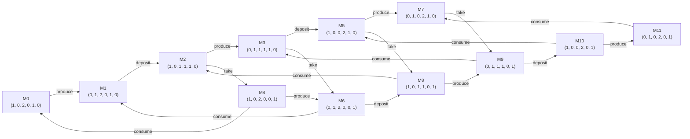
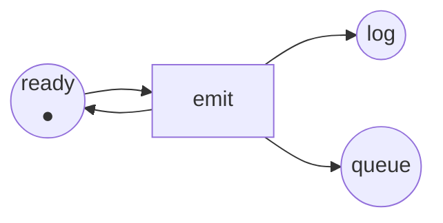

Full code: [`code/petri-nets`](https://github.com/spareilleux/learn/tree/main/code/petri-nets). This lesson is printed by `dotnet run --project Examples -c Release -- l3`, compared with [`expected/l3.txt`](https://github.com/spareilleux/learn/blob/main/code/petri-nets/expected/l3.txt).

Lesson 2 gave an arithmetic condition that can only refute. To *decide* whether a marking is reachable, there is a brutal and obvious method: start at *M0*, fire everything that can fire, and keep going until nothing new appears. That is the reachability graph, and this lesson is about when it works, when it does not, and what to do then.

## Building it

The **reachability set** R(*N*, *M0*) is the set of markings reachable from *M0* by any firing sequence. The **reachability graph** adds the firings: one node per reachable marking, one labelled arrow per firing.

The construction is a breadth-first search whose successor function is the firing rule ([`ReachabilityGraph.cs`](https://github.com/spareilleux/learn/blob/main/code/petri-nets/PetriNets/ReachabilityGraph.cs)):

```csharp
while (queue.Count > 0)
{
    var from = queue.Dequeue();
    foreach (var t in net.EnabledTransitions(states[from]))
    {
        var next = net.Fire(states[from], t);
        if (!index.TryGetValue(next, out var to))
        {
            if (states.Count >= limit) { complete = false; continue; }
            to = states.Count;
            states.Add(next);
            index[next] = to;
            queue.Enqueue(to);
        }
        steps.Add(new Step(from, t, to));
    }
}
```

Two details make the output usable rather than merely correct. Breadth first, so the states are numbered in an order that does not depend on a hash table's layout, and the firings are sorted before being returned — otherwise the same net would print a different graph on another machine, and no file could be compared. And there is a `limit`: without it, the loop above does not terminate on the second net of this lesson.

For the producer and consumer of lesson 1, it terminates at twelve:

```
reachability graph of producer-consumer: 12 states, 20 firings
places ready produced free full waiting taken
  M0 = (1, 0, 2, 0, 1, 0)  ready:1 free:2 waiting:1
  M1 = (0, 1, 2, 0, 1, 0)  produced:1 free:2 waiting:1
  M2 = (1, 0, 1, 1, 1, 0)  ready:1 free:1 full:1 waiting:1
  M3 = (0, 1, 1, 1, 1, 0)  produced:1 free:1 full:1 waiting:1
  M4 = (1, 0, 2, 0, 0, 1)  ready:1 free:2 taken:1
  M5 = (1, 0, 0, 2, 1, 0)  ready:1 full:2 waiting:1
  M6 = (0, 1, 2, 0, 0, 1)  produced:1 free:2 taken:1
  M7 = (0, 1, 0, 2, 1, 0)  produced:1 full:2 waiting:1
  M8 = (1, 0, 1, 1, 0, 1)  ready:1 free:1 full:1 taken:1
  M9 = (0, 1, 1, 1, 0, 1)  produced:1 free:1 full:1 taken:1
  M10 = (1, 0, 0, 2, 0, 1)  ready:1 full:2 taken:1
  M11 = (0, 1, 0, 2, 0, 1)  produced:1 full:2 taken:1
  M0 --produce--> M1
  M1 --deposit--> M2
  M2 --produce--> M3
  M2 --take--> M4
  M3 --deposit--> M5
  M3 --take--> M6
  M4 --produce--> M6
  M4 --consume--> M0
  M5 --produce--> M7
  M5 --take--> M8
  M6 --deposit--> M8
  M6 --consume--> M1
  M7 --take--> M9
  M8 --produce--> M9
  M8 --consume--> M2
  M9 --deposit--> M10
  M9 --consume--> M3
  M10 --produce--> M11
  M10 --consume--> M5
  M11 --consume--> M7
```

The analyser draws the same graph, so the picture and the listing come out of one place:



These are the twelve combinations lesson 1 counted: the producer in one of two states, the consumer in one of two, the buffer holding zero, one or two items. Every one of them is reachable, which is what exercise 4 of lesson 2 needed.

Read M2 and its two successors. From `ready:1 free:1 full:1 waiting:1`, `produce` leads to M3 and `take` leads to M4 — and then M3 `take`s to M6 and M4 `produce`s to M6, the same marking. That closed square is the diamond of lesson 1, drawn. Where the graph has a diamond, the net has concurrency; where it has a node with two outgoing arrows that never join up again, the net has a choice.

Once the graph exists, several questions become lookups:

- **is *M* reachable?** Is *M* among the states.
- **can the system deadlock?** Is there a state with no outgoing arrow. Here there is none.
- **how many tokens can `full` hold?** The maximum over the states: two.
- **can the system get back to the start?** Can state 0 be reached from every state.

Lesson 4 turns each of those into a named property and a line of output.

## Why nobody builds this by hand

The graph grows. Not always in the way you expect, which is worth watching:

```
== How fast the graph grows ==
capacity  states  firings
       1       8       12
       2      12       20
       3      16       28
       4      20       36
       5      24       44
       6      28       52
       7      32       60
       8      36       68
```

Making the buffer bigger costs four states per slot: linear, because the buffer is one component whose state is a number. Now add components instead. The dining philosophers — *n* philosophers around a table, each needing the forks on both sides, taking both at once:

```
philosophers  states  firings
           2       3        4
           3       4        6
           4       7       16
           5      11       30
           6      18       60
           7      29      112
           8      47      208
           9      76      378
          10     123      680
```

3, 4, 7, 11, 18, 29, 47, 76, 123 — each is the sum of the two before it. Those are the Lucas numbers, which grow like the golden ratio to the *n*th power. Exponential, with a small base only because the philosophers share their forks with their neighbours, which restricts what can happen at once.

Take the sharing away, and the base is the whole state space of one component:

```
independent copies  states  firings
                 1      12       20
                 2     144      480
                 3    1728     8640
                 4   20736   138240
                 5  248832  2073600
```

Five independent copies of a twelve-marking net: 12⁵ = 248 832 markings. This is the **state explosion problem**, and it is the reason the rest of the subject exists. Nothing is wrong with the model — those markings really are all different — but an approach that enumerates them stops working somewhere between the fourth and fifth copy of a system with six places.

Two ways out are already in view. Lesson 5 proves things about all markings at once with invariants, and never builds a graph. Lesson 15 covers the techniques that keep the graph but stop exploring interleavings that lead to the same place: partial order reduction and unfoldings.

## When the graph is infinite

Take the producer and consumer, and remove the place `free` with its two arcs — the change exercise 1 of lesson 1 asked about. Nothing else moves:

```
== Remove the place free and the graph becomes infinite ==
net unbounded-producer
places      ready produced full waiting taken
transitions produce deposit take consume
M0          (1, 0, 0, 1, 0) = ready:1 waiting:1
arc         ready -> produce
arc         produce -> produced
arc         produced -> deposit
arc         deposit -> full
arc         deposit -> ready
arc         full -> take
arc         waiting -> take
arc         take -> taken
arc         taken -> consume
arc         consume -> waiting
```

`deposit` no longer needs a free slot. The producer can run for ever without the consumer taking anything, and `full` grows without limit. The search does not terminate; it is only the `limit` that stops it:

```
stopped after 50 states, complete: False
largest number of tokens in full among them: 13
```

Fifty states in, the buffer is holding thirteen items and there is no reason for it to stop. That is an unbounded queue in a real system, and the interesting thing is how small the change was: one place, two arcs, no line of "logic".

## The coverability tree

Karp and Miller solved this in 1969, in a paper about parallel program schemata, and Murata presents the construction in section IV-A. The idea is a well-chosen lie.

Build a tree instead of a graph, from *M0*, firing everything enabled. When a new marking *M* strictly covers one of its own ancestors *M*′ — that is, *M* ≥ *M*′ place by place and *M* ≠ *M*′ — then the path from *M*′ to *M* can be repeated, and every place where *M* grew can be pumped as high as you like. So write **ω** in those places, a symbol meaning "any number of tokens", with ω + *k* = ω and ω − *k* = ω, and ω ≥ *n* for every *n*. Stop a branch when its marking already appears on the path from the root.

That is all of [`CoverabilityTree.cs`](https://github.com/spareilleux/learn/blob/main/code/petri-nets/PetriNets/CoverabilityTree.cs):

```csharp
/// <summary>Replaces by omega every place that grew since an ancestor this marking strictly covers.</summary>
private static Marking WithOmegas(PetriNet net, List<CoverabilityNode> nodes, int parent, Marking marking)
{
    var tokens = marking.ToArray();
    foreach (var ancestor in Ancestors(nodes, parent).Append(nodes[parent]))
    {
        if (!marking.StrictlyCovers(ancestor.Marking)) continue;
        for (var p = 0; p < net.Places.Count; p++)
        {
            if (tokens[p] != Marking.Omega && tokens[p] > ancestor.Marking[p]) tokens[p] = Marking.Omega;
        }
    }
    return new Marking(tokens);
}
```

The tree is always finite, for every net. On the unbounded producer it has seventeen nodes:

```
coverability tree of unbounded-producer: 17 nodes
places ready produced full waiting taken
  root (1, 0, 0, 1, 0)
    produce -> (0, 1, 0, 1, 0)
      deposit -> (1, 0, ω, 1, 0)
        produce -> (0, 1, ω, 1, 0)
          deposit -> (1, 0, ω, 1, 0)  [already on this path]
          take -> (0, 1, ω, 0, 1)
            deposit -> (1, 0, ω, 0, 1)
              produce -> (0, 1, ω, 0, 1)  [already on this path]
              consume -> (1, 0, ω, 1, 0)  [already on this path]
            consume -> (0, 1, ω, 1, 0)  [already on this path]
        take -> (1, 0, ω, 0, 1)
          produce -> (0, 1, ω, 0, 1)
            deposit -> (1, 0, ω, 0, 1)  [already on this path]
            consume -> (0, 1, ω, 1, 0)
              deposit -> (1, 0, ω, 1, 0)  [already on this path]
              take -> (0, 1, ω, 0, 1)  [already on this path]
          consume -> (1, 0, ω, 1, 0)  [already on this path]
  bound of ready: 1
  bound of produced: 1
  bound of full: unbounded
  bound of waiting: 1
  bound of taken: 1
  dead transitions: none
```

Look at the third line. The first `deposit` produces `(1, 0, 1, 1, 0)`, which strictly covers the root `(1, 0, 0, 1, 0)`: same everywhere, one more token in `full`. So `full` becomes ω, and from then on the whole subtree carries it. Seventeen nodes replace an infinite graph, and they answer the question that mattered: **`full` is unbounded, every other place is safe.**

That is the tree's main use. Murata lists what it decides (section IV-A):

- **boundedness** of the net, and of each place: a place is unbounded exactly when ω appears in it somewhere in the tree;
- **which transitions are dead**: a transition that labels no arc of the tree can never fire;
- and when the net *is* bounded, the tree contains all the reachable markings, so it answers everything the graph answers.

## What ω forgets

It is a lie, though a careful one, and the price shows up immediately. On the bounded producer and consumer the tree has fifty-six nodes for twelve markings, because a tree repeats every marking once per path that reaches it:

```
coverability tree of producer-consumer: 56 nodes
```

And on an unbounded net, ω destroys information that cannot be recovered:

```
== What omega forgets ==
The tree says full is unbounded. It cannot say whether full ever holds exactly 3 tokens
while the consumer waits, because omega replaced the count.
```

So the coverability tree does **not** decide reachability. `(1, 0, 3, 1, 0)` and `(1, 0, 3, 0, 1)` both appear in the tree as `(1, 0, ω, …)`, and the tree cannot tell you which of them the net can actually reach. It also does not decide liveness, for the same reason. This is not a weakness of this implementation: Murata states it as a limitation of the method, and it is why lesson 4 asks the analyser for liveness only on the finite graph.

## What is decidable, and at what price

The honest summary, with the results that established it:

- **Boundedness and coverability are decidable**, by this construction and refinements of it. The precise cost is known: coverability is EXPSPACE-complete — the lower bound is Lipton's 1976 Yale technical report *The reachability problem requires exponential space*, and the matching upper bound is Rackoff, [*The covering and boundedness problems for vector addition systems*](https://doi.org/10.1016/0304-3975%2878%2990036-1), **Theoretical Computer Science** 6(2), 1978, pages 223–231. *To verify: I am citing Lipton's report from secondary sources; I have not read the original.*
- **Reachability is decidable**, proved by Mayr ([STOC 1981](https://doi.org/10.1145/800076.802477)) and Kosaraju ([STOC 1982](https://doi.org/10.1145/800070.802201)) — and it took nearly twenty years after the question was posed.
- **Reachability is Ackermann-complete.** The upper bound is Leroux and Schmitz, [LICS 2019](https://doi.org/10.1109/LICS.2019.8785796); the matching lower bound was proved in 2021 by Czerwiński and Orlikowski ([FOCS 2021](https://doi.org/10.1109/FOCS52979.2021.00120)) and, independently, by Leroux ([FOCS 2021](https://doi.org/10.1109/FOCS52979.2021.00121)). Ackermann is not a figure of speech: the function grows faster than any primitive recursive one, so no algorithm for the general problem can be practical in the worst case.

Do not read this as "Petri nets are useless in practice". Read it as "asking for full reachability on an unbounded net is the expensive question". The nets people actually analyse are bounded, or are analysed with invariants, or belong to a structural class where the question collapses — which is what lessons 5 and 6 are for.

## Key takeaways

- The reachability graph has one node per reachable marking and one labelled arrow per firing. Built breadth first with a sorted output, it is the same on every machine, which is the only way a lesson can quote it.
- Once it exists, reachability, deadlock, bounds and reversibility are lookups.
- It explodes. Enlarging one component costs linearly; adding independent components multiplies. Five copies of a twelve-marking net have 248 832 markings.
- A net whose reachability set is infinite has no graph to build, and a tiny change — one place removed — is enough to get there.
- The Karp–Miller coverability tree stays finite for every net, by writing ω in a place that has been shown to grow. It decides boundedness, per-place bounds and dead transitions.
- It does not decide reachability or liveness: ω has thrown away the counts those questions need.
- Reachability is decidable and Ackermann-complete; coverability is decidable and EXPSPACE-complete.

## Exercises

1. Build the reachability graph of the mutual exclusion net of lesson 1 by hand — it has few enough markings. How many are there, and which pairs of transitions are ever enabled together?
2. In the graph of the producer and consumer above, find the shortest firing sequence from M0 to M11 = `(0, 1, 0, 2, 0, 1)`. What is the system doing in that marking?
3. The coverability tree of the unbounded producer has 17 nodes, and the tree of the bounded one has 56. Explain why the *unbounded* net gets the smaller tree.
4. Give a net with two places where the coverability tree writes ω in both, and say what sequence makes it do so.

<details>
<summary>Solutions</summary>

**1.** Three markings: `(1, 0, 1, 0, 1)` with nobody inside, `(0, 1, 1, 0, 0)` with thread 1 inside, and `(1, 0, 0, 1, 0)` with thread 2 inside. The graph is a triangle with two arrows each way through the middle marking. The only pair of transitions ever enabled together is `enter1` and `enter2`, at the first marking — and they are in conflict, so only one of them will fire. Lesson 4 prints these three markings as the home states of that net.

**2.** Eight firings — M11 is the farthest marking of the twelve: `produce, deposit, produce, deposit, produce, take, deposit, produce`, following M0 → M1 → M2 → M3 → M5 → M7 → M9 → M10 → M11. In M11 the producer holds an item with nowhere to put it (`produced:1`, and `free` is 0), the buffer is full with two items, and the consumer holds one it has not consumed: everything that can be holding something is. The analyser's `PathTo` does the same breadth-first walk, and a unit test pins this sequence.

**3.** Because the tree stops as soon as a marking repeats *on its own path*, and ω makes markings repeat much sooner. In the unbounded net, the third node already carries ω in `full`, which collapses every "one more item in the buffer" into the same symbol; its seventeen nodes hold only six distinct markings. In the bounded net, `full` really does take three different values, and the tree has to spell out every path through all twelve markings — a graph with 12 nodes and 20 edges unfolds into a tree with 56.

**4.** The unbounded producer with the consumer removed does it with one place; for two, give the producer two output places:



`emit` takes the token from `ready` and puts it back, adding one token to `log` and one to `queue` each time. Firing `emit` once gives `(1, 1, 1)`, which strictly covers the root `(1, 0, 0)` in both `log` and `queue`, so the tree writes `(1, ω, ω)` immediately. This net is `EmitLoop` in the code, and a unit test checks that `log` and `queue` come back unbounded while `ready` stays safe.

Two things to notice. The pair of arcs between `ready` and `emit` is a self-loop, so the incidence matrix of lesson 2 has a zero there even though the firing rule still needs that token — this is the impurity lesson 2 warned about, in the smallest net that has it. And the shape is the unbounded producer again with the pretence of a consumer removed: a transition that hands its input token straight back is a loop with no brake.

</details>

## Sources

- Richard M. Karp and Raymond E. Miller, *Parallel program schemata*, **Journal of Computer and System Sciences** 3(2), May 1969, pages 147–195, [doi:10.1016/S0022-0000(69)80011-5](https://doi.org/10.1016/S0022-0000%2869%2980011-5). The coverability tree construction is in this paper.
- Tadao Murata, *Petri nets: Properties, analysis and applications*, **Proceedings of the IEEE** 77(4), April 1989, pages 541–580, [doi:10.1109/5.24143](https://doi.org/10.1109/5.24143). Section IV-A presents the coverability tree and lists what it does and does not decide.
- Charles Rackoff, *The covering and boundedness problems for vector addition systems*, **Theoretical Computer Science** 6(2), 1978, pages 223–231, [doi:10.1016/0304-3975(78)90036-1](https://doi.org/10.1016/0304-3975%2878%2990036-1).
- Ernst W. Mayr, *An algorithm for the general Petri net reachability problem*, STOC 1981, [doi:10.1145/800076.802477](https://doi.org/10.1145/800076.802477); S. Rao Kosaraju, *Decidability of reachability in vector addition systems*, STOC 1982, [doi:10.1145/800070.802201](https://doi.org/10.1145/800070.802201).
- Jérôme Leroux and Sylvain Schmitz, *Reachability in vector addition systems is primitive-recursive in fixed dimension*, LICS 2019, [doi:10.1109/LICS.2019.8785796](https://doi.org/10.1109/LICS.2019.8785796); Wojciech Czerwiński and Łukasz Orlikowski, *Reachability in vector addition systems is Ackermann-complete*, FOCS 2021, [doi:10.1109/FOCS52979.2021.00120](https://doi.org/10.1109/FOCS52979.2021.00120); Jérôme Leroux, *The reachability problem for Petri nets is not primitive recursive*, FOCS 2021, [doi:10.1109/FOCS52979.2021.00121](https://doi.org/10.1109/FOCS52979.2021.00121).
