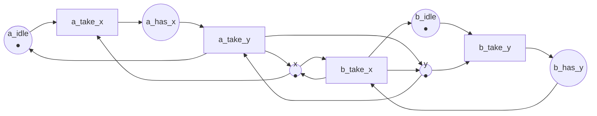

Full code: [`code/petri-nets`](https://github.com/spareilleux/learn/tree/main/code/petri-nets). This lesson is printed by `dotnet run --project Examples -c Release -- l4`, compared with [`expected/l4.txt`](https://github.com/spareilleux/learn/blob/main/code/petri-nets/expected/l4.txt).

Lesson 3 built the reachability graph. This lesson asks it questions. Every property below is defined for a net and its initial marking, decided in [`NetProperties.cs`](https://github.com/spareilleux/learn/blob/main/code/petri-nets/PetriNets/NetProperties.cs), and then shown on a net that does not have it — because a definition you have only seen satisfied is a definition you have not understood.

Five nets carry the lesson:

| net | what it models |
|---|---|
| `producer-consumer` | lesson 1: one producer, one consumer, two slots |
| `mutual-exclusion` | two threads and one lock |
| `two-locks` | two threads needing two locks, taken in opposite orders |
| `start-once` | a service that starts once and then serves for ever |
| `handshake` | lesson 2: a request and a reply, with no first request |

## Boundedness and safeness

A place *p* is **k-bounded** when no reachable marking puts more than *k* tokens in it. A net is *k*-bounded when all its places are, **bounded** when it is *k*-bounded for some *k*, and **safe** when it is 1-bounded.

This is the property that maps most directly onto code. A bounded place is a queue with a fixed capacity, a pool with a fixed size, an array you can allocate once. An unbounded place is a memory leak waiting for a slow consumer. A safe place is a boolean: the condition holds or it does not.

The producer and consumer is 2-bounded and not safe, because `free` and `full` share two tokens:

```
  bound of ready: 1
  bound of produced: 1
  bound of free: 2
  bound of full: 2
  bound of waiting: 1
  bound of taken: 1
  bounded:       yes (2-bounded)
  safe:          no
```

The mutual exclusion net is safe — every place is a condition that holds or does not — and the unbounded producer of lesson 3 is not bounded at all, which the analyser can only say through the coverability tree:

```
== The unbounded net, seen by the coverability tree ==
bounded: False
  bound of ready: 1
  bound of produced: 1
  bound of full: unbounded
  bound of waiting: 1
  bound of taken: 1
```

Four of its five places are safe. Only `full` grows, and that is the one that would be a queue in memory.

## Liveness, in five levels

"Live" sounds like one property and is five. Murata (1989, section II-C) grades a transition *t* by what it can still do:

- **L0, dead**: *t* can never fire. There is no reachable marking where it is enabled.
- **L1**: *t* can fire at least once, in some sequence from *M0*.
- **L2**: for every *k*, there is a sequence from *M0* in which *t* fires at least *k* times.
- **L3**: there is an infinite sequence from *M0* in which *t* fires infinitely often.
- **L4, live**: from *every* reachable marking, there is a sequence that fires *t*.

Each level implies the ones above it, and L4 is the interesting one, because it is the only level that survives whatever the system has already done. A transition that is L1 has *a* good path; a transition that is L4 has no bad one. A **net** is live when all its transitions are L4.

Translated: L4 is "this operation can always eventually happen again", which is what you mean when you say a system has no deadlock *and* no starvation. L1 is "this code path is reachable", which is what a coverage report tells you.

The analyser reports one level per transition. On a finite reachability graph, L2 and L3 coincide, and it prints them together: if *t* can fire *k* times for every *k*, then for *k* larger than the number of edges some firing of *t* must lie on a cycle reachable from *M0*, and going round that cycle for ever gives the infinite sequence L3 asks for. So the analyser decides L2/L3 by looking for a firing of *t* whose source and target are in the same strongly connected component, and L4 by checking that every reachable marking can still reach a marking where *t* is enabled.

```csharp
// L2/L3: some firing of t lies on a cycle, so it can be repeated for ever.
var onCycle = graph.Steps.Any(step => step.Transition == t && components[step.From] == components[step.To]);
if (!onCycle) { liveness[t] = Liveness.L1; continue; }

// L4: every reachable marking can still reach a marking where t is enabled.
var canReach = Backward(predecessors, sources, states.Count);
liveness[t] = canReach.All(x => x) ? Liveness.Live : Liveness.L2L3;
```

The producer and consumer is live: all four transitions are L4. The handshake net of lesson 2 is the opposite extreme, and the analyser says so in one word per transition:

```
  live:          no
    receive    L0, dead
    reply      L0, dead
```

## Deadlock-freedom is not liveness

A marking with no enabled transition is a **dead marking**. A net is **deadlock-free** when no reachable marking is dead.

It is tempting to treat deadlock-freedom as the property you want. It is not enough, and `start-once` is the counterexample: a service starts, then accepts and finishes requests for ever. Something can always fire, so the net is deadlock-free — and `start` will never fire again:

```
== start-once ==
properties of start-once
  bound of stopped: 1
  bound of running: 1
  bound of serving: 1
  bounded:       yes (1-bounded)
  safe:          yes
  deadlock-free: yes
  live:          no
    start      L1, can fire once
    accept     L4, live
    finish     L4, live
  reversible:    no
  home states:   (0, 1, 0) (0, 0, 1)
  persistent:    yes
```

That is not a bug here — a service is *supposed* to start once — and that is the point. "Live" is not a synonym for "correct": it is a precise question, and the right answer for `start` is L1. What a real review asks is which transitions must be L4 and which must not, and the analyser gives you the list to check against.

The other direction is the classic one. Two threads, two locks, taken in opposite orders:



Thread A takes `x` then `y`; thread B takes `y` then `x`; each releases both when it is done. Nothing in the picture says "deadlock", and the analyser finds one:

```
== two-locks ==
properties of two-locks
  ...
  deadlock-free: no
    dead marking (0, 1, 0, 1, 0, 0)  a_has_x:1 b_has_y:1
  live:          no
    a_take_x   L2/L3, can fire for ever but not from everywhere
    a_take_y   L2/L3, can fire for ever but not from everywhere
    b_take_y   L2/L3, can fire for ever but not from everywhere
    b_take_x   L2/L3, can fire for ever but not from everywhere
  reversible:    no
  home states:   (0, 1, 0, 1, 0, 0)
  persistent:    no
```

Read the liveness column. Every transition is L2/L3, not L4: each of them can fire for ever — the two threads can take turns indefinitely — and none of them can fire from *every* reachable marking, because from the dead one nothing can. That is what a deadlock looks like in this grading, and it is why L2 is such a weak promise: a load test that runs for an hour and never stalls has demonstrated L2, not L4.

The line `home states: (0, 1, 0, 1, 0, 0)` is the same fact stated in the worst possible way: the only marking this net can always get back to is the deadlock.

The analyser also prints how to get there, as the shortest path from *M0* in the reachability graph:

```
== How the two locks deadlock ==
M3 = (0, 1, 0, 1, 0, 0)  a_has_x:1 b_has_y:1
  reached by: a_take_x, b_take_y
```

Two firings. A is holding `x` and waiting for `y`; B is holding `y` and waiting for `x`. The fix every C# and Java developer knows — take the locks in the same order everywhere — is, in this net, "make `b_take_x` come before `b_take_y`", and exercise 2 asks you to check that the deadlock goes away.

## Reversibility and home states

A net is **reversible** when *M0* is reachable from every reachable marking: whatever it has done, it can get back to the start. More generally, a marking *M* is a **home state** when *M* is reachable from every reachable marking.

Reversible is what you want of a server: after handling anything, it returns to rest, ready for the next thing. It is what the producer and consumer does, and what `start-once` does not, since nothing brings the token back to `stopped`. A workflow, on the other hand, must *not* be reversible: the whole point is to end.

The analyser decides both on the graph — reversibility by a backward search from state 0, and the home states by looking for a single bottom strongly connected component, whose markings are then exactly the home states.

## Persistence

A net is **persistent** when, for any two enabled transitions, firing one leaves the other enabled. In other words, the only thing that can take away your right to fire is firing.

This is conflict, stated as a property. The producer and consumer is persistent: `produce` and `take` never compete for a token, which is lesson 1's diamond. The mutual exclusion net is not, and the single line that says so is the lock:

```
== mutual-exclusion ==
  ...
  safe:          yes
  deadlock-free: yes
  live:          yes
    enter1     L4, live
    leave1     L4, live
    enter2     L4, live
    leave2     L4, live
  reversible:    yes
  home states:   (1, 0, 1, 0, 1) (0, 1, 1, 0, 0) (1, 0, 0, 1, 0)
  persistent:    no
```

Safe, live, reversible and not persistent: that is a good lock. `enter1` and `enter2` are both enabled at the initial marking and each disables the other, which is the whole purpose of the token in `mutex`. A persistent net has no such choice anywhere, which is why persistent nets are so much easier to analyse — and why almost no interesting concurrent program is one.

## What the graph proves, and what it cannot

Everything above was decided by enumeration. That works while the graph is finite, and every answer is exact. The moment the net is unbounded, the graph is gone, and lesson 3's coverability tree only answers some of these questions: it still decides boundedness and which transitions are dead, but ω has thrown away the token counts it would need for liveness or reachability.

Two facts are worth carrying out of this lesson:

- **Reachability is decidable.** Proved independently by Mayr ([STOC 1981](https://doi.org/10.1145/800076.802477)) and Kosaraju ([STOC 1982](https://doi.org/10.1145/800070.802201)). It is also spectacularly expensive: the problem is Ackermann-complete, the upper bound from Leroux and Schmitz ([LICS 2019](https://doi.org/10.1109/LICS.2019.8785796)) and the matching lower bound from Czerwiński and Orlikowski ([FOCS 2021](https://doi.org/10.1109/FOCS52979.2021.00120)) and Leroux ([FOCS 2021](https://doi.org/10.1109/FOCS52979.2021.00121)).
- **Liveness is no easier.** Hack showed in 1974 that the liveness problem and the reachability problem are [recursively equivalent](https://doi.org/10.1109/SWAT.1974.28): an algorithm for either gives an algorithm for the other. So "can this system always eventually do X again" is exactly as hard as "can this system reach state M".

For the nets in this lesson none of that matters, because twelve markings fit on a screen. It matters the moment you model something real, and it is why lesson 5 changes the question: instead of enumerating markings, prove something about all of them at once.

## Key takeaways

- **Bounded** means no place overflows; *k*-bounded gives the capacity; **safe** means every place is a boolean. An unbounded place is an unbounded queue.
- **Liveness has five levels.** L0 dead, L1 can fire once, L2 can fire arbitrarily often, L3 can fire infinitely often in one run, L4 can always fire again. A net is live when every transition is L4.
- **Deadlock-free is weaker than live.** `start-once` has no deadlock and is not live; `two-locks` has a deadlock and every transition is L2/L3, which is exactly what a long-running load test would have shown you.
- **Reversible** means the initial marking is always reachable again; a **home state** is a marking that always is. A server should be reversible, a workflow should not.
- **Persistent** means no enabled transition is ever disabled by another. A lock is precisely a violation of persistence.
- All of these are decided exactly on a finite reachability graph, and in general they are decidable but Ackermann-hard; liveness and reachability are recursively equivalent.

## Exercises

1. The producer and consumer is 2-bounded. Which single number would you change to make it safe, and what would the system then be?
2. Reverse the order in which thread B takes its locks — `b_take_x` first, then `b_take_y` — so that both threads take `x` before `y`. Build the net and check: is it deadlock-free? Is it live? Is it reversible?
3. `start-once` is deadlock-free and not live. Change it so that it becomes live, without removing any transition.
4. Which of the five properties would you actually require of (a) a RabbitMQ consumer loop, (b) an order-processing workflow, (c) a lock? Give one property per case that must hold and one that must not.

<details>
<summary>Solutions</summary>

**1.** Set the initial marking of `free` to 1. The net becomes safe, and the system becomes a handover with no buffering at all: the producer cannot deposit a second item until the consumer has taken the first. It is the difference between `Channel.CreateBounded(2)` and `Channel.CreateBounded(1)` — or, in Java, between an `ArrayBlockingQueue(2)` and a `SynchronousQueue`, except that the net still lets the producer *hold* an item, which a `SynchronousQueue` does not.

**2.** With both threads taking `x` first, the net is deadlock-free, live and reversible. The reason is visible without the analyser: a thread can only be waiting on `y` while holding `x`, and only one thread can hold `x`, so at most one thread is ever blocked, and the one holding both locks always finishes. The general rule — impose a total order on lock acquisition — is exactly this argument, and lesson 6 gives the structural condition behind it.

**3.** Add an arc from a place the net keeps returning to back into `stopped`, or, more simply, add a transition `stop` from `running` to `stopped`. Then the marking `(1, 0, 0)` is reachable again from everywhere, `start` becomes L4, and the net is live *and* reversible. Note what you have modelled: a service that can be restarted.

**4.** One defensible set of answers.

(a) A RabbitMQ consumer loop must be **live** — every acknowledgement must always eventually be possible again — and must **not** be a net whose queue place is unbounded, or the broker is storing messages nobody takes. Boundedness here is not a modelling nicety: it is the alarm on queue depth.

(b) An order-processing workflow must **not** be reversible — it has to finish — and must be **deadlock-free** in the sense that every run reaches its end marking rather than stopping somewhere in the middle. Lesson 10 turns that into a single property called soundness, and it is stronger than either of these.

(c) A lock must **not** be persistent — that is what a lock is — and must be **safe**: two tokens in `mutex` would be two threads in the critical section.

</details>

## Sources

- Tadao Murata, *Petri nets: Properties, analysis and applications*, **Proceedings of the IEEE** 77(4), April 1989, pages 541–580, [doi:10.1109/5.24143](https://doi.org/10.1109/5.24143). Section II-C defines boundedness, safeness, the five liveness levels, reversibility, home states and persistence, in that order.
- Michel Hack, *The recursive equivalence of the reachability problem and the liveness problem for Petri nets and vector addition systems*, 15th Annual Symposium on Switching and Automata Theory, 1974, pages 156–164, [doi:10.1109/SWAT.1974.28](https://doi.org/10.1109/SWAT.1974.28).
- Ernst W. Mayr, *An algorithm for the general Petri net reachability problem*, STOC 1981, [doi:10.1145/800076.802477](https://doi.org/10.1145/800076.802477); S. Rao Kosaraju, *Decidability of reachability in vector addition systems*, STOC 1982, [doi:10.1145/800070.802201](https://doi.org/10.1145/800070.802201).
- Jérôme Leroux and Sylvain Schmitz, *Reachability in vector addition systems is primitive-recursive in fixed dimension*, LICS 2019, [doi:10.1109/LICS.2019.8785796](https://doi.org/10.1109/LICS.2019.8785796); Wojciech Czerwiński and Łukasz Orlikowski, *Reachability in vector addition systems is Ackermann-complete*, FOCS 2021, [doi:10.1109/FOCS52979.2021.00120](https://doi.org/10.1109/FOCS52979.2021.00120); Jérôme Leroux, *The reachability problem for Petri nets is not primitive recursive*, FOCS 2021, [doi:10.1109/FOCS52979.2021.00121](https://doi.org/10.1109/FOCS52979.2021.00121).
