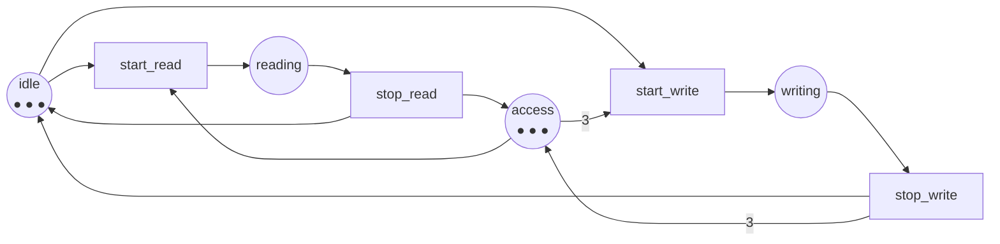

Full code: [`code/petri-nets`](https://github.com/spareilleux/learn/tree/main/code/petri-nets). This lesson is printed by `dotnet run --project Examples -c Release -- l7`, compared with [`expected/l7.txt`](https://github.com/spareilleux/learn/blob/main/code/petri-nets/expected/l7.txt).

The first six lessons built the machinery. This one spends it on the five patterns every concurrent program is made of, and puts each net beside the construct you already reach for: [`lock`](https://learn.microsoft.com/dotnet/csharp/language-reference/statements/lock), [`SemaphoreSlim`](https://learn.microsoft.com/dotnet/api/system.threading.semaphoreslim), [`Channel<T>`](https://learn.microsoft.com/dotnet/api/system.threading.channels.channel), [`ReaderWriterLockSlim`](https://learn.microsoft.com/dotnet/api/system.threading.readerwriterlockslim), and in Java [`synchronized`](https://docs.oracle.com/javase/specs/jls/se21/html/jls-14.html), [`ReentrantLock`](https://docs.oracle.com/en/java/javase/21/docs/api/java.base/java/util/concurrent/locks/ReentrantLock.html), [`Semaphore`](https://docs.oracle.com/en/java/javase/21/docs/api/java.base/java/util/concurrent/Semaphore.html), [`ArrayBlockingQueue`](https://docs.oracle.com/en/java/javase/21/docs/api/java.base/java/util/concurrent/ArrayBlockingQueue.html) and [`ReentrantReadWriteLock`](https://docs.oracle.com/en/java/javase/21/docs/api/java.base/java/util/concurrent/locks/ReentrantReadWriteLock.html).

The [advanced C# course](../../csharp-advanced/) spent lessons [6](../../csharp-advanced/06-channels/), [7](../../csharp-advanced/07-tpl-dataflow/) and [8](../../csharp-advanced/08-rx-net/) measuring backpressure. This lesson models it instead, and the thing that was measured there is one place here.

| pattern | the net | the construct |
|---|---|---|
| a lock | one token in a place both threads read | `lock`, `Monitor`, `synchronized`, `ReentrantLock` |
| a counting semaphore | *k* tokens in that place | `new SemaphoreSlim(k)`, `new Semaphore(k)` |
| a bounded channel | a place holding the free slots | `Channel.CreateBounded(k)`, `new ArrayBlockingQueue(k)` |
| a reader/writer lock | an arc of weight *n* to the same place | `ReaderWriterLockSlim`, `ReentrantReadWriteLock` |
| the philosophers | a ring of shared places | any resource ordering you have argued about |

## A lock is one token

Lesson 4 built the net and lesson 5 computed its invariants. Put them together and the lock stops being a convention:

```
== One lock, and the invariant that is the proof ==
invariants of mutual-exclusion
  place invariants (3):
    idle1 + critical1 = 1
    critical1 + critical2 + mutex = 1
    idle2 + critical2 = 1
  transition invariants (2):
    enter1 + leave1
    enter2 + leave2
markings where both threads are inside: 0 out of 3
```

`critical1 + critical2 + mutex = 1` is the specification of a mutex, written as arithmetic. Since none of the three counts can be negative, at most one of `critical1` and `critical2` is ever 1. The last line is the same claim checked by brute force on the three reachable markings, which is what you would do in a test; the invariant is what you would do in a proof, and it does not care how many markings there are.

The two transition invariants are the other half of the contract: `enter1 + leave1` says a thread that takes the lock gives it back. A net where `leave1` did not exist would have no such invariant, which is the model of a lock you forgot to release.

## k permits instead of one

Nothing about the net says the token is unique. Put *k* of them in and you have a counting semaphore:

```
== k permits instead of one: the counting semaphore ==
threads  permits  states  greatest number inside at once  invariant
      3        1       4                              1  permits + inside1 + inside2 + inside3 = 1
      3        2       7                              2  permits + inside1 + inside2 + inside3 = 2
      3        3       8                              3  permits + inside1 + inside2 + inside3 = 3
```

The invariant's right-hand side *is* the constructor argument. `new SemaphoreSlim(2)` is `permits = 2` at the initial marking and nothing else; the analyser then measures that no more than two of the three threads are ever inside, which is what the invariant already said.

Notice the middle column. Three threads and three permits gives 8 = 2³ markings, because the semaphore has stopped constraining anything — every thread is independently in or out. Two permits gives 7: exactly the one marking with all three inside removed. The number of markings a concurrency primitive removes is a fair measure of how much it is doing.

## A bounded channel is the place `free`

The running example of this course has been a bounded channel since lesson 1, and the place `free` has been the bound since lesson 1 too:

```
== A bounded channel is the place free ==
capacity  states  bound of full  invariant
       1       8              1  free + full = 1
       2      12              2  free + full = 2
       3      16              3  free + full = 3
       4      20              4  free + full = 4
```

`Channel.CreateBounded<T>(new BoundedChannelOptions(k))` is `free = k`. A producer that blocks on `WriteAsync` is the transition `deposit` not being enabled, because `free` holds nothing. That is the whole of backpressure, and it is one place.

Two things the table makes concrete. The state count grows *linearly* with the capacity, 4·(*k*+1), not exponentially — a bounded queue is a cheap thing to model. And the bound of `full` is always the capacity, proved by `free + full = k` without the graph, which is the lesson-5 proof restated for every *k* at once.

What the net does *not* model is time. It says the producer can be blocked, never how long, and it has no opinion about whether `Channel.CreateBounded` with `BoundedChannelFullMode.DropOldest` is the right choice. Lesson 9 adds time and the question becomes answerable.

## Readers and writers: one arc of weight 3

The first net in this course with a weighted arc. Three permits in `access`; a reader takes one; a writer takes all three:

```
net readers-writers
places      idle reading writing access
transitions start_read stop_read start_write stop_write
M0          (3, 0, 0, 3) = idle:3 access:3
arc         idle -> start_read
arc         access -> start_read
arc         start_read -> reading
arc         reading -> stop_read
arc         stop_read -> idle
arc         stop_read -> access
arc         idle -> start_write
arc         access -> start_write (weight 3)
arc         start_write -> writing
arc         writing -> stop_write
arc         stop_write -> idle
arc         stop_write -> access (weight 3)
```



The invariants say what the lock guarantees:

```
invariants of readers-writers
  place invariants (2):
    idle + reading + writing = 3
    reading + 3*writing + access = 3
  transition invariants (2):
    start_read + stop_read
    start_write + stop_write
```

`reading + 3*writing + access = 3` carries the whole policy. `writing` is at most 1, because 3·`writing` cannot exceed 3. And when `writing` is 1, both `reading` and `access` are 0 — a writer excludes every reader *and* every other writer, not by a rule somebody remembered to enforce but by arithmetic. The weight 3 on the arc is the exclusion.

The behaviour confirms it:

```
properties of readers-writers
  bound of idle: 3
  bound of reading: 3
  bound of writing: 1
  bound of access: 3
  bounded:       yes (3-bounded)
  safe:          no
  deadlock-free: yes
  live:          yes
    start_read L4, live
    stop_read  L4, live
    start_write L4, live
    stop_write L4, live
  reversible:    yes
  home states:   (3, 0, 0, 3) (2, 1, 0, 2) (2, 0, 1, 0) (1, 2, 0, 1) (0, 3, 0, 0)
  persistent:    no
markings with a writer and a reader at once: 0
markings with two writers at once: 0
```

Safe, no; live, yes; deadlock-free, yes. Everything a reader/writer lock is supposed to be.

## Live and starved at the same time

And now the part worth the whole lesson. `start_write` is L4 — from every reachable marking, some sequence fires it. Here is the same net, from the same graph:

```
== Live and starved at the same time ==
start_write is live: True
and yet the net can run for ever without ever firing it:
  M3 = (1, 2, 0, 1)  --start_read-->
  M4 = (0, 3, 0, 0)  --stop_read-->
```

Two markings and two firings, going round for ever: a reader starts, a reader stops, and `access` never comes back to 3, so the writer never gets in. Every marking on that cycle can *reach* a marking where `start_write` is enabled — that is what L4 means — and the net is under no obligation to go there.

This is the writer starvation every reader/writer lock has to deal with, and it is exactly what plain liveness does **not** forbid. Liveness is "always possible"; starvation is about "eventually happens", which is a *fairness* assumption on the scheduler, not a property of the net. A Petri net has no scheduler. Say it in the two vocabularies:

- **Petri nets**: L4 liveness is a branching-time property of the reachability graph; the absence of an infinite run avoiding *t* is a different, stronger property, and it needs a fairness constraint to become true.
- **C#**: `ReaderWriterLockSlim` documents a policy for exactly this, and `new ReaderWriterLockSlim(LockRecursionPolicy.NoRecursion)` says nothing about writer preference. Java's `ReentrantReadWriteLock` takes a `fair` flag in its constructor, and that flag is the scheduler assumption this net does not have.

The analyser finds the cycle with a depth-first search over the reachability graph with `start_write` deleted from it ([`ReachabilityGraph.CycleAvoiding`](https://github.com/spareilleux/learn/blob/main/code/petri-nets/PetriNets/ReachabilityGraph.cs)). Any such cycle reachable from *M0* is a run in which the transition never fires. It is a small function and a useful habit: when a property says "always eventually", ask the graph for the run where it does not.

## The philosophers, one fork at a time

Lesson 3 counted the markings of the philosophers taking both forks in a single transition, and found the Lucas numbers. That net never deadlocks, because the atomic transition is a lie: it takes two locks with one instruction.

Take them one at a time, as real code does, and:

```
== The philosophers, with and without one fork at a time ==
philosophers  both forks at once        one fork at a time       one of them reversed
              states  deadlocks          states  deadlocks         states  deadlocks
           2       3          0               6          1              5          0
           3       4          0              14          1             12          0
           4       7          0              34          1             29          0
           5      11          0              82          1             70          0
           6      18          0             198          1            169          0
```

Three columns, one lesson each.

**Left**: the atomic model. No deadlock at any size, and the smallest state space — the Lucas numbers 3, 4, 7, 11, 18 of lesson 3's journal.

**Middle**: one fork at a time. Exactly **one** deadlock marking at every size, and a state space that pulls away from the atomic one as the ring grows: twice as many markings at two philosophers, eleven times as many at six. That single dead marking is the one everybody draws:

```
== The deadlock of five philosophers, and how to reach it ==
dead markings: 1 out of 82
M78 = holding1:1 holding2:1 holding3:1 holding4:1 holding5:1
  reached by: take_first1, take_first2, take_first3, take_first4, take_first5
  places holding nothing: 15 of 20, every fork among them
  that set is a siphon: True
  largest trap inside it: {}
```

Five firings, one per philosopher, all picking up their left fork. Every fork is gone, and lesson 6's theorem names the thing that happened: the empty places form a siphon with no trap inside it, so once it is empty it is empty for ever.

**Right**: the fix. Philosopher 5 reaches for the right fork first, and the deadlock disappears at every size. The structure says why, without any marking:

```
three philosophers, one fork at a time: 7 minimal siphons, 1 of them with no marked trap
  {eating1, fork1, eating2, fork2, eating3, fork3}
with one of them reversed: 6 minimal siphons, 0 of them with no marked trap
```

Reversing one philosopher does not add a guard, a timeout or a retry. It **removes a siphon** — the one containing every fork and every `eating` place, the only one with no marked trap. What is left has a marked trap in every siphon, which by the implication proved in lesson 6 is a proof of deadlock-freedom.

That is Dijkstra's answer from 1971 ([*Hierarchical ordering of sequential processes*](https://doi.org/10.1007/BF00289519)), and it is the same answer as lesson 4's exercise about two locks: impose a total order on the resources. Here you can watch what the order does to the structure.

## What the net says and what it does not

Worth being explicit, because this is where modelling goes wrong:

- **it does not model time.** No timeout, no backoff, no "the lock is usually free". Lesson 9 adds that.
- **it does not model fairness.** The writer starves in a live net; the philosophers can all be polite for ever. A net says what *can* happen, never what *will*.
- **it does not model re-entrancy.** `lock (gate)` taken twice by the same thread is fine in C# and is a deadlock in this net. Modelling it needs a token per thread, and the model grows.
- **it does model contention exactly.** Which is the one thing load tests are worst at, because they only ever show you interleavings that happened.

## Key takeaways

- A **lock** is one token in a shared place; the invariant `critical1 + critical2 + mutex = 1` is the proof, and it is the same statement as the specification.
- A **counting semaphore** is *k* tokens in that place. The right-hand side of the invariant is the constructor argument.
- A **bounded channel** is a place holding the free slots. Blocking is a transition that is not enabled; the state count grows linearly with the capacity.
- A **reader/writer lock** is an arc of weight *n*. `reading + 3*writing + access = 3` proves a writer excludes everybody, arithmetically.
- **Live does not mean fair.** `start_write` is L4 and the net still has an infinite run that never fires it. Fairness is an assumption about the scheduler; `ReentrantReadWriteLock(true)` is where Java puts it.
- **Taking forks one at a time introduces exactly one deadlock**, at every size. Reversing one philosopher removes the siphon that has no marked trap, which is what "order your locks" does structurally.

## Exercises

1. The mutual exclusion net has three markings; the counting semaphore with 3 threads and 3 permits has eight. Explain the difference in one sentence, and say what it means for testing.
2. Model a lock that a thread forgets to release: take the mutual exclusion net and remove `leave1`. Which property of lesson 4 breaks first, and what happens to the transition invariants of lesson 5?
3. A colleague proposes fixing the philosophers with a timeout: a philosopher holding one fork for too long puts it down and retries. Is that net deadlock-free? Is it live? Which of the two is the property the colleague actually wants, and which one does the fix fail to give?
4. The readers and writers net allows three simultaneous readers because `access` starts with three tokens and a reader takes one. What would change if a reader took two? Predict the invariant and the bound of `reading`, then say which real lock that models.

<details>
<summary>Solutions</summary>

**1.** With as many permits as threads the semaphore constrains nothing, so the three threads are independent and the markings multiply: 2³ = 8. With one permit they are coupled and only 4 of those 8 survive. For testing, the count *is* the interleaving space: a test suite against the 3-permit version is exploring eight states with no contention in any of them, which is why a semaphore sized to the thread count passes every test and protects nothing.

**2.** The analyser builds that net as `mutual-exclusion-leaky` and prints:

```
  deadlock-free: no
    dead marking (0, 1, 1, 0, 0)  critical1:1 idle2:1
  live:          no
    enter1     L1, can fire once
    enter2     L2/L3, can fire for ever but not from everywhere
    leave2     L2/L3, can fire for ever but not from everywhere
  reversible:    no
  home states:   (0, 1, 1, 0, 0)
invariants of mutual-exclusion-leaky
  place invariants (3):
    idle1 + critical1 = 1
    critical1 + critical2 + mutex = 1
    idle2 + critical2 = 1
  transition invariants (1):
    enter2 + leave2
siphons of mutual-exclusion-leaky: 3 minimal siphons
  siphon {idle1}
    largest trap inside it: {}  marked at M0: no
  siphon {idle2, critical2}
    largest trap inside it: {idle2, critical2}  marked at M0: yes
  siphon {critical2, mutex}
    largest trap inside it: {}  marked at M0: no
  every siphon contains a marked trap: no
  minimal traps: {critical1} {idle2, critical2}
```

**Liveness** breaks first — `enter1` drops to L1, and the other two to L2/L3 — and deadlock-freedom goes with it: the marking where thread 1 sits in its critical section and thread 2 is idle has nothing enabled, and it is the only home state, which is the worst possible thing for a home state to be.

Two of the earlier lessons show the same damage from their own angle. In lesson 5's terms, the transition invariant `enter1 + leave1` has disappeared: there is no longer any multiset of firings involving `enter1` that cancels out, and that missing invariant *is* the missing `finally` block. In lesson 6's terms, two of the three minimal siphons now contain no trap at all — `{critical2, mutex}`, the lock and the only thread that can still hold it, and `{idle1}`, which thread 1 leaves once and never returns to.

I had predicted `{critical1, critical2, mutex}` and got neither of the two. `{critical1}` turns out to be a *trap* rather than part of a siphon, since nothing empties it. That is the third time in this course that recomputing beat remembering.

**3.** I have not built this net, so what follows is an argument rather than a measurement — *to verify*. It should be deadlock-free and still not live in the sense the colleague wants. With timeouts something can always fire — put a fork down, pick it up again — so no marking is dead. But every philosopher can time out at the same instant, put their fork down and take it again, for ever: `eat` stays L4, and there is an infinite run in which nobody eats, exactly like the writer starving above. That is livelock. The colleague wants "everybody eventually eats", which is a fairness property no plain P/T net expresses; the timeout buys "the system never stops", which is deadlock-freedom. Lesson 4 warned that deadlock-free is weaker than live, and this is the version of that warning that costs money in production.

**4.** The invariant becomes `2*reading + 3*writing + access = 3`, so `reading` is at most 1 and `writing` is at most 1, and both cannot be 1 at once since 2 + 3 > 3. That is not a reader/writer lock any more — it is a plain mutex with two different ways of entering it, which is what you get when the "shared" mode is not actually shareable. The realistic version is the opposite change: give `access` more tokens than there are readers, and the reader side stops being a constraint at all, which is the `new SemaphoreSlim(int.MaxValue)` that people write when they mean "no limit" and then wonder why the downstream service falls over.

</details>

## Sources

- Edsger W. Dijkstra, *Hierarchical ordering of sequential processes*, **Acta Informatica** 1(2), 1971, pages 115–138, [doi:10.1007/BF00289519](https://doi.org/10.1007/BF00289519). The dining philosophers and the ordering that resolves them. Record confirmed through Crossref; paper not read. *To verify.*
- Tadao Murata, *Petri nets: Properties, analysis and applications*, **Proceedings of the IEEE** 77(4), April 1989, pages 541–580, [doi:10.1109/5.24143](https://doi.org/10.1109/5.24143), section III for these modelling patterns. Paywalled and not read. *To verify.*
- [`SemaphoreSlim`](https://learn.microsoft.com/dotnet/api/system.threading.semaphoreslim), [`Channel`](https://learn.microsoft.com/dotnet/api/system.threading.channels.channel) and [`ReaderWriterLockSlim`](https://learn.microsoft.com/dotnet/api/system.threading.readerwriterlockslim) on Microsoft Learn; [`ReentrantReadWriteLock`](https://docs.oracle.com/en/java/javase/21/docs/api/java.base/java/util/concurrent/locks/ReentrantReadWriteLock.html) and [`ArrayBlockingQueue`](https://docs.oracle.com/en/java/javase/21/docs/api/java.base/java/util/concurrent/ArrayBlockingQueue.html) in the Java SE 21 API, for the `fair` flag this lesson calls a scheduler assumption.
- The backpressure this lesson models rather than measures: [advanced C#, lessons 6 to 9](../../csharp-advanced/06-channels/).
