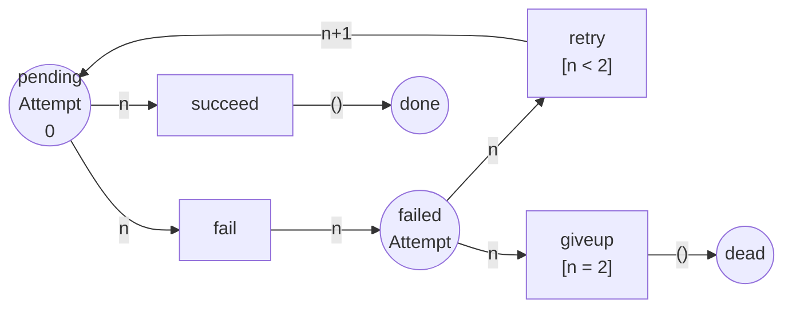

Full code: [`code/petri-nets`](https://github.com/spareilleux/learn/tree/main/code/petri-nets). This lesson is printed by `dotnet run --project Examples -c Release -- l8`, compared with [`expected/l8.txt`](https://github.com/spareilleux/learn/blob/main/code/petri-nets/expected/l8.txt).

Everything so far has been built out of tokens that are indistinguishable. A token in `full` means "there is an item in the buffer" and nothing else — not which item, not how big, not how many times it has already been tried.

That is the same restriction as writing a queue of `object` and casting, or an `ArrayList` before [generics](https://learn.microsoft.com/dotnet/csharp/fundamentals/types/generics). It works, and it forces you to encode everything you want to distinguish as *more places*.

A **coloured Petri net** gives the token a value. Each place has a **colour set** — a type — and holds tokens of that type; each transition has variables, a **guard**, and **arc expressions** saying which colour it takes and which it gives. The model stops repeating itself, exactly the way `Channel<T>` stops you writing `ChannelOfOrder` and `ChannelOfInvoice`.

The payoff and the catch are both in this lesson: the folding is real, and it is a folding of the *picture*, not of the state space.

## A retry policy with a dead-letter place

The example is one every message-based system has. A delivery is pending; it succeeds, or it fails; a failure is retried until an attempt limit, after which it goes to the dead-letter place. Four places, four transitions, and the token carries the attempt it is on:

```
== A retry policy, in colour ==
coloured net retry
  colset Attempt = {0, 1, 2}
  place       pending : Attempt
  place       failed : Attempt
  place       done : UNIT
  place       dead : UNIT
  transition  succeed  var n : Attempt
  transition  fail  var n : Attempt
  transition  retry  var n : Attempt  [n < 2]
  transition  giveup  var n : Attempt  [n = 2]
  arc         pending -> succeed   n
  arc         succeed -> done   ()
  arc         pending -> fail   n
  arc         fail -> failed   n
  arc         failed -> retry   n
  arc         retry -> pending   n+1
  arc         failed -> giveup   n
  arc         giveup -> dead   ()
  M0          pending: 0
```



Four pieces of vocabulary, each with a direct translation:

| coloured net | C# |
|---|---|
| a **colour set** `Attempt = {0, 1, 2}` | the type parameter: `record Delivery(int Attempt)` |
| a **variable** `var n : Attempt` | the pattern that binds the payload |
| a **guard** `[n < 2]` | the `when` clause of a `switch` arm |
| an **arc expression** `n+1` | the projection you write in the body |

`UNIT` is the colour set with one value. A place of colour `UNIT` holds tokens that carry nothing, which is precisely a place of an ordinary net — so P/T nets are the coloured nets whose every place is `UNIT`, and nothing in lessons 1 to 7 has been thrown away.

## The token that knows which attempt it is on

The analyser has a firing rule of its own for coloured nets ([`Coloured.cs`](https://github.com/spareilleux/learn/blob/main/code/petri-nets/PetriNets/Coloured.cs)): a transition is enabled under a *binding* of its variable when the guard holds and every input place has a token of the colour the arc expression computes.

```
== A token that carries the attempt it is on ==
            pending: 0
fail(n=0)   failed: 0
retry(n=0)  pending: 1
fail(n=1)   failed: 1
retry(n=1)  pending: 2
fail(n=2)   failed: 2
giveup(n=2) dead
```

One token throughout, and its colour is the state of the retry. The line `retry(n=0)  pending: 1` is the arc expression `n+1` doing what a P/T net has no way of expressing: arithmetic on the token.

And `giveup` fires only once `n` is 2, because its guard says so. Without the guard, a delivery would go to the dead-letter place on its first failure; without `retry`'s guard `[n < 2]`, the expression `n+1` would run off the end of the colour set. The guard is not documentation — it decides which bindings exist at all.

## The unfolding: the same net, without colour

Every coloured net over **finite** colour sets is an ordinary P/T net in disguise. `Unfold()` writes it out: one place per (place, colour), one transition per (transition, binding the guard accepts).

```
== The same net without colour: its unfolding ==
net retry
places      pending_0 pending_1 pending_2 failed_0 failed_1 failed_2 done dead
transitions succeed_0 succeed_1 succeed_2 fail_0 fail_1 fail_2 retry_0 retry_1 giveup_2
M0          (1, 0, 0, 0, 0, 0, 0, 0) = pending_0:1
arc         pending_0 -> succeed_0
arc         succeed_0 -> done
arc         pending_1 -> succeed_1
arc         succeed_1 -> done
arc         pending_2 -> succeed_2
arc         succeed_2 -> done
arc         pending_0 -> fail_0
arc         fail_0 -> failed_0
arc         pending_1 -> fail_1
arc         fail_1 -> failed_1
arc         pending_2 -> fail_2
arc         fail_2 -> failed_2
arc         failed_0 -> retry_0
arc         retry_0 -> pending_1
arc         failed_1 -> retry_1
arc         retry_1 -> pending_2
arc         failed_2 -> giveup_2
arc         giveup_2 -> dead
```

Read the transition list. `retry` became `retry_0` and `retry_1` — two of the three bindings — and `giveup` became `giveup_2` alone. The guards did not survive as guards; they were *evaluated away*, and what is left is the net you would have drawn by hand if you had never heard of colour. The unfolding is written to [`nets/retry.pnml`](https://github.com/spareilleux/learn/blob/main/code/petri-nets/nets/retry.pnml) like every other net of this course, so any P/T tool can read it.

That is the whole relationship, and it is worth stating plainly: **for finite colour sets, coloured nets add no expressive power.** They add notation. The unit tests check that firing a coloured transition and firing its unfolded twin give the same marking, so the folding is not just a claim in this lesson.

## What the folding actually buys

Here is the measurement. The same policy, with the attempt limit growing:

```
== What the unfolding costs ==
attempts  coloured places  coloured transitions  unfolded places  unfolded transitions  markings
       2                4                     4                8                     9         8
       3                4                     4               10                    12        10
       5                4                     4               14                    18        14
      10                4                     4               24                    33        24
      20                4                     4               44                    63        44
```

The two left columns never move. The coloured model of a policy with twenty retries is the same four places and four transitions as the model with two; only the colour set grew, and a colour set is a declaration.

The three right columns grow linearly, and the last one is the point. **The number of reachable markings is unchanged by the folding** — it is the same 2·*k*+4 whether you wrote the model in colour or by hand, because a coloured marking *is* a vector over (place, colour) pairs. Colour saves you from drawing the model. It saves you nothing at all in analysis.

That is the honest summary of the extension, and it is the reason lesson 15 is about reduction techniques rather than about notation. If your model has a hundred message types, colour turns a hundred copies of a diagram into one diagram; the state space still has the hundred copies in it, and the tools that cope — [CPN Tools](https://cpntools.org/) with symmetry and equivalence reductions — cope by exploiting the symmetry the colour made visible, not by ignoring it.

## What the unfolding then says

Once unfolded, every question of lessons 3 to 6 applies unchanged:

```
reachability graph of retry: 8 states, 9 firings
places pending_0 pending_1 pending_2 failed_0 failed_1 failed_2 done dead
  M0 = (1, 0, 0, 0, 0, 0, 0, 0)  pending_0:1
  M1 = (0, 0, 0, 0, 0, 0, 1, 0)  done:1
  M2 = (0, 0, 0, 1, 0, 0, 0, 0)  failed_0:1
  M3 = (0, 1, 0, 0, 0, 0, 0, 0)  pending_1:1
  M4 = (0, 0, 0, 0, 1, 0, 0, 0)  failed_1:1
  M5 = (0, 0, 1, 0, 0, 0, 0, 0)  pending_2:1
  M6 = (0, 0, 0, 0, 0, 1, 0, 0)  failed_2:1
  M7 = (0, 0, 0, 0, 0, 0, 0, 1)  dead:1
  M0 --succeed_0--> M1
  M0 --fail_0--> M2
  M2 --retry_0--> M3
  M3 --succeed_1--> M1
  M3 --fail_1--> M4
  M4 --retry_1--> M5
  M5 --succeed_2--> M1
  M5 --fail_2--> M6
  M6 --giveup_2--> M7
  dead marking M1 = (0, 0, 0, 0, 0, 0, 1, 0)  done:1
  dead marking M7 = (0, 0, 0, 0, 0, 0, 0, 1)  dead:1
```

Eight markings, and two of them dead. For once that is not a bug: a delivery is *supposed* to end, in `done` or in `dead`, and a net that models a finite process has to have dead markings. The properties say so bluntly:

```
  bounded:       yes (1-bounded)
  safe:          yes
  deadlock-free: no
    dead marking (0, 0, 0, 0, 0, 0, 1, 0)  done:1
    dead marking (0, 0, 0, 0, 0, 0, 0, 1)  dead:1
  live:          no
    succeed_0  L1, can fire once
    ...
  reversible:    no
  home states:   none
```

Everything L1, nothing live, no home state, not reversible. Read against lesson 4 this looks like a catastrophe, and against the system it models it is correct: the retry policy terminates, it never loops for ever, and there are exactly two ways for it to end. Lesson 10 gives this shape its own name — a workflow net — and its own correctness property, soundness, which asks precisely that every run ends in one of the intended final markings and that nothing is left behind.

Two more things this reading gives for free. Every message reaches an end, because the graph is acyclic and finite. And nothing is left behind: every dead marking has exactly one token, in `done` or in `dead`, with all six other places empty — no half-processed delivery stuck in `failed_1`.

## The guard is what removes the bindings

```
== The guard is what removes the bindings ==
succeed    guard (none)   bindings kept: n=0 n=1 n=2
fail       guard (none)   bindings kept: n=0 n=1 n=2
retry      guard n < 2    bindings kept: n=0 n=1
giveup     guard n = 2    bindings kept: n=2
```

Nine transitions in the unfolding rather than twelve, because two guards removed three bindings between them. A guard in a coloured net is a *static* filter on the unfolding — it never appears at run time, it decides what exists.

That is a real difference from the `when` clause it corresponds to in C#. `case Delivery { Attempt: < 2 }` is evaluated when the message arrives; `[n < 2]` is evaluated when the model is built. Two things follow: a guard can only mention the transition's own variables, and a coloured net with an expensive guard costs nothing at run time and everything at unfolding time.

## Where the colour stops

- **Infinite colour sets.** Nothing above needed the colour set to be small, but it did need it to be *finite*. An `Attempt` ranging over all the natural numbers cannot be unfolded, and coloured nets over infinite colour sets are Turing-complete — every question of lesson 4 becomes undecidable. In practice the tools either bound the colour set or accept that they are model-checking a program.
- **One variable per transition.** The analyser of this course binds one variable per transition, which is enough for the retry and not enough for a transition that joins two different messages. Real coloured nets bind a tuple, and their unfolding grows as the product of the colour sets rather than the sum.
- **The state space is still there.** Said three times in this lesson because it is the thing people get wrong about the extension.

The standard is [ISO/IEC 15909-1:2019](https://www.iso.org/standard/67235.html), which defines high-level nets and the *symmetric nets* subclass — roughly, coloured nets whose colour sets and expressions are restricted enough that the symmetry can be exploited automatically. The reference implementation is [CPN Tools](https://cpntools.org/), whose inscriptions are written in CPN ML, a dialect of Standard ML: in that world, arc expressions are real functions and colour sets are real types, and the notation of this lesson is the small corner of it that unfolds.

## Key takeaways

- A **coloured net** gives tokens a value. A place has a **colour set** (a type), a transition has a variable, a **guard** and **arc expressions**.
- `UNIT` is the one-value colour set, so every P/T net of lessons 1 to 7 is a coloured net whose places all have colour `UNIT`.
- Over **finite** colour sets, every coloured net **unfolds** into an ordinary P/T net: one place per colour, one transition per binding the guard accepts. No expressive power is gained.
- **Colour folds the model, not the state space.** Four places and four transitions at every attempt limit; the reachable markings still grow as 2·*k*+4.
- A **guard** is evaluated when the net is unfolded, not when a token arrives. It decides which transitions exist.
- The retry net is 1-bounded, has **two dead markings** and no live transition, and that is the correct answer for something that is supposed to end. Lesson 10 names that shape.
- Over **infinite** colour sets there is no unfolding and no decidability left.

## Exercises

1. Add a colour set `Priority = {low, high}` to the retry net so that a high-priority delivery is retried five times and a low-priority one once. How many places and transitions does the coloured model have, and how many does the unfolding have?
2. The unfolding has nine transitions and the coloured net has four. Which of the two would you rather hand to a colleague reviewing the retry policy, and which would you rather hand to a model checker? Say why in one sentence each.
3. Set the attempt limit to 0 and predict the unfolding before running it.
4. The lesson says colour saves nothing in analysis. Name the one situation in which that is false, and say what the tool has to know to exploit it.

<details>
<summary>Solutions</summary>

**1.** The coloured model keeps four places and gains nothing structurally: the colour set becomes a product, `Attempt × Priority`, the guard on `retry` becomes `n < limit(p)` and the one on `giveup` becomes `n = limit(p)`. Four places and four transitions, still. The unfolding is the product: `pending` and `failed` become 6 × 2 = 12 places each for an attempt range of 0 to 5, plus `done` and `dead`, and the transitions multiply the same way. That ratio — constant on the left, product on the right — is the whole argument for the notation, and the whole warning about what it hides.

**2.** The coloured one to the colleague: it is the policy, on one page, and the guard reads like the sentence the policy was written as. The unfolded one to the model checker, or rather to anything that has to reason about it: every technique in lessons 2 to 6 is defined on P/T nets, and the invariants, siphons and traps of the unfolding are the ones that carry the proofs. That is exactly what the analyser does — colour for the reader, unfolding for the analysis.

**3.** With the limit at 0 the colour set is `{0}`, `retry`'s guard `n < 0` accepts nothing and `giveup`'s guard `n = 0` accepts the only value. The analyser confirms it:

```
== Exercise 3: a guard no binding satisfies deletes the transition ==
retry keeps 0 bindings when the limit is 0
net retry-0
places      pending_0 failed_0 done dead
transitions succeed_0 fail_0 giveup_0
M0          (1, 0, 0, 0) = pending_0:1
```

Four places, three transitions: `retry` has vanished entirely from the unfolding. A transition whose guard no binding satisfies is not a transition that never fires — it is a transition that does not exist, which is a stronger and more useful statement than the L0 of lesson 4.

**4.** When the colours are **symmetric** — when permuting them maps the net onto itself. Then the state space can be quotiented by the symmetry group and the analysis runs on the equivalence classes, which is what CPN Tools' symmetry method and the symmetric nets of ISO/IEC 15909-1 are for. The tool has to know the symmetry, which means it has to be declared or inferable from restricted colour sets and expressions — and that restriction is the entire reason the *symmetric* subclass exists as a separate thing from coloured nets in general. In the retry net there is no symmetry to exploit: the attempts are ordered, and `n+1` breaks any permutation.

</details>

## Sources

- Kurt Jensen and Lars M. Kristensen, *Coloured Petri Nets: Modelling and Validation of Concurrent Systems*, Springer, 2009, [doi:10.1007/b95112](https://doi.org/10.1007/b95112). The reference for the formalism and for CPN Tools. Record confirmed through Crossref; not read. *To verify.*
- [CPN Tools](https://cpntools.org/), the implementation, and CPN ML, the inscription language.
- [ISO/IEC 15909-1:2019](https://www.iso.org/standard/67235.html), *Systems and software engineering — High-level Petri nets — Part 1: Concepts, definitions and graphical notation*, which is where the high-level and symmetric net classes are defined. The record was checked on iso.org; the standard costs CHF 227 and I have not read it. *To verify.*
- The implementation this lesson prints: [`Coloured.cs`](https://github.com/spareilleux/learn/blob/main/code/petri-nets/PetriNets/Coloured.cs), with the unfolding and the tests that check a coloured firing against its unfolded twin.
