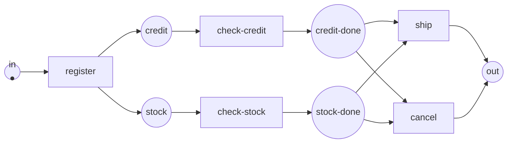

Full code: [`code/petri-nets`](https://github.com/spareilleux/learn/tree/main/code/petri-nets). This lesson is printed by `dotnet run --project Examples -c Release -- l10`, compared with [`expected/l10.txt`](https://github.com/spareilleux/learn/blob/main/code/petri-nets/expected/l10.txt).

The nets of the previous nine lessons run for ever. A producer produces, a consumer consumes, a lock is taken and released, and the interesting question is whether that can go wrong in the next hour or the next year.

A business process is the other shape entirely. An order arrives, something happens to it, and it leaves. It has one way in and one way out, it is supposed to end, and the question is not whether it deadlocks in general but whether **this case** — this order, this claim, this ticket — reaches the end with nothing left behind.

That shape has a name, a definition small enough to check, and a correctness property called **soundness** that a program can decide. It is also the part of Petri net theory that escaped into industry: every workflow engine and every BPMN diagram is one translation away from what this lesson does.

## One way in, one way out

A **workflow net** is an ordinary Petri net with three restrictions:

1. one **source** place, with no incoming arc — the case arrives there;
2. one **sink** place, with no outgoing arc — the case leaves there;
3. every node is on a path from the source to the sink, so nothing is unreachable and nothing is a dead end.

The third condition sounds harder to check than it is. Add one transition from the sink back to the source — the **short circuit** — and it becomes exactly "this net is strongly connected", which the analyser has decided since [lesson 6](../06-structural-classes/).

Here is an order, in the shape almost every process has: a registration, two checks that run at the same time, and a decision at the end.

```
== An order, as a workflow net ==
net order-sound
places      in credit stock credit-done stock-done out
transitions register check-credit check-stock ship cancel
M0          (1, 0, 0, 0, 0, 0) = in:1
arc         in -> register
arc         register -> credit
arc         register -> stock
arc         credit -> check-credit
arc         check-credit -> credit-done
arc         stock -> check-stock
arc         check-stock -> stock-done
arc         credit-done -> ship
arc         stock-done -> ship
arc         ship -> out
arc         credit-done -> cancel
arc         stock-done -> cancel
arc         cancel -> out
```



```
== What makes it a workflow net ==
source: in
sink:   out
why not: (it is one)
short-circuited net adds: t-star
```

Two shapes are worth naming because they are the two gateways of every process notation:

- **`register` is an AND split**: one transition with two output places. Both branches start, and they run concurrently — the marking after `register` holds two tokens, which is the thing a state machine cannot say.
- **the choice between `ship` and `cancel` is an XOR split**: two transitions competing for the same tokens. Exactly one fires. That the choice is *free* here — both transitions see the same input places — makes this a free-choice net, which [lesson 6](../06-structural-classes/) has theorems about.

A join is the same two shapes reversed: an AND join is one transition waiting on several places, an XOR join is one place fed by several transitions.

## Soundness, in three conditions

A workflow net is **sound** when, started with one token in the source:

1. **option to complete** — from every reachable marking, the marking with one token in the sink is still reachable. The case can always still finish;
2. **proper completion** — no reachable marking puts a token in the sink while something else is still running. Finishing means finished;
3. **no dead transitions** — every task can be executed by some case. A task no case can reach is either a bug or a lie in the diagram.

The order above satisfies all three:

```
== Soundness, condition by condition ==
net: order-sound
  reachable markings:  6
  option to complete:  yes
  proper completion:   yes
  no dead transitions: yes
  sound: yes
```

Six markings for a process with two concurrent branches. Notice that the analyser reports the condition that fails and the marking that breaks it, not a verdict: "unsound" on its own is not something a process owner can act on.

## The commonest error in BPMN

Split with AND, join with XOR. It reads perfectly in a diagram — *check the credit, check the stock, then finish* — and it is wrong:

```
== An AND split joined by an XOR: the case ends while a branch is still running ==
net: order-and-xor
  reachable markings:  10
  option to complete:  no
    the final marking is never reached, from anywhere
  proper completion:   no
    finishes with something left: (0, 0, 1, 0, 0, 1); (0, 1, 0, 0, 0, 1); (0, 0, 0, 0, 1, 1); and 2 more
  no dead transitions: yes
  sound: no
```

Both branches got a token; either one of them alone declares the case finished. So the sink gets its token while the other branch is still working, and later gets a second one. `(0, 0, 0, 0, 0, 2)` is in that list: **two** tokens in the sink, one order delivered twice.

Read the first line again: the final marking is never reached *from anywhere*. Not "some paths get stuck" — the correct end state does not exist in this net at all. Every task can still run, so a test that exercises each task passes. The defect is in the joining, and only the joining.

## The mirror error

Split with XOR, join with AND. The registration picks one branch; the shipment waits for both:

```
== An XOR split joined by an AND: the case stops one step short ==
net: order-xor-and
  reachable markings:  5
  option to complete:  no
    the final marking is never reached, from anywhere
  proper completion:   yes
  no dead transitions: no
    never enabled: ship
  sound: no
```

Proper completion holds — nothing is left behind, because nothing ever finishes. That pairing is worth keeping: a condition can be satisfied vacuously, and a checker that reported only "2 of 3 conditions hold" would be useless. The condition that fails names `ship` as a transition no case can ever reach, which is the sentence to take to whoever drew the diagram.

## Sound does not mean terminating

A review that can send the case back for rework:

```
== A rework loop: sound, and able to run for ever without finishing ==
net: order-rework
  reachable markings:  4
  option to complete:  yes
  proper completion:   yes
  no dead transitions: yes
  sound: yes
a cycle that never approves: review rework
```

The net is sound, and it contains a cycle in which `approve` never fires. A case can be reworked for ever.

This is the same distinction [lesson 4](../04-properties/) drew between liveness and starvation, in the vocabulary of processes: soundness says the case can **always still** finish, never that it **will**. If the requirement is "every case finishes", soundness is not it — you need a bound on the loop, which means putting the attempt count in the net, which is the coloured net of [lesson 8](../08-coloured-nets/), or a rate and a mean time, which is [lesson 9](../09-time-and-probability/).

## Decided twice

The three conditions above are checked on the reachability graph of the net. There is a completely different route to the same verdict.

**Van der Aalst's theorem (1997):** a workflow net is sound exactly when its short-circuited net — the one with a transition from the sink back to the source — is **live** and **bounded**.

Those are the two properties of [lesson 4](../04-properties/), computed by code that knows nothing about workflows:

```
== The same four verdicts through the short circuit ==
net              sound?  live?  bounded?  live and bounded?  agree?
order-sound      yes     yes    yes       yes                yes
order-and-xor    no      no     no        no                 yes
order-xor-and    no      no     yes       no                 yes
order-rework     yes     yes    yes       yes                yes
```

Four nets, two independent routes, four agreements — and a unit test fails if they ever stop agreeing. This is the same discipline as [lesson 9](../09-time-and-probability/)'s queue solved twice, and for the same reason: the interesting nets are the ones where only one route exists.

The theorem is not a coincidence, and the third column says why. Look at the broken net through its short circuit:

```
== What the short circuit is doing ==
order-and-xor-short-circuited: bound unbounded
  register        L1
  check-credit    L1
  check-stock     L1
  finish-credit   L1
  finish-stock    L1
  t-star          L1
```

**Unbounded.** Each case leaves a spare token behind, `t-star` feeds the sink's tokens back to the source, and the leftovers accumulate without limit. "Proper completion fails" and "the short circuit is unbounded" are the same fact told twice — a token left behind, seen once per case or accumulated over infinitely many.

And every transition is only L1, because the graph never finished: the analyser stopped at its limit, so it can only say each transition fires at least once. An unbounded net is not live, which is the other half of the theorem.

The mirror net short-circuits to something bounded but not live: nothing accumulates, and `ship` never fires. The two failures are different properties of the same short circuit, which is why the theorem needs both.

## Translating to and from BPMN

[BPMN 2.0](https://www.omg.org/spec/BPMN/2.0/) is the notation processes are actually drawn in. The core of it maps onto workflow nets directly:

| BPMN | Workflow net |
|---|---|
| Task, activity | Transition |
| Sequence flow | Place between two transitions |
| Parallel gateway (AND) split / join | Transition with several output / input places |
| Exclusive gateway (XOR) split / join | Place with several output transitions / place fed by several transitions |
| Start event | The source place |
| End event | The sink place |

What does not map is as important. **Inclusive gateways** (OR — *take any non-empty subset of the branches, then wait for exactly those*) have no local translation: the join has to know which branches were taken, which is not something a marking says. **Cancellation regions**, **boundary events** and **exception flows** remove tokens from wherever they happen to be, which an ordinary net cannot do — that needs a **reset net**, and reachability in reset nets is undecidable. **Data** and **resources** are not in the model at all.

That is the honest summary of the relationship: the control flow of a BPMN diagram is a workflow net, and everything the diagram says about data, roles, time and exceptions is not.

## The other direction: process mining

Everything above starts from a model. **Process mining** starts from the log — the event records a workflow engine, an ERP or a ticketing system already writes — and produces the model.

The three questions it asks are:

- **discovery**: what net explains this log? The α-algorithm reads the ordering relations between events and builds a workflow net from them; later algorithms handle noise and loops better.
- **conformance**: does the log fit the model, and does the model allow things the log never shows? The two numbers are *fitness* and *precision*, and they pull against each other — a net that allows everything fits every log perfectly.
- **enhancement**: put the measured durations and frequencies back on the net, which is the timing of [lesson 9](../09-time-and-probability/) taken from data instead of assumed.

None of that is implemented in this course. It is named here because it is where the formalism actually earns its living, and because the tool most of it happens in, [ProM](https://promtools.org/), speaks the same [PNML](https://www.pnml.org/) that lesson 11 exchanges nets in. *To verify: I have not run ProM.*

## Where this stops

- **Soundness has variants, and they disagree.** *Relaxed* soundness asks only that every transition lie on some path from source to sink. *Weak* soundness drops the dead-transition condition. *Generalised* soundness asks for *k* tokens in the source rather than one, which is a strictly stronger property and is what you want if cases share resources. Saying "the process is sound" without saying which is not saying much.
- **Deciding soundness is as expensive as the state space.** It is EXPSPACE-hard in general, like everything downstream of reachability. For **free-choice** workflow nets it is polynomial, via the rank theorem — and free choice is exactly the restriction "no task competes for a resource while also choosing a branch", which most drawn processes happen to satisfy. That is the practical reason the theory is usable at all.
- **One case at a time.** The whole of this lesson looks at one token entering the source. Real processes run thousands of cases through the same tasks, competing for the same people and the same machines, and that interaction is invisible here. Generalised soundness is the first step; a coloured net with a resource place is the honest model.

## Key takeaways

- A **workflow net** has one source, one sink, and nothing off the path between them. The third condition is "the short circuit is strongly connected".
- **Soundness** is three conditions: the case can always still finish, finishing leaves nothing behind, and no task is unreachable. A checker must name which one failed and where.
- The two gateway mismatches — **AND split with XOR join**, **XOR split with AND join** — break almost every process that is broken, and they fail *different* conditions. The first delivers the order twice; the second never delivers it.
- A condition can hold vacuously. `order-xor-and` completes properly because it never completes.
- **Sound does not mean terminating.** A rework loop is sound and can run for ever, exactly as a live transition can starve.
- **Van der Aalst's theorem** turns soundness into liveness plus boundedness of the short circuit — two properties from lesson 4, computed by code that knows nothing about processes. Use it as a check, not as a shortcut.
- A token left behind and an unbounded short circuit are the same defect, counted once or counted for ever.
- BPMN's parallel and exclusive gateways map onto nets exactly. Inclusive gateways, cancellation, data and resources do not.

## Exercises

1. The order net finishes with either `ship` or `cancel`. Add a step that must happen after both — an invoice — and say, before running it, whether the net is still sound and how many markings it has.
2. `order-and-xor` is unsound. Repair it by changing exactly one thing, and say which of the three conditions your repair fixes.
3. Take the producer and consumer of lesson 1. Is it a workflow net? Answer without running the analyser, then check.
4. A process has a task that can be cancelled while it runs, removing the case from wherever it has got to. Say why no arc you can add to a workflow net does that, and what the model would have to become.

<details>
<summary>Solutions</summary>

**1.** Still sound, and it gains exactly one marking. `ship` and `cancel` both feed a new place `decided`, a transition `invoice` takes it to `out`, and `out` stops being the target of two transitions.

```
net: ex1-invoice
  reachable markings:  7
  option to complete:  yes
  proper completion:   yes
  no dead transitions: yes
  sound: yes
```

I predicted 8 and the analyser said 7, which is worth admitting because the reason is the point of the exercise. A step in sequence adds **one** marking — the one where the token sits in `decided` — no matter what came before it. Only concurrency multiplies: the two checks are what turned two steps into four markings. Adding a task after a *correct* join costs one state; adding one inside a parallel branch costs a factor.

**2.** Replace the two finishing transitions by a single one that consumes both `credit-done` and `stock-done`. That turns the XOR join into an AND join and makes the net the `order-sound` net minus the choice. It fixes **proper completion** directly — nothing is left behind because nothing finishes early — and option to complete follows, because the final marking becomes reachable:

```
net: ex2-repaired
  reachable markings:  6
  option to complete:  yes
  proper completion:   yes
  no dead transitions: yes
  sound: yes
```

The instructive wrong repair is to make `out` hold at most one token by adding a place that limits it. That does not fix the process; it hides the second token by deadlocking the net instead, and the checker moves its complaint from proper completion to option to complete. A capacity constraint is not a correctness fix.

**3.** It is not. Every place of the producer and consumer has an incoming arc — `ready` from `deposit`, `free` from `take`, and so on — so there is no source, and by the same argument no sink. The analyser says so:

```
no place is a source: every place has an incoming arc, so nothing starts the case
```

That is not a defect in the net. It is the difference between a system, which runs for ever, and a case, which arrives and leaves. Most of the nets of this course are the first kind, and soundness is not a question you can ask about them at all.

**4.** An arc removes a fixed number of tokens from a *named* place. Cancellation has to remove whatever tokens exist, wherever they are, in an unknown subset of places — and the transition would have to be enabled regardless of how many there are, which no arc weight expresses. Encoding it by hand means one transition per possible configuration of the cancellation region, which is the state explosion written into the model instead of discovered by the analyser.

The model has to become a **reset net**, with arcs that empty a place whatever it holds. The price is severe and worth knowing: reachability is undecidable in reset nets, and boundedness with it. This is the clearest example in the course of an extension that buys expressiveness with the whole of the theory — which is the subject of lesson 15.

</details>

## Sources

- Wil van der Aalst, "Verification of Workflow Nets", in *Application and Theory of Petri Nets 1997*, Springer LNCS 1248, [doi:10.1007/3-540-63139-9_48](https://doi.org/10.1007/3-540-63139-9_48) — where workflow nets, soundness and the short-circuit theorem are defined. Record confirmed through Crossref; not read. *To verify.*
- Wil van der Aalst, "The Application of Petri Nets to Workflow Management", *Journal of Circuits, Systems and Computers* 8(1), 1998, [doi:10.1142/S0218126698000043](https://doi.org/10.1142/S0218126698000043) — the survey version, and the one usually cited for the BPMN correspondence. Record confirmed through Crossref; not read. *To verify.*
- Wil van der Aalst, *Process Mining: Data Science in Action*, 2nd edition, Springer, 2016, [doi:10.1007/978-3-662-49851-4](https://doi.org/10.1007/978-3-662-49851-4) — discovery, conformance and enhancement, and the algorithms named above. Record confirmed through Crossref; not read. *To verify.*
- [BPMN 2.0](https://www.omg.org/spec/BPMN/2.0/), the OMG specification the gateway table maps from.
- Verbeek, Basten and van der Aalst, "Diagnosing Workflow Processes using Woflan", *The Computer Journal* 44(4), 2001, [doi:10.1093/comjnl/44.4.246](https://doi.org/10.1093/comjnl/44.4.246) — the soundness checker whose habit of reporting *which* condition failed, and with which marking, this lesson's report imitates. Record confirmed through Crossref; not read, and Woflan itself has not been run here. *To verify.*
- [ProM](https://promtools.org/), the process mining toolkit Woflan now lives inside, and where the discovery and conformance algorithms above are implemented. Not run here. *To verify.*
- The implementation this lesson prints: [`Workflow.cs`](https://github.com/spareilleux/learn/blob/main/code/petri-nets/PetriNets/Workflow.cs), with the three conditions, the short circuit, and the tests that make the two routes agree.
