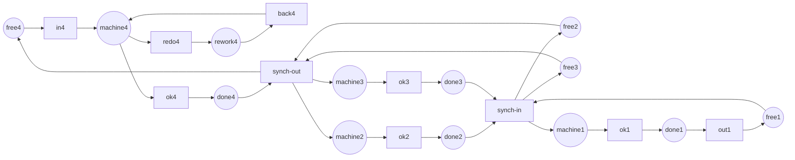

Full code: [`code/petri-nets`](https://github.com/spareilleux/learn/tree/main/code/petri-nets). This lesson is printed by `dotnet run --project Examples -c Release -- l12`, compared with [`expected/l12.txt`](https://github.com/spareilleux/learn/blob/main/code/petri-nets/expected/l12.txt).

A lesson called "industrial applications" usually means a bibliography: a list of papers in which somebody modelled a factory, and a claim that it went well. That is unfalsifiable, and it is not how the rest of this course works.

There is a better source. The [Model Checking Contest](https://mcc.lip6.fr/) is run every year at the Petri nets conference. Tools are given a public collection of models — 1 953 model instances in the 2026 edition — and asked the same thing about each of them, and the results are published in full, including the answers. The models come from manufacturing, from protocol design, from hardware, from systems biology. They are the industrial applications, as files.

So this lesson does what [lesson 11](../11-tools-and-interoperability/) started. It takes twenty-one of those instances, runs the analyser of this course on them, and compares each of four numbers with what the contest says. Every other lesson checks this analyser against itself; this one checks it against numbers computed by six other tools, on nets nobody here wrote.

## What the contest asks

The contest's *StateSpace* examination asks four numbers about a net:

- how many markings are reachable;
- how many arcs the reachability graph has;
- the most tokens any single place ever holds;
- the most tokens a whole marking ever holds.

An analyser that agrees on all four has the firing rule, the reader and the graph right. An analyser that agrees on the first and not the third has a subtler bug than any unit test in this repository would find.

The contest publishes an `estimated result` for each instance: the value a majority of the entered tools agree on, weighted by each tool's measured confidence rate. That column is the oracle for this lesson. It is rounded above a million, so for the two largest instances the digits used here are the ones `tedd`, `TY` and the 2025 gold medal each printed, in agreement.

## The five industries, and the one that is thin

```
== The contest's models, by industry ==
Model Checking Contest 2026, StateSpace examination, raw-result-analysis.csv
instance                        markings    arcs          what it models
-- manufacturing
FMS-PT-00002                    3444        16311         a flexible manufacturing system, three part types
Kanban-PT-00005                 2546432     24460016      four kanban cells, work released against a free card
SwimmingPool-PT-01              89621       450003        a swimming pool where bags and baskets are the resources
ResAllocation-PT-R003C003       92          257           processes taking shared resources in a fixed order
ResAllocation-PT-R010C002       6144        20480         the same, ten resources and two processes
-- protocols
TokenRing-PT-005                166         365           a token ring, the token being the right to speak
TokenRing-PT-010                58905       294050        the same ring with ten stations
Raft-PT-02                      7381        55824         the leader election of the Raft consensus algorithm
DrinkVendingMachine-PT-02       1024        7680          a vending machine and two customers
BridgeAndVehicles-PT-V04P05N02  2874        7160          a one-lane bridge with vehicles on both sides
Railroad-PT-005                 1838        7699          trains and a controller over a shared crossing
CircularTrains-PT-012           195         496           twelve trains on a circular track, one section each
-- hardware and shared memory
SharedMemory-PT-000005          1863        10395         processors contending for one memory bus
Dekker-PT-010                   6144        171530        Dekker's mutual exclusion, ten processes
Peterson-PT-2                   20754       62262         Peterson's mutual exclusion
DatabaseWithMutex-PT-02         153         312           database sites replicating under a mutex
-- biochemistry
ERK-PT-000001                   13          30            the ERK signalling pathway, one molecule of each species
ERK-PT-000010                   47047       372372        the same pathway, ten molecules of each
Angiogenesis-PT-01              110         288           the signalling that makes blood vessels grow
CircadianClock-PT-000001        128         624           the gene circuit of a circadian clock
-- security
QuasiCertifProtocol-PT-02       1029        3084          a certification protocol for electronic documents
```

The groups are mine; the models and the numbers are the contest's. Four of the five industries in this course's [outline](../) are well represented. **Security is not.** One instance, and it is a protocol rather than an access-control model. Whatever Petri nets are doing in security research, it is not arriving in this benchmark, and I am not going to pretend otherwise from a list of paper titles.

What each industry asks of the model is different, and the question decides which lesson of this course you need:

| Industry | What a token is | The question | Where it was answered |
|---|---|---|---|
| Manufacturing | a part, a pallet, a kanban card | can a buffer overflow; what is the throughput | [4](../04-properties/), [5](../05-invariants/), [9](../09-time-and-probability/) |
| Protocols | a message, a right to send | can it deadlock; does every station get a turn | [4](../04-properties/), [3](../03-the-reachability-graph/) |
| Hardware, shared memory | a request, a lock, a signal | is it safe; can two masters hold the bus | [4](../04-properties/), [7](../07-modelling-concurrency/) |
| Biochemistry | a molecule | which states are reachable at all; what is conserved | [3](../03-the-reachability-graph/), [5](../05-invariants/) |
| Security | a credential, a certificate | can this one bad marking be reached | [3](../03-the-reachability-graph/) |

Boundedness is the manufacturing question because a buffer that overflows is a factory floor covered in parts. Liveness is the protocol question because a protocol that deadlocks is a hung connection. In biochemistry nobody asks whether the model deadlocks — a chemical system reaching equilibrium is not a bug — they ask which species can coexist, and what the conservation laws are. Same formalism, five different reasons to open it.

## A factory, rebuilt here

The contest's Kanban model — [its own summary](https://mcc.lip6.fr/2026/pdf/Kanban-form.pdf) says it was extracted from a benchmark used for [SMART](https://www.smart.cs.iastate.edu/), and it has been in the contest since 2011 — is four production cells. Each cell holds a fixed number of *kanban cards*: a part may only enter the cell if a card is free, which is the whole idea of kanban — the buffer size is the card count, and it is enforced by the tokens rather than checked by a person.

Work enters at cell 4, splits into cells 2 and 3 which run in parallel, and rejoins at cell 1. Each cell can send a part back through a rework loop. Sixteen places, sixteen transitions, forty arcs, and a parameter: the number of cards.



The labels are the net's own place and transition names, which is why they reappear unchanged in the listings below: `free` is the card pool, `machine` the machining, `rework` the rework loop, `done` the output buffer. The rework loop is drawn for cell 4 only; cells 1, 2 and 3 have the same three transitions, left out so the picture stays readable.

`Nets.Kanban(n)` builds it. The net is not copied from a file — it is written from the published description, which means that when its numbers match the contest's, both the modelling and the analysis are right, not just the PNML reader.

```
== What enumerating it costs ==
cards   markings        arcs            arcs per marking
1       160             616             3.9
2       4600            28120           6.1
3       58400           446400          7.6
5       2546432         24460016        9.6   published by the contest, not run here
```

Five cards: **2 546 432 markings and 24 460 016 arcs**, which is exactly what the contest publishes for `Kanban-PT-00005`. It takes this analyser about nineteen seconds and a few gigabytes; `check.sh` stops at three cards so it stays fast, and the five-card run is reproduced below.

Look at the last column before moving on. The arcs do not grow at the same rate as the markings — 3.9 per marking, then 6.1, then 7.6, then 9.6. That is the whole story of the rest of this lesson.

## Four invariants, and no graph at all

```
== Four invariants, and no graph at all ==
invariants of kanban-3
  place invariants (6):
    free1 + machine1 + rework1 + done1 = 3
    free2 + machine2 + rework2 + done2 = 3
    free2 + machine3 + rework3 + done3 = 3
    machine2 + rework2 + done2 + free3 = 3
    free3 + machine3 + rework3 + done3 = 3
    free4 + machine4 + rework4 + done4 = 3
  transition invariants (5):
    redo1 + back1
    ok1 + ok2 + ok3 + ok4 + in4 + out1 + synch-in + synch-out
    redo2 + back2
    redo3 + back3
    redo4 + back4
```

Four of these are the cells: every card in a cell is either free, in the machine, in rework, or in the output buffer. That is the factory's own invariant, written by a factory manager long before anybody wrote it as a vector, and it says that no place in the cell can ever hold more than the card count — for *every* reachable marking, of *every* instance, without enumerating one of them.

I expected four. There are **six**, and the two extra ones mix cells 2 and 3. They are real, and the exercises ask you to say why.

```
== The same bounds, paid for twice ==
place       invariants    reachability graph
free1       2             2
machine1    2             2
rework1     2             2
done1       2             2
…
markings enumerated: 0 for the invariants, 4600 for the graph
```

Two columns, same answer, and the cost is the point: the left one is a matrix, the right one is every marking of the net. At two cards that is 4 600 markings; at five it is two and a half million; at fifty it is a number nobody will enumerate. The left column does not change.

This is [lesson 5](../05-invariants/)'s argument, and the reason it is repeated here is that an industrial model is exactly where the difference stops being academic.

## A factory turns out to be a free-choice net

```
== What kind of net a factory turns out to be ==
structure of kanban-1
  ordinary (every arc weight 1):  yes
  pure (no self-loop):            yes
  strongly connected:             yes
  state machine:                  no
  marked graph:                   no
  free choice:                    yes
  extended free choice:           yes
  asymmetric choice:              yes
properties of kanban-1
  …
  bounded:       yes (1-bounded)
  safe:          yes
  deadlock-free: yes
  live:          yes
  reversible:    yes
  home states:   160 markings
  persistent:    no
```

It is not a state machine — `synch-out` has three input places, so tokens split — and not a marked graph, because `machine1` feeds two transitions. It *is* free choice: the only place that feeds two transitions is each cell's `machine`, feeding `redo` and `ok`, and neither of those reads anything else. So the whole apparatus of [lesson 6](../06-structural-classes/) applies to it: Commoner's theorem, siphons and traps, a liveness proof that never builds a graph.

And `persistent: no`, for the same reason it is free choice: `redo` and `ok` compete for the same token, and firing one disables the other. Rework is a choice, and a choice is exactly what persistence forbids.

## Against the contest's own files

```
== Against the contest's own files ==
instance                        markings    arcs          seconds   agrees
Angiogenesis-PT-01              110         288           0.00      yes
BridgeAndVehicles-PT-V04P05N02  2874        7160          0.00      yes
CircadianClock-PT-000001        128         624           0.00      yes
CircularTrains-PT-012           195         496           0.00      yes
DatabaseWithMutex-PT-02         153         312           0.00      yes
Dekker-PT-010                   6144        171530        0.12      yes
DrinkVendingMachine-PT-02       1024        7680          0.00      yes
ERK-PT-000001                   13          30            0.00      yes
ERK-PT-000010                   47047       372372        0.20      yes
FMS-PT-00002                    3444        16311         0.01      yes
Kanban-PT-00005                 2546432     24460016      14.57     yes
Peterson-PT-2                   20754       62262         0.26      yes
QuasiCertifProtocol-PT-02       1029        3084          0.01      yes
Raft-PT-02                      7381        55824         0.04      yes
Railroad-PT-005                 1838        7699          0.02      yes
ResAllocation-PT-R003C003       92          257           0.00      yes
ResAllocation-PT-R010C002       6144        20480         0.02      yes
SharedMemory-PT-000005          1863        10395         0.01      yes
SwimmingPool-PT-01              89621       450003        0.22      yes
TokenRing-PT-010                58905       294050        4.99      yes
TokenRing-PT-005                166         365           0.00      yes
69 files refused on their net type: the same models as coloured nets
130 P/T files skipped: the contest rounds their answer, so there is nothing to compare
```

:::note[This block is not produced by `check.sh`]
The contest's models are not vendored into this repository, so `check.sh` runs `l12` without them and that section prints a pointer instead. To reproduce: download the per-model archives from [mcc.lip6.fr](https://mcc.lip6.fr/models.php) — `FMS`, `Kanban`, `TokenRing`, `ERK`, `Angiogenesis`, `CircadianClock`, `SharedMemory`, `Dekker`, `Peterson`, `QuasiCertifProtocol`, `Railroad`, `ResAllocation`, `SwimmingPool`, `CircularTrains`, `DrinkVendingMachine`, `Raft`, `BridgeAndVehicles`, `DatabaseWithMutex` — unpack them into one directory, and run `dotnet run --project Examples -c Release -- l12 <that directory>`. The listing above is from that run on 2026-09-22.
:::

**Twenty-one instances, four numbers each, all of them agreeing.** Eighty-four numbers computed here that six other tools had already computed, on eighteen models from four industries, and no disagreement.

That is the first external validation this course has. Eleven lessons proved that the analyser agrees with itself. This one says something different: on nets written by other people, for other purposes, this firing rule and this reader produce the same answers as `tedd`, `ITS-Tools` and `TY`.

The 69 refusals are lesson 11 repeating itself: every contest model ships twice, once as a P/T net and once as the coloured net it was drawn as, and the coloured half is refused on its type URI. The 130 skipped files are the instances whose published answer is rounded — there is nothing to compare four significant digits against.

## Where this one stops

```
== Just above the line ==
instance                markings      arcs            best time in the contest
FMS-PT-00005            2895018       23527185        tedd, 5.3 s, 2117 MB
Kanban-PT-00005         2546432       24460016        tedd, 2.1 s, 1400 MB
Peterson-PT-3           3407946       13631784        tedd, 6.3 s, 3062 MB
Dekker-PT-020           11534336      1216348180      tedd, 2.3 s, 1209 MB
Angiogenesis-PT-05      42734935      486873657       tedd, 5.1 s, 3162 MB
```

The first three, this analyser does. `FMS-PT-00005` takes 17.7 seconds, `Peterson-PT-3` 267.6 seconds, and both agree with the contest. `Dekker-PT-020` and `Angiogenesis-PT-05` it does not: with the heap capped at 8 GiB, both throw `OutOfMemoryException`, after 158 and 128 seconds.

Look at what separates them. `Peterson-PT-3` has 3.4 million markings and 13.6 million arcs and fits. `Dekker-PT-020` has 11.5 million markings — three times as many — and **1.2 billion arcs**, ninety times as many. It is not the markings that run out of memory. It is the arcs, which is why that column in the growth table was worth staring at.

And `tedd` does `Dekker-PT-020` in **2.3 seconds in 1.2 GB**. It does not store 1.2 billion arcs, because it does not store arcs: a decision diagram represents the set of markings symbolically, and the graph's size stops being the memory it costs. That is the difference between a teaching analyser and a tool, and it is not a difference of care or of language. It is a difference of representation, and there is no amount of optimising a `List<Step>` that crosses it.

One honest note in the other direction: `petrivet`, the contest's own entrant that explores explicitly, timed out at one hour on `FMS-PT-00005`, `Dekker-PT-020` and `Angiogenesis-PT-05`. Explicit enumeration is a hard road for everyone, and this course's version of it is not embarrassing. It is simply on the wrong side of a wall that three of the six entrants walked through.

## The coverability tree does not save you

[Lesson 3](../03-the-reachability-graph/) introduced the coverability tree as what you build when the reachability graph is infinite. On an industrial net it is worse than the graph, and by a lot.

`CoverabilityTree.Build(Nets.Kanban(1))` — a net with **160 reachable markings** — does not finish. With the heap capped at 2 GiB it throws `OutOfMemoryException` after 15.5 seconds; left uncapped it reached 35.7 GB and twelve minutes of CPU without returning. The reason is that the tree is a tree: it prunes a branch when a marking repeats one of its own ancestors, and it never merges two branches that arrive at the same marking. A strongly connected net with sixteen transitions has an astronomical number of paths through 160 markings.

That is why `l12` prints two bound columns and not the three of `Report.Bounds`. The coverability tree is the right answer to "is this place unbounded" on a small net, and it is not a tool you take to a factory. It is recorded in the [journal](../journal/) as a limitation of this course's own code, because it is the first place in eleven lessons where a component works exactly as specified and is still useless.

## Key takeaways

- **A public benchmark beats a bibliography.** The Model Checking Contest publishes models *and* answers, so a claim about industrial nets can be checked instead of cited.
- The analyser agrees with the contest on **21 instances, four numbers each** — the first time anything in this course was checked against software nobody here wrote.
- A **hand-rebuilt Kanban** gives the contest's 2 546 432 markings exactly, which validates the modelling and not only the PNML reader.
- Each industry asks a different question of the same formalism: **boundedness** for manufacturing, **liveness** for protocols, **safeness** for hardware, **conservation** for biochemistry, **one bad marking** for security.
- **Security is thin in this benchmark** — one instance out of twenty-one. That is a fact about the benchmark, and worth more than a list of papers.
- **Invariants scale and graphs do not.** Six place invariants bound every place of Kanban for every card count, from one matrix, while the graph costs 2.5 million markings at five cards.
- A factory turns out to be a **free-choice net**, so lesson 6's theorems apply to it, and it is **not persistent**, because rework is a choice.
- **The arcs run out of memory, not the markings**: 3.4 million markings with 13.6 million arcs fits; 11.5 million markings with 1.2 billion arcs does not.
- A decision-diagram tool does that same net in **2.3 seconds and 1.2 GB**. The gap is representation, not optimisation.
- The **coverability tree is unusable** on a net with 160 markings. Working as specified and being useless are different things.

## Exercises

1. `Report.Bounds` prints three columns and this lesson prints two. Say which one is missing, why, and what that implies about when a coverability tree is the right tool.
2. The place invariants of `kanban-3` number six, not four, and two of them mix cells 2 and 3: `free2 + machine3 + rework3 + done3 = 3`. Explain how that can be a true conservation law, and whether it is independent of the other four.
3. The contest's StateSpace examination asks for four numbers. Three of them this analyser reads off the reachability graph. Say which one could be obtained without a graph, how, and what the answer would be worth.
4. `Dekker-PT-020` has 11.5 million markings and 1.2 billion arcs. Estimate what those arcs cost this analyser in bytes, and say what you would change first if you had to make it fit in 8 GiB — and whether it would be worth doing.

<details>
<summary>Solutions</summary>

**1.** The missing column is the coverability tree's. It is missing because `CoverabilityTree.Build` does not return on `kanban-2`, and does not return on `kanban-1` either: capped at 2 GiB it throws `OutOfMemoryException` in 15.5 seconds, uncapped it reached 35.7 GB without finishing, on a net with 160 reachable markings.

The implication is that the coverability tree is not a scaled-down reachability graph, it is a different object with a different cost. It answers a question the graph cannot — "is this place unbounded" on a net with infinitely many markings — and it pays for that with a structure whose size depends on the number of *paths*, not the number of markings. Use it on a net you suspect is unbounded and can draw on a page. Past that, use the invariants: `Invariants.PlaceBounds` answers the same question for a bounded net from a matrix, which is what the two-column table in this lesson does.

**2.** It is true because cells 2 and 3 are perfectly synchronised. `synch-out` puts one token into `machine2` *and* one into `machine3` in the same firing, and `synch-in` takes one out of `done2` *and* one out of `done3`. Tokens enter the two cells together and leave them together, so at every reachable marking the number of cards in progress in cell 2 — `machine2 + rework2 + done2` — equals the number in progress in cell 3. Substituting that equality into cell 3's own invariant `free3 + machine3 + rework3 + done3 = n` gives cell 2's, and mixing the halves gives the two crossed invariants.

So no, they are not independent: they are consequences of the four cell invariants plus the synchronisation. What `Invariants.Places` returns is the set of *minimal-support* semipositive invariants, which is not a vector-space basis and is routinely larger than the rank of the null space. That is the honest answer to the surprise: six is not a contradiction of four, it is a different question being answered. Anyone who wants a basis has to reduce them.

**3.** The third: the most tokens any single place ever holds. That is exactly `Invariants.PlaceBounds`, and for `kanban-n` it returns `n` for all sixteen places without a graph. The fourth, the most tokens a whole marking holds, can be *bounded* the same way — sum the per-place bounds — but the sum is an over-estimate, because it assumes every place hits its maximum at the same time. For Kanban it happens to be tight only when read per cell: four cells of `n` cards give `4n`, and the contest's answer for five cards is 20. The first two numbers, the markings and the arcs, cannot be had without building something, which is the whole reason the contest is interesting.

**4.** A `Step` is a record of three `int`s, so 12 bytes of payload; as a heap object with a header and 8-byte alignment that is 32 bytes, and a `List<Step>` of 1.2 billion of them wants roughly 38 GB before the reference array — and the doubling growth strategy means a transient peak of about 1.5 times that. So it was never close to 8 GiB.

The first change is to stop storing `Steps` at all. Every property in `NetProperties` that needs successors can recompute them from the marking on demand: firing is cheap, and the graph is only needed as a set of markings plus an ability to enumerate a state's successors. That alone turns 38 GB into the markings' cost, about 11.5 million × a small `int[]`, which does fit.

Whether it is worth doing: no. It would move the wall from 11 million markings to perhaps 100 million, and `Angiogenesis-PT-05` at 42 million would still need its 487 million arcs re-derived on every traversal. The tools that answer these instances are not a better `List<Step>` — they never enumerate. Rewriting this analyser to reach one more instance would make it longer, slower to read, and still on the wrong side of the wall. Its job is to be read.

</details>

## Sources

- [The Model Checking Contest](https://mcc.lip6.fr/), with its [models](https://mcc.lip6.fr/models.php) and its [complete 2026 results](https://mcc.lip6.fr/2026/results.php), including `GlobalSummary.csv` and `raw-result-analysis.csv`, from which every published number in this lesson comes.
- Kordon, Hillah, Hulin-Hubard, Jezequel, Paviot-Adet et al., *Complete Results for the 2026 Edition of the Model Checking Contest*, published with the contest. The methodology for the `estimated result` column — a majority of tools weighted by confidence rate — is described there.
- The contest's own model summaries, [Kanban](https://mcc.lip6.fr/2026/pdf/Kanban-form.pdf) and [FMS](https://mcc.lip6.fr/2026/pdf/FMS-form.pdf), each submitted by Lom Messan Hillah and in the contest since 2011. Both say the net was extracted from a benchmark used for [SMART](https://www.smart.cs.iastate.edu/), Gianfranco Ciardo's tool. The Kanban net of this lesson was rebuilt from the picture and place names in that summary, not copied from the file.
- Kordon et al., *Presentation of the 9th Edition of the Model Checking Contest*, TACAS 2019, [doi:10.1007/978-3-030-17502-3_4](https://doi.org/10.1007/978-3-030-17502-3_4), for how the contest is built and scored. Record confirmed; not read. *To verify.*
- [TINA](https://projects.laas.fr/tina/) at LAAS-CNRS, from which `tedd` was submitted, and [TAPAAL](https://www.tapaal.net/) — two of the six tools whose answers this lesson checks against.
- The code this lesson prints: [`Mcc.cs`](https://github.com/spareilleux/learn/blob/main/code/petri-nets/Examples/Mcc.cs) for the published answers, [`Nets.cs`](https://github.com/spareilleux/learn/blob/main/code/petri-nets/Examples/Nets.cs) for the Kanban net, and [`KanbanTests.cs`](https://github.com/spareilleux/learn/blob/main/code/petri-nets/Tests/KanbanTests.cs) for what pins it.
