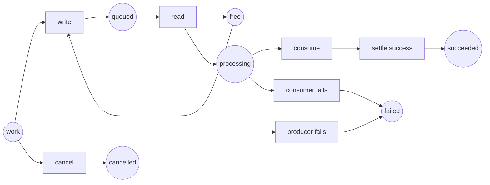

This lesson connects the analyser to code we actually run. The [Advanced C# course](../../csharp-advanced/) already measures [`Channel<T>`](https://learn.microsoft.com/dotnet/api/system.threading.channels.channel-1), [TPL Dataflow](https://learn.microsoft.com/dotnet/standard/parallel-programming/dataflow-task-parallel-library) and [Rx.NET](https://github.com/dotnet/reactive). Here the same lifecycle is made finite enough to enumerate: one bounded slot, one item, one producer and one consumer.

The point is not to execute production work through a Petri-net engine. The net is a small **specification oracle** next to the implementation. It lists states that a future runtime test must distinguish. The focused tests in this lesson validate the model itself; they do not execute `Channel<T>`, Dataflow or Rx.

## Run the experiment

```bash
dotnet test code/petri-nets/Tests -c Release --filter PipelineLifecycleTests
dotnet run --project code/petri-nets/Examples -c Release -- l14
```

The model is [`Nets.PipelineLifecycle`](https://github.com/spareilleux/learn/blob/main/code/petri-nets/Examples/Nets.cs), its lifecycle assertions are in [`PipelineLifecycleTests.cs`](https://github.com/spareilleux/learn/blob/main/code/petri-nets/Tests/PipelineLifecycleTests.cs), and the exchange form is [`pipeline-lifecycle.pnml`](https://github.com/spareilleux/learn/blob/main/code/petri-nets/nets/pipeline-lifecycle.pnml).

## One lifecycle vocabulary



| Petri place or transition | `Channel<T>` | TPL Dataflow | Rx.NET |
|---|---|---|---|
| `free` | one available bounded queue slot | **not equivalent**: an execution block's `BoundedCapacity` also counts the item being processed | no equivalent unless a bounded bridge is added |
| `write` | accepted `WriteAsync` | accepted `SendAsync` | `OnNext` |
| `producer fails` | `TryComplete(error)` | fault the source and propagate completion | `OnError` |
| `consumer fails` | cancel and join producers; complete the writer | fault the block; observe declined sends | dispose the subscription and settle asynchronous work |
| `succeeded` | writer closed, queue drained, both sides settled | every linked block **and every collector task** completed | `OnCompleted` observed and scheduled work settled |
| `cancelled` | cancellation requested **and both tasks settled** | cancellation observed by every block | subscription disposed and scheduled work settled |

That last wording is the contract a runtime test should enforce. The small net below makes cancellation a pre-start, atomic transition directly to `cancelled`; it therefore **assumes** settlement rather than observing it. A larger model needs separate `cancel_requested` and participant-settled places. Closing a queue is likewise not evidence that its contents drained.

## The executable result

```text
== One bounded C# pipeline, with success, failure and cancellation made explicit ==
markings: 8   graph complete: True
dead markings: 3   non-terminal dead markings: 0
queue capacity invariant free + queued = 1: True
write -> read -> consume -> settle_success                 succeeded
producer_fail -> settle_producer_failure                   failed
write -> read -> consumer_fail                             failed
cancel                                                     cancelled
```

The capacity proof is the Channel-queue invariant `free + queued = 1`. A write consumes the free slot; a read returns it. No interleaving can create a second queued item. It is not a Dataflow execution-block invariant, because Dataflow keeps the running item inside `BoundedCapacity`.

The dead-marking count needs a more careful reading. [`ReachabilityGraph.DeadStates`](https://github.com/spareilleux/learn/blob/main/code/petri-nets/PetriNets/ReachabilityGraph.cs) means “nothing else can fire”. That includes a successful finite workflow. The useful property is therefore not “no dead marking”, but:

1. the reachability graph is complete;
2. every dead marking has exactly one named terminal token;
3. every intended disposition is reachable;
4. no participant or queued item remains outside that disposition.

The tests enforce the first three. The fourth becomes important when the model grows from one item to several producers and consumers.

## What this adds to Advanced C#

Lessons [6](../../csharp-advanced/06-channels/), [7](../../csharp-advanced/07-tpl-dataflow/), [8](../../csharp-advanced/08-rx-net/) and [9](../../csharp-advanced/09-choosing-streams/) already run the mechanisms. In particular, lesson 9 observes that:

- a channel whose producer throws without `Complete(error)` leaves its reader waiting;
- a bounded channel whose consumer fails can leave its producer blocked;
- Dataflow completion only travels along links configured to propagate it;
- Rx completion, errors, disposal and scheduled-work settlement are different events.

The Petri net does not replace those tests. It makes candidate lifecycle states reviewable. The next experiment is to add a deterministic runtime fixture, reproduce a failing schedule at the public C# seam, and map its observations to the model; that mapping is not implemented here.

## Agent lanes: the same method, a different invariant

The first half of the `l14` program models the directory lock used by concurrent agent lanes. The guarded version preserves `free + held1 + held2 = 1`; the unguarded cleanup can delete another lane's lock and reaches a marking where both lanes believe they own it.

```text
guarded:   7 markings, no marking with two holders
unguarded: 10 markings, 1 marking with two holders
shortest counterexample: take1 -> fail2 -> clean_hit2 -> take2
```

This is a good fit for Petri nets because the safety claim is about **all interleavings**, while a stress test samples only the schedules the machine happened to run.

## Boundary of the experiment

The Channel/Dataflow/Rx examples in the Advanced C# course reproduce the **shape** of selected GA methods at pinned revisions. They are mechanism experiments, not tests of the current GA binaries. This one-item net also cannot reproduce a producer blocked by backpressure after a consumer failure, and its cancellation is pre-start only. A repository finding must label that evidence fidelity and must be confirmed by a regression test against the target repository revision before it can be called fixed.

RabbitMQ delivery, Redis leases, Kubernetes rolling updates and multi-agent handoffs need more tokens, time and external failure semantics. They remain future experiments; this lesson does not claim their guarantees from the single-slot model.

## Exercises

1. Add a second producer. Which places need one token per producer, and which invariant still proves capacity?
2. Add `cancel_requested` separately from `cancelled`. Construct a marking where cancellation was requested but a producer is still blocked.
3. Give the consumer a retry transition. Which terminal markings are still legitimate, and what fairness assumption is needed to say it eventually settles?
4. Map a RabbitMQ acknowledgement and dead-letter exchange to places and transitions. Mark every claim that would require a real broker experiment.

## Key takeaways

- Petri nets complement C# concurrency tests when they enumerate lifecycle states and tests reproduce the counterexamples at public seams.
- `free + queued = capacity` is the structural version of bounded backpressure.
- Successful termination is a dead marking too; classify terminal and non-terminal dead markings separately.
- Completion, cancellation request, participant settlement and queue drain are distinct facts.
- Keep the model beside production code, not inside its runtime path.
