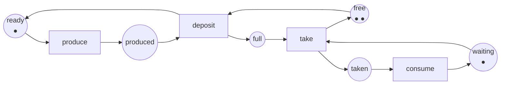

:::note[What this course runs on]
The analyser of this course is a C# project in [`code/petri-nets`](https://github.com/spareilleux/learn/tree/main/code/petri-nets), built with the [.NET SDK](https://dotnet.microsoft.com/download) **10.0.112** and running on .NET **10.0.12**, the versions installed on my machine on 2026-09-15. It reads and writes [PNML](https://www.pnml.org/), applies the firing rule, builds reachability graphs and coverability trees, computes place and transition invariants, decides the structural classes with their siphons, traps and circuits, and unfolds a coloured net into an ordinary one. [`check.sh`](https://github.com/spareilleux/learn/blob/main/code/petri-nets/check.sh) runs the unit tests and every lesson, and compares the output with [`expected`](https://github.com/spareilleux/learn/tree/main/code/petri-nets/expected); every listing in these lessons is pasted from that output. External Petri net tools are named and linked, never required. [`petri-nets-examples.yml`](https://github.com/spareilleux/learn/blob/main/.github/workflows/petri-nets-examples.yml) runs `check.sh` on Ubuntu, Windows and macOS; it first ran on 2026-09-16 at commit `53ceefc` and passed on the three of them.
:::

## Why I'm learning this

I can draw a state machine. I have written them in C# with an `enum` and a `switch`, and in Java with a state pattern, and they work as long as the system does one thing at a time. Then two things happen at once. Two threads take two locks in two orders. A `Channel<T>` fills up and the producer blocks for ever. A workflow has three branches and nobody can say whether all of them can finish.

A state machine cannot say any of that, because it has one current state, and the thing I am modelling has several. What I want is a model whose state is a *distribution*: so many requests in the queue, so many workers busy, one lock held. A Petri net is exactly that, and it comes with a small body of mathematics that answers questions I currently answer with load tests and hope:

- **can this queue overflow?** Not "did it overflow last Tuesday" — *can* it, ever, under any interleaving;
- **can this system deadlock?** And if it can, what is the shortest sequence that gets there;
- **is this workflow going to finish?** From every state it can get into, not just the happy path.

Those three questions are decided by a program in this course, on nets that model real things: a bounded buffer, a mutual exclusion, two locks taken in opposite orders.

## Who this course is for

You are a C# or Java developer. You have written concurrent code and modelled processes with state machines. You do not need any mathematics beyond adding vectors and multiplying a matrix by one; the course introduces what it uses, and the first matrix appears in lesson 2 only because it makes something concrete easier.

The concurrency lessons lean on what you already know. Lesson 7 takes the backpressure of [lessons 6 to 9 of the Advanced C# course](../csharp-advanced/) — channels, TPL Dataflow, Rx — and models it instead of measuring it. Lesson 14 starts the repository dogfooding with one bounded C# lifecycle and an agent-lane lock; RabbitMQ and Kubernetes remain explicit follow-up experiments.

## The running example

One producer, one consumer, and a buffer of two slots. Three places hold the state of the producer, the consumer and the buffer; four transitions are the events. Nothing is a "current state": the marking says where every token is at once.

That net has twelve reachable markings, it never deadlocks, and the place `free` is the whole reason the buffer cannot overflow — remove it, and the set of reachable markings becomes infinite. Lessons 1 to 4 prove all three statements, and lesson 5 proves the first one again without looking at a single marking.

## By the end of this course, I will be able to

- read and draw a Petri net, and say what its marking means in the system it models;
- write the incidence matrix of a net, and know what the state equation does and does not decide;
- build a reachability graph, and a coverability tree when the graph is infinite;
- decide boundedness, safeness, liveness, deadlock-freedom, reversibility and persistence, and say which of them a given system actually needs;
- compute place and transition invariants, and use one as a proof that holds for every reachable marking;
- recognise state machines, marked graphs and free-choice nets, and use the theorems that come with them;
- model mutual exclusion, producer/consumer, readers/writers and the dining philosophers, and compare the models with the C# and Java constructs they stand for;
- use coloured, timed and stochastic nets, and know what each extension costs in analysis;
- check a workflow for soundness, and translate between BPMN and workflow nets;
- exchange nets with TINA, LoLA, CPN Tools, GreatSPN and TAPAAL through PNML;
- model parts of the systems in this repository, and say honestly what the model found and what it missed;
- know where the formalism stops: what is undecidable, what is decidable but hopeless, and what to reach for instead.

## Outline

| # | Lesson | You may already know |
|---|---|---|
| 1 | [Why Petri nets](01-why-petri-nets/) | state machines, `enum` plus `switch`, a bounded queue |
| 2 | [The formal definition and the incidence matrix](02-the-incidence-matrix/) | vectors, a matrix product |
| 3 | [The reachability graph](03-the-reachability-graph/) | a breadth-first search, the state explosion of a test matrix |
| 4 | [Properties](04-properties/) | deadlock, livelock, starvation |
| 5 | [Invariants](05-invariants/) | a loop invariant, a conserved count |
| 6 | [Structural classes: state machines, marked graphs, free-choice nets](06-structural-classes/) | |
| 7 | [Modelling concurrency: mutual exclusion, producer/consumer, readers/writers, philosophers](07-modelling-concurrency/) | `lock`, `SemaphoreSlim`, `Channel<T>`, `synchronized`, `ReentrantLock` |
| 8 | [Coloured nets](08-coloured-nets/) | generics, a typed message |
| 9 | Time and probability: timed nets, stochastic nets, GSPN *(coming next)* | percentiles, a queueing model |
| 10 | Workflows: workflow nets, soundness, BPMN, process mining | BPMN, a workflow engine |
| 11 | Tools and interoperability: PNML, TINA, LoLA, Snoopy, PIPE, CPN Tools, GreatSPN, TAPAAL | an XML exchange format |
| 12 | Industrial applications: manufacturing, protocols, asynchronous hardware, biochemistry, security | |
| 13 | Against other formalisms: statecharts, process algebras, timed automata, TLA+ | TLA+, model checking |
| 14 | [On our own systems: C# pipelines and agent lanes](14-on-our-systems/) | [Advanced C#](../csharp-advanced/); RabbitMQ and Kubernetes are follow-up experiments |
| 15 | Limits and what comes next: undecidability, unfoldings, partial order reduction, extensions | |

[Journal](journal/): what I tried, what surprised me, what I still need to verify.

## Resources

- [Petri Nets World](https://www.informatik.uni-hamburg.de/TGI/PetriNets/), the community hub, with its [tools list](http://www2.informatik.uni-hamburg.de/tgi/PetriNets/tools/) and its [bibliographies](http://www2.informatik.uni-hamburg.de/tgi/PetriNets/bibliographies/)
- Tadao Murata, *Petri nets: Properties, analysis and applications*, **Proceedings of the IEEE** 77(4), April 1989, pages 541–580, [doi:10.1109/5.24143](https://doi.org/10.1109/5.24143) — the survey this course quotes most often
- Wolfgang Reisig, *Understanding Petri Nets*, Springer, 2013, [doi:10.1007/978-3-642-33278-4](https://doi.org/10.1007/978-3-642-33278-4)
- [PNML, the Petri Net Markup Language](https://www.pnml.org/), standardised as [ISO/IEC 15909-1:2019](https://www.iso.org/standard/67235.html) (concepts), [ISO/IEC 15909-2:2011](https://www.iso.org/standard/43538.html) (transfer format) and [ISO/IEC 15909-3:2021](https://www.iso.org/standard/81504.html) (extensions)
- Tools: [TINA](https://projects.laas.fr/tina/), [LoLA](https://theo.informatik.uni-rostock.de/theo-forschung/tools/lola/), [CPN Tools](https://cpntools.org/), [GreatSPN](http://www.di.unito.it/~greatspn/index.html), [TAPAAL](https://www.tapaal.net/), [Snoopy](https://www-dssz.informatik.tu-cottbus.de/DSSZ/Software/Snoopy), [PIPE](https://github.com/sarahtattersall/PIPE)
- The [Model Checking Contest](https://mcc.lip6.fr/), where those tools are run against each other on a public set of nets every year
- Source code of this course: [`code/petri-nets`](https://github.com/spareilleux/learn/tree/main/code/petri-nets)
