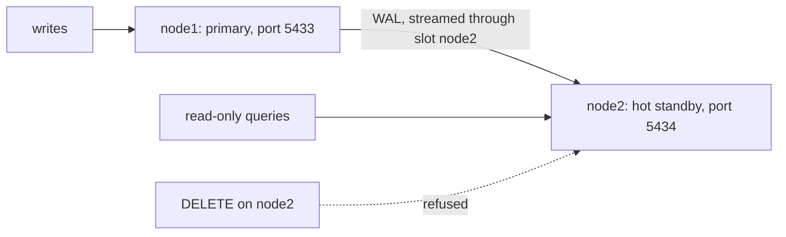
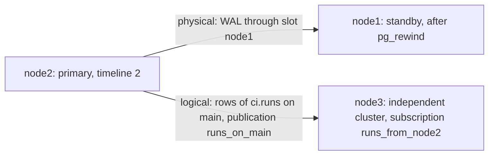

The lesson's script is [`ops/10-replication.sh`](https://github.com/spareilleux/learn/blob/eb0303d795a88c25a467391c1f127befe75c98f8/code/postgresql-aurora/ops/10-replication.sh), and the exercises are in [`ops/10-exercises.sh`](https://github.com/spareilleux/learn/blob/eb0303d795a88c25a467391c1f127befe75c98f8/code/postgresql-aurora/ops/10-exercises.sh). They are shell scripts, not SQL scripts: replication needs several servers. `check.sh ops` runs them in the course container and compares their output with [`expected/10-replication.txt`](https://github.com/spareilleux/learn/blob/eb0303d795a88c25a467391c1f127befe75c98f8/code/postgresql-aurora/expected/10-replication.txt) and [`expected/10-exercises.txt`](https://github.com/spareilleux/learn/blob/eb0303d795a88c25a467391c1f127befe75c98f8/code/postgresql-aurora/expected/10-exercises.txt).

| SQL Server | PostgreSQL |
|---|---|
| transaction log | write-ahead log (WAL), in 16 MB segment files |
| availability group, secondary replica | a standby server replaying the primary's WAL (physical replication) |
| readable secondary | hot standby |
| synchronous-commit and asynchronous-commit modes | `synchronous_standby_names` and `synchronous_commit` |
| automatic failover with a cluster manager | `pg_promote()`; the detection and the decision are left to other tools |
| log shipping | WAL archiving and `restore_command` ([lesson 11](../11-backup/)) |
| transactional replication, publications and subscriptions | logical replication, publications and subscriptions |

## Three clusters in one container

Every change to data is first written to the [write-ahead log](https://www.postgresql.org/docs/18/wal-intro.html), like SQL Server's transaction log. A standby is a server that receives that WAL from the primary and replays it, so that its files stay a copy of the primary's: [physical replication](https://www.postgresql.org/docs/18/warm-standby.html).

Replication needs several servers. Rather than several containers, the script starts small clusters *inside* the course container, next to the course server: [`initdb`](https://www.postgresql.org/docs/18/app-initdb.html) creates a cluster's directory, [`pg_ctl`](https://www.postgresql.org/docs/18/app-pg-ctl.html) starts it on its own port, and `psql` reaches it through the Unix socket. Run it with:

```bash
bash server.sh start
bash server.sh sh < ops/10-replication.sh
```

`server.sh sh` pipes the script to `bash` in the container, as the `postgres` user. A few helpers come first ([lines 10-28](https://github.com/spareilleux/learn/blob/eb0303d795a88c25a467391c1f127befe75c98f8/code/postgresql-aurora/ops/10-replication.sh#L10-L28)):

```bash
# say <text>: a heading in the output; lsn: hides WAL positions, which change from run to run
say() { printf '\n-- %s\n' "$*"; }
lsn() { sed -E 's#[0-9A-F]+/[0-9A-F]{1,8}#X/XXXXXXXX#g'; }
# start <node> <port>: the port and the name that standbys report go on the command line, so copied config files keep neither
start() { pg_ctl -D "$1" -l "$1.log" -o "-p $2 -c cluster_name=$1" -w start > /dev/null || exit 1; }
# until_true <port> <database> <query>: polls until the query returns true, for 30 seconds at most
until_true() {
  for _ in $(seq 150); do
    [ "$(psql -X -Atq -p "$1" -d "$2" -c "$3" 2>/dev/null)" = t ] && return 0
    sleep 0.2
  done
  echo "timed out on port $1: $3"
}
sql() { local port=$1; shift; psql -X -p "$port" -d learn "$@" 2>&1; }
# add_run <port> <run id> <workflow name> [psql options]: inserts a run of the main branch
add_run() {
  sql "$1" "${@:4}" -c "INSERT INTO ci.runs VALUES ($2, '$3', 'push', 'success', 'main', repeat('a', 40), 1,
                        '2026-09-16 12:00+00', '2026-09-16 12:00+00', '2026-09-16 12:00+00')"
}
```

- `until_true` polls a query: replication is asynchronous, and the script waits for a state before printing it, so that the output is the same at every run.
- `lsn` hides WAL positions, which differ from run to run.
- `start` gives each node its port and its `cluster_name` on the command line: a standby copies the primary's configuration files, and would otherwise copy its port too.

The first node, with the course schema ([lines 30-41](https://github.com/spareilleux/learn/blob/eb0303d795a88c25a467391c1f127befe75c98f8/code/postgresql-aurora/ops/10-replication.sh#L30-L41)):

```bash
say "node1: a new cluster, with enough WAL for logical decoding, and the course schema"
initdb -D node1 --auth=trust > /dev/null
cat >> node1/postgresql.conf <<'EOF'
shared_buffers = 32MB
wal_level = logical
# pg_rewind reads the WAL back to the last checkpoint both nodes share: keep a few segments instead of recycling them
wal_keep_size = 128MB
EOF
start node1 5433
psql -X -q -p 5433 -c 'CREATE DATABASE learn'
psql -X -q -p 5433 -d learn -c '\o /dev/null' -c '\i /course/sql/schema.sql'
sql 5433 -Atc 'SHOW data_checksums'
```

```text

-- node1: a new cluster, with enough WAL for logical decoding, and the course schema
on
```

`wal_level = logical` writes enough WAL for logical replication, at the end of the lesson; the default, `replica`, is enough for a standby. `data_checksums` is `on`: PostgreSQL 18 "change[d] initdb default to enable data checksums" ([release notes](https://www.postgresql.org/docs/18/release-18.html)), which `pg_rewind` will need.

## A standby

[`pg_basebackup`](https://www.postgresql.org/docs/18/app-pgbasebackup.html) copies a running cluster over a replication connection ([lines 43-50](https://github.com/spareilleux/learn/blob/eb0303d795a88c25a467391c1f127befe75c98f8/code/postgresql-aurora/ops/10-replication.sh#L43-L50)):

```bash
say "node2: a copy of node1 taken over a replication connection, with a slot and the settings of a standby (-R)"
pg_basebackup -p 5433 -D node2 -R -C -S node2 -X stream -c fast
ls node2/*.signal
grep -o "primary_slot_name = .*\|port=[0-9]*" node2/postgresql.auto.conf
start node2 5434
until_true 5433 learn "SELECT EXISTS (SELECT FROM pg_stat_replication WHERE application_name = 'node2' AND state = 'streaming')"
sql 5433 -c "SELECT application_name, state, sync_state FROM pg_stat_replication"
sql 5433 -c "SELECT slot_name, slot_type, active, wal_status FROM pg_replication_slots"
```

```text
-- node2: a copy of node1 taken over a replication connection, with a slot and the settings of a standby (-R)
node2/standby.signal
port=5433
primary_slot_name = 'node2'
 application_name |   state   | sync_state
------------------+-----------+------------
 node2            | streaming | async
(1 row)

 slot_name | slot_type | active | wal_status
-----------+-----------+--------+------------
 node2     | physical  | t      | reserved
(1 row)
```

- `-R` writes `standby.signal`, which starts the copy as a standby, and `primary_conninfo` in `postgresql.auto.conf`, which tells it where the primary is.
- `-C -S node2` creates a [replication slot](https://www.postgresql.org/docs/18/warm-standby.html#STREAMING-REPLICATION-SLOTS) on the primary and uses it: the primary keeps the WAL that `node2` hasn't received yet, even while `node2` is down. `wal_status = reserved` says the WAL is kept. A slot whose standby never comes back keeps WAL forever; [`max_slot_wal_keep_size`](https://www.postgresql.org/docs/18/runtime-config-replication.html#GUC-MAX-SLOT-WAL-KEEP-SIZE) caps it.
- `-X stream` streams the WAL written during the copy along with it.
- [`pg_stat_replication`](https://www.postgresql.org/docs/18/monitoring-stats.html#MONITORING-PG-STAT-REPLICATION-VIEW) on the primary lists its standbys: `node2`, the `cluster_name` it reports, is `streaming`, asynchronously.

A standby is a *hot standby*: it answers queries, and refuses writes ([lines 52-57](https://github.com/spareilleux/learn/blob/eb0303d795a88c25a467391c1f127befe75c98f8/code/postgresql-aurora/ops/10-replication.sh#L52-L57)):

```bash
say "A write on node1 is replayed on node2, which answers read-only queries"
add_run 5433 1 'Replication test' -q
lsn=$(psql -X -Atq -p 5433 -c 'SELECT pg_current_wal_lsn()')
until_true 5434 learn "SELECT pg_last_wal_replay_lsn() >= '$lsn'"
sql 5434 -c "SELECT pg_is_in_recovery(), workflow_name FROM ci.runs WHERE run_id = 1"
sql 5434 -c "DELETE FROM ci.runs WHERE run_id = 1"
```

```text
-- A write on node1 is replayed on node2, which answers read-only queries
 pg_is_in_recovery |  workflow_name
-------------------+------------------
 t                 | Replication test
(1 row)

ERROR:  cannot execute DELETE in a read-only transaction
```

The script waits until `node2` has replayed the position `node1` had reached after the `INSERT`, then reads. Without that wait, a read on a standby can miss a write just committed on the primary: the lag lesson 3 described for Aurora Replicas.

At this point, the two clusters work like this: writes go to node1, and node2 replays its WAL and answers read-only queries.



## Synchronous replication

By default a commit returns once the primary has written its WAL. [`synchronous_standby_names`](https://www.postgresql.org/docs/18/runtime-config-replication.html#GUC-SYNCHRONOUS-STANDBY-NAMES) makes it wait for standbys too ([lines 59-73](https://github.com/spareilleux/learn/blob/eb0303d795a88c25a467391c1f127befe75c98f8/code/postgresql-aurora/ops/10-replication.sh#L59-L73)):

```bash
say "Synchronous replication: node1's commits now wait for node2 to confirm"
sql 5433 -qc "ALTER SYSTEM SET synchronous_standby_names = 'FIRST 1 (node2)'" -c 'SELECT pg_reload_conf()' -o /dev/null
until_true 5433 learn "SELECT EXISTS (SELECT FROM pg_stat_replication WHERE sync_state = 'sync')"
sql 5433 -c "SELECT application_name, sync_state FROM pg_stat_replication"
pg_ctl -D node2 -m fast -w stop > /dev/null
echo "node2 stopped"
# The commit is written locally, then waits for a standby that isn't there. statement_timeout doesn't cover that wait:
# another session cancels it, which ends the wait but not the commit
add_run 5433 2 'Committed locally' > insert.log &
until_true 5433 learn "SELECT EXISTS (SELECT FROM pg_stat_activity WHERE wait_event = 'SyncRep')"
sql 5433 -c "SELECT wait_event_type, wait_event, pg_cancel_backend(pid) FROM pg_stat_activity WHERE wait_event = 'SyncRep'"
wait
cat insert.log
sql 5433 -c "SELECT run_id, workflow_name FROM ci.runs WHERE run_id < 100 ORDER BY run_id"
sql 5433 -qc "ALTER SYSTEM RESET synchronous_standby_names" -c 'SELECT pg_reload_conf()' -o /dev/null
```

```text
-- Synchronous replication: node1's commits now wait for node2 to confirm
 application_name | sync_state
------------------+------------
 node2            | sync
(1 row)

node2 stopped
 wait_event_type | wait_event | pg_cancel_backend
-----------------+------------+-------------------
 IPC             | SyncRep    | t
(1 row)

WARNING:  canceling wait for synchronous replication due to user request
DETAIL:  The transaction has already committed locally, but might not have been replicated to the standby.
INSERT 0 1
 run_id |   workflow_name
--------+-------------------
      1 | Replication test
      2 | Committed locally
(2 rows)
```

- `FIRST 1 (node2)` waits for one standby, the first of the list that is connected. `sync_state` becomes `sync`.
- With `node2` stopped, the `INSERT` waits: `pg_stat_activity` shows it on the `SyncRep` wait event, and it would wait forever.
- The commit is already in node1's WAL. Cancelling the wait doesn't undo it: the warning says so, and run 2 is in the table. A client that loses its connection during that wait can't know whether its transaction committed.
- A first version of this script put `SET statement_timeout = '2s'` before the `INSERT`: the `INSERT` still waited, for ten minutes, until I cancelled it by hand. The wait comes after the statement, at commit: PostgreSQL disables the statement timeout before it commits ([`postgres.c`, `finish_xact_command`](https://github.com/postgres/postgres/blob/724edf9bde9d356724ad384a2e196edc3c9f80f7/src/backend/tcop/postgres.c#L2826-L2833), at `REL_18_6`).

[`synchronous_commit`](https://www.postgresql.org/docs/18/runtime-config-wal.html#GUC-SYNCHRONOUS-COMMIT) sets what the primary waits for: `on`, the standby's flush to disk; `remote_write`, its write; `remote_apply`, its replay, which "will cause each commit to wait until the current synchronous standbys report that they have replayed the transaction, making it visible to user queries" ([the documentation](https://www.postgresql.org/docs/18/warm-standby.html#SYNCHRONOUS-REPLICATION)). It can be set per transaction, for the writes that must not be lost.

## Failover, and the commit that was lost

With asynchronous replication again and `node2` still down, `node1` commits run 3, then stops. `node2` starts and is promoted with [`pg_promote()`](https://www.postgresql.org/docs/18/functions-admin.html#FUNCTIONS-RECOVERY-CONTROL) ([lines 75-85](https://github.com/spareilleux/learn/blob/eb0303d795a88c25a467391c1f127befe75c98f8/code/postgresql-aurora/ops/10-replication.sh#L75-L85)):

```bash
say "Asynchronous again, node2 still down: node1 commits a run that node2 will never receive"
add_run 5433 3 'Lost in the failover' -q
pg_ctl -D node1 -m fast -w stop > /dev/null
echo "node1 stopped"

say "Failover: node2 starts, is promoted, and becomes a primary on a new timeline"
start node2 5434
sql 5434 -c "SELECT pg_promote()"
sql 5434 -c "SELECT pg_is_in_recovery(), substr(pg_walfile_name(pg_current_wal_lsn()), 1, 8) AS timeline"
sql 5434 -c "SELECT run_id, workflow_name FROM ci.runs WHERE run_id < 100 ORDER BY run_id"
add_run 5434 4 'After the failover' -q
```

```text
-- Asynchronous again, node2 still down: node1 commits a run that node2 will never receive
node1 stopped

-- Failover: node2 starts, is promoted, and becomes a primary on a new timeline
 pg_promote
------------
 t
(1 row)

 pg_is_in_recovery | timeline
-------------------+----------
 f                 | 00000002
(1 row)

 run_id |  workflow_name
--------+------------------
      1 | Replication test
(1 row)
```

- `node2` is now a primary, on **timeline** 2: the first eight hex digits of a WAL file name. A new timeline starts at each promotion, so that the WAL written after it can't be confused with WAL the old primary may have written.
- Runs 2 and 3 are missing. Run 2 was committed while `node2` was stopped, run 3 as well. A failover to an asynchronous standby loses what the standby hadn't received.
- PostgreSQL itself doesn't decide to fail over: "PostgreSQL does not provide the system software required to identify a failure on the primary and notify the standby database server" ([failover](https://www.postgresql.org/docs/18/warm-standby-failover.html)). Tools outside PostgreSQL watch the primary, promote a standby and move clients; on Aurora, AWS does it.

## Bringing the old primary back with pg_rewind

`node1` has runs 2 and 3 in its files, on timeline 1, after the point where `node2` diverged. It can't follow `node2` as it is. [`pg_rewind`](https://www.postgresql.org/docs/18/app-pgrewind.html) copies back from `node2` the blocks that changed since their last common checkpoint, instead of a whole new copy ([lines 87-94](https://github.com/spareilleux/learn/blob/eb0303d795a88c25a467391c1f127befe75c98f8/code/postgresql-aurora/ops/10-replication.sh#L87-L94)):

```bash
say "node1 can't simply follow node2: its WAL went further on the old timeline. pg_rewind takes it back."
pg_rewind -D node1 --source-server='port=5434 dbname=postgres' -R 2>&1 | lsn
sql 5434 -Atc "SELECT pg_create_physical_replication_slot('node1') IS NOT NULL" -o /dev/null
pg_ctl -D node1 -l node1.log -o "-p 5433 -c cluster_name=node1 -c primary_slot_name=node1" -w start > /dev/null
until_true 5434 learn "SELECT EXISTS (SELECT FROM pg_stat_replication WHERE application_name = 'node1' AND state = 'streaming')"
lsn=$(psql -X -Atq -p 5434 -c 'SELECT pg_current_wal_lsn()')
until_true 5433 learn "SELECT pg_last_wal_replay_lsn() >= '$lsn'"
sql 5433 -c "SELECT pg_is_in_recovery(), run_id, workflow_name FROM ci.runs WHERE run_id < 100 ORDER BY run_id"
```

```text
-- node1 can't simply follow node2: its WAL went further on the old timeline. pg_rewind takes it back.
pg_rewind: servers diverged at WAL location X/XXXXXXXX on timeline 1
pg_rewind: rewinding from last common checkpoint at X/XXXXXXXX on timeline 1
pg_rewind: Done!
 pg_is_in_recovery | run_id |   workflow_name
-------------------+--------+--------------------
 t                 |      1 | Replication test
 t                 |      4 | After the failover
(2 rows)
```

- `pg_rewind` "requires that the target server either has the `wal_log_hints` option enabled in `postgresql.conf` or data checksums enabled", and needs the target's WAL back to the common checkpoint. A first version of the script failed with `could not open file "node1/pg_wal/000000010000000000000002"`: `node1` had already recycled that segment. `wal_keep_size = 128MB` keeps it.
- `-R` writes `standby.signal` and a `primary_conninfo` that points at `node2`.
- `node1` comes back as a standby of `node2`, through a slot created for it: runs 2 and 3 are gone, run 4 is there.

## Logical replication

Physical replication copies a whole cluster, block for block, to servers of the same major version. [Logical replication](https://www.postgresql.org/docs/18/logical-replication.html) sends *rows*: the changes to chosen tables, decoded from the WAL, to any PostgreSQL server that has matching tables. `node3` is a new, independent cluster ([lines 96-108](https://github.com/spareilleux/learn/blob/eb0303d795a88c25a467391c1f127befe75c98f8/code/postgresql-aurora/ops/10-replication.sh#L96-L108)):

```bash
say "Logical replication: node3, a separate cluster, subscribes to the runs table of node2"
initdb -D node3 --auth=trust > /dev/null
echo "shared_buffers = 32MB" >> node3/postgresql.conf
start node3 5435
psql -X -q -p 5435 -c 'CREATE DATABASE learn'
# Logical replication carries rows, not the schema: the table is created first
psql -X -q -p 5435 -d learn -c 'CREATE EXTENSION btree_gist'
pg_dump -p 5434 -d learn --schema-only --schema=ci | psql -X -q -p 5435 -d learn > /dev/null
sql 5434 -c "CREATE PUBLICATION runs_on_main FOR TABLE ci.runs WHERE (head_branch = 'main')"
sql 5435 -c "CREATE SUBSCRIPTION runs_from_node2 CONNECTION 'port=5434 dbname=learn' PUBLICATION runs_on_main"
until_true 5435 learn "SELECT count(*) = 0 FROM pg_subscription_rel WHERE srsubstate <> 'r'"
sql 5434 -c "SELECT head_branch = 'main' AS on_main, count(*) FROM ci.runs GROUP BY 1 ORDER BY 1"
sql 5435 -c "SELECT head_branch = 'main' AS on_main, count(*) FROM ci.runs GROUP BY 1 ORDER BY 1"
```

```text
-- Logical replication: node3, a separate cluster, subscribes to the runs table of node2
CREATE PUBLICATION
NOTICE:  created replication slot "runs_from_node2" on publisher
CREATE SUBSCRIPTION
 on_main | count
---------+-------
 f       |     2
 t       |   125
(2 rows)

 on_main | count
---------+-------
 t       |   125
(1 row)
```

- "The database schema and DDL commands are not replicated" ([restrictions](https://www.postgresql.org/docs/18/logical-replication-restrictions.html)): `pg_dump --schema-only` creates the tables on `node3` first, which is also what the documentation suggests.
- [`CREATE PUBLICATION`](https://www.postgresql.org/docs/18/sql-createpublication.html) on the publisher lists the tables, here with a [row filter](https://www.postgresql.org/docs/18/logical-replication-row-filter.html): only the runs of `main`.
- [`CREATE SUBSCRIPTION`](https://www.postgresql.org/docs/18/sql-createsubscription.html) on the subscriber creates a logical replication slot on the publisher, copies the existing rows, then applies changes as they come. `pg_subscription_rel` shows each table's state; `r` means ready.
- 125 runs of `main` on `node3`, and not the two others.

After the failover, pg_rewind and the subscription, the three clusters are connected like this: physical replication from node2 to node1, logical replication from node2 to node3.



The subscriber is a primary like any other, and nothing stops a write there ([lines 110-119](https://github.com/spareilleux/learn/blob/eb0303d795a88c25a467391c1f127befe75c98f8/code/postgresql-aurora/ops/10-replication.sh#L110-L119)):

```bash
say "The subscriber is an ordinary primary: it accepts writes, which can conflict with replicated rows"
add_run 5435 5 'Written on node3'
add_run 5434 5 'Written on node2' -q
until_true 5435 learn "SELECT confl_insert_exists > 0 FROM pg_stat_subscription_stats WHERE subname = 'runs_from_node2'"
sql 5435 -c "SELECT subname, apply_error_count > 0 AS apply_errors, confl_insert_exists > 0 AS insert_conflicts FROM pg_stat_subscription_stats"
grep -o 'ERROR:  conflict detected on relation "ci.runs": conflict=insert_exists' node3.log | head -1
# Removing the subscriber's row lets the apply worker, which retries, go past the conflict
sql 5435 -qc "DELETE FROM ci.runs WHERE run_id = 5"
until_true 5435 learn "SELECT EXISTS (SELECT FROM ci.runs WHERE run_id = 5)"
sql 5435 -c "SELECT run_id, workflow_name FROM ci.runs WHERE run_id < 100 ORDER BY run_id"
```

```text
-- The subscriber is an ordinary primary: it accepts writes, which can conflict with replicated rows
INSERT 0 1
     subname     | apply_errors | insert_conflicts
-----------------+--------------+------------------
 runs_from_node2 | t            | t
(1 row)

ERROR:  conflict detected on relation "ci.runs": conflict=insert_exists
 run_id |   workflow_name
--------+--------------------
      1 | Replication test
      4 | After the failover
      5 | Written on node2
(3 rows)
```

- Run 5 is inserted on `node3`, then on `node2`. When `node2`'s row arrives, the key already exists: an [`insert_exists` conflict](https://www.postgresql.org/docs/18/logical-replication-conflicts.html). "In this case, an error will be raised until the conflict is resolved manually."
- PostgreSQL 18 counts conflicts by kind in [`pg_stat_subscription_stats`](https://www.postgresql.org/docs/18/monitoring-stats.html#MONITORING-PG-STAT-SUBSCRIPTION-STATS).
- The apply worker stops at the error and starts again later, failing each time: replication of the whole subscription stays blocked behind that one row. Deleting `node3`'s row unblocks it, and `node2`'s version arrives. The documentation also describes skipping the transaction with `ALTER SUBSCRIPTION … SKIP` and the LSN written in the log.

Two additions from PostgreSQL 17 complete the picture, not run here:

- [`pg_createsubscriber`](https://www.postgresql.org/docs/18/app-pgcreatesubscriber.html) "creates a new logical replica from a physical standby server", without copying the data again.
- Logical slots can follow a failover: a subscription created with `failover = true`, and [`sync_replication_slots`](https://www.postgresql.org/docs/18/runtime-config-replication.html#GUC-SYNC-REPLICATION-SLOTS) on the standby, let subscribers "resume replication from the new primary server after failover" ([logical replication failover](https://www.postgresql.org/docs/18/logical-replication-failover.html)).

## On Aurora

*To verify: nothing in this section ran on AWS.* Aurora doesn't replicate its instances the way this lesson does.

- **Aurora Replicas.** "The cluster volume is shared among all instances in your Aurora PostgreSQL DB cluster. Thus, no extra work is needed to replicate a copy of the data for each Aurora Replica" ([replication with Aurora PostgreSQL](https://docs.aws.amazon.com/AmazonRDS/latest/AuroraUserGuide/AuroraPostgreSQL.Replication.html)). There is no `pg_basebackup` to run, no slot to watch, and a cluster "can contain up to 15 Aurora Replicas" ([Aurora replication](https://docs.aws.amazon.com/AmazonRDS/latest/AuroraUserGuide/Aurora.Replication.html)), with a lag "usually much less than 100 milliseconds". Lesson 12 covers their failover.
- **No external physical standby.** The replication options that page lists for Aurora PostgreSQL are Aurora Replicas, Global Database, logical replication, and an RDS for PostgreSQL source into Aurora; a standby of your own, fed by `pg_basebackup` and streaming, isn't among them. I found no page that says so in words.
- **Logical replication** works as in this lesson, once enabled: set `rds.logical_replication` to 1 in a custom DB cluster parameter group, then "reboot the writer instance of your Aurora PostgreSQL DB cluster so that your changes takes effect" ([setting up logical replication](https://docs.aws.amazon.com/AmazonRDS/latest/AuroraUserGuide/AuroraPostgreSQL.Replication.Logical.Configure.html)). The same page warns that "leaving a logical replication slot inactive prevents the vacuum from removing obsolete tuples from tables".
- **From replicas.** "PostgreSQL 16 added support for logical decoding from read replicas. This feature isn't supported on Aurora PostgreSQL" ([logical replication on Aurora](https://docs.aws.amazon.com/AmazonRDS/latest/AuroraUserGuide/AuroraPostgreSQL.Replication.Logical.html)).
- **pglogical** is available too: "all currently available Aurora PostgreSQL versions support the pglogical extension" ([pglogical](https://docs.aws.amazon.com/AmazonRDS/latest/AuroraUserGuide/Appendix.PostgreSQL.CommonDBATasks.pglogical.html)).
- **Built on logical replication.** Blue/green deployments ([lesson 11](../11-backup/#on-aurora)) and [zero-ETL integrations](https://docs.aws.amazon.com/AmazonRDS/latest/AuroraUserGuide/zero-etl.html) with Amazon Redshift, which make "transactional data available in your analytics destination after it is written to an Aurora DB cluster". AWS's [zero-ETL version table](https://docs.aws.amazon.com/AmazonRDS/latest/AuroraUserGuide/Concepts.Aurora_Fea_Regions_DB-eng.Feature.Zero-ETL.html) lists Aurora PostgreSQL 16 and 17 only.

## Key takeaways

- A standby replays the primary's WAL; `pg_basebackup -R` makes one, a slot keeps the WAL it still needs.
- Standbys answer read-only queries, a little behind the primary.
- A synchronous commit is written locally first: a cancelled wait, or a lost connection, doesn't tell you it failed. `statement_timeout` doesn't cover the wait.
- A failover to an asynchronous standby loses the commits it hadn't received, and starts a new timeline.
- `pg_rewind` turns the old primary into a standby, discarding its divergent commits; it needs checksums or `wal_log_hints`, and the WAL back to the divergence.
- Logical replication sends rows of chosen tables, not schema, and a conflict blocks the whole subscription until someone fixes it.
- PostgreSQL promotes, but doesn't decide when: that is a tool's job, or AWS's on Aurora.

## Exercises

The solutions are in [`ops/10-exercises.sh`](https://github.com/spareilleux/learn/blob/eb0303d795a88c25a467391c1f127befe75c98f8/code/postgresql-aurora/ops/10-exercises.sh), which starts `node1` and two standbys, `node2` and `node3` ([lines 20-31](https://github.com/spareilleux/learn/blob/eb0303d795a88c25a467391c1f127befe75c98f8/code/postgresql-aurora/ops/10-exercises.sh#L20-L31)).

1. Pause replay on `node2` with [`pg_wal_replay_pause()`](https://www.postgresql.org/docs/18/functions-admin.html#FUNCTIONS-RECOVERY-CONTROL), write on `node1`, and show from `node1` which standby is behind, in bytes of WAL. Then resume.

<details>
<summary>Solution</summary>

[Lines 33-43](https://github.com/spareilleux/learn/blob/eb0303d795a88c25a467391c1f127befe75c98f8/code/postgresql-aurora/ops/10-exercises.sh#L33-L43):

```bash
say "Exercise 1: node2 pauses its replay; the lag, in bytes of WAL, grows on node1's side, then goes back to 0"
sql 5434 -Atc 'SELECT pg_wal_replay_pause()' -o /dev/null
until_true 5434 learn "SELECT pg_get_wal_replay_pause_state() = 'paused'"
sql 5433 -q -c "INSERT INTO notes SELECT i, repeat('x', 100) FROM generate_series(1, 1000) AS i"
lag="SELECT application_name, pg_wal_lsn_diff(sent_lsn, replay_lsn) > 0 AS behind FROM pg_stat_replication ORDER BY 1"
until_true 5433 learn "SELECT bool_and(sent_lsn = pg_current_wal_lsn())
                         AND bool_and(replay_lsn = sent_lsn) FILTER (WHERE application_name = 'node3') FROM pg_stat_replication"
sql 5433 -c "$lag"
sql 5434 -Atc 'SELECT pg_wal_replay_resume()' -o /dev/null
until_true 5433 learn "SELECT bool_and(replay_lsn = sent_lsn) FROM pg_stat_replication"
sql 5433 -c "$lag"
```

```text
-- Exercise 1: node2 pauses its replay; the lag, in bytes of WAL, grows on node1's side, then goes back to 0
 application_name | behind
------------------+--------
 node2            | t
 node3            | f
(2 rows)

 application_name | behind
------------------+--------
 node2            | f
 node3            | f
(2 rows)
```

`pg_wal_lsn_diff` subtracts two WAL positions, in bytes. `sent_lsn` has moved for both standbys: `node2` still receives WAL while its replay is paused, so `sent_lsn - replay_lsn` is the replay lag. The script prints whether it's positive, since the exact number of bytes changes from run to run.

</details>

2. Make commits wait for either standby, `ANY 1 (node2, node3)`, then stop `node2`. Does a commit still go through?

<details>
<summary>Solution</summary>

[Lines 45-51](https://github.com/spareilleux/learn/blob/eb0303d795a88c25a467391c1f127befe75c98f8/code/postgresql-aurora/ops/10-exercises.sh#L45-L51):

```bash
say "Exercise 2: ANY 1 (node2, node3): a commit waits for one of the two, so it goes through with node2 stopped"
sql 5433 -qc "ALTER SYSTEM SET synchronous_standby_names = 'ANY 1 (node2, node3)'" -c 'SELECT pg_reload_conf()' -o /dev/null
until_true 5433 learn "SELECT count(*) = 2 FROM pg_stat_replication WHERE sync_state = 'quorum'"
sql 5433 -c "SELECT application_name, sync_state FROM pg_stat_replication ORDER BY 1"
pg_ctl -D node2 -m fast -w stop > /dev/null
sql 5433 -c "INSERT INTO notes VALUES (1001, 'one standby is enough')"
sql 5433 -qc "ALTER SYSTEM RESET synchronous_standby_names" -c 'SELECT pg_reload_conf()' -o /dev/null
```

```text
-- Exercise 2: ANY 1 (node2, node3): a commit waits for one of the two, so it goes through with node2 stopped
 application_name | sync_state
------------------+------------
 node2            | quorum
 node3            | quorum
(2 rows)

INSERT 0 1
```

With `ANY`, a quorum: both standbys are `quorum` candidates, and one confirmation is enough. `FIRST 1 (node2, node3)` would also have gone on with `node3`, as the first *connected* standby of the list; the difference shows when both are up, where `FIRST` always waits for `node2`, and `ANY` for whichever answers first.

</details>

3. Promote `node3` so that it becomes independent, then replicate to it a table with a stored generated column. On `node3`, the column is an ordinary column. What does it receive?

<details>
<summary>Solution</summary>

[Lines 53-62](https://github.com/spareilleux/learn/blob/eb0303d795a88c25a467391c1f127befe75c98f8/code/postgresql-aurora/ops/10-exercises.sh#L53-L62):

```bash
say "Exercise 3: node3 becomes a primary of its own, and subscribes to a table with a stored generated column"
sql 5435 -Atc 'SELECT pg_promote()' -o /dev/null
sql 5433 -q -c "CREATE TABLE sizes (id int PRIMARY KEY, body text NOT NULL, length int GENERATED ALWAYS AS (length(body)) STORED)"
# On node3 the column is an ordinary one: it receives the values computed on node1
sql 5435 -q -c "CREATE TABLE sizes (id int PRIMARY KEY, body text NOT NULL, length int)"
sql 5433 -c "INSERT INTO sizes (id, body) VALUES (1, 'partition'), (2, 'replication')"
sql 5433 -c "CREATE PUBLICATION sizes_all FOR TABLE sizes WITH (publish_generated_columns = stored)"
sql 5435 -c "CREATE SUBSCRIPTION sizes_from_node1 CONNECTION 'port=5433 dbname=learn' PUBLICATION sizes_all"
until_true 5435 learn "SELECT count(*) = 2 FROM sizes"
sql 5435 -c "SELECT * FROM sizes ORDER BY id"
```

```text
-- Exercise 3: node3 becomes a primary of its own, and subscribes to a table with a stored generated column
INSERT 0 2
CREATE PUBLICATION
NOTICE:  created replication slot "sizes_from_node1" on publisher
CREATE SUBSCRIPTION
 id |    body     | length
----+-------------+--------
  1 | partition   |      9
  2 | replication |     11
(2 rows)
```

`node3` still has `notes`, copied before its promotion, but no `sizes`: it creates its own. [`publish_generated_columns = stored`](https://www.postgresql.org/docs/18/logical-replication-gencols.html), new in PostgreSQL 18, sends the values computed on `node1`. By default, "generated columns are not published". Only stored columns can be published: PostgreSQL 18 also added virtual generated columns, the new default, which aren't.

</details>

## Sources

- PostgreSQL 18 documentation: [WAL](https://www.postgresql.org/docs/18/wal-intro.html), [high availability and replication](https://www.postgresql.org/docs/18/high-availability.html), [log-shipping standby servers](https://www.postgresql.org/docs/18/warm-standby.html), [failover](https://www.postgresql.org/docs/18/warm-standby-failover.html), [replication settings](https://www.postgresql.org/docs/18/runtime-config-replication.html), [WAL settings](https://www.postgresql.org/docs/18/runtime-config-wal.html), [`initdb`](https://www.postgresql.org/docs/18/app-initdb.html), [`pg_ctl`](https://www.postgresql.org/docs/18/app-pg-ctl.html), [`pg_basebackup`](https://www.postgresql.org/docs/18/app-pgbasebackup.html), [`pg_rewind`](https://www.postgresql.org/docs/18/app-pgrewind.html), [recovery control functions](https://www.postgresql.org/docs/18/functions-admin.html#FUNCTIONS-RECOVERY-CONTROL), [monitoring statistics](https://www.postgresql.org/docs/18/monitoring-stats.html), [logical replication](https://www.postgresql.org/docs/18/logical-replication.html), [row filters](https://www.postgresql.org/docs/18/logical-replication-row-filter.html), [generated columns](https://www.postgresql.org/docs/18/logical-replication-gencols.html), [conflicts](https://www.postgresql.org/docs/18/logical-replication-conflicts.html), [restrictions](https://www.postgresql.org/docs/18/logical-replication-restrictions.html), [failover of logical slots](https://www.postgresql.org/docs/18/logical-replication-failover.html), [`CREATE PUBLICATION`](https://www.postgresql.org/docs/18/sql-createpublication.html), [`CREATE SUBSCRIPTION`](https://www.postgresql.org/docs/18/sql-createsubscription.html), [`pg_createsubscriber`](https://www.postgresql.org/docs/18/app-pgcreatesubscriber.html), [PostgreSQL 18 release notes](https://www.postgresql.org/docs/18/release-18.html), [PostgreSQL 17 release notes](https://www.postgresql.org/docs/17/release-17.html)
- SQL Server: [availability modes](https://learn.microsoft.com/sql/database-engine/availability-groups/windows/availability-modes-always-on-availability-groups), [readable secondary replicas](https://learn.microsoft.com/sql/database-engine/availability-groups/windows/active-secondaries-readable-secondary-replicas-always-on-availability-groups), [failover modes](https://learn.microsoft.com/sql/database-engine/availability-groups/windows/failover-and-failover-modes-always-on-availability-groups), [log shipping](https://learn.microsoft.com/sql/database-engine/log-shipping/about-log-shipping-sql-server), [transactional replication](https://learn.microsoft.com/sql/relational-databases/replication/transactional/transactional-replication)
- AWS: [Aurora replication](https://docs.aws.amazon.com/AmazonRDS/latest/AuroraUserGuide/Aurora.Replication.html), [replication with Aurora PostgreSQL](https://docs.aws.amazon.com/AmazonRDS/latest/AuroraUserGuide/AuroraPostgreSQL.Replication.html), [logical replication](https://docs.aws.amazon.com/AmazonRDS/latest/AuroraUserGuide/AuroraPostgreSQL.Replication.Logical.html), [setting it up](https://docs.aws.amazon.com/AmazonRDS/latest/AuroraUserGuide/AuroraPostgreSQL.Replication.Logical.Configure.html), [pglogical](https://docs.aws.amazon.com/AmazonRDS/latest/AuroraUserGuide/Appendix.PostgreSQL.CommonDBATasks.pglogical.html), [zero-ETL](https://docs.aws.amazon.com/AmazonRDS/latest/AuroraUserGuide/zero-etl.html) and [its versions](https://docs.aws.amazon.com/AmazonRDS/latest/AuroraUserGuide/Concepts.Aurora_Fea_Regions_DB-eng.Feature.Zero-ETL.html), all read on 2026-09-16
