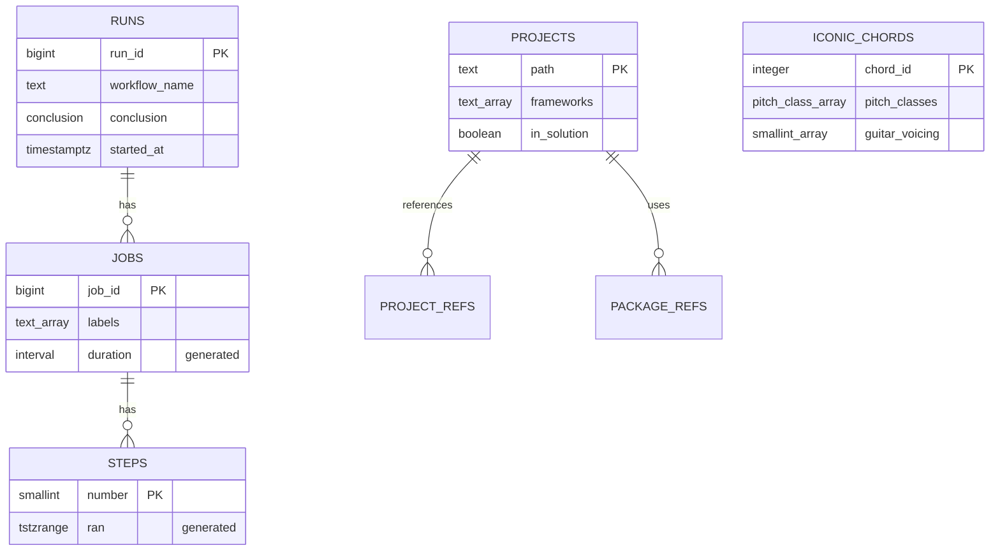

:::note[Versions studied]
[PostgreSQL](https://www.postgresql.org/docs/18/) **18.6**, the current minor release of the newest major version on 2026-09-15 according to the [versioning policy page](https://www.postgresql.org/support/versioning/) (PostgreSQL 18 is supported until November 2030), in the official Docker image [`postgres:18.6-trixie`](https://hub.docker.com/_/postgres), digest `sha256:4ef4dbc939d61acea57712655ddb4b4ab27419c913f94cca0cd57cb3ea3c2280`. Lesson 8's [pgvector](https://github.com/pgvector/pgvector) scripts run on [`pgvector/pgvector:0.8.6-pg18-trixie`](https://hub.docker.com/r/pgvector/pgvector), the same PostgreSQL 18.6 with pgvector **0.8.6**, digest `sha256:78bf48b801e792f99e3ac62b5036fd3876e9be48afda16c1e331af1c75ceb2ff`. The clients are [Npgsql](https://www.npgsql.org/) **10.0.3** and its [EF Core provider](https://www.npgsql.org/efcore/) **10.0.3** on .NET 10, and the [PostgreSQL JDBC driver](https://jdbc.postgresql.org/) **42.7.13** with [HikariCP](https://github.com/brettwooldridge/HikariCP) **7.1.0** on Java 25. On AWS, the newest release listed in the [Aurora PostgreSQL release notes](https://docs.aws.amazon.com/AmazonRDS/latest/AuroraPostgreSQLReleaseNotes/AuroraPostgreSQL.Updates.html) on the same day is **Aurora PostgreSQL 18.4.1** (August 21, 2026), compatible with PostgreSQL 18.4.

Every example is in [`code/postgresql-aurora`](https://github.com/spareilleux/learn/tree/main/code/postgresql-aurora): [`check.sh`](https://github.com/spareilleux/learn/blob/main/code/postgresql-aurora/check.sh) runs each SQL script with `psql` and each C# and Java program against a fresh database, and compares their output with the files in [`expected`](https://github.com/spareilleux/learn/tree/main/code/postgresql-aurora/expected). CI builds the programs on Windows, Linux and macOS, and runs everything against PostgreSQL on Linux only, because GitHub's Windows and macOS runners have no Docker.
:::

## Why I'm learning this

I have spent years on SQL Server: T-SQL, SSMS, execution plans, `IDENTITY` columns, Entity Framework migrations. More and more of the projects I meet start on PostgreSQL instead, often on a managed service such as Amazon Aurora, and I noticed that I was writing SQL Server in PostgreSQL's syntax. It works, until a column name has a capital letter, a `DateTime` comes back three hours off, or a pool of a hundred connections meets a server that allows a hundred.

I want to know PostgreSQL on its own terms: its types, its SQL, how it runs transactions and uses indexes, how it replicates and how it is backed up. Then I want to know what Aurora changes: what AWS manages for me, what I lose, and what it costs.

## Who this course is for

You are a C# or Java developer. You know SQL from [SQL Server](https://learn.microsoft.com/sql/sql-server/) or another database: joins, grouping, indexes, transactions. You have run a container before. You don't need to know PostgreSQL. The Java side assumes the level of [Java for C# developers](../java-for-csharp/); lesson 4 sends Spring Data questions to [Spring Boot, Spring Cloud and Reactor for C# developers](../spring-cloud-reactor/), and lesson 1 sends container questions to [WSL containers](../wsl-containers/). The [DuckDB course](../duckdb/) queries the same CI data with an analytical engine: it's a good comparison, not a prerequisite.

## SQL Server, PostgreSQL and Aurora in one table

| | SQL Server | PostgreSQL | Aurora PostgreSQL |
|---|---|---|---|
| Licence | commercial (Express and Developer editions free) | [PostgreSQL License](https://www.postgresql.org/about/licence/), open source | a managed AWS service, billed per instance or capacity unit, storage and I/O |
| Server | one process, threads | one process per connection | PostgreSQL's engine on AWS's distributed storage |
| Top level | instance → databases → schemas | cluster → databases → schemas | DB cluster: a writer, readers, one shared storage volume |
| Admin account | `sa`, `sysadmin` | `postgres`, a superuser | a member of `rds_superuser`, never a real superuser |
| Client tool | `sqlcmd`, SSMS | `psql`, pgAdmin | `psql` and the AWS console |
| From .NET | `Microsoft.Data.SqlClient` | Npgsql | Npgsql |
| From Java | Microsoft JDBC driver | PostgreSQL JDBC driver | PostgreSQL JDBC driver, or the AWS Advanced JDBC Wrapper |

## The data

The course reuses data this site already publishes, rather than an invented shop or library:

- **The CI history of this site**, the same snapshot as the [DuckDB course](../duckdb/): 125 GitHub Actions runs, their 315 jobs and 2,204 steps, exported on 2026-09-14 into [`code/duckdb/data`](https://github.com/spareilleux/learn/tree/main/code/duckdb/data).
- **The .NET projects of [Guitar Alchemist](https://github.com/GuitarAlchemist/ga)**, as the [LadybugDB course](../ladybugdb/) extracted them at commit `a26a7893`: 111 projects, their project references and their 478 package references, in [`code/ladybugdb/data/ga`](https://github.com/spareilleux/learn/tree/main/code/ladybugdb/data/ga).
- **Guitar Alchemist's iconic chords**, the 17 chords of [`IconicChords.yaml`](https://github.com/GuitarAlchemist/ga/blob/32f143c/Common/GA.Business.Config/IconicChords.yaml) at commit `32f143c`, converted to JSON by [`extract_chords.py`](https://github.com/spareilleux/learn/blob/main/code/postgresql-aurora/data/extract_chords.py).

Lesson 2 builds the model that every later lesson loads from [`sql/schema.sql`](https://github.com/spareilleux/learn/blob/main/code/postgresql-aurora/sql/schema.sql):

Schema `ci` holds the first three tables, schema `ga` the others.

## By the end of this course, I will be able to

- run PostgreSQL in a container and work in `psql`, with databases, schemas, roles and privileges;
- choose PostgreSQL's types on purpose: `text`, `numeric`, `timestamptz`, `uuid`, `jsonb`, arrays and ranges, with constraints, domains and generated columns;
- write the SQL that PostgreSQL does better than T-SQL: recursive CTEs, window functions, `LATERAL`, `DISTINCT ON`, `RETURNING`, upserts and `MERGE`;
- use PostgreSQL from C# with Npgsql and EF Core, and from Java with JDBC and HikariCP, including pools, prepared statements and `COPY`;
- read a query plan and pick the right index: B-tree, GIN, GiST, BRIN, partial and expression indexes;
- explain MVCC, isolation levels, locks and `VACUUM`, and reproduce a deadlock;
- store and search JSON and text, and write functions, triggers and extensions;
- partition large tables, replicate them, back them up, restore them and upgrade them;
- run the same database on Amazon Aurora PostgreSQL, knowing what differs, and estimate what it costs, including a migration from SQL Server.

## Outline

| # | Lesson | If you know SQL Server |
|---|---|---|
| 1 | [Getting started: a container, `psql`, databases, schemas and roles](01-getting-started/) | `sqlcmd`, logins and users, `dbo`, `TOP`, `IDENTITY` |
| 2 | [Types and modeling](02-types/) | `datetimeoffset`, `nvarchar`, computed columns, unique indexes and `NULL` |
| 3 | [Queries: CTEs, windows, `LATERAL`, upserts and `MERGE`](03-queries/) | `CROSS APPLY`, `OUTPUT inserted.*`, `MERGE` |
| 4 | [PostgreSQL from C# and Java](04-csharp-java/) | `SqlConnection` pooling, `SqlBulkCopy`, EF Core providers |
| 5 | [Indexes and plans: B-tree, GIN, BRIN, `EXPLAIN (ANALYZE, BUFFERS)`](05-indexes/) | execution plans, included columns, filtered indexes |
| 6 | [Transactions and MVCC: isolation levels, locks, `VACUUM`, bloat, deadlocks](06-transactions/) | `READ_COMMITTED_SNAPSHOT`, the version store |
| 7 | [JSON and search: `jsonb` operators and indexes, full-text search, `pg_trgm`](07-json-search/) | `OPENJSON`, full-text catalogs |
| 8 | [Functions and extensions: PL/pgSQL, triggers, `pgvector`](08-functions/) | T-SQL procedures, CLR |
| 9 | Partitioning and large tables *(coming next)* | partition functions and schemes |
| 10 | Replication and high availability: WAL, physical and logical replication | Always On availability groups, log shipping |
| 11 | Backup, restore and upgrades: `pg_dump`, point-in-time recovery, `pg_upgrade` | `BACKUP`, `RESTORE`, in-place upgrades |
| 12 | Amazon Aurora PostgreSQL: storage, replicas, endpoints, Serverless v2, Global Database, RDS Proxy, IAM authentication, Performance Insights | Azure SQL Database, Hyperscale |
| 13 | Migration and costs: from SQL Server to PostgreSQL and Aurora with AWS DMS and Babelfish | the Data Migration Assistant |

Each of the first eight lessons ends with a short section on what changes on Aurora, from AWS's documentation; lesson 12 comes back to it in depth. None of it runs on AWS: the course creates no AWS resource, so everything about Aurora is marked *to verify*.

[Journal](journal/): what I tried, what surprised me, what I still need to verify.

## Resources

- [PostgreSQL 18 documentation](https://www.postgresql.org/docs/18/), in particular the [tutorial](https://www.postgresql.org/docs/18/tutorial.html), [the SQL language](https://www.postgresql.org/docs/18/sql.html), [data types](https://www.postgresql.org/docs/18/datatype.html) and [server administration](https://www.postgresql.org/docs/18/admin.html)
- [PostgreSQL 18 release notes](https://www.postgresql.org/docs/18/release-18.html)
- [`psql` reference](https://www.postgresql.org/docs/18/app-psql.html)
- [Npgsql documentation](https://www.npgsql.org/doc/) and the [Npgsql EF Core provider](https://www.npgsql.org/efcore/)
- [PostgreSQL JDBC driver documentation](https://jdbc.postgresql.org/documentation/)
- [Amazon Aurora PostgreSQL user guide](https://docs.aws.amazon.com/AmazonRDS/latest/AuroraUserGuide/Aurora.AuroraPostgreSQL.html)
- Source code: [PostgreSQL](https://github.com/postgres/postgres), [the Docker image](https://github.com/docker-library/postgres), [Npgsql](https://github.com/npgsql/npgsql), [the EF Core provider](https://github.com/npgsql/efcore.pg), [the JDBC driver](https://github.com/pgjdbc/pgjdbc)
