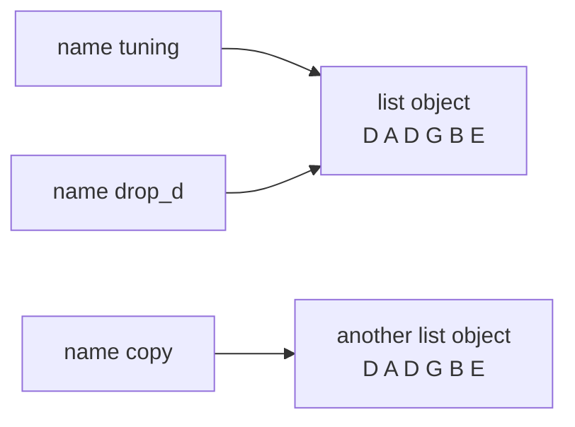

Code: the files [`examples/l02_*`](https://github.com/spareilleux/learn/tree/7d3b4bcda19a81326612cd833dc03b9ca77d3451/code/python-for-csharp-java/examples) and [`errors/l02_*`](https://github.com/spareilleux/learn/tree/7d3b4bcda19a81326612cd833dc03b9ca77d3451/code/python-for-csharp-java/errors), and the C# and Java sides in [`compare/l02_values.cs`](https://github.com/spareilleux/learn/blob/7d3b4bcda19a81326612cd833dc03b9ca77d3451/code/python-for-csharp-java/compare/l02_values.cs), [`compare/L02Values.java`](https://github.com/spareilleux/learn/blob/7d3b4bcda19a81326612cd833dc03b9ca77d3451/code/python-for-csharp-java/compare/L02Values.java), [`compare_fail/l02_scope.cs`](https://github.com/spareilleux/learn/blob/7d3b4bcda19a81326612cd833dc03b9ca77d3451/code/python-for-csharp-java/compare_fail/l02_scope.cs) and [`compare_fail/L02Scope.java`](https://github.com/spareilleux/learn/blob/7d3b4bcda19a81326612cd833dc03b9ca77d3451/code/python-for-csharp-java/compare_fail/L02Scope.java).

## Everything is an object

C# splits types into value types, copied on assignment, and reference types, shared. Java has primitives and objects. Python has only objects: a number, a string, `None`, a function and a class are all objects on the heap, each with a type, and a variable always refers to one. The [data model](https://docs.python.org/3.14/reference/datamodel.html) of the language reference starts with that sentence: "Objects are Python's abstraction for data."

```python
# examples/l02_objects.py
def with_tax(price: float) -> float:
    return price * 1.15


# Numbers, text, None, functions and classes are all objects, and every object has a type
for value in [42, 3.5, "capo", None, with_tax, int, type]:
    print(type(value))

print(isinstance(True, int), True + True)  # bool is a subclass of int
print(2**100)  # an int has no fixed size, so it never overflows
print(with_tax.__name__, with_tax.__annotations__)
```

```text
> uv run python examples/l02_objects.py
<class 'int'>
<class 'float'>
<class 'str'>
<class 'NoneType'>
<class 'function'>
<class 'type'>
<class 'type'>
True 2
1267650600228229401496703205376
with_tax {'price': <class 'float'>, 'return': <class 'float'>}
```

A class is an object of type `type`, and so is `type` itself. `bool` derives from `int`, so `True + True` is `2`. An `int` grows to the size it needs, where C#'s `int` is 32 bits and wraps around; [lesson 3](../03-collections/#numbers) shows both. And a function is an object with attributes, among them the annotations that [lesson 1](../01-install-and-run/#a-type-checker-reads-the-annotations) said Python keeps and doesn't enforce.

The small types behave like C#'s value types anyway, for a different reason: `int`, `float`, `str`, `tuple` and `None` are **immutable**. No operation changes an `int` object; `count += 1` creates or finds the object `1` greater and binds `count` to it. So sharing them is harmless, and the question "copied or shared?" only matters for mutable objects: lists, dictionaries, sets and most instances of classes.

## Names, not boxes

The [execution model](https://docs.python.org/3.14/reference/executionmodel.html) calls variables *names*, and assignment *binding*: `x = value` makes the name `x` refer to the object, and never copies it. That is what a variable of a reference type does in C# and Java, applied to every type.

```python
# examples/l02_names.py
tuning = ["E", "A", "D", "G", "B", "E"]
drop_d = tuning  # a second name for the same list: nothing is copied
drop_d[0] = "D"
print("tuning:", tuning)
print("same object:", drop_d is tuning)

copy = list(tuning)  # a new list with the same items
print("equal:", copy == tuning, "same object:", copy is tuning)

# += changes a list in place, but builds a new tuple and binds the name to it
chord = ["C", "E"]
chord_alias = chord
chord += ["G"]
print("list: ", chord, chord_alias)

frozen: tuple[str, ...] = ("C", "E")
frozen_alias = frozen
frozen += ("G",)
print("tuple:", frozen, frozen_alias)
```

```text
> uv run python examples/l02_names.py
tuning: ['D', 'A', 'D', 'G', 'B', 'E']
same object: True
equal: True same object: False
list:  ['C', 'E', 'G'] ['C', 'E', 'G']
tuple: ('C', 'E', 'G') ('C', 'E')
```



`is` compares identities, like `ReferenceEquals` in C# or `==` on objects in Java, and `==` compares values, like `Equals` or `equals`. For lists, `==` compares the items, which C#'s `List<T>` doesn't do.

`+=` is the surprise of the file. For a list, it calls the list's in-place method `__iadd__`, which extends the object that both names share. A tuple has no such method, so `frozen += ("G",)` computes `frozen + ("G",)`, a new tuple, and binds `frozen` to it: `frozen_alias` still names the old one. The same line has two meanings, decided by the type of the object at run time.

## Arguments are shared, not copied

A call binds each parameter to the object passed, exactly as an assignment would. The official name is *call by object reference*; it is what Java does with every object, and what C# does with reference types passed without `ref`:

```python
# examples/l02_arguments.py
def add_capo(strings: list[str]) -> None:
    strings.append("capo")  # changes the caller's list: the parameter names the same object


def retune(strings: list[str]) -> None:
    strings = ["D", "A", "D", "G", "A", "D"]  # binds the local name to a new list; the caller sees nothing
    print("inside retune:", strings)


tuning = ["E", "A", "D", "G", "B", "E"]
add_capo(tuning)
print("after add_capo:", tuning)
retune(tuning)
print("after retune:  ", tuning)
```

```text
> uv run python examples/l02_arguments.py
after add_capo: ['E', 'A', 'D', 'G', 'B', 'E', 'capo']
inside retune: ['D', 'A', 'D', 'G', 'A', 'D']
after retune:   ['E', 'A', 'D', 'G', 'B', 'E', 'capo']
```

A method call on the parameter reaches the caller's object; an assignment to the parameter doesn't. There is no `ref` or `out`: a function that needs to give back a new value returns it, several values included, as a tuple (exercise 1).

## Identity and equality

In C#, boxing an `int` creates a new object each time, and Java's autoboxing reuses cached `Integer` objects from -128 to 127, as the documentation of [`Integer.valueOf`](https://docs.oracle.com/en/java/javase/25/docs/api/java.base/java/lang/Integer.html#valueOf(int)) promises. CPython caches small integers too, from -5 to 256, as an implementation detail that the documentation of [`PyLong_FromLong`](https://docs.python.org/3.14/c-api/long.html#c.PyLong_FromLong) mentions. The compiler warns about the comparison that depends on it:

```python
# errors/l02_identity.py
small = int("100")
big = int("1000")
print(small == 100, small is 100)
print(big == 1000, big is 1000)
```

```text
> uv run python errors/l02_identity.py
errors/l02_identity.py:4: SyntaxWarning: "is" with 'int' literal. Did you mean "=="?
  print(small == 100, small is 100)
errors/l02_identity.py:5: SyntaxWarning: "is" with 'int' literal. Did you mean "=="?
  print(big == 1000, big is 1000)
True True
True False
```

```text
> dotnet run l02_values.cs
False True
False True
quantity: 3
> java L02Values.java
true true
false true
quantity: 3
```

Three designs give three sets of answers to the same question: C# boxes into a new object every time, Java caches up to 127, CPython caches up to 256. Only `==`, `Equals` and `equals` are reliable. mypy 2.3.1 reports nothing on this file; the warning comes from Python's compiler, printed before the first line runs. The one case where `is` is the right comparison is a singleton, and Python has three of them: `None`, `True` and `False`.

## Dynamic and strong

Python is **dynamically typed**: a name has no type, and the same name can refer to a string and then to a float. It is also **strongly typed**: an object never silently becomes another type. JavaScript is dynamic and weak, and C# is static and strong, with a few implicit conversions:

```python
# errors/l02_strong.py
quantity = 3
print("quantity: " + str(quantity))
print(True + True, 2 * "ab", [0] * 3)  # a bool is an int, and * repeats a sequence
print("quantity: " + quantity)
```

```text
> uv run python errors/l02_strong.py
quantity: 3
2 abab [0, 0, 0]
Traceback (most recent call last):
  File "errors/l02_strong.py", line 5, in <module>
    print("quantity: " + quantity)
          ~~~~~~~~~~~~~^~~~~~~~~~
TypeError: can only concatenate str (not "int") to str
> uv run mypy errors/l02_strong.py
errors/l02_strong.py:5: error: Unsupported operand types for + ("str" and "int")  [operator]
Found 1 error in 1 file (checked 1 source file)
```

C# and Java accept `"quantity: " + quantity` and convert the number, as `l02_values.cs` and `L02Values.java` printed above; JavaScript does too ([JavaScript lesson 2](../../javascript-for-csharp-java/02-values-and-types/#conversions----parsing-and-truthiness)). Python refuses, at run time, and mypy refuses before. The conversion must be written: `str(quantity)`, or an f-string, `f"quantity: {quantity}"`, which lesson 3 prefers.

Rebinding a name to another type runs without complaint, and is where mypy and Python disagree:

```python
# errors/l02_rebind.py
price = "9.99"  # text from a CSV file
price = float(price)  # the same name now holds a float
print(price * 2)
```

```text
> uv run python errors/l02_rebind.py
19.98
> uv run mypy errors/l02_rebind.py
errors/l02_rebind.py:3: error: Incompatible types in assignment (expression has type "float", variable has type "str")  [assignment]
Found 1 error in 1 file (checked 1 source file)
```

mypy gives a name the type of its first assignment, as `var` does in C#. Code checked with mypy uses a second name, `price_text` then `price`; mypy's option [`allow_redefinition`](https://mypy.readthedocs.io/en/stable/config_file.html#confval-allow_redefinition) accepts this pattern, and mypy 2.0 made that option more flexible.

## Truthiness

`if` and `while` accept any object, not only a `bool`. The [truth value testing](https://docs.python.org/3.14/library/stdtypes.html#truth-value-testing) rules say which objects count as false: `None`, `False`, the zeros of every numeric type, and empty strings and collections. Everything else is true:

```python
# examples/l02_truthiness.py
for value in [0, 0.0, "", [], {}, None, "0", [0], -1]:
    print(f"{value!r:>6} is {bool(value)}")


def label(quantity: int | None) -> str:
    if not quantity:  # true for None, and for 0 too
        return "quantity unknown"
    return f"{quantity} in stock"


def label_checked(quantity: int | None) -> str:
    if quantity is None:
        return "quantity unknown"
    return f"{quantity} in stock"


print(label(None), "|", label(0), "|", label(3))
print(label_checked(None), "|", label_checked(0), "|", label_checked(3))
```

```text
> uv run python examples/l02_truthiness.py
     0 is False
   0.0 is False
    '' is False
    [] is False
    {} is False
  None is False
   '0' is True
   [0] is True
    -1 is True
quantity unknown | quantity unknown | 3 in stock
quantity unknown | 0 in stock | 3 in stock
```

`if items:` is the idiomatic test for "not empty", and reads better than `if len(items) > 0:`. But `if not quantity:` treats `0` as missing, a bug that mypy doesn't report, since both branches are valid for an `int | None`. When `None` means "absent", test for `None`.

## None

`None` is the only object of type `NoneType`. It plays the role of `null`, with one difference: it is an object, so `None` has a type and methods, and the error comes from what the code does with it. Two ways to get `None` without asking for it:

```python
# errors/l02_none.py
tuning = ["E", "A", "D", "G", "B", "E"]
ordered = tuning.sort()  # sorts the list in place, and returns None
print(ordered)

beliefs = {"tetravalent-logic": {"truth": "T"}}
belief = beliefs.get("governance")  # None when the key is missing
print(belief["truth"])
```

```text
> uv run python errors/l02_none.py
None
Traceback (most recent call last):
  File "errors/l02_none.py", line 8, in <module>
    print(belief["truth"])
          ~~~~~~^^^^^^^^^
TypeError: 'NoneType' object is not subscriptable
> uv run mypy errors/l02_none.py
errors/l02_none.py:8: error: Value of type "dict[str, str] | None" is not indexable  [index]
Found 1 error in 1 file (checked 1 source file)
```

A method that changes an object in place returns `None`, by convention, so that nobody mistakes it for a copy: `list.sort()` sorts and returns nothing, and the built-in `sorted(tuning)` returns a new list. `dict.get` returns `None` for a missing key, like `Map.get` in Java, where `beliefs["governance"]` would raise `KeyError`. The `TypeError` is Python's `NullReferenceException`, and names the type, `'NoneType' object`; for an attribute it reads `AttributeError: 'NoneType' object has no attribute …`.

mypy caught the second case, because `dict.get`'s declared return type includes `None`, the way nullable reference types flag a possible `null` in C#. It didn't report the first: assigning the result of `sort()` is legal, and the mistake shows only when `ordered` is used as a list.

## Scope: functions, not blocks

A block doesn't create a scope in Python. `if`, `for`, `while` and `with` bind names in the enclosing function, or in the module at the top level; only functions, classes, comprehensions and modules have their own scope.

```python
# errors/l02_scope.py
for string in ["E", "A", "D"]:
    last = string.lower()
print(string, last)  # a loop is not a scope: both names still exist

count = 0


def add_one() -> None:
    count += 1  # an assignment anywhere in the function makes count local to all of it


add_one()
```

```text
> uv run python errors/l02_scope.py
D d
Traceback (most recent call last):
  File "errors/l02_scope.py", line 13, in <module>
    add_one()
    ~~~~~~~^^
  File "errors/l02_scope.py", line 10, in add_one
    count += 1  # an assignment anywhere in the function makes count local to all of it
    ^^^^^
UnboundLocalError: cannot access local variable 'count' where it is not associated with a value
```

The loop's variable and `last` survived the loop, where C# and Java refuse to compile the same `print`:

```text
> dotnet run l02_scope.cs
compare_fail/l02_scope.cs(6,19): error CS0103: The name 'text' does not exist in the current context
compare_fail/l02_scope.cs(6,26): error CS0103: The name 'last' does not exist in the current context

The build failed. Fix the build errors and run again.
> javac L02Scope.java
L02Scope.java:7: error: cannot find symbol
        System.out.println(text + last);
                           ^
  symbol:   variable text
  location: class L02Scope
L02Scope.java:7: error: cannot find symbol
        System.out.println(text + last);
                                  ^
  symbol:   variable last
  location: class L02Scope
2 errors
```

The second error is the one that surprises. The compiler decides, for each function, which names are local, and a name that the function assigns anywhere is local everywhere in it. `count += 1` reads the local `count` before anything assigned it. Reading a module's name from a function works; assigning it requires `global count`, and assigning a name of an enclosing function requires `nonlocal`, which [lesson 4](../04-functions/#closures) uses. mypy 2.3.1 reports no error on this file.

Name lookup follows four levels, known as LEGB: the **l**ocal scope, the scopes of **e**nclosing functions, the **g**lobal scope of the module, and the **b**uilt-ins such as `len`, `print` and `input`. A local name can hide a built-in one, which is legal and sometimes confusing (below).

## Blocks are indentation

A colon opens a block, and the block is the lines indented under it. The braces of C# are gone, and so is the choice of style: [PEP 8](https://peps.python.org/pep-0008/), Python's style guide, asks for four spaces per level, and formatters such as Ruff apply it (lesson 13). An empty block needs the statement `pass`. Mixing tabs and spaces in one file is a `TabError`, and a line indented to a level that doesn't exist is an `IndentationError`, both raised by the compiler before anything runs.

## Importing runs the module

[Lesson 1](../01-install-and-run/#running-code) showed that an import runs a module's top-level code, once, and caches the module in `sys.modules`. `def` and `class` are statements that run too: importing a module creates its functions and classes, and runs everything else at the top level, file reads and network calls included.

```python
# examples/l02_config.py
print(f"running the top-level code of {__name__}")
STRINGS = 6
```

```python
# examples/l02_import_twice.py
import sys

import l02_config

print("imported, STRINGS =", l02_config.STRINGS)
import l02_config  # already in sys.modules: nothing runs

print("in sys.modules:", "l02_config" in sys.modules)
```

```text
> uv run python examples/l02_import_twice.py
running the top-level code of l02_config
imported, STRINGS = 6
in sys.modules: True
```

The closest thing in C# is a static constructor, and in Java a static initializer: code that runs once, the first time a type is used. A module goes further, because its whole body is that code. When it fails, the import fails, and every module that imports it fails with it. GA's governance agent looks for its data folder that way; reduced to the lines that matter:

```python
# errors/l02_governance.py
# Reduced from GA's Apps/demerzel-agent/src/services/governance.py: the search runs when the module is imported
import os
from pathlib import Path


def find_governance_root() -> Path:
    candidate = Path(__file__).resolve()
    for _ in range(3):
        candidate = candidate.parent
        governance = candidate / "governance" / "demerzel"
        if governance.is_dir():
            return governance
    env = os.environ.get("DEMERZEL_ROOT")
    if env:
        return Path(env)
    raise FileNotFoundError("Could not locate governance/demerzel/ directory")


GOV_ROOT = find_governance_root()


def list_beliefs() -> list[Path]:
    return sorted((GOV_ROOT / "state" / "beliefs").glob("*.belief.json"))
```

```python
# errors/l02_import_governance.py
print("before the import")
import l02_governance

print(l02_governance.list_beliefs())
```

```text
> uv run python errors/l02_import_governance.py
before the import
Traceback (most recent call last):
  File "errors/l02_import_governance.py", line 3, in <module>
    import l02_governance
  File "errors/l02_governance.py", line 20, in <module>
    GOV_ROOT = find_governance_root()
  File "errors/l02_governance.py", line 17, in find_governance_root
    raise FileNotFoundError("Could not locate governance/demerzel/ directory")
FileNotFoundError: Could not locate governance/demerzel/ directory
```

The traceback goes through the `import` line: the program didn't call `list_beliefs`, it only imported the module that defines it. A test that imports any module of the agent, a documentation tool that imports it to read its docstrings, or a type checker plugin that loads it, all fail on a machine without the folder. mypy sees nothing wrong, since the code is well typed. Exercise 3 moves the search into a function.

## In real projects

**GA's governance agent**, at commit [`cc42d21`](https://github.com/GuitarAlchemist/ga/commit/cc42d215504631e168daf3bdf2c6d47b5c9fbe93):

- [`src/services/governance.py`, lines 13-28](https://github.com/GuitarAlchemist/ga/blob/cc42d215504631e168daf3bdf2c6d47b5c9fbe93/Apps/demerzel-agent/src/services/governance.py#L13-L28), is the module reduced above. Its search walks up ten parent folders from the file, then falls back on `DEMERZEL_ROOT`, and `GOV_ROOT = find_governance_root()` runs at import. `import src.services.governance` in my copy of the agent raised the same `FileNotFoundError`, and succeeded once `DEMERZEL_ROOT` was set. Since the environment variable is read after the walk, a folder named `governance/demerzel` in any parent folder wins over it.
- [`src/agents/epistemic_agent.py`, line 15](https://github.com/GuitarAlchemist/ga/blob/cc42d215504631e168daf3bdf2c6d47b5c9fbe93/Apps/demerzel-agent/src/agents/epistemic_agent.py#L15), declares `async def handle(input: list[Message])`. The parameter hides the built-in function `input` inside `handle`, which is harmless here and a trap for the next person who adds a call to `input()` in that function. The same file uses truthiness where it fits, `reason or 'not specified'` at [line 118](https://github.com/GuitarAlchemist/ga/blob/cc42d215504631e168daf3bdf2c6d47b5c9fbe93/Apps/demerzel-agent/src/agents/epistemic_agent.py#L118), and tests for `None` where zero is a valid value, `if actual is None: continue` at [line 51](https://github.com/GuitarAlchemist/ga/blob/cc42d215504631e168daf3bdf2c6d47b5c9fbe93/Apps/demerzel-agent/src/agents/epistemic_agent.py#L51).

**GA's graphiti service** keeps its service in a module-level name, [`graphiti_service: GraphitiMusicService = None`](https://github.com/GuitarAlchemist/ga/blob/cc42d215504631e168daf3bdf2c6d47b5c9fbe93/Apps/ga-graphiti-service/main.py#L29), assigned with `global graphiti_service` in the application's startup function ([line 35](https://github.com/GuitarAlchemist/ga/blob/cc42d215504631e168daf3bdf2c6d47b5c9fbe93/Apps/ga-graphiti-service/main.py#L35)). Without `global`, the assignment would create a local name and the module's would stay `None`, as `add_one` showed. The annotation says the name always holds a service, and its first value is `None`: `GraphitiMusicService | None` is the honest type, and lesson 6 shows what mypy says about it.

## Key takeaways

- Every value is an object, and a name refers to one. Assignment and argument passing bind names; they never copy.
- Immutable objects (`int`, `str`, `tuple`, `None`) can be shared safely; for mutable ones, a second name is a second way to change the same object. `+=` changes a list in place and rebinds a tuple.
- `is` compares identity and `==` compares values. Use `is` only with `None`, `True` and `False`.
- Python is dynamic and strong: a name can change type, an object never converts itself silently. mypy gives each name one type.
- Empty collections, zeros and `None` are false. Test `is None` when zero or empty is a valid value.
- Only functions, classes, comprehensions and modules create scopes. An assignment makes a name local to the whole function.
- Importing a module runs its top-level code once. Keep that code to definitions, and do lookups, I/O and connections in functions.

## Exercises

1. Rewrite `retune` from [`examples/l02_arguments.py`](https://github.com/spareilleux/learn/blob/7d3b4bcda19a81326612cd833dc03b9ca77d3451/code/python-for-csharp-java/examples/l02_arguments.py) in two ways: one that changes the caller's list, so that another name for the same list sees the new tuning, and one that leaves it alone and returns a new list.

<details>
<summary>Solution</summary>

[`solutions/l02_ex1_tuning.py`](https://github.com/spareilleux/learn/blob/7d3b4bcda19a81326612cd833dc03b9ca77d3451/code/python-for-csharp-java/solutions/l02_ex1_tuning.py):

```python
# solutions/l02_ex1_tuning.py
STANDARD = ("E", "A", "D", "G", "B", "E")


def retune_in_place(strings: list[str], notes: tuple[str, ...]) -> None:
    # Slice assignment replaces the items of the caller's list instead of rebinding the parameter
    strings[:] = notes


def retuned(notes: tuple[str, ...]) -> list[str]:
    # Or leave the caller's list alone and return a new one
    return list(notes)


if __name__ == "__main__":
    tuning = ["D", "A", "D", "G", "A", "D"]
    alias = tuning
    retune_in_place(tuning, STANDARD)
    print(alias, alias is tuning)
    print(retuned(("D", "G", "D", "G", "B", "D")))
```

```text
> uv run python solutions/l02_ex1_tuning.py
['E', 'A', 'D', 'G', 'B', 'E'] True
['D', 'G', 'D', 'G', 'B', 'D']
```

`strings[:] = notes` is an assignment to a slice of the object, not to the name, so it calls a method of the list, like `append`; lesson 3 explains slices. The version that returns a new list is usually the better design, since the caller sees in the call that something new comes back, and the tuple of notes can't be changed by anyone. The same functions are tested in [`tests/test_l02.py`](https://github.com/spareilleux/learn/blob/7d3b4bcda19a81326612cd833dc03b9ca77d3451/code/python-for-csharp-java/tests/test_l02.py).

</details>

2. The shop wants three labels: `quantity unknown` for `None`, `out of stock` for `0`, and `3 in stock` otherwise. Fix `label` in [`examples/l02_truthiness.py`](https://github.com/spareilleux/learn/blob/7d3b4bcda19a81326612cd833dc03b9ca77d3451/code/python-for-csharp-java/examples/l02_truthiness.py).

<details>
<summary>Solution</summary>

[`solutions/l02_ex2_label.py`](https://github.com/spareilleux/learn/blob/7d3b4bcda19a81326612cd833dc03b9ca77d3451/code/python-for-csharp-java/solutions/l02_ex2_label.py):

```python
# solutions/l02_ex2_label.py
def label(quantity: int | None) -> str:
    if quantity is None:
        return "quantity unknown"
    if quantity == 0:
        return "out of stock"
    return f"{quantity} in stock"


if __name__ == "__main__":
    for quantity in [None, 0, 3]:
        print(label(quantity))
```

```text
> uv run python solutions/l02_ex2_label.py
quantity unknown
out of stock
3 in stock
```

The order of the tests matters: `quantity == 0` after `quantity is None`, so that mypy knows `quantity` is an `int` from there on, the narrowing that C# does after `if (quantity is null) return`.

</details>

3. Change the governance module of [`errors/l02_governance.py`](https://github.com/spareilleux/learn/blob/7d3b4bcda19a81326612cd833dc03b9ca77d3451/code/python-for-csharp-java/errors/l02_governance.py) so that importing it never fails, `DEMERZEL_ROOT` takes precedence over the folder search, and a test can point it at a temporary folder.

<details>
<summary>Solution</summary>

The lookup becomes a function, called when beliefs are listed. [`solutions/l02_ex3_governance.py`](https://github.com/spareilleux/learn/blob/7d3b4bcda19a81326612cd833dc03b9ca77d3451/code/python-for-csharp-java/solutions/l02_ex3_governance.py):

```python
# solutions/l02_ex3_governance.py
import os
from pathlib import Path


def governance_root() -> Path:
    # Looked up when a function needs it, not when the module is imported
    env = os.environ.get("DEMERZEL_ROOT")
    if env:
        return Path(env)
    for parent in Path(__file__).resolve().parents:
        governance = parent / "governance" / "demerzel"
        if governance.is_dir():
            return governance
    raise FileNotFoundError("Could not locate governance/demerzel/ directory; set DEMERZEL_ROOT")


def list_beliefs() -> list[str]:
    beliefs = governance_root() / "state" / "beliefs"
    return sorted(path.name for path in beliefs.glob("*.belief.json"))


if __name__ == "__main__":
    print("imported without an error")
    try:
        print(list_beliefs())
    except FileNotFoundError as e:
        print("error:", e)
```

```text
> uv run python solutions/l02_ex3_governance.py
imported without an error
error: Could not locate governance/demerzel/ directory; set DEMERZEL_ROOT
```

The test in [`tests/test_l02.py`](https://github.com/spareilleux/learn/blob/7d3b4bcda19a81326612cd833dc03b9ca77d3451/code/python-for-csharp-java/tests/test_l02.py) imports the module at the top of the file, which now succeeds anywhere, then creates two belief files in pytest's `tmp_path` folder and sets the variable with `monkeypatch.setenv`, which pytest undoes after the test:

```python
def test_the_lookup_happens_when_beliefs_are_listed(monkeypatch: pytest.MonkeyPatch, tmp_path: Path) -> None:
    # The import at the top of this file succeeded without a governance folder
    beliefs = tmp_path / "state" / "beliefs"
    beliefs.mkdir(parents=True)
    (beliefs / "b.belief.json").write_text("{}", encoding="utf-8")
    (beliefs / "a.belief.json").write_text("{}", encoding="utf-8")
    monkeypatch.setenv("DEMERZEL_ROOT", str(tmp_path))
    assert l02_ex3_governance.list_beliefs() == ["a.belief.json", "b.belief.json"]
```

Calling `governance_root()` on every listing costs a few file-system checks; if that matters, `functools.cache` from [lesson 4](../04-functions/#decorators) keeps the first result, still without doing anything at import time. Lesson 9 covers `tmp_path` and `monkeypatch`.

</details>

## Sources

- [Python — Data model: objects, values and types](https://docs.python.org/3.14/reference/datamodel.html#objects-values-and-types), [Execution model: naming and binding](https://docs.python.org/3.14/reference/executionmodel.html#naming-and-binding), [Truth value testing](https://docs.python.org/3.14/library/stdtypes.html#truth-value-testing), [Identity comparisons](https://docs.python.org/3.14/reference/expressions.html#is-not), [The import system](https://docs.python.org/3.14/reference/import.html)
- [Python FAQ — Why am I getting an UnboundLocalError when the variable has a value?](https://docs.python.org/3.14/faq/programming.html#why-am-i-getting-an-unboundlocalerror-when-the-variable-has-a-value), [How do I write a function with output parameters (call by reference)?](https://docs.python.org/3.14/faq/programming.html#how-do-i-write-a-function-with-output-parameters-call-by-reference)
- [PEP 8 — Style guide for Python code](https://peps.python.org/pep-0008/)
- [mypy — The mypy configuration file](https://mypy.readthedocs.io/en/stable/config_file.html)
- [Java — `Integer.valueOf(int)`](https://docs.oracle.com/en/java/javase/25/docs/api/java.base/java/lang/Integer.html#valueOf(int)), [Microsoft — Boxing and unboxing](https://learn.microsoft.com/dotnet/csharp/programming-guide/types/boxing-and-unboxing)
