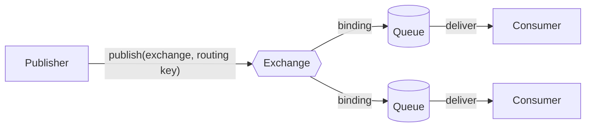

import { Tabs, TabItem } from '@astrojs/starlight/components';

Full example: [`L01.cs`](https://github.com/spareilleux/learn/blob/main/code/rabbitmq/csharp/L01.cs) and [`L01.java`](https://github.com/spareilleux/learn/blob/main/code/rabbitmq/java/client/src/main/java/dev/learn/rabbitmq/L01.java). [`check.sh`](https://github.com/spareilleux/learn/blob/main/code/rabbitmq/check.sh) runs them and compares their output, and the output of the CLI commands below, with the files in [`expected`](https://github.com/spareilleux/learn/tree/main/code/rabbitmq/expected).

## The model

A message broker sits between the programs that send messages and the programs that receive them, so that neither has to know the other or be running at the same time. RabbitMQ's native protocol is [AMQP 0-9-1](https://www.rabbitmq.com/tutorials/amqp-concepts), and its model has more parts than "put a message in a queue":



A publisher never writes to a queue. It publishes a message to an **exchange**, with a **routing key**. The exchange compares the message with its **bindings**, the rules that link it to queues, and puts a copy in every queue that matches. A **queue** stores messages in order until a **consumer** takes them and acknowledges them. Lesson 2 is about exchanges and bindings; lesson 4 is about acknowledgements.

| AMQP 0-9-1 | What it is | The closest thing you may know |
|---|---|---|
| connection | a long-lived TCP connection from a client to the broker | a pooled `SqlConnection`, a shared `HttpClient` |
| channel | a lightweight session multiplexed on a connection; almost every operation happens on one | a JMS `Session` |
| virtual host | an isolated namespace of exchanges, queues and permissions; `/` by default | a database on a SQL Server instance |
| exchange | a router, with a type that sets its rules | an Azure Service Bus topic |
| binding | a rule from an exchange to a queue (or to another exchange) | a subscription rule |
| queue | an ordered buffer that consumers read | a Service Bus queue or subscription |
| message | properties (content type, message ID, headers…) and a body of bytes | an HTTP request: headers and a body |

RabbitMQ 4 speaks other protocols as well, [AMQP 1.0](https://www.rabbitmq.com/docs/amqp), [MQTT](https://www.rabbitmq.com/docs/mqtt) and [streams](https://www.rabbitmq.com/docs/streams) among them; lesson 12 covers them. AMQP 0-9-1 is still what the .NET client, the Java client and Spring AMQP use, and what most existing applications speak.

## Running RabbitMQ in a container

The official [Docker image](https://hub.docker.com/_/rabbitmq) comes in two flavours: `rabbitmq:4.3.5` is the broker alone, and `rabbitmq:4.3.5-management` adds the management plugin, its web UI and its HTTP API. The course pins the exact tag; on my machine it resolved to the digest `sha256:57bddb6fbc3498b5d8b5a14dc6f4506073ebcf94c66ba2a7678c335faa8dd631`.

<Tabs syncKey="os">
<TabItem label="Windows">

With Docker Desktop, in PowerShell:

```powershell
docker run -d --name rabbitmq --hostname rabbitmq --user rabbitmq `
  -p 5672:5672 -p 15672:15672 rabbitmq:4.3.5-management
```

With `wslc` (see [WSL containers](../wsl-containers/)) or Podman, the same options apply:

```powershell
wslc run -d --name rabbitmq --hostname rabbitmq --user rabbitmq -p 5672:5672 -p 15672:15672 rabbitmq:4.3.5-management
podman run -d --name rabbitmq --hostname rabbitmq --user rabbitmq -p 5672:5672 -p 15672:15672 docker.io/library/rabbitmq:4.3.5-management
```

</TabItem>
<TabItem label="Linux / WSL">

```bash
docker run -d --name rabbitmq --hostname rabbitmq --user rabbitmq \
  -p 5672:5672 -p 15672:15672 rabbitmq:4.3.5-management
```

</TabItem>
<TabItem label="macOS">

```bash
docker run -d --name rabbitmq --hostname rabbitmq --user rabbitmq \
  -p 5672:5672 -p 15672:15672 rabbitmq:4.3.5-management
```

</TabItem>
</Tabs>

I ran the Docker Desktop command on Windows on 2026-09-15; `wslc` 2.9.11 lists `--hostname` and `--user` in `wslc run --help`, but the `wslc` and Podman commands, and the Linux and macOS commands, are *to verify* on this machine (CI runs the same image on Linux as a GitHub Actions service). The course's [`broker.sh`](https://github.com/spareilleux/learn/blob/main/code/rabbitmq/broker.sh) wraps these commands, with `bash broker.sh start` and `bash broker.sh stop`.

Each option has a reason:

- **`-p 5672:5672`** publishes the AMQP port, and **`-p 15672:15672`** the management UI and HTTP API.
- **`--hostname rabbitmq`** fixes the node's name. A RabbitMQ node is called `rabbit@<hostname>`, and it stores its data in a directory named after the node. Docker gives each new container a random hostname, so without this option a container recreated on the same volume starts under another name and doesn't find its queues. The [image's documentation](https://hub.docker.com/_/rabbitmq) says to set it for that reason.
- **`--user rabbitmq`** runs everything in the container, including the commands you `docker exec` into it, as the `rabbitmq` user. The next section shows what happens without it.

### The broker that stopped before it started

My first `broker.sh` started the container without `--user`, then waited for the broker in a loop that ran `docker exec rabbitmq rabbitmq-diagnostics -q check_port_connectivity` every second. The container stopped within two seconds. Its log:

```text
2026-09-15 04:20:55.976303+00:00 [error] <0.153.0> Error when reading /var/lib/rabbitmq/.erlang.cookie: eacces
...
Kernel pid terminated (application_controller) ("{application_start_failure,rabbitmq_prelaunch,{{shutdown,{failed_to_start_child,prelaunch,{badmatch,{error,{{shutdown,{failed_to_start_child,auth,{\"Error when reading /var/lib/rabbitmq/.erlang.cookie: eacces\",...
```

The **Erlang cookie** is a shared secret. RabbitMQ nodes use it to talk to each other, and so do the [CLI tools](https://www.rabbitmq.com/docs/cli): `rabbitmqctl` and `rabbitmq-diagnostics` are not HTTP clients, they join the node over Erlang distribution (port 25672) and must present the same cookie. Whichever process needs the cookie first and finds no file creates `/var/lib/rabbitmq/.erlang.cookie`. `docker exec` runs as root by default, so my first diagnostic command, one second after the container started, won the race and created the file owned by root with mode `0400`. The node, which the image runs as the `rabbitmq` user, could no longer read it. Reproducing it takes one line after the `docker run` without `--user`:

```text
$ docker exec rabbitmq rabbitmq-diagnostics -q check_port_connectivity
$ docker exec rabbitmq ls -la /var/lib/rabbitmq/.erlang.cookie
-r-------- 1 root root 20 Sep 15 00:00 /var/lib/rabbitmq/.erlang.cookie
```

A container started normally, where the node wrote the file itself, shows `rabbitmq rabbitmq` as its owner. A health check such as Docker Compose's `test: rabbitmq-diagnostics ping` with a short interval causes the same crash; it was reported as [docker-library/rabbitmq#695](https://github.com/docker-library/rabbitmq/issues/695). With `--user rabbitmq`, the CLI runs as the same user as the node, and whoever creates the file, the node can read it. I checked it locally with a health check every second, and the course's CI service container uses the same option.

## Is it alive? The CLI tools

RabbitMQ ships [several CLI tools](https://www.rabbitmq.com/docs/cli): `rabbitmqctl` for administration (users, queues, policies), `rabbitmq-diagnostics` for health checks and inspection, `rabbitmq-plugins` for plugins, and `rabbitmq-queues`, `rabbitmq-streams` and `rabbitmq-upgrade` for more specialised work. In a container, run them with `docker exec`:

```text
$ docker exec rabbitmq rabbitmq-diagnostics server_version
Asking node rabbit@rabbitmq for its RabbitMQ version...
4.3.5
```

```text
$ docker exec rabbitmq rabbitmq-diagnostics listeners
Asking node rabbit@rabbitmq to report its protocol listeners ...
Interface: [::], port: 15672, protocol: http, purpose: HTTP API
Interface: [::], port: 15692, protocol: http/prometheus, purpose: Prometheus exporter API over HTTP
Interface: [::], port: 25672, protocol: clustering, purpose: inter-node and CLI tool communication
Interface: [::], port: 5672, protocol: amqp, purpose: AMQP 0-9-1 and AMQP 1.0
```

The listeners tell the whole story of the ports: 5672 for clients (AMQP 0-9-1 and, since RabbitMQ 4.0, AMQP 1.0 on the same port), 15672 for the management plugin, 15692 for Prometheus metrics (lesson 10), and 25672 for the CLI tools and other nodes. The image enables two plugins:

```text
$ docker exec rabbitmq rabbitmq-plugins list --enabled
Listing plugins with pattern ".*" ...
 Configured: E = explicitly enabled; e = implicitly enabled
 | Status: * = running on rabbit@rabbitmq
 |/
[E*] rabbitmq_management 4.3.5
[E*] rabbitmq_prometheus 4.3.5
```

For a health check, the [monitoring guide](https://www.rabbitmq.com/docs/monitoring#health-checks) recommends commands that test one thing each, from the least to the most intrusive: `rabbitmq-diagnostics -q ping`, `check_running`, `check_local_alarms`, `check_port_connectivity`. The last one connects to every listener, which is why `broker.sh` waits on it:

```text
$ docker exec rabbitmq rabbitmq-diagnostics check_port_connectivity
Testing TCP connections to all active listeners on node rabbit@rabbitmq using hostname resolution ...
Will connect to rabbitmq:15672
Will connect to rabbitmq:15692
Will connect to rabbitmq:25672
Will connect to rabbitmq:5672
Successfully connected to ports 5672, 15672, 15692, 25672 on node rabbit@rabbitmq (using node hostname resolution)
```

## The management UI and the HTTP API

Open [http://localhost:15672](http://localhost:15672) and sign in as `guest` with the password `guest`. The Overview tab shows message rates and the node's memory and disk; the Connections, Channels, Exchanges and Queues tabs list what the next section creates, and a queue's page has a "Get messages" button that is handy for debugging.

By default, RabbitMQ only accepts the `guest` user from localhost ([access control](https://www.rabbitmq.com/docs/access-control#loopback-users)). Connections through Docker's published port come from the container's network, not from its loopback interface, so the image lifts the restriction in `/etc/rabbitmq/conf.d/10-defaults.conf`:

```ini
## DEFAULT SETTINGS ARE NOT MEANT TO BE TAKEN STRAIGHT INTO PRODUCTION
## see https://www.rabbitmq.com/configure.html for further information
## on configuring RabbitMQ

## allow access to the guest user from anywhere on the network
## https://www.rabbitmq.com/access-control.html#loopback-users
## https://www.rabbitmq.com/production-checklist.html#users
loopback_users.guest = false
```

That is fine on a laptop and wrong anywhere else; lesson 9 replaces `guest`. Everything the UI shows comes from the [HTTP API](https://www.rabbitmq.com/docs/http-api-reference), which scripts can call directly. The `columns` parameter keeps only the fields you ask for, and `%2F` is the virtual host `/`, URL-encoded:

```text
$ curl -s -u guest:guest "http://localhost:15672/api/overview?columns=rabbitmq_version,erlang_version,cluster_name,node"
{"rabbitmq_version":"4.3.5","cluster_name":"rabbit@rabbitmq","erlang_version":"27.3.4.17","node":"rabbit@rabbitmq"}
$ curl -s -u guest:guest "http://localhost:15672/api/queues/%2F/hello?columns=name,type,durable,messages"
{"durable":true,"messages":0,"name":"hello","type":"classic"}
```

On Windows, type `curl.exe` in PowerShell, where `curl` is an alias for `Invoke-WebRequest`. The image runs RabbitMQ 4.3.5 on Erlang/OTP 27.3; the [Erlang compatibility page](https://www.rabbitmq.com/docs/which-erlang) lists 27.x as the supported series for 4.3.5.

## A first producer

The C# program uses [RabbitMQ.Client](https://www.rabbitmq.com/client-libraries/dotnet-api-guide) 7, whose API is asynchronous from end to end. A small helper, [`Broker.ConnectAsync`](https://github.com/spareilleux/learn/blob/main/code/rabbitmq/csharp/Broker.cs), creates a `ConnectionFactory` for `localhost` (or `RABBITMQ_HOST`) and names the connection:

```csharp
public static async Task Send()
{
    await using IConnection connection = await ConnectAsync("l01-send");
    Console.WriteLine($"connected to {Text(connection.ServerProperties?["product"])} {Text(connection.ServerProperties?["version"])}");

    // A channel is a lightweight session multiplexed on the connection; almost every AMQP operation happens on one.
    await using IChannel channel = await connection.CreateChannelAsync();

    // Declaring is idempotent: it creates the queue, or checks that the existing one has the same settings.
    QueueDeclareOk queue = await channel.QueueDeclareAsync("hello", durable: true, exclusive: false, autoDelete: false);
    Console.WriteLine($"queue {queue.QueueName}: {queue.MessageCount} message(s) waiting");

    for (var i = 1; i <= 3; i++)
    {
        // The default exchange "" delivers to the queue named by the routing key.
        await channel.BasicPublishAsync(exchange: "", routingKey: "hello", body: Bytes($"Hello {i}"));
        Console.WriteLine($"sent Hello {i}");
    }
}
```

Build and run it from `code/rabbitmq` (the command is the same on the three OSes):

```text
$ dotnet run --project csharp -- l01-send
connected to RabbitMQ 4.3.5
queue hello: 0 message(s) waiting
sent Hello 1
sent Hello 2
sent Hello 3
```

Four things in these few lines matter for the rest of the course:

- **Connections and channels live long.** The [.NET client guide](https://www.rabbitmq.com/client-libraries/dotnet-api-guide#connection-and-channel-lifespan) calls opening a connection per operation "unnecessary and strongly discouraged": it is a TCP connection with a protocol handshake. An application opens one at startup, like a shared `HttpClient`, and opens channels on it.
- **Declaring is idempotent.** `QueueDeclareAsync` creates `hello` if it doesn't exist and succeeds without change if it does with the same settings. Both the producer and the consumer declare it, so either can start first. Lesson 2 shows what happens when the settings differ.
- **The default exchange.** Every virtual host has an exchange whose name is the empty string, with an implicit binding to every queue under the queue's own name. Publishing to `""` with the routing key `hello` therefore reaches the queue `hello`; this is what makes AMQP look like "send to a queue" in tutorials.
- **The queue is durable.** A durable queue survives a broker restart. RabbitMQ 4.3 no longer even allows a non-durable queue that isn't exclusive to its connection, as lesson 4 found out.

The Java client does the same with blocking calls. `connection.getServerProperties()` returns the same table, whose strings print directly:

```java
static void send() throws Exception {
    try (Connection connection = connect("l01-send-java");
         Channel channel = connection.createChannel()) {
        var server = connection.getServerProperties();
        System.out.println("connected to " + server.get("product") + " " + server.get("version"));

        AMQP.Queue.DeclareOk queue = channel.queueDeclare("hello", true, false, false, null);
        System.out.println("queue " + queue.getQueue() + ": " + queue.getMessageCount() + " message(s) waiting");

        for (int i = 1; i <= 3; i++) {
            // exchange "", routing key = queue name, no properties
            channel.basicPublish("", "hello", null, bytes("Hello " + i));
            System.out.println("sent Hello " + i);
        }
    }
}
```

Build it once with `mvn -f java/pom.xml package`, which produces a runnable JAR; then `java -jar java/client/target/rabbitmq-client.jar l01-send` prints exactly the same lines as the C# program.

## The broker in between

Nothing has consumed the messages yet. The broker holds them:

```text
$ docker exec rabbitmq rabbitmqctl list_queues name messages consumers
Timeout: 60.0 seconds ...
Listing queues for vhost / ...
name	messages	consumers
hello	3	0
```

`list_queues` takes the names of the columns to show; `rabbitmqctl help list_queues` lists them all. The producer has exited, and the three messages wait for a consumer that doesn't exist yet. This is the decoupling a broker buys: the two programs don't have to run at the same time, or be written in the same language.

## A first consumer, in the other language

The Java consumer registers a callback with `basicConsume`, and the broker pushes messages to it:

```java
static void receive() throws Exception {
    try (Connection connection = connect("l01-receive-java");
         Channel channel = connection.createChannel()) {
        AMQP.Queue.DeclareOk queue = channel.queueDeclare("hello", true, false, false, null);
        System.out.println("queue " + queue.getQueue() + ": " + queue.getMessageCount() + " message(s) waiting");

        CountDownLatch waiting = new CountDownLatch(queue.getMessageCount());
        // The callback runs on the client's consumer thread pool, one message at a time per channel.
        channel.basicConsume("hello", true,
                (consumerTag, delivery) -> {
                    System.out.println("received " + text(delivery.getBody()));
                    waiting.countDown();
                },
                consumerTag -> { });
        await(waiting, "the waiting messages");
    }
}
```

```text
$ java -jar java/client/target/rabbitmq-client.jar l01-receive
queue hello: 3 message(s) waiting
received Hello 1
received Hello 2
received Hello 3
```

The Java program read what the C# program wrote: the broker only sees bytes and properties. A real consumer runs until the application stops; this one stops once it has read what was waiting, so that its output can be compared. The C# consumer is the same with an [`AsyncEventingBasicConsumer`](https://github.com/rabbitmq/rabbitmq-dotnet-client/blob/740faf07f04ade7d35d3539e20613c6ac6b9b46f/projects/RabbitMQ.Client/Events/AsyncEventingBasicConsumer.cs), whose `ReceivedAsync` event returns a `Task`:

```csharp
var consumer = new AsyncEventingBasicConsumer(channel);
consumer.ReceivedAsync += (_, delivery) =>
{
    Console.WriteLine($"received {Text(delivery.Body)}");
    if (--remaining == 0)
    {
        done.TrySetResult();
    }
    return Task.CompletedTask;
};

// autoAck: true means the broker forgets a message as soon as it sends it. Lesson 4 shows what that costs.
await channel.BasicConsumeAsync("hello", autoAck: true, consumer);
```

`autoAck: true` (the second argument of `basicConsume` in Java) is what the [RabbitMQ tutorials](https://www.rabbitmq.com/tutorials/tutorial-one-dotnet) start with, and what lesson 4 replaces: a consumer that crashes with messages in hand loses them.

## Key takeaways

- A publisher sends to an exchange with a routing key; bindings decide which queues get a copy; consumers read queues. The default exchange `""` routes to the queue named by the key.
- Connections are long-lived TCP connections; channels are cheap sessions on them. Open one connection per application, not one per message.
- Declaring exchanges and queues is idempotent, so every program declares what it uses.
- Run the image with a fixed `--hostname`, so that the node keeps its name and its data, and with `--user rabbitmq`, so that a CLI tool run as root can't create the Erlang cookie before the node and crash it.
- `rabbitmq-diagnostics` checks health, `rabbitmqctl` administers, and the management UI shows the same data as the HTTP API on port 15672.
- The broker stores bytes and properties: a C# producer and a Java consumer need to agree on the queue and the format, nothing else.

## Exercises

1. Run `l01-send` twice without a consumer, then `rabbitmqctl list_queues name messages consumers`, then `l01-receive`. Predict every line before running.

<details>
<summary>Solution</summary>

```text
$ dotnet run --project csharp -- l01-send
connected to RabbitMQ 4.3.5
queue hello: 0 message(s) waiting
sent Hello 1
sent Hello 2
sent Hello 3
$ dotnet run --project csharp -- l01-send
connected to RabbitMQ 4.3.5
queue hello: 3 message(s) waiting
sent Hello 1
sent Hello 2
sent Hello 3
$ docker exec rabbitmq rabbitmqctl list_queues name messages consumers
Timeout: 60.0 seconds ...
Listing queues for vhost / ...
name	messages	consumers
hello	6	0
$ dotnet run --project csharp -- l01-receive
queue hello: 6 message(s) waiting
received Hello 1
received Hello 2
received Hello 3
received Hello 1
received Hello 2
received Hello 3
```

The second declaration finds the queue with three messages and leaves them alone: declaring never purges. The queue keeps the messages in publication order, so the consumer receives the first run's three messages before the second run's. The message bodies are identical; nothing but their position tells them apart, which is one reason lesson 3 gives every message an ID.

</details>

2. The management UI's "Get messages" button calls the HTTP API. Publish three messages with `l01-send`, then take a message from `hello` twice with the `reject_requeue_true` mode and once with `ack_requeue_false`. Predict, for each call, the message returned, its `redelivered` flag, `message_count` and properties, and the queue's length at the end.

<details>
<summary>Solution</summary>

```text
$ curl -s -u guest:guest -H 'content-type: application/json' -X POST 'http://localhost:15672/api/queues/%2F/hello/get' -d '{"count":1,"ackmode":"reject_requeue_true","encoding":"auto"}'
[{"payload_bytes":7,"redelivered":false,"exchange":"","routing_key":"hello","message_count":2,"properties":[],"payload":"Hello 1","payload_encoding":"string"}]
$ curl -s -u guest:guest -H 'content-type: application/json' -X POST 'http://localhost:15672/api/queues/%2F/hello/get' -d '{"count":1,"ackmode":"reject_requeue_true","encoding":"auto"}'
[{"payload_bytes":7,"redelivered":true,"exchange":"","routing_key":"hello","message_count":2,"properties":[],"payload":"Hello 1","payload_encoding":"string"}]
$ curl -s -u guest:guest -H 'content-type: application/json' -X POST 'http://localhost:15672/api/queues/%2F/hello/get' -d '{"count":1,"ackmode":"ack_requeue_false","encoding":"auto"}'
[{"payload_bytes":7,"redelivered":true,"exchange":"","routing_key":"hello","message_count":2,"properties":[],"payload":"Hello 1","payload_encoding":"string"}]
$ docker exec rabbitmq rabbitmqctl list_queues name messages
Timeout: 60.0 seconds ...
Listing queues for vhost / ...
name	messages
hello	2
```

All three calls return `Hello 1`. `reject_requeue_true` takes the message and puts it back at the head of the queue, so the next call gets the same one, now flagged `redelivered`; `ack_requeue_false` removes it, and two messages are left. `message_count` is the number of messages left in the queue after the one returned was taken, like the field of the same name in `basic.get-ok`, so it reads 2 each time. `properties` is empty: neither client adds a content type, a message ID or a delivery mode unless the code sets one. In the UI, the same choices are the "Ack Mode" list of a queue's "Get messages" section, and "Nack message requeue true" is the mode to use when you only want to look. I ran these commands in Git Bash; in PowerShell, `curl.exe` needs the JSON quoted differently, which is *to verify*.

</details>

3. Stop the broker (`docker rm -f rabbitmq`) and run `l01-send` in both languages. What does each client report, and how long does each take to give up?

<details>
<summary>Solution</summary>

On Windows, with nothing listening on port 5672, the C# client gave up after 4.3 seconds, the Java client after 165 milliseconds (outer exceptions only, without the stack traces):

```text
Unhandled exception. RabbitMQ.Client.Exceptions.BrokerUnreachableException: None of the specified endpoints were reachable
 ---> System.AggregateException: One or more errors occurred. (Connection failed, host 127.0.0.1:5672)
 ---> RabbitMQ.Client.Exceptions.ConnectFailureException: Connection failed, host 127.0.0.1:5672
 ---> System.Net.Sockets.SocketException (10061): No connection could be made because the target machine actively refused it.
```

```text
Exception in thread "main" java.net.ConnectException: Connection refused: getsockopt
```

Both are "connection refused"; the .NET client wraps it in `BrokerUnreachableException`, which is the type to catch at startup. Where the four seconds go is *to verify*: Windows retries a refused TCP connection before reporting it, and `localhost` resolves to both `::1` and `127.0.0.1`, but I haven't traced which one the client tries first. When I ran the same test a fraction of a second after `docker rm -f`, the C# error was different, `connection.start was never received, likely due to a network timeout`, with `An established connection was aborted by the software in your host machine` underneath: Docker Desktop's port forwarding still accepted the TCP connection, then closed it. Neither program retries; a production service needs a retry policy around its first connection, and lesson 3 looks at automatic recovery for connections that drop later.

</details>

## Sources

- RabbitMQ: [AMQP 0-9-1 model explained](https://www.rabbitmq.com/tutorials/amqp-concepts), [CLI tools](https://www.rabbitmq.com/docs/cli), [management plugin](https://www.rabbitmq.com/docs/management), [HTTP API reference](https://www.rabbitmq.com/docs/http-api-reference), [monitoring and health checks](https://www.rabbitmq.com/docs/monitoring#health-checks), [access control](https://www.rabbitmq.com/docs/access-control), [networking and ports](https://www.rabbitmq.com/docs/networking#ports), [supported Erlang versions](https://www.rabbitmq.com/docs/which-erlang), [release information](https://www.rabbitmq.com/release-information)
- [.NET client API guide](https://www.rabbitmq.com/client-libraries/dotnet-api-guide) and [Java client API guide](https://www.rabbitmq.com/client-libraries/java-api-guide); [tutorial one in C#](https://www.rabbitmq.com/tutorials/tutorial-one-dotnet)
- The Docker image: [documentation](https://hub.docker.com/_/rabbitmq), [source](https://github.com/docker-library/rabbitmq), [issue #695](https://github.com/docker-library/rabbitmq/issues/695) on the cookie created by a health check
