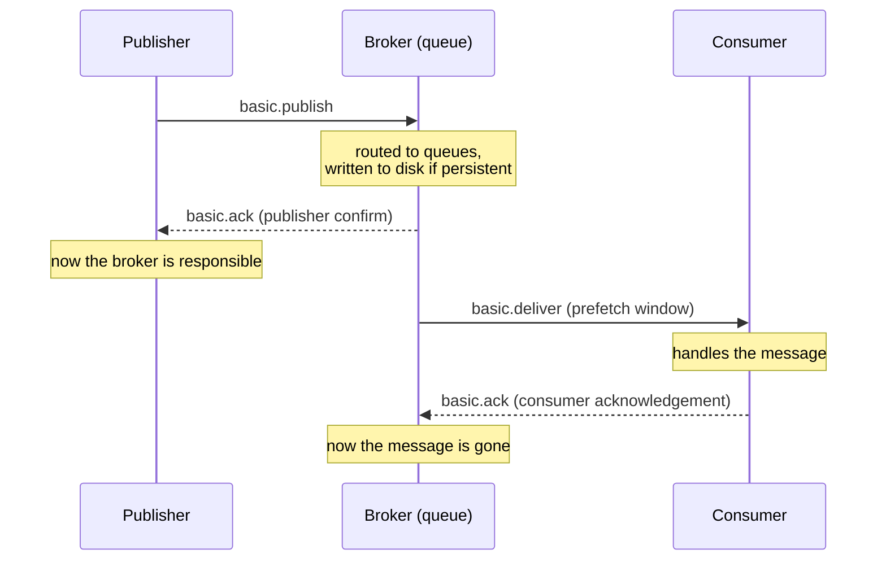

Full example: [`L04.cs`](https://github.com/spareilleux/learn/blob/main/code/rabbitmq/csharp/L04.cs), with publisher confirms in Java in [`L04.java`](https://github.com/spareilleux/learn/blob/main/code/rabbitmq/java/client/src/main/java/dev/learn/rabbitmq/L04.java). Between two of its programs, [`check.sh`](https://github.com/spareilleux/learn/blob/main/code/rabbitmq/check.sh) restarts the broker.

## A chain of custody

"RabbitMQ lost my message" usually means that somebody handed a message over without checking that the other side had taken it. A message changes hands twice, and AMQP has a receipt for each hand-over:



Until the confirm arrives, the publisher is responsible for the message: if the connection drops, only the publisher can send it again. Between delivery and acknowledgement, the broker keeps the message and gives it to someone else if the consumer disappears. This lesson breaks each link on purpose and prints the result.

## Consumer acknowledgements

A consumer chooses, when it calls `basic.consume`, between two modes. With **automatic acknowledgement** (`autoAck: true`), the broker considers a message delivered as soon as it writes it to the socket. With **manual acknowledgement**, the message stays in the queue, marked unacknowledged, until the consumer sends `basic.ack` with its delivery tag.

The programs simulate a crash with a consumer that handles messages until one of them, then stops handling anything, like a dead process, and closes its channel, which is what the broker sees when a connection is lost:

```csharp
ReceivedAsync += async (_, delivery) =>
{
    if (Crashed.Task.IsCompleted)
    {
        return;
    }
    var body = Text(delivery.Body);
    if (body == crashOn)
    {
        Console.WriteLine($"  consumer 1 crashes while handling {body}");
        Crashed.TrySetResult();
        return;
    }
    Console.WriteLine($"  consumer 1 handled {body}");
    if (!autoAck)
    {
        await Channel.BasicAckAsync(delivery.DeliveryTag, multiple: false);
    }
};
```

A second consumer then reads what is left. With `autoAck: true` and five tasks:

```text
autoAck: true, 5 tasks
  consumer 1 handled task 1
  consumer 1 crashes while handling task 2
  work.autoack holds 0 message(s)
```

Tasks 2 to 5 are gone. The broker pushed all five to consumer 1 as soon as it subscribed, and forgot them; the client had them in memory when it died. The [acknowledgements guide](https://www.rabbitmq.com/docs/confirms#acknowledgement-modes) says automatic mode "should be considered unsafe" for this reason. The same crash with manual acknowledgements, and four tasks:

```text
autoAck: false, prefetch 1, 4 tasks
  consumer 1 handled task 1
  consumer 1 crashes while handling task 2
  work.manual holds 3 message(s)
  consumer 2 handled task 2 redelivered=True
  consumer 2 handled task 3 redelivered=False
  consumer 2 handled task 4 redelivered=False
autoAck: false, prefetch unlimited, 4 tasks
  consumer 1 handled task 1
  consumer 1 crashes while handling task 2
  work.manual holds 3 message(s)
  consumer 2 handled task 2 redelivered=True
  consumer 2 handled task 3 redelivered=True
  consumer 2 handled task 4 redelivered=True
```

Nothing is lost: "any delivery (message) that was not acked is automatically requeued when the channel (or connection) on which the delivery happened is closed", in the words of the guide. The **`redelivered`** flag differs between the two runs, and it says more about prefetch than about the crash:

- With a **prefetch of 1**, the broker sends one message, waits for its acknowledgement, then sends the next. Consumer 1 never received tasks 3 and 4, so they come to consumer 2 with `redelivered=False`.
- With **no prefetch limit**, the broker sent every task to consumer 1 at once. Tasks 3 and 4 had been delivered, though never handled, so they come back with `redelivered=True`.

`redelivered=True` therefore means "this message may have been delivered before", not "someone started to handle it". A consumer can't use it to skip work; it can use it as a hint that a duplicate is possible, which the last section deals with.

## Rejecting a message

A consumer that can't handle a message sends [`basic.nack`](https://www.rabbitmq.com/docs/nack) or `basic.reject` (the AMQP original, for one message) with a `requeue` flag. [`Nack`](https://github.com/spareilleux/learn/blob/main/code/rabbitmq/csharp/L04.cs) uses `basic.get` to show each step, on a queue holding `task 1` and `task 2`:

```text
get task 1 delivery-tag=1 redelivered=False (then 1 ready)
  nack requeue=true: back in the queue, at its original position
get task 1 delivery-tag=2 redelivered=True (then 1 ready)
  reject requeue=false: discarded (or dead-lettered, lesson 6)
get task 2 delivery-tag=3 redelivered=False (then 0 ready)
  ack: removed
work.nack holds 0 message(s)
```

- `requeue: true` put `task 1` back **at the head** of the queue, so the next `basic.get` returned it again, with a new delivery tag and `redelivered=True`. The guide says a requeued message goes back "to its original position in its queue, if possible". A consumer that nacks with requeue a message it will never handle creates a loop that spins as fast as the network allows.
- `requeue: false` removed it. Without a dead-letter exchange, which lesson 6 configures, that means deleted.
- **Delivery tags** count deliveries on a channel, 1, 2, 3, including redeliveries. They are only valid on the channel that received them: acknowledging on another channel closes it with a `PRECONDITION_FAILED - unknown delivery tag` error.

## Prefetch: the consumer's window

`BasicQosAsync(prefetchSize: 0, prefetchCount: 3, global: false)` sets how many unacknowledged messages the broker sends to each consumer on the channel. A consumer that never acknowledges, on a queue of ten:

```text
received 3, still ready in the queue: 7
channel closed, ready again: 10
```

The broker stopped at three and kept seven **ready** messages for other consumers; closing the channel made the three unacknowledged ones ready again. Prefetch is how RabbitMQ balances work between competing consumers: a slow consumer that holds its three messages gets no more, and the others take the rest. An unlimited window, the default of a new channel, lets the broker push the whole queue into one consumer's memory. The [prefetch guide](https://www.rabbitmq.com/docs/consumer-prefetch) and the acknowledgements guide suggest that "values in the 100 through 300 range usually offer optimal throughput"; Spring AMQP's default of 250 is in that range. For work that takes seconds per message, a prefetch of 1 gives the fairest distribution.

## Publisher confirms

The other link is between the publisher and the broker. A publish is fire-and-forget: `BasicPublishAsync` completing only means the bytes left the process. With [publisher confirms](https://www.rabbitmq.com/docs/confirms#publisher-confirms) enabled on the channel, the broker answers every publish with `basic.ack` once it has taken responsibility, or `basic.nack` if it refuses it. RabbitMQ.Client 7 can track the answers for you:

```csharp
var options = new CreateChannelOptions(publisherConfirmationsEnabled: true, publisherConfirmationTrackingEnabled: true);
await using IChannel channel = await connection.CreateChannelAsync(options);
```

With tracking on, `BasicPublishAsync` doesn't complete until the confirm arrives, and throws if the broker nacks the message or returns it. Five publishes, the last two to a queue declared with `x-max-length` 1 and `x-overflow` set to `reject-publish`:

```csharp
await PublishAsync("orders.confirmed", mandatory: false, "order 1");
await PublishAsync("no-such-queue", mandatory: false, "order 2");
await PublishAsync("no-such-queue", mandatory: true, "order 3");
await PublishAsync("orders.limited", mandatory: false, "order 4");
await PublishAsync("orders.limited", mandatory: false, "order 5");
```

```text
#1 order 1 to orders.confirmed: confirmed
#2 order 2 to no-such-queue: confirmed
#3 order 3 to no-such-queue: PublishReturnException 312 NO_ROUTE
#4 order 4 to orders.limited: confirmed
#5 order 5 to orders.limited: PublishException IsReturn=False "Message rejected by broker."
```

Each line is worth reading slowly:

1. **Confirmed** means that the message reached every queue it was routed to, and, for a persistent message in a durable queue, that it was written to disk. The broker [writes to disk in batches](https://www.rabbitmq.com/docs/confirms#when-publishes-are-confirmed) "after an interval (a few hundred milliseconds)", so confirms of persistent messages take that long under a light load.
2. **An unroutable message is confirmed too.** The broker "will issue a confirm once the exchange verifies a message won't route to any queue". Order 2 is gone, and the confirm says so only in the sense that the broker has nothing more to do with it. A confirm is not a proof of delivery.
3. **`mandatory` makes that visible.** The broker sends `basic.return` before the `basic.ack`, and the client turns the pair into a [`PublishReturnException`](https://github.com/rabbitmq/rabbitmq-dotnet-client/blob/740faf07f04ade7d35d3539e20613c6ac6b9b46f/projects/RabbitMQ.Client/Exceptions/PublishException.cs#L76-L113) carrying the reply code and text.
4. The limited queue accepted order 4.
5. **A nack.** With `reject-publish`, a full queue refuses new messages and, according to the [queue length guide](https://www.rabbitmq.com/docs/maxlength), "the publisher will be informed of the reject via a `basic.nack`". The client throws a plain `PublishException` with `IsReturn=False`. The confirms guide also says that a nack is otherwise sent only when "an internal error occurs in the Erlang process responsible for a queue", which is why a full queue is the easiest way to see one.

The numbers `#1` to `#5` are the channel's **publish sequence numbers**, which `GetNextPublishSequenceNumberAsync` returns before each publish and which the confirms refer to.

The Java client leaves the waiting to you. `confirmSelect()` turns confirms on, `waitForConfirms(timeout)` blocks until all outstanding publishes are confirmed and returns `false` if one was nacked, and a `ReturnListener` receives `basic.return`:

```java
// Puts the channel in confirm mode: from now on the broker acks or nacks every publish, numbered from 1.
channel.confirmSelect();
// Runs on the connection's thread when basic.return arrives, before the confirm that follows it.
channel.addReturnListener(r -> System.out.println("   basic.return " + r.getReplyCode() + " " + r.getReplyText()));
```

```text
#1 order 1 to orders.confirmed: confirmed
#2 order 2 to no-such-queue: confirmed
   basic.return 312 NO_ROUTE
#3 order 3 to no-such-queue: confirmed
#4 order 4 to orders.limited: confirmed
#5 order 5 to orders.limited: nacked
```

The return listener printed before `waitForConfirms` returned for order 3: `basic.return` arrives first, as the guide says. Unlike the .NET client's tracking, the Java client reports that message as confirmed, and it's up to the application to connect the return with the publish. Waiting for each confirm in turn, as both programs do, is simple and slow; publishing a batch and waiting once, or publishing concurrently with a bound on outstanding confirms (the `outstandingPublisherConfirmationsRateLimiter` parameter of `CreateChannelOptions`), is faster. Lesson 11 measures the difference.

## Surviving a broker restart

A message survives a restart only if its queue is **durable** and the message is **persistent** (`delivery_mode` 2, `DeliveryModes.Persistent`). The first program publishes one persistent and one transient message to a durable queue, then tries to declare a non-durable queue:

```text
orders.durable holds 2 message(s), both confirmed
non-durable queue refused: 541 INTERNAL_ERROR - Feature `transient_nonexcl_queues` is deprecated.
By default, this feature is not permitted anymore.
The feature will be removed from a future major RabbitMQ version, regardless of the configuration; actual version to be determined.
To...
channel open: False, connection open: False
```

`check.sh` then runs `docker restart` on the broker, and the second program looks:

```text
orders.durable: persistent order
orders.transient: 404 NOT_FOUND - no queue 'orders.transient' in vhost '/'
```

The transient message was lost with the restart, although it had been confirmed. The non-durable queue never existed: RabbitMQ 4.3.5 refuses to create a queue that is neither durable nor exclusive. [`rabbit_amqqueue.erl`](https://github.com/rabbitmq/rabbitmq-server/blob/0dde27bfdd1984ff7e157226fd97656854a7f359/deps/rabbit/src/rabbit_amqqueue.erl#L115-L119) declares the [deprecated feature](https://www.rabbitmq.com/docs/deprecated-features) `transient_nonexcl_queues` in the phase `denied_by_default`, and the [declaration code](https://github.com/rabbitmq/rabbitmq-server/blob/0dde27bfdd1984ff7e157226fd97656854a7f359/deps/rabbit/src/rabbit_amqqueue.erl#L234-L240) answers with a 541 `INTERNAL_ERROR`, a connection error: the program's last line shows that the whole connection closed, not just the channel. An old application that declares `durable: false` queues, as many tutorials used to, fails on its first declaration after an upgrade to 4.x. The deprecation can be lifted in the configuration (`deprecated_features.permit.transient_nonexcl_queues = true`) until the feature is removed, which is *to verify* on 4.3.5.

The error text stops at `To...`. A reply text is an AMQP short string, at most 255 bytes, and the warning is longer; the full text is in the broker's log.

## Duplicates are normal: idempotent consumers

The rules above give **at-least-once** delivery: a message is never lost once confirmed and persisted, and it can arrive more than once. Two ordinary events produce duplicates:

- a publisher that doesn't receive a confirm, because the connection dropped after the broker stored the message, publishes it again;
- a consumer that handled a message and died before its acknowledgement reached the broker gets it again.

[`Idempotent`](https://github.com/spareilleux/learn/blob/main/code/rabbitmq/csharp/L04.cs) reproduces both. The publisher sends `P-1` twice with the same message ID, as after a lost confirm. Consumer 1 charges `P-2` and crashes before acknowledging it. The consumers remember the IDs they have processed:

```csharp
var id = delivery.BasicProperties.MessageId!;
if (processed.Add(id))
{
    balance += int.Parse(Text(delivery.Body));
    Console.WriteLine($"{name}: {id} redelivered={delivery.Redelivered} charged, balance {balance}");
}
else
{
    Console.WriteLine($"{name}: {id} redelivered={delivery.Redelivered} already processed, acknowledged without charging");
}
```

```text
consumer 1: P-1 redelivered=False charged, balance 30
consumer 1: P-1 redelivered=False already processed, acknowledged without charging
consumer 1: P-2 redelivered=False charged, balance 75
consumer 1: crashes before acknowledging P-2
consumer 2: P-2 redelivered=True already processed, acknowledged without charging
final balance 75
```

Without the check, the balance would be 150. The duplicate `P-1` arrived with `redelivered=False`, since the broker delivered each copy once: only the message ID reveals it. In the program the processed IDs are a `HashSet<string>` shared by the two consumers; in a real service they are a table with a unique key on the message ID, updated in the same database transaction as the balance, so that "processed" and "charged" can't disagree. Lesson 7 comes back to it with the outbox pattern, which solves the mirror problem on the publishing side.

## What protects what

| Failure | Without protection | Protection |
|---|---|---|
| consumer crashes while holding messages | lost with `autoAck: true` | manual acknowledgements |
| consumer crashes after handling, before acking | handled twice | idempotent consumer (message ID) |
| one slow consumer | the broker pushes the queue into its memory | a prefetch limit |
| publisher's connection drops | message may be lost | publisher confirms, then publish again |
| retry after a lost confirm | duplicate | idempotent consumer |
| nothing routes the message | dropped, and still confirmed | `mandatory`, alternate exchange |
| queue full with `reject-publish` | refused | confirm is a nack: slow down, retry later |
| broker restart | transient messages lost | durable queue and persistent messages |

## Key takeaways

- A message is the publisher's responsibility until the confirm, and the broker's until the consumer's acknowledgement. Every "lost message" is a gap in that chain.
- Automatic acknowledgement loses whatever a crashing consumer held. Manual acknowledgement requeues unacknowledged messages when the channel closes.
- `redelivered=True` means "maybe delivered before", and depends on the prefetch window; only a message ID identifies a duplicate.
- Prefetch bounds a consumer's unacknowledged messages. Leave it unlimited and one consumer takes the whole queue; 100 to 300 suits fast handlers, 1 suits slow ones.
- A publisher confirm means "the broker took responsibility", not "a queue received it": unroutable messages are confirmed. Add `mandatory` to find out. A full `reject-publish` queue nacks.
- Durable queue plus persistent message survives a restart. RabbitMQ 4.3 refuses non-durable, non-exclusive queues with a connection error.
- Delivery is at least once: make consumers idempotent with a message ID stored in the same transaction as the effect.

## Exercises

1. Run the manual-acknowledgement crash with a prefetch of 2. Which tasks does consumer 2 receive with `redelivered=True`?

<details>
<summary>Solution</summary>

```text
autoAck: false, prefetch 2, 4 tasks
  consumer 1 handled task 1
  consumer 1 crashes while handling task 2
  work.manual holds 3 message(s)
  consumer 2 handled task 2 redelivered=True
  consumer 2 handled task 3 redelivered=True
  consumer 2 handled task 4 redelivered=False
```

The broker first sent tasks 1 and 2. When consumer 1 acknowledged task 1, a place opened in the window and task 3 followed, so tasks 2 and 3 were both delivered and unacknowledged when the channel closed. Task 4 never left the queue. The flag tells you how far the window reached, not how far the consumer got; `check.sh` runs this as `l04-exercise-prefetch`.

</details>

2. The C# publisher saw order 2 to `no-such-queue` as confirmed. Your service publishes to an exchange whose bindings are managed by another team. Which two changes let you detect, or survive, a missing binding, and what does each cost?

<details>
<summary>Solution</summary>

- Publish with **`mandatory: true`**. With confirm tracking, `BasicPublishAsync` throws `PublishReturnException` 312 `NO_ROUTE`, as order 3 did, so the publisher can log, alert or retry. The cost is an extra frame per unroutable message and handling code in every publisher.
- Give the exchange an **alternate exchange**, preferably through a policy, as in lesson 2. Unroutable messages are kept in a queue of their own, even from publishers that don't set `mandatory`. The cost is a queue to watch and drain, and the risk that it fills silently if nobody does.

Both together are common: the alternate exchange catches everything, and `mandatory` in the publishers that must know immediately. Note that with an alternate exchange the message *is* routed, so `mandatory` no longer reports it.

</details>

3. The transient message in a durable queue was confirmed, then lost by the restart. Why might a system still publish transient messages on purpose?

<details>
<summary>Solution</summary>

Because persistence costs a disk write, and the confirm waits for it (a few hundred milliseconds in the batch interval at low load, according to the confirms guide). Messages that are worthless after a restart, such as the latest price of a currency or a cache invalidation that a restarted service no longer needs, can skip it. The durable queue and its bindings still survive, so consumers find their topology after the restart, and only in-flight messages are lost. What is also worth knowing is that RabbitMQ 4.3 no longer lets you express "the whole queue is disposable" with a non-durable queue, except an exclusive one tied to a connection. The throughput difference between persistent and transient messages is *to verify* in lesson 11.

</details>

## Sources

- RabbitMQ: [consumer acknowledgements and publisher confirms](https://www.rabbitmq.com/docs/confirms), [consumer prefetch](https://www.rabbitmq.com/docs/consumer-prefetch), [negative acknowledgements](https://www.rabbitmq.com/docs/nack), [queue length limit](https://www.rabbitmq.com/docs/maxlength), [queues and durability](https://www.rabbitmq.com/docs/queues#durability), [deprecated features](https://www.rabbitmq.com/docs/deprecated-features), [reliability guide](https://www.rabbitmq.com/docs/reliability)
- .NET client source at v7.2.2: [`CreateChannelOptions.cs`](https://github.com/rabbitmq/rabbitmq-dotnet-client/blob/740faf07f04ade7d35d3539e20613c6ac6b9b46f/projects/RabbitMQ.Client/CreateChannelOptions.cs#L89-L98), [`PublishException.cs`](https://github.com/rabbitmq/rabbitmq-dotnet-client/blob/740faf07f04ade7d35d3539e20613c6ac6b9b46f/projects/RabbitMQ.Client/Exceptions/PublishException.cs#L40-L113)
- Server source at v4.3.5: [`rabbit_amqqueue.erl`](https://github.com/rabbitmq/rabbitmq-server/blob/0dde27bfdd1984ff7e157226fd97656854a7f359/deps/rabbit/src/rabbit_amqqueue.erl#L2100-L2111)
- [AMQP 0-9-1 complete reference](https://www.rabbitmq.com/amqp-0-9-1-reference): `basic.ack`, `basic.nack`, `basic.qos`, `confirm.select`
