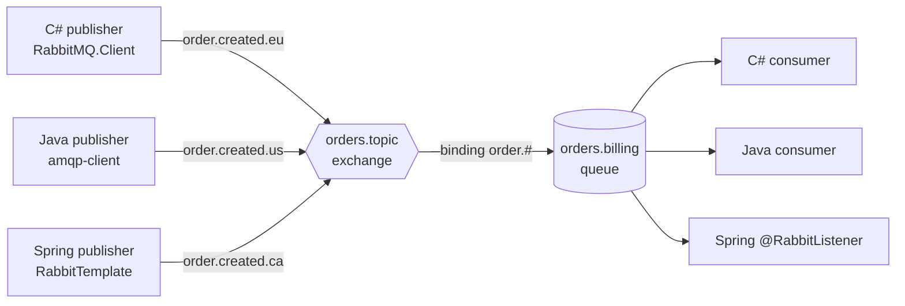

:::note[Versions studied]
[RabbitMQ](https://www.rabbitmq.com/docs) **4.3.5**, the latest release on 2026-09-15, in the official Docker image [`rabbitmq:4.3.5-management`](https://hub.docker.com/_/rabbitmq). The clients are [RabbitMQ.Client](https://www.nuget.org/packages/RabbitMQ.Client) **7.2.2** on .NET 10, the [RabbitMQ Java client](https://www.rabbitmq.com/client-libraries/java-api-guide) **5.35.0** on Java 25, and [Spring AMQP](https://docs.spring.io/spring-amqp/reference/) **4.1.1** from Spring Boot 4.1.1. Every example is in [`code/rabbitmq`](https://github.com/spareilleux/learn/tree/main/code/rabbitmq): [`check.sh`](https://github.com/spareilleux/learn/blob/main/code/rabbitmq/check.sh) runs each program against a fresh broker and compares its output with the files in [`expected`](https://github.com/spareilleux/learn/tree/main/code/rabbitmq/expected). CI builds the clients on Windows, Linux and macOS, and runs them against the broker on Linux only, because GitHub's Windows and macOS runners have no Docker.
:::

## Why I'm learning this

I have sent messages through RabbitMQ for years, mostly through a library that hid it: MassTransit on one project, Spring AMQP on another. It worked until the day it didn't. A consumer restarted and some orders were processed twice; another time, messages vanished and nobody could say where they went. Each time I realised that I knew the library's API and not the broker underneath.

I want to know what RabbitMQ actually does with a message from the moment a publisher sends it to the moment a consumer acknowledges it, so that I can design a topology on purpose, choose the right queue type, and find out what went wrong from the broker's own tools.

## Who this course is for

You are a C# or Java developer. You have published or consumed messages, perhaps through MassTransit, NServiceBus, Spring AMQP or Spring Cloud Stream, and you have run a container before. You don't need to know AMQP. The Java side assumes the level of [Java for C# developers](../java-for-csharp/); lesson 3 sends Spring questions to [Spring Boot, Spring Cloud and Reactor for C# developers](../spring-cloud-reactor/), and lesson 1 sends container questions to [WSL containers](../wsl-containers/).

## The running example

The lessons use small, recognisable flows rather than one application: log lines routed by severity, prices fanned out to several screens, orders and payments. A C# program ([`code/rabbitmq/csharp`](https://github.com/spareilleux/learn/tree/main/code/rabbitmq/csharp)), a Java client program and a Spring Boot application ([`code/rabbitmq/java`](https://github.com/spareilleux/learn/tree/main/code/rabbitmq/java)) exchange the same messages, because a broker is where different languages meet.

None of the GuitarAlchemist repositories uses RabbitMQ in its code, so there is no practical case from them yet; the [journal](journal/) notes the one configuration I found.

## By the end of this course, I will be able to

- explain the AMQP 0-9-1 model: connections, channels, exchanges, bindings, queues and messages;
- run RabbitMQ in a container and inspect it with the management UI, `rabbitmqctl` and `rabbitmq-diagnostics`;
- design a topology with direct, fanout, topic and headers exchanges, and handle messages nothing routes;
- write producers and consumers in C#, in Java and with Spring AMQP that interoperate;
- say who is responsible for a message at each step, and use acknowledgements, prefetch, publisher confirms and persistence to lose none;
- choose between classic queues, quorum queues and streams;
- handle failures with dead lettering, TTLs and retries;
- run a cluster, secure it, monitor it and size it;
- operate RabbitMQ over time: upgrades, definitions, Kubernetes.

## Outline

| # | Lesson | You may already know |
|---|---|---|
| 1 | [Getting started](01-getting-started/) | a queue from MassTransit or Spring, `docker run` |
| 2 | [Topology: exchanges, bindings and queues](02-topology/) | Azure Service Bus topics and subscription rules, JMS destinations |
| 3 | [Clients in C#, Java and Spring AMQP](03-clients/) | `HttpClient` lifetime, `async` consumers, `RabbitTemplate` |
| 4 | [Reliability: acknowledgements, prefetch, confirms](04-reliability/) | database transactions, at-least-once delivery |
| 5 | Queue types: classic, quorum and streams *(coming next)* | Raft, Kafka partitions |
| 6 | Errors: dead lettering, TTL, retries and delayed messages | Polly retries, MassTransit's error queues |
| 7 | Patterns: work queues, publish/subscribe, RPC, competing consumers, outbox | the transactional outbox of MassTransit or Spring Modulith |
| 8 | Clustering and high availability: network partitions, quorum | failover clusters |
| 9 | Security: virtual hosts, users, permissions, TLS | connection strings, certificates in Kestrel |
| 10 | Observability: Prometheus, Grafana, key metrics, alarms, flow control | OpenTelemetry, `dotnet-counters` |
| 11 | Performance and sizing, measured | BenchmarkDotNet |
| 12 | Other protocols: streams and super streams, MQTT, AMQP 1.0; RabbitMQ and Kafka | Kafka, Azure Event Hubs |
| 13 | Operations: upgrades, definitions, the Kubernetes Cluster Operator | Helm charts, rolling upgrades |

[Journal](journal/): what I tried, what surprised me, what I still need to verify.

## Resources

- [RabbitMQ documentation](https://www.rabbitmq.com/docs), in particular [AMQP 0-9-1 model explained](https://www.rabbitmq.com/tutorials/amqp-concepts), [exchanges](https://www.rabbitmq.com/docs/exchanges), [queues](https://www.rabbitmq.com/docs/queues), [consumer acknowledgements and publisher confirms](https://www.rabbitmq.com/docs/confirms), and the [production deployment guidelines](https://www.rabbitmq.com/docs/production-checklist)
- [RabbitMQ tutorials](https://www.rabbitmq.com/tutorials), in C# and Java among other languages
- [.NET client API guide](https://www.rabbitmq.com/client-libraries/dotnet-api-guide) and [Java client API guide](https://www.rabbitmq.com/client-libraries/java-api-guide)
- [Spring AMQP reference](https://docs.spring.io/spring-amqp/reference/) and [Spring Boot's messaging chapter](https://docs.spring.io/spring-boot/reference/messaging/amqp.html)
- [AMQP 0-9-1 complete reference](https://www.rabbitmq.com/amqp-0-9-1-reference): every method and field of the protocol
- Source code: [rabbitmq-server](https://github.com/rabbitmq/rabbitmq-server), [rabbitmq-dotnet-client](https://github.com/rabbitmq/rabbitmq-dotnet-client), [rabbitmq-java-client](https://github.com/rabbitmq/rabbitmq-java-client), [the Docker image](https://github.com/docker-library/rabbitmq)
