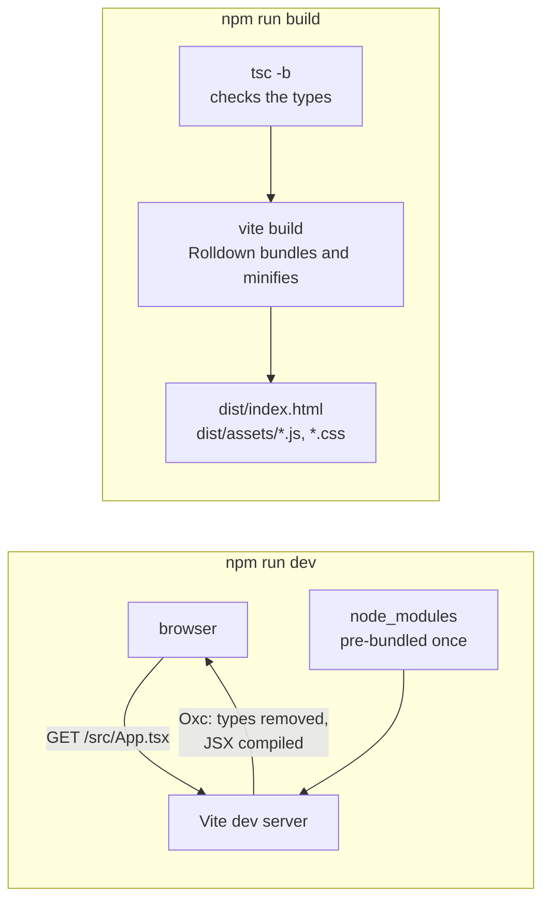

import { Tabs, TabItem } from '@astrojs/starlight/components';

Code: the course's application in [`code/react-vite`](https://github.com/spareilleux/learn/tree/3f7a5df/code/react-vite), its [`vite.config.ts`](https://github.com/spareilleux/learn/blob/3f7a5df/code/react-vite/vite.config.ts), and the scripts that capture this lesson's outputs: [`scripts/dev-start.mjs`](https://github.com/spareilleux/learn/blob/3f7a5df/code/react-vite/scripts/dev-start.mjs), [`scripts/dev-module.mjs`](https://github.com/spareilleux/learn/blob/3f7a5df/code/react-vite/scripts/dev-module.mjs) and [`scripts/hmr.mjs`](https://github.com/spareilleux/learn/blob/3f7a5df/code/react-vite/scripts/hmr.mjs).

## What Vite is, for a .NET or Java developer

A .NET web front end starts with `dotnet new blazorwasm`, runs with `dotnet watch`, and ships with `dotnet publish`; MSBuild compiles everything before anything runs. A React project starts with `create-vite`, runs with `vite`, and ships with `vite build`, and in between, [Vite](https://vite.dev/) plays two roles that .NET gives to one tool:

| | .NET (Blazor) | Java (Maven) | Vite |
|---|---|---|---|
| Create a project | `dotnet new blazorwasm` | `mvn archetype:generate` | `npm create vite`, which runs `create-vite` |
| Project files | `.csproj` | `pom.xml` | `package.json`, `vite.config.ts`, `tsconfig.json` |
| Development loop | `dotnet watch`: rebuild, then hot reload | rebuild, restart | a dev server that compiles each file when the browser asks for it |
| Type checking | the compiler, part of every build | `javac`, part of every build | `tsc`, a separate step that Vite doesn't run |
| Production build | `dotnet publish` | `mvn package` | `vite build`: static HTML, JavaScript and CSS files |

During development, Vite is a **server**: the browser loads `index.html`, then asks for each module, and Vite compiles the TypeScript and JSX of each file at that moment, with [Oxc](https://oxc.rs/), a compiler written in Rust. For production, Vite is a **bundler**: [Rolldown](https://rolldown.rs/), also in Rust, bundles and minifies the application into a few files. [Vite 8](https://vite.dev/blog/announcing-vite8), released in March 2026, replaced the two tools that earlier versions used for those jobs, esbuild and Rollup, with Rolldown and Oxc.



The course uses the versions current on 15 September 2026: **Vite 8.3.0** with [`@vitejs/plugin-react`](https://github.com/vitejs/vite-plugin-react/tree/b0a014da31be23c7806ffb0b997ec53b52ab68f2/packages/plugin-react) 6.1.1, **React 19.3.0**, and TypeScript 7.0.2, the version of the [TypeScript course](../../typescript-for-csharp-java/01-compiler-and-tooling/). Vite 8 requires Node.js 20.19 or 22.12 and later; the course runs on Node.js 24.21.0, like the JavaScript and TypeScript courses.

## Creating the project

[`create-vite`](https://vite.dev/guide/#scaffolding-your-first-vite-project) copies a template into a new folder. `npm create vite` is the short form that the documentation shows: npm turns `npm create vite` into running the package `create-vite`. The commands below pin its version and answer its questions with options, so that they give the same result every time.

<Tabs syncKey="os">
<TabItem label="Windows">

```powershell
npx create-vite@9.2.1 guitar-app --template react-ts --no-interactive
Set-Location guitar-app
npm install
npm run dev
```

</TabItem>
<TabItem label="Linux / WSL">

```bash
npx create-vite@9.2.1 guitar-app --template react-ts --no-interactive
cd guitar-app
npm install
npm run dev
```

</TabItem>
<TabItem label="macOS">

```bash
npx create-vite@9.2.1 guitar-app --template react-ts --no-interactive
cd guitar-app
npm install
npm run dev
```

</TabItem>
</Tabs>

Without `--no-interactive`, in a terminal, `create-vite` asks for the name, the framework and the variant, and offers to install and start the project. The course's `check.sh` runs the same command in its `out` folder:

```text
│
◇  Scaffolding project in out/guitar-app...
│
└  Done. Now run:

  cd guitar-app
  npm install
  npm run dev
```

`create-vite --help` lists the other templates, among them `react-compiler-ts`, the same project with the [React Compiler](https://react.dev/learn/react-compiler) that lesson 10 covers, and an `--eslint` option that replaces oxlint with ESLint.

### What the template contains

```text
.gitignore
.oxlintrc.json
README.md
index.html
package.json
public/favicon.svg
public/icons.svg
src/App.css
src/App.tsx
src/assets/hero.png
src/assets/react.svg
src/assets/vite.svg
src/index.css
src/main.tsx
tsconfig.app.json
tsconfig.json
tsconfig.node.json
vite.config.ts
```

| File | Role | Closest thing in .NET |
|---|---|---|
| `index.html` | the entry point: Vite reads it, and follows its `<script type="module">` | `wwwroot/index.html` in Blazor WebAssembly |
| `src/main.tsx` | mounts the root component into the `root` element | `Program.cs` |
| `src/App.tsx` | the root component | `App.razor` |
| `vite.config.ts` | Vite's configuration, with the React plugin | the build part of the `.csproj` |
| `tsconfig.json` | two project references, one for the browser code and one for `vite.config.ts` | a solution with two projects |
| `tsconfig.app.json`, `tsconfig.node.json` | the compiler options of each project | two `.csproj` files |
| `package.json` | dependencies and scripts | package references and build targets |
| `.oxlintrc.json` | the lint rules | `.editorconfig` and analyzers |
| `public/` | files copied as they are, with their names | `wwwroot` static files |

`index.html` is at the root and not in `public`, because for Vite it is source code: [the guide](https://vite.dev/guide/#index-html-and-project-root) calls it the entry point of the module graph. Its last line loads `/src/main.tsx`, and `main.tsx` renders the application:

```tsx
// src/main.tsx
import { StrictMode } from 'react';
import { createRoot } from 'react-dom/client';
import './index.css';
import App from './App.tsx';

createRoot(document.getElementById('root')!).render(
  <StrictMode>
    <App />
  </StrictMode>,
);
```

[`createRoot`](https://react.dev/reference/react-dom/client/createRoot) takes a DOM element, and `render` displays a component in it; from then on React owns everything inside that element. [`StrictMode`](https://react.dev/reference/react/StrictMode) adds checks in development only, which lesson 3 shows. The `!` is TypeScript's non-null assertion ([TypeScript lesson 2](../../typescript-for-csharp-java/02-structural-typing/)): `getElementById` returns `HTMLElement | null`, and the template knows that `index.html` has the element.

### package.json

```json
{
  "name": "guitar-app",
  "private": true,
  "version": "0.0.0",
  "type": "module",
  "scripts": {
    "dev": "vite",
    "build": "tsc -b && vite build",
    "lint": "oxlint",
    "preview": "vite preview"
  },
  "dependencies": {
    "react": "^19.2.8",
    "react-dom": "^19.2.8"
  },
  "devDependencies": {
    "@types/node": "^24.13.3",
    "@types/react": "^19.2.18",
    "@types/react-dom": "^19.2.7",
    "@vitejs/plugin-react": "^6.1.1",
    "oxlint": "^1.81.0",
    "typescript": "~6.0.2",
    "vite": "^8.3.0"
  }
}
```

`react` is the library that knows components and state, and `react-dom` the part that updates the browser's DOM; React Native replaces the second with another renderer. The `@types` packages hold the type declarations. The template asks for React `^19.2.8`, so `npm install` gets 19.3.0 today, and TypeScript `~6.0.2`, which allows 6.0.x only. The course's own [`package.json`](https://github.com/spareilleux/learn/blob/3f7a5df/code/react-vite/package.json) pins every version exactly, adds Vitest, Testing Library and jsdom for the tests, and uses TypeScript 7.0.2, which checks the same two projects.

The `build` script runs `tsc -b` first, the `-b` of project references, which checks both projects, and `vite build` only if `tsc` succeeds. That order matters, and the rest of the lesson shows why.

## The dev server

`npm run dev` runs `vite`:

```text

  VITE v8.3.0  ready in N ms

  ➜  Local:   http://localhost:5199/
  ➜  Network: use --host to expose
```

Vite's default port is 5173; the course's scripts use 5199 with `--strictPort`, which stops instead of picking the next free port. In a terminal, Vite also prints `press h + enter to show help`, the shortcuts to open the browser, restart or quit. The server starts in a fraction of a second whatever the size of the application, because it compiles nothing yet: it waits for the browser.

[`scripts/dev-module.mjs`](https://github.com/spareilleux/learn/blob/3f7a5df/code/react-vite/scripts/dev-module.mjs) starts the same server with Vite's [JavaScript API](https://vite.dev/guide/api-javascript), requests a URL as the browser would, and prints the answer. The page first:

```html
GET / -> 200 text/html
<!doctype html>
<html lang="en">
  <head>
    <script type="module">import { injectIntoGlobalHook } from "/@react-refresh";
injectIntoGlobalHook(window);
window.$RefreshReg$ = () => {};
window.$RefreshSig$ = () => (type) => type;</script>

    <script type="module" src="/@vite/client"></script>

    <meta charset="UTF-8" />
    <meta name="viewport" content="width=device-width, initial-scale=1.0" />
    <title>React (Vite) course</title>
  </head>
  <body>
    <div id="root"></div>
    <script type="module" src="/src/main.tsx"></script>
  </body>
</html>
```

Vite added two scripts to `index.html`: `/@vite/client`, which connects to the server to receive updates, and the preamble of React Refresh, from the React plugin. Then the browser asks for `/src/main.tsx`:

```js
GET /src/main.tsx -> 200 text/javascript
const StrictMode = __vite__cjsImport0_react["StrictMode"];const createRoot = __vite__cjsImport1_reactDom_client["createRoot"];const _jsxDEV = __vite__cjsImport4_react_jsxDevRuntime["jsxDEV"];import __vite__cjsImport0_react from "/node_modules/.vite/deps/react.js?v=HASH";
import __vite__cjsImport1_reactDom_client from "/node_modules/.vite/deps/react-dom_client.js?v=HASH";
import "/src/index.css";
import App from "/src/App.tsx";
var _jsxFileName = "src/main.tsx";
import __vite__cjsImport4_react_jsxDevRuntime from "/node_modules/.vite/deps/react_jsx-dev-runtime.js?v=HASH";
createRoot(document.getElementById("root")).render(/* @__PURE__ */ _jsxDEV(StrictMode, { children: /* @__PURE__ */ _jsxDEV(App, {}, void 0, false, {
	fileName: _jsxFileName,
	lineNumber: 8,
	columnNumber: 5
}, this) }, void 0, false, {
	fileName: _jsxFileName,
	lineNumber: 7,
	columnNumber: 3
}, this));

//# sourceMappingURL=data:application/json;base64,…
```

That file is what the browser runs, and each change from the source has a reason:

- **The types are gone**, including the `!` after `getElementById`. As in [TypeScript lesson 1](../../typescript-for-csharp-java/01-compiler-and-tooling/#a-type-error-stops-nothing), removing types checks nothing.
- **JSX became function calls**: `<StrictMode><App /></StrictMode>` is now `_jsxDEV(StrictMode, { children: _jsxDEV(App, {}) })`, with the file name and line of each element so that React's warnings can point to the source. Lesson 2 opens that transformation.
- **The imports became URLs**, because the browser loads modules by URL and knows nothing of `node_modules`. `react` is served from `/node_modules/.vite/deps/react.js`: Vite [pre-bundled](https://vite.dev/guide/dep-pre-bundling) each dependency into one file once, converted React's CommonJS package to an ES module, hence the `__vite__cjsImport` names, and added a hash for the browser's cache.
- **CSS is imported like a module**: `import "/src/index.css"` returns a small script that inserts the styles into the page.
- **A source map is inline**, so the browser's debugger shows `main.tsx` as you wrote it. The course's outputs shorten it to `…`.

A .NET developer can compare it with a Razor file compiled on demand, one file per request, with the difference that the result goes to the browser and not to the server's memory. That is why startup doesn't depend on the size of the application: a page that isn't open is never compiled.

## Hot module replacement and Fast Refresh

Edit a component and save: the page changes without reloading, and the component keeps its state. Two mechanisms work together. Vite's [HMR API](https://vite.dev/guide/api-hmr) sends a message to the page when a file changes, and [React Refresh](https://github.com/facebook/react/tree/2b19aecd0e9111b774fad0fad9862e50bcb5bc8a/packages/react-refresh), the part of the React plugin also called Fast Refresh, replaces the component's function while keeping the state that React holds for it. The end of what the server sends for `App.tsx` shows the plugin's code:

```js
// the end of GET /src/App.tsx, from expected/l01_dev_app.txt
_s(App, "oDgYfYHkD9Wkv4hrAPCkI/ev3YU=");
_c = App;
var _c;
$RefreshReg$(_c, "App");
import * as RefreshRuntime from "/@react-refresh";
const inWebWorker = typeof WorkerGlobalScope !== 'undefined' && self instanceof WorkerGlobalScope;
import * as __vite_react_currentExports from "/src/App.tsx";
if (import.meta.hot && !inWebWorker) {
  if (!window.$RefreshReg$) {
    throw new Error(
      "@vitejs/plugin-react can't detect preamble. Something is wrong."
    );
  }

  const currentExports = __vite_react_currentExports;
  queueMicrotask(() => {
    RefreshRuntime.registerExportsForReactRefresh("src/App.tsx", currentExports);
    import.meta.hot.accept((nextExports) => {
      if (!nextExports) return;
      const invalidateMessage = RefreshRuntime.validateRefreshBoundaryAndEnqueueUpdate("src/App.tsx", currentExports, nextExports);
      if (invalidateMessage) import.meta.hot.invalidate(invalidateMessage);
    });
  });
}
```

`$RefreshReg$` registers the component `App` under its file and name, and `_s(App, "…")` records a signature of the hooks it calls, here one `useState`. `import.meta.hot.accept` tells Vite that this module can replace itself: when the file changes, the page imports the new version, and React Refresh swaps the function. If the signature changed, because a hook was added or removed, the old state no longer matches, and React mounts the component again.

[`scripts/hmr.mjs`](https://github.com/spareilleux/learn/blob/3f7a5df/code/react-vite/scripts/hmr.mjs) connects to the server's WebSocket with the `vite-hmr` protocol, as `/@vite/client` does, requests the page's modules, edits the title in a copy of `App.tsx`, and prints what the server sends:

```json
{
  "type": "connected"
}
{
  "type": "update",
  "updates": [
    {
      "type": "js-update",
      "timestamp": TIMESTAMP,
      "path": "/src/App.tsx",
      "acceptedPath": "/src/App.tsx",
      "explicitImportRequired": false,
      "isWithinCircularImport": false
    }
  ]
}
```

One message, for one module: the page will import `/src/App.tsx` again, and nothing else. I checked the rest by hand in a browser, on Windows: after three clicks on the counter and two on the capo, editing the title in `App.tsx` changed the heading, the counter still said 3 and the capo 2, and a variable set on `window` before the edit was still there, so the page hadn't reloaded. That is `dotnet watch`'s hot reload, with the difference that the state survives in a component whose code changed.

Fast Refresh has one condition, which the template's lint configuration enforces with `react/only-export-components`: a file that exports components should export only components. A file that also exports a function or a constant can't be replaced safely, and a change to it reloads the page. The course keeps its helpers, such as `transpose` in lesson 3, in `.ts` files of their own.

## A type error ships

Vite removes types; it doesn't check them. The course's `check.sh` copies the application to `out/l01-type-error` and changes one line of `App.tsx`, from `count + 1` to `count + '1'`, then builds it:

```text
> npx vite build
vite v8.3.0 building client environment for production...
transforming...
✓ 24 modules transformed.
rendering chunks...
computing gzip size...
dist/index.html                   0.40 kB │ gzip:  0.27 kB
dist/assets/index-Cl5cuL7y.css    0.09 kB │ gzip:  0.11 kB
dist/assets/index-QMb0bu8p.js   222.62 kB │ gzip: 69.73 kB

✓ built in N ms
```

The build succeeds. I served that bundle with `vite preview` and clicked the button twice: it showed `Count is 01`, then `Count is 011`, because `count + '1'` concatenates, as [JavaScript lesson 2](../../javascript-for-csharp-java/02-values-and-types/) explains. `tsc -b` on the same copy:

```text
> npx tsc -b --pretty false
src/App.tsx(10,53): error TS2345: Argument of type '(count: number) => string' is not assignable to parameter of type 'SetStateAction<number>'.
  Type '(count: number) => string' is not assignable to type '(prevState: number) => number'.
    Type 'string' is not assignable to type 'number'.
```

`tsc` exits with code 1, and `npm run build`, which is `tsc -b && vite build`, stops before Vite. The [Vite documentation](https://vite.dev/guide/features.html#transpile-only) says it outright: Vite only transpiles, type checking belongs to the editor and the build process, and it suggests `tsc --noEmit --watch` in a second terminal during development. A project whose `build` script is only `vite build` ships whatever `tsc` would have refused; the [TypeScript course found such a project in GA](../../typescript-for-csharp-java/01-compiler-and-tooling/#in-real-projects).

## Building for production

`npm run build` on the course's application:

```text
> npx tsc -b --pretty false
> npx vite build
vite v8.3.0 building client environment for production...
transforming...
✓ 24 modules transformed.
rendering chunks...
computing gzip size...
dist/index.html                   0.40 kB │ gzip:  0.27 kB
dist/assets/index-Cl5cuL7y.css    0.09 kB │ gzip:  0.11 kB
dist/assets/index-BQ_Vbf-Q.js   222.62 kB │ gzip: 69.73 kB

✓ built in N ms
```

```text
> ls dist
assets/index-BQ_Vbf-Q.js
assets/index-Cl5cuL7y.css
index.html
```

Twenty-four modules became one JavaScript file and one CSS file, minified by Oxc. Most of the 223 kB, 70 kB compressed, is React and React DOM. The hash in each file name changes with the content: the type error above gave `index-QMb0bu8p.js` for a file of the same size. A server can then tell browsers to cache `assets/` forever, since a new build writes new names, and only `index.html` has to be revalidated.

`dist` is a static site: any web server can serve it, including ASP.NET Core's static files or Spring Boot's `static` folder, which lesson 13 sets up. `npm run preview` runs [`vite preview`](https://vite.dev/guide/cli.html#vite-preview), a local server for `dist` that [the documentation](https://vite.dev/guide/cli.html#vite-preview) says not to use as a production server. By default the bundle targets the browsers of [Baseline](https://web.dev/baseline) Widely Available at a date fixed for each major version of Vite; for Vite 8, that is Chrome and Edge 111, Firefox 114 and Safari 16.4 ([building for production](https://vite.dev/guide/build)).

:::note[Outputs in this course]
The outputs are those of Node.js 24.21.0, Vite 8.3.0, TypeScript 7.0.2 and Vitest 5.0.0. Paths are shown relative to the course folder, durations as `N`, the dev server's cache hashes as `HASH`, an HMR timestamp as `TIMESTAMP`, and inline source maps as `…`; [`normalize.mjs`](https://github.com/spareilleux/learn/blob/3f7a5df/code/react-vite/normalize.mjs) makes the same changes before `check.sh` compares the outputs with the ones pasted here, on Windows, Linux and macOS.
:::

## In GuitarAlchemist/ga

GA's main React application, [`ReactComponents/ga-react-components`](https://github.com/GuitarAlchemist/ga/tree/8cc8c5a17c685c779c46cd5e6d0a3f5d5036cc41/ReactComponents/ga-react-components), at commit [`8cc8c5a`](https://github.com/GuitarAlchemist/ga/commit/8cc8c5a17c685c779c46cd5e6d0a3f5d5036cc41), is a Vite project a generation older: its `package.json` asks for React [`^18.3.1`](https://github.com/GuitarAlchemist/ga/blob/8cc8c5a17c685c779c46cd5e6d0a3f5d5036cc41/ReactComponents/ga-react-components/package.json#L57), `@vitejs/plugin-react` [`^4.3.2`](https://github.com/GuitarAlchemist/ga/blob/8cc8c5a17c685c779c46cd5e6d0a3f5d5036cc41/ReactComponents/ga-react-components/package.json#L82) and Vite [`^5.4.8`](https://github.com/GuitarAlchemist/ga/blob/8cc8c5a17c685c779c46cd5e6d0a3f5d5036cc41/ReactComponents/ga-react-components/package.json#L92), so esbuild and Rollup rather than Oxc and Rolldown. Its [`build` script](https://github.com/GuitarAlchemist/ga/blob/8cc8c5a17c685c779c46cd5e6d0a3f5d5036cc41/ReactComponents/ga-react-components/package.json#L11-L15) is `vite build` alone, with `tsc -b` in two separate scripts, `build:with-types` and `typecheck`.

Its `vite.config.ts` has 3,005 lines, and shows how far the dev server can go. The [configuration itself](https://github.com/GuitarAlchemist/ga/blob/8cc8c5a17c685c779c46cd5e6d0a3f5d5036cc41/ReactComponents/ga-react-components/vite.config.ts#L2839-L2869) lists six plugins, listens on port 5176 on every network interface, and proxies `/api`, `/hubs` and `/graphql` to the ASP.NET Core backend on port 5232, and `/proxy/ollama` to a local Ollama server. Four of the plugins add middleware with [`configureServer`](https://vite.dev/guide/api-plugin.html#configureserver): one of them alone [registers 27 handlers](https://github.com/GuitarAlchemist/ga/blob/8cc8c5a17c685c779c46cd5e6d0a3f5d5036cc41/ReactComponents/ga-react-components/vite.config.ts#L1438-L1451), 23 of them under `/dev-data/`, which serve the repository's backlog, quality reports and agent activity as JSON. A [comment](https://github.com/GuitarAlchemist/ga/blob/8cc8c5a17c685c779c46cd5e6d0a3f5d5036cc41/ReactComponents/ga-react-components/vite.config.ts#L57-L64) explains that a Cloudflare tunnel exposes this dev server as the public demo site, so every request looks local, and a function checks the `Host` header to keep the control endpoints private. The dev server is a Node.js web server, and GA uses it as one; `vite build` writes none of that middleware into `dist`, and a static deployment would have none of those endpoints.

[`Apps/ga-client`](https://github.com/GuitarAlchemist/ga/blob/8cc8c5a17c685c779c46cd5e6d0a3f5d5036cc41/Apps/ga-client/package.json#L11) is the other React application. Its `dev` script prints that it is the legacy demo client, and exits with an error so that its Vite server doesn't take the port of the main one; `dev:legacy` starts it anyway.

## Key takeaways

- Vite is a dev server that compiles each file when the browser requests it, and a bundler, Rolldown, for production. Vite 8 uses Oxc and Rolldown where earlier versions used esbuild and Rollup.
- `index.html` is the entry point; `main.tsx` mounts the root component with `createRoot`.
- The dev server removes types, compiles JSX to function calls, turns imports into URLs and serves pre-bundled dependencies.
- HMR sends one update per changed module, and Fast Refresh swaps a component while keeping its state, as long as its file exports only components.
- Vite never checks types: keep `tsc -b` before `vite build`, as the template's `build` script does.
- `vite build` writes a static site with content-hashed file names, for any web server.

## Exercises

1. Scaffold the template with `create-vite` 9.2.1, and compare its `package.json` and `tsconfig.app.json` with the course's [`package.json`](https://github.com/spareilleux/learn/blob/3f7a5df/code/react-vite/package.json) and [`tsconfig.app.json`](https://github.com/spareilleux/learn/blob/3f7a5df/code/react-vite/tsconfig.app.json). What did the course change, and why?

<details>
<summary>Solution</summary>

The differences, from the template's files above and the course's:

| | Template | Course | Why |
|---|---|---|---|
| Versions | ranges: `^19.2.8`, `~6.0.2` | exact: `19.3.0`, `7.0.2` | the outputs pasted in the lessons must not change when a new version is published |
| TypeScript | 6.0 | 7.0.2 | the TypeScript course's version, and `tsc -b` gives the same result on this project |
| Tests | none | `vitest`, `jsdom`, `@testing-library/react`, `@testing-library/dom`, `@testing-library/user-event` | every component of lessons 2 to 4 has a test |
| `strict` | not written: it is the default since TypeScript 6.0 | written out | code copied into an older project still fails loudly, as [TypeScript lesson 1](../../typescript-for-csharp-java/01-compiler-and-tooling/#tsconfigjson) argues |
| `allowArbitraryExtensions` | on, for imports such as `.png` with a declaration file | absent | the course imports no assets |
| `vite.config.ts` | the React plugin | adds a `test` section for Vitest | the tests run in jsdom, a DOM written in JavaScript |
| `create-vite` | — | a development dependency | `check.sh` runs the scaffold of this lesson with the pinned version |

The course also removed the template's demo page, its images and CSS, and kept `index.html`, `main.tsx`, the two-project `tsconfig.json` and the lint configuration as they were.

</details>

2. In a copy of the application, make `npm run build` fail on a type error, then make `vite build` alone ship it. Which exit codes do you get, and what does the button show in the built page?

<details>
<summary>Solution</summary>

That is the experiment of [A type error ships](#a-type-error-ships), which `check.sh` runs on every CI run: `vite build` exits with code 0 and writes `dist`, `tsc -b` exits with code 1, and `npm run build` stops after `tsc`, so `dist` isn't written. In the page built by `vite build` alone, the first click shows `Count is 01`: the initial `0` is a number, `0 + '1'` is the string `'01'`, and the next click gives `'011'`.

</details>

3. This site is served under `/learn`. Build the application for a site served under `/learn/react-vite/`, and find what changes in `dist/index.html`.

<details>
<summary>Solution</summary>

The [`base`](https://vite.dev/config/shared-options.html#base) option, in `vite.config.ts` or on the command line:

```text
> npx vite build --base /learn/react-vite/ --outDir out/l01-base
vite v8.3.0 building client environment for production...
transforming...
✓ 24 modules transformed.
rendering chunks...
computing gzip size...
out/l01-base/index.html                   0.43 kB │ gzip:  0.28 kB
out/l01-base/assets/index-Cl5cuL7y.css    0.09 kB │ gzip:  0.11 kB
out/l01-base/assets/index-BQ_Vbf-Q.js   222.62 kB │ gzip: 69.73 kB

✓ built in N ms
```

```html
<!doctype html>
<html lang="en">
  <head>
    <meta charset="UTF-8" />
    <meta name="viewport" content="width=device-width, initial-scale=1.0" />
    <title>React (Vite) course</title>
    <script type="module" crossorigin src="/learn/react-vite/assets/index-BQ_Vbf-Q.js"></script>
    <link rel="stylesheet" crossorigin href="/learn/react-vite/assets/index-Cl5cuL7y.css">
  </head>
  <body>
    <div id="root"></div>
  </body>
</html>
```

The script and the stylesheet now start with `/learn/react-vite/`, and the JavaScript file has the same hash as before, so its content didn't change. Vite also moved the `<script>` into the `<head>` and removed the one that loaded `/src/main.tsx`. Without `base`, a page served at `/learn/react-vite/` would ask for `/assets/index-….js` at the root of the domain, and get a 404. In `check.sh`, the command runs with `MSYS_NO_PATHCONV=1`: Git Bash on Windows turns an argument that starts with `/` into a Windows path, and the first version of the course's output said `/Program Files/Git/learn/react-vite/assets/…`.

</details>

## Sources

- [Vite — Getting started](https://vite.dev/guide/), [Why Vite](https://vite.dev/guide/why), [Features: TypeScript](https://vite.dev/guide/features.html#typescript), [Dependency pre-bundling](https://vite.dev/guide/dep-pre-bundling), [HMR API](https://vite.dev/guide/api-hmr), [Building for production](https://vite.dev/guide/build), [CLI](https://vite.dev/guide/cli), [Announcing Vite 8](https://vite.dev/blog/announcing-vite8)
- [React — Build a React app from scratch](https://react.dev/learn/build-a-react-app-from-scratch), [`createRoot`](https://react.dev/reference/react-dom/client/createRoot), [`StrictMode`](https://react.dev/reference/react/StrictMode), [React 19.3](https://react.dev/blog/2026/09/09/react-19-3)
- [`@vitejs/plugin-react`](https://github.com/vitejs/vite-plugin-react/tree/b0a014da31be23c7806ffb0b997ec53b52ab68f2/packages/plugin-react), [React Refresh](https://github.com/facebook/react/tree/2b19aecd0e9111b774fad0fad9862e50bcb5bc8a/packages/react-refresh), [Oxc](https://oxc.rs/), [Rolldown](https://rolldown.rs/)
- [Microsoft — .NET hot reload with dotnet watch](https://learn.microsoft.com/aspnet/core/test/hot-reload)
