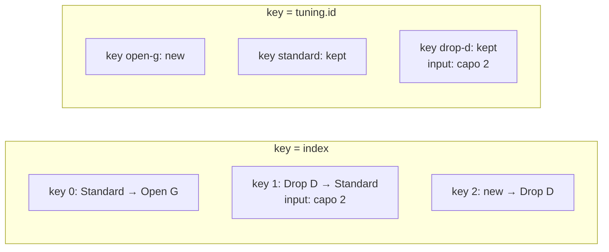

Code: [`src/l02`](https://github.com/spareilleux/learn/tree/3f7a5df/code/react-vite/src/l02), the error snippets [`errors/l02_props.tsx`](https://github.com/spareilleux/learn/blob/3f7a5df/code/react-vite/errors/l02_props.tsx), [`errors/l02_html.tsx`](https://github.com/spareilleux/learn/blob/3f7a5df/code/react-vite/errors/l02_html.tsx) and [`errors/l02_children.tsx`](https://github.com/spareilleux/learn/blob/3f7a5df/code/react-vite/errors/l02_children.tsx), and the exercise solutions in [`src/solutions`](https://github.com/spareilleux/learn/tree/3f7a5df/code/react-vite/src/solutions). Every test prints what it renders, and `check.sh` compares that output with the one pasted here.

## A component is a function

In Blazor, a component is a `.razor` file that the compiler turns into a class: its inputs are properties marked `[Parameter]`, and the markup around them becomes a method that builds a render tree. In WPF, a `UserControl` is a XAML file and a code-behind class, with dependency properties for its inputs. A [React component](https://react.dev/learn/your-first-component) is a function: it takes one object, its **props**, and returns what to display.

```tsx
// src/l02/TuningCard.tsx
import type { ReactNode } from 'react';

// The props of a component are one object, described by a type
export interface TuningCardProps {
  name: string;
  notes: readonly string[];
  capo?: number;
  children?: ReactNode;
}

// A component is a function that takes its props and returns what to render
export function TuningCard({ name, notes, capo = 0, children }: TuningCardProps) {
  return (
    <article className="tuning-card">
      <h2>{name}</h2>
      <p>
        {notes.join(' ')}, capo {capo}
      </p>
      {children}
    </article>
  );
}
```

The same component in Blazor would look like this; it's here for comparison, and the course doesn't compile it.

```razor
@* TuningCard.razor *@
<article class="tuning-card">
    <h2>@Name</h2>
    <p>@string.Join(" ", Notes), capo @Capo</p>
    @ChildContent
</article>

@code {
    [Parameter, EditorRequired] public string Name { get; set; } = "";
    [Parameter, EditorRequired] public IReadOnlyList<string> Notes { get; set; } = [];
    [Parameter] public int Capo { get; set; }
    [Parameter] public RenderFragment? ChildContent { get; set; }
}
```

| | Blazor | React |
|---|---|---|
| Inputs | one property per `[Parameter]` | one props object, typed by an interface |
| Required input | `[EditorRequired]`, a warning | a property without `?`, an error from `tsc` |
| Default value | a property initializer | a default in the destructuring: `capo = 0` |
| Content between the tags | `RenderFragment ChildContent` | `children`, of type `ReactNode` |
| Markup | Razor, with `@` before C# | JSX, with `{ }` around JavaScript |
| Used as | `<TuningCard Name="Drop D" Notes="dropD" />` | `<TuningCard name="Drop D" notes={dropD} />` |

The parameter list uses destructuring, which [JavaScript lesson 3](../../javascript-for-csharp-java/03-functions-and-scope/) covers: `{ name, notes, capo = 0, children }` reads four properties of the props object, with a default for `capo`. `readonly string[]` accepts any array of strings and promises not to change it, as [TypeScript lesson 2](../../typescript-for-csharp-java/02-structural-typing/#readonly) shows. The name starts with an uppercase letter, and that is a rule, as the next sections show.

The test renders the component with [React Testing Library](https://testing-library.com/docs/react-testing-library/intro) in [Vitest](https://vitest.dev/), and prints the HTML it produced:

```tsx
// src/l02/TuningCard.test.tsx
test('renders the props and the children', () => {
  const { container } = render(
    <TuningCard name="Drop D" notes={['D', 'A', 'D', 'G', 'B', 'E']} capo={2}>
      <p>Lower the sixth string by a whole tone.</p>
    </TuningCard>,
  );
  showHtml('<TuningCard>', container);
  expect(container.querySelector('h2')?.textContent).toBe('Drop D');
});
```

```text
✓ renders the props and the children
  <TuningCard>
  <div>
    <article
      class="tuning-card"
    >
      <h2>
        Drop D
      </h2>
      <p>
        D A D G B E
        , capo 
        2
      </p>
      <p>
        Lower the sixth string by a whole tone.
      </p>
    </article>
  </div>
```

`render` mounts the component into a `div` of a simulated DOM, [jsdom](https://github.com/jsdom/jsdom); the outer `div` is that container. `className` became `class`, and the paragraph between the tags took the place of `{children}`. The paragraph shows three text nodes, because `{notes.join(' ')}`, `, capo ` and `{capo}` are three children of the `p`; the browser displays them as one line.

## JSX is function calls

JSX isn't HTML, and it isn't a template language either: it is a syntax for function calls. [`scripts/jsx.mjs`](https://github.com/spareilleux/learn/blob/3f7a5df/code/react-vite/scripts/jsx.mjs) compiles `TuningCard.tsx` with Oxc, as `vite build` does:

```js
import { jsx as _jsx, jsxs as _jsxs } from "react/jsx-runtime";
// A component is a function that takes its props and returns what to render
export function TuningCard({ name, notes, capo = 0, children }) {
	return /* @__PURE__ */ _jsxs("article", {
		className: "tuning-card",
		children: [
			/* @__PURE__ */ _jsx("h2", { children: name }),
			/* @__PURE__ */ _jsxs("p", { children: [
				notes.join(" "),
				", capo ",
				capo
			] }),
			children
		]
	});
}
```

Each element became a call to `jsx` or `jsxs` from `react/jsx-runtime`, with the element's type and an object of its props. The children are one more prop, `children`: a single value, or an array when there are several; `jsxs` is the variant for several children written in the source, a list that React knows is fixed and that needs no keys. The import is added by the compiler, which is why the file doesn't import React: that is the "automatic" runtime, selected by `"jsx": "react-jsx"` in [`tsconfig.app.json`](https://www.typescriptlang.org/tsconfig/#jsx).

In the call, the type is a **string** for `article`, `h2` and `p`, and would be the **function** `TuningCard` for `<TuningCard />`. That is the uppercase rule: the [TypeScript handbook](https://www.typescriptlang.org/docs/handbook/jsx.html) says that a JSX name starting with a lowercase letter is an intrinsic element, an HTML tag, and a name starting with an uppercase letter is a value in scope, a component.

What does the call return? The second test prints it:

```tsx
test('a JSX expression is an object that describes the element', () => {
  const element = <TuningCard name="Standard" notes={['E', 'A', 'D', 'G', 'B', 'E']} />;
  console.log(element.type === TuningCard, element.props, element.key);
});
```

```text
✓ a JSX expression is an object that describes the element
  true { name: 'Standard', notes: [ 'E', 'A', 'D', 'G', 'B', 'E' ] } null
```

A [React element](https://react.dev/reference/react/createElement) is a plain object: a type, props, and a key. Creating it didn't call `TuningCard`; React calls the function later, when it renders the element. A component returns a tree of such objects, a description of the screen, and `react-dom` makes the DOM match that description. The closest thing in Blazor is the `RenderTreeBuilder` code that the Razor compiler writes, with a difference in style: React's description is an ordinary value that you can store in a variable, pass as a prop, or put in an array.

Because JSX is an expression, JavaScript does the rest: `{ }` holds any expression, a condition is `? :` or `&&`, and a loop is `map`, as the lessons below show. There is no `@if` or `@foreach`. The [rules of JSX](https://react.dev/learn/writing-markup-with-jsx) follow from the function calls: a component returns one root, since a function returns one value, and `<>…</>`, a [Fragment](https://react.dev/reference/react/Fragment), groups several elements without adding a DOM node; every tag is closed, `<br />` included.

## What tsc checks in JSX

Props are an object type, so `tsc` checks them like the arguments of a call. [`errors/l02_props.tsx`](https://github.com/spareilleux/learn/blob/3f7a5df/code/react-vite/errors/l02_props.tsx) uses `TuningCard` four ways that are wrong:

```text
errors/l02_props.tsx:7:8 - error TS2741: Property 'name' is missing in type '{ notes: string[]; }' but required in type 'TuningCardProps'.

7       <TuningCard notes={['E', 'A', 'D', 'G', 'B', 'E']} />
         ~~~~~~~~~~

  src/l02/TuningCard.tsx:5:3 - 'name' is declared here.
    5   name: string;
        ~~~~

errors/l02_props.tsx:8:72 - error TS2322: Type 'string' is not assignable to type 'number'.

8       <TuningCard name="Drop D" notes={['D', 'A', 'D', 'G', 'B', 'E']} capo="2" />
                                                                         ~~~~

  src/l02/TuningCard.tsx:7:3 - The expected type comes from property 'capo' which is declared here on type 'IntrinsicAttributes & TuningCardProps'
    7   capo?: number;
        ~~~~

errors/l02_props.tsx:9:33 - error TS2322: Type 'string' is not assignable to type 'readonly string[]'.

9       <TuningCard name="Open G" notes="D G D G B D" />
                                  ~~~~~

  src/l02/TuningCard.tsx:6:3 - The expected type comes from property 'notes' which is declared here on type 'IntrinsicAttributes & TuningCardProps'
    6   notes: readonly string[];
        ~~~~~

errors/l02_props.tsx:10:72 - error TS2322: Type '{ name: string; notes: string[]; strings: number; }' is not assignable to type 'IntrinsicAttributes & TuningCardProps'.
  Property 'strings' does not exist on type 'IntrinsicAttributes & TuningCardProps'.

10       <TuningCard name="DADGAD" notes={['D', 'A', 'D', 'G', 'A', 'D']} strings={6} />
                                                                          ~~~~~~~


Found 4 errors in the same file, starting at: errors/l02_props.tsx:7

exit 1
```

- A quoted attribute is a string: `capo="2"` passes the string `"2"`, and a number needs braces, `capo={2}`. Razor converts `Capo="2"` to an `int` for you; JSX doesn't.
- An unknown prop is an error, like the [excess property check](../../typescript-for-csharp-java/02-structural-typing/#excess-property-checks) of an object literal. `IntrinsicAttributes` adds the props that every component accepts, such as `key`.

HTML elements are typed too, by `@types/react`, and their props follow the DOM's property names more than HTML's attributes. [`errors/l02_html.tsx`](https://github.com/spareilleux/learn/blob/3f7a5df/code/react-vite/errors/l02_html.tsx) is written the way HTML would be:

```text
errors/l02_html.tsx:2:10 - error TS6133: 'tuningName' is declared but its value is never read.

2 function tuningName({ name }: { name: string }) {
           ~~~~~~~~~~

errors/l02_html.tsx:3:14 - error TS2322: Type '{ class: string; children: string; }' is not assignable to type 'DetailedHTMLProps<HTMLAttributes<HTMLHeadingElement>, HTMLHeadingElement>'.
  Property 'class' does not exist on type 'DetailedHTMLProps<HTMLAttributes<HTMLHeadingElement>, HTMLHeadingElement>'. Did you mean 'className'?

3   return <h2 class="tuning-name">{name}</h2>;
               ~~~~~

errors/l02_html.tsx:8:12 - error TS2322: Type '{ for: string; children: Element[]; }' is not assignable to type 'DetailedHTMLProps<LabelHTMLAttributes<HTMLLabelElement>, HTMLLabelElement>'.
  Property 'for' does not exist on type 'DetailedHTMLProps<LabelHTMLAttributes<HTMLLabelElement>, HTMLLabelElement>'. Did you mean 'htmlFor'?

8     <label for="capo">
             ~~~

errors/l02_html.tsx:9:7 - error TS2339: Property 'tuningName' does not exist on type 'JSX.IntrinsicElements'.

9       <tuningName name="Standard" />
        ~~~~~~~~~~~~~~~~~~~~~~~~~~~~~~

errors/l02_html.tsx:10:55 - error TS2322: Type '{ id: string; type: "number"; min: number; max: string; onchange: () => void; }' is not assignable to type 'DetailedHTMLProps<InputHTMLAttributes<HTMLInputElement>, HTMLInputElement>'.
  Property 'onchange' does not exist on type 'DetailedHTMLProps<InputHTMLAttributes<HTMLInputElement>, HTMLInputElement>'. Did you mean 'onChange'?

10       <input id="capo" type="number" min={0} max="12" onchange={() => {}} />
                                                         ~~~~~~~~


Found 5 errors in the same file, starting at: errors/l02_html.tsx:2

exit 1
```

- `class` and `for` are reserved words in JavaScript, so React names them after the DOM properties, `className` and `htmlFor`, and [writes most attributes in camelCase](https://react.dev/learn/writing-markup-with-jsx), `onChange` and `tabIndex` among them. `aria-*` and `data-*` keep their dashes.
- `<tuningName />` starts with a lowercase letter, so `tsc` looks it up among HTML tags, in `JSX.IntrinsicElements`, and doesn't find it. The function of the same name is then unused, hence the first error.
- `min={0}` and `max="12"` are both accepted: the types of `@types/react` allow a number or a string for these attributes, as HTML does.

## Children

`children` is typed [`ReactNode`](https://react.dev/learn/typescript#typing-children): what a component can render. That is an element, a string, a number, a boolean, `null` or `undefined`, which render nothing, or an array of those. A component must return the same set. [`errors/l02_children.tsx`](https://github.com/spareilleux/learn/blob/3f7a5df/code/react-vite/errors/l02_children.tsx) tries other values:

```tsx
// errors/l02_children.tsx
import { dropD, standard } from '../src/l02/tunings.ts';

export function Favorite() {
  return <p>Favorite tuning: {standard}</p>;
}

export function Count({ tunings }: { tunings: readonly (typeof dropD)[] }) {
  return tunings.length > 0 ? tunings.map((tuning) => tuning.name) : undefined;
}

export function Nothing() {
  return;
}

export function Wrong() {
  return { name: 'Standard' };
}
```

```text
errors/l02_children.tsx:5:30 - error TS2322: Type 'Tuning' is not assignable to type 'ReactNode'.

5   return <p>Favorite tuning: {standard}</p>;
                               ~~~~~~~~~~

errors/l02_children.tsx:24:6 - error TS2786: 'Nothing' cannot be used as a JSX component.
  Its type '() => void' is not a valid JSX element type.
    Type '() => void' is not assignable to type '(props: any) => Promise<ReactNode> | ReactNode'.
      Type 'void' is not assignable to type 'Promise<ReactNode> | ReactNode'.

24     <Nothing />
        ~~~~~~~

errors/l02_children.tsx:25:6 - error TS2786: 'Wrong' cannot be used as a JSX component.
  Its type '() => { name: string; }' is not a valid JSX element type.
    Type '() => { name: string; }' is not assignable to type '(props: any) => Promise<ReactNode> | ReactNode'.
      Type '{ name: string; }' is not assignable to type 'Promise<ReactNode> | ReactNode'.

25     <Wrong />
        ~~~~~


Found 3 errors in the same file, starting at: errors/l02_children.tsx:5

exit 1
```

An object isn't a `ReactNode`: React wouldn't know how to display `{ id, name, notes }`. A function that returns nothing, `void`, can't be a component; return `null` to render nothing. `Count` compiles: an array of strings and `undefined` are both `ReactNode`. The `Promise<ReactNode>` in the message is there for [Server Components](https://react.dev/reference/rsc/server-components), which can be `async`, and which lesson 12 places in context.

## Lists and keys

A list is an array of elements, built with `map`:

```tsx
// src/l02/TuningList.tsx
export interface Tuning {
  id: string;
  name: string;
  notes: readonly string[];
}

// One card per tuning: the key tells React which card is which from one render to the next
export function TuningList({ tunings }: { tunings: readonly Tuning[] }) {
  return (
    <section>
      {tunings.map((tuning) => (
        <TuningCard key={tuning.id} name={tuning.name} notes={tuning.notes} />
      ))}
    </section>
  );
}
```

Compiled, the key is not in the props: it is the third argument of `jsx`, and `TuningCard` never receives it.

```js
export function TuningList({ tunings }) {
	return /* @__PURE__ */ _jsx("section", { children: tunings.map((tuning) => /* @__PURE__ */ _jsx(TuningCard, {
		name: tuning.name,
		notes: tuning.notes
	}, tuning.id)) });
}
```

When a component renders again, React compares the new list of elements with the previous one to decide which DOM nodes to keep, move, create or remove. Among siblings, the [key](https://react.dev/learn/rendering-lists#keeping-list-items-in-order-with-key) says which element is which. Blazor has the same mechanism with the [`@key`](https://learn.microsoft.com/aspnet/core/blazor/components/element-component-model-relationships) directive, which is optional there; in React, forgetting it has a warning and a lint rule. [`TuningListNoKey.tsx`](https://github.com/spareilleux/learn/blob/3f7a5df/code/react-vite/src/l02/TuningListNoKey.tsx) is the same list without a key:

```text
✓ without a key, the list renders and React warns
  console.error: Each child in a list should have a unique "key" prop.
  
  Check the render method of `TuningListNoKey`. See https://react.dev/link/warning-keys for more information.
```

The warning appears in development only, when the list renders, and the list renders correctly. oxlint, with the rules of the template's `.oxlintrc.json`, finds it without running anything:

```text
src/l02/TuningListNoKey.tsx:7:16: warning react(jsx-key): Missing "key" prop for element in iterator. help: Add a "key" prop to the element in the iterator (https://react.dev/learn/rendering-lists#keeping-list-items-in-order-with-key).
exit 0
```

That is the only warning on the course's code, and it is intentional. Without a key, React uses the position, and `key={index}` does the same thing without the warning. The position is a fine identity for a list that never changes order; it breaks when an item is inserted, removed or moved. [`TuningNotes.tsx`](https://github.com/spareilleux/learn/blob/3f7a5df/code/react-vite/src/l02/TuningNotes.tsx) shows it with an input whose text lives in the DOM:

```tsx
// src/l02/TuningNotes.tsx
function NoteRow({ tuning }: { tuning: Tuning }) {
  return (
    <li>
      <label>
        {tuning.name} <input aria-label={`Note for ${tuning.name}`} />
      </label>
    </li>
  );
}

export function TuningNotesByIndex({ tunings }: { tunings: readonly Tuning[] }) {
  return (
    <ul>
      {tunings.map((tuning, index) => (
        <NoteRow key={index} tuning={tuning} />
      ))}
    </ul>
  );
}
```

`TuningNotesById` is the same list with `key={tuning.id}`. The test types "capo 2" next to Drop D in each list, adds Open G at the start, and prints each row with the text of its input:

```text
✓ key={index}: the typed text stays at its position when a tuning is added first
  key={index} [ 'Open G: ""', 'Standard: "capo 2"', 'Drop D: ""' ]
✓ key={tuning.id}: the typed text follows its tuning
  key={tuning.id} [ 'Open G: ""', 'Standard: ""', 'Drop D: "capo 2"' ]
```

With the index as key, the element with key 1 was Drop D and is now Standard: React kept the DOM node of key 1, input and typed text included, and changed its label. The note now belongs to the wrong tuning, with no error anywhere. With the id, React sees a new key, `open-g`, creates a row for it, and keeps the two others with their input. The same thing happens to the state of a component, which lesson 3 introduces: state belongs to a position in the tree, and the key is part of that position.



[React's documentation](https://react.dev/learn/rendering-lists#rules-of-keys) gives the rules: a key is unique among its siblings, it doesn't change, and it isn't generated while rendering. `key={Math.random()}` recreates every element at each render, and loses what was typed. A key comes from the data: a database id, or a value that identifies the item, such as a name that is unique in its list.

## In GuitarAlchemist/ga

oxlint 1.83.0 with its `react/no-array-index-key` rule, on [`ga-react-components`](https://github.com/GuitarAlchemist/ga/tree/8cc8c5a17c685c779c46cd5e6d0a3f5d5036cc41/ReactComponents/ga-react-components/src) at commit `8cc8c5a`, reports 85 lists keyed by their index, and 6 in `Apps/ga-client`; `react/jsx-key` finds no list without a key. Many of those I read are lists that never change, where the index is harmless. Two of them change while the component is on screen. [`DemerzelCriticOverlay.tsx`](https://github.com/GuitarAlchemist/ga/blob/8cc8c5a17c685c779c46cd5e6d0a3f5d5036cc41/ReactComponents/ga-react-components/src/components/PrimeRadiant/DemerzelCriticOverlay.tsx#L174-L192) draws the last ten quality scores as bars:

```tsx
{history.slice(-10).map((h, i) => (
  <div
    key={i}
    className="demerzel-critic__trend-bar"
    style={{
      height: `${h.quality * 10}%`,
      background: h.quality >= 7 ? '#33CC66' : h.quality >= 4 ? '#FFB300' : '#FF4444',
    }}
    title={`${h.quality}/10`}
  />
))}
```

Exercise 3 shows what `key={i}` does to that sliding window. The other, a panel whose expanded rows are remembered by index, needs state, and is in [lesson 3](../03-state-and-rendering/#in-guitaralchemistga).

## Key takeaways

- A component is a function from one props object to a description of the screen; its name starts with an uppercase letter.
- JSX compiles to `jsx(type, props, key)` calls that return plain objects; children are the `children` prop.
- `tsc` checks props like function arguments: a missing, unknown or mistyped prop is an error, and a quoted value is a string.
- HTML attributes follow DOM names: `className`, `htmlFor`, `onChange`.
- A component returns a `ReactNode`: an element, text, a number, `null`, or an array of them, never a plain object.
- A list needs keys that come from the data. The index is a key only for a list that never changes order.

## Exercises

1. Write a `ChordDiagram` component that takes a chord name and six frets, from the sixth string to the first, where `null` is a muted string, and renders the name and one list item per string, such as `E: x` and `D: 0`. What key do you give the items, and why is it acceptable here?

<details>
<summary>Solution</summary>

[`src/solutions/l02_ex1/ChordDiagram.tsx`](https://github.com/spareilleux/learn/blob/3f7a5df/code/react-vite/src/solutions/l02_ex1/ChordDiagram.tsx):

```tsx
// Exercise 1: a chord as six strings, from the sixth (low E) to the first; null is a muted string
export interface ChordDiagramProps {
  name: string;
  frets: readonly (number | null)[];
}

const stringNames = ['E', 'A', 'D', 'G', 'B', 'e'];

export function ChordDiagram({ name, frets }: ChordDiagramProps) {
  return (
    <figure>
      <figcaption>{name}</figcaption>
      <ol>
        {frets.map((fret, string) => (
          // The six strings never move, are never filtered, and hold no state: their position is their identity
          <li key={string}>{`${stringNames[string]}: ${fret ?? 'x'}`}</li>
        ))}
      </ol>
    </figure>
  );
}
```

The key is the index, and here that is the identity: the item at position 0 is always the sixth string. The list is never sorted or filtered, and its items hold no state. The template string makes one text node per item; `??` replaces `null` with `x` and keeps `0`, where `||` would turn the open string into a muted one. The test renders D major:

```text
✓ renders D major with two muted strings
  <ChordDiagram>
  <div>
    <figure>
      <figcaption>
        D
      </figcaption>
      <ol>
        <li>
          E: x
        </li>
        <li>
          A: x
        </li>
        <li>
          D: 0
        </li>
        <li>
          G: 2
        </li>
        <li>
          B: 3
        </li>
        <li>
          e: 2
        </li>
      </ol>
    </figure>
  </div>
```

oxlint's `react/no-array-index-key` rule, which the template doesn't enable, still reports this key, as it does for the `key={index}` of this lesson and exercise 3:

```text
src/solutions/l02_ex1/ChordDiagram.tsx:16:15: error react(no-array-index-key): Usage of Array index in keys is not allowed help: Use a unique data-dependent key to avoid unnecessary rerenders
src/solutions/l02_ex3/TrendBars.tsx:11:15: error react(no-array-index-key): Usage of Array index in keys is not allowed help: Use a unique data-dependent key to avoid unnecessary rerenders
src/l02/TuningNotes.tsx:18:18: error react(no-array-index-key): Usage of Array index in keys is not allowed help: Use a unique data-dependent key to avoid unnecessary rerenders
```

A rule can't tell a fixed list from a changing one; the comment in the component says why this one is fine, for the next reader.

</details>

2. Translate this Blazor component to React with TypeScript. It's a sketch for the exercise, not compiled by the course.

```razor
@* ScaleBadges.razor *@
<section class="scales">
    <h2>@Title</h2>
    <ul>
        @foreach (var scale in Scales)
        {
            <li @key="scale.Name" class="badge">@scale.Name (@scale.Notes.Count notes)</li>
        }
    </ul>
    @ChildContent
</section>

@code {
    [Parameter, EditorRequired] public string Title { get; set; } = "";
    [Parameter, EditorRequired] public IReadOnlyList<Scale> Scales { get; set; } = [];
    [Parameter] public RenderFragment? ChildContent { get; set; }
}
```

<details>
<summary>Solution</summary>

[`src/solutions/l02_ex2/ScaleBadges.tsx`](https://github.com/spareilleux/learn/blob/3f7a5df/code/react-vite/src/solutions/l02_ex2/ScaleBadges.tsx):

```tsx
import type { ReactNode } from 'react';

// Exercise 2: ScaleBadges.razor in React. [Parameter] properties become props, ChildContent becomes children,
// @foreach becomes map with a key, and class becomes className
export interface Scale {
  name: string;
  notes: readonly string[];
}

export function ScaleBadges({ title, scales, children }: { title: string; scales: readonly Scale[]; children?: ReactNode }) {
  return (
    <section className="scales">
      <h2>{title}</h2>
      <ul>
        {scales.map((scale) => (
          <li key={scale.name} className="badge">
            {`${scale.name} (${scale.notes.length} notes)`}
          </li>
        ))}
      </ul>
      {children}
    </section>
  );
}
```

```text
✓ renders the scales and the child content
  <ScaleBadges>
  <div>
    <section
      class="scales"
    >
      <h2>
        Pentatonic and blues
      </h2>
      <ul>
        <li
          class="badge"
        >
          Minor pentatonic (5 notes)
        </li>
        <li
          class="badge"
        >
          Blues (6 notes)
        </li>
      </ul>
      <p>
        Both fit over an A minor chord.
      </p>
    </section>
  </div>
```

`@key` becomes `key`, which Blazor makes optional and React expects on every list. The props type is written inline here; an `interface`, as in `TuningCard`, is the same type with a name. `Count` becomes `length`, since a JavaScript array has no `Count`.

</details>

3. [`TrendBars.tsx`](https://github.com/spareilleux/learn/blob/3f7a5df/code/react-vite/src/solutions/l02_ex3/TrendBars.tsx) reduces GA's quality trend to its last three scores, once with `key={i}` and once with `key={score.at}`, the time of each score. Render three scores, add a fourth, and find out which DOM element shows each score before and after. What does it change for GA's bars, whose CSS has `transition: height 0.3s ease`?

<details>
<summary>Solution</summary>

The test keeps the three `span` elements of the first render, adds a score at 10:15, and prints the score that each of them now shows:

```tsx
function slide(Bars: ComponentType<{ history: readonly Score[] }>) {
  const { container, rerender } = render(<Bars history={history} />);
  const titles = () => [...container.querySelectorAll('span')].map((span) => span.title);
  const elements = [...container.querySelectorAll('span')];
  console.log('before:', titles());
  rerender(<Bars history={[...history, { at: '10:15', value: 80 }]} />);
  console.log('after: ', titles());
  // Where did each element of the first render go?
  console.log('elements of the first render now show:', elements.map((span) => (span.isConnected ? span.title : 'removed')));
}
```

```text
✓ key={i}: every element gets a new score
  before: [ '10:00', '10:05', '10:10' ]
  after:  [ '10:05', '10:10', '10:15' ]
  elements of the first render now show: [ '10:05', '10:10', '10:15' ]
✓ key={score.at}: the element follows its score
  before: [ '10:00', '10:05', '10:10' ]
  after:  [ '10:05', '10:10', '10:15' ]
  elements of the first render now show: [ 'removed', '10:05', '10:10' ]
```

The page looks the same in both cases. With `key={i}`, React keeps the three elements and changes the title and the height of each one: every bar takes the score of its right neighbor. With `key={score.at}`, React removes the element of 10:00, keeps the two others with their scores, and adds one for 10:15.

In GA, the window holds ten scores. Once it is full, each new result changes the height of all ten bars, and the CSS transition animates all ten, so the chart seems to jump, instead of one bar appearing. The bars hold no state, so nothing is lost; the cost is the animation and ten style updates instead of one. GA's `VisualCriticResult` has no time or id field, so the fix starts in the data: record when each result arrived, and use it as the key. I haven't run GA's overlay to watch the animation (*to verify*).

</details>

## Sources

- React: [Your first component](https://react.dev/learn/your-first-component), [Writing markup with JSX](https://react.dev/learn/writing-markup-with-jsx), [JavaScript in JSX with curly braces](https://react.dev/learn/javascript-in-jsx-with-curly-braces), [Passing props to a component](https://react.dev/learn/passing-props-to-a-component), [Rendering lists](https://react.dev/learn/rendering-lists), [Using TypeScript](https://react.dev/learn/typescript), [`createElement`](https://react.dev/reference/react/createElement), [Fragment](https://react.dev/reference/react/Fragment)
- TypeScript handbook: [JSX](https://www.typescriptlang.org/docs/handbook/jsx.html), and the [`jsx` option](https://www.typescriptlang.org/tsconfig/#jsx)
- [React Testing Library](https://testing-library.com/docs/react-testing-library/intro), [oxlint's React rules](https://oxc.rs/docs/guide/usage/linter/rules.html)
- Microsoft: [ASP.NET Core Razor components](https://learn.microsoft.com/aspnet/core/blazor/components/), [Retain element, component and model relationships with `@key`](https://learn.microsoft.com/aspnet/core/blazor/components/element-component-model-relationships)
