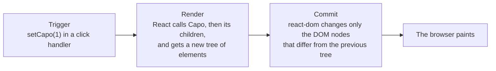

Code: [`src/l03`](https://github.com/spareilleux/learn/tree/3f7a5df/code/react-vite/src/l03), the error snippet [`errors/l03_state.tsx`](https://github.com/spareilleux/learn/blob/3f7a5df/code/react-vite/errors/l03_state.tsx), and the solutions in [`src/solutions`](https://github.com/spareilleux/learn/tree/3f7a5df/code/react-vite/src/solutions).

## Where does the value live?

A Blazor component is an object: a click handler changes a field, and after the handler returns, `ComponentBase` renders the component again, reading the field. A WPF view model raises `PropertyChanged`, and the bindings update the controls. In both cases the value lives in an instance that exists as long as the component.

A React component is a function that React calls again at each render, and a local variable disappears when the function returns. A value that must survive from one render to the next is kept by React, and [`useState`](https://react.dev/reference/react/useState) asks for it:

```tsx
// src/l03/Capo.tsx
import { useState } from 'react';
import { transpose } from './chords.ts';

const chords = ['G', 'C', 'D', 'Em'];

export function Capo() {
  // State: a value that React keeps between renders, and a function that changes it and schedules a new render
  const [capo, setCapo] = useState(0);

  // Everything else is computed from the state during the render
  const sounding = chords.map((chord) => transpose(chord, capo));

  return (
    <section>
      <p>Capo on fret {capo}</p>
      <button type="button" onClick={() => setCapo(capo - 1)} disabled={capo === 0}>
        Lower
      </button>
      <button type="button" onClick={() => setCapo(capo + 1)} disabled={capo === 11}>
        Raise
      </button>
      <p>Shapes {chords.join(' ')} sound {sounding.join(' ')}</p>
    </section>
  );
}
```

`useState(0)` returns a pair: the current value, and a function that replaces it. At the first render, the value is the initial `0`; at the following ones, it is whatever the last `setCapo` stored. The chords that sound are not state: they are computed from `capo` at each render, with the pure function [`transpose`](https://github.com/spareilleux/learn/blob/3f7a5df/code/react-vite/src/l03/chords.ts), which lives in its own file so that Fast Refresh can replace `Capo.tsx` ([lesson 1](../01-vite-project/#hot-module-replacement-and-fast-refresh)). The test clicks Raise twice:

```text
✓ transpose
✓ each click changes the state, and React renders the component again
  [ 'Capo on fret 0', 'Shapes G C D Em sound G C D Em' ]
  [ 'Capo on fret 2', 'Shapes G C D Em sound A D E F#m' ]
```

Functions whose names start with `use` are [Hooks](https://react.dev/learn/state-a-components-memory#meet-your-first-hook). React finds a component's state by the order of its Hook calls, so Hooks are called at the top level of the component, never in a condition or a loop; the template's lint rule `react/rules-of-hooks` enforces it. State is also local to each place where the component is rendered: two `<Capo />` elements have two capos, like two instances of a Blazor component.

## Render, then commit

What happens after `setCapo(1)`, as [react.dev describes it](https://react.dev/learn/render-and-commit):



Rendering means calling component functions; it doesn't touch the DOM. [`RenderLog.tsx`](https://github.com/spareilleux/learn/blob/3f7a5df/code/react-vite/src/l03/RenderLog.tsx) logs each call:

```tsx
// src/l03/RenderLog.tsx
// Pure: the same props give the same output, and nothing outside the component changes
export function ChordName({ chord }: { chord: string }) {
  console.log(`ChordName renders ${chord}`);
  return <p>{chord}</p>;
}

export function ChordPicker() {
  const [chord, setChord] = useState('G');
  console.log(`ChordPicker renders with ${chord}`);
  return (
    <section>
      <button type="button" onClick={() => setChord(chord === 'G' ? 'C' : 'G')}>
        Change chord
      </button>
      <ChordName chord={chord} />
      <ChordName chord="D" />
    </section>
  );
}
```

```text
✓ a state change renders the component and its children again
  ChordPicker renders with G
  ChordName renders G
  ChordName renders D
  --- click
  ChordPicker renders with C
  ChordName renders C
  ChordName renders D
```

After the click, React renders `ChordPicker` again, and **all** its children, including `<ChordName chord="D" />`, whose props didn't change. A component's render includes its subtree by default. That is usually cheap, since rendering builds objects and the commit then changes one text node, the `G` that became `C`; lesson 10 shows how to skip renders when they aren't cheap. Blazor, by comparison, skips a child whose parameters are all of primitive types and unchanged.

## State is a snapshot

In a given render, `capo` is a constant. [`Snapshot.tsx`](https://github.com/spareilleux/learn/blob/3f7a5df/code/react-vite/src/l03/Snapshot.tsx) calls `setCapo` three times in one handler:

```tsx
// src/l03/Snapshot.tsx
function raiseThreeTimes() {
  setCapo(capo + 1);
  setCapo(capo + 1);
  setCapo(capo + 1);
  console.log('in the handler, capo is still', capo);
}

function raiseThreeTimesWithUpdaters() {
  setCapo((c) => c + 1);
  setCapo((c) => c + 1);
  setCapo((c) => c + 1);
}
```

```text
✓ state is a snapshot: setCapo(capo + 1) three times adds 1
  in the handler, capo is still 0
  Capo on fret 1
  Capo on fret 4
```

The handler is a closure over the render where it was created, the one where `capo` is 0, as [JavaScript lesson 3](../../javascript-for-csharp-java/03-functions-and-scope/#closures) explains. `setCapo` doesn't change that variable: it asks React for a new render, where `capo` will be the new value. Three calls with `capo + 1` ask three times for `0 + 1`. [React batches](https://react.dev/reference/react/useState#setstate-caveats) the three calls and renders once, after the handler.

An **updater function**, `(c) => c + 1`, receives the pending value instead of the snapshot, so three updaters add three. Use one when the next state depends on the previous one, which is why the template's counter in [`App.tsx`](https://github.com/spareilleux/learn/blob/3f7a5df/code/react-vite/src/App.tsx#L10) is written `setCount((count) => count + 1)`.

## What tsc checks

`useState` is generic: its type parameter is inferred from the initial value, or given explicitly. [`errors/l03_state.tsx`](https://github.com/spareilleux/learn/blob/3f7a5df/code/react-vite/errors/l03_state.tsx):

```tsx
// errors/l03_state.tsx
import { useState } from 'react';

type Status = 'idle' | 'tuning' | 'in tune';

export function Tuner() {
  const [capo, setCapo] = useState(0);
  const [muted, setMuted] = useState([]);
  const [status, setStatus] = useState<Status>('idle');
  const [note] = useState<string>();

  function reset() {
    setCapo('0');
    setMuted([...muted, 6]);
    setStatus('out of tune');
    capo = 0;
  }

  return (
    <button type="button" onClick={reset}>
      {status}, capo {capo}, {note.toUpperCase()}
    </button>
  );
}
```

```text
errors/l03_state.tsx:13:13 - error TS2345: Argument of type 'string' is not assignable to parameter of type 'SetStateAction<number>'.

13     setCapo('0');
               ~~~

errors/l03_state.tsx:14:15 - error TS2322: Type 'number' is not assignable to type 'never'.

14     setMuted([...muted, 6]);
                 ~~~~~~~~

errors/l03_state.tsx:14:25 - error TS2322: Type 'number' is not assignable to type 'never'.

14     setMuted([...muted, 6]);
                           ~

errors/l03_state.tsx:15:15 - error TS2345: Argument of type '"out of tune"' is not assignable to parameter of type 'SetStateAction<Status>'.

15     setStatus('out of tune');
                 ~~~~~~~~~~~~~

errors/l03_state.tsx:16:5 - error TS2588: Cannot assign to 'capo' because it is a constant.

16     capo = 0;
       ~~~~

errors/l03_state.tsx:21:31 - error TS18048: 'note' is possibly 'undefined'.

21       {status}, capo {capo}, {note.toUpperCase()}
                                 ~~~~


Found 6 errors in the same file, starting at: errors/l03_state.tsx:13

exit 1
```

- `SetStateAction<number>` is `number | ((prev: number) => number)`: a value or an updater.
- `useState([])` infers `never[]`, an array that can hold nothing, so no element can be added. Give the type: `useState<number[]>([])`.
- A union of string literals makes a small state machine, as in [TypeScript lesson 3](../../typescript-for-csharp-java/03-unions-and-narrowing/#union-types); a typo in a status is an error.
- `const` makes the snapshot visible: assigning `capo` is a compile error, and would change nothing on screen anyway.
- `useState<string>()` without an initial value has the type `string | undefined`.

## Arrays and objects: replace, don't change

React compares the new state with the old one using [`Object.is`](https://developer.mozilla.org/docs/Web/JavaScript/Reference/Global_Objects/Object/is), which for an object compares references, like `ReferenceEquals` in C#. [The documentation](https://react.dev/reference/react/useState#ive-updated-the-state-but-the-screen-doesnt-update) says that if the value is the same, React skips the render. [`Strings.tsx`](https://github.com/spareilleux/learn/blob/3f7a5df/code/react-vite/src/l03/Strings.tsx) mutes a string two ways:

```tsx
// src/l03/Strings.tsx
export function MutatedStrings() {
  const [muted, setMuted] = useState<number[]>([]);
  return (
    <section>
      <button
        type="button"
        onClick={() => {
          muted.push(6); // changes the array that React already has
          setMuted(muted); // the same array: Object.is says nothing changed, and React skips the render
        }}
      >
        Mute string 6
      </button>
      <p>Muted strings: {muted.join(', ') || 'none'}</p>
    </section>
  );
}

export function ReplacedStrings() {
  const [muted, setMuted] = useState<readonly number[]>([]);
  return (
    <section>
      <button type="button" onClick={() => setMuted([...muted, 6])}>
        Mute string 6
      </button>
      <p>Muted strings: {muted.join(', ') || 'none'}</p>
    </section>
  );
}
```

```text
✓ push, then set the same array: nothing on screen
  Muted strings: none
✓ a new array: React renders again
  Muted strings: 6
```

The first button changed the array, and the screen still says "none". The 6 is in the array, though, and will appear at the next render that something else causes: the screen and the state have drifted apart. In WPF, an `ObservableCollection` notifies its bindings when it changes; a JavaScript array notifies no one, and React only learns about a change through the set function, with a new value.

The second button builds a new array with the spread syntax, `[...muted, 6]`. Declaring the state `readonly number[]` makes `tsc` refuse `muted.push(6)`, as [TypeScript lesson 2](../../typescript-for-csharp-java/02-structural-typing/#readonly) shows. The array methods that return a new array are the ones to use: `filter`, `map`, `concat`, `toSorted`, `toReversed`, and `with` for one element. An object is replaced the same way, `{ ...tuning, capo: 2 }`, which is C#'s `tuning with { Capo = 2 }` for a record. [Updating arrays in state](https://react.dev/learn/updating-arrays-in-state) lists the methods to avoid and their replacements.

## Keep state minimal

[React's advice](https://react.dev/learn/choosing-the-state-structure#principles-for-structuring-state) for state is the one a database designer gives for tables: no redundant data. If a value can be computed from props or other state during the render, it isn't state. `Capo` stores the fret and computes the chords; storing the chords as well would add a second value that must be kept in sync by hand, and a moment where they disagree. The same reasoning applies to a filtered list, a total, or a "can submit" flag: compute them in the component. If the computation is expensive, lesson 10 shows how to cache it.

## Rendering something or nothing

A component can return `null`, and JSX offers `&&` and `? :` for parts of the output. [`Conditional.tsx`](https://github.com/spareilleux/learn/blob/3f7a5df/code/react-vite/src/l03/Conditional.tsx) uses the three:

```tsx
// src/l03/Conditional.tsx
// Three ways to render something or nothing
export function VoicingCard({ voicing }: { voicing: Voicing }) {
  if (voicing.frets.length !== 6) return null; // nothing at all
  const muted = voicing.frets.filter((fret) => fret === null).length;
  return (
    <article>
      <h2>{voicing.chord}</h2>
      {voicing.capo && <p>Capo on fret {voicing.capo}</p>}
      {muted > 0 ? <p>{muted} muted strings</p> : <p>All six strings</p>}
    </article>
  );
}
```

```text
✓ capo 2, and capo 0 with &&
  capo 2
  <div>
    <article>
      <h2>
        D
      </h2>
      <p>
        Capo on fret 
        2
      </p>
      <p>
        2
         muted strings
      </p>
    </article>
  </div>
  capo 0
  <div>
    <article>
      <h2>
        G
      </h2>
      0
      <p>
        All six strings
      </p>
    </article>
  </div>
  three frets
  <div />
```

With a capo of 0, the card shows a lone `0`. `voicing.capo && <p>…</p>` evaluates to `0` when `capo` is 0, since `&&` returns its left side when that side is falsy, as [JavaScript lesson 2](../../javascript-for-csharp-java/02-values-and-types/#conversions----parsing-and-truthiness) explains, and `0` is a number, which React renders. `false`, `null` and `undefined` render nothing. [React's documentation](https://react.dev/learn/conditional-rendering#logical-and-operator-) warns about it. `tsc` doesn't: a number is a valid `ReactNode`. Write `voicing.capo > 0 && …`, or a ternary. `return null` removed the whole card, and the container is empty.

## Rendering must be pure

React calls a component when it decides to, possibly several times, and may throw a render away. The component must behave like a pure function of its props and state: [same inputs, same output, and no change to anything that existed before the call](https://react.dev/learn/keeping-components-pure). Changes belong in event handlers, or in effects, which lesson 5 covers. `ChordHistory` breaks that rule on purpose, by adding to an array it receives:

```tsx
// Impure on purpose: the component changes an array that it received, while it renders
export function ChordHistory({ chord, history }: { chord: string; history: string[] }) {
  history.push(chord);
  return <p>Played so far: {history.join(' ')}</p>;
}
```

The template's `main.tsx` wraps the application in [`StrictMode`](https://react.dev/reference/react/StrictMode), which, in development only, calls each component twice to reveal this kind of bug. The test renders `ChordHistory` without and with it:

```text
✓ without StrictMode, the impure component renders once
  Played so far: G [ 'G' ]
✓ in StrictMode, React renders it twice in development, and the output shows the impurity
  Played so far: G G [ 'G', 'G' ]
```

Without StrictMode the bug is invisible, until React renders the component again for any reason. With StrictMode it shows on the first render. A pure component gives the same result once or twice, so the double call costs nothing but time in development; production builds don't do it.

## In GuitarAlchemist/ga

`ListDetailLayout`, in GA's [`DynamicPanel.tsx`](https://github.com/GuitarAlchemist/ga/blob/8cc8c5a17c685c779c46cd5e6d0a3f5d5036cc41/ReactComponents/ga-react-components/src/components/PrimeRadiant/DynamicPanel.tsx#L76-L120), shows a list whose rows expand on click. It remembers the expanded rows by their index:

```tsx
const ListDetailLayout: React.FC<{ data: unknown[]; showFields: string[] }> = ({ data, showFields }) => {
  const [expanded, setExpanded] = useState<Set<number>>(new Set());
  const toggle = useCallback((idx: number) => {
    setExpanded(prev => {
      const next = new Set(prev);
      if (next.has(idx)) next.delete(idx); else next.add(idx);
      return next;
    });
  }, []);
```

The update itself is correct: an updater, and a new `Set` rather than a changed one. The problem is what the state refers to. The panel above it [filters the data](https://github.com/GuitarAlchemist/ga/blob/8cc8c5a17c685c779c46cd5e6d0a3f5d5036cc41/ReactComponents/ga-react-components/src/components/PrimeRadiant/DynamicPanel.tsx#L289-L296) with chips or a search box, and [polls its source](https://github.com/GuitarAlchemist/ga/blob/8cc8c5a17c685c779c46cd5e6d0a3f5d5036cc41/ReactComponents/ga-react-components/src/components/PrimeRadiant/DynamicPanel.tsx#L256-L287) every 60 seconds by default, so the row at index 1 can be another item a moment later. [`ExpandableList.tsx`](https://github.com/spareilleux/learn/blob/3f7a5df/code/react-vite/src/l03/ExpandableList.tsx) reduces it to the essentials, and adds a version that remembers ids:

```text
✓ by index: after filtering, another row is expanded
  expanded policy-2: [ 'policy-1', 'policy-2: warning', 'policy-3' ]
  filtered out policy-1: [ 'policy-2', 'policy-3: error' ]
✓ by id: the expanded row stays expanded
  expanded policy-2: [ 'policy-1', 'policy-2: warning', 'policy-3' ]
  filtered out policy-1: [ 'policy-2: warning', 'policy-3' ]
```

After filtering out policy-1, the reduced version by index has closed policy-2, which the user opened, and opened policy-3, which they didn't. Changing `key={idx}` wouldn't fix it: the state is held by the list, not by the rows, and it is the `Set<number>` that points to positions. The fix is to remember an identity. GA's panel receives `unknown[]` and knows its fields only by name, so the identity would have to be a field that the panel definition names, such as the title field (*to verify* against GA's panel definitions, which I haven't read in full).

## Key takeaways

- `useState` keeps a value between renders; its set function replaces the value and schedules a render.
- A render calls the component and its children; the commit then changes only the DOM nodes that differ.
- In a render, state is a constant snapshot; use an updater, `(c) => c + 1`, when the next value depends on the previous one.
- React compares state with `Object.is`: replace arrays and objects with new ones, and declare them `readonly`.
- Compute what can be computed during the render instead of storing it.
- `&&` with a number can render `0`; a component can return `null`.
- Rendering must be pure. StrictMode renders twice in development to reveal impure components.
- State that refers to list items should hold their identity, not their position.

## Exercises

1. Write a `Progression` component that receives chords, such as Am F C G, and shows "Bar 1 of 4: Am, then F", with Previous and Next buttons that wrap around. What is the state, and what is computed?

<details>
<summary>Solution</summary>

[`src/solutions/l03_ex1/Progression.tsx`](https://github.com/spareilleux/learn/blob/3f7a5df/code/react-vite/src/solutions/l03_ex1/Progression.tsx):

```tsx
// Exercise 1: one piece of state, the position; the current and the next chord are computed from it
export function Progression({ chords }: { chords: readonly string[] }) {
  const [position, setPosition] = useState(0);
  const current = chords[position];
  const next = chords[(position + 1) % chords.length];

  return (
    <section>
      <p>
        Bar {position + 1} of {chords.length}: {current}, then {next}
      </p>
      <button type="button" onClick={() => setPosition((p) => (p + chords.length - 1) % chords.length)}>
        Previous
      </button>
      <button type="button" onClick={() => setPosition((p) => (p + 1) % chords.length)}>
        Next
      </button>
    </section>
  );
}
```

The test clicks Previous once, then Next twice:

```text
✓ next and previous wrap around
  Bar 1 of 4: Am, then F
  Bar 4 of 4: G, then Am
  Bar 2 of 4: F, then C
```

The only state is the position. The current chord, the next one and the bar number are computed. Previous adds `chords.length - 1` before the modulo, because in JavaScript, as in C#, `-1 % 4` is `-1`.

</details>

2. Write a `MuteStrings` component: six toggle buttons, String 6 to String 1, and a paragraph listing the muted strings from the lowest string up, such as "Muted strings: 6, 5". Update the state without changing the existing array, and let assistive technologies know which buttons are pressed.

<details>
<summary>Solution</summary>

[`src/solutions/l03_ex2/MuteStrings.tsx`](https://github.com/spareilleux/learn/blob/3f7a5df/code/react-vite/src/solutions/l03_ex2/MuteStrings.tsx):

```tsx
// Exercise 2: every update builds a new array, so React sees a new value and renders again
export function MuteStrings() {
  const [muted, setMuted] = useState<readonly number[]>([]);

  function toggle(string: number) {
    setMuted((current) =>
      current.includes(string) ? current.filter((s) => s !== string) : [...current, string].sort((a, b) => b - a),
    );
  }

  return (
    <section>
      {[6, 5, 4, 3, 2, 1].map((string) => (
        <button key={string} type="button" aria-pressed={muted.includes(string)} onClick={() => toggle(string)}>
          String {string}
        </button>
      ))}
      <p>Muted strings: {muted.join(', ') || 'none'}</p>
    </section>
  );
}
```

```text
✓ toggle strings 5, 6, then 5 again
  after String 5: Muted strings: 5
  after String 6: Muted strings: 6, 5
  after String 5: Muted strings: 6
```

`filter` returns a new array, and so does the spread; `sort` changes an array in place, but here it sorts the new one, which nobody else holds. `[...current, string].toSorted((a, b) => b - a)` would say the same thing without the question. Because the state is `readonly number[]`, `current.sort(…)` or `current.push(…)` would not compile. [`aria-pressed`](https://developer.mozilla.org/docs/Web/Accessibility/ARIA/Reference/Attributes/aria-pressed) makes each button a toggle button for screen readers, and the test checks it.

</details>

3. GA's [`ScaleSelector.tsx`](https://github.com/GuitarAlchemist/ga/blob/8cc8c5a17c685c779c46cd5e6d0a3f5d5036cc41/ReactComponents/ga-react-components/src/components/ScaleSelector.tsx#L10-L33) stores the selected notes and the scale number computed from them in two pieces of state:

```tsx
const [selectedNotes, setSelectedNotes] = useState<string[]>([]);
const [scale, setScale] = useState(0);

const handleNotesChange = (notes: string[]) => {
    setSelectedNotes(notes);
    setScale(calculateScale(notes));
};
```

Write a `ScaleNotes` component with twelve note buttons and a Clear button, which shows the notes and the scale number, a bit per note from C = 1 to B = 2048, with one piece of state.

<details>
<summary>Solution</summary>

[`src/solutions/l03_ex3/ScaleNotes.tsx`](https://github.com/spareilleux/learn/blob/3f7a5df/code/react-vite/src/solutions/l03_ex3/ScaleNotes.tsx):

```tsx
const allNotes = ['C', 'C#', 'D', 'D#', 'E', 'F', 'F#', 'G', 'G#', 'A', 'A#', 'B'];

// Exercise 3: GA's ScaleSelector keeps the notes and the scale number in two pieces of state.
// Here only the notes are state; the scale number is computed from them on every render, so it can't disagree.
export function ScaleNotes() {
  const [notes, setNotes] = useState<readonly string[]>([]);
  const scale = notes.reduce((bits, note) => bits | (1 << allNotes.indexOf(note)), 0);

  function toggle(note: string) {
    setNotes((current) => (current.includes(note) ? current.filter((n) => n !== note) : [...current, note]));
  }

  return (
    <section>
      {allNotes.map((note) => (
        <button key={note} type="button" aria-pressed={notes.includes(note)} onClick={() => toggle(note)}>
          {note}
        </button>
      ))}
      <button type="button" onClick={() => setNotes([])}>
        Clear
      </button>
      <p>
        Notes {notes.join(' ') || 'none'}, scale {scale}
      </p>
    </section>
  );
}
```

```text
✓ C major pentatonic, then clear
  Notes C D E G A, scale 661
  Notes none, scale 0
```

661 is 1 + 4 + 16 + 128 + 512, the bits of C, D, E, G and A. With the scale computed during the render, Clear can't forget to reset it, and no code path can set one without the other. In GA, every path goes through `handleNotesChange`, which sets both, so the two values agree today; the risk is the next code that calls `setSelectedNotes` alone. `ScaleSelector` has a second problem, an effect that notifies its parent, which lesson 4 reproduces.

</details>

## Sources

- React: [State: a component's memory](https://react.dev/learn/state-a-components-memory), [Render and commit](https://react.dev/learn/render-and-commit), [State as a snapshot](https://react.dev/learn/state-as-a-snapshot), [Queueing a series of state updates](https://react.dev/learn/queueing-a-series-of-state-updates), [Updating objects in state](https://react.dev/learn/updating-objects-in-state), [Updating arrays in state](https://react.dev/learn/updating-arrays-in-state), [Choosing the state structure](https://react.dev/learn/choosing-the-state-structure), [Conditional rendering](https://react.dev/learn/conditional-rendering), [Keeping components pure](https://react.dev/learn/keeping-components-pure), [`useState`](https://react.dev/reference/react/useState), [`StrictMode`](https://react.dev/reference/react/StrictMode)
- MDN: [`Object.is`](https://developer.mozilla.org/docs/Web/JavaScript/Reference/Global_Objects/Object/is), [`aria-pressed`](https://developer.mozilla.org/docs/Web/Accessibility/ARIA/Reference/Attributes/aria-pressed)
- Microsoft: [ASP.NET Core Razor component rendering](https://learn.microsoft.com/aspnet/core/blazor/components/rendering)
