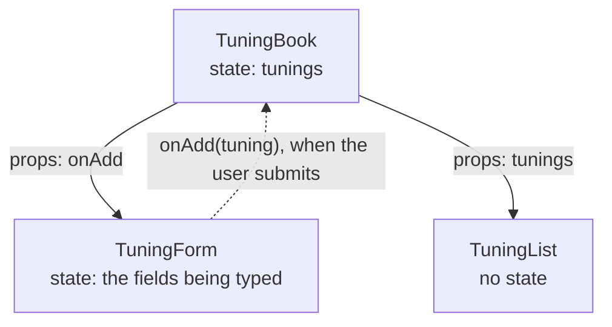
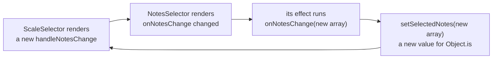

Code: [`src/l04`](https://github.com/spareilleux/learn/tree/3f7a5df/code/react-vite/src/l04), [`src/TuningBook.tsx`](https://github.com/spareilleux/learn/blob/3f7a5df/code/react-vite/src/TuningBook.tsx), the error snippet [`errors/l04_events.tsx`](https://github.com/spareilleux/learn/blob/3f7a5df/code/react-vite/errors/l04_events.tsx), and the solutions in [`src/solutions`](https://github.com/spareilleux/learn/tree/3f7a5df/code/react-vite/src/solutions).

## Handlers are props

In Blazor, `@onclick="Raise"` attaches a method, and a child component exposes an `EventCallback<T>` parameter that its parent fills. In React, both are the same thing: a prop whose value is a function. On an HTML element, React knows the names, `onClick`, `onChange`, `onSubmit`, `onKeyDown`; on a component, the name is yours, and the convention is `on` followed by what happened.

```tsx
// src/l04/Fretboard.tsx
import type { MouseEvent } from 'react';

// A child reports what happened through a function prop; the parent decides what to do with it
interface FretButtonProps {
  string: number;
  fret: number;
  onSelect: (string: number, fret: number) => void;
}

export function FretButton({ string, fret, onSelect }: FretButtonProps) {
  function handleClick(event: MouseEvent<HTMLButtonElement>) {
    event.stopPropagation(); // the row's handler doesn't see this click
    onSelect(string, fret);
  }
  return (
    <button type="button" onClick={handleClick}>
      {fret}
    </button>
  );
}

export function StringRow({ string, onSelect }: { string: number; onSelect: FretButtonProps['onSelect'] }) {
  return (
    // A click between the buttons reaches the row; a click on a button stops there
    <div role="group" aria-label={`String ${string}`} onClick={() => console.log(`row ${string} clicked`)}>
      {[0, 1, 2, 3].map((fret) => (
        <FretButton key={fret} string={string} fret={fret} onSelect={onSelect} />
      ))}
    </div>
  );
}
```

Pass the function, `onClick={handleClick}`, not its result: `onClick={handleClick()}` would call it during the render, as [Responding to events](https://react.dev/learn/responding-to-events#adding-event-handlers) warns. An arrow function, `onClick={() => setCapo(capo + 1)}`, creates a handler that calls something with arguments.

`FretButton` doesn't know what selecting a fret means: it reports the string and the fret, and the parent decides. `FretButtonProps['onSelect']` reuses the type of that prop, an [indexed access type](../../typescript-for-csharp-java/04-generics/#keyof-indexed-access-and-mapped-types). The test uses a [mock function](https://vitest.dev/api/mock) from Vitest as `onSelect`, clicks fret 3, then clicks the row itself:

```tsx
// src/l04/Fretboard.test.tsx
test('the button calls onSelect, and the click stops at the button', async () => {
  const onSelect = vi.fn((string: number, fret: number) => console.log(`selected string ${string}, fret ${fret}`));
  render(<StringRow string={6} onSelect={onSelect} />);
  const row = screen.getByRole('group', { name: 'String 6' });
  await userEvent.click(within(row).getByRole('button', { name: '3' }));
  await userEvent.click(row);
  expect(onSelect).toHaveBeenCalledExactlyOnceWith(6, 3);
});
```

```text
✓ the button calls onSelect, and the click stops at the button
  selected string 6, fret 3
  row 6 clicked
```

The first click reached the button and stopped there; the second, on the row, reached only the row. Events [propagate](https://react.dev/learn/responding-to-events#event-propagation) from the element where they happen up to its ancestors, as in the DOM and as WPF's bubbling routed events do, and `stopPropagation` ends the trip. [`user-event`](https://testing-library.com/docs/user-event/intro) simulates a user's actions, a pointer press and release for a click, rather than dispatching one event.

## Event types

A handler receives a React event, a [`SyntheticEvent`](https://react.dev/reference/react-dom/components/common#react-event-object) that wraps the browser's event, available as `nativeEvent`, and follows the standard `Event` interface. `@types/react` gives each kind its type, with the element as a type parameter:

| Event | Type in `@types/react` 19.3 | Blazor |
|---|---|---|
| `onClick` | `MouseEvent<HTMLButtonElement>` | `MouseEventArgs` |
| `onChange` on an input, a select or a textarea | `ChangeEvent<HTMLInputElement>` | `ChangeEventArgs` |
| `onSubmit` | `SubmitEvent<HTMLFormElement>` | `EditForm`'s `OnValidSubmit` |
| `onKeyDown` | `KeyboardEvent<HTMLDivElement>` | `KeyboardEventArgs` |

Two properties hold an element. `currentTarget` is the element whose handler is running, and its type is the type parameter. `target` is the element where the event started, which can be any descendant, so its type is only `EventTarget`. Read `currentTarget`. In `@types/react` 19.3, `FormEvent` and `FormEventHandler`, which many projects use for `onSubmit` and `onChange`, are marked `@deprecated`: their comment says that no such event exists, and suggests `ChangeEvent`, `InputEvent` or `SubmitEvent`.

[`errors/l04_events.tsx`](https://github.com/spareilleux/learn/blob/3f7a5df/code/react-vite/errors/l04_events.tsx) makes the usual mistakes:

```tsx
// errors/l04_events.tsx
import { useState, type ChangeEvent } from 'react';

export function CapoPicker() {
  const [capo, setCapo] = useState(0);

  function handleInput(event: ChangeEvent<HTMLInputElement>) {
    setCapo(event.currentTarget.valueAsNumber);
  }

  return (
    <form onSubmit={() => setCapo(0)}>
      <input type="number" value={capo} onChange={setCapo} />
      <select value={capo} onChange={handleInput}>
        <option value={0}>No capo</option>
        <option value={2}>Fret 2</option>
      </select>
      <button type="button" onClick={(event) => setCapo(event.currentTarget.value)}>
        Reset
      </button>
      <button type="button" onClick={(event) => console.log(event.target.value)}>
        Log
      </button>
    </form>
  );
}
```

```text
errors/l04_events.tsx:13:41 - error TS2322: Type 'Dispatch<SetStateAction<number>>' is not assignable to type 'ChangeEventHandler<HTMLInputElement, HTMLInputElement>'.
  Types of parameters 'value' and 'event' are incompatible.
    Type 'ChangeEvent<HTMLInputElement, HTMLInputElement>' is not assignable to type 'SetStateAction<number>'.

13       <input type="number" value={capo} onChange={setCapo} />
                                           ~~~~~~~~

  node_modules/@types/react/index.d.ts:3411:9 - The expected type comes from property 'onChange' which is declared here on type 'DetailedHTMLProps<InputHTMLAttributes<HTMLInputElement>, HTMLInputElement>'
    3411         onChange?: ChangeEventHandler<T, HTMLInputElement> | undefined;
                 ~~~~~~~~

errors/l04_events.tsx:14:28 - error TS2322: Type '(event: ChangeEvent<HTMLInputElement, Element>) => void' is not assignable to type 'ChangeEventHandler<HTMLSelectElement, HTMLSelectElement>'.
  Types of parameters 'event' and 'event' are incompatible.
    Type 'ChangeEvent<HTMLSelectElement, HTMLSelectElement>' is not assignable to type 'ChangeEvent<HTMLInputElement, Element>'.
      Type 'HTMLSelectElement' is missing the following properties from type 'HTMLInputElement': accept, align, alt, capture, and 38 more.

14       <select value={capo} onChange={handleInput}>
                              ~~~~~~~~

  node_modules/@types/react/index.d.ts:3578:9 - The expected type comes from property 'onChange' which is declared here on type 'DetailedHTMLProps<SelectHTMLAttributes<HTMLSelectElement>, HTMLSelectElement>'
    3578         onChange?: ChangeEventHandler<T, HTMLSelectElement> | undefined;
                 ~~~~~~~~

errors/l04_events.tsx:18:57 - error TS2345: Argument of type 'string' is not assignable to parameter of type 'SetStateAction<number>'.

18       <button type="button" onClick={(event) => setCapo(event.currentTarget.value)}>
                                                           ~~~~~~~~~~~~~~~~~~~~~~~~~

errors/l04_events.tsx:21:74 - error TS2339: Property 'value' does not exist on type 'EventTarget'.

21       <button type="button" onClick={(event) => console.log(event.target.value)}>
                                                                            ~~~~~


Found 4 errors in the same file, starting at: errors/l04_events.tsx:13

exit 1
```

- A set function isn't a change handler: `onChange` passes an event, and `setCapo` wants a number. Blazor's `@bind` does that conversion; React has no binding, and the handler reads the value.
- A handler for an input doesn't fit a select: the parameter type says which element it expects, and function parameters are checked as in [TypeScript lesson 4](../../typescript-for-csharp-java/04-generics/#variance).
- `value` is always a string in the DOM, even on a button or an `<input type="number">`. Convert it with `Number(…)`, or read `valueAsNumber` on a number input.
- `event.target` is an `EventTarget`, which has no `value`; `currentTarget` is typed.
- `onSubmit={() => setCapo(0)}` compiles: a handler may ignore its event, as any callback may ignore its arguments.

## Controlled inputs

React has no `@bind` and no `{Binding Mode=TwoWay}`. An input is **controlled** when its `value` comes from state and its `onChange` writes the state back: React renders the value, the user types, `onChange` receives the new text, the set function stores it, and React renders it again. The state is the single source of truth, and the component can check, transform or refuse each change. [`TuningForm.tsx`](https://github.com/spareilleux/learn/blob/3f7a5df/code/react-vite/src/l04/TuningForm.tsx):

```tsx
// src/l04/TuningForm.tsx
// A controlled form: every field's value comes from state, and every keystroke goes through onChange
export function TuningForm({ onAdd }: { onAdd: (tuning: NewTuning) => void }) {
  const [name, setName] = useState('');
  const [notesText, setNotesText] = useState('E A D G B E');
  const [capo, setCapo] = useState(0);
  const [submitted, setSubmitted] = useState(false);

  // Validation is computed from the state during the render, not stored next to it
  const parsed = parseNotes(notesText);
  const nameError = name.trim() === '' ? 'Give the tuning a name.' : undefined;
  const notesError = parsed.ok ? undefined : parsed.error;

  function handleNotesChange(event: ChangeEvent<HTMLInputElement>) {
    setNotesText(event.currentTarget.value);
  }

  function handleSubmit(event: SubmitEvent<HTMLFormElement>) {
    event.preventDefault(); // no page reload: React handles the submission
    setSubmitted(true);
    if (nameError || !parsed.ok) return;
    onAdd({ name: name.trim(), notes: parsed.notes, capo });
    setName('');
    setSubmitted(false);
  }

  return (
    <form onSubmit={handleSubmit} noValidate>
      <label>
        Name <input value={name} onChange={(event) => setName(event.currentTarget.value)} aria-invalid={submitted && !!nameError} />
      </label>
      {submitted && nameError && <p role="alert">{nameError}</p>}
      <label>
        Notes <input value={notesText} onChange={handleNotesChange} aria-invalid={!!notesError} />
      </label>
      {notesError && <p role="alert">{notesError}</p>}
      <label>
        Capo{' '}
        <select value={capo} onChange={(event) => setCapo(Number(event.currentTarget.value))}>
          {[0, 1, 2, 3, 4, 5].map((fret) => (
            <option key={fret} value={fret}>
              {fret}
            </option>
          ))}
        </select>
      </label>
      <button type="submit">Add tuning</button>
    </form>
  );
}
```

The pieces, and where each comes from:

- **An inline handler**, `(event) => setName(event.currentTarget.value)`, needs no type: TypeScript infers `event` from the `onChange` prop, as it infers a lambda's parameter from a delegate in C#. `handleNotesChange` is a named function, so it declares the type.
- **`onChange` fires on every keystroke**, like the browser's `input` event, and not when the field loses focus, like the browser's `change` event. [The documentation](https://react.dev/reference/react-dom/components/input#props) says so.
- **`preventDefault`** stops the browser's own submission, which would send the form to the current URL and reload the page. `noValidate` turns off the browser's validation messages, since the component shows its own.
- **Validation is computed**, as lesson 3 recommends for anything derived: `parsed`, `nameError` and `notesError` come from the state at each render. There is no "errors" state to keep in sync. The only extra state is `submitted`, a fact that the fields don't hold: whether the user has tried to submit, so that an empty name isn't reported before they have typed anything.
- **`role="alert"`** makes screen readers announce a message when it appears, and `aria-invalid` marks the field.
- **A `select` is controlled** the same way, and its value is a string, hence `Number(…)`.

[`parseNotes`](https://github.com/spareilleux/learn/blob/3f7a5df/code/react-vite/src/l04/notes.ts) is a plain function that returns a discriminated union, `{ ok: true; notes } | { ok: false; error }`, as [TypeScript lesson 3](../../typescript-for-csharp-java/03-unions-and-narrowing/#discriminated-unions) builds; after `parsed.ok` is checked, `parsed.notes` exists. Keeping it out of the component means it can be tested alone:

```text
✓ parseNotes
  "E A D G B E"         { ok: true, notes: [ 'E', 'A', 'D', 'G', 'B', 'E' ] }
  "d a d g a d"         { ok: true, notes: [ 'D', 'A', 'D', 'G', 'A', 'D' ] }
  "Eb Ab Db Gb Bb Eb"   { ok: true, notes: [ 'D#', 'G#', 'C#', 'F#', 'A#', 'D#' ] }
  "E A D G B"           { ok: false, error: 'A guitar tuning has 6 notes, not 5.' }
  "E A D G H E"         { ok: false, error: '"H" is not a note.' }
```

The component test types in the form the way a user would:

```text
✓ the form validates as you type, and on submit
  typed "D A D G": [ 'A guitar tuning has 6 notes, not 4.' ]
  typed " A D": []
  submitted without a name: [ 'Give the tuning a name.' ] onAdd calls: 0
  submitted: [] [[{"name":"DADGAD","notes":["D","A","D","G","A","D"],"capo":2}]]
```

The notes error appears while typing and disappears with the sixth note; the name error waits for a submission. After a valid submission, `onAdd` has received one tuning, and the name field is empty again.

Blazor's `EditForm` does more of this for you, with data annotations on a model and `ValidationMessage` components. React itself stops at controlled inputs and events; libraries such as React Hook Form add schemas and error bookkeeping, and React 19 adds form Actions, which lesson 12 covers.

### The two warnings of controlled inputs

[`Warnings.tsx`](https://github.com/spareilleux/learn/blob/3f7a5df/code/react-vite/src/l04/Warnings.tsx) makes the two mistakes that React reports in development:

```tsx
// src/l04/Warnings.tsx
// A value without onChange: React makes the field read-only, and warns
export function ReadOnlyCapo() {
  return <input aria-label="Capo" type="number" value={2} />;
}

// undefined, then a number: the field starts uncontrolled, then becomes controlled
export function LateCapo() {
  const [capo, setCapo] = useState<number>();
  return <input aria-label="Capo" type="number" value={capo} onChange={(event) => setCapo(event.currentTarget.valueAsNumber)} />;
}
```

```text
✓ value without onChange: typing changes nothing
  console.error: You provided a `value` prop to a form field without an `onChange` handler. This will render a read-only field. If the field should be mutable use `defaultValue`. Otherwise, set either `onChange` or `readOnly`.
  value after typing 5: 2
✓ undefined, then a number: React warns on the first keystroke
  console.error: A component is changing an uncontrolled input to be controlled. This is likely caused by the value changing from undefined to a defined value, which should not happen. Decide between using a controlled or uncontrolled input element for the lifetime of the component. More info: https://react.dev/link/controlled-components
  value after typing 3: 3
```

With a `value` and no `onChange`, the user types and the field keeps saying 2: React puts back the value of the state. `value={undefined}` means "no value", an uncontrolled input, so a state that starts as `undefined` switches the input from uncontrolled to controlled at the first keystroke. `tsc` accepts both components; start the state with a value, `useState(0)` or `useState('')`, or use `defaultValue` for an input that React doesn't control. The course's `TuningNotes` in [lesson 2](../02-components-and-jsx/#lists-and-keys) was such an uncontrolled input on purpose.

## State that belongs to the parent

`TuningForm` doesn't store tunings: it calls `onAdd`. The list of tunings belongs to [`TuningBook`](https://github.com/spareilleux/learn/blob/3f7a5df/code/react-vite/src/TuningBook.tsx), the closest common parent of the form that adds a tuning and the list that shows them. React calls this [lifting state up](https://react.dev/learn/sharing-state-between-components):

```tsx
// src/TuningBook.tsx
// Lessons 2 to 4 together: the book owns the list, the form reports a new tuning, the list renders it
export function TuningBook() {
  const [tunings, setTunings] = useState<readonly Tuning[]>([standard, dropD]);

  function handleAdd(tuning: NewTuning) {
    const id = `${tuning.name.toLowerCase().replaceAll(/\W+/g, '-')}-${tunings.length + 1}`;
    setTunings([...tunings, { id, name: tuning.capo ? `${tuning.name}, capo ${tuning.capo}` : tuning.name, notes: tuning.notes }]);
  }

  return (
    <>
      <TuningForm onAdd={handleAdd} />
      <TuningList tunings={tunings} />
      <Capo />
    </>
  );
}
```



Data goes down as props, and events go up as calls to function props. The id is built when the tuning is added, once, and never changes, as lesson 2 asks of a key. The test adds a tuning through the form and reads the list:

```text
✓ a tuning added with the form appears in the list
  [ 'Standard', 'Drop D', 'Open D' ]
```

`TuningBook` is what [`App.tsx`](https://github.com/spareilleux/learn/blob/3f7a5df/code/react-vite/src/App.tsx) renders under the counter, so `npm run dev` shows the three lessons together.

## In GuitarAlchemist/ga

GA's `ga-react-components` has two components that talk the other way, from child to parent, through an effect. [`NotesSelector.tsx`](https://github.com/GuitarAlchemist/ga/blob/8cc8c5a17c685c779c46cd5e6d0a3f5d5036cc41/ReactComponents/ga-react-components/src/components/NotesSelector.tsx#L10-L18) reports its notes after each render where they, or the callback, changed:

```tsx
const NotesSelector: React.FC<NoteSelectorProps> = ({ onNotesChange }) => {
    const [textNotes, setTextNotes] = useState('');
    const [toggledNotes, setToggledNotes] = useState<string[]>([]);
    const [useTextInput, setUseTextInput] = useState(true);

    useEffect(() => {
        const notes = useTextInput ? textNotes.split(' ').filter(note => allNotes.includes(note)) : toggledNotes;
        onNotesChange(notes);
    }, [textNotes, toggledNotes, useTextInput, onNotesChange]);
```

[`ScaleSelector.tsx`](https://github.com/GuitarAlchemist/ga/blob/8cc8c5a17c685c779c46cd5e6d0a3f5d5036cc41/ReactComponents/ga-react-components/src/components/ScaleSelector.tsx#L10-L42) renders it with a handler that it creates at each render, and that stores the notes, as a new array, and the scale:

```tsx
    const handleNotesChange = (notes: string[]) => {
        setSelectedNotes(notes);
        setScale(calculateScale(notes));
    };
    // …
            <NotesSelector onNotesChange={handleNotesChange} />
```

Effects are lesson 5's subject; what matters here is that React runs an effect after a render in which one of its dependencies differs from the previous render, compared with `Object.is`. Put the two together:



[`src/l04/NotesSelector.tsx`](https://github.com/spareilleux/learn/blob/3f7a5df/code/react-vite/src/l04/NotesSelector.tsx) reduces the two components to their state, effect and handler, without Material UI, and adds a counter that throws after 60 renders so that the test ends:

```text
✓ GA's two selectors render each other in a loop
  console.error: Maximum update depth exceeded. This can happen when a component calls setState inside useEffect, but useEffect either doesn't have a dependency array, or one of the dependencies changes on every render.
```

React detects the loop and says what causes it: "one of the dependencies changes on every render". In the reduction, the loop starts as soon as `ScaleSelector` is mounted. In GA, `ScaleSelector` is exported from [`components/index.ts`](https://github.com/GuitarAlchemist/ga/blob/8cc8c5a17c685c779c46cd5e6d0a3f5d5036cc41/ReactComponents/ga-react-components/src/components/index.ts#L14), but no GA application at this commit renders it: `ga-client` has a `ScaleSelector` of its own. The bug is latent, and appears on the day someone uses the exported component. I haven't mounted GA's own component, with Material UI, to confirm it (*to verify*). The fix doesn't need `useCallback` to stabilize the handler; it removes the effect, as exercise 3 shows. React's page [You might not need an effect](https://react.dev/learn/you-might-not-need-an-effect#notifying-parent-components-about-state-changes) describes this exact case.

## Key takeaways

- A handler is a function prop: on an element, React names it; on a component, you do, `onSomething`.
- Pass the function, not a call. Type a named handler with the event type and its element; an inline handler is inferred.
- Read `currentTarget`, not `target`; `value` is always a string. `FormEvent` is deprecated in `@types/react` 19.3.
- Events bubble; `stopPropagation` stops them, `preventDefault` cancels the browser's default action, such as a form submission.
- A controlled input takes `value` from state and writes it back in `onChange`; don't give it `undefined`, or a `value` without `onChange`.
- Compute validation during the render. Keep state in the closest common parent, and send events up through function props.
- A child that reports to its parent from an effect can loop; report from the event handler instead.

## Exercises

1. Write a `StringOrder` component that receives six notes and shows them, with a checkbox labeled "High string first" that reverses the order. Which property of the event does a checkbox need, and which array method leaves the notes untouched?

<details>
<summary>Solution</summary>

[`src/solutions/l04_ex1/StringOrder.tsx`](https://github.com/spareilleux/learn/blob/3f7a5df/code/react-vite/src/solutions/l04_ex1/StringOrder.tsx):

```tsx
// Exercise 1: a controlled checkbox reads event.currentTarget.checked, not value
export function StringOrder({ notes }: { notes: readonly string[] }) {
  const [highFirst, setHighFirst] = useState(false);

  function handleChange(event: ChangeEvent<HTMLInputElement>) {
    setHighFirst(event.currentTarget.checked);
  }

  const shown = highFirst ? notes.toReversed() : notes;
  return (
    <section>
      <label>
        <input type="checkbox" checked={highFirst} onChange={handleChange} /> High string first
      </label>
      <p>{shown.join(' ')}</p>
    </section>
  );
}
```

```text
✓ the checkbox reverses the order
  D A D G A E
  E A G D A D
```

A checkbox is controlled by `checked`, not `value`, and its `onChange` reads `currentTarget.checked`; its `value` is the string sent with a form, `"on"` by default. `toReversed` returns a new array; `reverse` would reverse the props in place, which a component must not do, and `tsc` refuses it on a `readonly string[]`. The reversed order is computed, not stored.

</details>

2. Write a `FretSelector`, focusable with the keyboard, where the right and left arrows move the selected fret between 0 and a maximum, and Home returns to 0. Other keys, such as Tab, must keep working, and the arrows must not scroll the page. Expose it to assistive technologies as a slider.

<details>
<summary>Solution</summary>

[`src/solutions/l04_ex2/FretSelector.tsx`](https://github.com/spareilleux/learn/blob/3f7a5df/code/react-vite/src/solutions/l04_ex2/FretSelector.tsx):

```tsx
// Exercise 2: the arrow keys move the selected fret, Home goes back to the open string
export function FretSelector({ frets = 12 }: { frets?: number }) {
  const [fret, setFret] = useState(0);

  function handleKeyDown(event: KeyboardEvent<HTMLDivElement>) {
    const moves: Record<string, number> = { ArrowRight: fret + 1, ArrowLeft: fret - 1, Home: 0 };
    if (!(event.key in moves)) return; // other keys keep their usual behavior
    event.preventDefault(); // the arrows don't scroll the page
    setFret(Math.min(frets, Math.max(0, moves[event.key])));
  }

  return (
    <div role="slider" tabIndex={0} aria-label="Fret" aria-valuemin={0} aria-valuemax={frets} aria-valuenow={fret} onKeyDown={handleKeyDown}>
      Fret {fret}
    </div>
  );
}
```

The test uses a maximum of 2, and presses Left, then Right three times, then Home:

```text
✓ arrows, bounds and Home
  {ArrowLeft}                          Fret 0
  {ArrowRight}{ArrowRight}{ArrowRight} Fret 2
  {Home}                               Fret 0
```

`event.key` names the key, `"ArrowRight"` or `"Home"`. `preventDefault` is called only for the keys the component handles, so Tab still moves the focus. `tabIndex={0}` makes the `div` focusable, and the [slider role](https://developer.mozilla.org/docs/Web/Accessibility/ARIA/Reference/Roles/slider_role) with its `aria-value*` attributes tells a screen reader what it is and where it stands. An `<input type="range">` would give all of this for free, and is the better choice when its look fits; the exercise is about keyboard events.

</details>

3. Rewrite GA's `NotesSelector` and `ScaleSelector` pair, text input only, so that the notes reach the parent without an effect and the scale number isn't state. Show that typing "C E G" commits the tree once per keystroke.

<details>
<summary>Solution</summary>

[`src/solutions/l04_ex3/ScaleSelector.tsx`](https://github.com/spareilleux/learn/blob/3f7a5df/code/react-vite/src/solutions/l04_ex3/ScaleSelector.tsx):

```tsx
// Exercise 3: the child tells the parent in the event handler, when the user types, and needs no effect
export function NotesSelector({ onNotesChange }: { onNotesChange: (notes: string[]) => void }) {
  const [textNotes, setTextNotes] = useState('');

  return (
    <input
      aria-label="Notes"
      value={textNotes}
      onChange={(event) => {
        const text = event.currentTarget.value;
        setTextNotes(text);
        onNotesChange(text.split(' ').filter((note) => allNotes.includes(note)));
      }}
    />
  );
}

// The parent keeps the notes only, and computes the scale number from them
export function ScaleSelector() {
  const [selectedNotes, setSelectedNotes] = useState<string[]>([]);
  const scale = selectedNotes.reduce((bits, note) => bits | (1 << allNotes.indexOf(note)), 0);

  return (
    <section>
      <NotesSelector onNotesChange={setSelectedNotes} />
      <p>
        {selectedNotes.join(' ') || 'no notes'}: scale {scale}
      </p>
    </section>
  );
}
```

The test counts commits with React's [`Profiler`](https://react.dev/reference/react/Profiler), whose `onRender` runs each time React commits the tree inside it:

```tsx
test('one commit per keystroke, and the scale follows the notes', async () => {
  let commits = 0;
  render(
    // Profiler calls onRender each time React commits the tree inside it
    <Profiler id="scale" onRender={() => commits++}>
      <ScaleSelector />
    </Profiler>,
  );
  await userEvent.type(screen.getByLabelText('Notes'), 'C E G');
  console.log(screen.getByRole('paragraph').textContent, `after ${commits} commits`);
  expect(commits).toBe(6);
});
```

```text
✓ one commit per keystroke, and the scale follows the notes
  C E G: scale 145 after 6 commits
```

Six commits: the mount, and one for each of the five characters of "C E G". Each keystroke calls two set functions, of the child and of the parent, in the same handler, and React batches them into one render, as lesson 3 showed. Nothing runs after the render, so nothing can loop. 145 is 1 + 16 + 128, the bits of C, E and G. The parent passes `setSelectedNotes` directly: a set function keeps the same identity across renders, and fits the `(notes: string[]) => void` type.

</details>

## Sources

- React: [Responding to events](https://react.dev/learn/responding-to-events), [Reacting to input with state](https://react.dev/learn/reacting-to-input-with-state), [Sharing state between components](https://react.dev/learn/sharing-state-between-components), [You might not need an effect](https://react.dev/learn/you-might-not-need-an-effect), [`<input>`](https://react.dev/reference/react-dom/components/input), [Common components: the React event object](https://react.dev/reference/react-dom/components/common#react-event-object), [`<Profiler>`](https://react.dev/reference/react/Profiler)
- [`@types/react` on DefinitelyTyped](https://github.com/DefinitelyTyped/DefinitelyTyped/tree/28fd9030495005fd55f5a7eb3523a84046af8a01/types/react)
- Testing Library: [`user-event`](https://testing-library.com/docs/user-event/intro), [queries by role](https://testing-library.com/docs/queries/byrole); Vitest: [mock functions](https://vitest.dev/api/mock)
- MDN: [ARIA `slider` role](https://developer.mozilla.org/docs/Web/Accessibility/ARIA/Reference/Roles/slider_role), [`alert` role](https://developer.mozilla.org/docs/Web/Accessibility/ARIA/Reference/Roles/alert_role)
- Microsoft: [ASP.NET Core Blazor event handling](https://learn.microsoft.com/aspnet/core/blazor/components/event-handling), [data binding](https://learn.microsoft.com/aspnet/core/blazor/components/data-binding), [forms](https://learn.microsoft.com/aspnet/core/blazor/forms/)
