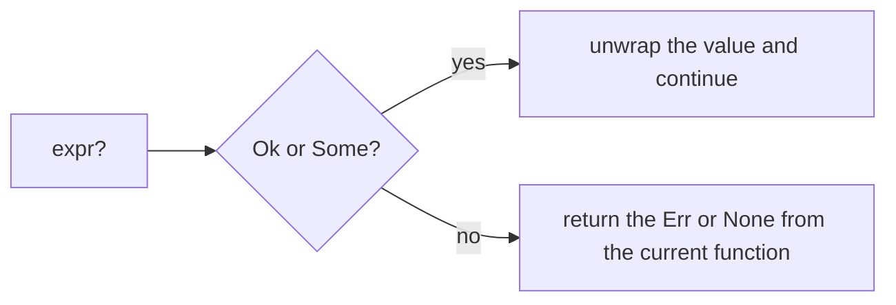

Full example: [`examples/l06_option_result.rs`](https://github.com/spareilleux/learn/blob/main/code/rust-for-csharp-java/examples/l06_option_result.rs) — `cargo run --example l06_option_result`.

## Two things Rust does not have

Rust has **no `null`** and **no exceptions**. Both are replaced by two enums from the standard library — built exactly like the ones in [lesson 5](../05-structs-enums-match/) ([`core/src/option.rs`](https://github.com/rust-lang/rust/blob/1.94.0/library/core/src/option.rs#L600-L609), [`core/src/result.rs`](https://github.com/rust-lang/rust/blob/1.94.0/library/core/src/result.rs#L557-L567)):

```rust
enum Option<T> {
    Some(T),
    None,
}

enum Result<T, E> {
    Ok(T),
    Err(E),
}
```

| Situation | C# | Java | Rust |
|---|---|---|---|
| A value may be absent | `null`, [`int?`](https://learn.microsoft.com/dotnet/csharp/language-reference/builtin-types/nullable-value-types), [nullable reference types](https://learn.microsoft.com/dotnet/csharp/fundamentals/null-safety/nullable-reference-types) (warnings) | `null`, [`Optional<T>`](https://docs.oracle.com/en/java/javase/25/docs/api/java.base/java/util/Optional.html) | `Option<T>` |
| An operation may fail | [exceptions](https://learn.microsoft.com/dotnet/csharp/fundamentals/exceptions/) (unchecked) | [checked and unchecked exceptions](https://docs.oracle.com/javase/tutorial/essential/exceptions/runtime.html) | `Result<T, E>` |
| A bug, unrecoverable | [`Environment.FailFast`](https://learn.microsoft.com/dotnet/api/system.environment.failfast), unhandled exception | [`Error`](https://docs.oracle.com/en/java/javase/25/docs/api/java.base/java/lang/Error.html), unhandled exception | [`panic!`](https://doc.rust-lang.org/std/macro.panic.html) |

Because absence and failure are part of the **type**, you cannot forget them.

## `Option<T>`

From [`examples/l06_option_result.rs`, lines 11-13](https://github.com/spareilleux/learn/blob/93f6f82/code/rust-for-csharp-java/examples/l06_option_result.rs#L11-L13), [88-91](https://github.com/spareilleux/learn/blob/93f6f82/code/rust-for-csharp-java/examples/l06_option_result.rs#L88-L91):

```rust
fn find_user(users: &HashMap<u32, User>, id: u32) -> Option<&User> {
    users.get(&id)
}

match find_user(&users, 3) {
    Some(user) => println!("found {}", user.name),
    None => println!("no user 3"),
}
```

An `Option<i32>` is not an `i32`, so you cannot use it by accident ([`src/lib.rs`, lines 266-267](https://github.com/spareilleux/learn/blob/93f6f82/code/rust-for-csharp-java/src/lib.rs#L266-L267)):

```rust
let maybe: Option<i32> = Some(1);
let total = maybe + 1;
```

```text
error[E0369]: cannot add `{integer}` to `Option<i32>`
   --> e06_option_add.rs:3:23
    |
  3 |     let total = maybe + 1;
    |                 ----- ^ - {integer}
    |                 |
    |                 Option<i32>
```

In C#, the equivalent [`NullReferenceException`](https://learn.microsoft.com/dotnet/api/system.nullreferenceexception) would happen at runtime.

### Combinators

Instead of nested `if (x != null)`, chain methods — they read like [`?.`](https://learn.microsoft.com/dotnet/csharp/language-reference/operators/member-access-operators#null-conditional-operators--and-) and [`??`](https://learn.microsoft.com/dotnet/csharp/language-reference/operators/null-coalescing-operator) ([line 85](https://github.com/spareilleux/learn/blob/93f6f82/code/rust-for-csharp-java/examples/l06_option_result.rs#L85)):

```rust
let name_len = find_user(&users, 2).map(|u| u.name.len()).unwrap_or(0);
```

| Rust | C# | Java `Optional` |
|---|---|---|
| `opt.map(f)` | `x?.F()` | `opt.map(f)` |
| `opt.unwrap_or(v)` | `x ?? v` | `opt.orElse(v)` |
| `opt.unwrap_or_else(f)` | `x ?? F()` | `opt.orElseGet(f)` |
| `opt.and_then(f)` | `x?.F()` where `F` returns nullable | `opt.flatMap(f)` |
| `opt.ok_or(err)` | `x ?? throw …` | `opt.orElseThrow(…)` |
| `opt.is_some()` / `is_none()` | `x != null` | `opt.isPresent()` |

## `Result<T, E>`

A function that can fail says so in its signature — somewhat like a Java checked exception, but as a return value ([lines 23-29](https://github.com/spareilleux/learn/blob/93f6f82/code/rust-for-csharp-java/examples/l06_option_result.rs#L23-L29), [93-94](https://github.com/spareilleux/learn/blob/93f6f82/code/rust-for-csharp-java/examples/l06_option_result.rs#L93-L94)):

```rust
fn sum_csv(line: &str) -> Result<i32, ParseIntError> {
    let mut total = 0;
    for field in line.split(',') {
        total += field.trim().parse::<i32>()?;
    }
    Ok(total)
}

println!("{:?}", sum_csv("1, 2, 3"));     // Ok(6)
println!("{:?}", sum_csv("1, two, 3"));   // Err(ParseIntError { kind: InvalidDigit })
```

Ignoring a `Result` is a warning, because it may hide an error:

```text
warning: unused `Result` that must be used
 --> e06_unused_result.rs:6:5
  |
6 |     save();
  |     ^^^^^^
  |
  = note: this `Result` may be an `Err` variant, which should be handled
```

## The `?` operator

`?` means: *if this is `Ok`/`Some`, unwrap it; otherwise return the `Err`/`None` from the current function right now.* It is the explicit, visible equivalent of letting an exception propagate.

The two paths a value can take through the question mark operator.



From [`examples/l06_option_result.rs`, lines 16-20](https://github.com/spareilleux/learn/blob/93f6f82/code/rust-for-csharp-java/examples/l06_option_result.rs#L16-L20):

```rust
fn manager_name(users: &HashMap<u32, User>, id: u32) -> Option<&str> {
    let user = find_user(users, id)?;                  // no such user → None
    let manager = find_user(users, user.manager_id?)?; // no manager → None
    Some(&manager.name)
}
```

```text
manager of 2: Some("Grace")
manager of 1: None
manager of 9: None
```

`?` only works in a function that itself returns `Result` or `Option`:

```text
error[E0277]: the `?` operator can only be used in a function that returns `Result` or `Option` (or another type that implements `FromResidual`)
 --> e06_question_in_main.rs:2:35
  |
1 | fn main() {
  | --------- this function should return `Result` or `Option` to accept `?`
2 |     let port: u16 = "3000".parse()?;
  |                                   ^ cannot use the `?` operator in a function that returns `()`
  |
help: consider adding return type
  |
1 ~ fn main() -> Result<(), Box<dyn std::error::Error>> {
2 |     let port: u16 = "3000".parse()?;
3 |     println!("{port}");
4 +     Ok(())
  |
```

## Your own error types

An error is any type; an `enum` lists the ways an operation can fail ([lines 32-60](https://github.com/spareilleux/learn/blob/93f6f82/code/rust-for-csharp-java/examples/l06_option_result.rs#L32-L60)):

```rust
#[derive(Debug)]
enum ConfigError {
    Missing(&'static str),
    BadNumber { key: &'static str, source: ParseIntError },
}

impl fmt::Display for ConfigError {
    fn fmt(&self, f: &mut fmt::Formatter) -> fmt::Result {
        match self {
            ConfigError::Missing(key) => write!(f, "missing key `{key}`"),
            ConfigError::BadNumber { key, source } => write!(f, "`{key}` is not a number: {source}"),
        }
    }
}

impl Error for ConfigError {}

fn read_port(config: &HashMap<&str, &str>) -> Result<u16, ConfigError> {
    let raw = config.get("port").ok_or(ConfigError::Missing("port"))?;
    raw.parse::<u16>().map_err(|source| ConfigError::BadNumber { key: "port", source })
}
```

```text
Err("missing key `port`")
Err("`port` is not a number: invalid digit found in string")
Ok(3000)
```

- [`ok_or`](https://doc.rust-lang.org/std/option/enum.Option.html#method.ok_or) turns an `Option` into a `Result`; [`map_err`](https://doc.rust-lang.org/std/result/enum.Result.html#method.map_err) converts one error type into another — like catching and wrapping an exception.
- [`Display`](https://doc.rust-lang.org/std/fmt/trait.Display.html) is the message for users, [`Debug`](https://doc.rust-lang.org/std/fmt/trait.Debug.html) the details for developers.
- In real projects, the [`thiserror`](https://crates.io/crates/thiserror) crate generates this boilerplate for libraries, and [`anyhow`](https://crates.io/crates/anyhow) offers a catch-all error type for applications.

### `main` can return a `Result`

From [`examples/l06_option_result.rs`, lines 63](https://github.com/spareilleux/learn/blob/93f6f82/code/rust-for-csharp-java/examples/l06_option_result.rs#L63), [108-111](https://github.com/spareilleux/learn/blob/93f6f82/code/rust-for-csharp-java/examples/l06_option_result.rs#L108-L111):

```rust
fn main() -> Result<(), Box<dyn Error>> {
    let port = read_port(&config)?;   // ConfigError converts into Box<dyn Error>
    println!("listening on {port}");
    Ok(())
}
```

[`Box<dyn Error>`](https://doc.rust-lang.org/std/error/trait.Error.html) accepts any error type, so `?` works with different errors in the same function. If `main` returns `Err`, Rust prints it with its **`Debug`** format and exits with code 1:

```text
Error: Missing("port")
```

## When to panic

[`unwrap()`](https://doc.rust-lang.org/std/result/enum.Result.html#method.unwrap) and [`expect("…")`](https://doc.rust-lang.org/std/result/enum.Result.html#method.expect) extract the value or **panic**:

```rust
let port: u16 = "http".parse().expect("PORT must be a number");
```

```text
thread 'main' panicked at e06_unwrap_panic.rs:2:36:
PORT must be a number: ParseIntError { kind: InvalidDigit }
```

| Use | For |
|---|---|
| `Result` + `?` | anything that can fail in normal operation: I/O, parsing user input, network |
| `expect("why this cannot fail")` | invariants you have checked, tests, quick prototypes |
| `unwrap()` | tests and examples; in production code, prefer `expect` with a reason |

A panic is not a `try/catch` mechanism: treat it as a bug report.

## Key takeaways

- `Option<T>` replaces `null`; `Result<T, E>` replaces exceptions; both are ordinary enums.
- The compiler refuses to use an `Option<T>` as a `T`, and warns when a `Result` is ignored.
- `?` propagates `None`/`Err` to the caller — explicit, but as short as an exception.
- Model errors with enums, convert them with `map_err`/[`From`](https://doc.rust-lang.org/std/convert/trait.From.html), and keep `panic!` for bugs.

## Exercises

1. Translate this C# method and its call site into Rust, using `Option` and `unwrap_or`:

```csharp
int? FindAge(Dictionary<string, int> ages, string name) =>
    ages.TryGetValue(name, out var age) ? age : null;

var age = FindAge(ages, "Ada") ?? -1;
```

<details>
<summary>Solution</summary>

From [`src/lib.rs`, lines 281-287](https://github.com/spareilleux/learn/blob/93f6f82/code/rust-for-csharp-java/src/lib.rs#L281-L287):

```rust
use std::collections::HashMap;

fn find_age(ages: &HashMap<&str, u32>, name: &str) -> Option<u32> {
    ages.get(name).copied()
}

let ages = HashMap::from([("Ada", 36)]);
let age = find_age(&ages, "Ada").map(i64::from).unwrap_or(-1);
assert_eq!(age, 36);
assert_eq!(find_age(&ages, "Bob"), None);
```

`get` returns `Option<&u32>`; `.copied()` turns it into `Option<u32>`. Returning `-1` as a sentinel needs a signed type — in Rust you would usually keep the `Option` instead.

</details>

2. Write `fn parse_point(text: &str) -> Result<(i32, i32), String>` so that `"3,4"` gives `Ok((3, 4))`, `"3"` gives `Err("expected x,y")`, and `"3,z"` gives an error mentioning the parse failure. Use `?`.

<details>
<summary>Solution</summary>

From [`src/lib.rs`, lines 293-301](https://github.com/spareilleux/learn/blob/93f6f82/code/rust-for-csharp-java/src/lib.rs#L293-L301):

```rust
fn parse_point(text: &str) -> Result<(i32, i32), String> {
    let (x, y) = text.split_once(',').ok_or("expected x,y")?;
    let x = x.trim().parse::<i32>().map_err(|e| format!("bad x: {e}"))?;
    let y = y.trim().parse::<i32>().map_err(|e| format!("bad y: {e}"))?;
    Ok((x, y))
}

assert_eq!(parse_point("3,4"), Ok((3, 4)));
assert_eq!(parse_point("3"), Err(String::from("expected x,y")));
assert_eq!(parse_point("3,z"), Err(String::from("bad y: invalid digit found in string")));
```

`?` also converts the `&str` from `ok_or` into a `String`, because `String` implements `From<&str>`.

</details>

3. `let port: u16 = "3000".parse()?;` does not compile in `fn main()`. Give two fixes.

<details>
<summary>Solution</summary>

- Change the signature to `fn main() -> Result<(), Box<dyn std::error::Error>>` and end with `Ok(())`, so `?` has somewhere to return the error.
- Or handle the error locally, for example `let port: u16 = "3000".parse().expect("PORT must be a number");` or a `match`.

</details>

## Sources

- [The Book, ch. 9 — Error Handling](https://doc.rust-lang.org/book/ch09-00-error-handling.html)
- [`Option` — standard library](https://doc.rust-lang.org/std/option/enum.Option.html)
- [`Result` — standard library](https://doc.rust-lang.org/std/result/enum.Result.html)
- [The `?` operator — Rust Reference](https://doc.rust-lang.org/reference/expressions/operator-expr.html#the-try-propagation-expression)
