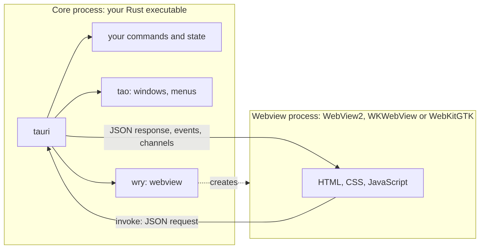

import { Tabs, TabItem } from '@astrojs/starlight/components';
import explorerScreenshot from '../../../assets/rust-for-csharp-java/l16-chord-explorer.webp';

Full example: [`l16-tauri/`](https://github.com/spareilleux/learn/tree/main/code/rust-for-csharp-java/l16-tauri), a desktop chord explorer. Lessons 16 to 21 build it; run `npm install` then `npm run tauri dev` from that folder.

Lessons 1 to 15 covered the language. This second part answers a question every C# or Java developer asks sooner or later: can I write a desktop application in Rust, and with what?

## What you already know

On .NET and the JVM, the choice is between toolkits that draw their own controls and toolkits that embed a browser engine:

| Toolkit | UI described in | Rendering |
|---|---|---|
| [WinForms](https://learn.microsoft.com/dotnet/desktop/winforms/overview/) | C# code, designer | Win32 controls, Windows only |
| [WPF](https://learn.microsoft.com/dotnet/desktop/wpf/overview/) | XAML + bindings | its own DirectX renderer, Windows only |
| [.NET MAUI](https://learn.microsoft.com/dotnet/maui/what-is-maui) | XAML + bindings | the platform's native controls (WinUI on Windows) |
| [Avalonia](https://avaloniaui.net/) | XAML-like `.axaml` | its own renderer, on every OS |
| [Swing](https://docs.oracle.com/javase/tutorial/uiswing/), [JavaFX](https://openjfx.io/) | Java code, FXML | their own renderer, on every OS |
| [Electron](https://www.electronjs.org/docs/latest/) | HTML, CSS, JavaScript | a Chromium shipped with every application, plus Node.js |
| [Blazor Hybrid](https://learn.microsoft.com/aspnet/core/blazor/hybrid/) | Razor components | the system webview (WebView2 on Windows) inside a MAUI, WPF or WinForms window |

Rust has both families too. What it lacks is the first-party framework: there is no WPF of Rust, only community projects, and none of them is as mature as WPF or JavaFX.

## Native rendering: egui, iced, Slint

These crates draw every pixel themselves, usually on the GPU, in a window opened by [winit](https://docs.rs/winit):

| Crate | Model | UI described in | License | Closest to |
|---|---|---|---|---|
| [egui](https://docs.rs/egui) with [eframe](https://docs.rs/eframe) | **immediate mode**: the UI is redrawn from your data at each frame | Rust code | MIT or Apache-2.0 | [Dear ImGui](https://github.com/ocornut/imgui), game debug UIs |
| [iced](https://docs.rs/iced) | **Elm architecture**: state, messages, `update`, `view` | Rust code | MIT | Model-View-Update, as in F#'s [Elmish](https://elmish.github.io/elmish/) |
| [Slint](https://docs.rs/slint) | declarative markup compiled to Rust | `.slint` files | GPLv3, royalty-free or commercial | XAML, FXML |

Versions on crates.io on 2026-09-15: egui and eframe 0.36.2, iced 0.14.0, Slint 1.17.1. egui and iced are still 0.x, and their APIs change between minor versions; Slint has been 1.x since April 2023.

[Dioxus](https://dioxuslabs.com/) looks like a fourth option, with React-style components written in Rust. Its desktop renderer, though, depends on `wry` and `tao` ([`dioxus-desktop` 0.7.10](https://crates.io/crates/dioxus-desktop/0.7.10/dependencies)): the same system webview as Tauri.

### egui in IX: `ix-demo`

[IX](https://github.com/GuitarAlchemist/ix) has an egui application, [`crates/ix-demo`](https://github.com/GuitarAlchemist/ix/tree/a7e5fbce3d4a7a9d15bb9638b3bcba7c08c2941a/crates/ix-demo) (commit `a7e5fbc`, 2026-09-15): 23 tabs of interactive demos over the workspace's crates. Its `main` opens a window ([`main.rs`, lines 28-40](https://github.com/GuitarAlchemist/ix/blob/a7e5fbce3d4a7a9d15bb9638b3bcba7c08c2941a/crates/ix-demo/src/main.rs#L28-L40)):

```rust
fn main() -> eframe::Result<()> {
    let options = eframe::NativeOptions {
        viewport: egui::ViewportBuilder::default()
            .with_inner_size([1280.0, 800.0])
            .with_title("ix — ML Algorithm Explorer"),
        ..Default::default()
    };
    eframe::run_native(
        "ix Demo",
        options,
        Box::new(|_cc| Ok(Box::new(IxApp::default()))),
    )
}
```

and each demo is a struct with a `ui` method that egui calls every time it repaints ([`demos/stats.rs`, lines 29-37](https://github.com/GuitarAlchemist/ix/blob/a7e5fbce3d4a7a9d15bb9638b3bcba7c08c2941a/crates/ix-demo/src/demos/stats.rs#L29-L37)):

```rust
impl StatsDemo {
    pub fn ui(&mut self, ui: &mut egui::Ui) {
        ui.heading("Statistics (ix-math)");
        ui.label("Enter comma-separated values:");
        ui.text_edit_singleline(&mut self.data_text);

        if ui.button("Compute").clicked() {
            self.compute();
        }
```

There is no XAML, no binding and no event handler. `text_edit_singleline(&mut self.data_text)` draws the text box *and* writes what the user typed into the field; `button(…).clicked()` draws the button and returns `true` during the frame in which it was clicked. For a WPF developer, it is as if `OnRender` rebuilt the whole window from the view model, without `INotifyPropertyChanged`.

Reading the 28 files (7,411 lines) of `ix-demo` shows the other side of immediate mode:

- The work runs **in** `ui`, on the thread that draws the window. There are 58 `clicked()` handlers and not a single thread, channel or `spawn`. The workloads are small (a sieve up to 1,000,000, at most 2,000 epochs of an XOR network), so it goes unnoticed; a longer computation would freeze every tab. Tauri solves that with asynchronous commands (lesson 17) and channels (lesson 18).
- The *Neural Network (ix-nn)* tab does not call `ix-nn`: it trains its own network with `ndarray` ([`demos/neural_net.rs`, line 77](https://github.com/GuitarAlchemist/ix/blob/a7e5fbce3d4a7a9d15bb9638b3bcba7c08c2941a/crates/ix-demo/src/demos/neural_net.rs#L77): "demonstrates the concepts in ix-nn").
- `Cargo.toml` asks for `eframe = "0.31"` while crates.io is at 0.36.2, and IX does not commit a `Cargo.lock`: each build takes the latest 0.31.x.

In Tauri, the same demo would be a Rust command per button, returning the numbers as JSON, and an HTML page drawing the plot with a JavaScript library. The Rust code gets simpler, the UI moves to a second language: that is the trade.

## Web UI in a system webview: Tauri

[Tauri](https://v2.tauri.app/) takes the Electron idea without shipping Chromium or Node.js. Your application is a Rust executable, the **core process**; the window's content is HTML, CSS and JavaScript rendered by the webview **that the operating system already provides** ([process model](https://v2.tauri.app/concept/process-model/)):

| OS | Webview | Engine |
|---|---|---|
| Windows | [WebView2](https://learn.microsoft.com/microsoft-edge/webview2/) | Chromium (Microsoft Edge) |
| macOS | [WKWebView](https://developer.apple.com/documentation/webkit/wkwebview) | WebKit (Safari) |
| Linux | [WebKitGTK](https://webkitgtk.org/) | WebKit |



- Only the core process can touch the file system, the network or other processes. The page reaches Rust through **commands** (`invoke`, lesson 17) and **events** (lesson 18), serialized as JSON: it is message passing, not shared memory.
- [`tao`](https://github.com/tauri-apps/tao) (a fork of winit) opens the windows, [`wry`](https://github.com/tauri-apps/wry) embeds the webview; `tauri` adds the IPC, the configuration, the permissions and the bundler on top.
- Three engines means three browsers to test, as on the web: a CSS feature that works in WebView2 may be missing from the WebKitGTK of an older Linux distribution.

This course pins **Tauri 2.11.5** (published on 2026-07-01), the Tauri CLI **2.11.4** and `create-tauri-app` **4.7.4**. A first **3.0.0-alpha** was published on 2026-09-13; among its crates is a new `tauri-runtime-cef`, a runtime based on the Chromium Embedded Framework. It is an alpha: the course stays on 2.

### The size difference, measured

Electron ships its runtime with every application. Electron **44.3.0** for Windows x64, downloaded with `npm install electron@44.3.0` on 2026-09-15, is a 158 MB zip that unpacks to **385 MB** in 73 files, `electron.exe` alone weighing 246 MB — before any line of your application.

The chord explorer built by these lessons, in release mode with `tauri build --no-bundle`, is a single `chord-explorer.exe` of **4.2 MB** (4,244,992 bytes) on Windows, HTML included; the build took 2 min 43 s. It relies on the WebView2 runtime installed with Windows 11 (version 153.0.4234.32 on my machine).

A small binary does not mean a small memory footprint: WebView2 starts its own browser processes. With the release build's window open, measured with PowerShell ([`Get-Process`](https://learn.microsoft.com/powershell/module/microsoft.powershell.management/get-process), private bytes of the process and of its children):

```text
Name           Type             Sub                          PrivateMB WorkingSetMB
----           ----             ---                          --------- ------------
chord-explorer                                                    5.60        27.10
msedgewebview2 browser                                           40.70       125.00
msedgewebview2 crashpad-handler                                   2.50         9.70
msedgewebview2 gpu-process                                       81.90        67.00
msedgewebview2 renderer                                          25.10        60.10
msedgewebview2 utility          network.mojom.NetworkService     12.70        37.90
msedgewebview2 utility          storage.mojom.StorageService      8.10        18.40

total private MB: 176.6; total working set MB: 345.2; processes: 7
```

The Rust process itself uses 5.6 MB; the other six processes are WebView2's, about 170 MB. The working sets add up to more because they count the pages shared between processes several times. A Tauri application is light on disk, not free in memory: it runs a browser engine, as Electron does.

## Prerequisites

Tauri needs Rust (lesson 1) and each OS's webview development libraries; Node.js is only needed for the npm version of the CLI and for JavaScript frameworks ([prerequisites](https://v2.tauri.app/start/prerequisites/)).

<Tabs syncKey="os">
<TabItem label="Windows">

- The **MSVC build tools**, already installed in lesson 1; the Tauri guide asks for the *Desktop development with C++* workload.
- **WebView2**: included in Windows 11 and in Windows 10 since version 1803. To check its version:

```powershell
(Get-ItemProperty 'HKLM:\SOFTWARE\WOW6432Node\Microsoft\EdgeUpdate\Clients\{F3017226-FE2A-4295-8BDF-00C3A9A7E4C5}').pv
```

```text
153.0.4234.32
```

- [Node.js](https://nodejs.org/) LTS for `npm` (this course: Node 24.12.0, npm 11.7.0).

</TabItem>
<TabItem label="Linux / WSL">

On Debian and Ubuntu, the list from the Tauri guide:

```bash
sudo apt update
sudo apt install libwebkit2gtk-4.1-dev \
  build-essential \
  curl \
  wget \
  file \
  libxdo-dev \
  libssl-dev \
  libayatana-appindicator3-dev \
  librsvg2-dev
```

Other distributions have their own package names in the guide. On WSL, Linux GUI applications need [WSLg](https://learn.microsoft.com/windows/wsl/tutorials/gui-apps) (Windows 11): the window then opens on the Windows desktop (*to verify*: the course has not run Tauri under WSL yet).

</TabItem>
<TabItem label="macOS">

```bash
xcode-select --install   # enough for desktop apps; iOS needs the full Xcode
```

WKWebView is part of macOS: nothing else to install. CI builds and tests the explorer on macOS runners that way; opening its window is *to verify* on a Mac.

</TabItem>
</Tabs>

## Creating a project

[`create-tauri-app`](https://github.com/tauri-apps/create-tauri-app) generates a project. The options skip the questions:

```bash
npx create-tauri-app@4.7.4 hello-tauri --manager npm --template vanilla --identifier dev.learn.hello --yes
```

```text
Template created! To get started run:
  cd hello-tauri
  npm install
  npm run tauri android init

For Desktop development, run:
  npm run tauri dev

For Android development, run:
  npm run tauri android dev
```

The first suggestion is the Android setup, even on Windows and for a desktop project; for the desktop, skip to the second block. The `vanilla` template is plain HTML, CSS and JavaScript, with no bundler (lesson 19 covers Vite and TypeScript). The generated layout ([project structure](https://v2.tauri.app/start/project-structure/)):

```text
hello-tauri/
├── package.json            ← only the Tauri CLI, as a dev dependency
├── src/                    ← the frontend: index.html, main.js, styles.css
└── src-tauri/              ← a normal Cargo package
    ├── Cargo.toml
    ├── build.rs            ← tauri_build::build(): reads the config, embeds icons
    ├── tauri.conf.json     ← window, identifier, frontend folder, security, bundle
    ├── capabilities/
    │   └── default.json    ← what the window may call (lesson 20)
    ├── icons/
    └── src/
        ├── main.rs         ← calls hello_tauri_lib::run()
        └── lib.rs          ← the app: commands and Builder
```

Three details surprise a Rust developer:

- `Cargo.toml` declares `edition = "2021"`, not 2024. The course's project uses 2024, as in lesson 1, and compiles the same.
- The library is called `hello_tauri_lib` and is built as `["staticlib", "cdylib", "rlib"]`: on iOS and Android the application is a library loaded by the platform, so `main.rs` only calls `lib.rs`, where everything lives. The comment explains the `_lib` suffix: a library and a binary with the same name clash on Windows.
- `main.rs` starts with `#![cfg_attr(not(debug_assertions), windows_subsystem = "windows")]`: without it, a release build would open a console window next to the application.

`tauri.conf.json` is to Tauri what `App.xaml` plus the `.csproj` are to WPF ([configuration reference](https://v2.tauri.app/reference/config/)):

```json
{
  "$schema": "https://schema.tauri.app/config/2",
  "productName": "hello-tauri",
  "version": "0.1.0",
  "identifier": "dev.learn.hello",
  "build": {
    "frontendDist": "../src"
  },
  "app": {
    "withGlobalTauri": true,
    "windows": [
      {
        "title": "hello-tauri",
        "width": 800,
        "height": 600
      }
    ],
    "security": {
      "csp": null
    }
  },
  "bundle": {
    "active": true,
    "targets": "all",
    "icon": [
      "icons/32x32.png",
      "icons/128x128.png",
      "icons/128x128@2x.png",
      "icons/icon.icns",
      "icons/icon.ico"
    ]
  }
}
```

- `frontendDist` is the folder of static files embedded in the executable; a framework with a dev server would add `devUrl`.
- `withGlobalTauri: true` exposes the JavaScript API as `window.__TAURI__`, so a page without a bundler can call `window.__TAURI__.core.invoke`.
- `"csp": null` disables the Content Security Policy. The course's project sets one, and lesson 20 explains why the template's default deserves a second look.

## Running it: `tauri dev`

From the course's folder, `npm install` installs the CLI pinned by `package-lock.json`, then `npx tauri dev` builds and starts the application:

```bash
cd code/rust-for-csharp-java/l16-tauri
npm install
npx tauri dev
```

```text
     Running DevCommand (`cargo  run --no-default-features --color always --`)
        Info Watching C:\Users\spare\source\repos\learn\code\rust-for-csharp-java\l16-tauri\src-tauri for changes...
        Info Watching C:\Users\spare\source\repos\learn\code\rust-for-csharp-java\l16-tauri\theory for changes...
   Compiling chord-explorer v0.1.0 (C:\Users\spare\source\repos\learn\code\rust-for-csharp-java\l16-tauri\src-tauri)
    Finished `dev` profile [unoptimized + debuginfo] target(s) in 25.84s
     Running `C:\Users\spare\source\repos\learn\code\rust-for-csharp-java\l16-tauri\target\debug\chord-explorer.exe`
```

- It is `cargo run` underneath: the first run compiles all of Tauri's dependencies and takes minutes; the run above only recompiled the application.
- The CLI watches `src-tauri` and the crates it depends on by path, here `theory`. Changing the window's title in `tauri.conf.json` rebuilt the application (20.84 s) and restarted it with the new title.
- With no `devUrl`, the CLI serves the `frontendDist` folder itself: the page's address in the webview was `http://127.0.0.1:1430/`.

## The course's application: a chord explorer

The following lessons build one application, in the spirit of [Guitar Alchemist](https://github.com/GuitarAlchemist/ga): spell a chord (`Bbm7` is `Bb Db F Ab`), transpose it, list the chords of a key, keep favourites, and search every way to play a chord on a guitar.


The music theory is a separate crate that knows nothing about Tauri ([`l16-tauri/Cargo.toml`](https://github.com/spareilleux/learn/blob/373237a/code/rust-for-csharp-java/l16-tauri/Cargo.toml)):

```toml
[workspace]
resolver = "3"
members = ["theory", "src-tauri"]
```

```text
l16-tauri/
├── Cargo.toml          ← the workspace (lesson 10)
├── package.json        ← @tauri-apps/cli 2.11.4, with its package-lock.json
├── theory/             ← notes, chords, scales, voicings: plain Rust, no dependencies
├── src-tauri/          ← the Tauri app: commands and state that call theory
└── ui/                 ← index.html, main.js, styles.css
```

It is the layering you would use in .NET, with a class library referenced by the WPF project, or in Java, with a domain module under the JavaFX one: the logic can be tested without a window. `cargo test -p theory` runs its 15 tests without compiling any of the 236 other crates that the Tauri application pulls in on Windows (`cargo tree`):

```text
running 15 tests
test chord::tests::reports_what_is_wrong ... ok
test chord::tests::every_quality_round_trips ... ok
test chord::tests::spells_chords_with_the_right_letters ... ok
test chord::tests::mask_ignores_spelling ... ok
test note::tests::rejects_what_is_not_a_note ... ok
test scale::tests::one_letter_per_degree ... ok
test note::tests::parses_and_prints_notes ... ok
test voicing::tests::rejects_muted_strings_between_sounding_ones ... ok
test note::tests::spells_by_letter_then_semitones ... ok
test scale::tests::diatonic_triads ... ok
test chord::tests::transposes_with_common_spellings ... ok
test note::tests::enharmonic_notes_share_a_pitch_class ... ok
test voicing::tests::reports_every_batch_and_stops_when_cancelled ... ok
test voicing::tests::every_result_is_a_root_position_voicing ... ok
test voicing::tests::finds_the_open_chords ... ok

test result: ok. 15 passed; 0 failed; 0 ignored; 0 measured; 0 filtered out; finished in 4.13s
```

## Key takeaways

- Rust desktop UIs come in two families: native rendering (egui, iced, Slint) and a web UI in a webview (Tauri, and Dioxus on the desktop).
- egui redraws the UI from your data at each frame; simple to write, but the work you put in `ui` runs on the drawing thread.
- A Tauri app is a Rust core process plus the OS webview: WebView2, WKWebView or WebKitGTK. The UI talks to Rust by message passing, in JSON.
- Not shipping Chromium makes the executable a few megabytes instead of hundreds, but the webview's processes still use memory, and three engines must be tested.
- `src-tauri` is a normal Cargo package; `tauri.conf.json` describes the windows, the frontend and the security settings.

## Exercises

1. Which webview, and which engine version, renders a Tauri window on your machine? Find out from JavaScript, in the window's developer tools (right-click, *Inspect*, in a debug build).

<details>
<summary>Solution</summary>

`navigator.userAgent` describes the engine. In the explorer's window on Windows:

```text
Mozilla/5.0 (Windows NT 10.0; Win64; x64) AppleWebKit/537.36 (KHTML, like Gecko) Chrome/153.0.0.0 Safari/537.36 Edg/153.0.0.0
```

The `Edg/` token is WebView2; its version is the one found in the registry above. On macOS the user agent contains `AppleWebKit` without `Chrome`, and on Linux the WebKitGTK version.

</details>

2. Change the explorer's window so that it opens at 1100 × 800, cannot be made smaller than 700 × 500, and is titled *Chords*.

<details>
<summary>Solution</summary>

In `src-tauri/tauri.conf.json`, the window object accepts `minWidth` and `minHeight` ([`WindowConfig`](https://v2.tauri.app/reference/config/#windowconfig)):

```json
"windows": [
  {
    "title": "Chords",
    "width": 1100,
    "height": 800,
    "minWidth": 700,
    "minHeight": 500
  }
]
```

`tauri dev` notices the change and restarts the application. The configuration is read at **compile time** by `tauri::generate_context!()`, so a release build must be rebuilt as well.

</details>

3. Why does the `theory` crate not depend on `serde`, even though every result reaches JavaScript as JSON?

<details>
<summary>Solution</summary>

Because JSON is a concern of the boundary, not of the music theory. `src-tauri` converts `theory`'s types into small serializable structs (`ChordView`, lesson 17), the equivalent of DTOs in an ASP.NET Core or Spring controller. `theory` stays usable from a command-line tool, a test or an egui application, and its tests compile in about a second. Adding `serde` behind an optional Cargo feature (lesson 10) would also be reasonable if several front ends needed the same JSON.

</details>

## Sources

- [Tauri 2 — Process model](https://v2.tauri.app/concept/process-model/), [Architecture](https://v2.tauri.app/concept/architecture/) and [Prerequisites](https://v2.tauri.app/start/prerequisites/)
- [Tauri 2 — Create a project](https://v2.tauri.app/start/create-project/) and [Project structure](https://v2.tauri.app/start/project-structure/)
- [Tauri source at `tauri-v2.11.5`](https://github.com/tauri-apps/tauri/tree/tauri-v2.11.5)
- [Microsoft — WebView2 overview](https://learn.microsoft.com/microsoft-edge/webview2/)
- [Electron — Process model](https://www.electronjs.org/docs/latest/tutorial/process-model)
- [egui](https://docs.rs/egui), [eframe](https://docs.rs/eframe), [iced](https://docs.rs/iced) and [Slint](https://docs.rs/slint) on docs.rs
