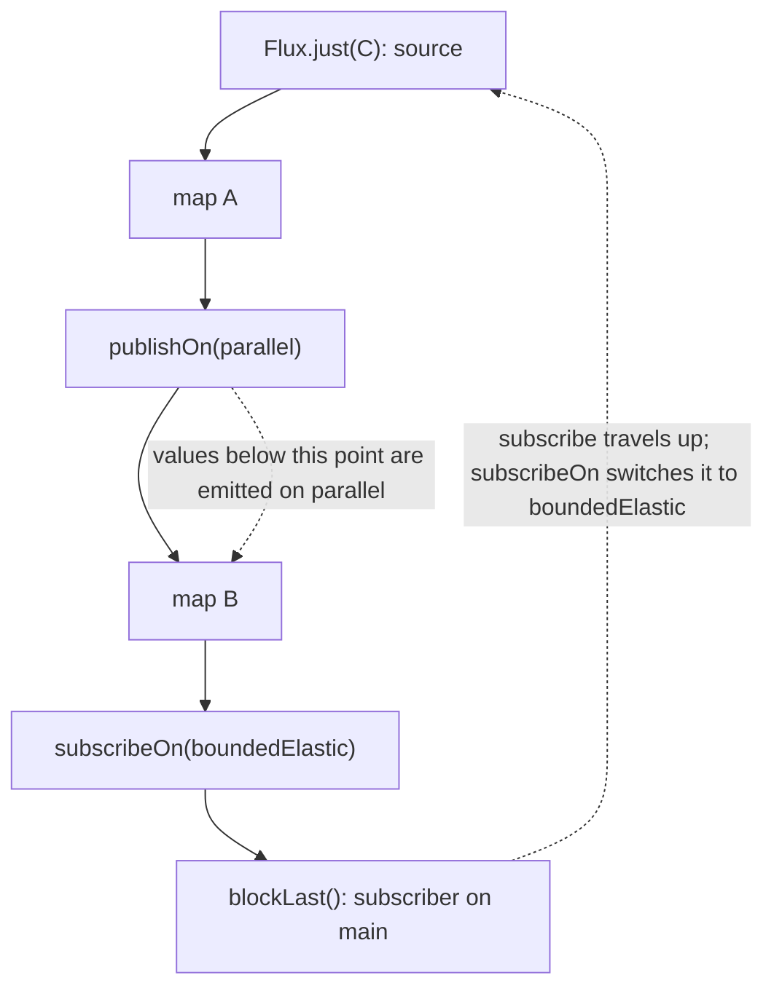

Full example: [`code/spring-cloud-reactor/l03-reactor`](https://github.com/spareilleux/learn/tree/main/code/spring-cloud-reactor/l03-reactor). Its tests run with BlockHound loaded as a Java agent, as in [lesson 11 of the Java course](../../java-for-csharp/11-testing/), and compare each output with [`expected`](https://github.com/spareilleux/learn/tree/main/code/spring-cloud-reactor/l03-reactor/expected). The .NET side is [`csharp/l03-polly-channels.cs`](https://github.com/spareilleux/learn/blob/main/code/spring-cloud-reactor/csharp/l03-polly-channels.cs).

## Threads: nobody moves you unless asked

In C#, the thread that runs the code after an `await` is chosen for you: the synchronization context if there is one, otherwise the thread pool. Reactor does the opposite. A pipeline runs on the thread that subscribes to it, and it moves to another thread only where an operator or a **scheduler** says so. Lesson 2's examples all ran on `main` for that reason.

| Scheduler | Threads | For | .NET counterpart |
|---|---|---|---|
| `Schedulers.immediate()` | the current one | tests, defaults | running synchronously |
| `Schedulers.single()` | one reusable thread | ordering-sensitive work | a dedicated thread with a queue |
| `Schedulers.parallel()` | one per CPU core | short, non-blocking work | the thread pool's worker threads |
| `Schedulers.boundedElastic()` | up to 10 per core, created on demand, disposed after 60 s idle | blocking calls | `Task.Factory.StartNew(..., TaskCreationOptions.LongRunning)` |
| `Schedulers.fromExecutorService(...)` | whatever you pass | integrating an existing pool | a custom `TaskScheduler` |

The sizes come from the [Reactor reference guide](https://projectreactor.io/docs/core/release/reference/coreFeatures/schedulers.html): `boundedElastic()` also queues up to 100,000 tasks once its threads are all busy. Two operators place a scheduler in a pipeline:

```java
/** The thread's name without its number: parallel-3 and parallel-7 are the same pool. */
static String thread() {
    return Thread.currentThread().getName().replaceAll("-\\d+$", "");
}

static <T> T step(String name, T value) {
    System.out.println("  " + name + " on " + thread());
    return value;
}

public static void main(String[] args) {
    System.out.println("no scheduler:");
    Flux.just("C").map(root -> step("map", root)).subscribe(root -> step("subscriber", root));

    // publishOn moves everything below it to another scheduler, like ConfigureAwait with a custom context.
    System.out.println("publishOn(parallel):");
    Flux.just("C")
            .map(root -> step("map above publishOn", root))
            .publishOn(Schedulers.parallel())
            .map(root -> step("map below publishOn", root))
            .blockLast();

    // subscribeOn moves the subscription, so the source and everything up to the first publishOn.
    System.out.println("subscribeOn(boundedElastic):");
    Mono.fromCallable(() -> step("callable", Scale.of("D", "dorian")))
            .map(scale -> step("map", scale))
            .subscribeOn(Schedulers.boundedElastic())
            .block();

    // Where subscribeOn is written doesn't matter; where publishOn is written does.
    System.out.println("both, subscribeOn written last:");
    Flux.just("C")
            .map(root -> step("map A", root))
            .publishOn(Schedulers.parallel())
            .map(root -> step("map B", root))
            .subscribeOn(Schedulers.boundedElastic())
            .blockLast();

    // Time-based operators pick a scheduler for you: Mono.delay emits on parallel().
    System.out.println("Mono.delay:");
    Mono.delay(Duration.ofMillis(1)).map(tick -> step("map after delay", tick)).block();
    step("block() returned", "");
}
```

```text
no scheduler:
  map on main
  subscriber on main
publishOn(parallel):
  map above publishOn on main
  map below publishOn on parallel
subscribeOn(boundedElastic):
  callable on boundedElastic
  map on boundedElastic
both, subscribeOn written last:
  map A on boundedElastic
  map B on parallel
Mono.delay:
  map after delay on parallel
  block() returned on main
```

The thread numbers are removed because they depend on what ran before. The rule behind the output follows from lesson 2's signals: a subscription travels **up** the pipeline, from the subscriber to the source, and values travel back **down**.



- **`publishOn`** changes the thread for the signals that pass through it, so for every operator *below* it. Its position matters, and a pipeline can have several.
- **`subscribeOn`** changes the thread on which the subscription travels up, so the thread on which the source starts emitting. Its position doesn't matter; if there are several, the one closest to the source wins. Put it right after the source, where readers look for it.
- **Time-based operators switch silently.** `Mono.delay`, `Flux.interval`, `timeout` and `delayElements` emit on `parallel()` unless given another scheduler. Code after them no longer runs on the caller's thread, which is the most common surprise when a pipeline suddenly behaves differently in a test.

`block()` returned on `main` because blocking is a thread waiting for a result, not a continuation: `.GetAwaiter().GetResult()` behaves the same way.

## Backpressure

Lesson 2's `log()` showed a `request(2)`. That is **backpressure**: the subscriber says how many values it can take, and a well-behaved publisher never sends more.

```java
/** A subscriber that asks for {@code batch} elements, then for more only if {@code askForMore}. */
static final class Batches<T> extends BaseSubscriber<T> {
    private final int batch;
    private final boolean askForMore;
    private int received;

    Batches(int batch, boolean askForMore) {
        this.batch = batch;
        this.askForMore = askForMore;
    }

    @Override
    protected void hookOnSubscribe(Subscription subscription) {
        request(batch);
    }

    @Override
    protected void hookOnNext(T value) {
        System.out.println("  got " + value);
        received++;
        if (askForMore && received % batch == 0) {
            request(batch);
        }
    }

    @Override
    protected void hookOnError(Throwable error) {
        System.out.println("  error " + error.getClass().getSimpleName() + ": " + error.getMessage());
    }
}
```

`BaseSubscriber` is the class to extend when you need to control demand by hand. The example uses it five ways:

```java
List<String> progression = List.of("Dm7", "G7", "Cmaj7", "A7", "Dm7", "G7");

// The subscriber pulls: the source never sends more than was requested.
System.out.println("a subscriber that requests 2 at a time:");
Flux.fromIterable(progression)
        .doOnRequest(n -> System.out.println("  source asked for " + n))
        .subscribe(new Batches<>(2, true));

// limitRate splits a large demand into batches, and asks again when 75% of a batch has arrived.
System.out.println("limitRate(10) under an unbounded subscriber, first 25 elements:");
Flux.range(1, 1_000)
        .doOnRequest(n -> System.out.println("  source asked for " + n))
        .limitRate(10)
        .take(25, false)
        .blockLast();

// publishOn keeps a queue between two threads, and fills it by asking for 256 elements.
System.out.println("publishOn:");
Flux.range(1, 3)
        .doOnRequest(n -> System.out.println("  source asked for " + n))
        .publishOn(Schedulers.single())
        .blockLast();

// A source that ignores demand needs a strategy: buffer (up to a size), drop, or keep the latest.
System.out.println("onBackpressureDrop, subscriber requests 3:");
var dropped = new ArrayList<Integer>();
Flux.range(1, 10)
        .onBackpressureDrop(dropped::add)
        .subscribe(new Batches<>(3, false));
System.out.println("  dropped " + dropped);

// The overflow error waits behind the buffered elements: the subscriber sees it after draining them.
System.out.println("onBackpressureBuffer(3), subscriber requests 1:");
var slow = new Batches<Integer>(1, false);
Flux.range(1, 10)
        .onBackpressureBuffer(3)
        .subscribe(slow);
System.out.println("  subscriber now requests 10 more");
slow.request(10);
```

```text
a subscriber that requests 2 at a time:
  source asked for 2
  got Dm7
  got G7
  source asked for 2
  got Cmaj7
  got A7
  source asked for 2
  got Dm7
  got G7
  source asked for 2
limitRate(10) under an unbounded subscriber, first 25 elements:
  source asked for 10
  source asked for 8
  source asked for 8
  source asked for 8
publishOn:
  source asked for 256
onBackpressureDrop, subscriber requests 3:
  got 1
  got 2
  got 3
  dropped [4, 5, 6, 7, 8, 9, 10]
onBackpressureBuffer(3), subscriber requests 1:
  got 1
  subscriber now requests 10 more
  got 2
  got 3
  got 4
  error OverflowException: The receiver is overrun by more signals than expected (bounded queue...)
```

- **Demand is a number, and it accumulates.** The last `source asked for 2` found the source exhausted, so the sequence completed. `take(25, false)` passes the subscriber's unbounded demand upstream, which is why `limitRate` is visible; `take(25)` alone would already limit the request to 25.
- **`limitRate(10)` refills at 75%.** After 10, it asked for 8 each time: once 8 of the 10 had been consumed. A database driver or a message consumer fetches in pages this way.
- **`publishOn` is a queue.** It requests 256 elements, its default prefetch, to fill the queue between the source's thread and its own. `flatMap` and `concatMap` have prefetch values too, which is why a slow downstream still sees a first burst.
- **Sources that can't slow down need a strategy.** A timer, a mouse, a message broker pushing without flow control: the `onBackpressure…` operators request everything upstream and decide what to do with the surplus. `onBackpressureDrop` threw away 4 to 10. `onBackpressureBuffer(3)` kept a bounded queue and signalled an `OverflowException` when it overflowed; the error waited behind the buffered values, so the subscriber only saw it after asking for more. `onBackpressureLatest` keeps the most recent value only.

`IAsyncEnumerable` has backpressure for free, one element at a time, because the consumer pulls with `MoveNextAsync`. Push-based .NET code gets it from a bounded [channel](https://learn.microsoft.com/dotnet/core/extensions/channels), whose `BoundedChannelFullMode` plays the part of the `onBackpressure…` operators. The C# side found one trap there:

```text
bounded channel (3, DropWrite): TryWrite returned true 10 times, reader gets 1, 2, 3
```

With `DropWrite`, `TryWrite` reports success for the items it drops, as the [documentation of `BoundedChannelFullMode`](https://learn.microsoft.com/dotnet/api/system.threading.channels.boundedchannelfullmode) says. Reactor's `onBackpressureDrop` at least gives you a callback with each dropped value.

## Errors and retries

An exception thrown inside an operator becomes an `onError` signal, and lesson 2 showed that it ends the sequence. The error operators are the reactive `try`/`catch`:

```java
/** A scale service that fails until its third call. */
static Mono<String> flakyLookup(AtomicInteger calls) {
    return Mono.fromCallable(() -> {
        int call = calls.incrementAndGet();
        System.out.println("  call " + call);
        if (call < 3) {
            throw new IllegalStateException("scale service unavailable");
        }
        return "D dorian";
    });
}

public static void main(String[] args) {
    // retry(n) subscribes again: the Mono is a recipe, so the call runs again too.
    System.out.println("retry(2):");
    System.out.println("  result: " + flakyLookup(new AtomicInteger()).retry(2).block());

    System.out.println("retry(1):");
    try {
        flakyLookup(new AtomicInteger()).retry(1).block();
    } catch (IllegalStateException e) {
        System.out.println("  block() threw " + e.getMessage());
    }

    // onErrorReturn is a catch that returns a value; onErrorResume switches to another publisher.
    System.out.println("fallbacks:");
    Mono<String> failing = Mono.error(new IllegalStateException("scale service unavailable"));
    System.out.println("  onErrorReturn: " + failing.onErrorReturn("C ionian").block());
    System.out.println("  onErrorResume: " + failing.onErrorResume(e -> Mono.just("cached: " + e.getMessage())).block());

    // onErrorMap is catch-and-wrap; doOnError only looks.
    try {
        failing.doOnError(e -> System.out.println("  doOnError saw: " + e.getMessage()))
                .onErrorMap(e -> new RuntimeException("lookup failed", e))
                .block();
    } catch (RuntimeException e) {
        System.out.println("  onErrorMap: " + e.getMessage() + ", caused by " + e.getCause().getMessage());
    }

    // timeout is a signal too: here a 5-second call is cut at 50 ms and replaced.
    System.out.println("timeout:");
    String answer = Mono.delay(Duration.ofSeconds(5)).map(tick -> "too late")
            .timeout(Duration.ofMillis(50), Mono.just("timed out, default scale"))
            .block();
    System.out.println("  " + answer);
}
```

```text
retry(2):
  call 1
  call 2
  call 3
  result: D dorian
retry(1):
  call 1
  call 2
  block() threw scale service unavailable
fallbacks:
  onErrorReturn: C ionian
  onErrorResume: cached: scale service unavailable
  doOnError saw: scale service unavailable
  onErrorMap: lookup failed, caused by scale service unavailable
timeout:
  timed out, default scale
```

`retry` works only because lesson 2's first rule holds: a `Mono` is a recipe, so subscribing again calls the service again. A retry around `Mono.just(callService())` would replay the same failed value forever. `block()` rethrew the original `IllegalStateException` unwrapped, because it is unchecked; a checked exception would have come back wrapped in a `ReactiveException`.

Real retries wait between attempts. [`Retry.backoff`](https://projectreactor.io/docs/core/release/api/reactor/util/retry/Retry.html) is Polly's exponential retry, tested here in virtual time:

```java
@Test
void backoffWaitsLongerEachTime() {
    var calls = new AtomicInteger();
    // Polly's AddRetry with MaxRetryAttempts = 3, Delay = 100 ms, BackoffType = Exponential, UseJitter = false.
    StepVerifier.withVirtualTime(() -> Mono.error(new IllegalStateException("scale service unavailable"))
                    .doOnSubscribe(subscription -> calls.incrementAndGet())
                    .retryWhen(Retry.backoff(3, Duration.ofMillis(100)).jitter(0)))
            .expectSubscription()
            .expectNoEvent(Duration.ofMillis(100 + 200 + 400))
            .consumeErrorWith(error -> Expected.check("retries-exhausted",
                    error.getClass().getName() + ": " + error.getMessage() + "\ncaused by " + error.getCause()
                            + "\nsubscriptions: " + calls.get()))
            .verify();
}
```

```text
reactor.core.Exceptions$RetryExhaustedException: Retries exhausted: 3/3
caused by java.lang.IllegalStateException: scale service unavailable
subscriptions: 4
```

The retries waited 100, 200 and 400 ms of virtual time, then the error changed type: `Retry.backoff` wraps the last failure in `RetryExhaustedException`. Polly does not wrap. The C# side, with two retries:

```text
Polly, 2 retries:
  call 1
  retry 1 after 10 ms
  call 2
  retry 2 after 20 ms
  call 3
  result: D dorian
Polly, retries exhausted:
  retry 1 after 10 ms
  retry 2 after 20 ms
  InvalidOperationException: scale service still unavailable
```

| Polly | Reactor |
|---|---|
| `AddRetry`, `MaxRetryAttempts` | `retry(n)`, `retryWhen(Retry.max(n))` |
| `BackoffType.Exponential`, `Delay` | `Retry.backoff(n, firstBackoff)` |
| `UseJitter` | `.jitter(0.5)` by default; `.jitter(0)` turns it off |
| `ShouldHandle = new PredicateBuilder().Handle<T>()` | `.filter(error -> error instanceof T)` |
| `AddTimeout` | `timeout(Duration)` |
| `AddFallback` | `onErrorResume`, `onErrorReturn` |
| the last exception is rethrown | `RetryExhaustedException` wraps it, unless `onRetryExhaustedThrow` says otherwise |
| `AddCircuitBreaker` | not in Reactor: Resilience4j, in lesson 9 |

Jitter is on by default in `Retry.backoff`: without `.jitter(0)`, the waits vary and a test can't expect exact durations.

## Context: `AsyncLocal` for pipelines

A request ID, the current user or a trace span often travel as ambient context. [Lesson 9 of the Java course](../../java-for-csharp/09-concurrency-and-virtual-threads/) showed that `ThreadLocal` doesn't follow a task to another thread. In a Reactor pipeline, which changes threads at every `publishOn`, it is useless. Reactor's **context** is an immutable map attached to the subscription:

```java
static final ThreadLocal<String> CURRENT_USER = new ThreadLocal<>();

/** Reads the user from the subscriber's context when it is subscribed to. */
static Mono<String> greeting() {
    return Mono.deferContextual(context -> Mono.just("hello " + context.getOrDefault("user", "anonymous")));
}

public static void main(String[] args) {
    // contextWrite is written below the operators that read it: the context travels up with the subscription.
    System.out.println("context below the reader: " + greeting().contextWrite(Context.of("user", "ada")).block());

    // Written above, it only reaches what is above it.
    System.out.println("context above the reader: " + Mono.just("ignored")
            .contextWrite(Context.of("user", "ada"))
            .flatMap(value -> greeting())
            .block());

    // Two writes: the one closest to the reader wins.
    System.out.println("two writes: " + greeting()
            .contextWrite(Context.of("user", "grace"))
            .contextWrite(Context.of("user", "ada"))
            .block());

    // A ThreadLocal stays on its thread; the context follows the pipeline to another one.
    CURRENT_USER.set("ada");
    try {
        String seen = Mono.just("scale")
                .publishOn(Schedulers.parallel())
                .flatMap(value -> Mono.deferContextual(context ->
                        Mono.just("ThreadLocal=" + CURRENT_USER.get() + ", context=" + context.get("user"))))
                .contextWrite(Context.of("user", "ada"))
                .block();
        System.out.println("after publishOn: " + seen);
    } finally {
        CURRENT_USER.remove();
    }
}
```

```text
context below the reader: hello ada
context above the reader: hello anonymous
two writes: hello grace
after publishOn: ThreadLocal=null, context=ada
```

The direction is the one surprise. `AsyncLocal` flows from a caller to what it calls, top-down in the source. The Reactor context flows with the subscription, from the subscriber up to the source, so `contextWrite` goes at the **bottom** of the pipeline, below the operators that read it; a framework such as WebFlux writes it at the very end, where it subscribes. A write placed above a reader is invisible to it, and of two writes, the nearer one wins. The C# side shows `AsyncLocal` crossing threads, as the context does:

```text
in a new thread: AsyncLocal=ada, ThreadLocal=null
```

Libraries that still read `ThreadLocal`s, such as logging frameworks with an MDC, need a bridge between the two worlds: Micrometer's [context propagation](https://docs.micrometer.io/context-propagation/reference/) library, which lesson 11 will use for tracing.

## Blocking calls

A `parallel()` thread that blocks for 20 ms can serve nothing else for 20 ms, and there are only as many of them as cores. WebFlux serves every request on a similarly small set of Netty event-loop threads. Blocking one of them is the reactive version of sync-over-async in C#, with the same symptom: throughput collapses under load while the CPU is idle. Reactor refuses the most visible case, a `block()` on a non-blocking thread:

```java
/** Stands for a JDBC query or a blocking HTTP client: 20 ms of waiting. */
static Scale slowLookup(String root, String mode) {
    try {
        Thread.sleep(20);
    } catch (InterruptedException e) {
        Thread.currentThread().interrupt();
        throw new IllegalStateException(e);
    }
    return Scale.of(root, mode);
}

public static void main(String[] args) {
    // block() inside a pipeline that runs on parallel(): Reactor refuses to wait there.
    try {
        Mono.delay(Duration.ofMillis(1))
                .map(tick -> Mono.fromCallable(() -> slowLookup("D", "dorian")).subscribeOn(Schedulers.boundedElastic()).block())
                .block();
    } catch (IllegalStateException e) {
        System.out.println("nested block(): " + e.getMessage().replaceAll("parallel-\\d+", "parallel-N"));
    }

    // The fix: flatMap to a publisher of its own, subscribed on boundedElastic(), the scheduler for blocking work.
    Scale scale = Mono.delay(Duration.ofMillis(1))
            .flatMap(tick -> Mono.fromCallable(() -> slowLookup("D", "dorian")).subscribeOn(Schedulers.boundedElastic()))
            .block();
    System.out.println("flatMap and boundedElastic: " + scale.notes());
}
```

```text
nested block(): block()/blockFirst()/blockLast() are blocking, which is not supported in thread parallel-N
flatMap and boundedElastic: [D, E, F, G, A, B, C]
```

The fix is the pattern to remember: wrap the blocking call in `Mono.fromCallable`, subscribe it on `boundedElastic()`, and join it to the pipeline with `flatMap` instead of waiting for it.

Reactor's check covers `block()` only, and not every `block()`. [`HiddenBlocking`](https://github.com/spareilleux/learn/blob/main/code/spring-cloud-reactor/l03-reactor/src/main/java/dev/learn/reactor/l03/HiddenBlocking.java) sleeps directly in a `map`, then calls `block()` on a `Mono.fromCallable` without `subscribeOn`, both on a `parallel()` thread. The test runs it in a new JVM, first without BlockHound, then with its agent:

```text
without BlockHound:
sleep in map: no error, [E, F, G, A, B, C, D]
nested block() of Mono.fromCallable: no error, ran on parallel
with BlockHound:
sleep in map: reactor.core.Exceptions$ReactiveException: reactor.blockhound.BlockingOperationError: Blocking call! java.lang.Thread.sleepNanos0
nested block() of Mono.fromCallable: reactor.core.Exceptions$ReactiveException: reactor.blockhound.BlockingOperationError: Blocking call! java.lang.Thread.sleepNanos0
```

The second case surprised me. `block()` on a `Mono.fromCallable` doesn't subscribe at all: Reactor's `MonoCallable` overrides `block()` to call the callable directly on the current thread, and that shortcut skips the check that caught the first example. [BlockHound](https://github.com/reactor/BlockHound) instruments the JDK's blocking methods instead, so it sees both, whatever the path. The Java course's lesson 11 sets it up, with the `-XX:+AllowRedefinitionToAddDeleteMethods` flag it still needs on JDK 25; this module's POM does the same, and exercise 2 relies on it.

## Virtual threads or reactive?

[Virtual threads](../../java-for-csharp/09-concurrency-and-virtual-threads/) make blocking cheap, which removes the main reason Reactor exists: not wasting threads while waiting. The two meet in Reactor itself. With a system property, `boundedElastic()` runs each task on a new virtual thread; the test runs the same program in two JVMs:

```java
String where = Mono.fromCallable(() -> {
            Thread thread = Thread.currentThread();
            return thread.getName().replaceAll("-\\d+$", "") + ", virtual=" + thread.isVirtual();
        })
        .subscribeOn(Schedulers.boundedElastic())
        .block();
System.out.println("boundedElastic() ran the call on " + where);
```

```text
default:
boundedElastic() ran the call on boundedElastic, virtual=false
with the property:
boundedElastic() ran the call on loomBoundedElastic, virtual=true
```

The property is `reactor.schedulers.defaultBoundedElasticOnVirtualThreads=true`, documented in the [Reactor reference guide](https://projectreactor.io/docs/core/release/reference/coreFeatures/schedulers.html) for Java 21 and later. On the Spring side, `spring.threads.virtual.enabled=true` makes Spring MVC's Tomcat handle each request on a virtual thread, according to the [Spring Boot documentation](https://docs.spring.io/spring-boot/reference/features/spring-application.html#features.spring-application.virtual-threads).

So which one for a new service? The trade-off, as I understand it after these four lessons:

| | Spring MVC on virtual threads | WebFlux and Reactor |
|---|---|---|
| Code style | ordinary blocking Java, like synchronous C# | pipelines of operators |
| Stack traces and debugging | ordinary | fragmented; `checkpoint()` and `Hooks.onOperatorDebug()` help |
| Libraries | everything, including JDBC | reactive drivers only (R2DBC, reactive clients) or `boundedElastic()` |
| Backpressure and streaming | by hand | built in: `Flux`, `limitRate`, server-sent events |
| Cancellation | interruption, which lesson 9 of the Java course showed is easy to lose | a `cancel()` signal that reaches the source |
| Composition of many concurrent calls | structured concurrency is still a preview in Java 25 | `zip`, `merge`, `flatMap` with a concurrency limit, `timeout`, `retry` |
| Spring Cloud Gateway | a Web MVC variant exists | the original, reactive implementation |

For a CRUD service on a relational database, virtual threads are the simpler choice. For a gateway, a service that streams, or one that fans out to many other services with timeouts and limits, Reactor's operators earn their complexity. That is also the split in the C# world, where `IAsyncEnumerable` and channels cover streaming and Rx.NET remains a specialist tool. How the two compare in throughput on this machine is *to verify*: I haven't measured it, and lesson 11 is the place to do it with Micrometer.

## Key takeaways

- A pipeline runs on the subscribing thread until `publishOn`, `subscribeOn` or a time-based operator moves it. `publishOn` affects what is below it; `subscribeOn` affects the source, wherever it is written.
- Use `parallel()` for short non-blocking work and `boundedElastic()` for blocking calls, wrapped in `Mono.fromCallable(...).subscribeOn(boundedElastic())` and joined with `flatMap`.
- Backpressure is a demand counter that travels upstream. `limitRate` pages it, `publishOn` prefetches 256, and `onBackpressureBuffer`, `Drop` and `Latest` handle sources that can't slow down.
- `retry` re-subscribes, so it needs a lazy source. `Retry.backoff` adds exponential waits with jitter on by default, and wraps the last error in `RetryExhaustedException`.
- The Reactor context flows from the subscriber up to the source: `contextWrite` goes at the bottom. It survives thread changes; `ThreadLocal` doesn't.
- Reactor refuses some nested `block()` calls, but not a `Thread.sleep` in a `map` nor `block()` on `Mono.fromCallable`. Run BlockHound in tests.
- Virtual threads make blocking code scale; Reactor is worth it for streaming, backpressure and the composition of many concurrent calls.

## Exercises

1. A lookup can fail in two ways: `IllegalStateException` when the service is down, which may succeed later, and `IllegalArgumentException` for an unknown note, which never will. Write `resilientLookup(Mono<Scale> lookup)` that retries the first kind up to three times with an exponential backoff from 100 ms, and fails immediately on the second. Test both paths, counting the calls.

<details>
<summary>Solution</summary>

```java
static Mono<Scale> resilientLookup(Mono<Scale> lookup) {
    return lookup.retryWhen(Retry.backoff(3, Duration.ofMillis(100))
            .jitter(0)
            .filter(error -> error instanceof IllegalStateException));
}

@Test
void exercise1TransientFailuresAreRetried() {
    var calls = new AtomicInteger();
    StepVerifier.withVirtualTime(() -> resilientLookup(lookupThatFailsTwice(calls)))
            .expectSubscription()
            .expectNoEvent(Duration.ofMillis(300))
            .expectNextMatches(scale -> scale.notes().getFirst().sharpName().equals("A"))
            .verifyComplete();
    assertEquals(3, calls.get());
}

@Test
void exercise1PermanentFailuresAreNot() {
    var calls = new AtomicInteger();
    StepVerifier.create(resilientLookup(Mono.fromCallable(() -> {
                calls.incrementAndGet();
                return Scale.of("H", "minor");
            })))
            .expectErrorMessage("unknown note: H")
            .verify(Duration.ofSeconds(1));
    assertEquals(1, calls.get());
}
```

`filter` is Polly's `ShouldHandle`: an error that doesn't match is passed on unchanged, without wrapping and without waiting. The first test succeeds on the third call after 100 + 200 ms of virtual time. `verify(Duration.ofSeconds(1))` in the second test bounds the real waiting time, so a mistake that retries forever fails the test instead of hanging it.

</details>

2. Look up the major scales of C, G, D, A, E, B, F# and C# with the blocking `slowLookup`, at most four at a time, from a pipeline that runs on `parallel()`, and return their tonic chords in the order of the input. BlockHound is active in the module's tests: the solution must not block a `parallel()` thread.

<details>
<summary>Solution</summary>

```java
static Flux<String> tonics(Flux<String> roots, Function<String, Scale> blockingLookup) {
    return roots
            .publishOn(Schedulers.parallel())
            .flatMapSequential(root -> Mono.fromCallable(() -> blockingLookup.apply(root))
                    .subscribeOn(Schedulers.boundedElastic()), 4)
            .map(scale -> scale.triads().getFirst().symbol());
}
```

`flatMapSequential` subscribes to up to four inner publishers at once, its second argument, and reorders their results to match the input: `flatMap` would emit in completion order, `concatMap` would run one lookup at a time. Each lookup runs on `boundedElastic()`, so BlockHound doesn't object. The test wraps `slowLookup` to count the calls running at the same time, and checks that the maximum is greater than 1 and at most 4. It doesn't measure the duration, which would make it flaky on a busy CI runner.

</details>

3. Write `handle(String root)`, which looks up a major scale, moves to `parallel()`, and returns a log line such as `[req-42] looked up D#` built by `logLine(message)`. `logLine` must read the request ID from the context, and print `no-request` when there is none. Where does the request ID have to be written?

<details>
<summary>Solution</summary>

```java
static Mono<String> logLine(String message) {
    return Mono.deferContextual(context -> Mono.just("[" + context.getOrDefault("requestId", "no-request") + "] " + message));
}

static Mono<String> handle(String root) {
    return Mono.fromCallable(() -> Scale.of(root, "major"))
            .publishOn(Schedulers.parallel())
            .flatMap(scale -> logLine("looked up " + scale.root()));
}

@Test
void exercise3RequestIdInTheContext() {
    StepVerifier.create(handle("Eb").contextWrite(Context.of("requestId", "req-42")))
            .expectNext("[req-42] looked up D#")
            .verifyComplete();
    StepVerifier.create(handle("Eb"))
            .expectNext("[no-request] looked up D#")
            .verifyComplete();
}
```

The caller writes it, below `handle(...)`, exactly where WebFlux would put it for a request: `handle` neither takes the ID as a parameter nor knows it exists, as with `AsyncLocal`. The `publishOn` in the middle doesn't lose it. `Eb` prints as `D#` because the `music` module names notes with sharps.

</details>

## Sources

- Reactor reference guide: [threading and schedulers](https://projectreactor.io/docs/core/release/reference/coreFeatures/schedulers.html), [handling errors](https://projectreactor.io/docs/core/release/reference/coreFeatures/error-handling.html), [adding a context to a reactive sequence](https://projectreactor.io/docs/core/release/reference/advancedFeatures/context.html), [debugging Reactor](https://projectreactor.io/docs/core/release/reference/debugging.html)
- [`Retry`](https://projectreactor.io/docs/core/release/api/reactor/util/retry/Retry.html) and [`BaseSubscriber`](https://projectreactor.io/docs/core/release/api/reactor/core/publisher/BaseSubscriber.html) Javadoc; [BlockHound](https://github.com/reactor/BlockHound)
- [Spring Boot: virtual threads](https://docs.spring.io/spring-boot/reference/features/spring-application.html#features.spring-application.virtual-threads), [JEP 444 — Virtual Threads](https://openjdk.org/jeps/444)
- .NET: [channels](https://learn.microsoft.com/dotnet/core/extensions/channels), [`BoundedChannelFullMode`](https://learn.microsoft.com/dotnet/api/system.threading.channels.boundedchannelfullmode), [Polly retry strategy](https://www.pollydocs.org/strategies/retry.html), [`AsyncLocal<T>`](https://learn.microsoft.com/dotnet/api/system.threading.asynclocal-1)
