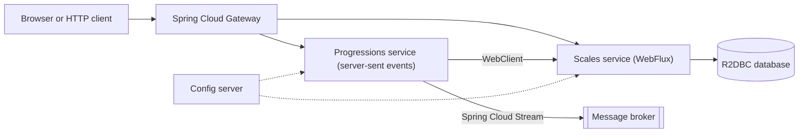

:::note[Versions studied]
[Spring Boot](https://docs.spring.io/spring-boot/) **4.1.1** with [Spring Framework](https://docs.spring.io/spring-framework/reference/) 7.0.9, [Project Reactor](https://projectreactor.io/docs/core/release/reference/) 3.8.7 and the [Spring Cloud](https://spring.io/projects/spring-cloud) **2025.1.3** release train ("Oakwood"), on Java **25**. These are the versions [start.spring.io](https://start.spring.io/) offered by default on 2026-09-14. They are compared with ASP.NET Core on .NET **10**. Every example is in [`code/spring-cloud-reactor`](https://github.com/spareilleux/learn/tree/main/code/spring-cloud-reactor): [`spring-cloud-reactor-examples.yml`](https://github.com/spareilleux/learn/blob/main/.github/workflows/spring-cloud-reactor-examples.yml) runs its tests on Windows, Linux and macOS, compares every output quoted in the lessons, and runs the C# side of each comparison.
:::

## Why I'm learning this

The [Java course](../java-for-csharp/) taught me the language. The Java code I actually meet, though, is rarely plain Java: it is a Spring Boot service, often a reactive one, behind a Spring Cloud gateway. Its annotations do the work that `Program.cs` does explicitly in ASP.NET Core, and its `Mono` and `Flux` look like `Task` and `IAsyncEnumerable` without behaving like them.

I want to read and write those services with the same confidence as an ASP.NET Core application: know where each bean comes from, predict on which thread a pipeline runs, and tell a real design choice from a habit.

## Who this course is for

You are an experienced C# developer. You know ASP.NET Core, its dependency injection, `IOptions`, `IHostedService`, health checks, `HttpClient`, `IAsyncEnumerable`, and probably [Polly](https://www.pollydocs.org/) and [YARP](https://learn.microsoft.com/aspnet/core/fundamentals/servers/yarp/getting-started). You have followed [Java for C# developers](../java-for-csharp/), or you are comfortable with Java 25, Maven and JUnit. This course sends you back to that course's lessons instead of repeating them: [lesson 9](../java-for-csharp/09-concurrency-and-virtual-threads/) for virtual threads, [lesson 10](../java-for-csharp/10-maven-and-gradle-in-depth/) for Maven, [lesson 11](../java-for-csharp/11-testing/) for JUnit, Mockito and BlockHound.

## The running example

The lessons build small services around music theory: a scales service that returns the notes and chords of a mode, a progression stream, a chord chart client. The domain is a plain Java module, [`music`](https://github.com/spareilleux/learn/tree/main/code/spring-cloud-reactor/music), with no Spring and no Reactor in it. By the end of the course, the pieces fit together like this:

Lessons 1 to 4 build the first two boxes on the right; the later lessons add the others. Everything runs on `localhost`, started by the tests, without Docker.

## By the end of this course, I will be able to

- create a Spring Boot application and explain where each of its beans, properties and endpoints comes from;
- map ASP.NET Core's dependency injection, configuration, options and health checks onto Spring's;
- write, test and debug Reactor pipelines, and say on which thread each step runs;
- choose between Spring MVC on virtual threads and WebFlux for a given service;
- build reactive HTTP APIs and clients with WebFlux and `WebClient`;
- put a gateway, centralised configuration, service discovery and resilience in front of those services with Spring Cloud;
- observe and test a set of Spring services the way I would a set of ASP.NET Core services.

## Outline

| # | Lesson | You already know |
|---|---|---|
| 1 | [Spring Boot seen from ASP.NET Core](01-spring-boot-from-aspnet-core/) | `Program.cs`, `IServiceCollection`, `appsettings.json`, `IOptions`, health checks |
| 2 | [Reactor: `Mono` and `Flux`](02-reactor-mono-and-flux/) | `Task`, `IAsyncEnumerable`, LINQ, Rx.NET |
| 3 | [Reactor under the hood](03-reactor-under-the-hood/) | the thread pool, `ConfigureAwait`, channels, Polly, `AsyncLocal` |
| 4 | [WebFlux](04-webflux/) | minimal APIs, `HttpClient`, server-sent events |
| 5 | Reactive data access with R2DBC and Spring Data *(coming next)* | Entity Framework Core, `IAsyncEnumerable` from a `DbContext` |
| 6 | Spring Cloud Gateway | YARP |
| 7 | Centralised configuration with Spring Cloud Config | configuration providers, Azure App Configuration |
| 8 | Service discovery and client-side load balancing | .NET Aspire service discovery, `IHttpClientFactory` |
| 9 | Resilience with Resilience4j and Spring Cloud Circuit Breaker | Polly, `Microsoft.Extensions.Http.Resilience` |
| 10 | Messaging with Spring Cloud Stream | MassTransit, Azure Service Bus clients |
| 11 | Observability with Micrometer | OpenTelemetry for .NET, `dotnet-counters` |
| 12 | Testing a set of Spring services | `WebApplicationFactory`, integration tests |

[Journal](journal/): what I tried, what surprised me, what I still need to verify.

## Resources

- [Spring Boot reference documentation](https://docs.spring.io/spring-boot/reference/) and the [Spring Boot 4.0 migration guide](https://github.com/spring-projects/spring-boot/wiki/Spring-Boot-4.0-Migration-Guide)
- [Spring Framework reference](https://docs.spring.io/spring-framework/reference/): the IoC container, Web MVC and WebFlux
- [Reactor 3 reference guide](https://projectreactor.io/docs/core/release/reference/) and the [`Flux` Javadoc](https://projectreactor.io/docs/core/release/api/reactor/core/publisher/Flux.html), whose marble diagrams are worth reading
- [Spring Cloud](https://spring.io/projects/spring-cloud): release trains and projects
- [Reactive Streams specification](https://github.com/reactive-streams/reactive-streams-jvm/blob/a625d3aba756e9842ad1291a5b73f5db280b6168/README.md), the four interfaces underneath Reactor
- On the .NET side: [ASP.NET Core fundamentals](https://learn.microsoft.com/aspnet/core/fundamentals/), [Reactive Extensions for .NET](https://github.com/dotnet/reactive)
