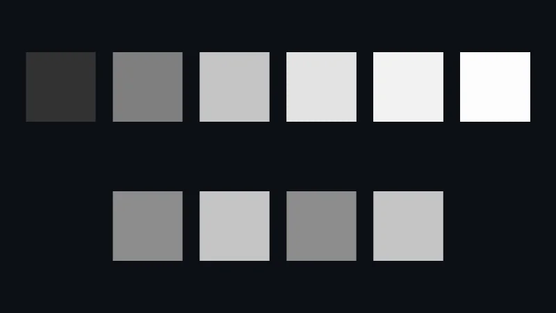

Code: the color patches in [`src/03-color/main.ts`](https://github.com/spareilleux/learn/blob/8e8f303/code/threejs/src/03-color/main.ts), the environment page in [`src/03-environment/main.ts`](https://github.com/spareilleux/learn/blob/8e8f303/code/threejs/src/03-environment/main.ts), and two Node.js scripts: [`scripts/l03-color.ts`](https://github.com/spareilleux/learn/blob/8e8f303/code/threejs/scripts/l03-color.ts) and [`scripts/make-studio-hdr.ts`](https://github.com/spareilleux/learn/blob/8e8f303/code/threejs/scripts/make-studio-hdr.ts).

## Two kinds of numbers

In WPF, `Color.FromRgb(128, 128, 128)` is a gray, and the number goes to the screen as it is. That works for a 2D interface. It fails for lighting: light adds up linearly, two lamps give twice the light, but the bytes of an image don't. A monitor's byte 128 emits about 22 % of the light of byte 255, not 50 %. The [sRGB](https://www.w3.org/Graphics/Color/srgb) encoding spends more of its 256 steps on dark tones, where the eye sees differences, and less on bright ones.

So three.js keeps two kinds of numbers apart:

- **Linear** values, proportional to light. Lighting, blending and tone mapping compute with them. This is the **working color space**, `LinearSRGBColorSpace`, written `srgb-linear`.
- **sRGB** values, the ones in color pickers, CSS, PNG and JPEG images, and the canvas. They are converted to linear on the way in and back to sRGB on the way out.

[`scripts/l03-color.ts`](https://github.com/spareilleux/learn/blob/8e8f303/code/threejs/scripts/l03-color.ts) shows the conversions without a renderer:

```text
$ node scripts/l03-color.ts
working color space: srgb-linear
Color(0x4a2c1d) stores [ 0.0685, 0.0252, 0.0123 ]
getHexString() 4a2c1d | getHexString(LinearSRGBColorSpace) 110603
setRGB(0.5, 0.5, 0.5).getHexString() bcbcbc
setRGB(0.5, 0.5, 0.5, SRGBColorSpace) stores [ 0.214, 0.214, 0.214 ]
new Texture().colorSpace: ""
...
```

- **A hex color is sRGB.** Lesson 2's rosewood, `0x4a2c1d`, has a red byte of 74, which is 0.29 of 255; [`Color`](https://threejs.org/docs/pages/Color.html) stores 0.0685, its linear value. `getHexString()` converts back and gives the hex you wrote; asked for linear values, it gives `110603`.
- **`setRGB` without a color space takes linear values.** `setRGB(0.5, 0.5, 0.5)` is half the light of white, which is `bcbcbc` in sRGB, not `808080`. With `SRGBColorSpace` as fourth argument, the same numbers mean an sRGB gray and are stored as 0.214.
- **A new texture has no color space**, the empty string `NoColorSpace`: its values go to the shader as they are. That is right for data, such as normal, roughness or metalness maps, and wrong for a color image, which needs `texture.colorSpace = THREE.SRGBColorSpace`. [`GLTFLoader`](https://threejs.org/docs/pages/GLTFLoader.html) sets it for the textures of a glTF material (lesson 4); for a texture you create yourself, it is your job.

This is the [color management](https://threejs.org/manual/pages/color-management.html) of the manual, enabled by default since r152 ([migration guide](https://github.com/mrdoob/three.js/wiki/Migration-Guide#151--152)).

## Measuring it

A page of flat patches makes the rules visible. [`MeshBasicMaterial`](https://threejs.org/docs/pages/MeshBasicMaterial.html) ignores lights, so a patch's pixel is its color after the renderer's output conversion. The top row holds linear intensities from 0.05 to 8; the bottom row the same gray given four ways ([`main.ts`, lines 40-56](https://github.com/spareilleux/learn/blob/8e8f303/code/threejs/src/03-color/main.ts#L40-L56)):

```ts
// Linear values, as a light would produce them: 1 is not the brightest a scene can be
[0.05, 0.18, 0.5, 1, 2, 8].forEach((value, i) => {
  const color = new THREE.Color().setRGB(value, value, value, THREE.LinearSRGBColorSpace);
  patch(`linear ${value}`, new THREE.MeshBasicMaterial({ color }), -6.25 + i * 2.5, 2);
});

// A one-pixel texture holding the byte 128, read as sRGB or as raw data
function grayTexture(colorSpace: string) {
  const texture = new THREE.DataTexture(new Uint8Array([128, 128, 128, 255]), 1, 1);
  texture.colorSpace = colorSpace;
  texture.needsUpdate = true;
  return texture;
}
patch('texture 128, SRGBColorSpace', new THREE.MeshBasicMaterial({ map: grayTexture(THREE.SRGBColorSpace) }), -3.75, -2);
patch('texture 128, NoColorSpace', new THREE.MeshBasicMaterial({ map: grayTexture(THREE.NoColorSpace) }), -1.25, -2);
// A hex color is sRGB; setRGB() without a color space takes working-space (linear) values
patch('Color(0x808080)', new THREE.MeshBasicMaterial({ color: new THREE.Color(0x808080) }), 1.25, -2);
patch('setRGB(0.5, 0.5, 0.5)', new THREE.MeshBasicMaterial({ color: new THREE.Color().setRGB(0.5, 0.5, 0.5) }), 3.75, -2);
```

The page reports where each patch's center is on the screen, and [`scripts/probe.mjs`](https://github.com/spareilleux/learn/blob/8e8f303/code/threejs/scripts/probe.mjs) reads those pixels from the screenshot:

```text
$ node scripts/probe.mjs 03-color --query tone=none
{
  ...
  "render": {
    "calls": 6,
    "drawCalls": 11,
    "triangles": 21
  },
  ...
  "tone": "none",
  "pixels": {
    "linear 0.05": "rgb(63, 63, 63)",
    "linear 0.18": "rgb(118, 118, 118)",
    "linear 0.5": "rgb(188, 188, 188)",
    "linear 1": "rgb(255, 255, 255)",
    "linear 2": "rgb(255, 255, 255)",
    "linear 8": "rgb(255, 255, 255)",
    "texture 128, SRGBColorSpace": "rgb(128, 128, 128)",
    "texture 128, NoColorSpace": "rgb(188, 188, 188)",
    "Color(0x808080)": "rgb(128, 128, 128)",
    "setRGB(0.5, 0.5, 0.5)": "rgb(188, 188, 188)"
  }
}
```

- The output conversion turns linear 0.18, the gray of a photographer's gray card, into byte 118, and 0.5 into 188: the bytes `bcbcbc` of the script.
- The texture holding 128 **and marked sRGB** comes out as 128: decoded on the way in, encoded on the way out. The same texture **without a color space** comes out as 188: its 128 was taken for a linear 0.5 and encoded. An image with the wrong color space looks washed out.
- `Color(0x808080)` gives 128 and `setRGB(0.5, 0.5, 0.5)` gives 188, as the script predicted.
- Without tone mapping, **1, 2 and 8 all give 255**: the output clips everything above 1.

## Tone mapping

A real scene holds far more than 0 to 1. A lit wall can be 0.5 and a lamp in the same view 20: the environment of this lesson has exactly those values. Clipping at 1 turns every highlight into flat white. A **tone mapping** curve compresses the high values into the displayable range, like a camera or the eye, before the sRGB encoding. It is set on the renderer, and applies to the whole image:

```ts
renderer.toneMapping = THREE.ACESFilmicToneMapping;
renderer.toneMappingExposure = 1; // the default: a multiplier applied before the curve
```

The same page with the three curves most used today:



| Patch | none | ACES Filmic | AgX | Neutral |
|---|---|---|---|---|
| linear 0.05 | 63 | 50 | 70 | 33 |
| linear 0.18 | 118 | 127 | 128 | 105 |
| linear 0.5 | 188 | 197 | 174 | 181 |
| linear 1 | 255 | 227 | 202 | 240 |
| linear 2 | 255 | 242 | 224 | 250 |
| linear 8 | 255 | 253 | 248 | 254 |
| texture 128, sRGB | 128 | 141 | 136 | 116 |
| texture 128, no color space | 188 | 197 | 175 | 181 |

The values are the red channel of each pixel, from `node scripts/probe.mjs 03-color --query tone=aces`, `tone=agx` and `tone=neutral`, with WebGPU on the author's machine.

- **[ACES Filmic](https://github.com/mrdoob/three.js/blob/r186/src/nodes/display/ToneMappingFunctions.js#L107)** comes from the film industry's color system. It raises the mid-tones (0.18 gives 127 instead of 118), darkens the shadows, and still separates 1, 2 and 8. It also shifts saturated colors, which bright oranges and blues show more than grays.
- **[AgX](https://github.com/mrdoob/three.js/blob/r186/src/nodes/display/ToneMappingFunctions.js#L166)**, from Blender since version 4.0, is the flattest: dark tones brighter, bright tones lower, 8 at 248. Highlights of saturated colors fade toward white instead of changing hue, as film does.
- **[Neutral](https://github.com/mrdoob/three.js/blob/r186/src/nodes/display/ToneMappingFunctions.js#L208)**, the Khronos PBR Neutral curve, leaves the colors below about 0.8 almost unchanged, except for a darker bottom, and compresses only the top. It is meant for product views, where the base color of a material must match its swatch.

Tone mapping is a choice of look, not a correction: the course uses ACES where a scene has strong highlights, as GA does, and would use Neutral to show a guitar's finish true to its color. `WebGLRenderer` draws the same pixels: with `?webgl`, ACES gives the same values as WebGPU on this machine. On the CI runners, which draw with a software rasterizer, a few values differ by one, which is why `check.sh` accepts a difference of two per channel.

`WebGPURenderer` applies tone mapping and the sRGB encoding in the output pass that lesson 1 counted: one more draw call and one more triangle, 11 draw calls and 21 triangles for 10 patches. `WebGLRenderer` applies them in each material's shader instead.

## HDR environments

A studio photo of a guitar isn't lit by two lamps: the walls, the ceiling and the softboxes all reflect into the lacquer. **Image-based lighting** lights a scene from a picture of everything around it, an environment map, instead of light objects. The picture has to hold real light levels, so it is an HDR file, not a PNG.

[`scripts/make-studio-hdr.ts`](https://github.com/spareilleux/learn/blob/8e8f303/code/threejs/scripts/make-studio-hdr.ts) writes such a file instead of downloading a photo: an equirectangular image, the whole sphere unrolled like a world map, 256 by 128 pixels, with dim walls, a warm floor and two softboxes 40 times brighter than the walls. The format is [Radiance RGBE](https://www.graphics.cornell.edu/~bjw/rgbe.html): three 8-bit mantissas that share an 8-bit exponent, so a pixel can hold 20 in 4 bytes ([lines 9-15](https://github.com/spareilleux/learn/blob/8e8f303/code/threejs/scripts/make-studio-hdr.ts#L9-L15)):

```ts
function rgbe([r, g, b]: [number, number, number]): number[] {
  const max = Math.max(r, g, b);
  if (max < 1e-32) return [0, 0, 0, 0];
  const exponent = Math.ceil(Math.log2(max));
  const scale = 255.9999 / 2 ** exponent;
  return [Math.floor(r * scale), Math.floor(g * scale), Math.floor(b * scale), exponent + 128];
}
```

```text
$ node scripts/make-studio-hdr.ts
public/generated/studio.hdr: 256×128, 131174 bytes
$ node scripts/l03-color.ts
...
HDRLoader.parse: {
  width: 256,
  height: 128,
  type: 'HalfFloatType',
  values: 'Uint16Array'
}
a wall texel (0, 20): [ 0.4038, 0.4038, 0.4451 ] | a softbox texel (64, 32): [ 19.9375, 19.9375, 18.9375 ]
```

[`HDRLoader`](https://threejs.org/docs/pages/HDRLoader.html) decodes the file into half floats, 16 bits per channel, which the GPU filters on every platform, and marks the texture `srgb-linear`: HDR values are linear light. The softbox comes back as 19.94 instead of 20: RGBE keeps 8 bits of mantissa, and the 16-bit half float rounds again. `HDRLoader` is the new name of `RGBELoader`, deprecated in r180: the old class still loads, and warns `RGBELoader has been deprecated. Please use HDRLoader instead.` ([`RGBELoader.js`](https://github.com/mrdoob/three.js/blob/r186/examples/jsm/loaders/RGBELoader.js)).

The page uses the file as both the environment and the background, with no light object at all ([`main.ts`, lines 15-31](https://github.com/spareilleux/learn/blob/8e8f303/code/threejs/src/03-environment/main.ts#L15-L31)):

```ts
const environment = await new HDRLoader().loadAsync('generated/studio.hdr');
environment.mapping = THREE.EquirectangularReflectionMapping;
scene.environment = environment;
scene.background = environment;
scene.backgroundBlurriness = 0.4;

// Rows: a dielectric (metalness 0) and a metal (metalness 1). Columns: roughness from 0 to 1.
const sphere = new THREE.SphereGeometry(0.45, 64, 32);
for (const [row, metalness] of [0, 1].entries()) {
  for (let column = 0; column < 5; column++) {
    const material = new THREE.MeshStandardMaterial({ color: 0xd4a373, metalness, roughness: column / 4 });
    const mesh = new THREE.Mesh(sphere, material);
    mesh.position.set((column - 2) * 1.2, 0.6 - row * 1.2, 0);
    scene.add(mesh);
  }
}
```


Lesson 2's rules show on every sphere. The dielectrics of the top row keep their tan color and reflect the softbox in white; the metals of the bottom row have no diffuse color, and tint the reflection, which is sharp at roughness 0 and spread over the whole sphere at roughness 1.

### PMREM: what the renderer does with the environment

A rough surface reflects a blurred environment, so the renderer needs the environment already blurred at several levels of roughness. It builds a **PMREM** (prefiltered, mipmapped radiance environment map) from any equirectangular or cube texture given to `scene.environment` or to a material's `envMap`, without being asked: `WebGPURenderer` wraps the texture in a PMREM node ([`EnvironmentNode.js`, line 64](https://github.com/mrdoob/three.js/blob/r186/src/nodes/lighting/EnvironmentNode.js#L50-L70)), and `WebGLRenderer` does the same in [`WebGLEnvironments.js`](https://github.com/mrdoob/three.js/blob/r186/src/renderers/webgl/WebGLEnvironments.js#L32). The counters show the work:

```text
$ node scripts/probe.mjs 03-environment
{
  "backend": "WebGPU",
  "gpu": "nvidia, blackwell",
  "frame": 4,
  "render": {
    "calls": 23,
    "drawCalls": 12,
    "triangles": 41665
  },
  "memory": {
    "geometries": 12,
    "textures": 6,
    "programs": 10
  },
  "environment": {
    "width": 256,
    "height": 128,
    "halfFloat": true,
    "colorSpace": "srgb-linear"
  }
}
```

- **23 calls** for 3 frames, where the patches page had 6. The frames account for 6: the scene and the output pass. The other 17 are the PMREM, built once during the first frame. [`PMREMGenerator.js`](https://github.com/mrdoob/three.js/blob/r186/src/renderers/common/extras/PMREMGenerator.js#L346-L363) sizes the cube faces at a quarter of the image's width, 64 pixels, which gives 9 levels of roughness ([`_createPlanes`, line 747](https://github.com/mrdoob/three.js/blob/r186/src/renderers/common/extras/PMREMGenerator.js#L740-L760)). It draws the image into the first level (1 render), then filters each of the 8 others from the previous one, with a render into a temporary target and a copy back ([lines 590-667](https://github.com/mrdoob/three.js/blob/r186/src/renderers/common/extras/PMREMGenerator.js#L590-L667)): 1 + 8 × 2 = 17.
- **12 draw calls**: 10 spheres, the background and the output pass. The spheres share one geometry, 64 by 32 segments, which is 2 × 64 × 32 − 2 × 64 = 3,968 triangles each. The background is a sphere of its own, 32 by 32 segments ([`Background.js`, line 131](https://github.com/mrdoob/three.js/blob/r186/src/renderers/common/Background.js#L131)): 1,984 triangles. 39,680 + 1,984 + 1 = 41,665.
- `backgroundBlurriness` reads the background from a blurrier level of the same PMREM, so it costs no extra texture.

A larger HDR file costs more PMREM work at load time, not per frame: a 2K environment gives 512-pixel faces and more levels. A scene that changes environment often should keep its textures and reuse them, since the PMREM is cached per texture.

## In GuitarAlchemist/ga

GA's fretboard at [`05c8eda`](https://github.com/GuitarAlchemist/ga/blob/05c8eda013f2a4d11efaa52c4ca94674521ee684/ReactComponents/ga-react-components/src/components/ThreeFretboard.tsx#L236-L268) already uses ACES and an environment. It draws the environment on a canvas, a vertical gray gradient, instead of loading an HDR file:

```tsx
      const envTexture = new THREE.CanvasTexture(envCanvas);
      envTexture.mapping = THREE.EquirectangularReflectionMapping;
      envTexture.colorSpace = THREE.SRGBColorSpace;

      // Apply environment map directly (no PMREM for performance)
      scene.environment = envTexture;
```

What this lesson's measurements say about it:

- **The PMREM happens anyway.** The comments above that code say PMREM is skipped for WebGPU, to avoid warnings and for performance. Since the renderer builds a PMREM for any equirectangular `scene.environment`, as the 17 extra calls above show, assigning the texture directly doesn't skip it; it only moves it to the first frame. Whether r180, GA's version, prints the warnings the comment mentions is *to verify*.
- **An 8-bit gradient has no highlights.** A canvas holds bytes: the brightest part of the gradient, `#e0e0e0`, is a linear 0.75, below the 0.5 to 20 range of a studio with softboxes. The metallic strings and frets reflect a gray ceiling, and `toneMappingExposure = 1.2` brightens the whole image, not the highlights. An HDR environment, even a generated one like this lesson's, would give the metal real highlights.
- **The wood texture has no color space.** `createWoodTexture` ([lines 563-654](https://github.com/GuitarAlchemist/ga/blob/05c8eda013f2a4d11efaa52c4ca94674521ee684/ReactComponents/ga-react-components/src/components/ThreeFretboard.tsx#L563-L654)) paints the wood in `#4a3525` on a canvas and returns a `CanvasTexture` without setting `colorSpace`, and the material uses it as `map` (lesson 2). The measurement above predicts the result: the red byte 74 is taken for a linear 0.29, and shown as 147 before lighting, where `SRGBColorSpace` would keep it at 74. The fretboard is lighter and grayer than the color written in the code, which the material's `color` may have been tuned to hide (*to verify* in a browser).
- `Guitar3D.tsx` builds its environment with `pmremGenerator.fromScene` on a scene that holds only an `AmbientLight` ([lines 171-187](https://github.com/GuitarAlchemist/ga/blob/05c8eda013f2a4d11efaa52c4ca94674521ee684/ReactComponents/ga-react-components/src/components/Guitar3D/Guitar3D.tsx#L171-L187)). A light with nothing to light renders nothing: the environment is black, and glTF models loaded into that component get no reflections from it.

## Key takeaways

- The working color space is linear; hex colors and images are sRGB, and three.js converts on the way in and out.
- `setRGB` takes linear values unless given a color space; a texture you create needs `colorSpace = SRGBColorSpace` when it holds colors, and nothing when it holds data.
- Without tone mapping, everything above 1 is white. ACES Filmic, AgX and Neutral compress highlights differently; the choice is a look.
- `WebGPURenderer` applies tone mapping and the sRGB encoding in its output pass.
- HDR environments light a scene with real light levels; the renderer turns them into a PMREM once, at a cost that `renderer.info` shows.

## Exercises

1. A texture holds a pixel with the bytes (200, 100, 50) and has `NoColorSpace`. With no tone mapping and a `MeshBasicMaterial`, will the red channel on the screen be above or below 200? What about green?
2. What does `new THREE.Color('#808080').getHexString(THREE.LinearSRGBColorSpace)` return? Predict, then check both answers with [`scripts/l03-exercises.ts`](https://github.com/spareilleux/learn/blob/8e8f303/code/threejs/scripts/l03-exercises.ts).
3. With AgX, linear 1 gives 202. Which `toneMappingExposure` would you try to make it close to 240, the value Neutral gives, and what happens to linear 0.05? The page takes an `?exposure=` parameter: check with `node scripts/probe.mjs 03-color --query "tone=agx&exposure=2"`, then 4.

<details>
<summary>Solution 1</summary>

```text
$ node scripts/l03-exercises.ts
bytes [ 200, 100, 50 ] with NoColorSpace are shown as [ 229, 168, 122 ]
Color('#808080').getHexString(LinearSRGBColorSpace): 373737
```

Both above. Without a color space, the bytes are taken as linear values, 200/255 = 0.784 and 100/255 = 0.392, and the output encodes them to sRGB. The encoding raises every value between 0 and 1, and dark ones the most: red becomes 229 and green 168. The row "texture 128, no color space" measured the same effect: 128 became 188. The image looks brighter and less saturated than it is.

</details>

<details>
<summary>Solution 2</summary>

`373737`, as the output of solution 1 shows. `#808080` is sRGB 0.502, stored as linear 0.2158, and 0.2158 × 255 = 55, which is `37` in hex. It is the same conversion as the rosewood's `110603` in the script's output: asking for the linear hex shows what the shader receives.

</details>

<details>
<summary>Solution 3</summary>

```text
$ node scripts/probe.mjs 03-color --query "tone=agx&exposure=2"
{
  ...
  "tone": "agx",
  "exposure": 2,
  "pixels": {
    "linear 0.05": "rgb(100, 100, 100)",
    "linear 0.18": "rgb(160, 160, 160)",
    "linear 0.5": "rgb(202, 202, 202)",
    "linear 1": "rgb(224, 224, 224)",
    "linear 2": "rgb(239, 239, 239)",
    "linear 8": "rgb(254, 254, 254)",
    ...
  }
}
$ node scripts/probe.mjs 03-color --query "tone=agx&exposure=4"
{
  ...
  "pixels": {
    "linear 0.05": "rgb(133, 133, 133)",
    "linear 0.18": "rgb(189, 189, 189)",
    "linear 0.5": "rgb(224, 224, 224)",
    "linear 1": "rgb(239, 239, 239)",
    "linear 2": "rgb(248, 248, 248)",
    "linear 8": "rgb(255, 255, 255)",
    ...
  }
}
```

An exposure of 4 brings linear 1 to 239. Exposure multiplies the linear values before the curve, so each patch moves along the same AgX curve: with exposure 2, linear 1 gives 224, the value linear 2 had with exposure 1, and linear 0.5 gives 202, the old value of linear 1. Everything else moves too: linear 0.05 goes from 70 to 133, and the whole image is much brighter, where Neutral kept 0.05 at 33. Exposure can't turn AgX into Neutral: the shape of the curve stays.

</details>

## Sources

- three.js manual: [Color management](https://threejs.org/manual/pages/color-management.html)
- three.js documentation: [`Color`](https://threejs.org/docs/pages/Color.html), [`Texture.colorSpace`](https://threejs.org/docs/pages/Texture.html#colorSpace), [`Renderer.toneMapping`](https://threejs.org/docs/pages/Renderer.html#toneMapping), [`HDRLoader`](https://threejs.org/docs/pages/HDRLoader.html), [`PMREMGenerator`](https://threejs.org/docs/pages/PMREMGenerator.html)
- three.js source at r186: [`ToneMappingFunctions.js`](https://github.com/mrdoob/three.js/blob/r186/src/nodes/display/ToneMappingFunctions.js), [`PMREMGenerator.js`](https://github.com/mrdoob/three.js/blob/r186/src/renderers/common/extras/PMREMGenerator.js), [`EnvironmentNode.js`](https://github.com/mrdoob/three.js/blob/r186/src/nodes/lighting/EnvironmentNode.js)
- W3C: [sRGB](https://www.w3.org/Graphics/Color/srgb); Khronos: [PBR Neutral tone mapper](https://github.com/KhronosGroup/ToneMapping/tree/main/PBR_Neutral)
- Blender manual: [AgX view transform](https://docs.blender.org/manual/en/latest/render/color_management/index.html)
- Greg Ward: [the RGBE format](https://www.graphics.cornell.edu/~bjw/rgbe.html)
