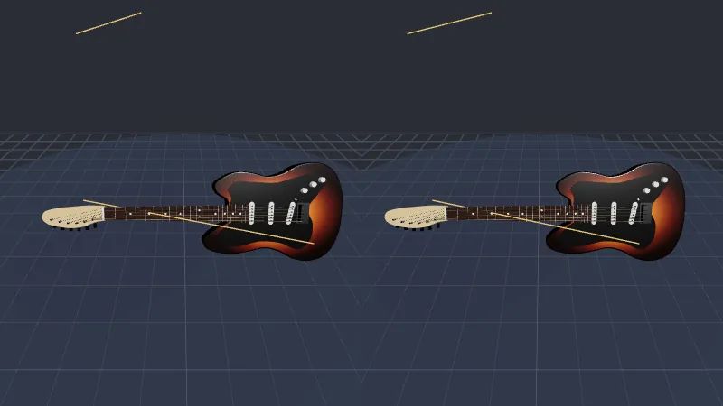

Code: the page in [`src/11-xr/main.ts`](https://github.com/spareilleux/learn/blob/eeca669/code/threejs/src/11-xr/main.ts).

:::caution[Without a headset]
Everything in this lesson ran in headless Chromium, with a Meta Quest 3 emulated by [IWER](https://github.com/meta-quest/immersive-web-emulation-runtime). What it checks is three.js's side of WebXR: sessions, eyes, poses, controllers and events. What a real headset adds, the compositor, the frame rate, the lenses and the GPU, is *to verify* on a device.
:::

## WebXR in one table

The [WebXR Device API](https://www.w3.org/TR/webxr/) is the browser's access to headsets and phones in AR or VR. If you have used [OpenXR](https://www.khronos.org/openxr/), the C API behind Windows Mixed Reality, SteamVR and the Quest's native apps, the concepts map closely; WebXR is its browser counterpart, and Chromium implements it on top of OpenXR on Windows.

| | OpenXR | WebXR | three.js |
|---|---|---|---|
| Is there a device? | `xrGetSystem` | `navigator.xr.isSessionSupported('immersive-vr')` | `VRButton` checks it and shows the button |
| Start | `xrCreateSession` | `navigator.xr.requestSession(mode, features)`, from a user gesture | `renderer.xr.setSession(session)` |
| Coordinate systems | reference spaces: `VIEW`, `LOCAL`, `STAGE` | `viewer`, `local`, `local-floor`, `bounded-floor`, `unbounded` | `renderer.xr.setReferenceSpaceType('local-floor')`, the default |
| Frame loop | `xrWaitFrame`, `xrBeginFrame`, `xrEndFrame` | `session.requestAnimationFrame` | `renderer.setAnimationLoop`, which switches to the session's loop |
| Eyes | views from `xrLocateViews` | `frame.getViewerPose(space).views` | an `ArrayCamera` with one camera per eye |
| Where to draw | swapchains | `XRWebGLLayer` or WebXR Layers; `XRGPUBinding` for WebGPU, in progress | the renderer's XR render target |
| Controllers | actions bound to paths | `session.inputSources`, `select` and `squeeze` events, a `Gamepad` | `renderer.xr.getController(i)`, an `Object3D` that follows the controller |

`setAnimationLoop` is the reason lesson 1 prefers it to `requestAnimationFrame`: in a session, the window's `requestAnimationFrame` stops firing, and the headset drives the frames at its own rate, 72, 90 or 120 Hz. A loop written with `setAnimationLoop` keeps running, unchanged.

## Emulating a Quest 3

Headless Chromium has a `navigator.xr`, but no device behind it: `isSessionSupported('immersive-vr')` answers `false`. [IWER](https://www.npmjs.com/package/iwer) 2.4.0, Meta's Immersive Web Emulation Runtime, replaces `navigator.xr` with a JavaScript implementation whose headset and controllers are moved by code: the same runtime as the [Immersive Web Emulator](https://github.com/meta-quest/immersive-web-emulator) browser extension. The page installs it before creating the renderer ([lines 25-38](https://github.com/spareilleux/learn/blob/eeca669/code/threejs/src/11-xr/main.ts#L25-L38)):

```ts
// The emulated headset must be installed before the renderer: XRManager checks for XRWebGLBinding in its constructor
let device: XRDevice | null = null;
if (params.get('device') !== 'none') {
  device = new XRDevice(metaQuest3);
  // Chromium already has a navigator.xr, with no device behind it: IWER leaves it alone unless forced
  device.installRuntime({ forceInstall: true, polyfillLayers: params.has('layers') });
  // IWER draws one view on the page unless stereo is on: then the left and right eyes share the canvas
  device.stereoEnabled = true;
  device.position.set(-0.2, 1.6, 0.9);
  // Looking down at the fretboard, 40° below the horizon
  const look = new THREE.Quaternion().setFromAxisAngle(new THREE.Vector3(1, 0, 0), (-40 * Math.PI) / 180);
  device.quaternion.set(look.x, look.y, look.z, look.w);
  result.emulated = { device: device.name, immersiveVR: await navigator.xr!.isSessionSupported('immersive-vr') };
}
```

Two things took a failed run each to find. Without `forceInstall`, IWER sees Chromium's `navigator.xr` and leaves it in place, and no session starts. Without `stereoEnabled`, IWER renders one view: the right eye's viewport is 0 pixels wide.

## The session and the controllers

In a session, units are meters and, with `local-floor`, y = 0 is the floor. The page puts lesson 5's fretboard, scaled to a quarter, on a virtual table 0.8 m high. A real page requests the session from a click, often through three.js's [`VRButton`](https://github.com/mrdoob/three.js/blob/r186/examples/jsm/webxr/VRButton.js), since browsers require a user gesture; IWER doesn't, so the probe calls `requestSession` directly ([lines 131-143](https://github.com/spareilleux/learn/blob/eeca669/code/threejs/src/11-xr/main.ts#L131-L143)).

`renderer.xr.getController(i)` returns an `Object3D` that three.js moves to the pose of the session's *i*-th input source on every frame. Its index is not a hand: the `connected` event says which one it is. A `select` event, the trigger, becomes a ray from the controller with `Raycaster.setFromXRController`, and lesson 5's `fretAt` and `stringAt`, in the board's own coordinates ([lines 85-99](https://github.com/spareilleux/learn/blob/eeca669/code/threejs/src/11-xr/main.ts#L85-L99)):

```ts
for (const index of [0, 1]) {
  const controller = renderer.xr.getController(index);
  scene.add(controller);
  controller.addEventListener('connected', (event) => (controller.userData.handedness = (event.data as XRInputSource).handedness));
  controller.addEventListener('select', () => {
    raycaster.setFromXRController(controller as THREE.XRTargetRaySpace);
    const [hit] = raycaster.intersectObject(board, true);
    const hand = controller.userData.handedness;
    if (!hit) return void picks.push({ controller: index, hand, hit: null });
    const local = board.worldToLocal(hit.point.clone());
    const fret = fretAt(local.x);
    const string = stringAt(local.z);
    picks.push({ controller: index, hand, object: hit.object.name, fret, string, note: fret === null ? null : noteName(string, fret) });
  });
}
```

The probe then aims IWER's right controller at string 3, fret 5, and pulls its trigger: `updateButtonValue('trigger', 1)`, then `0`, which IWER turns into the session's `select` events ([lines 161-178](https://github.com/spareilleux/learn/blob/eeca669/code/threejs/src/11-xr/main.ts#L161-L178)).

## With the classic WebGLRenderer

`?classic` draws with `WebGLRenderer` from `three`, the renderer three.js's WebXR examples were written for:

```text
$ node scripts/probe.mjs 11-xr --query classic
{
  "native": {
    "navigatorXR": true,
    "immersiveVR": false,
    "XRGPUBinding": false
  },
  "emulated": {
    "device": "Meta Quest 3",
    "immersiveVR": true
  },
  "rendererBeforeSession": "WebGLRenderer",
  "session": {
    "mode": "immersive-vr",
    "enabledFeatures": [
      "local-floor",
      "viewer",
      "local"
    ]
  },
  "presenting": true,
  "rendererInSession": "WebGLRenderer",
  "frames": [
    {
      "eyes": 2,
      "eyeDistanceMm": 63,
      "viewport": [
        [0, 0, 400, 450],
        [400, 0, 400, 450]
      ],
      "calls": 38,
      "triangles": 1560
    }
  ],
  "picks": [
    {
      "controller": 1,
      "hand": "right",
      "object": "neck",
      "fret": 5,
      "string": 3,
      "note": "C4"
    }
  ],
  "inputSources": 2,
  "errors": [],
  "after": {
    "in the session": {
      "presenting": true
    },
    "end the session": {
      "presenting": false
    }
  }
}
```

- The session was granted with `local-floor`, and `viewer` and `local`, which every immersive session has.
- Two eyes, 63 mm apart, IWER's default interpupillary distance, each drawn into half of the 800 × 450 canvas.
- 38 draw calls and 1,560 triangles: the fretboard's 19 meshes and 780 triangles, drawn once per eye. `WebGLRenderer` renders the scene twice; multiview, which draws both eyes in one pass, needs the `OVR_multiview2` extension and a headset browser that offers it (*to verify* on a Quest).
- The trigger on controller 1, the right hand, picked string 3, fret 5: C4, the note lesson 5 found with the mouse.
- `session.end()` stopped the presentation.

The screenshot, taken during the session, shows what IWER composites to the page: the left eye, then the right one, each seeing the fretboard from its own position.


[Open full screen](../../threejs-demos/demos/xr.html?emulate). **Try it**: this page shows nothing without the probe; the [live demo](#live-demo-the-guitar-in-vr) at the end of the lesson enters the same emulated session with a button, and answers exercises 1 and 3.

## With WebGPURenderer

The default page uses `WebGPURenderer`:

```text
$ node scripts/probe.mjs 11-xr
{
  ...
  "rendererBeforeSession": "WebGPURenderer, WebGPU",
  "session": {
    "mode": "immersive-vr",
    "enabledFeatures": [
      "local-floor",
      "viewer",
      "local"
    ]
  },
  "errors": [
    "Error: THREE.XRManager: WebGPU XR sessions require the \"webgpu\" session feature. Use VRButtonGPU/XRButton with \"webgpu\" enabled or use a WebGL backend."
  ]
}
```

In r186, the WebGPU backend draws into a WebXR session only through [`XRGPUBinding`](https://github.com/immersive-web/WebXR-WebGPU-Binding/blob/main/explainer.md), from the WebXR/WebGPU binding proposal, and only in a session requested with the `webgpu` feature ([`XRManager.js`, lines 739-749](https://github.com/mrdoob/three.js/blob/r186/src/renderers/common/XRManager.js#L739-L749), called from `setSession` at [line 1211](https://github.com/mrdoob/three.js/blob/r186/src/renderers/common/XRManager.js#L1211)). Headless Chromium has no `XRGPUBinding`, and IWER doesn't emulate one. Two details of the message don't match r186: there is no `VRButtonGPU` in `examples/jsm/webxr/`, and `XRButton.js` doesn't request a `webgpu` feature. Which browsers and headsets offer `XRGPUBinding` in September 2026 is *to verify*.

### The WebGL 2 backend

On a machine without WebGPU, or with `--webgl`, `WebGPURenderer` uses its WebGL 2 backend, which the message calls the way out. With IWER, the session starts, but every frame throws:

```text
$ node scripts/probe.mjs 11-xr --webgl
  ...
  "rendererInSession": "WebGPURenderer, WebGL 2",
  "frames": [
    {
      "eyes": 2,
      "eyeDistanceMm": 63,
      "viewport": [
        [0, 0, 400, 450],
        [400, 0, 400, 450]
      ],
      "calls": 4,
      "triangles": 780
    }
  ],
  ...
  "errors": [
    "TypeError: Invalid value used as weak map key"
  ]
```

IWER's `XRWebGLLayer.framebuffer` returns `null` ([`XRWebGLLayer.js`, lines 44-46, in the published package](https://unpkg.com/iwer@2.4.0/lib/layers/XRWebGLLayer.js)): IWER draws into the page's own canvas, whose framebuffer WebGL represents as `null`, as the WebXR specification does for inline sessions, which draw to the page. The WebGL backend keeps that value as its XR target ([`WebGLBackend.js`, lines 365-367](https://github.com/mrdoob/three.js/blob/r186/src/renderers/webgl-fallback/WebGLBackend.js#L365-L367)), and `WebGLState.drawBuffers` uses the framebuffer as a key in a `WeakMap` ([`WebGLState.js`, lines 1149-1164](https://github.com/mrdoob/three.js/blob/r186/src/renderers/webgl-fallback/utils/WebGLState.js#L1149-L1164)), which refuses `null`. `WebGLRenderer` binds `null` as the default framebuffer, and works. On a real headset, the layer's framebuffer is an opaque framebuffer, not `null`, so this failure belongs to the combination of the emulator and the WebGL backend, not to headsets (*to verify* on a Quest).

The first version of this page didn't catch the exception: the frames stopped, the probe waited for them, and the run hung until it was stopped by hand, holding the machine's GPU lock for ten minutes. The page now catches render errors, keeps each message once, and gives up waiting for frames after 5 seconds; [`probe.mjs`](https://github.com/spareilleux/learn/blob/eeca669/code/threejs/scripts/probe.mjs) also exits on its own after twice its timeout.

### The WebGL fallback addon

r186 adds [`WebGLXRFallback.js`](https://github.com/mrdoob/three.js/blob/r186/examples/jsm/webxr/WebGLXRFallback.js): it wraps `renderer.xr.setSession`, and when a session starts on the WebGPU backend without `XRGPUBinding`, it creates a second renderer with a WebGL backend, moves the animation loop and the XR settings to it, and lets the page swap the canvases ([lines 21-69](https://github.com/mrdoob/three.js/blob/r186/examples/jsm/webxr/WebGLXRFallback.js#L21-L69)). `?fallback` installs it:

```text
$ node scripts/probe.mjs 11-xr --query fallback
  ...
  "fallback": "switched to WebGPURenderer, WebGL 2",
  "presenting": true,
  "rendererInSession": "WebGPURenderer, WebGL 2",
  ...
  "picks": [],
  "inputSources": 2,
  "errors": [
    "TypeError: Invalid value used as weak map key"
  ],
```

The switch worked, and ran into the same `null` framebuffer. It shows something else: `picks` is empty. The controllers came from the first renderer's `renderer.xr.getController`, and the fallback renderer has its own `XRManager`, which moves its own controllers. The addon copies the loop and the settings, not the objects the page already took from `renderer.xr`: a page that uses it must get its controllers again in `onFallback`.

`check.sh` compares the four runs. On the Linux and Windows runners, which have no WebGPU, the default page and `?fallback` start on the WebGL 2 backend directly, and their outputs come from `expected/l11_probe_webgpu.webgl.txt` and `expected/l11_probe_fallback.webgl.txt`, generated with `chromium-headless-shell`.

## What a headless browser can't check

- **The frame rate.** A Quest 3 runs at 72, 90 or 120 Hz, and a missed frame is felt, not seen. The CPU time per frame from lesson 8, doubled for two eyes, is where to start; the headset's own performance overlay is where to finish (*to verify*).
- **Foveated rendering and the framebuffer scale.** `renderer.xr.setFoveation` and `setFramebufferScaleFactor` change what the headset's compositor does; IWER accepts them and draws the same pixels.
- **Hand tracking**, which IWER emulates with poses, and **AR** passthrough, hit tests and anchors, which the course doesn't cover.
- **Comfort.** The fretboard 0.8 m high, 0.9 m from the eyes, at a quarter scale, was chosen on paper.

## In GuitarAlchemist/ga

GA has no WebXR code at commit `05c8eda`: no `renderer.xr`, no `VRButton`, no `navigator.xr`. The only mention is a Claude skill file, `.claude/skills/three-best-practices/rules/webxr-setup.md`, written for agents, not used by the app. A VR mode for the fretboard would start from `ThreeFretboard.tsx`'s `WebGPURenderer`, which, as this lesson found, can't enter a session in r186 without `XRGPUBinding`: the fallback addon or a `WebGLRenderer` would be the first step.

## Live demo: the guitar in VR

Exercises 1 and 3 on a whole guitar: the classic `WebGLRenderer`, the one this lesson saw render both eyes with IWER, a `VRButton`, and a `select` handler that takes the controller's ray into the guitar's own coordinates, finds the string and the fret as lesson 5's guitar does, plays the note and sends a 40 ms haptic pulse. IWER is imported only with `?emulate`, so a real headset downloads nothing of it. The page ignores `resize` during a session: `WebGLRenderer` refuses to change its size while presenting, and warns. Its probe enters an emulated session, aims the right controller at string 3, fret 5, pulls the trigger and reads `string 3, fret 5: C4`, with 2 eyes and no error. The [source](https://github.com/spareilleux/learn/tree/f68e710/code/threejs/demos/xr) is in `code/threejs/demos/xr`.



<details>
<summary>Live page: run it here</summary>

<iframe src="../../threejs-demos/demos/xr.html?emulate" title="The guitar in VR" loading="lazy" width="100%" height="420" allow="fullscreen; autoplay; xr-spatial-tracking" style={{ border: 0, display: "block", height: "min(420px, 70vh)" }}></iframe>

</details>

[Open full screen](../../threejs-demos/demos/xr.html?emulate). **Try it**: press *Enter VR*: the emulated right controller then plays a C major arpeggio by itself. With a headset, open the page without `?emulate` in its browser, point at the neck and pull the trigger; *to verify*, the author has no headset.

## GA experiment

Lesson 14's [experiment 12](../14-guitar-alchemist-lab/#12-webxr-at-11) puts a real-size neck in an emulated Quest 3: two views 63 mm apart, and the nut-to-12th-fret distance as measured. How it feels in the hand, and IWER's 25 mm head offset, are *to verify* on a headset.

## Key takeaways

- WebXR gives the page a session, reference spaces in meters, one camera per eye, and input sources; three.js wraps them in `renderer.xr`, `setAnimationLoop` and `getController`.
- IWER emulates a Quest 3 in a headless browser: sessions, stereo views, controller poses and triggers can be tested in CI.
- In r186, `WebGPURenderer` enters a WebXR session on WebGPU only with `XRGPUBinding` and the `webgpu` feature; otherwise it throws.
- The WebGL fallback addon swaps renderers, but not the controllers the page already holds.
- With IWER, only the classic `WebGLRenderer` rendered: the WebGL 2 backend doesn't accept a `null` layer framebuffer.
- Put a hard timeout on anything that waits for frames: an XR session that stops producing them waits forever.

## Exercises

1. Add a `VRButton` to the `?classic` page, so that a real headset's browser can enter the session. What must the page not do, now that the session is no longer started by the probe?
2. In the `?fallback` page, get the controllers from the new renderer inside `onFallback`, and move their `select` listeners there. What should `picks` show then, and why would it still fail with IWER?
3. Make the trigger play the note: list what the `select` handler needs, and what the headset changes compared with a mouse click.

<details>
<summary>Solution 1</summary>

```ts
import { VRButton } from 'three/addons/webxr/VRButton.js';

document.body.append(VRButton.createButton(renderer));
```

`VRButton` checks `isSessionSupported('immersive-vr')`, shows "ENTER VR" or "VR NOT SUPPORTED", and requests the session with `local-floor`, `bounded-floor` and `layers` as optional features when clicked ([`VRButton.js`, lines 68-74](https://github.com/mrdoob/three.js/blob/r186/examples/jsm/webxr/VRButton.js#L68-L74)), which is the user gesture browsers require. The page must no longer call `requestSession` itself, or the click would fail with a session already running: keep `startSession` for the probe only. The page's `if (probing)` block already does that. Not run on a headset (*to verify*).

</details>

<details>
<summary>Solution 2</summary>

`onFallback(fallback, previous)` receives the new renderer: call `fallback.xr.getController(0)` and `(1)` there, add them to the scene, and attach the `connected` and `select` listeners, the same loop as before, turned into a function that takes the renderer. With IWER, `picks` should then hold the C4 pick, since the ray is computed on the CPU from the controller's pose, which the fallback renderer's `XRManager` updates. But every frame still throws on the `null` framebuffer before the scene is drawn, and whether the controllers' poses are updated before that exception is *to verify*: in `XRManager`, the controllers are updated in the XR animation frame, before the loop's callback that throws ([`XRManager.js`, lines 1991-1997](https://github.com/mrdoob/three.js/blob/r186/src/renderers/common/XRManager.js#L1991-L1997)), so they probably are.

</details>

<details>
<summary>Solution 3</summary>

The handler needs the note (it has it), a sound, and a way to play it: the Web Audio API with an `AudioContext` created or resumed from a user gesture, which entering the session provides. Compared with a click: the trigger is analog, and `inputSource.gamepad.buttons[0].value` gives how hard it is pressed, a natural velocity; `inputSource.gamepad.hapticActuators` can pulse the controller on the note; and the sound can be positioned at the string with a `PannerNode`, or three.js's `PositionalAudio`, attached to the fretboard, so it comes from where the string is. A design, not code run (*to verify*).

</details>

## Sources

- W3C: [WebXR Device API](https://www.w3.org/TR/webxr/), [WebXR Gamepads Module](https://www.w3.org/TR/webxr-gamepads-module-1/); Immersive Web Community Group: [WebXR/WebGPU binding explainer](https://github.com/immersive-web/WebXR-WebGPU-Binding/blob/main/explainer.md)
- MDN: [WebXR Device API](https://developer.mozilla.org/docs/Web/API/WebXR_Device_API)
- three.js source at r186: [`XRManager.js`](https://github.com/mrdoob/three.js/blob/r186/src/renderers/common/XRManager.js), [`WebGLXRFallback.js`](https://github.com/mrdoob/three.js/blob/r186/examples/jsm/webxr/WebGLXRFallback.js), [`VRButton.js`](https://github.com/mrdoob/three.js/blob/r186/examples/jsm/webxr/VRButton.js), [`WebGLBackend.js`](https://github.com/mrdoob/three.js/blob/r186/src/renderers/webgl-fallback/WebGLBackend.js), [`WebGLState.js`](https://github.com/mrdoob/three.js/blob/r186/src/renderers/webgl-fallback/utils/WebGLState.js)
- Meta: [IWER](https://github.com/meta-quest/immersive-web-emulation-runtime), [Immersive Web Emulator](https://github.com/meta-quest/immersive-web-emulator)
- Khronos: [OpenXR](https://www.khronos.org/openxr/)
