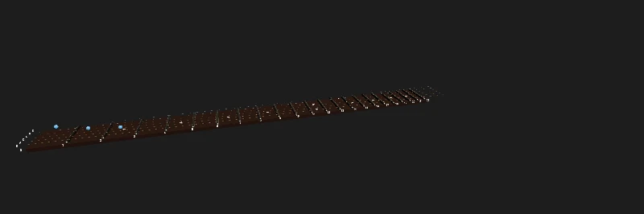

Code: GA's measurements in [`src/13-fretboard/guitar.ts`](https://github.com/spareilleux/learn/blob/eeca669/code/threejs/src/13-fretboard/guitar.ts), GA's structure in [`GaFretboard.tsx`](https://github.com/spareilleux/learn/blob/eeca669/code/threejs/src/13-fretboard/GaFretboard.tsx), the port in [`Fretboard3D.tsx`](https://github.com/spareilleux/learn/blob/eeca669/code/threejs/src/13-fretboard/Fretboard3D.tsx), and the page that measures both in [`main.tsx`](https://github.com/spareilleux/learn/blob/eeca669/code/threejs/src/13-fretboard/main.tsx).

## The component

[`ThreeFretboard.tsx`](https://github.com/GuitarAlchemist/ga/blob/05c8eda013f2a4d11efaa52c4ca94674521ee684/ReactComponents/ga-react-components/src/components/ThreeFretboard.tsx) is GuitarAlchemist's 3D guitar neck: 1,372 lines of React and three.js at commit `05c8eda`, without React Three Fiber. A `useEffect` creates a `WebGPURenderer`, builds a scene of a fretboard, frets, inlays, strings, sprite labels and note markers, and runs an animation loop; its props are the positions to mark and a `config` object with the fret count, tuning, guitar model, capo and sizes. Lessons 1 to 8 quoted it for one point at a time. This lesson reproduces it whole, measures it, and ports it.

The reproduction, [`GaFretboard.tsx`](https://github.com/spareilleux/learn/blob/eeca669/code/threejs/src/13-fretboard/GaFretboard.tsx), is condensed: the same objects per fret, inlay, string, label and marker, the same effect dependencies, cleanup and pixel ratio, with comments pointing to GA's line numbers. It leaves out the wood and string textures, the neck's back, the nut, the capo, the marker labels and most lights, so its counts are a lower bound of GA's. Both versions share GA's measurements from [`guitar.ts`](https://github.com/spareilleux/learn/blob/eeca669/code/threejs/src/13-fretboard/guitar.ts): a 648 mm scale, a 42 mm nut, 22 frets, one unit for 10 mm, and GA's fret formula. The page renders them in the same 3:1 area as GA's 1800 × 600 canvas, with GA's camera, lights and ACES tone mapping at an exposure of 1.2 ([`ThreeFretboard.tsx`, lines 238-239](https://github.com/GuitarAlchemist/ga/blob/05c8eda013f2a4d11efaa52c4ca94674521ee684/ReactComponents/ga-react-components/src/components/ThreeFretboard.tsx#L238-L239)).

## Measuring both

[`main.tsx`](https://github.com/spareilleux/learn/blob/eeca669/code/threejs/src/13-fretboard/main.tsx) mounts one version, chosen by `?version=ga|port`, in a parent that passes `positions` as GA's callers do: a new array literal on every render, with the same content ([line 30](https://github.com/spareilleux/learn/blob/eeca669/code/threejs/src/13-fretboard/main.tsx#L30)). When probed, it reports `renderer.info` after the first frames, after 10 renders of the parent, after showing a C major chord, after a real click on string 3, fret 2, and after unmounting the fretboard.



<details>
<summary>Live page: run it here</summary>

<iframe src="../../threejs-demos/13-fretboard.html?version=ga" title="Lesson 13, live" loading="lazy" width="100%" height="420" allow="fullscreen; autoplay; xr-spatial-tracking" style={{ border: 0, display: "block" }}></iframe>

</details>

[Open full screen](../../threejs-demos/13-fretboard.html?version=ga). **Try it**: *version* switches between GA's structure and the port. The chord markers are placed by the probe only; the [live demo](#live-demo-chord-voicings) at the end of the lesson places them from a panel.

GA's version:

```text
$ node scripts/probe.mjs 13-fretboard --query version=ga
{
  "version": "ga",
  "first": {
    "drawCalls": 69,
    "triangles": 19623,
    "geometries": 41,
    "textures": 32,
    "programs": 10,
    "drawingBuffer": "2400x801",
    "sceneBuilds": 1,
    "markerBuilds": 1
  },
  "afterTenRenders": {
    "drawCalls": 69,
    "triangles": 19623,
    "geometries": 41,
    "textures": 322,
    "programs": 10,
    "drawingBuffer": "2400x801",
    "sceneBuilds": 11,
    "markerBuilds": 11
  },
  "withChord": {
    "drawCalls": 72,
    "triangles": 25575,
    "geometries": 44,
    "textures": 351,
    "programs": 10,
    "drawingBuffer": "2400x801",
    "sceneBuilds": 12,
    "markerBuilds": 12
  },
  "after": {
    "click string 3, fret 2": {
      "clicks": [],
      "pluckedStrings": null,
      ...
    },
    "unmount": {
      "drawCalls": 0,
      "triangles": 0,
      "geometries": 0,
      "textures": 0,
      "programs": -4,
      ...
    }
  }
}
```

The port, [`Fretboard3D.tsx`](https://github.com/spareilleux/learn/blob/eeca669/code/threejs/src/13-fretboard/Fretboard3D.tsx):

```text
$ node scripts/probe.mjs 13-fretboard --query version=port
{
  "version": "port",
  "first": {
    "drawCalls": 6,
    "triangles": 10335,
    "geometries": 7,
    "textures": 4,
    "programs": 13,
    "drawingBuffer": "800x266",
    "sceneBuilds": 1,
    "markerBuilds": 1
  },
  "afterTenRenders": {
    "drawCalls": 6,
    "triangles": 10335,
    "geometries": 7,
    "textures": 4,
    "programs": 13,
    "drawingBuffer": "800x266",
    "sceneBuilds": 1,
    "markerBuilds": 1
  },
  "withChord": {
    "drawCalls": 7,
    "triangles": 11919,
    "geometries": 7,
    "textures": 4,
    "programs": 13,
    "drawingBuffer": "800x266",
    "sceneBuilds": 1,
    "markerBuilds": 2
  },
  "after": {
    "click string 3, fret 2": {
      "clicks": [
        {
          "string": 3,
          "fret": 2,
          "note": "E3"
        }
      ],
      "pluckedStrings": [3],
      ...
    },
    "unmount": {
      "drawCalls": 1,
      "triangles": 1,
      "geometries": 1,
      "textures": 3,
      "programs": 2,
      ...
    }
  }
}
```


<details>
<summary>Live page: run it here</summary>

<iframe src="../../threejs-demos/13-fretboard.html" title="Lesson 13, the port, live" loading="lazy" width="100%" height="420" allow="fullscreen; autoplay; xr-spatial-tracking" style={{ border: 0, display: "block" }}></iframe>

</details>

[Open full screen](../../threejs-demos/13-fretboard.html)

| | GA's structure | Port | What changed |
|---|---|---|---|
| Draw calls, no markers | 69 | 6 | one `InstancedMesh` per kind of object; 23 labels in one texture |
| Geometries on the GPU | 41 | 7 | shared geometries |
| Textures | 32 | 4 | one canvas for the fret numbers, instead of one per sprite |
| Pixels drawn | 2400 × 801 | 800 × 266 | pixel ratio capped at 2, instead of 3 × the device's, up to 6 |
| After 10 renders with the same notes | 11 scene builds, 322 textures | 1 build, 4 textures | markers keyed by content; nothing else depends on the props |
| Click on string 3, fret 2 | nothing | E3, string 3 vibrates | a pointer handler on the board |
| After unmount | renderer disposed | back to the output pass | every asset disposed, R3F's canvas stays |

## What the numbers say about GA

**69 draw calls** are the board, 22 frets, 10 inlays, 6 strings, 29 sprites (23 fret numbers and 6 tuning names) and the output pass. Each fret has its own `CapsuleGeometry` and `MeshPhysicalMaterial` ([lines 960-1016](https://github.com/GuitarAlchemist/ga/blob/05c8eda013f2a4d11efaa52c4ca94674521ee684/ReactComponents/ga-react-components/src/components/ThreeFretboard.tsx#L960-L1016)), each label its own canvas, `CanvasTexture`, `SpriteMaterial` and sprite ([lines 1218-1300](https://github.com/GuitarAlchemist/ga/blob/05c8eda013f2a4d11efaa52c4ca94674521ee684/ReactComponents/ga-react-components/src/components/ThreeFretboard.tsx#L1218-L1300)), and each marker a `SphereGeometry(0.2, 32, 32)` of 1,984 triangles: the chord's 3 markers add 5,952 triangles ([lines 1303-1365](https://github.com/GuitarAlchemist/ga/blob/05c8eda013f2a4d11efaa52c4ca94674521ee684/ReactComponents/ga-react-components/src/components/ThreeFretboard.tsx#L1303-L1365)). At this size it is lesson 8's `unshared` row: fine on a desktop GPU, and the first thing to change on a phone.

**The scene is rebuilt on every render of the parent.** The effect that builds everything lists `positions` and `tuning` among its dependencies ([line 424](https://github.com/GuitarAlchemist/ga/blob/05c8eda013f2a4d11efaa52c4ca94674521ee684/ReactComponents/ga-react-components/src/components/ThreeFretboard.tsx#L424)). `positions` defaults to `[]` ([line 58](https://github.com/GuitarAlchemist/ga/blob/05c8eda013f2a4d11efaa52c4ca94674521ee684/ReactComponents/ga-react-components/src/components/ThreeFretboard.tsx#L58)), and GA's demo page passes `config` as an object literal, with the tuning as an array literal inside it ([`main.tsx`, lines 147-160](https://github.com/GuitarAlchemist/ga/blob/05c8eda013f2a4d11efaa52c4ca94674521ee684/ReactComponents/ga-react-components/src/main.tsx#L147-L160)): new arrays on every render. The probe measured the consequence: 10 renders of the parent with the same notes, 10 more scene builds. How often GA's parents render in practice is *to verify* with React's profiler; lesson 8 raised it, this lesson counts what each one costs.

**Each rebuild leaks the labels.** The cleanup traverses the scene and disposes meshes, their geometries, materials and maps ([lines 383-423](https://github.com/GuitarAlchemist/ga/blob/05c8eda013f2a4d11efaa52c4ca94674521ee684/ReactComponents/ga-react-components/src/components/ThreeFretboard.tsx#L383-L423)). Sprites are not meshes: their 29 canvas textures stay on the GPU. 32 textures became 322 after 10 rebuilds, 29 more each time, and 351 with the chord. The geometry count stays at 41, since the sprites share one geometry and the meshes are disposed. In GA's full component, the markers also get label sprites ([lines 1355-1363](https://github.com/GuitarAlchemist/ga/blob/05c8eda013f2a4d11efaa52c4ca94674521ee684/ReactComponents/ga-react-components/src/components/ThreeFretboard.tsx#L1355-L1363)), which leak the same way.

**Nine times the pixels.** `setPixelRatio(Math.min(window.devicePixelRatio * 3, 6))` ([line 204](https://github.com/GuitarAlchemist/ga/blob/05c8eda013f2a4d11efaa52c4ca94674521ee684/ReactComponents/ga-react-components/src/components/ThreeFretboard.tsx#L204)) gives a drawing buffer of 2400 × 801 for an 800 × 267 canvas at a pixel ratio of 1, and up to 6 × 6 = 36 times the pixels on a high-density screen. Its comment says "for crisp rendering and smooth edges": supersampling, on top of the 8 MSAA samples it requests. Every pixel is shaded, then averaged down by the browser.

**No picking.** The component takes an `onPositionClick` prop, renames it `_onPositionClick` ([line 60](https://github.com/GuitarAlchemist/ga/blob/05c8eda013f2a4d11efaa52c4ca94674521ee684/ReactComponents/ga-react-components/src/components/ThreeFretboard.tsx#L60)), and never calls it; there is no `Raycaster` in the file. The probe's click did nothing.

**`programs: -4` after unmount.** GA's unmount effect disposes the renderer ([lines 427-443](https://github.com/GuitarAlchemist/ga/blob/05c8eda013f2a4d11efaa52c4ca94674521ee684/ReactComponents/ga-react-components/src/components/ThreeFretboard.tsx#L427-L443)), which is right for a component that owns its renderer. `renderer.info` stays readable after `dispose()`, and its program count went negative: a disposed renderer's counters are not meaningful, which is worth knowing before writing a leak test around them.

### On a machine without WebGPU

In `chromium-headless-shell`, where `WebGPURenderer` falls back to WebGL 2 on SwiftShader, GA's version produced the same counts, and a blank canvas. The console shows why:

```text
console.warning: [.WebGL-0x2afc00409400] GL_INVALID_OPERATION: glRenderbufferStorageMultisample: Samples value is negative or greater than maximum supported value for the format.
console.warning: [.WebGL-0x2afc00409400] GL_INVALID_FRAMEBUFFER_OPERATION: glClearBufferfv: Framebuffer is incomplete: Attachment has zero size.
console.warning: [.WebGL-0x2afc00409400] GL_INVALID_FRAMEBUFFER_OPERATION: glDrawElements: Framebuffer is incomplete: Attachment has zero size.
...
```

`samples: 8` ([lines 158-165](https://github.com/GuitarAlchemist/ga/blob/05c8eda013f2a4d11efaa52c4ca94674521ee684/ReactComponents/ga-react-components/src/components/ThreeFretboard.tsx#L158-L165)) asks the WebGL 2 backend for a multisampled render target with 8 samples. SwiftShader's maximum is lower, the renderbuffer is never allocated, and every draw call goes to an incomplete framebuffer: 253 WebGL error lines in one probe, then Chromium's "too many errors", and nothing on screen. `renderer.info` counted the draw calls anyway, since it counts what three.js asked for. Lesson 1's journal left "what r180 does with 8 samples on each backend" *to verify*; on r186, SwiftShader's WebGL 2 draws nothing. Whether a real GPU's WebGL 2 accepts 8 depends on its `MAX_SAMPLES` (*to verify* per GPU); the port asks for `antialias: true`, which `WebGPURenderer` turns into 4 samples ([`Renderer.js`, line 275](https://github.com/mrdoob/three.js/blob/r186/src/renderers/common/Renderer.js#L275)), the count WebGPU itself allows. `check.sh` removes these error lines from the compared output, since they carry a context address, and prints their count.

## The port, piece by piece

### Instancing and shared assets

Everything the port creates is made once, in one `useMemo`, and disposed together when the component unmounts ([lines 25-46](https://github.com/spareilleux/learn/blob/eeca669/code/threejs/src/13-fretboard/Fretboard3D.tsx#L25-L46)):

```tsx
// Everything created here once, and disposed together
const assets = useMemo(() => {
  const fretGeometry = new THREE.CapsuleGeometry(0.15, NUT_WIDTH - 0.3, 4, 12).rotateX(Math.PI / 2);
  const fretMaterial = new THREE.MeshStandardMaterial({ color: 0xd8d0c0, metalness: 1, roughness: 0.28 });
  ...
}, [length, stringLength]);
useEffect(
  () => () => {
    for (const value of Object.values(assets)) if ('dispose' in value) value.dispose();
  },
  [assets],
);
```

The 22 frets, the 10 inlays and up to 24 markers are three `InstancedMesh` objects, as lesson 8 measured, with matrices written in a `useLayoutEffect`, before R3F's first frame ([lines 58-71](https://github.com/spareilleux/learn/blob/eeca669/code/threejs/src/13-fretboard/Fretboard3D.tsx#L58-L71)). The frets use `MeshStandardMaterial` instead of GA's `MeshPhysicalMaterial` with clearcoat and sheen: at this size, the clearcoat's second specular lobe on a 3 mm fret wire isn't visible, and it costs a heavier shader (a judgment from the screenshots, *to verify* close up). The capsules have 4 × 12 segments instead of 8 × 24: 10,335 triangles for the whole neck instead of 19,623.

The markers take their color per instance with `setColorAt`. The first screenshot of the port showed them white: the page mounts the fretboard without markers, so `setColorAt` created the `instanceColor` attribute only after the material's shader had been built without it, and the colors were ignored. The port now allocates the attribute for all 24 slots up front ([lines 33-35](https://github.com/spareilleux/learn/blob/eeca669/code/threejs/src/13-fretboard/Fretboard3D.tsx#L33-L35)), and the programs went from 12 to 13.

### Markers keyed by content

The markers depend on a string built from the positions' content, not on the array ([lines 73-89](https://github.com/spareilleux/learn/blob/eeca669/code/threejs/src/13-fretboard/Fretboard3D.tsx#L73-L89)):

```tsx
// Markers depend on the positions' content, not on the array's identity: a new [] with the same notes changes nothing
const positionsKey = positions.map((p) => `${p.string}:${p.fret}:${p.color ?? ''}`).join(',');
```

The 10 renders with a new array built nothing; showing the chord built the markers once more, `markerBuilds: 2`, and changed `count` on the same `InstancedMesh`: 7 draw calls, the same 7 geometries. Nothing else in the port depends on the props, so no render of the parent rebuilds the neck.

### 23 labels, one texture

The fret numbers are drawn once into a 4,096 × 128 canvas, at the x of each fret, and shown on one plane along the neck ([lines 137-151](https://github.com/spareilleux/learn/blob/eeca669/code/threejs/src/13-fretboard/Fretboard3D.tsx#L137-L151)): one texture, one material, one draw call, instead of 23 of each. Unlike sprites, the plane doesn't turn to face the camera; for a neck seen from above, that reads fine, and it is what a printed fret marker does.

### Strings that vibrate in TSL

GA's strings "breathe": each frame, every string mesh gets a tiny rotation around its own axis, `Math.sin(t + i) * 0.02 * 0.05` radians ([lines 361-367](https://github.com/GuitarAlchemist/ga/blob/05c8eda013f2a4d11efaa52c4ca94674521ee684/ReactComponents/ga-react-components/src/components/ThreeFretboard.tsx#L361-L367)), a thousandth of a radian, on the CPU. The port's six strings are one `InstancedMesh` whose vertices move in the vertex shader, as lesson 6 did for one string. What differs per string, its radius, its frequency and when it was plucked, is an instanced attribute ([lines 119-135](https://github.com/spareilleux/learn/blob/eeca669/code/threejs/src/13-fretboard/Fretboard3D.tsx#L119-L135)):

```tsx
function vibratingStrings(stringLength: number) {
  // The gauge in inches is a diameter: GA uses it as a radius (line 1079), which draws strings twice as thick
  const radii = new THREE.InstancedBufferAttribute(new Float32Array([0.01, 0.013, 0.017, 0.026, 0.036, 0.046].map((g) => (g * 2.54) / 20)), 1);
  const frequencies = new THREE.InstancedBufferAttribute(new Float32Array(Array.from({ length: STRINGS }, (_, s) => 60 - s * 6)), 1);
  const pluckedAt = new THREE.InstancedBufferAttribute(new Float32Array(STRINGS).fill(-100), 1);
  const now = uniform(0);
  const stringGeometry = new THREE.CylinderGeometry(1, 1, stringLength, 12, 32, true);
  const stringMaterial = new THREE.MeshStandardNodeMaterial({ color: 0xd0c8b8, metalness: 1, roughness: 0.3 });
  const age = max(now.sub(instancedDynamicBufferAttribute(pluckedAt, 'float')), float(0));
  // uv().y runs along the string; the offset is divided by the radius, since the instance matrix scales local X by it
  const amplitude = float(0.12).div(instancedBufferAttribute(radii, 'float'));
  const offset = amplitude.mul(sin(uv().y.mul(Math.PI))).mul(cos(age.mul(instancedBufferAttribute(frequencies, 'float')))).mul(exp(age.mul(-3)));
  stringMaterial.positionNode = positionLocal.add(vec3(offset, 0, 0));
  return { stringGeometry, stringMaterial, radii, pluckedAt, now };
}
```

A click sets one element of `pluckedAt` to the current time and marks the buffer for upload; the shader does the rest: a half sine along the string, oscillating, decaying exponentially. The frequencies are visual, not the notes' (a real low E vibrates at 82 Hz, far faster than a 60 Hz screen can show). A first version gave each string its own material and uniforms: 17 programs instead of 12, before the marker colors added one. `instancedBufferAttribute` needs its type, `'float'`, for `@types/three`, which can't infer it from the attribute.

The gauges are GA's, in inches. GA converts them with `g * 2.54 / 10` and uses the result as the cylinder's radius ([lines 1078-1079](https://github.com/GuitarAlchemist/ga/blob/05c8eda013f2a4d11efaa52c4ca94674521ee684/ReactComponents/ga-react-components/src/components/ThreeFretboard.tsx#L1078-L1079)); a gauge is a diameter, so GA's strings are twice as thick as the guitar's. The port divides by 20.

### Picking

The board mesh has an `onPointerDown` handler: R3F raycasts, `fretAtX` and `stringAtZ` turn the hit point into a fret and a string, the string is plucked, and `onPositionClick` receives the note ([lines 91-100](https://github.com/spareilleux/learn/blob/eeca669/code/threejs/src/13-fretboard/Fretboard3D.tsx#L91-L100)). The strings and labels have `raycast={() => null}`, so the ray reaches the board. The probe's click on string 3, fret 2 gave E3, and `pluckedStrings: [3]`.

### Pixel ratio and disposal

`<Canvas dpr={[1, 2]}>` caps the pixel ratio at 2: 800 × 266 at a ratio of 1, and at most 4 times the pixels on a high-density screen, instead of GA's 36. After the unmount, the counts are back to R3F's empty canvas: one geometry and one program pair for the output pass, 3 internal textures. Nothing the port created is left.

## The port in GA

The port is written for this course's page; moving it into GA is a separate change, and nothing has been proposed to GA. What it would take:

- **React 19 and R3F 9.** GA's components use R3F 8 and React 18 (lesson 9). Alternatively, the same ideas fit GA's existing `useEffect` structure: split the effect so that the neck is built once, and markers are updated in their own effect keyed by content; dispose sprites' textures; cap the pixel ratio; add a `Raycaster`.
- **`MeshPhysicalMaterial`, the wood textures, the capo and the guitar models** that the reproduction left out. Each shared material is one line; the capo's model loads asynchronously and can arrive after a cleanup ([lines 1188-1201](https://github.com/GuitarAlchemist/ga/blob/05c8eda013f2a4d11efaa52c4ca94674521ee684/ReactComponents/ga-react-components/src/components/ThreeFretboard.tsx#L1188-L1201)): it needs the same `isMounted` check as the renderer.
- **Tests.** Lesson 12's component tests run on the port as they do on lesson 9's fretboard; GA's `fretboard.spec.ts` would get a condition to wait for instead of 3 seconds.

## Live demo: chord voicings

The port in use: the panel picks one of 14 chords and one of its voicings, from open shapes to E and A shapes up the neck, and each marker takes the color of its role, root, third, fifth or seventh. The voicings were written by hand, and the probe checks them note by note: C with the E shape at fret 8 reads C3 G3 C4 E4 G4 C5, and Bm7♭5 at fret 2 reads x B2 F3 A3 D4 x. Each change of chord builds the markers once (`markerBuilds` goes 1, 2, 3) and keeps 7 draw calls. The [source](https://github.com/spareilleux/learn/tree/f68e710/code/threejs/demos/voicing) is in `code/threejs/demos/voicing`.


<details>
<summary>Live page: run it here</summary>

<iframe src="../../threejs-demos/demos/voicing.html" title="Chord voicings on the fretboard" loading="lazy" width="100%" height="420" allow="fullscreen; autoplay; xr-spatial-tracking" style={{ border: 0, display: "block" }}></iframe>

</details>

[Open full screen](../../threejs-demos/demos/voicing.html). **Try it**: pick a chord and a voicing, click a position to hear it, or *strum*. Before exercise 2, count the markers of a C major chord here, then predict the draw calls of the scale.

## Key takeaways

- Reproduce before porting: the measured baseline, 69 draw calls, 32 textures and 11 scene builds for 10 renders, is what makes the port's numbers mean something.
- Most of the gain came from lessons 8 and 9: one `InstancedMesh` per kind of object, assets created once, dependencies on content instead of identity.
- Leaks show up as counts that grow with renders: here, 29 textures per rebuild.
- A pixel ratio of 3 is 9 times the work; cap it at 2.
- Test on a machine without WebGPU: GA's 8 samples draw nothing on SwiftShader's WebGL 2.
- An `InstancedMesh`'s per-instance colors must exist before its first render, or the shader ignores them.

## Exercises

1. Add a capo to the port: a `?capo=3` parameter that draws a bar across fret 3 and shifts the notes that `onPositionClick` reports. Which parts of the component depend on it?
2. Show a scale instead of a chord: the C major scale on all six strings, from the open strings to fret 12. How many markers is that, and what must change in the port?
3. Replace the fret number plane with sprites that face the camera, without going back to 23 textures.

<details>
<summary>Solution 1</summary>

A capo at fret `c` sits between fret `c − 1` and fret `c`: a box of the neck's width at `markerX(c)`, above the strings. Notes change: a click at fret `f` below the capo sounds as the capo's fret; at or above it, as fret `f`. So `noteAt(string, Math.max(f, c))`, and a click behind the capo is not a playable note. The capo is a new prop: the capo mesh depends on it, and the click handler does; the frets, inlays, strings and labels don't, so it must not be a dependency of `assets`. GA's `capoFret` is in its single effect's dependencies, and rebuilds everything. A design, not code run (*to verify*).

</details>

<details>
<summary>Solution 2</summary>

C major has 7 pitch classes. From fret 0 to 12 on one string, 13 frets hold 8 of them: the 7 notes, and the octave of the open string's note, since fret 12 repeats fret 0, when that note is in the scale. Counted string by string in standard tuning: E, B, G, D, A and E strings are all in C major, so each string holds 8 scale notes in frets 0 to 12, and the scale is 48 markers (a three-line Node.js loop over the open strings' MIDI numbers gave 48). The port's `MAX_MARKERS` is 24: raise it to 48 or more, which is one bigger buffer, not more draw calls; the fret-0 markers sit before the nut, where `markerX(0)` puts them. In GA's structure, 48 markers would be 48 geometries of 1,984 triangles, 95,232 triangles, and 48 materials.

</details>

<details>
<summary>Solution 3</summary>

Keep one image, and give each label its own region of it. The canvas already has the numbers side by side, but `offset` and `repeat` belong to a texture, not to a material: 23 sprites showing different regions need 23 textures, or 23 clones of one texture, which share its image (`texture.clone()` keeps the same source; whether the renderer then uploads the image once is *to verify* in `renderer.info.memory.textures`). The cheaper way is one `InstancedMesh` of quads with a node material: the vertex shader turns each quad toward the camera, like a sprite, and an instanced attribute selects the label's region of the texture in the fragment shader. One texture, one material, one draw call. A design, not code run (*to verify*).

</details>

## Sources

- GuitarAlchemist/ga at `05c8eda`: [`ThreeFretboard.tsx`](https://github.com/GuitarAlchemist/ga/blob/05c8eda013f2a4d11efaa52c4ca94674521ee684/ReactComponents/ga-react-components/src/components/ThreeFretboard.tsx), [`main.tsx`](https://github.com/GuitarAlchemist/ga/blob/05c8eda013f2a4d11efaa52c4ca94674521ee684/ReactComponents/ga-react-components/src/main.tsx)
- three.js documentation: [`InstancedMesh`](https://threejs.org/docs/pages/InstancedMesh.html), [`CanvasTexture`](https://threejs.org/docs/pages/CanvasTexture.html), [`Sprite`](https://threejs.org/docs/pages/Sprite.html), [TSL](https://threejs.org/docs/pages/TSL.html)
- React Three Fiber: [`Canvas`](https://r3f.docs.pmnd.rs/api/canvas), [scaling performance](https://r3f.docs.pmnd.rs/advanced/scaling-performance)
- Khronos: [WebGL 2.0 specification](https://registry.khronos.org/webgl/specs/latest/2.0/), `renderbufferStorageMultisample`; W3C: [WebGPU](https://gpuweb.github.io/gpuweb/), `GPUTextureDescriptor.sampleCount`
