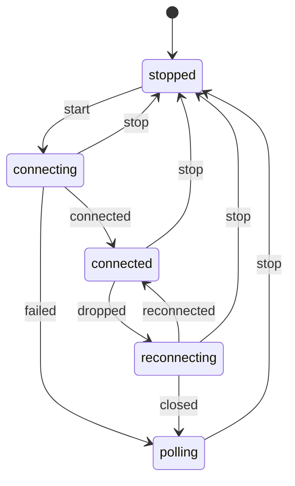

Code: the files [`examples/l03_*`](https://github.com/spareilleux/learn/tree/d039c6a49edd3fac4b6bf6003260282e3f77119d/code/typescript-advanced/examples) and [`errors/l03_*`](https://github.com/spareilleux/learn/tree/d039c6a49edd3fac4b6bf6003260282e3f77119d/code/typescript-advanced/errors), and the C# and Java sides in [`compare/`](https://github.com/spareilleux/learn/tree/d039c6a49edd3fac4b6bf6003260282e3f77119d/code/typescript-advanced/compare) (`l03_positions.cs`, `L03TypeState.java`) and [`compare_fail/`](https://github.com/spareilleux/learn/tree/d039c6a49edd3fac4b6bf6003260282e3f77119d/code/typescript-advanced/compare_fail) (`l03_positions_mixed.cs`, `L03TypeState.java`).

Structural typing is convenient until two values have the same shape and different meanings. A string index and a fret are both `number`, a node id and an edge id are both `string`, and a component that tracks whether it is loading, what it loaded and what went wrong in three separate variables can hold combinations that mean nothing. C# and Java developers fix the first problem with a small class or a record, and the second with a class hierarchy. TypeScript has its own tools for both, cheaper at run time and weaker in some places, and this lesson uses them on three places of GA's front end.

## Two numberings for the same strings

GA's component library numbers guitar strings in two ways, and both are typed `number`:

- [`types/InstrumentConfig.ts`, line 73](https://github.com/GuitarAlchemist/ga/blob/32f143c866c126338b332e384e4a615cd4b44381/ReactComponents/ga-react-components/src/types/InstrumentConfig.ts#L72-L78), and [`GuitarFretboard.tsx`, line 8](https://github.com/GuitarAlchemist/ga/blob/32f143c866c126338b332e384e4a615cd4b44381/ReactComponents/ga-react-components/src/components/GuitarFretboard.tsx#L7-L11), count from 0: "0 = highest pitch", "0 = high E".
- [`VexTabViewer.tsx`, line 86](https://github.com/GuitarAlchemist/ga/blob/32f143c866c126338b332e384e4a615cd4b44381/ReactComponents/ga-react-components/src/components/VexTabViewer.tsx#L84-L90), and [`InverseKinematics.tsx`, line 141](https://github.com/GuitarAlchemist/ga/blob/32f143c866c126338b332e384e4a615cd4b44381/ReactComponents/ga-react-components/src/components/InverseKinematics/InverseKinematics.tsx#L140-L143), count from 1, as tablature does: "1 = high E, 6 = low E".

Both conventions are reasonable, and each file is consistent. The risk is between files: four interfaces in the library are named `FretboardPosition`, all with `string: number; fret: number`, and structural typing makes them interchangeable, so a position from the fretboard passed to the tablature code is off by one string, silently. I found no place where GA mixes them today; the point of a type is that nobody has to check that again.

## Brands

```ts
// examples/l03_positions.ts
// Branded numbers for the two string numberings found in GuitarAlchemist/ga's front end:
// InstrumentConfig.ts counts from 0 (0 = highest string), VexTabViewer.tsx and InverseKinematics.tsx from 1 (1 = high E)

// A unique symbol exists only in this module's declarations: nothing outside can name the brand
declare const brand: unique symbol;
type Brand<T, B extends string> = T & { readonly [brand]: B };

export type StringIndex = Brand<number, 'StringIndex'>; // 0-based, 0 = highest string
export type StringNumber = Brand<number, 'StringNumber'>; // 1-based, 1 = highest string, as in tablature
export type Fret = Brand<number, 'Fret'>; // 0 = open string

export const STRING_COUNT = 6;
export const MAX_FRET = 24;

// Smart constructors: the only functions that turn a number into a branded one, after checking it
export function stringIndex(value: number): StringIndex {
  if (!Number.isInteger(value) || value < 0 || value >= STRING_COUNT) throw new RangeError(`string index out of range: ${value}`);
  return value as StringIndex;
}
export function stringNumber(value: number): StringNumber {
  if (!Number.isInteger(value) || value < 1 || value > STRING_COUNT) throw new RangeError(`string number out of range: ${value}`);
  return value as StringNumber;
}
export function fret(value: number): Fret {
  if (!Number.isInteger(value) || value < 0 || value > MAX_FRET) throw new RangeError(`fret out of range: ${value}`);
  return value as Fret;
}

// Conversions are explicit, and written once
export const toStringNumber = (index: StringIndex): StringNumber => (index + 1) as StringNumber;
export const toStringIndex = (number: StringNumber): StringIndex => (number - 1) as StringIndex;
```

A **brand** intersects the base type with an object type that no real value has: `number & { readonly [brand]: 'StringIndex' }`. A plain `number` isn't assignable to it, since it lacks the property, and a `StringIndex` isn't assignable to a `StringNumber`, since the literal types of the property differ. The property never exists at run time. `declare const brand: unique symbol` declares a symbol for the checker only; Node.js removes the line, and nothing is allocated.

The module exports the types and a **smart constructor** for each: the only functions that assert a brand, after checking the range. Because `brand` isn't exported, no other module can write the brand's type by hand; it can still write `as StringNumber`, which is the limit of the technique.

```ts
// examples/l03_brands.ts
import type { Equal, Expect } from './type-tests.ts';
import { attempt, show } from './show.ts';
import { fret, stringIndex, stringNumber, toStringIndex, toStringNumber, type Fret, type StringIndex, type StringNumber } from './l03_positions.ts';

// GA's VexTabViewer.tsx: getPitchFromTabPosition(string: number, fret: number), with 1 = high E
const openStrings = ['E/5', 'B/4', 'G/4', 'D/4', 'A/3', 'E/3'];
function openStringOf(string: StringNumber): string {
  return openStrings[string - 1] ?? 'E/3';
}
// GA's InstrumentConfig.ts: FretboardPosition { string: number; fret: number }, with 0 = highest string
interface FretboardPosition {
  string: StringIndex;
  fret: Fret;
}

const clicked: FretboardPosition = { string: stringIndex(1), fret: fret(3) }; // the B string, third fret
show('openStringOf(toStringNumber(…))', openStringOf(toStringNumber(clicked.string)));

// A brand is a type, and nothing else: at run time the value is a plain number
show('typeof clicked.string', typeof clicked.string);
show('JSON.stringify(clicked)', JSON.stringify(clicked));

// Arithmetic gives back a number: the brand says what the value is, and a new value has to be checked again
const next = clicked.fret + 1;
type _1 = Expect<Equal<typeof next, number>>;
show('fret(next)', fret(next));
attempt('fret(25)', () => fret(25));
attempt('stringNumber(0)', () => stringNumber(0));

// A branded value is still a number wherever a number is expected
show('Math.max(clicked.fret, 5)', Math.max(clicked.fret, 5));
show('toStringIndex(stringNumber(6))', toStringIndex(stringNumber(6)));

// Classes with a #private field are compared nominally: two identical shapes are not interchangeable
class Semitones {
  #value: number;
  constructor(value: number) {
    this.#value = value;
  }
  get value(): number {
    return this.#value;
  }
}
class Cents {
  #value: number;
  constructor(value: number) {
    this.#value = value;
  }
  get value(): number {
    return this.#value;
  }
}
// @ts-expect-error: a Cents is not a Semitones, although both have a value getter
const wrong: Semitones = new Cents(700);
show('new Semitones(7).value', new Semitones(7).value);
show('wrong instanceof Semitones', wrong instanceof Semitones);
```

```text
openStringOf(toStringNumber(…))    'B/4'
typeof clicked.string              'number'
JSON.stringify(clicked)            '{"string":1,"fret":3}'
fret(next)                         4
fret(25)                           RangeError: fret out of range: 25
stringNumber(0)                    RangeError: string number out of range: 0
Math.max(clicked.fret, 5)          5
toStringIndex(stringNumber(6))     5
new Semitones(7).value             7
wrong instanceof Semitones         false
```

- **A brand is a type and nothing else**: `typeof` gives `'number'`, and `JSON.stringify` writes plain numbers, so branded values cross the network like any other.
- **Arithmetic returns a `number`**: `clicked.fret + 1` isn't a `Fret`, because the result could be 25. The brand says that the value was checked, and a new value has to be checked again, here with `fret(next)`.
- **A branded value is still a number** wherever a number is expected, so `Math.max` and array indexing work without conversion.
- **`#private` fields make classes nominal.** Two classes with the same private field and the same getter aren't assignable to each other, because a [private field](https://www.typescriptlang.org/docs/handbook/2/classes.html#caveats) can only be accessed through its own class. That gives real nominal types, with a run-time check through `instanceof`, at the price of an object per value.

The mistakes that the brands catch:

```text
> npx tsc -p out/tsconfig.l03_brands.json --pretty
errors/l03_brands.ts:11:14 - error TS2345: Argument of type 'StringIndex' is not assignable to parameter of type 'StringNumber'.
  Type 'StringIndex' is not assignable to type '{ readonly [brand]: "StringNumber"; }'.
    Types of property '[brand]' are incompatible.
      Type '"StringIndex"' is not assignable to type '"StringNumber"'.

11 openStringOf(clicked.string); // a 0-based index where a 1-based number is expected
                ~~~~~~~~~~~~~~

errors/l03_brands.ts:12:14 - error TS2345: Argument of type 'number' is not assignable to parameter of type 'StringNumber'.
  Type 'number' is not assignable to type '{ readonly [brand]: "StringNumber"; }'.

12 openStringOf(2); // a plain number
                ~

errors/l03_brands.ts:13:48 - error TS2322: Type 'number' is not assignable to type 'Fret'.
  Type 'number' is not assignable to type '{ readonly [brand]: "Fret"; }'.

13 const moved: FretboardPosition = { ...clicked, fret: clicked.fret + 1 }; // arithmetic loses the brand
                                                  ~~~~

  errors/l03_brands.ts:7:3 - The expected type comes from property 'fret' which is declared here on type 'FretboardPosition'
    7   fret: Fret;
        ~~~~

errors/l03_brands.ts:14:38 - error TS2322: Type 'Fret' is not assignable to type 'StringIndex'.
  Type 'Fret' is not assignable to type '{ readonly [brand]: "StringIndex"; }'.
    Types of property '[brand]' are incompatible.
      Type '"Fret"' is not assignable to type '"StringIndex"'.

14 const swapped: FretboardPosition = { string: clicked.fret, fret: clicked.string };
                                        ~~~~~~

  errors/l03_brands.ts:6:3 - The expected type comes from property 'string' which is declared here on type 'FretboardPosition'
    6   string: StringIndex;
        ~~~~~~

errors/l03_brands.ts:14:60 - error TS2322: Type 'StringIndex' is not assignable to type 'Fret'.
  Type 'StringIndex' is not assignable to type '{ readonly [brand]: "Fret"; }'.
    Types of property '[brand]' are incompatible.
      Type '"StringIndex"' is not assignable to type '"Fret"'.

14 const swapped: FretboardPosition = { string: clicked.fret, fret: clicked.string };
                                                              ~~~~

  errors/l03_brands.ts:7:3 - The expected type comes from property 'fret' which is declared here on type 'FretboardPosition'
    7   fret: Fret;
        ~~~~


Found 5 errors in the same file, starting at: errors/l03_brands.ts:11
```

The index passed where a tablature number is expected, the plain number, the lost brand after arithmetic, and the swapped string and fret are all compile errors. The last line, `99 as StringNumber`, compiles: an assertion forges a brand, and a lint rule or a code review has to catch that. The messages mention `[brand]`, which is one reason to give the brand a readable name.

C# expresses the same idea with a real type. A [`readonly record struct`](https://learn.microsoft.com/dotnet/csharp/language-reference/builtin-types/record) wraps the `int` without allocating, carries its checks in the constructor, and the conversion between numberings is a method:

```csharp
// compare/l03_positions.cs
// In C#, a nominal wrapper is a real type: a readonly record struct costs no allocation and carries its checks
var clicked = new FretboardPosition(new StringIndex(1), new Fret(3));
Console.WriteLine(OpenStringOf(clicked.String.ToStringNumber()));
Console.WriteLine(clicked);
try
{
    _ = new Fret(25);
}
catch (ArgumentOutOfRangeException e)
{
    Console.WriteLine(e.Message);
}

static string OpenStringOf(StringNumber number) => new[] { "E/5", "B/4", "G/4", "D/4", "A/3", "E/3" }[number.Value - 1];

readonly record struct StringIndex
{
    public int Value { get; }
    public StringIndex(int value)
    {
        ArgumentOutOfRangeException.ThrowIfNegative(value);
        ArgumentOutOfRangeException.ThrowIfGreaterThan(value, 5);
        Value = value;
    }
    public StringNumber ToStringNumber() => new(Value + 1);
}

readonly record struct StringNumber
{
    public int Value { get; }
    public StringNumber(int value)
    {
        ArgumentOutOfRangeException.ThrowIfLessThan(value, 1);
        ArgumentOutOfRangeException.ThrowIfGreaterThan(value, 6);
        Value = value;
    }
}

readonly record struct Fret
{
    public int Value { get; }
    public Fret(int value)
    {
        ArgumentOutOfRangeException.ThrowIfNegative(value);
        ArgumentOutOfRangeException.ThrowIfGreaterThan(value, 24);
        Value = value;
    }
}

record FretboardPosition(StringIndex String, Fret Fret);
```

```text
> dotnet run l03_positions.cs
B/4
FretboardPosition { String = StringIndex { Value = 1 }, Fret = Fret { Value = 3 } }
value ('25') must be less than or equal to '24'. (Parameter 'value')
Actual value was 25.
```

```text
> dotnet run l03_positions_mixed.cs
compare_fail/l03_positions_mixed.cs(3,32): error CS1503: Argument 1: cannot convert from 'StringIndex' to 'StringNumber'
compare_fail/l03_positions_mixed.cs(4,32): error CS1503: Argument 1: cannot convert from 'int' to 'StringNumber'

The build failed. Fix the build errors and run again.
```

| | C# `readonly record struct` | Java `record` | TypeScript brand | TypeScript class with `#private` |
|---|---|---|---|---|
| Distinct from the base type | yes | yes | yes | yes |
| Cost at run time | none, a struct | an object | none | an object |
| Check at run time | constructor | constructor | smart constructor only | constructor and `instanceof` |
| Can be forged | no, without unsafe code | no | yes, with `as` | no |
| Serializes as the base value | with a converter | with a serializer | yes | no |

## Impossible states

GA's chat widget tracks voice input in [`ChatWidget.tsx`, lines 763-764](https://github.com/GuitarAlchemist/ga/blob/32f143c866c126338b332e384e4a615cd4b44381/ReactComponents/ga-react-components/src/components/PrimeRadiant/ChatWidget.tsx#L763-L764), with two pieces of state:

```ts
const [isListening, setIsListening] = useState(false);
const [voiceState, setVoiceState] = useState<'idle' | 'listening' | 'processing' | 'understood'>('idle');
```

The two can disagree, and the code that updates them shows how. In [`startListening`](https://github.com/GuitarAlchemist/ga/blob/32f143c866c126338b332e384e4a615cd4b44381/ReactComponents/ga-react-components/src/components/PrimeRadiant/ChatWidget.tsx#L971-L1025), the handlers `onerror` and `onend` call `setIsListening(false)`, then `if (voiceState === 'listening') setVoiceState('idle')`. `voiceState` there is the value captured when the callback was created, and `voiceState` isn't in its dependency list, `[sendMessage, alwaysListen, locale]`; `setVoiceState('listening')` is called at the end of the same function, after the capture. So the test is likely always false, and after an error the widget can show `isListening` false with `voiceState` still `'listening'` (*to verify* in a browser). The same function calls `sendMessage(transcript).then(() => setVoiceState('understood'))` without a `catch`, and `sendMessage` has a `try`/`finally` without a `catch`, so a failed request leaves the state at `'processing'`. The stale closure is a React problem, for the [React (Vite)](../../react-vite/) course; the contradictory pair is a modeling problem, and a type can remove it.

```ts
// examples/l03_states.ts
import type { Equal, Expect } from './type-tests.ts';
import { show } from './show.ts';

// GA's ChatWidget.tsx keeps the voice input in two pieces of state that can disagree:
//   const [isListening, setIsListening] = useState(false);
//   const [voiceState, setVoiceState] = useState<'idle' | 'listening' | 'processing' | 'understood'>('idle');
interface LooseVoice {
  isListening: boolean;
  voiceState: 'idle' | 'listening' | 'processing' | 'understood';
  transcript?: string;
  error?: string;
}
// 2 × 4 × 2 × 2 = 32 combinations, and most of them mean nothing: listening and idle, an error while understood…
const contradictory: LooseVoice = { isListening: false, voiceState: 'listening', error: 'network' };
show('contradictory', contradictory);

// One discriminated union: each state carries exactly the data that exists in that state
type Voice =
  | { status: 'idle' }
  | { status: 'listening'; startedAt: number }
  | { status: 'processing'; transcript: string }
  | { status: 'understood'; transcript: string }
  | { status: 'failed'; transcript: string; error: string };

// The events that move it, also a union
type VoiceEvent =
  | { type: 'start'; at: number }
  | { type: 'final-result'; transcript: string }
  | { type: 'sent' }
  | { type: 'send-failed'; error: string }
  | { type: 'stop' }
  | { type: 'reset' };

// The transitions, as a reducer: every state handles every event, and an event that doesn't apply keeps the state
function transition(state: Voice, event: VoiceEvent): Voice {
  switch (state.status) {
    case 'idle':
      return event.type === 'start' ? { status: 'listening', startedAt: event.at } : state;
    case 'listening':
      if (event.type === 'final-result') return { status: 'processing', transcript: event.transcript };
      return event.type === 'stop' ? { status: 'idle' } : state;
    case 'processing':
      if (event.type === 'sent') return { status: 'understood', transcript: state.transcript };
      return event.type === 'send-failed' ? { status: 'failed', transcript: state.transcript, error: event.error } : state;
    case 'understood':
    case 'failed':
      return event.type === 'reset' ? { status: 'idle' } : state;
    default:
      return assertNever(state);
  }
}
function assertNever(value: never): never {
  throw new Error(`unexpected state: ${JSON.stringify(value)}`);
}

// Rendering reads the data that the state guarantees, without optional checks
function label(state: Voice): string {
  switch (state.status) {
    case 'idle':
      return 'mic off';
    case 'listening':
      return `listening since ${state.startedAt} ms`;
    case 'processing':
      return `sending "${state.transcript}"`;
    case 'understood':
      return `understood "${state.transcript}"`;
    case 'failed':
      return `could not send "${state.transcript}": ${state.error}`;
  }
}

const events: VoiceEvent[] = [
  { type: 'start', at: 120 },
  { type: 'final-result', transcript: 'show me drop D voicings' },
  { type: 'send-failed', error: 'HTTP 503' },
  { type: 'sent' }, // ignored: a failed request can't succeed afterwards
  { type: 'reset' },
];
let state: Voice = { status: 'idle' };
for (const event of events) {
  state = transition(state, event);
  console.log(`${event.type.padEnd(13)} → ${label(state)}`);
}

// The number of possible values is now the number of states
type _1 = Expect<Equal<Voice['status'], 'idle' | 'listening' | 'processing' | 'understood' | 'failed'>>;
```

```text
contradictory                      { isListening: false, voiceState: 'listening', error: 'network' }
start         → listening since 120 ms
final-result  → sending "show me drop D voicings"
send-failed   → could not send "show me drop D voicings": HTTP 503
sent          → could not send "show me drop D voicings": HTTP 503
reset         → mic off
```

`LooseVoice` has 32 combinations, and the program builds one that means nothing without a compile error. `Voice` is a **discriminated union**: five states, and each one holds the data that exists in that state. There is no `transcript` while idle, no `error` unless the request failed, and no way to be listening and not listening at once. The events are a union too, and the transitions are a function from a state and an event to a state, the reducer form that React's `useReducer` uses.

- The `default` branch passes `state` to `assertNever`, whose parameter is `never`: if a sixth state is added and not handled, `state` isn't `never` there, and the call is a compile error.
- `label` has no `default`, and needs none: its return type is `string`, and a missing case makes the end of the function reachable, which `tsc` reports.
- The fourth event, `sent`, arrives after `send-failed` and is ignored, because the `failed` state doesn't handle it: the order of asynchronous events is part of the model, and a late success can't overwrite a failure.

The mistakes:

```text
> npx tsc -p out/tsconfig.l03_states.json --pretty
errors/l03_states.ts:8:31 - error TS2366: Function lacks ending return statement and return type does not include 'undefined'.

8 function label(state: Voice): string {
                                ~~~~~~

errors/l03_states.ts:9:62 - error TS2339: Property 'transcript' does not exist on type '{ status: "listening"; startedAt: number; }'.

9   if (state.status === 'listening') return `sending "${state.transcript}"`;
                                                               ~~~~~~~~~~

errors/l03_states.ts:29:42 - error TS2353: Object literal may only specify known properties, and 'transcript' does not exist in type '{ status: "idle"; }'.

29 const invalid: Voice = { status: 'idle', transcript: 'leftover' };
                                            ~~~~~~~~~~

errors/l03_states.ts:30:17 - error TS2345: Argument of type '"stop"' is not assignable to parameter of type '"start"'.

30 send('stopped', 'stop');
                   ~~~~~~

errors/l03_states.ts:31:7 - error TS2820: Type '"poling"' is not assignable to type '"connected" | "connecting" | "polling" | "stopped"'. Did you mean '"polling"'?

31 const next: LiveState = send('connecting', 'failed');
         ~~~~


Found 5 errors in the same file, starting at: errors/l03_states.ts:8
```

`TS2366` is the missing `'failed'` case. `TS2339` reads a `transcript` in the `listening` state, which has none. `TS2353` builds an idle state with leftover data. The last two errors concern the state machine of the next section; the typo `'poling'` is caught only where a target is used as a state, which the third exercise improves.

The Java version of the same model uses a [sealed interface](https://docs.oracle.com/en/java/javase/25/language/sealed-classes-and-interfaces.html) and records. It goes one step further than the TypeScript reducer: each state is a class, and it only has the methods of its own transitions, so an invalid transition isn't even a method call that can be written.

```java
// compare/L03TypeState.java
// Java 25: sealed interfaces and records, where each state offers only the transitions it allows
public class L03TypeState {
    sealed interface Voice permits Idle, Listening, Processing, Failed {}

    record Idle() implements Voice {
        Listening start(long at) { return new Listening(at); }
    }

    record Listening(long startedAt) implements Voice {
        Processing finalResult(String transcript) { return new Processing(transcript); }
        Idle stop() { return new Idle(); }
    }

    record Processing(String transcript) implements Voice {
        Failed sendFailed(String error) { return new Failed(transcript, error); }
    }

    record Failed(String transcript, String error) implements Voice {}

    // The switch over a sealed interface must cover every permitted type
    static String label(Voice state) {
        return switch (state) {
            case Idle i -> "mic off";
            case Listening l -> "listening since " + l.startedAt() + " ms";
            case Processing p -> "sending \"" + p.transcript() + "\"";
            case Failed f -> "could not send \"" + f.transcript() + "\": " + f.error();
        };
    }

    public static void main(String[] args) {
        Voice state = new Idle().start(120).finalResult("show me drop D voicings").sendFailed("HTTP 503");
        System.out.println(label(state));
    }
}
```

```text
> java L03TypeState.java
could not send "show me drop D voicings": HTTP 503
```

```text
> javac L03TypeState.java
L03TypeState.java:13: error: cannot find symbol
        new Idle().stop();
                  ^
  symbol:   method stop()
  location: class Idle
1 error
```

## A typed state machine

The live data connection of [`DataLoader.ts`](https://github.com/GuitarAlchemist/ga/blob/32f143c866c126338b332e384e4a615cd4b44381/ReactComponents/ga-react-components/src/components/PrimeRadiant/DataLoader.ts#L242-L441) tries SignalR first and falls back to HTTP polling. Its state is spread over three mutable variables, `active`, `connection` and `pollInterval`, and reported to the caller as `'connected' | 'polling' | 'disconnected'`. Written as a table, the states and transitions are:



The table is also a value, and its type is enough to type the machine:

```ts
// examples/l03_machine.ts
import type { Equal, Expect } from './type-tests.ts';
import { show } from './show.ts';

// GA's live connection in DataLoader.ts: SignalR first, HTTP polling as a fallback, three mutable variables
// (active, connection, pollInterval) and a status reported as 'connected' | 'polling' | 'disconnected'.
// A transition table, checked by satisfies and kept literal by as const
const liveTransitions = {
  stopped: { start: 'connecting' },
  connecting: { connected: 'connected', failed: 'polling', stop: 'stopped' },
  connected: { dropped: 'reconnecting', stop: 'stopped' },
  reconnecting: { reconnected: 'connected', closed: 'polling', stop: 'stopped' },
  polling: { stop: 'stopped' },
} as const satisfies Record<string, Record<string, string>>;

type Transitions = typeof liveTransitions;
type LiveState = keyof Transitions;
type EventOf<S extends LiveState> = keyof Transitions[S];
type Next<S extends LiveState, E extends EventOf<S>> = Transitions[S][E];

// Every target of the table is a state: a typo in a target would make this test fail
type Targets = { [S in LiveState]: Transitions[S][keyof Transitions[S]] }[LiveState];
type _1 = Expect<Equal<[Targets] extends [LiveState] ? true : false, true>>;
type _2 = Expect<Equal<EventOf<'connected'>, 'dropped' | 'stop'>>;
type _3 = Expect<Equal<Next<'connecting', 'failed'>, 'polling'>>;

// send accepts only the events of the current state, and its result type is the next state
function send<S extends LiveState, E extends EventOf<S>>(state: S, event: E): Next<S, E> {
  const targets: Record<string, string> = liveTransitions[state];
  return targets[event as string] as Next<S, E>; // an assertion: the lookup is the one the type describes
}

const s1 = send('stopped', 'start');
const s2 = send(s1, 'connected');
const s3 = send(s2, 'dropped');
const s4 = send(s3, 'closed');
type _4 = Expect<Equal<typeof s4, 'polling'>>;
show('stopped → … → s4', [s1, s2, s3, s4]);

// A state known only at run time is a union: send accepts the events that every member of the union allows
type _5 = Expect<Equal<EventOf<LiveState>, never>>; // stopped has no stop event
function stop(state: Exclude<LiveState, 'stopped'>) {
  return send(state, 'stop');
}
type _6 = Expect<Equal<ReturnType<typeof stop>, 'stopped'>>;
show("stop('reconnecting')", stop('reconnecting'));

// What the table says, listed at run time
for (const [state, events] of Object.entries(liveTransitions)) {
  console.log(`${state.padEnd(13)} ${Object.entries(events).map(([event, next]) => `${event} → ${next}`).join(', ')}`);
}
```

```text
stopped → … → s4                   [ 'connecting', 'connected', 'reconnecting', 'polling' ]
stop('reconnecting')               'stopped'
stopped       start → connecting
connecting    connected → connected, failed → polling, stop → stopped
connected     dropped → reconnecting, stop → stopped
reconnecting  reconnected → connected, closed → polling, stop → stopped
polling       stop → stopped
```

- **`as const satisfies`**, from [lesson 2](../02-variance-and-assignability/#satisfies-annotations-and-assertions), keeps every target as a literal type and checks the shape of the table.
- **`EventOf<S>`** is `keyof Transitions[S]`, the events that the state `S` accepts, and **`Next<S, E>`** is the indexed access `Transitions[S][E]`. `send('stopped', 'start')` has the type `'connecting'`, and the chain `s1` to `s4` is followed by the checker step by step.
- **A union of states accepts only their common events.** `keyof` of a union is the intersection of the keys, so `EventOf<LiveState>` is `never`: the `stopped` state has no `stop` event. `stop` takes the four other states, and its return type is `'stopped'`.
- **`Targets`** collects every target of the table, and the type test `_1` checks that each one is a state. It passes here; with the typo `'poling'` it would fail, which is a check on the table that doesn't depend on where the table is used.

The machine checks the transitions that the code writes. It doesn't check that the code sends `dropped` when SignalR's `onreconnecting` fires: that part stays a test at run time. XState, the most used state machine library for TypeScript, builds its typed machines on the same principles, with an [actor model](https://stately.ai/docs/actors) on top.

## Key takeaways

- A brand, `T & { readonly [brand]: 'Name' }`, makes two structurally identical types incompatible, at no cost at run time; smart constructors are the only place that asserts it.
- Brands disappear in arithmetic and can be forged with `as`; classes with `#private` fields are truly nominal, at the cost of an object.
- A discriminated union holds exactly the data of each state, and removes the combinations that three separate variables allow.
- `never` in a `default` branch, or a return type without `undefined`, makes a missing case a compile error.
- A transition table kept literal with `as const satisfies` types a state machine: allowed events come from `keyof`, next states from indexed access.

## Exercises

1. GA's `GraphIndex`, in `DataLoader.ts`, has five maps keyed by `string`, some by node id and some by edge id. Brand `NodeId` and `EdgeId`, convert the ids once when the graph is read, and show that looking a node up by an edge id no longer compiles.

<details>
<summary>Solution</summary>

[`solutions/l03_ex1_graph_ids.ts`](https://github.com/spareilleux/learn/blob/d039c6a49edd3fac4b6bf6003260282e3f77119d/code/typescript-advanced/solutions/l03_ex1_graph_ids.ts):

```ts
// solutions/l03_ex1_graph_ids.ts
declare const brand: unique symbol;
type Brand<T, B extends string> = T & { readonly [brand]: B };
type NodeId = Brand<string, 'NodeId'>;
type EdgeId = Brand<string, 'EdgeId'>;

interface GovernanceNode {
  id: NodeId;
  name: string;
}
interface GovernanceEdge {
  id: EdgeId;
  source: NodeId;
  target: NodeId;
}

// GA's GraphIndex in DataLoader.ts, with the ids told apart: in GA, all five maps are keyed by string
interface GraphIndex {
  nodeMap: Map<NodeId, GovernanceNode>;
  outEdges: Map<NodeId, GovernanceEdge[]>;
  connectedEdges: Map<NodeId, Set<EdgeId>>;
}

// The data comes from JSON: the ids are branded once, where the graph is read
function readGraph(raw: { nodes: { id: string; name: string }[]; edges: { id: string; source: string; target: string }[] }) {
  const nodes = raw.nodes.map((n): GovernanceNode => ({ id: n.id as NodeId, name: n.name }));
  const edges = raw.edges.map((e): GovernanceEdge => ({ id: e.id as EdgeId, source: e.source as NodeId, target: e.target as NodeId }));
  return { nodes, edges };
}

function buildGraphIndex(graph: { nodes: GovernanceNode[]; edges: GovernanceEdge[] }): GraphIndex {
  const index: GraphIndex = { nodeMap: new Map(), outEdges: new Map(), connectedEdges: new Map() };
  for (const node of graph.nodes) index.nodeMap.set(node.id, node);
  for (const edge of graph.edges) {
    index.outEdges.set(edge.source, [...(index.outEdges.get(edge.source) ?? []), edge]);
    for (const end of [edge.source, edge.target]) {
      index.connectedEdges.set(end, (index.connectedEdges.get(end) ?? new Set()).add(edge.id));
    }
  }
  return index;
}

const graph = readGraph({
  nodes: [{ id: 'constitution', name: 'Constitution' }, { id: 'policy-7', name: 'Alignment policy' }],
  edges: [{ id: 'e1', source: 'constitution', target: 'policy-7' }],
});
const index = buildGraphIndex(graph);
const edge = graph.edges[0]!;
console.log(index.nodeMap.get(edge.target)?.name, [...(index.connectedEdges.get(edge.source) ?? [])]);

function mistakes() {
  // @ts-expect-error: an edge id is not a node id
  index.nodeMap.get(edge.id);
  // @ts-expect-error: a plain string is not a node id
  index.outEdges.get('constitution');
}
console.log(typeof mistakes);
```

```text
Alignment policy [ 'e1' ]
function
```

The assertions are all in `readGraph`, where strings from JSON become ids; everything after it is checked. `Map<NodeId, …>` refuses an `EdgeId` and a plain string in `get`, which is where a mix-up would otherwise return `undefined`. Lesson 4 replaces the assertions in `readGraph` with a schema that brands the ids after checking them.

</details>

2. Many GA components keep `[loading, setLoading]`, `[error, setError]` and `[data, setData]` side by side. Write `RemoteData<T, E>` as a union, and a `fold(state, handlers)` that requires one handler per status and passes each the right member of the union.

<details>
<summary>Solution</summary>

[`solutions/l03_ex2_remote_data.ts`](https://github.com/spareilleux/learn/blob/d039c6a49edd3fac4b6bf6003260282e3f77119d/code/typescript-advanced/solutions/l03_ex2_remote_data.ts):

```ts
// solutions/l03_ex2_remote_data.ts
// GA's components keep [loading, setLoading], [error, setError] and [data, setData] side by side;
// one union replaces the three, and fold makes every caller handle every state
type RemoteData<T, E = string> =
  | { status: 'idle' }
  | { status: 'loading' }
  | { status: 'success'; data: T }
  | { status: 'failure'; error: E };

// One handler per status, each receiving its own member of the union: a mapped type over the discriminant
type Handlers<T, E, R> = { [S in RemoteData<T, E>['status']]: (state: Extract<RemoteData<T, E>, { status: S }>) => R };

function fold<T, E, R>(state: RemoteData<T, E>, handlers: Handlers<T, E, R>): R {
  // An assertion: tsc can't correlate handlers[state.status] with state, a known limit for unions indexed this way
  const handler = handlers[state.status] as (state: RemoteData<T, E>) => R;
  return handler(state);
}

interface Voicing {
  name: string;
  frets: string;
}
const render = (state: RemoteData<Voicing[]>) =>
  fold(state, {
    idle: () => 'search for a chord',
    loading: () => 'searching…',
    success: ({ data }) => data.map((v) => `${v.name} ${v.frets}`).join(', '),
    failure: ({ error }) => `search failed: ${error}`,
  });

const states: RemoteData<Voicing[]>[] = [
  { status: 'idle' },
  { status: 'loading' },
  { status: 'success', data: [{ name: 'C', frets: 'x32010' }, { name: 'C/G', frets: '332010' }] },
  { status: 'failure', error: 'HTTP 503' },
];
for (const state of states) console.log(render(state));

function mistakes(state: RemoteData<Voicing[]>) {
  // @ts-expect-error: the failure handler is missing
  fold(state, { idle: () => '', loading: () => '', success: () => '' });
}
console.log(typeof mistakes);
```

```text
search for a chord
searching…
C x32010, C/G 332010
search failed: HTTP 503
function
```

`Handlers` is a mapped type over the discriminant, and `Extract` picks the member of the union for each status, so the `success` handler can destructure `data` and the `failure` handler `error`. Inside `fold`, `handlers[state.status](state)` doesn't compile without the assertion: the type of `handlers[state.status]` is a union of four functions, and calling a union of functions requires the intersection of their parameters, which is `never` here, the contravariant intersection of [lesson 1](../01-type-level-programming/#conditional-types). `tsc` doesn't track that the key and the argument come from the same `state`, a limit known as correlated unions.

</details>

3. The typo `'poling'` in a transition table is only reported where the target is used. Write `defineMachine(table)`, which refuses a table whose targets aren't all keys of the table itself.

<details>
<summary>Solution</summary>

[`solutions/l03_ex3_define_machine.ts`](https://github.com/spareilleux/learn/blob/d039c6a49edd3fac4b6bf6003260282e3f77119d/code/typescript-advanced/solutions/l03_ex3_define_machine.ts):

```ts
// solutions/l03_ex3_define_machine.ts
import type { Equal, Expect } from '../examples/type-tests.ts';

// The constraint refers to T itself: every target must be one of the table's own keys
function defineMachine<const T extends Record<string, Record<string, keyof T>>>(transitions: T): T {
  return transitions;
}

const live = defineMachine({
  stopped: { start: 'connecting' },
  connecting: { connected: 'connected', failed: 'polling', stop: 'stopped' },
  connected: { dropped: 'reconnecting', stop: 'stopped' },
  reconnecting: { reconnected: 'connected', closed: 'polling', stop: 'stopped' },
  polling: { stop: 'stopped' },
});
type _1 = Expect<Equal<(typeof live)['connecting']['failed'], 'polling'>>;

function mistakes() {
  defineMachine({
    stopped: { start: 'connecting' },
    // @ts-expect-error: 'poling' is not a state
    connecting: { failed: 'poling' },
  });
}
console.log(Object.keys(live), typeof mistakes);
```

```text
[ 'stopped', 'connecting', 'connected', 'reconnecting', 'polling' ] function
```

The constraint `T extends Record<string, Record<string, keyof T>>` refers to `T` itself, which TypeScript allows, like Java's `<T extends Comparable<T>>`. The `const` modifier keeps the targets literal, so each one must be one of the literal keys. `satisfies` can't do this, because the type after it can't refer to the type of the expression being checked; a generic function can.

</details>

## Sources

- [TypeScript handbook — Narrowing: discriminated unions and exhaustiveness checking](https://www.typescriptlang.org/docs/handbook/2/narrowing.html#discriminated-unions), [Classes](https://www.typescriptlang.org/docs/handbook/2/classes.html), [Symbols — `unique symbol`](https://www.typescriptlang.org/docs/handbook/symbols.html#unique-symbol)
- [TypeScript FAQ on nominal typing, in the TypeScript wiki](https://github.com/microsoft/TypeScript/wiki/FAQ#can-i-make-a-type-alias-nominal)
- [Microsoft — Records](https://learn.microsoft.com/dotnet/csharp/language-reference/builtin-types/record), [ArgumentOutOfRangeException.ThrowIfGreaterThan](https://learn.microsoft.com/dotnet/api/system.argumentoutofrangeexception.throwifgreaterthan)
- [Java 25 — Sealed classes and interfaces](https://docs.oracle.com/en/java/javase/25/language/sealed-classes-and-interfaces.html), [Pattern matching for switch](https://docs.oracle.com/en/java/javase/25/language/pattern-matching-switch.html)
- [React — Extracting state logic into a reducer](https://react.dev/learn/extracting-state-logic-into-a-reducer)
