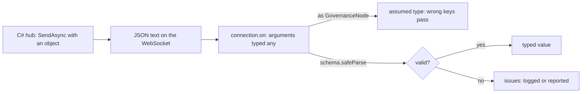

Code: the files [`examples/l04_*`](https://github.com/spareilleux/learn/tree/d039c6a49edd3fac4b6bf6003260282e3f77119d/code/typescript-advanced/examples) and [`errors/l04_*`](https://github.com/spareilleux/learn/tree/d039c6a49edd3fac4b6bf6003260282e3f77119d/code/typescript-advanced/errors), the bundles in [`bundle/`](https://github.com/spareilleux/learn/tree/d039c6a49edd3fac4b6bf6003260282e3f77119d/code/typescript-advanced/bundle) with [`bundle-size.mjs`](https://github.com/spareilleux/learn/blob/d039c6a49edd3fac4b6bf6003260282e3f77119d/code/typescript-advanced/bundle-size.mjs), and the C# and Java sides in [`compare/`](https://github.com/spareilleux/learn/tree/d039c6a49edd3fac4b6bf6003260282e3f77119d/code/typescript-advanced/compare) (`l04_hub_json.cs`, `l04_json_required.cs`) and [`compare_fail/`](https://github.com/spareilleux/learn/tree/d039c6a49edd3fac4b6bf6003260282e3f77119d/code/typescript-advanced/compare_fail) (`L04Checked.java`).

The first three lessons made the checker prove more. Everything it proves rests on one assumption: that each value has the type written for it. Inside the program, `tsc` checks that. At the border, where values come from `JSON.parse`, `response.json()`, a SignalR message or `localStorage`, nothing checks it: those APIs return `any`, or a parameter typed by hand, and the types are erased before the program runs. C# and Java developers are used to a deserializer that at least builds the declared type and fails when it can't. In TypeScript, a wrong type at the border compiles, runs, and fails somewhere else, or not at all.

## A lost update in GA

GA's C# hub broadcasts the change of one node's health in [`GovernanceHub.cs`, lines 163-176](https://github.com/GuitarAlchemist/ga/blob/32f143c866c126338b332e384e4a615cd4b44381/Apps/ga-server/GaApi/Hubs/GovernanceHub.cs#L163-L176), as an anonymous object whose first property is `nodeId`. The front end receives it in [`DataLoader.ts`, lines 276-279](https://github.com/GuitarAlchemist/ga/blob/32f143c866c126338b332e384e4a615cd4b44381/ReactComponents/ga-react-components/src/components/PrimeRadiant/DataLoader.ts#L276-L279):

```ts
connection.on('NodeChanged', (data: { nodeId: string; health: unknown; healthStatus: string; color: string }) => {
  // Partial update — single node
  onUpdate({ nodes: [data as unknown as GovernanceNode], edges: [], globalHealth: { resilienceScore: 0, lolliCount: 0, ergolCount: 0 }, timestamp: new Date().toISOString() } as GovernanceGraph);
});
```

The parameter's type is right: it matches the server. The assertion `as unknown as GovernanceNode` then says that an object with `nodeId` is a node, whose key is `id`. [`ForceRadiant.tsx`, line 3585](https://github.com/GuitarAlchemist/ga/blob/32f143c866c126338b332e384e4a615cd4b44381/ReactComponents/ga-react-components/src/components/PrimeRadiant/ForceRadiant.tsx#L3582-L3587), passes the nodes of that graph to [`updateNodeHealth`](https://github.com/GuitarAlchemist/ga/blob/32f143c866c126338b332e384e4a615cd4b44381/ReactComponents/ga-react-components/src/components/PrimeRadiant/DataLoader.ts#L446-L471), which looks each node of the scene up by `id` in the fresh nodes. It finds nothing, and the update is dropped without an error. A code search on GitHub finds no caller of `BroadcastNodeChanged` today, so the path is latent (*to verify* on a running server); it is exactly the kind of bug that appears the day someone calls it.

The example reduces the handler and the update function to what matters:

```ts
// examples/l04_border.ts
// GuitarAlchemist/ga's NodeChanged handler, reduced: the payload is asserted to be a node, and the update is lost
import * as z from 'zod';
import { show } from './show.ts';

interface HealthMetrics {
  resilienceScore: number;
  lolliCount: number;
  ergolCount: number;
}
interface GovernanceNode {
  id: string;
  name: string;
  health?: HealthMetrics;
}

// DataLoader.ts, updateNodeHealth: looks each existing node up by id in the fresh nodes, and updates its health
function updateNodeHealth(existingNodes: GovernanceNode[], freshNodes: GovernanceNode[]): string[] {
  const freshMap = new Map(freshNodes.map((n) => [n.id, n]));
  const updated: string[] = [];
  for (const node of existingNodes) {
    const fresh = freshMap.get(node.id);
    if (!fresh?.health) continue;
    node.health = fresh.health;
    updated.push(node.id);
  }
  return updated;
}

const scene: GovernanceNode[] = [{ id: 'policy-7', name: 'Alignment policy', health: { resilienceScore: 0.9, lolliCount: 0, ergolCount: 3 } }];

// The message that GovernanceHub.BroadcastNodeChanged sends, as SignalR serializes it (compare/l04_hub_json.cs)
const message = '{"nodeId":"policy-7","health":{"resilienceScore":0.4,"lolliCount":0,"ergolCount":3},"healthStatus":"warning","color":"#FFB300","timestamp":"2026-09-15T12:00:01Z"}';

// DataLoader.ts, lines 276-279: the handler's parameter is annotated, then asserted to be a GovernanceNode
const data: { nodeId: string; health: unknown; healthStatus: string; color: string } = JSON.parse(message);
const asserted = updateNodeHealth(scene, [data as unknown as GovernanceNode]);
show('updated (asserted)', asserted);
show('scene[0].health.resilienceScore', scene[0]?.health?.resilienceScore);

// A schema checks the same payload at the border, and says what is wrong
const HealthMetricsSchema = z.object({
  resilienceScore: z.number().min(0).max(1),
  lolliCount: z.int().nonnegative(),
  ergolCount: z.int().nonnegative(),
});
const GovernanceNodeSchema = z.object({
  id: z.string().min(1),
  name: z.string(),
  health: HealthMetricsSchema.optional(),
});
const asNode = GovernanceNodeSchema.safeParse(JSON.parse(message));
if (!asNode.success) console.log(z.prettifyError(asNode.error));

// The schema of what the hub really sends, and the conversion to a node written once
const NodeChangedSchema = z.object({
  nodeId: z.string().min(1),
  health: HealthMetricsSchema,
  healthStatus: z.enum(['error', 'warning', 'healthy', 'unknown', 'contradictory']),
  color: z.string().regex(/^#[0-9A-F]{6}$/i),
  timestamp: z.iso.datetime(),
});
const changed = NodeChangedSchema.parse(JSON.parse(message));
const updated = updateNodeHealth(scene, [{ id: changed.nodeId, name: '', health: changed.health }]);
show('updated (validated)', updated);
show('scene[0].health.resilienceScore', scene[0]?.health?.resilienceScore);
```

```text
updated (asserted)                 []
scene[0].health.resilienceScore    0.9
✖ Invalid input: expected string, received undefined
  → at id
✖ Invalid input: expected string, received undefined
  → at name
updated (validated)                [ 'policy-7' ]
scene[0].health.resilienceScore    0.4
```

With the assertion, `updated` is empty and the score stays at 0.9. The first schema, `GovernanceNodeSchema`, is the type that the code assumed, and it says at once what is wrong with the message: no `id`, no `name`. The second schema describes what the hub sends, and the conversion from a message to a node is written once, after the check; the update goes through.

What exactly the hub sends is a question for the C# side, and a C# program answers it with SignalR's own serializer:

```csharp
// compare/l04_hub_json.cs
// What GovernanceHub.cs puts on the wire: SignalR's JSON hub protocol, with its default serializer options
#:sdk Microsoft.NET.Sdk.Web
// File-based apps are AOT-ready by default, which disables reflection-based JSON: anonymous types need it
#:property PublishAot=false
using System.Buffers;
using System.Text;
using Microsoft.AspNetCore.SignalR.Protocol;

var protocol = new JsonHubProtocol();

// BroadcastNodeChanged sends an anonymous object whose first property is nodeId, not id
var nodeChanged = new
{
    nodeId = "policy-7",
    health = new HealthMetrics(0.4, 0, 3),
    healthStatus = "warning",
    color = "#FFB300",
    timestamp = new DateTime(2026, 9, 15, 12, 0, 1, DateTimeKind.Utc),
};
Console.WriteLine(Write(new InvocationMessage("NodeChanged", [nodeChanged])));

// ViewersChanged sends ViewerInfo records: PascalCase properties become camelCase, and null is written as null
var viewer = new ViewerInfo("c3", "#d2a8ff", "Firefox", new DateTime(2026, 9, 15, 12, 0, 0, DateTimeKind.Utc));
Console.WriteLine(Write(new InvocationMessage("ViewersChanged", [new List<ViewerInfo> { viewer }])));

string Write(HubMessage message)
{
    var buffer = new ArrayBufferWriter<byte>();
    protocol.WriteMessage(message, buffer);
    // Each message ends with the record separator character, 0x1E
    return Encoding.UTF8.GetString(buffer.WrittenSpan).TrimEnd((char)0x1E);
}

record HealthMetrics(double ResilienceScore, int LolliCount, int ErgolCount);
record ViewerInfo(string ConnectionId, string Color, string Browser, DateTime ConnectedAt, string? DisplayName = null, string? AvatarUrl = null);
```

```text
> dotnet run l04_hub_json.cs
{"type":1,"target":"NodeChanged","arguments":[{"nodeId":"policy-7","health":{"resilienceScore":0.4,"lolliCount":0,"ergolCount":3},"healthStatus":"warning","color":"#FFB300","timestamp":"2026-09-15T12:00:01Z"}]}
{"type":1,"target":"ViewersChanged","arguments":[[{"connectionId":"c3","color":"#d2a8ff","browser":"Firefox","connectedAt":"2026-09-15T12:00:00Z","displayName":null,"avatarUrl":null}]]}
```

The [JSON hub protocol](https://github.com/dotnet/aspnetcore/blob/a5383385245bdacc20ec19f30e46090a8154d8da/src/SignalR/docs/specs/HubProtocol.md) writes the arguments with `System.Text.Json` and [camelCase property names by default](https://learn.microsoft.com/aspnet/core/signalr/configuration#jsonmessagepack-serialization-options). The anonymous object keeps `nodeId`. The second message is GA's `ViewersChanged`: the record's `string? DisplayName = null` is written as `"displayName":null`. The front end's [`ViewerInfo`](https://github.com/GuitarAlchemist/ga/blob/32f143c866c126338b332e384e4a615cd4b44381/ReactComponents/ga-react-components/src/components/PrimeRadiant/DataLoader.ts#L218-L225) declares `displayName?: string`, which [lesson 2](../02-variance-and-assignability/#optional-undefined-and-null) showed is a different type from `string | null`. GA's code works because every read uses `?.` or `??`, which treat `null` and `undefined` alike.

Two details of the C# program are worth knowing. [File-based apps](https://learn.microsoft.com/dotnet/core/sdk/file-based-apps) are published with native AOT by default, which disables reflection-based JSON; anonymous types need it, hence `#:property PublishAot=false`. And the JavaScript client's [`on`](https://github.com/dotnet/aspnetcore/blob/a5383385245bdacc20ec19f30e46090a8154d8da/src/SignalR/clients/ts/signalr/src/HubConnection.ts#L508-L509) is declared as `on(methodName: string, newMethod: (...args: any[]) => any)`: every handler parameter type is a claim that nothing checks.



GA's component library has 42 `JSON.parse` calls, 55 lines that assert the result of `response.json()` with `as`, and 34 `as unknown as` outside tests, at commit `32f143c`. Not all of them are borders, and not all of them are wrong; each one is a place where a type is believed rather than checked.

## Schemas: one definition, two checks

A **schema library** describes the data with values, checks unknown data against them at run time, and computes the TypeScript type from the same description, with the techniques of lesson 1. This course uses [Zod](https://zod.dev/) 4:

```ts
// examples/l04_schemas.ts
import * as z from 'zod';
import type { Equal, Expect } from './type-tests.ts';
import { show } from './show.ts';

// 1. The type derived from the schema: one definition, checked at run time and at compile time
const ViewerInfoSchema = z.object({
  connectionId: z.string(),
  color: z.string(),
  browser: z.enum(['Edge', 'Chrome', 'Firefox', 'Safari', 'Unknown']),
  connectedAt: z.iso.datetime(),
  displayName: z.string().nullable(), // the C# record's string? DisplayName = null is sent as null
  avatarUrl: z.string().nullable(),
});
type ViewerInfo = z.infer<typeof ViewerInfoSchema>;
type _1 = Expect<Equal<ViewerInfo['displayName'], string | null>>;

// 2. Or the schema checked against an interface written by hand: satisfies z.ZodType<T> fails if they drift apart.
// GA's ViewerInfo in DataLoader.ts declares displayName?: string, which null doesn't fit (errors/l04_schemas.ts)
interface ViewerInfoFixed {
  connectionId: string;
  color: string;
  browser: 'Edge' | 'Chrome' | 'Firefox' | 'Safari' | 'Unknown';
  connectedAt: string;
  displayName: string | null;
  avatarUrl: string | null;
}
const CheckedViewerInfoSchema = ViewerInfoSchema satisfies z.ZodType<ViewerInfoFixed>;
type _2 = Expect<Equal<z.infer<typeof CheckedViewerInfoSchema>, ViewerInfoFixed>>;

// 3. Input and output types differ once the schema transforms: strings in the message, a Date and a number in the program
const CameraSyncSchema = z.object({
  px: z.number(),
  py: z.number(),
  pz: z.number(),
  sender: z.string(),
  sentAt: z.iso.datetime().transform((text) => new Date(text)),
  zoom: z.coerce.number().default(1),
});
type CameraSyncInput = z.input<typeof CameraSyncSchema>;
type CameraSync = z.output<typeof CameraSyncSchema>;
type _3 = Expect<Equal<CameraSyncInput['sentAt'], string>>;
type _4 = Expect<Equal<CameraSync['sentAt'], Date>>;
type _5 = Expect<Equal<CameraSync['zoom'], number>>;
const camera = CameraSyncSchema.parse({ px: 0, py: 2, pz: 10, sender: 'c3', sentAt: '2026-09-15T12:00:00Z', zoom: '1.5' });
show('camera.sentAt.getUTCHours()', camera.sentAt.getUTCHours());
show('camera.zoom', camera.zoom);

// 4. A brand added by the schema: the only way to get a NodeId is to pass the check (lesson 3)
const NodeIdSchema = z.string().regex(/^[a-z0-9-]+$/).brand<'NodeId'>();
type NodeId = z.infer<typeof NodeIdSchema>;
const nodeId: NodeId = NodeIdSchema.parse('policy-7');
show('nodeId', nodeId);
show("safeParse('Policy 7').success", NodeIdSchema.safeParse('Policy 7').success);

// 5. Unknown keys: stripped by default, kept with z.looseObject, rejected with z.strictObject
const payload = { connectionId: 'c3', color: '#d2a8ff', browser: 'Firefox', connectedAt: '2026-09-15T12:00:00Z', displayName: null, avatarUrl: null, isAdmin: true };
show("'isAdmin' in parse(payload)", 'isAdmin' in ViewerInfoSchema.parse(payload));
const strict = z.strictObject(ViewerInfoSchema.shape).safeParse(payload);
show('strictObject issues', strict.error?.issues.map((issue) => `${issue.code}: ${issue.message}`));

// 6. The schema as JSON Schema, the format that OpenAPI documents and C# or Java generators use
show('z.toJSONSchema(NodeIdSchema)', z.toJSONSchema(NodeIdSchema));
```

```text
camera.sentAt.getUTCHours()        12
camera.zoom                        1.5
nodeId                             'policy-7'
safeParse('Policy 7').success      false
'isAdmin' in parse(payload)        false
strictObject issues                [ 'unrecognized_keys: Unrecognized key: "isAdmin"' ]
z.toJSONSchema(NodeIdSchema)       {
  '$schema': 'https://json-schema.org/draft/2020-12/schema',
  type: 'string',
  pattern: '^[a-z0-9-]+$'
}
```

1. **Derived types.** [`z.infer`](https://zod.dev/basics#inferring-types) is the output type of the schema. The type test checks that `displayName` is `string | null`, as the hub sends it.
2. **A schema checked against an interface.** When the interface comes first, for example generated from an OpenAPI document, `satisfies z.ZodType<ViewerInfoFixed>` fails as soon as the two drift apart. With GA's own `ViewerInfo`, it fails, which is the drift of the previous section found by the compiler.
3. **Input and output.** A [`transform`](https://zod.dev/api#transforms) or a [`coerce`](https://zod.dev/api#coercion) makes the type of the message differ from the type of the program: `sentAt` is a `string` in [`z.input`](https://zod.dev/basics#inferring-types) and a `Date` in `z.output`. A schema is a parser, not only a validator.
4. **Brands.** [`.brand<'NodeId'>()`](https://zod.dev/api#branded-types) adds the brand of lesson 3 to the output type, so the smart constructor is the schema itself.
5. **Unknown keys.** `z.object` strips them, which protects code that spreads the result into a request; [`z.strictObject`](https://zod.dev/api#objects) rejects them.
6. **JSON Schema.** [`z.toJSONSchema`](https://zod.dev/json-schema) turns the schema into the format that OpenAPI and the C# and Java generators read, so the schema can be the contract rather than a copy of it.

The mistakes:

```text
> npx tsc -p out/tsconfig.l04_schemas.json --pretty
errors/l04_schemas.ts:23:34 - error TS1360: Type 'ZodObject<{ connectionId: ZodString; color: ZodString; browser: ZodString; connectedAt: ZodISODateTime; displayName: ZodNullable<ZodString>; avatarUrl: ZodNullable<...>; }, $strip>' does not satisfy the expected type 'ZodType<ViewerInfo, unknown, $ZodTypeInternals<ViewerInfo, unknown>>'.
  The types of '_zod.output.displayName' are incompatible between these types.
    Type 'string | null' is not assignable to type 'string'.
      Type 'null' is not assignable to type 'string'.

23 const checked = ViewerInfoSchema satisfies z.ZodType<ViewerInfo>;
                                    ~~~~~~~~~

errors/l04_schemas.ts:27:22 - error TS18048: 'result.data' is possibly 'undefined'.

27 console.log(checked, result.data.color);
                        ~~~~~~~~~~~


Found 2 errors in the same file, starting at: errors/l04_schemas.ts:23
> node errors/l04_schemas.ts
errors/l04_schemas.ts:27
console.log(checked, result.data.color);
                                 ^

TypeError: Cannot read properties of undefined (reading 'color')

Node.js v24.21.0
```

`TS1360` is `satisfies` refusing GA's interface, with the property path `_zod.output.displayName` that explains why. `TS18048` is the result of [`safeParse`](https://zod.dev/basics#handling-errors), a union of success and failure, read without checking `success`; Node.js shows what the check prevents.

In C#, the types exist at run time, and since .NET 9 `System.Text.Json` can enforce two of the rules that TypeScript leaves to a schema, [nullable annotations](https://learn.microsoft.com/dotnet/standard/serialization/system-text-json/nullable-annotations) and [required constructor parameters](https://learn.microsoft.com/dotnet/api/system.text.json.jsonserializeroptions.respectrequiredconstructorparameters):

```csharp
// compare/l04_json_required.cs
// C# types exist at run time: System.Text.Json can check the payload against the record it deserializes into
// File-based apps are AOT-ready by default, which disables reflection-based JSON
#:property PublishAot=false
using System.Text.Json;

var options = new JsonSerializerOptions(JsonSerializerDefaults.Web)
{
    RespectNullableAnnotations = true, // .NET 9: null for a non-nullable property is an error
    RespectRequiredConstructorParameters = true, // .NET 9: a missing constructor parameter is an error
};

string[] messages =
[
    """{"id":"policy-7","name":"Alignment policy"}""",
    """{"nodeId":"policy-7","health":{"resilienceScore":0.4}}""",
    """{"id":"policy-7","name":null}""",
];
foreach (var message in messages)
{
    try
    {
        var node = JsonSerializer.Deserialize<GovernanceNode>(message, options);
        Console.WriteLine($"ok: {node}");
    }
    catch (JsonException e)
    {
        Console.WriteLine($"JsonException: {e.Message}");
    }
}

record GovernanceNode(string Id, string Name);
```

```text
> dotnet run l04_json_required.cs
ok: GovernanceNode { Id = policy-7, Name = Alignment policy }
JsonException: JSON deserialization for type 'GovernanceNode' was missing required properties including: 'id', 'name'.
JsonException: The constructor parameter 'Name' on type 'GovernanceNode' doesn't allow null values. Consider updating its nullability annotation. Path: $.name | LineNumber: 0 | BytePositionInLine: 28.
```

Both options are off by default, for compatibility, and range checks or formats still need validation code or attributes. Java's [Jackson](https://github.com/FasterXML/jackson-databind) is in the same position, with [Bean Validation](https://jakarta.ee/specifications/bean-validation/3.0/) for the rules.

## Zod, Valibot or ArkType

Three libraries lead in 2026, and each one is built differently:

- [Zod](https://zod.dev/) has a method-chaining API, `z.string().min(1)`, and the largest ecosystem: tRPC, React Hook Form, the OpenAPI generators and the AI SDKs accept it. Its functional variant, [`zod/mini`](https://zod.dev/packages/mini), writes `z.string().check(z.minLength(1))` and is built for bundle size.
- [Valibot](https://valibot.dev/) is functional from the start, `v.pipe(v.string(), v.minLength(1))`: every check is a function, and a bundler keeps only those used.
- [ArkType](https://arktype.io/) writes definitions as strings in TypeScript's own syntax, `'string > 0'`, parsed by template literal types at compile time and compiled into a validator at run time.

The same node schema, bundled for a browser with esbuild 0.28.2, minified, with each library:

```text
library     minified   gzip
zod-named   442.7 kB   90.6 kB
zod          87.4 kB   25.5 kB
zod-mini     17.6 kB    6.1 kB
valibot       4.8 kB    1.7 kB
arktype     150.1 kB   46.0 kB
```

| | Zod 4.6.5 | `zod/mini` | Valibot 1.5.0 | ArkType 2.2.3 |
|---|---|---|---|---|
| Bundle, gzip | 25.5 kB | 6.1 kB | 1.7 kB | 46.0 kB |
| API | methods | functions | functions | TypeScript syntax in strings |
| npm downloads, week of Sept. 7, 2026 | 211,005,391, with `zod/mini` | | 13,793,124 | 1,431,002 |
| JSON Schema | built in | built in | `@valibot/to-json-schema` | built in |
| Standard Schema | yes | yes | yes | yes |

The first line of the measure is a finding: `import { z } from 'zod'` gives a bundle five times larger than `import * as z from 'zod'`, 90.6 kB against 25.5 kB gzipped, with the same code otherwise (compare [`bundle/zod-named.ts`](https://github.com/spareilleux/learn/blob/d039c6a49edd3fac4b6bf6003260282e3f77119d/code/typescript-advanced/bundle/zod-named.ts) and [`bundle/zod.ts`](https://github.com/spareilleux/learn/blob/d039c6a49edd3fac4b6bf6003260282e3f77119d/code/typescript-advanced/bundle/zod.ts)). The named export is an object that holds every function, so esbuild can't remove the unused ones; the namespace import lets it. Zod's documentation writes `import * as z from "zod"`, and that is the form to keep.

The course uses Zod, for three reasons: it is what a reader will meet in other codebases, its error messages and JSON Schema output need no extra package, and on a server or in Node.js the bundle size doesn't matter. For a browser bundle where every kilobyte counts, `zod/mini` or Valibot are better choices, and the next section shows that the choice doesn't have to leak into the code that uses the schemas.

## Standard Schema

[Standard Schema](https://standardschema.dev/) is a small interface, published as the types-only package `@standard-schema/spec`, that the three libraries implement: every schema has a `~standard` property with a `validate` function and the input and output types. A library that accepts schemas, a form library or a router, writes against the interface once:

```ts
// examples/l04_standard_schema.ts
// Standard Schema: one interface that Zod, Valibot and ArkType all implement, so a function can accept any of them
import type { StandardSchemaV1 } from '@standard-schema/spec';
import { type } from 'arktype';
import * as v from 'valibot';
import * as z from 'zod';
import type { Equal, Expect } from './type-tests.ts';

type Parsed<T> = { ok: true; value: T } | { ok: false; issues: string[] };

// Written once, against the interface: the output type comes from the schema, whichever library built it
async function parseJson<S extends StandardSchemaV1>(schema: S, text: string): Promise<Parsed<StandardSchemaV1.InferOutput<S>>> {
  let json: unknown;
  try {
    json = JSON.parse(text);
  } catch (err) {
    return { ok: false, issues: [`not JSON: ${err instanceof Error ? err.message : String(err)}`] };
  }
  const result = await schema['~standard'].validate(json);
  if (result.issues) {
    return { ok: false, issues: result.issues.map((issue) => `${issue.path?.map((p) => (typeof p === 'object' ? p.key : p)).join('.') ?? ''}: ${issue.message}`) };
  }
  return { ok: true, value: result.value };
}

// The same payload type, three libraries
const zodSchema = z.object({ target: z.string().min(1), timestamp: z.iso.datetime() });
const valibotSchema = v.object({ target: v.pipe(v.string(), v.minLength(1)), timestamp: v.pipe(v.string(), v.isoTimestamp()) });
const arktypeSchema = type({ target: 'string > 0', timestamp: 'string.date.iso' });

type NavigateToPlanet = { target: string; timestamp: string };
type _1 = Expect<Equal<StandardSchemaV1.InferOutput<typeof zodSchema>, NavigateToPlanet>>;
type _2 = Expect<Equal<StandardSchemaV1.InferOutput<typeof valibotSchema>, NavigateToPlanet>>;
type _3 = Expect<Equal<StandardSchemaV1.InferOutput<typeof arktypeSchema>, NavigateToPlanet>>;

const messages = ['{"target":"saturn","timestamp":"2026-09-15T12:00:00Z"}', '{"target":"","timestamp":"yesterday"}', '{"target":'];
for (const [name, schema] of [['zod', zodSchema], ['valibot', valibotSchema], ['arktype', arktypeSchema]] as const) {
  for (const message of messages) {
    const parsed = await parseJson(schema, message);
    console.log(`${name.padEnd(8)} ${parsed.ok ? `ok: ${parsed.value.target}` : parsed.issues.join(' | ')}`);
  }
}
```

```text
zod      ok: saturn
zod      target: Too small: expected string to have >=1 characters | timestamp: Invalid ISO datetime
zod      not JSON: Unexpected end of JSON input
valibot  ok: saturn
valibot  target: Invalid length: Expected >=1 but received 0 | timestamp: Invalid timestamp: Received "yesterday"
valibot  not JSON: Unexpected end of JSON input
arktype  ok: saturn
arktype  target: target must be non-empty | timestamp: timestamp must be an ISO 8601 (YYYY-MM-DDTHH:mm:ss.sssZ) date (was "yesterday")
arktype  not JSON: Unexpected end of JSON input
```

`parseJson` knows nothing about Zod, Valibot or ArkType, and its return type is still the output type of whichever schema it receives, through `StandardSchemaV1.InferOutput`; the three type tests check that the three libraries infer the same type. `validate` may return a `Promise`, for schemas with asynchronous checks, which is why the function is `async`. The messages differ: each library has its own wording, and `JSON.parse` failures come before any schema.

## Typed errors

A failed check is an expected failure: the program should handle it, not crash. TypeScript has no checked exceptions, and a `catch` receives `unknown` under `strict` ([`useUnknownInCatchVariables`](https://www.typescriptlang.org/tsconfig/#useUnknownInCatchVariables)), so the type of what a function throws isn't part of its signature. A **result type** puts expected failures in the return type instead:

```ts
// examples/l04_result.ts
import * as z from 'zod';
import { show } from './show.ts';

// A result: success or failure, told apart by ok, with a type for each side
type Result<T, E> = { ok: true; value: T } | { ok: false; error: E };
const ok = <T>(value: T): Result<T, never> => ({ ok: true, value });
const err = <E>(error: E): Result<never, E> => ({ ok: false, error });

// The failures that a caller can do something about, as a discriminated union
type LoadError =
  | { kind: 'network'; cause: unknown }
  | { kind: 'http'; status: number }
  | { kind: 'invalid-json'; message: string }
  | { kind: 'invalid-data'; issues: string[] };

const GraphSchema = z.object({
  nodes: z.array(z.object({ id: z.string(), name: z.string() })),
  timestamp: z.iso.datetime(),
});
type GovernanceGraph = z.infer<typeof GraphSchema>;

// A fake fetch, so the example runs without a server: each URL answers differently
type Fetch = (url: string) => Promise<{ ok: boolean; status: number; text(): Promise<string> }>;
const fakeFetch: Fetch = async (url) => {
  if (url.endsWith('/offline')) throw new TypeError('fetch failed');
  const bodies: Record<string, [number, string]> = {
    '/api/governance': [200, '{"nodes":[{"id":"policy-7","name":"Alignment policy"}],"timestamp":"2026-09-15T12:00:00Z"}'],
    '/api/governance/stale': [200, '{"nodes":[{"id":"policy-7"}],"timestamp":"yesterday"}'],
    '/api/governance/html': [200, '<!doctype html>'],
    '/api/governance/missing': [404, 'Not Found'],
  };
  const [status, body] = bodies[url] ?? [500, ''];
  return { ok: status < 400, status, text: async () => body };
};

// Every expected failure is returned; a bug in this function would still throw
async function loadGraph(fetch: Fetch, url: string): Promise<Result<GovernanceGraph, LoadError>> {
  let response;
  try {
    response = await fetch(url);
  } catch (cause) {
    return err({ kind: 'network', cause });
  }
  if (!response.ok) return err({ kind: 'http', status: response.status });
  let json: unknown;
  try {
    json = JSON.parse(await response.text());
  } catch (e) {
    return err({ kind: 'invalid-json', message: e instanceof Error ? e.message : String(e) });
  }
  const parsed = GraphSchema.safeParse(json);
  if (!parsed.success) return err({ kind: 'invalid-data', issues: parsed.error.issues.map((i) => `${i.path.join('.')}: ${i.message}`) });
  return ok(parsed.data);
}

// The caller has to look at ok before it can reach the value, and a switch over kind covers every failure
function describe(result: Result<GovernanceGraph, LoadError>): string {
  if (result.ok) return `${result.value.nodes.length} node(s) at ${result.value.timestamp}`;
  const error = result.error;
  switch (error.kind) {
    case 'network':
      return `offline (${error.cause instanceof Error ? error.cause.message : 'unknown cause'}), keeping the static graph`;
    case 'http':
      return `HTTP ${error.status}, keeping the static graph`;
    case 'invalid-json':
      return `not JSON: ${error.message}`;
    case 'invalid-data':
      return `unexpected graph: ${error.issues.join('; ')}`;
    default:
      return error satisfies never;
  }
}

for (const url of ['/api/governance', '/api/governance/offline', '/api/governance/missing', '/api/governance/html', '/api/governance/stale']) {
  console.log(`${url.padEnd(26)} ${describe(await loadGraph(fakeFetch, url))}`);
}

// Where an exception is still the right tool: an error the caller can't handle, with the original error as its cause
function requireGraph(result: Result<GovernanceGraph, LoadError>): GovernanceGraph {
  if (result.ok) return result.value;
  throw new Error(`governance graph unavailable: ${result.error.kind}`, { cause: result.error });
}
try {
  requireGraph(await loadGraph(fakeFetch, '/api/governance/missing'));
} catch (e) {
  show('caught', e instanceof Error ? [e.message, e.cause] : e);
}
```

```text
/api/governance            1 node(s) at 2026-09-15T12:00:00Z
/api/governance/offline    offline (fetch failed), keeping the static graph
/api/governance/missing    HTTP 404, keeping the static graph
/api/governance/html       not JSON: Unexpected token '<', "<!doctype html>" is not valid JSON
/api/governance/stale      unexpected graph: nodes.0.name: Invalid input: expected string, received undefined; timestamp: Invalid ISO datetime
caught                             [ 'governance graph unavailable: http', { kind: 'http', status: 404 } ]
```

- **`Result<T, E>`** is a discriminated union on `ok`. `ok` returns `Result<T, never>` and `err` returns `Result<never, E>`, and both are assignable to `Result<GovernanceGraph, LoadError>` by the covariance of lesson 2.
- **`LoadError`** lists the failures a caller can do something about, each with its data: the status of an HTTP error, the issues of invalid data.
- **`error satisfies never`** in the `default` branch is the exhaustiveness check of lesson 3, without a helper function.
- **`loadGraph` still throws for bugs.** Only the expected failures are caught and returned; a `TypeError` inside the function itself would propagate, as it should.
- **Exceptions stay the tool for failures nobody can handle**, and [`Error`'s `cause` option](https://tc39.es/ecma262/#sec-installerrorcause) keeps the original error attached.

The mistakes:

```text
> npx tsc -p out/tsconfig.l04_result.json --pretty
errors/l04_result.ts:7:20 - error TS2339: Property 'value' does not exist on type 'Result<{ nodes: string[]; }, LoadError>'.
  Property 'value' does not exist on type '{ ok: false; error: LoadError; }'.

7 console.log(result.value.nodes); // the value exists only when ok is true
                     ~~~~~

errors/l04_result.ts:16:7 - error TS2322: Type '{ kind: "invalid-json"; message: string; }' is not assignable to type 'string'.

16       return error satisfies never; // invalid-json is not handled
         ~~~~~~

errors/l04_result.ts:16:20 - error TS1360: Type '{ kind: "invalid-json"; message: string; }' does not satisfy the expected type 'never'.

16       return error satisfies never; // invalid-json is not handled
                      ~~~~~~~~~

errors/l04_result.ts:23:15 - error TS18046: 'e' is of type 'unknown'.

23   console.log(e.message, describe({ kind: 'http', status: 500 }));
                 ~


Found 4 errors in the same file, starting at: errors/l04_result.ts:7
```

`TS2339` reads `value` without checking `ok`. The two errors on line 16 are the missing `'invalid-json'` case: `satisfies never` reports it, and so does the return type. `TS18046` is a `catch` variable used as an `Error`.

Java's answer is in the signature too, with checked exceptions:

```java
// compare_fail/L04Checked.java
// Java's checked exceptions are part of the signature: the caller must catch them or declare them
import java.io.IOException;

public class L04Checked {
    static String loadGraph(String url) throws IOException {
        throw new IOException("fetch failed: " + url);
    }

    public static void main(String[] args) {
        System.out.println(loadGraph("/api/governance"));
    }
}
```

```text
> javac L04Checked.java
L04Checked.java:11: error: unreported exception IOException; must be caught or declared to be thrown
        System.out.println(loadGraph("/api/governance"));
                                    ^
1 error
```

| | C# | Java | TypeScript |
|---|---|---|---|
| Expected failure in the signature | no; a result type by convention, or `bool TryParse(…, out T)` | checked exceptions | a result union |
| Type of a caught value | `Exception` or a subclass | `Throwable` or a subclass | `unknown` |
| Exhaustiveness over failures | switch expression warning `CS8509` | no | `never` |
| Chaining a cause | `innerException` | `cause` | `{ cause }` since ES2022 |

## Key takeaways

- `JSON.parse`, `response.json()` and SignalR's `on` return `any`: a type written there is a claim, and `as` turns a wrong claim into a silent bug, like GA's `NodeChanged` update.
- A schema checks the data at run time and gives the type at compile time from one definition; `satisfies z.ZodType<T>` keeps a schema and a hand-written interface together.
- A schema is a parser: its input and output types differ once it transforms or coerces.
- Zod is the default for its ecosystem; Valibot and `zod/mini` are much smaller in a browser; import Zod as a namespace, or the bundle grows fivefold.
- Standard Schema lets code accept a schema from any of the three libraries with the inferred type.
- Return expected failures as a result union with a typed error, and keep exceptions for bugs and failures nobody can handle.

## Exercises

1. GA's `GovernanceHealthStatus` has five values, and [`ForceRadiant.tsx`](https://github.com/GuitarAlchemist/ga/blob/32f143c866c126338b332e384e4a615cd4b44381/ReactComponents/ga-react-components/src/components/PrimeRadiant/ForceRadiant.tsx#L721-L725) also compares the status with `'ok'` and `'critical'`. Write three schemas for a node: one that rejects an unknown status, one that replaces it with `'unknown'`, and one that replaces it and records the value it replaced.

<details>
<summary>Solution</summary>

[`solutions/l04_ex1_health_status.ts`](https://github.com/spareilleux/learn/blob/d039c6a49edd3fac4b6bf6003260282e3f77119d/code/typescript-advanced/solutions/l04_ex1_health_status.ts):

```ts
// solutions/l04_ex1_health_status.ts
import * as z from 'zod';

// The five statuses of GA's GovernanceHealthStatus; ForceRadiant.tsx also compares with 'ok' and 'critical'
const HealthStatus = z.enum(['error', 'warning', 'healthy', 'unknown', 'contradictory']);

// Strict: an unknown status rejects the whole node
const StrictNode = z.object({ id: z.string(), healthStatus: HealthStatus });
// Tolerant: an unknown status becomes 'unknown', and the rest of the node is kept
const TolerantNode = z.object({ id: z.string(), healthStatus: HealthStatus.catch('unknown') });

// Tolerant and visible: the replaced value is reported, so a new status on the server doesn't go unnoticed
const replaced: string[] = [];
const ReportingNode = z.object({
  id: z.string(),
  healthStatus: HealthStatus.catch((ctx) => {
    replaced.push(String(ctx.value));
    return 'unknown';
  }),
});

const nodes = JSON.parse('[{"id":"policy-7","healthStatus":"healthy"},{"id":"policy-8","healthStatus":"critical"},{"id":"policy-9","healthStatus":"ok"}]');
console.log('strict:  ', z.array(StrictNode).safeParse(nodes).error?.issues.map((i) => `${i.path.join('.')}: ${i.message}`));
console.log('tolerant:', z.array(TolerantNode).parse(nodes).map((n) => n.healthStatus));
console.log('reported:', z.array(ReportingNode).parse(nodes).map((n) => n.healthStatus), 'replaced', replaced);
```

```text
strict:   [
  '1.healthStatus: Invalid option: expected one of "error"|"warning"|"healthy"|"unknown"|"contradictory"',
  '2.healthStatus: Invalid option: expected one of "error"|"warning"|"healthy"|"unknown"|"contradictory"'
]
tolerant: [ 'healthy', 'unknown', 'unknown' ]
reported: [ 'healthy', 'unknown', 'unknown' ] replaced [ 'critical', 'ok' ]
```

The strict schema rejects the whole array for one unknown value, which is right for a command and harsh for a display. [`.catch`](https://zod.dev/api#catch) keeps the rest of the node, and its function form receives the invalid value, so a new status on the server shows up in a log instead of disappearing.

</details>

2. Rewrite the typed hub of lesson 1 so that the table holds schemas instead of types: `on` derives the payload type from the schema, validates each message, and calls an `onInvalid` callback with the issues instead of the handler. Accept any Standard Schema.

<details>
<summary>Solution</summary>

[`solutions/l04_ex2_validated_hub.ts`](https://github.com/spareilleux/learn/blob/d039c6a49edd3fac4b6bf6003260282e3f77119d/code/typescript-advanced/solutions/l04_ex2_validated_hub.ts):

```ts
// solutions/l04_ex2_validated_hub.ts
import type { StandardSchemaV1 } from '@standard-schema/spec';
import * as z from 'zod';

interface HubConnection {
  on(methodName: string, newMethod: (...args: any[]) => any): void;
}

// The table of lesson 1 now holds schemas, and the payload types are derived from them
const governanceHubEvents = {
  NavigateToPlanet: z.object({ target: z.string().min(1), timestamp: z.iso.datetime() }),
  NodeChanged: z.object({ nodeId: z.string().min(1), healthStatus: z.string(), color: z.string() }),
} satisfies Record<string, StandardSchemaV1>;
type Events = typeof governanceHubEvents;
type Payload<K extends keyof Events> = StandardSchemaV1.InferOutput<Events[K]>;

// The handler receives validated data only; an invalid message goes to onInvalid, with the issues
function on<K extends keyof Events & string>(connection: HubConnection, name: K, handler: (data: Payload<K>) => void, onInvalid: (name: string, issues: readonly StandardSchemaV1.Issue[]) => void): void {
  const schema: StandardSchemaV1<unknown, Payload<K>> = governanceHubEvents[name];
  connection.on(name, (data: unknown) => {
    const result = schema['~standard'].validate(data);
    if (result instanceof Promise) throw new TypeError(`${name}: asynchronous schemas are not supported here`);
    if (result.issues) onInvalid(name, result.issues);
    else handler(result.value);
  });
}

const handlers = new Map<string, (data: unknown) => void>();
const connection: HubConnection = { on: (name, handler) => void handlers.set(name, handler) };
const reportInvalid = (name: string, issues: readonly StandardSchemaV1.Issue[]) => console.log(`invalid ${name}: ${issues.map((i) => i.message).join('; ')}`);

on(connection, 'NavigateToPlanet', (data) => console.log(`navigate to ${data.target}`), reportInvalid);
on(connection, 'NodeChanged', (data) => console.log(`node ${data.nodeId} is ${data.healthStatus}`), reportInvalid);

handlers.get('NavigateToPlanet')?.({ target: 'saturn', timestamp: '2026-09-15T12:00:00Z' });
handlers.get('NavigateToPlanet')?.({ planet: 'saturn' });
handlers.get('NodeChanged')?.({ nodeId: 'policy-7', healthStatus: 'warning', color: '#FFB300' });
```

```text
navigate to saturn
invalid NavigateToPlanet: Invalid input: expected string, received undefined; Invalid input: expected string, received undefined
node policy-7 is warning
```

The table is checked with `satisfies Record<string, StandardSchemaV1>`, and `Payload<K>` is the inferred output of each schema. The client doesn't await a handler, so an asynchronous schema is refused with a clear error rather than left running in the background. The `NodeChanged` schema describes what the hub really sends: the handler receives `nodeId`, and has no reason to assert a node.

</details>

3. Write `map`, `andThen` and `all` for `Result`. `all` takes a tuple of results and returns a result of a tuple, whose error type is the union of the error types.

<details>
<summary>Solution</summary>

[`solutions/l04_ex3_result_helpers.ts`](https://github.com/spareilleux/learn/blob/d039c6a49edd3fac4b6bf6003260282e3f77119d/code/typescript-advanced/solutions/l04_ex3_result_helpers.ts):

```ts
// solutions/l04_ex3_result_helpers.ts
import type { Equal, Expect } from '../examples/type-tests.ts';

type Result<T, E> = { ok: true; value: T } | { ok: false; error: E };
const ok = <T>(value: T): Result<T, never> => ({ ok: true, value });
const err = <E>(error: E): Result<never, E> => ({ ok: false, error });

const map = <T, U, E>(result: Result<T, E>, f: (value: T) => U): Result<U, E> => (result.ok ? ok(f(result.value)) : result);
const andThen = <T, U, E, F>(result: Result<T, E>, f: (value: T) => Result<U, F>): Result<U, E | F> => (result.ok ? f(result.value) : result);

// all: a tuple of results becomes a result of a tuple, and the error type is the union of the errors
type Values<R extends readonly Result<unknown, unknown>[]> = { -readonly [K in keyof R]: R[K] extends Result<infer T, unknown> ? T : never };
type Errors<R extends readonly Result<unknown, unknown>[]> = R[number] extends infer U ? (U extends { ok: false; error: infer E } ? E : never) : never;
function all<const R extends readonly Result<unknown, unknown>[]>(results: R): Result<Values<R>, Errors<R>> {
  const values: unknown[] = [];
  for (const result of results) {
    if (!result.ok) return result as Result<never, Errors<R>>;
    values.push(result.value);
  }
  return ok(values as Values<R>); // an assertion: one value per result, in order
}

type FretError = { kind: 'fret-out-of-range'; fret: number };
type NoteError = { kind: 'unknown-note'; text: string };
const parseFret = (text: string): Result<number, FretError> => {
  const fret = Number(text);
  return Number.isInteger(fret) && fret >= 0 && fret <= 24 ? ok(fret) : err({ kind: 'fret-out-of-range', fret });
};
const parseNote = (text: string): Result<string, NoteError> => (/^[A-G][#b]?$/.test(text) ? ok(text) : err({ kind: 'unknown-note', text }));

const position = all([parseNote('E'), parseFret('7')]);
type _1 = Expect<Equal<typeof position, Result<[string, number], NoteError | FretError>>>;
console.log(map(position, ([note, fret]) => `${note} string, fret ${fret}`));
console.log(all([parseNote('H'), parseFret('7')]));
console.log(andThen(parseFret('30'), (fret) => parseNote(fret > 12 ? 'E' : 'A')));
```

```text
{ ok: true, value: 'E string, fret 7' }
{ ok: false, error: { kind: 'unknown-note', text: 'H' } }
{ ok: false, error: { kind: 'fret-out-of-range', fret: 30 } }
```

`andThen` widens the error type to `E | F`, since either step can fail. In `all`, the `const` type parameter keeps the argument a tuple, `Values` is a homomorphic mapped type over it that removes `readonly` and extracts each value type with `infer`, and `Errors` distributes over the elements to collect the error types; the type test checks `Result<[string, number], NoteError | FretError>`. The loop can't prove that it pushes one value per element, so the result is asserted, as in lesson 3's `fold`.

</details>

## Sources

- [TypeScript handbook — Narrowing](https://www.typescriptlang.org/docs/handbook/2/narrowing.html), [TSConfig — `useUnknownInCatchVariables`](https://www.typescriptlang.org/tsconfig/#useUnknownInCatchVariables)
- [ECMAScript — `JSON.parse`](https://tc39.es/ecma262/#sec-json.parse), [InstallErrorCause](https://tc39.es/ecma262/#sec-installerrorcause)
- [Zod documentation](https://zod.dev/), [Valibot guides](https://valibot.dev/guides/introduction/), [ArkType documentation](https://arktype.io/docs/intro/setup), [Standard Schema](https://standardschema.dev/)
- [esbuild API](https://esbuild.github.io/api/), and the npm download counts from [api.npmjs.org](https://github.com/npm/registry/blob/ae49abf1bac0ec1a3f3f1fceea1cca6fe2dc00e1/docs/download-counts.md)
- [SignalR hub protocol](https://github.com/dotnet/aspnetcore/blob/a5383385245bdacc20ec19f30e46090a8154d8da/src/SignalR/docs/specs/HubProtocol.md) and the [TypeScript client's `HubConnection.ts`](https://github.com/dotnet/aspnetcore/blob/a5383385245bdacc20ec19f30e46090a8154d8da/src/SignalR/clients/ts/signalr/src/HubConnection.ts), ASP.NET Core v10.0.11
- [Microsoft — SignalR configuration](https://learn.microsoft.com/aspnet/core/signalr/configuration), [Strongly typed hubs](https://learn.microsoft.com/aspnet/core/signalr/hubs#strongly-typed-hubs), [Respect nullable annotations](https://learn.microsoft.com/dotnet/standard/serialization/system-text-json/nullable-annotations), [File-based apps](https://learn.microsoft.com/dotnet/core/sdk/file-based-apps)
- [Java Language Specification, chapter 11 — Exceptions](https://docs.oracle.com/javase/specs/jls/se25/html/jls-11.html)
