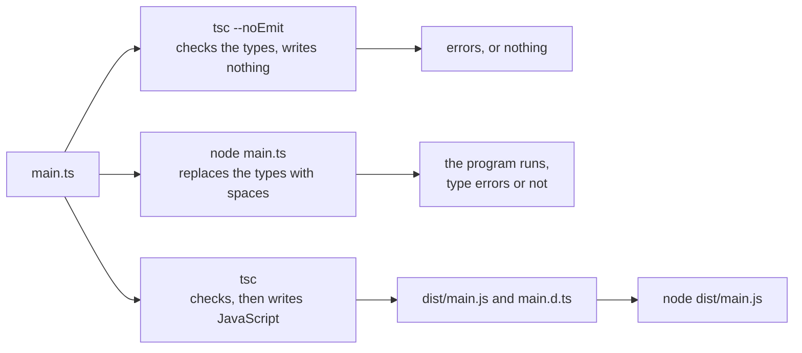

import { Tabs, TabItem } from '@astrojs/starlight/components';

Code: the files [`examples/l01_*`](https://github.com/spareilleux/learn/tree/a504f1c0571aa8ed15a8d9ca81616b5f050bf8cc/code/typescript-for-csharp-java/examples) and [`errors/l01_*`](https://github.com/spareilleux/learn/tree/a504f1c0571aa8ed15a8d9ca81616b5f050bf8cc/code/typescript-for-csharp-java/errors), the project [`l01-emit`](https://github.com/spareilleux/learn/tree/a504f1c0571aa8ed15a8d9ca81616b5f050bf8cc/code/typescript-for-csharp-java/l01-emit), the course's [`tsconfig.json`](https://github.com/spareilleux/learn/blob/a504f1c0571aa8ed15a8d9ca81616b5f050bf8cc/code/typescript-for-csharp-java/tsconfig.json), and the C# and Java sides in [`compare_fail/l01_types.cs`](https://github.com/spareilleux/learn/blob/a504f1c0571aa8ed15a8d9ca81616b5f050bf8cc/code/typescript-for-csharp-java/compare_fail/l01_types.cs) and [`compare_fail/L01Types.java`](https://github.com/spareilleux/learn/blob/a504f1c0571aa8ed15a8d9ca81616b5f050bf8cc/code/typescript-for-csharp-java/compare_fail/L01Types.java).

## Types that disappear

In C# and Java, the compiler and the runtime agree on the types. `csc` refuses a program that doesn't type-check, and the types it checked are still there in the IL, where the CLR verifies casts and `typeof(T)` returns a real type. [TypeScript](https://www.typescriptlang.org/) works differently: it is JavaScript with type annotations, the compiler checks them, and nothing of them reaches the program that runs.

| | C# | Java | TypeScript |
|---|---|---|---|
| Compiler | `csc`, through `dotnet build` | `javac` | `tsc` |
| What it produces | IL, with the types | bytecode, with most of the types | JavaScript, without the types, or nothing at all |
| A type error | no assembly | no class file | a message; the JavaScript is written anyway, and Node.js runs the `.ts` file anyway |
| Types at run time | all of them, generics included | classes, not generic arguments | none |
| A cast to the wrong type | `InvalidCastException` | `ClassCastException` | nothing: `as` checks nothing ([lesson 3](../03-unions-and-narrowing/)) |

So a TypeScript project has two separate steps where a .NET project has one: *checking* the types, which `tsc` does, and *running* the code, which a JavaScript engine does after the types have been removed, either by `tsc` itself or, since Node.js 23.6, by Node.js.



Nothing forces the first path before the others. That is the most important difference with C#, and this lesson shows it on real output before anything else.

## TypeScript 5, 6 and 7

The compiler changed more in the last year than in the ten before:

| Version | Released | What changed |
|---|---|---|
| [5.9](https://devblogs.microsoft.com/typescript/announcing-typescript-5-9/) | August 2025 | the last release of the 5.x line, the compiler written in TypeScript |
| [6.0](https://devblogs.microsoft.com/typescript/announcing-typescript-6-0/) | March 2026 | the last compiler written in TypeScript: new defaults (`strict` on, `module` `esnext`, `types` empty) and deprecations of old options |
| [7.0](https://devblogs.microsoft.com/typescript/announcing-typescript-7-0/) | July 2026 | the compiler [ported to Go](https://github.com/microsoft/typescript-go), a native executable, with the defaults of 6.0 and the deprecated options removed |

TypeScript 7 is built to report the same errors as TypeScript 6.0 on the same code, and its announcement measures full builds 8 to 12 times faster. On my machine, checking the application project of GA's component library took 14.7 seconds with TypeScript 5.9.3 and 1.9 seconds with 7.0.2. What 7.0 doesn't have yet is a programmatic API: tools that load the compiler as a library, such as typescript-eslint or the language tools of Astro, Vue and Svelte, still need TypeScript 6, which the team publishes as `@typescript/typescript6` with a `tsc6` command, to install next to 7. This course uses **TypeScript 7.0.2**, the latest release on 14 September 2026.

## Installing the compiler

TypeScript is an npm package, installed in each project as a development dependency, like a [local .NET tool](https://learn.microsoft.com/dotnet/core/tools/local-tools-how-to-use) pinned in a manifest. There is no global installation to keep in sync: the version in `package-lock.json` is the version everyone gets.

<Tabs syncKey="os">
<TabItem label="Windows">

```powershell
New-Item -ItemType Directory typescript-course | Set-Location
npm init -y
npm install --save-dev --save-exact typescript@7.0.2 @types/node@24.13.4
npx tsc --version
Get-ChildItem node_modules\@typescript -Name
```

```text
Version 7.0.2
typescript-win32-x64
```

</TabItem>
<TabItem label="Linux / WSL">

```bash
mkdir typescript-course && cd typescript-course
npm init -y
npm install --save-dev --save-exact typescript@7.0.2 @types/node@24.13.4
npx tsc --version
ls node_modules/@typescript
```

```text
Version 7.0.2
typescript-linux-x64
```

</TabItem>
<TabItem label="macOS">

```bash
mkdir typescript-course && cd typescript-course
npm init -y
npm install --save-dev --save-exact typescript@7.0.2 @types/node@24.13.4
npx tsc --version
ls node_modules/@typescript
```

```text
Version 7.0.2
typescript-darwin-arm64
```

</TabItem>
</Tabs>

The last line differs, and it is the new part. The `typescript` package lists one package per platform as optional dependencies, and npm installs only the one that matches the machine: the Go executable for Windows x64, Linux x64 or macOS on Apple silicon. The course's CI prints that line on its three runners. `@types/node` holds the type declarations of Node.js's API, `process`, `node:fs` and the rest, versioned like Node.js 24; `--save-exact` writes `7.0.2` instead of `^7.0.2` in `package.json` ([JavaScript lesson 1](../../javascript-for-csharp-java/01-node-npm-modules/#npm-and-packagejson) explains the difference).

`npx tsc` runs the compiler from `node_modules/.bin`; so does `"typecheck": "tsc"` in the `scripts` of `package.json`, which is how the course's [`package.json`](https://github.com/spareilleux/learn/blob/a504f1c0571aa8ed15a8d9ca81616b5f050bf8cc/code/typescript-for-csharp-java/package.json) runs it.

## tsconfig.json

A `tsconfig.json` is to `tsc` what a `.csproj` is to `dotnet build`: the files of the project and the options of the compiler. `npx tsc --init` writes a commented one:

```text
> npx tsc --init

Created a new tsconfig.json

You can learn more at https://aka.ms/tsconfig
```

```jsonc
{
  // Visit https://aka.ms/tsconfig to read more about this file
  "compilerOptions": {
    // File Layout
    // "rootDir": "./src",
    // "outDir": "./dist",

    // Environment Settings
    // See also https://aka.ms/tsconfig/module
    "module": "nodenext",
    "target": "esnext",
    "types": [],
    // For nodejs:
    // "lib": ["esnext"],
    // "types": ["node"],
    // and npm install -D @types/node

    // Other Outputs
    "sourceMap": true,
    "declaration": true,
    "declarationMap": true,

    // Stricter Typechecking Options
    "noUncheckedIndexedAccess": true,
    "exactOptionalPropertyTypes": true,

    // Style Options
    // "noImplicitReturns": true,
    // "noImplicitOverride": true,
    // "noUnusedLocals": true,
    // "noUnusedParameters": true,
    // "noFallthroughCasesInSwitch": true,
    // "noPropertyAccessFromIndexSignature": true,

    // Recommended Options
    "strict": true,
    "jsx": "react-jsx",
    "verbatimModuleSyntax": true,
    "isolatedModules": true,
    "noUncheckedSideEffectImports": true,
    "moduleDetection": "force",
    "skipLibCheck": true,
  }
}
```

It is a starting point for a library published to npm, with declaration files and source maps. The course runs its files with Node.js and only asks `tsc` to check them, so its [`tsconfig.json`](https://github.com/spareilleux/learn/blob/a504f1c0571aa8ed15a8d9ca81616b5f050bf8cc/code/typescript-for-csharp-java/tsconfig.json) follows the settings that [Node.js recommends](https://nodejs.org/docs/latest-v24.x/api/typescript.html#type-stripping) for type stripping:

```jsonc
{
  // The course's compiler options: Node.js 24 runs the .ts files itself, tsc only checks them
  "compilerOptions": {
    "noEmit": true,
    "target": "esnext",
    "lib": ["esnext"],
    "types": ["node"],
    "module": "nodenext",
    "rewriteRelativeImportExtensions": true,
    "erasableSyntaxOnly": true,
    "verbatimModuleSyntax": true,
    "strict": true,
    "skipLibCheck": true
  },
  "include": ["examples", "solutions"]
}
```

| Option | What it does | Closest thing in .NET |
|---|---|---|
| [`noEmit`](https://www.typescriptlang.org/tsconfig/#noEmit) | check only, write no JavaScript | a build that stops after the analyzers |
| [`target`](https://www.typescriptlang.org/tsconfig/#target) | the JavaScript version of the output; `esnext` keeps the syntax as written | — |
| [`lib`](https://www.typescriptlang.org/tsconfig/#lib) | the built-in APIs that exist, here ECMAScript only, without the browser's DOM | the target framework's base class library |
| [`types`](https://www.typescriptlang.org/tsconfig/#types) | the global declarations to load from `@types` packages; empty by default since 6.0 | package references that add global usings |
| [`module`](https://www.typescriptlang.org/tsconfig/#module) `nodenext` | resolve and check imports exactly as Node.js does, `"type"` of `package.json` included | — |
| [`rewriteRelativeImportExtensions`](https://www.typescriptlang.org/tsconfig/#rewriteRelativeImportExtensions) | allow `import './money.ts'`, and write `./money.js` in emitted code | — |
| [`erasableSyntaxOnly`](https://www.typescriptlang.org/tsconfig/#erasableSyntaxOnly) | refuse the syntax that Node.js can't strip (below) | — |
| [`verbatimModuleSyntax`](https://www.typescriptlang.org/tsconfig/#verbatimModuleSyntax) | require `import type` for types, so that removing types never changes an import | — |
| [`strict`](https://www.typescriptlang.org/tsconfig/#strict) | a family of checks, `strictNullChecks` among them; on by default since 6.0 | `<Nullable>enable</Nullable>`, and more |
| [`skipLibCheck`](https://www.typescriptlang.org/tsconfig/#skipLibCheck) | don't check the `.d.ts` files of packages | — |

`strict` is written out even though it is the default: code copied to a project that still sets `"strict": false` should fail loudly rather than quietly lose its checks. [Lesson 2](../02-structural-typing/) opens the family.

## A type error stops nothing

An order from a CSV file, where every price arrives as text:

```ts
// errors/l01_order.ts
interface Line {
  product: string;
  price: number;
  quantity: number;
}

function withTax(line: Line): number {
  return line.price + line.price * 0.15;
}

// The prices come from a CSV file, where everything is text
const lines: Line[] = [
  { product: 'capo', price: '9.99', quantity: 2 },
  { product: 'strings', price: 12.5, quantity: 1 },
];
for (const line of lines) {
  console.log(line.product, withTax(line) * line.quantity);
}
```

`tsc` sees the problem:

```text
> npx tsc -p out/tsconfig.l01_order.json --pretty
errors/l01_order.ts:14:22 - error TS2322: Type 'string' is not assignable to type 'number'.

14   { product: 'capo', price: '9.99', quantity: 2 },
                        ~~~~~

  errors/l01_order.ts:4:3 - The expected type comes from property 'price' which is declared here on type 'Line'
    4   price: number;
        ~~~~~


Found 1 error in errors/l01_order.ts:14
```

The same line in C#, where `Line` is a record with a `decimal` price, and in Java:

```text
> dotnet run l01_types.cs
compare_fail/l01_types.cs(4,22): error CS1503: Argument 2: cannot convert from 'string' to 'decimal'

The build failed. Fix the build errors and run again.
```

```text
> javac L01Types.java
L01Types.java:6: error: incompatible types: String cannot be converted to double
        var lines = new Line[] { new Line("capo", "9.99", 2), new Line("strings", 12.5, 1) };
                                                  ^
Note: Some messages have been simplified; recompile with -Xdiags:verbose to get full output
1 error
```

So far the three languages agree. Now run the file:

```text
> node errors/l01_order.ts
capo NaN
strings 14.375
```

Node.js ran it, and the program printed `NaN` for the capo without an exception. `line.price` holds the string `'9.99'`, so `line.price + line.price * 0.15` concatenates `'9.99'` and `1.4985` into `'9.991.4985'`, and multiplying that string by the quantity gives `NaN` ([JavaScript lesson 2](../../javascript-for-csharp-java/02-values-and-types/#conversions----parsing-and-truthiness) explains the two meanings of `+`). The type annotation `price: number` was a promise to `tsc`, and Node.js never reads it.

In a .NET solution, a type error means there is no program to run. In a TypeScript project, it means there is a message, and the project decides what the message stops: a `typecheck` script in CI, a pre-commit hook, the editor. A project that builds with a tool that only strips types, as Vite does, can ship code that `tsc` rejects, and the last section of this lesson finds such code in GA.

### tsc writes JavaScript even when it reports errors

Without `noEmit`, `tsc` also writes JavaScript. The project [`l01-emit`](https://github.com/spareilleux/learn/tree/a504f1c0571aa8ed15a8d9ca81616b5f050bf8cc/code/typescript-for-csharp-java/l01-emit) extends the course's options and writes to `dist`:

```ts
// l01-emit/src/money.ts
export type Currency = 'CAD' | 'EUR';

export interface Money {
  readonly cents: number;
  readonly currency: Currency;
}

export function add(a: Money, b: Money): Money {
  if (a.currency !== b.currency) throw new Error(`${a.currency} + ${b.currency}`);
  return { cents: a.cents + b.cents, currency: a.currency };
}

export function formatMoney(money: Money): string {
  return `${(money.cents / 100).toFixed(2)} ${money.currency}`;
}
```

```ts
// l01-emit/src/main.ts
import { add, formatMoney, type Money } from './money.ts';

const capo: Money = { cents: 999, currency: 'CAD' };
const strings = { cents: 1250, currency: 'CAD' } satisfies Money;
const shipping: Money = { cents: '500', currency: 'CAD' }; // a type error: tsc reports it, and writes the files anyway

console.log(formatMoney(add(add(capo, strings), shipping)));
```

```text
> npx tsc
src/main.ts(6,27): error TS2322: Type 'string' is not assignable to type 'number'.
> ls dist
dist/main.d.ts
dist/main.js
dist/money.d.ts
dist/money.js
```

`tsc` exited with code 2, which means "errors, and the files were written anyway", and `dist/main.js` runs:

```js
// l01-emit/src/main.ts
import { add, formatMoney } from './money.js';
const capo = { cents: 999, currency: 'CAD' };
const strings = { cents: 1250, currency: 'CAD' };
const shipping = { cents: '500', currency: 'CAD' }; // a type error: tsc reports it, and writes the files anyway
console.log(formatMoney(add(add(capo, strings), shipping)));
```

```text
> node dist/main.js
22495.00 CAD
```

The types are gone, the `import` lost `type Money` and now names `./money.js`, and the shipping cost `'500'` was concatenated to the sum: 2,249 cents followed by the text `500` makes `2249500` cents. The option [`noEmitOnError`](https://www.typescriptlang.org/tsconfig/#noEmitOnError) makes `tsc` write nothing when it finds an error (exercise 3). `dist/money.d.ts` keeps what the JavaScript lost, the types of what the module exports, for the projects that import it; it plays the role of the metadata of a .NET assembly:

```ts
export type Currency = 'CAD' | 'EUR';
export interface Money {
    readonly cents: number;
    readonly currency: Currency;
}
export declare function add(a: Money, b: Money): Money;
export declare function formatMoney(money: Money): string;
```

## Reading a diagnostic

A `tsc` message gives the file, the line and column, the severity, a code and a text, and then, with `--pretty`, the line itself with `~~~` under the problem. The indented part is related information: `The expected type comes from property 'price'` points to the declaration that set the expectation, where C# would only say what it couldn't convert.

`--pretty` is the default in a terminal, and `--pretty false` prints one line per error, in the `file(line,col): error CODE: text` format of MSBuild and `csc`, which editors and CI annotations read:

```text
> npx tsc --pretty false
src/main.ts(6,27): error TS2322: Type 'string' is not assignable to type 'number'.
```

The codes are grouped by number, loosely, in the compiler's [message catalog](https://github.com/microsoft/TypeScript/blob/v6.0.3/src/compiler/diagnosticMessages.json): the 1000s are mostly syntax, the 2000s type checking, the 5000s options and configuration, the 6000s the texts of the command line, the 7000s implicit `any`, and the 18000s newer checks. `TS2322`, "Type … is not assignable to type …", is the one you will meet most.

One configuration error surprises everyone who types `tsc file.ts`, as you would type `javac File.java`:

```text
> npx tsc errors/l01_order.ts
error TS5112: tsconfig.json is present but will not be loaded if files are specified on commandline. Use '--ignoreConfig' to skip this error.
```

Since TypeScript 6.0, a file name on the command line in a folder that has a `tsconfig.json` is an error, because the file would have been checked with the default options instead of the project's. `npx tsc` checks the project; `npx tsc --ignoreConfig file.ts` checks one file with the defaults. The course's `check.sh` checks each error snippet alone by giving it a two-line `tsconfig.json` that extends the course's, which is the `-p out/tsconfig.l01_order.json` above.

:::note[Outputs in this course]
The outputs are those of Node.js 24.21.0, TypeScript 7.0.2, .NET 10 and Java 25. Paths are shown relative to the course folder, stack frames and colors are removed, and a process ID is shown as `PID`; [`normalize.mjs`](https://github.com/spareilleux/learn/blob/a504f1c0571aa8ed15a8d9ca81616b5f050bf8cc/code/typescript-for-csharp-java/normalize.mjs) makes the same changes before the CI compares the outputs on Windows, Linux and macOS, where they are identical.
:::

## Running TypeScript with Node.js

Node.js 24 runs a `.ts` file directly. It doesn't compile it: it replaces the type annotations with spaces, a feature called [type stripping](https://nodejs.org/docs/latest-v24.x/api/typescript.html#type-stripping), enabled by default since Node.js 23.6 and marked stable in 24.12. The function that does it is public, as [`module.stripTypeScriptTypes`](https://nodejs.org/docs/latest-v24.x/api/module.html#modulestriptypescripttypescode-options):

```ts
// examples/l01_strip.ts
import { stripTypeScriptTypes } from 'node:module';

// What Node.js runs: the same text, with the types replaced by spaces
const source = `interface Line {
  price: number;
  quantity: number;
}
export function total(lines: readonly Line[]): number {
  let sum: number = 0;
  for (const line of lines) sum += line.price * line.quantity;
  return sum;
}
const empty = [] as Line[];`;
console.log(stripTypeScriptTypes(source));
```

```text
                
                
                   
 
export function total(lines                 )         {
  let sum         = 0;
  for (const line of lines) sum += line.price * line.quantity;
  return sum;
}
const empty = []          ;
(node:PID) ExperimentalWarning: stripTypeScriptTypes is an experimental feature and might change at any time
(Use `node --trace-warnings ...` to show where the warning was created)
```

The interface became blank lines and each annotation became as many spaces as it had characters, so every remaining character keeps its line and column. That is why an error in a `.ts` file points to the right place without a source map. The warning comes from the function, still marked *release candidate* in the documentation; running a `.ts` file prints none.

Node.js reads a `.ts` file as it reads a `.js` file: the nearest `package.json` decides between ES module and CommonJS, and `.mts` and `.cts` force the choice, like `.mjs` and `.cjs`. Node.js ignores `tsconfig.json` entirely and checks no types.

### What Node.js refuses

Stripping only works on syntax that disappears without leaving a hole. A few TypeScript features generate JavaScript instead, and Node.js refuses them:

```ts
// errors/l01_not_erasable.ts
class Price {
  constructor(private readonly cents: number) {} // a parameter property declares and assigns a field
  toString() {
    return (this.cents / 100).toFixed(2);
  }
}

namespace Tax {
  export const rate = 0.15;
}

const price = <Price>new Price(999); // the old cast syntax
console.log(`${price}`, Tax.rate);
```

```text
> node errors/l01_not_erasable.ts
node:internal/modules/run_main:107
    triggerUncaughtException(
    ^

errors/l01_not_erasable.ts:3
class Price {
  constructor(private readonly cents: number) {} // a parameter property declares and assigns a field
                               ^^^^^^^^^^^^^
  toString() {

SyntaxError [ERR_UNSUPPORTED_TYPESCRIPT_SYNTAX]: TypeScript parameter property is not supported in strip-only mode
{
  code: 'ERR_UNSUPPORTED_TYPESCRIPT_SYNTAX'
}

Node.js v24.21.0
```

Node.js stops at the first one. With `erasableSyntaxOnly`, `tsc` reports all three before anything runs:

```text
> npx tsc -p out/tsconfig.l01_not_erasable.json --pretty
errors/l01_not_erasable.ts:3:15 - error TS1294: This syntax is not allowed when 'erasableSyntaxOnly' is enabled.

3   constructor(private readonly cents: number) {} // a parameter property declares and assigns a field
                ~~~~~~~~~~~~~~~~~~~~~~~~~~~~~~

errors/l01_not_erasable.ts:9:11 - error TS1294: This syntax is not allowed when 'erasableSyntaxOnly' is enabled.

9 namespace Tax {
            ~~~

errors/l01_not_erasable.ts:13:15 - error TS1294: This syntax is not allowed when 'erasableSyntaxOnly' is enabled.

13 const price = <Price>new Price(999); // the old cast syntax
                 ~~~~~~~


Found 3 errors in the same file, starting at: errors/l01_not_erasable.ts:3
```

| Refused | What it generates | What to write instead |
|---|---|---|
| a parameter property, `constructor(private readonly cents: number)` | a field and an assignment | the field, and the assignment in the constructor |
| a `namespace` that contains values | an object filled by a function | a module, one per file |
| an `enum` | an object with a reverse mapping | an object with `as const`, and a union type (exercise 2) |
| `<Price>value`, the old assertion syntax | nothing, and Node.js refuses the syntax | `value as Price` |

A namespace that only contains types is accepted, since it disappears. C# developers reach for `enum` first, and it is the one to unlearn:

```ts
// errors/l01_enum.ts
enum Currency {
  CAD,
  EUR,
}

console.log(Currency.EUR, Currency[1]);
```

```text
> node errors/l01_enum.ts
node:internal/modules/run_main:107
    triggerUncaughtException(
    ^

errors/l01_enum.ts:2
    // errors/l01_enum.ts
  > enum Currency {
      CAD,
      EUR,
  > }

SyntaxError [ERR_UNSUPPORTED_TYPESCRIPT_SYNTAX]: TypeScript enum is not supported in strip-only mode
{
  code: 'ERR_UNSUPPORTED_TYPESCRIPT_SYNTAX'
}

Node.js v24.21.0
```

Two tools run it anyway. Node.js's flag [`--experimental-transform-types`](https://nodejs.org/docs/latest-v24.x/api/cli.html#--experimental-transform-types) generates the JavaScript, with a warning, and [tsx](https://tsx.hirok.io/), a package built on esbuild, runs any TypeScript file without checking it either:

```text
> node --experimental-transform-types errors/l01_enum.ts
(node:PID) ExperimentalWarning: Transform Types is an experimental feature and might change at any time
(Use `node --trace-warnings ...` to show where the warning was created)
1 EUR
> npx tsx errors/l01_enum.ts
1 EUR
```

Both print `1 EUR`: `Currency.EUR` is `1`, and `Currency[1]` is the reverse mapping back to the name. The course keeps to erasable syntax, which runs with plain `node`, needs no extra package, and reads the same before and after stripping.

### Imports: the extension, and type

Node.js needs the real file name in an import, `.ts` included ([JavaScript lesson 1](../../javascript-for-csharp-java/01-node-npm-modules/#mixing-them-up) showed the same rule for `.js`). An import written the way many TypeScript projects write them:

```ts
// errors/l01_imports.ts
import { formatMoney, Money } from '../examples/l01_money';

const price: Money = { cents: 999, currency: 'CAD' };
console.log(formatMoney(price));
```

```text
> npx tsc -p out/tsconfig.l01_imports.json --pretty
errors/l01_imports.ts:2:36 - error TS2835: Relative import paths need explicit file extensions in ECMAScript imports when '--moduleResolution' is 'node16' or 'nodenext'. Did you mean '../examples/l01_money.js'?

2 import { formatMoney, Money } from '../examples/l01_money';
                                     ~~~~~~~~~~~~~~~~~~~~~~~


Found 1 error in errors/l01_imports.ts:2
> node errors/l01_imports.ts
node:internal/modules/esm/resolve:272
    throw new ERR_MODULE_NOT_FOUND(
          ^

Error [ERR_MODULE_NOT_FOUND]: Cannot find module 'examples/l01_money' imported from errors/l01_imports.ts
{
  code: 'ERR_MODULE_NOT_FOUND',
  url: 'examples/l01_money'
}

Node.js v24.21.0
```

With `module` set to `nodenext`, `tsc` reports the error Node.js will throw, and suggests `.js`, the extension that a project compiled to JavaScript would import; for Node.js's type stripping, the right extension is `.ts`. With the extension, a second error appears:

```ts
// errors/l01_type_import.ts
import { formatMoney, Money } from '../examples/l01_money.ts';

const price: Money = { cents: 999, currency: 'CAD' };
console.log(formatMoney(price));
```

```text
> npx tsc -p out/tsconfig.l01_type_import.json --pretty
errors/l01_type_import.ts:2:23 - error TS1484: 'Money' is a type and must be imported using a type-only import when 'verbatimModuleSyntax' is enabled.

2 import { formatMoney, Money } from '../examples/l01_money.ts';
                        ~~~~~


Found 1 error in errors/l01_type_import.ts:2
> node errors/l01_type_import.ts
errors/l01_type_import.ts:2
import { formatMoney, Money } from '../examples/l01_money.ts';
                      ^^^^^
SyntaxError: The requested module '../examples/l01_money.ts' does not provide an export named 'Money'

Node.js v24.21.0
```

Stripping works file by file, so Node.js can't know that `Money` is a type in the other file: it keeps the name in the `import`, and the module that exports it has no such value. `import { formatMoney, type Money }` marks the name as a type, and removes it with the other annotations. `verbatimModuleSyntax` makes `tsc` require that marker. The corrected file, [`examples/l01_imports.ts`](https://github.com/spareilleux/learn/blob/a504f1c0571aa8ed15a8d9ca81616b5f050bf8cc/code/typescript-for-csharp-java/examples/l01_imports.ts):

```ts
// examples/l01_imports.ts
import { formatMoney, type Money } from './l01_money.ts';

const price: Money = { cents: 999, currency: 'CAD' };
console.log(formatMoney(price));
```

```text
> node examples/l01_imports.ts
9.99 CAD
```

## In real projects

**GuitarAlchemist/ga** has two React front ends in TypeScript, at commit [`a826864`](https://github.com/GuitarAlchemist/ga/commit/a826864f3a012cad88e415954bf57eca0ce12aa6). Their `package.json` files ask for `typescript` `^5.5.3`, and their `build` script is `vite build` ([`ga-client/package.json`, line 13](https://github.com/GuitarAlchemist/ga/blob/a826864f3a012cad88e415954bf57eca0ce12aa6/Apps/ga-client/package.json#L13)). [Vite](https://vite.dev/guide/features.html#typescript) strips the types with esbuild and, as its documentation says, doesn't check them; the check is a separate `build:with-types` script, `tsc -b && vite build`. I cloned the repository into a scratch folder, installed the dependencies and ran `tsc -b` with TypeScript 5.9.3:

- [`Apps/ga-client`](https://github.com/GuitarAlchemist/ga/tree/a826864f3a012cad88e415954bf57eca0ce12aa6/Apps/ga-client) reports 346 errors, 165 of them `TS6133` for unused variables. Among the rest, [`ChatInterface.tsx`](https://github.com/GuitarAlchemist/ga/blob/a826864f3a012cad88e415954bf57eca0ce12aa6/Apps/ga-client/src/components/Chat/ChatInterface.tsx#L219) uses `VIRTUALIZATION_THRESHOLD` and `VirtualizedMessageList` at lines 69, 219, 254 and 255, and nothing defines or imports them: `TS2304: Cannot find name 'VIRTUALIZATION_THRESHOLD'`. The names have been missing since the file's first commit. Line 219 is in the component's JSX, so rendering the page `/ai-copilot` should throw a `ReferenceError` (*to verify* in a browser).
- [`ReactComponents/ga-react-components`](https://github.com/GuitarAlchemist/ga/tree/a826864f3a012cad88e415954bf57eca0ce12aa6/ReactComponents/ga-react-components) reports 186 errors. Its lock file no longer matches its `package.json` (`pnpm install --frozen-lockfile` refuses it: 21 dependencies were added without updating the lock file), so I installed without it, and some of those errors may depend on the versions I got.

Its application project alone, `tsc -p tsconfig.app.json`, reports 180 errors in 14.7 seconds with TypeScript 5.9.3, and 197 in 1.9 seconds with TypeScript 7.0.2. Most of the difference is the new default of `types`: a script that uses `process`, `fs` and `__dirname` gets `TS2591: Cannot find name 'process'. Do you need to install type definitions for node?`, and `"types": ["node"]` in that project's options brings them back, as the [6.0 release notes](https://www.typescriptlang.org/docs/handbook/release-notes/typescript-6-0.html) predict.

**This site** has a [`tsconfig.json`](https://github.com/spareilleux/learn/blob/8ba378e7ea22a64a57b3e45b45afa4c85afa85a3/tsconfig.json) that extends Astro's `strict` preset, and no `typescript` dependency at all: Astro strips types with Vite, and only the editor reads the file. Checked with `npx -p typescript@7.0.2 tsc --noEmit` at commit [`8ba378e`](https://github.com/spareilleux/learn/commit/8ba378e7ea22a64a57b3e45b45afa4c85afa85a3), it reports three errors, and none of them breaks the site: `astro:content` is a module that exists only after `astro sync` generates its declarations, the JavaScript course's error snippet about private fields is picked up by the `**/*` pattern, and the sidebar that `astro.config.mjs` imports from `src/streeling-sidebar.json` doesn't match Starlight's type for sidebar items, which [lesson 3](../03-unions-and-narrowing/) explains. The TypeScript 7 announcement says that Astro's own tooling still needs TypeScript 6.

## Key takeaways

- TypeScript's types exist only for `tsc`: Node.js, Vite and esbuild remove them without reading them, and nothing checks them at run time.
- A type error doesn't stop a program from running, nor `tsc` from writing JavaScript. Make `tsc --noEmit` a step of your build and CI, or set `noEmitOnError`.
- TypeScript 7 is the same type checker as 6.0, ported to Go and several times faster; tools that need the compiler's API stay on 6.0 for now.
- Install TypeScript per project with npm; `tsconfig.json` is the project file, and `tsc file.ts` next to one is an error since 6.0.
- Node.js 24 strips types from `.ts` files; it refuses `enum`, parameter properties, namespaces with values and `<T>` assertions. `erasableSyntaxOnly` and `verbatimModuleSyntax` make `tsc` refuse them first.
- For Node.js, import `./file.ts` with its extension, and import types with `import type`.

## Exercises

1. Fix [`errors/l01_order.ts`](https://github.com/spareilleux/learn/blob/a504f1c0571aa8ed15a8d9ca81616b5f050bf8cc/code/typescript-for-csharp-java/errors/l01_order.ts) so that `tsc` accepts it and it prints the right totals, with the rows of the CSV as arrays of strings. Where should the conversion happen?

<details>
<summary>Solution</summary>

At the border, once: the rest of the program then works with a `Line` whose `price` really is a number. [`solutions/l01_ex1_order.ts`](https://github.com/spareilleux/learn/blob/a504f1c0571aa8ed15a8d9ca81616b5f050bf8cc/code/typescript-for-csharp-java/solutions/l01_ex1_order.ts):

```ts
// solutions/l01_ex1_order.ts
interface Line {
  product: string;
  price: number;
  quantity: number;
}

function withTax(line: Line): number {
  return line.price + line.price * 0.15;
}

// The CSV gives text: convert it once, at the border, and refuse what isn't a price
function parsePrice(text: string): number {
  if (!/^\d+(\.\d{1,2})?$/.test(text)) throw new TypeError(`not a price: ${JSON.stringify(text)}`);
  return Number(text);
}

const rows = [
  ['capo', '9.99', '2'],
  ['strings', '12.5', '1'],
] as const;
const lines: Line[] = rows.map(([product, price, quantity]) => ({
  product,
  price: parsePrice(price),
  quantity: Number.parseInt(quantity, 10),
}));
for (const line of lines) {
  console.log(line.product, (withTax(line) * line.quantity).toFixed(2));
}
```

```text
capo 22.98
strings 14.38
```

`as const` makes each row a tuple of three strings, so the destructuring in `map` gets `product`, `price` and `quantity` as strings, and `tsc` would reject `price` in a field typed `number` until it goes through `parsePrice`. [JavaScript lesson 2](../../javascript-for-csharp-java/02-values-and-types/#conversions----parsing-and-truthiness) explains why the regular expression comes before `Number`. `tsc` checks that the conversion happens; it can't check that it is right.

</details>

2. Rewrite [`errors/l01_not_erasable.ts`](https://github.com/spareilleux/learn/blob/a504f1c0571aa8ed15a8d9ca81616b5f050bf8cc/code/typescript-for-csharp-java/errors/l01_not_erasable.ts) with erasable syntax only, and add a `Currency` that would have been an `enum`, so that `node` runs it without a flag.

<details>
<summary>Solution</summary>

[`solutions/l01_ex2_erasable.ts`](https://github.com/spareilleux/learn/blob/a504f1c0571aa8ed15a8d9ca81616b5f050bf8cc/code/typescript-for-csharp-java/solutions/l01_ex2_erasable.ts):

```ts
// solutions/l01_ex2_erasable.ts
// An enum becomes an object marked as const, and a union type of its values
const Currency = { CAD: 'CAD', EUR: 'EUR' } as const;
type Currency = (typeof Currency)[keyof typeof Currency];

// A parameter property becomes a field and an assignment
class Price {
  readonly #cents: number;
  readonly currency: Currency;
  constructor(cents: number, currency: Currency) {
    this.#cents = cents;
    this.currency = currency;
  }
  toString() {
    return `${(this.#cents / 100).toFixed(2)} ${this.currency}`;
  }
}

// A namespace becomes a module, or here a frozen object
const Tax = Object.freeze({ rate: 0.15 });

const price = new Price(999, Currency.EUR); // no assertion needed: new Price already has the type Price
console.log(`${price}`, Tax.rate, Object.values(Currency));
```

```text
9.99 EUR 0.15 [ 'CAD', 'EUR' ]
```

The name `Currency` is used twice, once as a value and once as a type, which TypeScript allows because values and types live in separate spaces. `(typeof Currency)[keyof typeof Currency]` reads "the type of any property of the object", here `'CAD' | 'EUR'`; lesson 4 explains `keyof` and indexed types. Unlike the `enum`, the object has no reverse mapping and its values are the strings themselves, which is also what a JSON payload contains. The private field `#cents` replaces `private`: it is enforced by the engine, as [JavaScript lesson 4](../../javascript-for-csharp-java/04-objects-prototypes-classes/#classes) shows, where `private` is checked by `tsc` only.

</details>

3. Copy `l01-emit`'s configuration with `"noEmitOnError": true`, delete `dist`, and run `tsc`. What does it write, and what exit code does it return?

<details>
<summary>Solution</summary>

[`solutions/l01-ex3/tsconfig.json`](https://github.com/spareilleux/learn/blob/a504f1c0571aa8ed15a8d9ca81616b5f050bf8cc/code/typescript-for-csharp-java/solutions/l01-ex3/tsconfig.json) extends `l01-emit`'s configuration:

```jsonc
{
  // Exercise 3: l01-emit's project, with noEmitOnError
  "extends": "../../l01-emit/tsconfig.json",
  "compilerOptions": {
    "noEmitOnError": true,
    "rootDir": "../../l01-emit/src",
    "outDir": "dist"
  },
  "include": ["../../l01-emit/src"]
}
```

```text
> npx tsc --pretty false
../../l01-emit/src/main.ts(6,27): error TS2322: Type 'string' is not assignable to type 'number'.
> node -e "console.log('dist exists:', require('node:fs').existsSync('dist'))"
dist exists: false
```

The same error, no `dist` folder, and exit code 1 instead of 2: 1 means that errors prevented the output, 2 that the output was written despite errors. That is the behavior of `dotnet build`, and the setting to use when `tsc` produces what you deploy. `extends` inherits the options of another file; relative paths in a configuration are resolved from the file that contains them, which is why `rootDir` and `include` are repeated here.

</details>

## Sources

- [TypeScript — Announcing TypeScript 7.0](https://devblogs.microsoft.com/typescript/announcing-typescript-7-0/), [TypeScript 6.0 release notes](https://www.typescriptlang.org/docs/handbook/release-notes/typescript-6-0.html), [TSConfig reference](https://www.typescriptlang.org/tsconfig/), [Modules — Theory](https://www.typescriptlang.org/docs/handbook/modules/theory.html)
- [Node.js — Modules: TypeScript](https://nodejs.org/docs/latest-v24.x/api/typescript.html), [`module.stripTypeScriptTypes`](https://nodejs.org/docs/latest-v24.x/api/module.html#modulestriptypescripttypescode-options), [`--experimental-transform-types`](https://nodejs.org/docs/latest-v24.x/api/cli.html#--experimental-transform-types)
- [microsoft/typescript-go](https://github.com/microsoft/typescript-go), the Go port; [tsx](https://tsx.hirok.io/); [Vite — TypeScript](https://vite.dev/guide/features.html#typescript)
- [Microsoft — Local .NET tools](https://learn.microsoft.com/dotnet/core/tools/local-tools-how-to-use)
