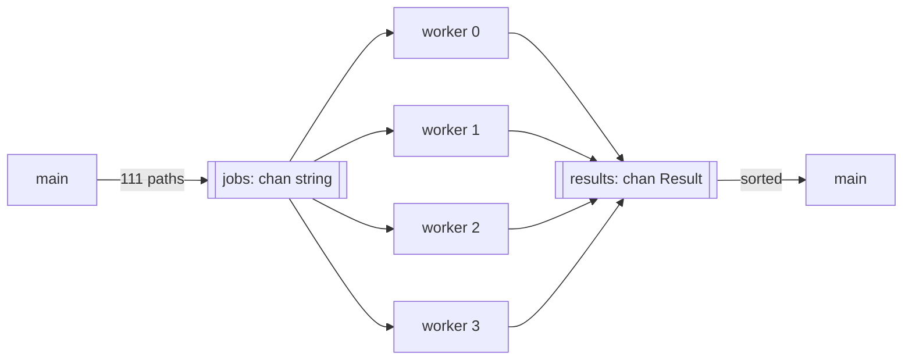

Code: [`examples/l07_spawn.v`](https://github.com/spareilleux/learn/blob/bb5c13f2e8e9b85d3a3613d2df53726465afb4ab/code/v-for-csharp-java/examples/l07_spawn.v), [`examples/l07_channels.v`](https://github.com/spareilleux/learn/blob/bb5c13f2e8e9b85d3a3613d2df53726465afb4ab/code/v-for-csharp-java/examples/l07_channels.v) and [`examples/l07_shared.v`](https://github.com/spareilleux/learn/blob/bb5c13f2e8e9b85d3a3613d2df53726465afb4ab/code/v-for-csharp-java/examples/l07_shared.v) — `v run examples/l07_channels.v` from `code/v-for-csharp-java`.

## Three tools

| | C# | Java | V |
|---|---|---|---|
| Run a function concurrently | [`Task.Run`](https://learn.microsoft.com/dotnet/api/system.threading.tasks.task.run), on the thread pool | [`CompletableFuture.supplyAsync`](https://docs.oracle.com/en/java/javase/25/docs/api/java.base/java/util/concurrent/CompletableFuture.html), [virtual threads](https://docs.oracle.com/en/java/javase/25/core/virtual-threads.html) | `spawn f()`, an OS thread |
| Wait for a result | `await task`, `Task.WhenAll` | `future.join()` | `h.wait()`, `threads.wait()` |
| Pass messages | [`System.Threading.Channels`](https://learn.microsoft.com/dotnet/core/extensions/channels) | [`BlockingQueue`](https://docs.oracle.com/en/java/javase/25/docs/api/java.base/java/util/concurrent/BlockingQueue.html) | `chan T`, `select` |
| Share memory | [`lock`](https://learn.microsoft.com/dotnet/csharp/language-reference/statements/lock), [`ReaderWriterLockSlim`](https://learn.microsoft.com/dotnet/api/system.threading.readerwriterlockslim) | `synchronized`, `ReentrantReadWriteLock` | `shared`, `lock`, `rlock` |
| Forget the lock | compiles | compiles | refused for `shared`, compiles for a `mut` reference |

Source: [Concurrency](https://docs.vlang.io/concurrency.html).

The examples compute, for each of ga's 111 projects, how many projects it references directly or through other projects. [`reachable`](https://github.com/spareilleux/learn/blob/bb5c13f2e8e9b85d3a3613d2df53726465afb4ab/code/v-for-csharp-java/examples/l07_spawn.v#L20-L34) walks the references with a stack and a set, so a project referenced twice, like `GA.Domain.Core` in the tree of lesson 6, counts once:

```v
fn (g Graph) reachable(from string) int {
	mut seen := map[string]bool{}
	mut stack := [from]
	for stack.len > 0 {
		p := stack.pop()
		for to in g.refs[p] {
			if to !in seen {
				seen[to] = true
				stack << to
			}
		}
	}
	return seen.len
}
```

:::note[Outputs that depend on timing]
A concurrent program doesn't always print the same thing. The examples print what depends on the machine or on timing on lines starting with `# `: the course's [`check.sh`](https://github.com/spareilleux/learn/blob/f6c34f637df430c031060cb89fb903e7c15be266/code/v-for-csharp-java/check.sh#L35-L45) prints those lines without comparing them, and compares the others on the three OSes. The `# ` values quoted below come from my machine (24 logical CPUs) or from the CI runners.
:::

## `spawn` and `wait`

`spawn` runs a call in a new thread, and returns a handle whose `wait()` returns the call's result ([`l07_spawn.v`, lines 46-72](https://github.com/spareilleux/learn/blob/bb5c13f2e8e9b85d3a3613d2df53726465afb4ab/code/v-for-csharp-java/examples/l07_spawn.v#L46-L72)):

```v
// One thread, one result
h := spawn g.reachable('Apps/GaCli/GaCli.fsproj')
println('GaCli: ${h.wait()} projects')

// One thread per project: wait() returns the results in the order of the threads
mut sw := time.new_stopwatch()
mut threads := []thread int{}
for p in projects {
	threads << spawn g.reachable(p)
}
counts := threads.wait()
parallel := sw.elapsed()
```

```text
111 projects, 87 with references
GaCli: 7 projects
111 results, the most: GA.Business.Core.Tests with 23
same results: true
```

`thread int` is the type of a handle whose function returns an `int`, like `Task<int>`. `wait()` on an array of handles waits for all of them and returns the results in the order of the array, like `await Task.WhenAll(tasks)`: `counts[i]` belongs to `projects[i]`, whatever the order in which the threads finish. The function itself is ordinary: nothing like `async` marks it.

`GA.Business.Core.Tests` references 23 of the 111 projects, directly or not. The parallel version is slower, though:

```text
# 111 threads: 5212 us, one thread: 439 us
```

On the CI runners, 5709 µs against 776 µs on Linux, 11707 µs against 939 µs on Windows. `spawn` creates an operating system thread each time, and 111 threads cost more than 111 walks of a small graph. `Task.Run` would have queued the 111 calls on the .NET thread pool, and Java's virtual threads are cheap to create. With `spawn`, create a few threads for work that lasts, as the next section does.

A thread that nobody waits for may not finish: `main` doesn't wait for it before exiting. In a small program that spawns `report('GaCli')` and then prints `main: done`, the line of the thread appeared once in five runs on my machine.

A function that returns a result gives a `thread !int`; `wait()` on the array then returns `![]int`, and the first error ends up in `or`:

```v
mut checks := []thread !int{}
for p in ['GaCli/GaCli.fsproj', 'Apps/GaCli/GaCli.fsproj'] {
	checks << spawn find(g, p)
}
found := checks.wait() or {
	println('wait: ${err.msg()}')
	[]int{}
}
println('found: ${found}')
```

```text
wait: no references from GaCli/GaCli.fsproj
found: []
```

The error of one thread discards the results of the others, as `await Task.WhenAll` throws when one task fails.

### `go` is `spawn`

The documentation says that `go foo()` runs `foo()` "in a lightweight thread managed by the V runtime". In V 0.5.2, the parser turns `go` into `spawn` unless the program is compiled with `-use-coroutines` ([`parser.v`, lines 1391-1405](https://github.com/vlang/v/blob/7647ce1c6fad63b5578bc07883139906de74b2f8/vlib/v/parser/parser.v#L1391-L1405)), an experimental option. Without it, `go` creates an OS thread too.

## Channels

A `chan T` passes values from one thread to another, like a `Channel<T>` in .NET or a `BlockingQueue<T>` in Java. `chan string{cap: 111}` holds up to 111 values; `chan string{}` holds none, and a send waits for a receiver.

[`l07_channels.v`](https://github.com/spareilleux/learn/blob/bb5c13f2e8e9b85d3a3613d2df53726465afb4ab/code/v-for-csharp-java/examples/l07_channels.v#L40-L83) starts four workers. `main` sends the project paths on `jobs` and closes it; each worker receives until the channel is closed and empty, and sends a `Result` on `results`:



```v
fn worker(id int, g Graph, jobs chan string, results chan Result) {
	for {
		project := <-jobs or { break }
		results <- Result{id, project, g.reachable(project)}
	}
}
```

```v
jobs := chan string{cap: projects.len}
results := chan Result{cap: projects.len}
mut workers := []thread{}
for id in 0 .. 4 {
	workers << spawn worker(id, g, jobs, results)
}
for p in projects {
	jobs <- p
}
jobs.close()
workers.wait()
results.close()
```

`<-jobs or { break }` is the receive of a closed and empty channel: the `or` block runs, like `await foreach (var p in reader.ReadAllAsync())` ending in C#. A channel doesn't need `mut` to be passed to a thread.

The results arrive in no particular order, and each worker handles a different share of the jobs:

```text
# results per worker: [32, 24, 28, 27]
111 results
# same order as the jobs: false
```

So `main` sorts them, by count and then by path, before printing:

```text
23 GA.Business.Core.Tests.csproj
21 AllProjects.AppHost.csproj
21 VectorSearchBenchmark.csproj
```

This output is the same on every run and every OS. With four workers or one, a sort after the collection is what makes it so.

### `select`

`select` waits for the first of several channel operations, with an optional timeout, like Go's `select`. .NET and Java have no direct equivalent; the nearest is `Task.WhenAny` on several reads.

```v
slow := chan int{}
fast := chan int{}
spawn fn (c chan int) {
	time.sleep(500 * time.millisecond)
	c <- 1
}(slow)
spawn fn (c chan int) {
	c <- 2
}(fast)
select {
	n := <-slow {
		println('# slow ${n}')
	}
	n := <-fast {
		println('select: fast ${n}')
	}
	2 * time.second {
		println('select: timeout')
	}
}
```

```text
select: fast 2
```

The anonymous functions receive the channels as parameters: a closure sees only the variables listed in `[…]`, as the rejected snippets below show.

### A closed channel

The documentation says that pushing to a closed channel results "in a runtime panic". V 0.5.2 doesn't panic:

```v
closed := chan string{cap: 2}
closed <- 'GaApi'
closed.close()
closed <- 'GaCli'
closed <- 'GaCli' or { println('send with or: ${err.msg()}') }
println('buffered after close: ${<-closed}')
empty := <-closed
println('receive without or: "${empty}"')
println('receive with or: ${<-closed or { 'closed' }}')
```

```text
send with or: channel closed
buffered after close: GaApi
receive without or: ""
receive with or: closed
```

The first send after `close()` loses `GaCli` without a word: the generated C calls `try_push_priv` and ignores its result ([`cgen.v`, lines 2498-2501](https://github.com/vlang/v/blob/7647ce1c6fad63b5578bc07883139906de74b2f8/vlib/v/gen/c/cgen.v#L2498-L2501); [`channels.c.v`, lines 203-206](https://github.com/vlang/v/blob/7647ce1c6fad63b5578bc07883139906de74b2f8/vlib/sync/channels.c.v#L203-L206) returns `.closed`). The value still buffered is received, then a receive without `or` returns the zero value, an empty string. With `or`, both operations report the close. In .NET, `TryWrite` returns `false` after `Complete()`, and `WriteAsync` throws a `ChannelClosedException`, which I checked with .NET 11. Use `or` on the operations of a channel that may be closed.

## `shared`, `lock` and `rlock`

A variable declared `shared` carries its own read-write lock. The compiler refuses any access outside `lock` (read and write) or `rlock` (read only). [`count_packages`](https://github.com/spareilleux/learn/blob/bb5c13f2e8e9b85d3a3613d2df53726465afb4ab/code/v-for-csharp-java/examples/l07_shared.v#L6-L18) counts the package references of a slice of `package_refs.csv` into a map shared by four threads:

```v
struct Usage {
mut:
	by_package map[string]int
}

fn count_packages(shared usage Usage, lines []string) {
	for line in lines {
		package := line.split(',')[1]
		lock usage {
			usage.by_package[package]++
		}
	}
}
```

```v
shared usage := Usage{}
mut threads := []thread{}
chunk := (lines.len + 3) / 4
for start := 0; start < lines.len; start += chunk {
	end := if start + chunk < lines.len { start + chunk } else { lines.len }
	threads << spawn count_packages(shared usage, lines[start..end])
}
threads.wait()
rlock usage {
	println('${usage.by_package.len} packages, ${usage.by_package['Spectre.Console']} references to Spectre.Console')
}
// rlock and lock are expressions too
counts := rlock usage {
	usage.by_package.values()
}
println('references: ${arrays.sum(counts)!}')
```

```text
136 packages, 20 references to Spectre.Console
references: 478
```

`shared` is written at the declaration, at the parameter and at the call. Only structs, arrays and maps can be shared. Without the lock, the function doesn't compile:

```v
fn count(shared usage Usage, package string) {
	usage.by_package[package]++
}
```

```text
e07_shared_without_lock.v:7:2: error: `usage` is `shared` and needs explicit lock for `v.ast.SelectorExpr`
    5 | 
    6 | fn count(shared usage Usage, package string) {
    7 |     usage.by_package[package]++
      |     ~~~~~
    8 | }
    9 |
```

C#'s `lock (usage) { … }` and Java's `synchronized` protect what the programmer puts inside them; a forgotten lock compiles. The message leaks a name from the compiler (`v.ast.SelectorExpr`), but the check is real. A write under `rlock` is refused too:

```v
shared usage := Usage{}
rlock usage {
	usage.by_package['Spectre.Console']++
}
```

```text
e07_rlock_write.v:9:3: error: usage has an `rlock` but needs a `lock`
    7 |     shared usage := Usage{}
    8 |     rlock usage {
    9 |         usage.by_package['Spectre.Console']++
      |         ~~~~~
   10 |     }
   11 | }
e07_rlock_write.v:9:3: error: `usage` is `shared` and needs explicit lock for `v.ast.SelectorExpr`
    7 |     shared usage := Usage{}
    8 |     rlock usage {
    9 |         usage.by_package['Spectre.Console']++
      |         ~~~~~
   10 |     }
   11 | }
```

### What the compiler doesn't check

`spawn` refuses a `mut` argument that is a value:

```v
fn count(mut by_package map[string]int, package string) {
	by_package[package]++
}

fn main() {
	mut by_package := map[string]int{}
	h := spawn count(mut by_package, 'Spectre.Console')
	h.wait()
	println(by_package)
}
```

```text
e07_spawn_mut_value.v:7:23: error: function in `spawn` statement cannot contain mutable non-reference arguments
    5 | fn main() {
    6 |     mut by_package := map[string]int{}
    7 |     h := spawn count(mut by_package, 'Spectre.Console')
      |                          ~~~~~~~~~~
    8 |     h.wait()
    9 |     println(by_package)
```

A `mut` reference, though, passes, and eight threads can then write the same counter without a lock ([`l07_shared.v`, lines 20-30 and 61-68](https://github.com/spareilleux/learn/blob/bb5c13f2e8e9b85d3a3613d2df53726465afb4ab/code/v-for-csharp-java/examples/l07_shared.v#L61-L68)):

```v
fn add_unsafely(mut c Counter, times int) {
	for _ in 0 .. times {
		c.n++
	}
}
```

```v
mut racy := &Counter{}
mut racers := []thread{}
for _ in 0 .. 8 {
	racers << spawn add_unsafely(mut racy, 100_000)
}
racers.wait()
println('# without a lock: ${racy.n} of 800000')
```

```text
# without a lock: 281217 of 800000
```

A data race: the increments of different threads overwrite each other, and the total changes with each run (475721 on the Linux runner, 409095 on Windows, 352627 on macOS). C# and Java compile the same mistake. The same loop on a `shared` counter, with `lock c { c.n++ }`, always gives 800000:

```text
with lock: 800000 of 800000
```

V checks `shared` variables, not memory shared some other way: a reference passed to several threads is up to you, as in C# and Java.

### Closures capture copies

A closure lists the variables it uses between brackets. Forget one, and the compiler refuses:

```v
fn main() {
	project := 'Apps/GaCli/GaCli.fsproj'
	h := spawn fn () {
		println(project)
	}()
	h.wait()
}
```

```text
e07_closure_capture.v:2:2: warning: unused variable: `project`
    1 | fn main() {
    2 |     project := 'Apps/GaCli/GaCli.fsproj'
      |     ~~~~~~~
    3 |     h := spawn fn () {
    4 |         println(project)
e07_closure_capture.v:4:11: error: `project` must be explicitly listed as inherited variable to be used inside a closure
    2 |     project := 'Apps/GaCli/GaCli.fsproj'
    3 |     h := spawn fn () {
    4 |         println(project)
      |                 ~~~~~~~
    5 |     }()
    6 |     h.wait()
Details: use `fn [project] () {` instead of `fn () {`
e07_closure_capture.v:4:3: error: `println` can not print void expressions
    2 |     project := 'Apps/GaCli/GaCli.fsproj'
    3 |     h := spawn fn () {
    4 |         println(project)
      |         ~~~~~~~~~~~~~~~~
    5 |     }()
    6 |     h.wait()
e07_closure_capture.v:4:11: error: undefined ident: `project`
    2 |     project := 'Apps/GaCli/GaCli.fsproj'
    3 |     h := spawn fn () {
    4 |         println(project)
      |                 ~~~~~~~
    5 |     }()
    6 |     h.wait()
```

One missing capture, four messages. The listed variable is copied when the closure is created, even with `mut`:

```v
mut captured := 0
h := spawn fn [mut captured] () int {
	captured += 42
	return captured
}()
println('in the thread: ${h.wait()}, in main: ${captured}')
```

```text
in the thread: 42, in main: 0
```

A C# lambda captures the variable itself: the same code with `Task.Run(() => { captured += 42; })` prints `in main: 42`. Java refuses it: `local variables referenced from a lambda expression must be final or effectively final`. V compiles it and changes a copy; to share a value with a thread, pass a reference or a `shared` variable.

:::caution[A compiler bug: an anonymous function inside `lock`]
V 0.5.2 accepts an anonymous function with a `return` inside a `lock` or `rlock` block, then generates C that doesn't compile: the `return` of the anonymous function releases the lock of the enclosing function, whose variable doesn't exist there. [`compiler_bugs/b07_return_in_lock.v`](https://github.com/spareilleux/learn/blob/bb5c13f2e8e9b85d3a3613d2df53726465afb4ab/code/v-for-csharp-java/compiler_bugs/b07_return_in_lock.v) reproduces it, and the CI checks that it still fails with `C error found while compiling generated C code.` Declare the function before the `lock` block. By default, V 0.5.2 sends such C errors, with the generated C code, to `bugs.vlang.io` (see the [journal](../journal/)).
:::

## Key takeaways

- `spawn f()` starts an OS thread and returns a handle; `wait()` returns the result, and on an array of handles, the results in order. `go` is the same as `spawn` without `-use-coroutines`.
- Threads are expensive to create: a pool of workers fed by a channel suits many small jobs.
- `<-ch or { }` ends a loop when the channel is closed and empty; without `or`, a send to a closed channel is lost and a receive returns the zero value.
- A `shared` variable can only be used inside `lock` or `rlock`, and the compiler checks it; a `mut` reference passed to threads is not checked.
- Closures capture copies of the listed variables, even with `mut`.
- For a comparable output, sort what threads produce; print the rest apart.

## Exercises

1. Count the package references of each project of `package_refs.csv` with a pool of `runtime.nr_cpus()` workers that receive lines from a channel and count into a `shared` map, then print the three projects with the most references.

<details>
<summary>Solution</summary>

[`examples/s07_packages.v`](https://github.com/spareilleux/learn/blob/bb5c13f2e8e9b85d3a3613d2df53726465afb4ab/code/v-for-csharp-java/examples/s07_packages.v#L10-L44):

```v
fn worker(jobs chan string, shared counts Counts) {
	for {
		line := <-jobs or { break }
		project := line.all_before(',')
		lock counts {
			counts.by_project[project]++
		}
	}
}
```

```v
// A copy of the map, so that the sort needs no lock
by_project := rlock counts {
	counts.by_project.clone()
}
mut sorted := by_project.keys()
sorted.sort_with_compare(fn [by_project] (a &string, b &string) int {
	if by_project[*a] != by_project[*b] {
		return by_project[*b] - by_project[*a]
	}
	return compare_strings(*a, *b)
})
```

```text
96 projects with packages, 478 references
29 GaApi.csproj
29 GA.Business.ML.csproj
23 GA.Domain.Services.csproj
```

`rlock … { counts.by_project.clone() }` copies the map under the lock, and the sort happens outside it. Sorting inside the `rlock` with a closure that captures `counts` hits the compiler bug above. `jobs` has a capacity of 16 only: when it is full, `main` waits for a worker to receive, which keeps the memory bounded, like a bounded `Channel.CreateBounded<string>(16)`.

</details>

2. In `l07_spawn.v`, `threads.wait()` returns the counts in the order of the projects, while the results of `l07_channels.v` arrive in any order. Why?

<details>
<summary>Solution</summary>

`wait()` on an array of handles doesn't return the results as the threads finish: it waits for each handle in the order of the array and stores its result at the same index. A channel delivers values in the order they are sent, and four workers send as they finish, in an order that depends on the scheduler. `Task.WhenAll` behaves like `wait()`; reading a `Channel<T>` filled by several producers behaves like the channel.

</details>

3. A colleague replaces `shared usage := Usage{}` with `mut usage := &Usage{}`, the `shared` parameter with `mut usage Usage`, and removes the `lock` block. Does it compile, and what does it print?

<details>
<summary>Solution</summary>

It compiles: `spawn` accepts a `mut` reference, as in `add_unsafely`. Four threads then write the same map without a lock, and a map does worse than lose increments. I ran this variant 20 times on my machine: 8 runs printed wrong numbers, from `136 packages, references: 474` to `197 packages, references: 472` (more packages than exist); 4 stopped with `V panic: array.get: index out of range (i,a.len):1, 1`; 8 crashed with `Unhandled Exception`, exit code 139 in Git Bash. None printed `136 packages, references: 478`. With `shared`, the compiler forbids exactly this.

</details>

## Sources

- [V documentation — Concurrency](https://docs.vlang.io/concurrency.html): [Spawning concurrent tasks](https://docs.vlang.io/concurrency.html#spawning-concurrent-tasks), [Channels](https://docs.vlang.io/concurrency.html#channels), [Channel select](https://docs.vlang.io/concurrency.html#channel-select), [Shared objects](https://docs.vlang.io/concurrency.html#shared-objects); the documentation of 0.5.2: [`doc/docs.md`](https://github.com/vlang/v/blob/0.5.2/doc/docs.md)
- [V standard library — `sync`](https://modules.vlang.io/sync.html), [`runtime`](https://modules.vlang.io/runtime.html)
- [.NET — Task-based asynchronous programming](https://learn.microsoft.com/dotnet/standard/parallel-programming/task-based-asynchronous-programming), [Channels](https://learn.microsoft.com/dotnet/core/extensions/channels), [The `lock` statement](https://learn.microsoft.com/dotnet/csharp/language-reference/statements/lock)
- [Java — Virtual threads](https://docs.oracle.com/en/java/javase/25/core/virtual-threads.html), [`CompletableFuture`](https://docs.oracle.com/en/java/javase/25/docs/api/java.base/java/util/concurrent/CompletableFuture.html), [Intrinsic locks and synchronization](https://docs.oracle.com/javase/tutorial/essential/concurrency/locksync.html)
