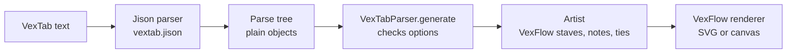

import FirstNotes from '../../../assets/vexflow-vextab/l01-first-notes.svg';
import Notation from '../../../assets/vexflow-vextab/l01-notation.svg';
import Durations from '../../../assets/vexflow-vextab/l01-durations.svg';
import Overfull from '../../../assets/vexflow-vextab/l01-overfull.svg';

[VexTab](https://github.com/0xfe/vextab) is a text language for guitar tablature and standard notation. You write a few lines, VexTab parses them and asks [VexFlow](https://www.vexflow.com/) to draw the result. This lesson writes the first lines, follows them from text to drawing, and ends with the errors VexTab raises when a line is wrong.

Every drawing on this page is the SVG that VexFlow wrote for the example above it, rendered under Node by the course's code, not a screenshot. Every error message is the one VexTab raised.

## Running the examples

The course's code is in [`code/vexflow-vextab`](https://github.com/spareilleux/learn/tree/20497783691a7e4f4134be79c5531ea7754934e3/code/vexflow-vextab). You need [Node.js](https://nodejs.org/) 24 and Git; lesson 4 also needs the [.NET 10 SDK](https://dotnet.microsoft.com/download/dotnet/10.0). On Windows, run the commands from Git Bash.

```bash
cd code/vexflow-vextab
npm ci                                            # the exact versions of package-lock.json
bash check.sh                                     # every example, compared with expected/
node render.cjs --out out/mine my-file.vextab     # one file of your own: out/mine/my-file.svg and .txt
```

`render.cjs` writes the drawing to `<name>.svg` and a one-line report to `<name>.txt`: `ok` and the size of the drawing, or the error. With `--ast` it also writes the parse tree, which this lesson looks at below.

## The first stave

The smallest VexTab text is one word, `tabstave`: an empty six-line tab stave with the `TAB` clef. Notes go on a `notes` line under it.

```vextab
tabstave
notes 5/5 7/5 5/4 7/4
```

<FirstNotes role="img" aria-label="A tab stave with four notes: fret 5 then 7 on string 5, fret 5 then 7 on string 4." />

Each note is written **`fret/string`**: `5/5` is fret 5 on string 5, the A string. Strings are numbered as guitarists number them, 1 for the high E, 6 for the low E. Keep this order in mind: lesson 4 is about a program that writes it the other way round.

The words `vexflow.com` under the drawing are VexTab's logo, drawn by default under every render ([`ArtistRenderer.ts:261-266`](https://github.com/0xfe/vextab/blob/3a5e00d858ae98934ba545f9bef5eb923e17e402/src/artist/ArtistRenderer.ts#L261-L266)). `Artist.NOLOGO = true` turns it off; the course keeps it, since that is what you get.

## Standard notation above the tab

`notation=true` adds a five-line stave with a treble clef above the tab, and VexTab works out the pitch of each fret from the tuning.

```vextab
tabstave notation=true
notes :q 4/5 5/5 7/5 | :h 5/4 7/4
```

<Notation role="img" aria-label="A notation stave above a tab stave. First bar: C sharp, D, E as quarter notes, from frets 4, 5 and 7 on string 5. Second bar: G and A as half notes, from frets 5 and 7 on string 4." />

Fret 4 on the A string is C♯, fret 5 is D, fret 7 is E. The notes sit in the middle of the treble staff, an octave higher than they sound: guitar music is written an octave above its pitch so that it fits on the treble clef ([Music theory for GA, lesson 1](../../music-theory-ga/01-notes-and-the-fretboard/) goes through pitches and octaves). VexTab's default tuning says so in its own terms: `E/5, B/4, G/4, D/4, A/3, E/3`, one octave above the sounding E4 to E2.

`tablature=false` keeps only the notation. Notes are then written **`name/octave`**, and a dash chains notes of the same octave:

```vextab
tabstave notation=true tablature=false
notes :q C-D-E-F/4 | :h G/4 C/5
```

The accidentals are `#` for sharp, `##` for double sharp, `n` for natural, and `@` and `@@` for flat and double flat ([`vextab.jison:432-437`](https://github.com/0xfe/vextab/blob/3a5e00d858ae98934ba545f9bef5eb923e17e402/src/vextab.jison#L432-L437)). Not `b`: in a `notes` line, `b` is a bend (lesson 2). `B@/4` is B flat; `Bb/4` is an error.

## Durations and bar lines

A duration starts with a colon and stays in force until the next one: `:w` whole, `:h` half, `:q` quarter (the default), `:8`, `:16` and `:32`. A `d` after it adds a dot, `:qd`. A `|` draws a bar line.

```vextab
tabstave notation=true
notes :w 5/5 | :h 5/5 7/5 | :q 5/5 7/5 5/4 7/4 | :8 5/5 7/5 5/4 7/4 :q 5/3 7/3
```

<Durations role="img" aria-label="Four bars: a whole note, two half notes, four quarter notes, then four eighth notes beamed in pairs and two quarter notes." />

VexFlow beams the eighth notes by itself, in pairs, and spreads each bar over the width it has. What it does not do is count. Five quarter notes in a 4/4 bar are drawn without a word:

```vextab
tabstave notation=true time=4/4
notes :q 5/5 7/5 5/4 7/4 5/3 | :h 7/3
```

<Overfull role="img" aria-label="A 4/4 bar that holds five quarter notes, followed by a bar with one half note. Nothing marks the extra beat." />

VexTab builds its voices in VexFlow's `SOFT` mode ([`ArtistRenderer.ts:67`](https://github.com/0xfe/vextab/blob/3a5e00d858ae98934ba545f9bef5eb923e17e402/src/artist/ArtistRenderer.ts#L67)), which accepts any number of beats. A voice in `STRICT` mode would throw instead; lesson 5 builds one by hand.

A run of frets on one string is written with dashes, as notes of one octave are: `5-7-9/3` is frets 5, 7 and 9 on string 3. `##` is a rest.

## From text to drawing

VexTab is a small compiler. Its grammar, [`src/vextab.jison`](https://github.com/0xfe/vextab/blob/3a5e00d858ae98934ba545f9bef5eb923e17e402/src/vextab.jison), is an LALR(1) grammar for [Jison](https://gerhobbelt.github.io/jison/), a parser generator for JavaScript in the family of yacc and bison. The parser returns a tree of plain objects; VexTab's `VexTabParser` walks it and calls an **Artist**, which builds VexFlow objects; the Artist then draws them with a VexFlow renderer.



For a C# or Java developer, it is a DSL compiled to calls on an object API, like a Razor view compiled to C# that writes HTML, with one difference: nothing is generated as source code; the tree is interpreted directly.

`node render.cjs --ast` saves the tree. For the notation example above ([`expected/ast/l01-notation.ast.json`](https://github.com/spareilleux/learn/blob/20497783691a7e4f4134be79c5531ea7754934e3/code/vexflow-vextab/expected/ast/l01-notation.ast.json)), shortened:

```json
[
  {
    "element": "tabstave",
    "options": [{ "key": "notation", "value": "true", "_l": 1, "_c": 9 }],
    "notes": [
      { "time": "q", "dot": false },
      { "fret": "4", "_l": 2, "_c": 9, "decorator": null, "string": "5" },
      { "fret": "5", "_l": 2, "_c": 13, "decorator": null, "string": "5" },
      { "fret": "7", "_l": 2, "_c": 17, "decorator": null, "string": "5" },
      { "command": "bar", "type": "single", "_l": 2, "_c": 21 },
      { "time": "h", "dot": false },
      { "fret": "5", "_l": 2, "_c": 26, "decorator": null, "string": "4" },
      { "fret": "7", "_l": 2, "_c": 30, "decorator": null, "string": "4" }
    ],
    "text": [],
    "_l": 1,
    "_c": 0
  }
]
```

Three things to notice. A duration is an item of the list, like a note, which is why it applies to what follows. Every value is a string, `"4"`, `"true"`: nothing is converted before `VexTabParser` reads the options, and lesson 3 finds a place where nothing is converted at all. `_l` and `_c` are the line and column, kept for error messages.

The entry point is short ([`VexTab.ts:68-95`](https://github.com/0xfe/vextab/blob/3a5e00d858ae98934ba545f9bef5eb923e17e402/src/vextab/VexTab.ts#L68-L95)): trim every line, parse, then `this.compiler.generate(this.elements)`. The course's [`render.cjs`](https://github.com/spareilleux/learn/blob/20497783691a7e4f4134be79c5531ea7754934e3/code/vexflow-vextab/render.cjs#L25-L34) calls it the way a web page would:

```js
const div = document.createElement('div');
const renderer = new Vex.Flow.Renderer(div, Vex.Flow.Renderer.Backends.SVG);
const artist = new Artist(10, 10, width);   // x, y, width of the drawing
const vextab = new VexTab(artist);
const elements = vextab.parse(code);        // the parse tree above; throws on an error
artist.render(renderer);                    // VexFlow draws into the div
```

## Which VexFlow?

The `vextab` package on npm is not a thin layer on a VexFlow you install next to it. Its `dist/main.prod.js`, 1.2 MB, is a webpack bundle that contains its own VexFlow; in the course's copy, `Vex.Flow.BUILD` reports `VERSION: '5.0.0'` and `ID: '0ca6f889…'`, the VexFlow commit it was built from. VexTab 4.0.5 re-creates VexFlow 4's `Vex.Flow` namespace on top of VexFlow 5 so that its old code keeps working ([`src/vexflow.ts`](https://github.com/0xfe/vextab/blob/3a5e00d858ae98934ba545f9bef5eb923e17e402/src/vexflow.ts#L1-L21)).

Two consequences. First, `npm install vexflow@4` next to `vextab@4.0.5` does not make VexTab draw with VexFlow 4: the bundle ignores it. Second, `Vex` exported by `vextab` is that bundled VexFlow; the course uses it, and installs the separate `vexflow` 5.0.0 package only for the second batch.

GA sits on the other side of that line: its React components ask for `vexflow ^4.2.5` ([`package.json:67`](https://github.com/GuitarAlchemist/ga/blob/17ccee6885851e4b460ebd14d7f4cfb838f5541e/ReactComponents/ga-react-components/package.json#L67)), and the chatbot's web root ships a copy whose header says `VexFlow 4.2.5 2024-05-12` ([`vexflow.js:2`](https://github.com/GuitarAlchemist/ga/blob/17ccee6885851e4b460ebd14d7f4cfb838f5541e/Apps/GaChatbot.Api/wwwroot/vendor/vexflow/vexflow.js#L2)). Lesson 8 is about that gap.

## Rendering without a browser

VexFlow draws into an SVG element, so under Node it needs a DOM: [jsdom](https://github.com/jsdom/jsdom) provides one. It also needs to measure text. VexFlow 5 draws every music symbol as a character of the [Bravura](https://github.com/steinbergmedia/bravura) font (a clef is U+E050, a black notehead U+E0A4, following [SMuFL](https://w3c.github.io/smufl/latest/)), and it lays out a bar from the width and height of those characters, which it asks a `<canvas>` for ([`element.ts:607-622`](https://github.com/vexflow/vexflow/blob/0ca6f889545c33cce851b420c24945f6eb685aeb/src/element.ts#L607-L622)). jsdom has no canvas. The [`canvas`](https://www.npmjs.com/package/canvas) package that VexFlow's own test tools use under Node could not load Bravura's OpenType file on Windows: every glyph fell back to a system font.

VexFlow has a public hook for this, `Element.setTextMeasurementCanvas()` ([`element.ts:96`](https://github.com/vexflow/vexflow/blob/0ca6f889545c33cce851b420c24945f6eb685aeb/src/element.ts#L96)). The course gives it an object whose `measureText()` reads advance widths and glyph outlines from Bravura and Academico with [opentype.js](https://opentype.js.org/) ([`lib/env.cjs`](https://github.com/spareilleux/learn/blob/20497783691a7e4f4134be79c5531ea7754934e3/code/vexflow-vextab/lib/env.cjs)). That is plain JavaScript, so the three operating systems of the CI lay out every example identically, and `check.sh` can compare SVGs byte for byte after rounding coordinates to two decimals and renumbering VexFlow's `vf-auto…` ids.

Is that layout the one a reader's browser draws? I wrote four hypotheses before measuring ([`results/hypotheses.md`](https://github.com/spareilleux/learn/blob/284eb7e/code/vexflow-vextab/results/hypotheses.md)), then rendered five examples with VexTab's own browser bundle in Chrome 153. The largest gap between Chrome and the headless render, over 157 text elements, is 0.74 px across and 0.67 px down ([`results/browser-2026-09-24.txt`](https://github.com/spareilleux/learn/blob/20497783691a7e4f4134be79c5531ea7754934e3/code/vexflow-vextab/results/browser-2026-09-24.txt)). The first run said 204 px: my test page had no `<meta charset="utf-8">`, Chrome read the bundle as Windows-1252, and every Bravura character became two Latin ones. The [journal](../journal/) keeps both runs.

## When VexTab says no

Two kinds of error come out of `parse`. A **syntax** error comes from Jison and names the tokens it expected:

```vextab
tabstaff notation=true
notes 5/5
```

```text
error Error: Parse error on line 1:
tabstaff notation=tr
^
Expecting 'EOF', 'OPTIONS', 'TABSTAVE', 'STAVE', 'VOICE', got 'WORD'
```

```vextab
tabstave
notes 5/5 7
```

```text
error Error: Parse error on line 2:
...abstavenotes 5/5 7
---------------------^
Expecting '/', 'h', 'd', '-', 's', 't', 'T', 'b', 'p', 'v', 'V', 'u', got 'EOF'
```

The second message shows `...abstavenotes`: Jison prints the text before the error with its line breaks removed. A fret without a string can still be followed by a technique, which is the list it expected.

A **semantic** error comes from `VexTabParser`, which checks the options after parsing, and gives a line and column ([`VexTabParser.ts:39-99`](https://github.com/0xfe/vextab/blob/3a5e00d858ae98934ba545f9bef5eb923e17e402/src/vextab/VexTabParser.ts#L39-L99)):

```vextab
tabstave notation=yes
notes 5/5
```

```text
error ParseError: [RuntimeError] ParseError: 'notation' must be 'true' or 'false' in line 1 column 9
```

```vextab
tabstave notation=false tablature=false
notes 5/5
```

```text
error ParseError: [RuntimeError] ParseError: Both 'notation' and 'tablature' can't be invisible in line 1 column 24
```

The first `error …:` is the course's report, `e.code` or `e.name` followed by `e.message`; the rest is VexTab's message. All six messages of the lesson are in [`expected/ex/`](https://github.com/spareilleux/learn/tree/20497783691a7e4f4134be79c5531ea7754934e3/code/vexflow-vextab/expected/ex).

## Key takeaways

- A VexTab text is a list of `tabstave` blocks, each followed by `notes` and `text` lines. Notes are `fret/string` on tab and `name/octave` in notation, and a flat is `@`.
- A duration is an item of the note list: it applies until the next one. Bars are not counted.
- VexTab parses with a Jison grammar into a tree of strings, checks options, then drives VexFlow through its Artist.
- The `vextab` npm package carries its own VexFlow 5.0.0.
- Under Node, VexFlow needs a DOM and a way to measure Bravura; measured with opentype.js, the layout is within 0.74 px of Chrome's.

## Exercises

1. Write the A minor pentatonic scale in fifth position, ascending from fret 5 on string 6 to fret 5 on string 1, in eighth notes, with notation, in two bars of 4/4 ending on a half note.

<details>
<summary>Solution</summary>

```vextab
tabstave notation=true time=4/4
notes :8 5-8/6 5-7/5 5-7/4 5-7/3 | :8 5-8/2 5-8/1 :h 5/1
```

Eight eighth notes fill the first bar; four eighths and a half note fill the second. `check.sh` renders it as [`l01-ex-pentatonic`](https://github.com/spareilleux/learn/blob/20497783691a7e4f4134be79c5531ea7754934e3/code/vexflow-vextab/expected/ex/l01-ex-pentatonic.svg). VexTab would have drawn it just as well with a beat missing: counting is your job.

</details>

2. Predict what VexTab says about `notes 12/7` under a plain `tabstave`, then check with `render.cjs`.

<details>
<summary>Solution</summary>

The grammar accepts any number as a string, so the text parses. The error comes later, from VexFlow's tuning, when the Artist asks for the pitch of string 7 on a six-string guitar:

```text
error BadArguments: [RuntimeError] BadArguments: String number must be between 1 and 6:7
```

</details>

3. In the parse tree of `notes :8 5-7-9/3`, the second and third notes carry `"articulation": "-"` and the first does not. Why?

<details>
<summary>Solution</summary>

The grammar treats the dash as the plainest of the connectors between two frets of one string, next to `h`, `p`, `s`, `b` and `t` ([`vextab.jison:383-392`](https://github.com/0xfe/vextab/blob/3a5e00d858ae98934ba545f9bef5eb923e17e402/src/vextab.jison#L383-L392)). Each fret after the first records the connector that led to it; `-` means "no technique". The tree is in [`expected/ast/l01-fret-run.ast.json`](https://github.com/spareilleux/learn/blob/20497783691a7e4f4134be79c5531ea7754934e3/code/vexflow-vextab/expected/ast/l01-fret-run.ast.json).

</details>

## Sources

- Mohit Cheppudira, [The VexTab Tutorial](https://vexflow.com/vextab/tutorial.html), steps 1 to 4 and 9.
- [`src/vextab.jison`](https://github.com/0xfe/vextab/blob/3a5e00d858ae98934ba545f9bef5eb923e17e402/src/vextab.jison) and [`src/vextab/VexTab.ts`](https://github.com/0xfe/vextab/blob/3a5e00d858ae98934ba545f9bef5eb923e17e402/src/vextab/VexTab.ts) at `3a5e00d`, identical to the files in the npm package 4.0.5.
- VexFlow [`src/element.ts`](https://github.com/vexflow/vexflow/blob/0ca6f889545c33cce851b420c24945f6eb685aeb/src/element.ts) at `0ca6f88`, and its own jsdom image generator, [`tools/generate_images_jsdom.js`](https://github.com/vexflow/vexflow/blob/0ca6f889545c33cce851b420c24945f6eb685aeb/tools/generate_images_jsdom.js).
- [Jison](https://gerhobbelt.github.io/jison/docs/), the parser generator.
