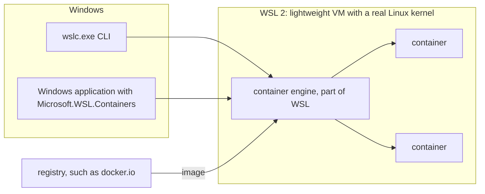

## Starting from what you already use

If you write C# or Java on Windows, you have probably met containers through Docker Desktop: a `docker run` for a local PostgreSQL, a `compose.yaml` next to the solution, a Dockerfile that a CI pipeline builds, maybe Testcontainers in your integration tests. You may never have needed to know that all of it runs in a Linux virtual machine that Docker Desktop manages for you.

WSL containers is Microsoft's own take on the same job, built into the Windows Subsystem for Linux. Most of your Docker vocabulary carries over; what changes is who provides the Linux machine and which tools come with it:

| With Docker Desktop you use | With WSL containers | Lesson |
|---|---|---|
| `docker run`, `docker ps`, `docker exec` | `wslc run`, `wslc container list`, `wslc exec` | 3 |
| a `Dockerfile` and `docker build` | the same file, often named `Containerfile`, and `wslc build` | 4 |
| Settings, Resources, or `.wslconfig` | `settings.yaml`, per session | 6 |
| `docker volume`, `-v` | `wslc volume`, `-v` | 7 |
| `docker compose up` | no equivalent: a script | 8 |
| Docker.DotNet, Testcontainers | the `Microsoft.WSL.Containers` package, in process | 9 |
| the Kubernetes checkbox, extensions, the dashboard | none | 10 |

The first two lessons set up the vocabulary and the installation; the rest of the course runs real .NET and Java workloads with `wslc` and compares each step with Docker Desktop. This course is about Windows by nature, so its commands are for PowerShell on Windows 11 only.

## A container, in one sentence

A **container** packages an application with everything it needs (libraries, runtime, configuration) so that it runs the same way everywhere.
You start it from an **image**, a read-only template that you download from a registry ([Docker Hub](https://hub.docker.com/), for example) or build yourself.

| Term | Analogy | Example |
|---|---|---|
| Image | A fixed recipe | `nginx`, `ubuntu:latest` |
| Container | A dish prepared from the recipe | the `web` server started from `nginx` |
| Registry | The recipe library | `docker.io` |
| Published port | The counter between Windows and the container | `-p 8080:80` |

## Why you need Linux

Linux containers share the host machine's **Linux kernel**. Windows doesn't have one, so you need a Linux virtual machine somewhere.
That is exactly what **[WSL 2](https://learn.microsoft.com/windows/wsl/about)** provides: a lightweight VM, managed by Windows, with a real Linux kernel.

## Three ways to get Linux containers on Windows

| Approach | Who manages the Linux VM | Tool |
|---|---|---|
| [Docker Desktop](https://docs.docker.com/desktop/) | Docker, via its own WSL distro `docker-desktop` | `docker` |
| [Podman](https://podman.io/) | Podman, via its WSL distro `podman-machine-default` | `podman` |
| **WSL containers** | **WSL itself**, with no third-party product | `wslc` |

What's new: with WSL containers, **the container engine is part of WSL**. There is nothing else to install, and `wslc.exe` ships with WSL.

## The two components

1. **The `wslc.exe` CLI** — to build, run and inspect containers from a terminal. It follows the conventions of the Docker CLI.
2. **The WSL container API** — a NuGet package ([`Microsoft.WSL.Containers`](https://www.nuget.org/packages/Microsoft.WSL.Containers)) that lets a **Windows application** use Linux containers in its own logic (C#, and C++/WinRT in preview).

Both components drive Linux containers through WSL, whose lightweight virtual machine provides the Linux kernel.



## Key takeaways

- Image = template; container = running instance.
- Linux containers need a Linux kernel → WSL 2 provides it.
- `wslc` = containers built into WSL, without Docker Desktop.
- Docker skills carry over to the CLI and the image format; Compose, Kubernetes and the Docker Engine API don't.

## Exercises

1. List the WSL distributions on your machine. Which ones belong to a container tool?

<details>
<summary>Solution</summary>

```powershell
wsl -l -v
```

```text
  NAME                      STATE           VERSION
* podman-machine-default    Stopped         2
  Ubuntu                    Stopped         2
  docker-desktop            Stopped         2
```

On my machine: `docker-desktop` (Docker Desktop) and `podman-machine-default` (Podman). These are "technical" distros managed by those tools, not distros meant to be used directly; `Ubuntu` is a regular distro. `wslc` adds none: its sessions don't appear in `wsl -l -v`.

</details>

2. Why can't you run an `ubuntu` image directly on the Windows kernel?

<details>
<summary>Solution</summary>

A Linux image contains binaries that make **Linux** system calls. A container doesn't virtualize the kernel: it shares the host's. So you need a Linux kernel, provided here by the WSL 2 VM.

</details>

3. A colleague runs Docker Desktop and Podman on the same Windows machine, and now installs WSL 2.9. How many Linux VMs can end up running, and who manages each one?

<details>
<summary>Solution</summary>

At least three. Docker Desktop manages the `docker-desktop` distro, Podman manages `podman-machine-default`, and `wslc` starts one VM per session: `wslc-cli-<user>` for a normal terminal, another one for an administrator terminal, and one for each application that creates its own session. Each VM takes memory from Windows, which [lesson 6](../06-resources-and-limits/) measures.

</details>

## Sources

- [What is WSL? — Microsoft Learn](https://learn.microsoft.com/windows/wsl/about)
- [WSL container — Microsoft Learn](https://learn.microsoft.com/windows/wsl/wsl-container)
- [Docker Desktop WSL 2 backend](https://docs.docker.com/desktop/features/wsl/) — Docker docs
