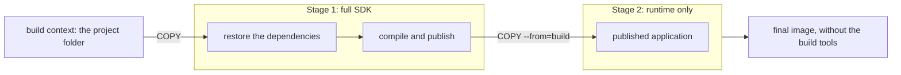

This lesson packages two small web APIs into images — one in **C#** ([ASP.NET Core minimal API](https://learn.microsoft.com/aspnet/core/fundamentals/minimal-apis/overview)), one in **Java** ([Spring Boot](https://spring.io/projects/spring-boot) [WebFlux](https://docs.spring.io/spring-framework/reference/web/webflux.html), built on [Reactor](https://projectreactor.io/)) — and runs them with `wslc`. Both do the same thing, so you can compare the two ecosystems step by step.

The full code is in the repository: [`code/wsl-containers`](https://github.com/spareilleux/learn/tree/main/code/wsl-containers). Everything below was run with `wslc` 2.9.11; the outputs are real.

:::tip[No SDK needed on Windows]
The compilation happens **inside** the build container. You don't need [.NET](https://dotnet.microsoft.com/), a JDK (such as [Eclipse Temurin](https://adoptium.net/temurin/releases/)) or [Maven](https://maven.apache.org/) installed on Windows to follow this lesson — only `wslc`.
:::

## The two applications

Each API exposes two endpoints on port 8080:

- `GET /` returns a small JSON document: application name, runtime, operating system and machine name;
- `GET /ticks` streams three [Server-Sent Events](https://developer.mozilla.org/docs/Web/API/Server-sent_events), one per second.

| | C# | Java |
|---|---|---|
| Framework | ASP.NET Core 10 minimal API | Spring Boot 4.1 WebFlux |
| Single value | anonymous object returned by the lambda | `Mono<Info>` |
| Stream | `IAsyncEnumerable<int>` + `TypedResults.ServerSentEvents` | `Flux<Long>` + `text/event-stream` |
| Web server | [Kestrel](https://learn.microsoft.com/aspnet/core/fundamentals/servers/kestrel) | [Netty](https://netty.io/) |
| Default port in a container | 8080 | 8080 |

**C#** — `csharp-api/Program.cs`:

```csharp
app.MapGet("/", () => new
{
    App = "csharp-api",
    Runtime = RuntimeInformation.FrameworkDescription,
    Os = RuntimeInformation.OSDescription,
    Machine = Environment.MachineName
});

app.MapGet("/ticks", (CancellationToken ct) => TypedResults.ServerSentEvents(Ticks(ct)));

static async IAsyncEnumerable<int> Ticks([EnumeratorCancellation] CancellationToken ct)
{
    for (var i = 0; i < 3; i++)
    {
        await Task.Delay(TimeSpan.FromSeconds(1), ct);
        yield return i;
    }
}
```

**Java** — `java-reactor-api/src/main/java/dev/learn/reactorapi/JavaReactorApiApplication.java` (project generated with [start.spring.io](https://start.spring.io/), dependency *Spring Reactive Web*):

```java
record Info(String app, String runtime, String os, String machine) {
}

@RestController
class InfoController {

	@GetMapping("/")
	Mono<Info> info() {
		return Mono.just(new Info(
				"java-reactor-api",
				"Java " + Runtime.version(),
				System.getProperty("os.name") + " " + System.getProperty("os.version"),
				System.getenv().getOrDefault("HOSTNAME", "?")));
	}

	@GetMapping(value = "/ticks", produces = MediaType.TEXT_EVENT_STREAM_VALUE)
	Flux<Long> ticks() {
		return Flux.interval(Duration.ofSeconds(1)).take(3);
	}

}
```

## The Containerfile

A `Containerfile` (same syntax as a `Dockerfile`) describes how to build the image. Both apps use a **multi-stage build**: a first stage with the full SDK compiles the application, a second stage with only the runtime receives the result. The build tools never reach the final image.

The diagram follows the files through the two stages: only the published application reaches the final image.



**C#** — `csharp-api/Containerfile`:

```dockerfile
# --- Stage 1: build with the full SDK (compiler, NuGet) ---
FROM mcr.microsoft.com/dotnet/sdk:10.0 AS build
WORKDIR /src

# Restore first: this layer stays cached as long as the .csproj doesn't change
COPY CsharpApi.csproj .
RUN dotnet restore

COPY . .
RUN dotnet publish -c Release -o /app --no-restore

# --- Stage 2: run with the ASP.NET Core runtime only ---
FROM mcr.microsoft.com/dotnet/aspnet:10.0
WORKDIR /app
COPY --from=build /app .

# Non-root user provided by the .NET images
USER $APP_UID
EXPOSE 8080
ENTRYPOINT ["dotnet", "CsharpApi.dll"]
```

**Java** — `java-reactor-api/Containerfile`:

```dockerfile
# --- Stage 1: build with Maven and the full JDK ---
FROM maven:3.9-eclipse-temurin-25 AS build
WORKDIR /src

# Download dependencies first: this layer stays cached as long as pom.xml doesn't change
COPY pom.xml .
RUN mvn -q dependency:go-offline

COPY src ./src
RUN mvn -q package

# --- Stage 2: run with the JRE only ---
FROM eclipse-temurin:25-jre
WORKDIR /app
COPY --from=build /src/target/app.jar app.jar

# Non-root user provided by the Ubuntu base image
USER ubuntu
EXPOSE 8080
# Netty loads a native library: allow it explicitly (Java 24+ warns otherwise)
ENTRYPOINT ["java", "--enable-native-access=ALL-UNNAMED", "-jar", "app.jar"]
```

(`<finalName>app</finalName>` in `pom.xml` gives the jar a fixed name.)

| Instruction | Role |
|---|---|
| `FROM image AS name` | starts a stage from a base image and names it |
| `WORKDIR` | working directory in the image |
| `COPY` | copies files from the build context (the folder passed to `build`) |
| `COPY --from=build` | copies files from **another stage** |
| `RUN` | command run **during the build** |
| `USER` | user the container process runs as |
| `EXPOSE` | documents the listening port (doesn't publish it) |
| `ENTRYPOINT` | command run **when the container starts** |

The same steps, side by side:

| Step | C# | Java |
|---|---|---|
| Build image | [`dotnet/sdk:10.0`](https://hub.docker.com/r/microsoft/dotnet-sdk) | [`maven:3.9-eclipse-temurin-25`](https://hub.docker.com/_/maven) |
| Dependencies | `dotnet restore` ([NuGet](https://www.nuget.org/)) | `mvn dependency:go-offline` |
| Compile and package | `dotnet publish` → folder of DLLs | `mvn package` → one executable jar |
| Runtime image | [`dotnet/aspnet:10.0`](https://hub.docker.com/r/microsoft/dotnet-aspnet) | [`eclipse-temurin:25-jre`](https://hub.docker.com/_/eclipse-temurin) |
| Non-root user | `USER $APP_UID` (`app`, uid 1654) | `USER ubuntu` (uid 1000) |

:::note[Why copy the `.csproj` / `pom.xml` first?]
Each instruction produces a cached layer, reused as long as its inputs don't change. By copying the project file alone before the sources, downloading dependencies is only replayed when the dependencies change. Measured: first C# build **87 s**; after editing `Program.cs`, `restore` stays `CACHED` and the rebuild takes **9 s**.
:::

Each project also has a `.dockerignore` (`bin/` and `obj/` for C#, `target/` for Java) so local build outputs aren't sent into the build. `wslc` honors it: a file placed in `obj/` didn't reach the image, and `COPY . .` stayed cached.

## Building

From each project folder (`wslc build` finds the `Containerfile` on its own; use `-f` for another name):

```powershell
cd code\wsl-containers\csharp-api
wslc build -t csharp-api .

cd ..\java-reactor-api
wslc build -t java-reactor-api .
```

Excerpt of the C# build:

```text
[build 3/6] COPY CsharpApi.csproj .
[build 4/6] RUN dotnet restore
  [build]   Determining projects to restore...
  [build]   Restored /src/CsharpApi.csproj (in 201 ms).
[build 5/6] COPY . .
[build 6/6] RUN dotnet publish -c Release -o /app --no-restore
  [build]   CsharpApi -> /src/bin/Release/net10.0/CsharpApi.dll
  [build]   CsharpApi -> /app/
[stage-1 3/3] COPY --from=build /app .
exporting to image
  | naming to docker.io/library/csharp-api
```

```text
> wslc image list
REPOSITORY         TAG      IMAGE ID       CREATED         SIZE
csharp-api         latest   c1bdb0897739   3 minutes ago   230MB
java-reactor-api   latest   3a731cbc7d15   4 minutes ago   387MB
```

## Running

Both apps listen on 8080 **inside** their container; publish them on two different Windows ports:

```powershell
wslc run -d --rm -p 5000:8080 --name csharp csharp-api
wslc run -d --rm -p 8081:8080 --name java java-reactor-api
wslc container list
```

```text
CONTAINER ID   IMAGE              COMMAND                  CREATED         STATUS         PORTS                      NAMES
b8acbb234fb1   java-reactor-api   "java --enable-nativ…"   8 seconds ago   Up 7 seconds   127.0.0.1:8081->8080/tcp   java
8bdcda0c3927   csharp-api         "dotnet CsharpApi.dll"   8 seconds ago   Up 7 seconds   127.0.0.1:5000->8080/tcp   csharp
```

`wslc` publishes on `127.0.0.1` by default, so use that address with [curl](https://curl.se/) (`curl.exe` ships with Windows):

```powershell
curl.exe http://127.0.0.1:5000/
curl.exe http://127.0.0.1:8081/
```

```text
{"app":"csharp-api","runtime":".NET 10.0.12","os":"Ubuntu 24.04.5 LTS","machine":"8bdcda0c3927"}
{"app":"java-reactor-api","runtime":"Java 25.0.4+7-LTS","os":"Linux 6.18.40.1-microsoft-standard-WSL2","machine":"b8acbb234fb1"}
```

:::caution[`localhost` isn't always `127.0.0.1`]
If Docker Desktop publishes the same port, `localhost` may reach Docker instead of `wslc`, with no error anywhere. See the [journal](../journal/).
:::

The machine name is the container ID. The stream (`-N` disables curl's buffering, so the events show up one per second):

```powershell
curl.exe -N http://127.0.0.1:5000/ticks
curl.exe -N http://127.0.0.1:8081/ticks
```

```text
data: 0

data: 1

data: 2
```

Java writes `data:0` without the space; both forms are valid SSE.

### Proof it's Linux, and not root

```powershell
wslc exec csharp uname -a
wslc exec csharp id
wslc exec java id
```

```text
Linux 8bdcda0c3927 6.18.40.1-microsoft-standard-WSL2 #1 SMP PREEMPT_DYNAMIC Fri Jul 31 22:12:15 UTC 2026 x86_64 x86_64 x86_64 GNU/Linux
uid=1654(app) gid=1654(app) groups=1654(app)
uid=1000(ubuntu) gid=1000(ubuntu) groups=1000(ubuntu),4(adm),20(dialout),24(cdrom),25(floppy),27(sudo),29(audio),30(dip),44(video),46(plugdev)
```

The kernel is the WSL one: containers share the kernel of the `wslc` session VM. Without the `USER` line, the Java container would run as `uid=0(root)`.

## Reading the logs

```powershell
wslc container logs csharp
wslc container logs java
```

```text
info: Microsoft.Hosting.Lifetime[14]
      Now listening on: http://[::]:8080
info: Microsoft.Hosting.Lifetime[0]
      Application started. Press Ctrl+C to shut down.
```

```text
 :: Spring Boot ::                (v4.1.1)

... Starting JavaReactorApiApplication v0.0.1-SNAPSHOT using Java 25.0.4 with PID 1 (/app/app.jar started by ubuntu in /app)
... Netty started on port 8080 (http)
... Started JavaReactorApiApplication in 1.391 seconds (process running for 1.795)
```

```powershell
wslc container stop csharp java
```

## Diagnosing

```powershell
wslc container list --all        # includes stopped containers, with their exit code
wslc container logs <container>  # what the application printed
wslc container inspect <container>  # effective configuration: command, env, ports, exit code
wslc image inspect <image>
```

## Freeing up disk space

Each rebuild moves the tag to the new image and leaves the old one behind, untagged:

```text
REPOSITORY         TAG      IMAGE ID       CREATED         SIZE
csharp-api         latest   c1bdb0897739   3 minutes ago   230MB
<none>             <none>   ddb9e015ed72   4 minutes ago   387MB
java-reactor-api   latest   3a731cbc7d15   4 minutes ago   387MB
<none>             <none>   c32cae38bd07   7 minutes ago   230MB
```

```powershell
wslc container prune       # removes stopped containers
wslc image prune           # removes dangling images (the <none> ones)
wslc image prune --all     # removes all images not used by a container (no confirmation)
```

:::caution
In `wslc image prune`, `-f` means `--filter`, not `--force`. And pruning frees space **inside** the session's `storage.vhdx`, but the file doesn't shrink on the Windows side (measured in [lesson 6](../06-resources-and-limits/), with the way to compact it).
:::

## Key takeaways

- A **multi-stage** build compiles with the SDK and ships only the runtime: 230 MB for the C# image instead of 918 MB for the build stage.
- Copy the project file (`.csproj`, `pom.xml`) and restore dependencies **before** copying the sources, to keep that layer cached.
- `RUN` runs at build time, `ENTRYPOINT` at startup.
- Run as a non-root user: `USER $APP_UID` for .NET images, `USER ubuntu` for Temurin images.
- Both apps listen on 8080 inside the container; `-p host:container` chooses the Windows port.
- `container list --all`, `logs` and `inspect` are the first things to reach for when a container doesn't behave as expected.

## Exercises

1. How big would the C# image be if you shipped the **build** stage instead of the runtime stage? Measure it without editing the `Containerfile`.

<details>
<summary>Solution</summary>

`--target` stops the build at a named stage:

```powershell
wslc build --target build -t csharp-api:build .
wslc image list
```

```text
csharp-api   latest   c32cae38bd07   3 minutes ago   230MB
csharp-api   build    3d3e47d940b4   3 minutes ago   918MB
```

The SDK, NuGet caches and intermediate files make the build stage four times larger. Remove it afterwards: `wslc image remove csharp-api:build`.

</details>

2. Make both apps listen on port **9000** inside their container, **without rebuilding** the images.

<details>
<summary>Solution</summary>

Both frameworks read the port from an environment variable, passed with `-e`:

```powershell
wslc run -d --rm -e ASPNETCORE_HTTP_PORTS=9000 -p 5000:9000 --name csharp csharp-api
wslc run -d --rm -e SERVER_PORT=9000 -p 8081:9000 --name java java-reactor-api
wslc container logs csharp
wslc container logs java
```

```text
      Now listening on: http://[::]:9000
... Netty started on port 9000 (http)
```

The container side of `-p` must follow: `5000:9000`, not `5000:8080`. `EXPOSE 8080` in the `Containerfile` is only documentation and doesn't prevent this.

</details>

3. A teammate starts the Java app with `wslc run -d --rm -e SERVER_PORT=abc --name java java-reactor-api`. A few seconds later, `wslc container list` shows nothing and `wslc container logs java` answers:

```text
Container 'java' not found.
Error code: WSLC_E_CONTAINER_NOT_FOUND
```

What happened, and how do you find the cause?

<details>
<summary>Solution</summary>

The app crashed at startup, and `--rm` removed the container along with its logs. Run it again **without `--rm`**:

```powershell
wslc run -d -e SERVER_PORT=abc --name java java-reactor-api
wslc container list --all
wslc container logs java
```

```text
CONTAINER ID   IMAGE              COMMAND                  CREATED         STATUS                     PORTS   NAMES
7b374a736ad1   java-reactor-api   "java --enable-nativ…"   7 seconds ago   Exited (1) 4 seconds ago           java
```

```text
***************************
APPLICATION FAILED TO START
***************************

Description:

Failed to bind properties under 'server.port' to java.lang.Integer:

    Property: server.port
    Value: "abc"
    Origin: System Environment Property "SERVER_PORT"
    Reason: failed to convert java.lang.String to java.lang.Integer (caused by java.lang.NumberFormatException: For input string: "abc")
```

`wslc container inspect java` confirms `"SERVER_PORT=abc"` in `Env` and `"ExitCode": 1`. Clean up with `wslc container remove java`.

</details>

4. `GET /` reports `"os":"Ubuntu 24.04.5 LTS"` for C# but `"os":"Linux 6.18.40.1-microsoft-standard-WSL2"` for Java. Are the two containers running on different systems?

<details>
<summary>Solution</summary>

No. The two runtimes don't describe the same thing:

- `RuntimeInformation.OSDescription` (.NET) reads the distribution of the **image** (`/etc/os-release`): the `aspnet:10.0` image is based on Ubuntu 24.04;
- `os.name` + `os.version` (Java) give the name and version of the **kernel**, shared by all containers of the session.

`wslc exec java cat /etc/os-release` shows that the Temurin 25 image is based on Ubuntu 26.04, and `wslc exec csharp uname -r` shows the same WSL kernel as Java.

</details>

## Sources

- [WSL container](https://learn.microsoft.com/windows/wsl/wsl-container) — Microsoft Learn
- [Containerize a .NET app](https://learn.microsoft.com/dotnet/core/docker/build-container) and [.NET container images](https://learn.microsoft.com/dotnet/core/docker/container-images) — Microsoft Learn
- [Server-Sent Events in ASP.NET Core minimal APIs](https://learn.microsoft.com/aspnet/core/fundamentals/minimal-apis/responses) — Microsoft Learn
- [Container images](https://docs.spring.io/spring-boot/reference/packaging/container-images/index.html) and [Dockerfiles](https://docs.spring.io/spring-boot/reference/packaging/container-images/dockerfiles.html) — Spring Boot reference
- [Web on Reactive Stack (WebFlux)](https://docs.spring.io/spring-framework/reference/web/webflux.html) — Spring Framework reference
- [Multi-stage builds](https://docs.docker.com/build/building/multi-stage/) and [Dockerfile reference](https://docs.docker.com/reference/dockerfile/) — Docker docs (`wslc` uses the same syntax)
