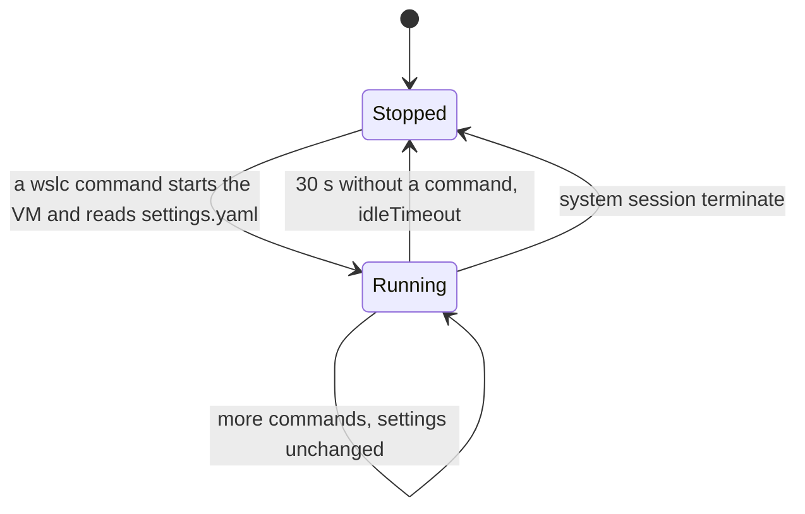

A Java developer knows that `-Xmx` caps the heap and that the JVM only takes memory as it needs it. A .NET developer knows that the garbage collector reads the container's memory limit. Docker Desktop users with the WSL 2 backend know the other level: the memory and processors of the whole Linux VM, set in `.wslconfig`. On a machine that also runs an IDE, a browser and a few services, that VM-level limit is what keeps Windows responsive.

`wslc` has the same two levels: a limit for the **session VM**, and optional limits per **container**. This lesson sets both, measures what a container and Windows really see, and then looks at the third resource people forget until the disk fills up: the session's virtual disk. The measurements come from the [journal](../journal/), except the per-container limits, measured for this lesson with `wslc` 2.9.11.

## Why it matters on a busy machine

The journal starts with an incident. With Docker Desktop and its Kubernetes, Podman, ollama and a few rust-analyzer processes running together, Docker Desktop crashed three times in a few minutes, and `wsl -l -v` itself failed:

```text
Not enough memory resources are available to complete this operation.
Error code: Wsl/0x8007000e
```

The machine had 97 GB of committed memory out of 132 GB. Each container tool runs its own VM, and each VM takes memory from Windows. `wslc` adds one VM per session, so its limits deserve the same attention.

## The session's `settings.yaml`

`wslc settings` creates `%LocalAppData%\wslc\settings.yaml` the first time, with every setting commented out, and opens it in the default editor. The part about resources:

```yaml
session:
  # Number of virtual CPUs allocated to the session (e.g. 4 default: all available CPUs)
  # cpuCount: default

  # Memory limit for the session (e.g. 2GB default: half of available memory)
  # memorySize: default
```

The same file has a few other session settings, described in the file itself and at [aka.ms/wslc-settings](https://aka.ms/wslc-settings):

| Setting | Default | Role |
|---|---|---|
| `cpuCount` | all logical CPUs | virtual CPUs of the session VM |
| `memorySize` | half of the RAM | memory ceiling of the session VM |
| `maxStorageSize` | 1 TB | maximum size of the session's virtual disk |
| `storagePath` | under `%LocalAppData%\wslc` | where `wslc\sessions\<session>\storage.vhdx` is created |
| `defaultBindingAddress` | `127.0.0.1` | address used by `-p` when you don't give one |
| `hostLoopback` | see the file | the name `host.wslc.internal`, to reach Windows from a container |
| `idleTimeout` | 30 s | how long an idle session VM stays up |

A Windows application that drives containers through the API sets the same limits in code, with `SessionSettings.CpuCount` and `SessionSettings.MemorySizeInMB` ([lesson 9](../09-csharp-api/)).

## Measuring what a container sees

The host has 24 logical CPUs and 63.7 GB of RAM. A throwaway Alpine container prints the number of processors and the memory:

```powershell
wslc run --rm alpine sh -c "echo nproc=`$(nproc); free -m"
```

The backtick before the dollar sign stops PowerShell from evaluating the command substitution itself inside a double-quoted string, so that `sh` receives it. With single quotes, as in the commands further down, PowerShell doesn't interpret anything and no backtick is needed.

| Settings | `nproc` | RAM (`free -m`) | Swap |
|---|---|---|---|
| defaults | 24 | 31946 MB | 32617 MB |
| `cpuCount: 4`, `memorySize: 4GB` | 4 | 3919 MB | 4096 MB |

With the defaults, the container sees every processor and half of the RAM. With the limits, it sees exactly what the VM was given, and swap follows `memorySize`.

## Trap: a running session keeps its old settings

The first measurement after editing the file still showed 24 CPUs. The settings are read when the session VM starts, so the session has to be terminated; the next `wslc` command starts a new one with the new values:

```powershell
wslc --session wslc-cli-spare system session terminate
```

The session name goes in the global `--session` option, **before** the subcommand. Given as an argument, as in `wslc system session terminate wslc-cli-spare`, it fails with `Found a positional argument when none was expected`.

Four gigabytes turned out to be too tight for the rest of the course, which runs qdrant. The setting kept on this machine is `cpuCount: 8` and `memorySize: 16GB`, and a container then reports `nproc=8`, 15996 MB of RAM and 16384 MB of swap. That is where the 15.62 GiB limit shown by `wslc stats` in [lesson 3](../03-first-containers/) comes from.

The session VM moves through a few states, and only one of them reads the settings file.



### The administrator session reads the same file

In an administrator terminal, `wslc info` shows the same `Settings file: C:\Users\spare\AppData\Local\wslc\settings.yaml`. After terminating the admin session, its containers see the same limits:

```text
> wslc --session wslc-cli-admin-spare system session terminate
> wslc run --rm alpine sh -c 'echo nproc=$(nproc); free -m'
nproc=8
Mem:          15996 ...
Swap:         16384 ...
```

The limits apply **per session**: a non-elevated session and an administrator session running together can each use up to 16 GB.

## Limits per container

`wslc run --help` lists the same per-container options as `docker run`, among them `--cpus` ("Number of CPUs (e.g. 0.5, 1, 2.5)") and `-m`, `--memory` ("Memory limit (e.g. 512M, 1G)"). They don't change the VM: they set the Linux control group of the container. Measured with the session at 8 CPUs and 16 GB:

```powershell
wslc run --rm --memory 512M --cpus 1.5 alpine sh -c 'echo nproc=$(nproc); cat /sys/fs/cgroup/memory.max /sys/fs/cgroup/cpu.max; free -m'
```

```text
wsl: Your kernel does not support swap limit capabilities or the cgroup is not mounted. Memory limited without swap.
nproc=8
536870912
150000 100000
              total        used        free      shared  buff/cache   available
Mem:          15996         278       15439           3         280       15527
Swap:         16384           0       16384
```

- `memory.max` is 536870912 bytes, exactly 512 MiB, and `cpu.max` allows 150000 microseconds of CPU time per 100000: 1.5 processors.
- `nproc` and `free` still report the **VM's** 8 CPUs and 16 GB. They don't read the control group. A runtime that sizes itself from them would overestimate what it can use; recent .NET and Java runtimes read the control group limits instead, *to verify* for the runtime version you ship.
- The warning says the memory limit doesn't cover swap in this kernel.

## The VM on the Windows side

On Windows, each session VM is a process named `vmmem` followed by the session name: `vmmemwslc-cli-spare` for the non-elevated session, `vmmemwslc-cli-admin-spare` for the administrator one. `hcsdiag list`, from an administrator terminal, shows it as a `Running` VM named after the session. Its memory figures, the working set and the private memory that `Get-Process` reports, are only readable from an elevated terminal.

The test: a container that holds 6 GB for two minutes, in the non-elevated session.

```powershell
wslc run -d --name memtest alpine sh -c 'apk add -q stress-ng && stress-ng --vm 1 --vm-bytes 6G --vm-hang 0 --timeout 120s'
```

| Moment | VM process | Working set | Private memory |
|---|---|---|---|
| idle session (admin, nothing running) | `vmmemwslc-cli-admin-spare` | 921 MB | 970 MB |
| 6 GB held in the container | `vmmemwslc-cli-spare` | 7069 MB | 7083 MB |
| 10 s after `container stop` + `remove` | `vmmemwslc-cli-spare` | 2776 MB | 7084 MB |
| a moment later | `vmmemwslc-cli-spare` | 902 MB | 1902 MB |

- An idle session VM costs about **0.9 GB**.
- The memory a container uses shows up almost entirely on the Windows side: about 6 GB plus the base VM.
- After the container stops, the memory is **not given back at once**: it decreases progressively.
- `memorySize` is a ceiling, not a reservation, just like `-Xmx`: the VM only takes what its containers use.

## When the idle VM stops

To see when the VM goes away, run one container, then watch the process **without running any `wslc` command**, since any `wslc` command wakes the session up:

```powershell
wslc run --rm alpine true
# then, every 5 s:
Get-Process -Name 'vmmemwslc-cli-spare' -ErrorAction SilentlyContinue
```

```text
    0s  VM running: True
   35s  VM running: False
```

The VM stops **30 to 35 seconds** after the last command, measured with a 5-second poll: that's `idleTimeout: 30`. The session itself stays listed by `wslc system session list`; only its VM is torn down, and the next command starts it again, with a fresh read of `settings.yaml`.

## The disk: `storage.vhdx` grows, and doesn't shrink

Images, containers and volumes live in `%LocalAppData%\wslc\sessions\<session>\storage.vhdx`, one virtual disk per session. Its size on the Windows side, step by step:

| Step | File size |
|---|---|
| start (`alpine`, `nginx`) | 814 MB |
| `wslc pull mcr.microsoft.com/dotnet/sdk:9.0` (869 MB) | 1070 MB |
| `wslc image remove` of that image | 1070 MB |
| `wslc image prune --all` ("Total reclaimed space: 178.5MB", nothing left) | 1070 MB |
| `system session terminate` | 1070 MB |
| pull `dotnet/sdk:9.0` again | 1070 MB |
| + `dotnet/aspnet:9.0` (224 MB) + `eclipse-temurin:21-jdk` (491 MB) | 1550 MB |

- The file **grows** when images are added, and **never shrinks** by itself: not with `image remove`, not with `prune`, not when the session is terminated.
- Space freed inside is **reused**: pulling the SDK again didn't make the file grow.
- The growth is smaller than the `SIZE` column, which shows the uncompressed size, so the file size is not a reliable image counter.

:::caution[`-f` is not `--force`]
In `wslc image prune`, `-f` means `--filter`. There is no `--force`, and `wslc image prune --all` doesn't ask for confirmation.
:::

## Compacting `storage.vhdx`

After the builds of [lesson 4](../04-build-an-image/), the file had grown to **3995 MB**, while `df` inside the session reported only **1.9 GB** in use. Compacting a VHDX is a Hyper-V operation:

```powershell
# 1. Stop the session VM (non-elevated) and check it's gone
wslc --session wslc-cli-spare system session terminate
Get-Process -Name 'vmmemwslc-cli-spare' -ErrorAction SilentlyContinue   # nothing

# 2. Administrator PowerShell (Hyper-V module): back up, then compact
$f = "$env:LOCALAPPDATA\wslc\sessions\wslc-cli-spare\storage.vhdx"
Copy-Item $f "$f.bak"
Optimize-VHD -Path $f -Mode Full
```

```text
before: 3,995 MB
Optimize-VHD -Mode Full: OK in 10s
after: 2,789 MB
```

That gave **1.2 GB** back to Windows in 10 seconds. Before deleting the backup, check that nothing was lost: `wslc image list` still listed `csharp-api`, `java-reactor-api` and `alpine`, and both APIs still answered after `wslc run`.

- [`Optimize-VHD`](https://learn.microsoft.com/powershell/module/hyper-v/optimize-vhd) needs an **administrator** terminal and the **Hyper-V** PowerShell module.
- The session VM must be stopped; otherwise the VHDX is in use.
- The file stays larger than the space used inside, 2.8 GB against 1.9 GB, because only fully free blocks are reclaimed.
- `fstrim`, which would tell the virtual disk which blocks are free, isn't available in the session VM: `wslc system session run fstrim -v /` fails with `Failed to launch command fstrim. Errno = 2`.

## Key takeaways

- `cpuCount` and `memorySize` in `%LocalAppData%\wslc\settings.yaml` limit the session VM; the defaults are every CPU and half of the RAM.
- The settings are read when the VM starts: terminate the session with `wslc --session <name> system session terminate` after editing them.
- Both sessions, non-elevated and administrator, read the same file, and each gets its own VM with those limits.
- `--memory` and `--cpus` limit one container through its control group, but `nproc` and `free` inside it still show the VM.
- The session VM is the `vmmem<session>` process: about 0.9 GB idle, stopped 30 seconds after the last command, and slow to give memory back.
- `storage.vhdx` never shrinks on its own. Terminate the session, back it up, then run `Optimize-VHD -Mode Full` as administrator.

## Exercises

1. You set `cpuCount: 4` in `settings.yaml`, but `wslc run --rm alpine nproc` still prints 24. Explain, then fix it with one command.

<details>
<summary>Solution</summary>

The session VM was already running, and it only reads the file when it starts. Terminate it, and the next command starts a new VM with four processors:

```powershell
wslc --session wslc-cli-<user> system session terminate
```

Waiting more than 30 seconds without any `wslc` command also works, since the idle VM stops on its own.

</details>

2. A colleague writes `wslc run --rm alpine sh -c "echo nproc=$(nproc)"` in PowerShell, and the output has no number after `nproc=`. Why? Give two fixes.

<details>
<summary>Solution</summary>

Inside a double-quoted string, PowerShell evaluates `$(nproc)` as its own subexpression before calling `wslc`, so `sh` never sees it: the command substitution happens on the wrong side, where `nproc` normally doesn't exist. Either escape the dollar sign with a backtick, as in `` "echo nproc=`$(nproc)" ``, or use single quotes, `'echo nproc=$(nproc)'`, which PowerShell passes as they are.

</details>

3. A Spring Boot service runs with `--memory 512M` in a session limited to 16 GB. Inside the container, `free -m` reports 15996 MB. Is the limit applied? How do you check?

<details>
<summary>Solution</summary>

Yes. `free` reads the VM's memory, not the control group. Read the limit where the kernel enforces it:

```powershell
wslc exec <container> cat /sys/fs/cgroup/memory.max
```

It printed 536870912, that is 512 MiB, in the measurement of this lesson. If the process goes over it, the kernel stops it for lack of memory, whatever `free` said.

</details>

4. In Task Manager, you see a `vmmemwslc-cli-spare` process using 7 GB, but `wslc container list` shows nothing. What happened, and what will happen next?

<details>
<summary>Solution</summary>

A container used that memory and has stopped, and the VM hasn't given the memory back to Windows yet: after the 6 GB test, the working set was still 2.8 GB ten seconds after the container was removed, and the private memory still 7 GB. The memory decreases progressively, and the whole VM stops about 30 seconds after the last `wslc` command.

</details>

5. Your `storage.vhdx` takes 4 GB, and you have just run `wslc image prune --all`. The file hasn't changed. List the steps that give the space back to Windows, and say which terminal each one needs.

<details>
<summary>Solution</summary>

1. In a **non-elevated** terminal, terminate the session with `wslc --session wslc-cli-<user> system session terminate`, then check that the `vmmemwslc-cli-<user>` process is gone.
2. In an **administrator** PowerShell with the Hyper-V module, copy `storage.vhdx` to a backup, then run `Optimize-VHD -Path <file> -Mode Full`.
3. Back in the normal terminal, check that `wslc image list` and your containers still work, then delete the backup.

Running the prune first was still useful: it frees the blocks that `Optimize-VHD` can then reclaim.

</details>

## Sources

- [WSL container — Microsoft Learn](https://learn.microsoft.com/windows/wsl/wsl-container): `SessionSettings`, CLI
- [wslc settings reference](https://aka.ms/wslc-settings)
- [Advanced settings configuration in WSL (`.wslconfig`) — Microsoft Learn](https://learn.microsoft.com/windows/wsl/wsl-config)
- [Docker Desktop settings: Resources](https://docs.docker.com/desktop/settings-and-maintenance/settings/#resources) — Docker docs
- [Resource constraints](https://docs.docker.com/engine/containers/resource_constraints/) — Docker docs (`--memory`, `--cpus`)
- [Control Group v2](https://docs.kernel.org/admin-guide/cgroup-v2.html) — Linux kernel documentation (`memory.max`, `cpu.max`)
- [`Optimize-VHD` — Microsoft Learn](https://learn.microsoft.com/powershell/module/hyper-v/optimize-vhd)
