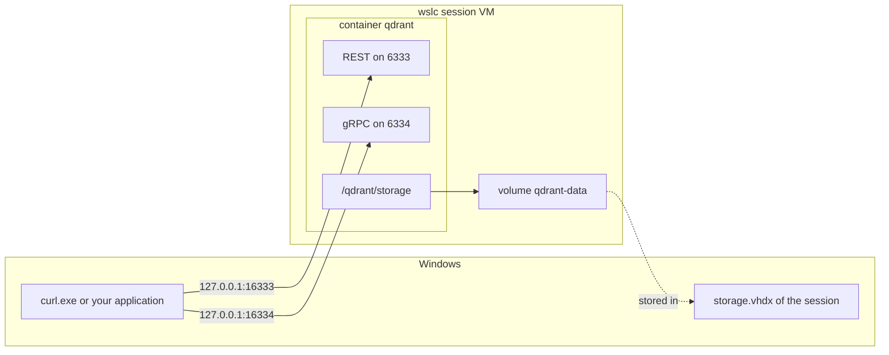

If you develop in C# or Java, you have probably started a database for local work with a single `docker run`: PostgreSQL for an Entity Framework Core or JPA project, Redis for a cache, a vector database for a retrieval experiment. Three questions always come back. Which port do I publish? Which version did I just download? Where do the data live when I delete the container?

This lesson answers them with `wslc` and a real service, [qdrant](https://qdrant.tech/), a vector search engine with a REST API on port 6333 and a gRPC API on port 6334. The machine already runs a qdrant in Docker Desktop, used by another application, which makes the exercise realistic: the `wslc` copy must not disturb it. Every output below is from `wslc` 2.9.11, recorded in the [journal](../journal/).

## Choosing the Windows ports

Before starting anything, look at what is already published:

```text
> docker ps
ga-qdrant  qdrant/qdrant:latest  Up About an hour (healthy)  0.0.0.0:6333-6334->6333-6334/tcp, [::]:6333-6334->6333-6334/tcp
```

Docker Desktop publishes 6333 and 6334 on every IPv4 and IPv6 address. As [lesson 5](../05-wslc-vs-docker/) shows, `wslc` would publish the same ports **without any error**, on `127.0.0.1`, and silently take that address away from the application that uses `ga-qdrant`. So the `wslc` copy uses **16333** and **16334** on the Windows side. Inside its container, qdrant still listens on 6333 and 6334: only the left side of `-p` changes.

## Pulling: same tag, different version

```powershell
wslc pull qdrant/qdrant    # 21 s, 198 MB
```

The Docker image was already on the disk, but `wslc` downloads it again, because the two tools keep separate image stores. The surprise comes later, when both copies answer on their root URL:

```text
> curl.exe http://127.0.0.1:16333/     # wslc
{"title":"qdrant - vector search engine","version":"1.19.1","commit":"6ab21cac18ebb6f4ae29102c7f8f5cc11affd5de"}
> curl.exe http://127.0.0.1:6333/      # Docker (ga-qdrant, pulled on 2025-12-19)
{"title":"qdrant - vector search engine","version":"1.16.3","commit":"bd49f45a8a2d4e4774cac50fa29507c4e8375af2"}
```

Both images are called `qdrant/qdrant:latest`, and they are three minor versions apart. A tag is a movable label, a bit like a floating NuGet version or a Maven `LATEST`: `latest` means whatever was latest when *this* tool pulled it. When two environments must match, pin the version, as in `qdrant/qdrant:v1.19.1`.

## A named volume

A container's own filesystem disappears with the container. For a database, the data must live somewhere else: a **named volume**, created by the container engine and mounted at the path where the service writes.

```powershell
wslc volume create qdrant-data
wslc run -d --name qdrant -p 16333:6333 -p 16334:6334 -v qdrant-data:/qdrant/storage qdrant/qdrant
curl.exe http://127.0.0.1:16333/readyz    # all shards are ready (after 1 s)
```

```text
CONTAINER ID   IMAGE           COMMAND             CREATED         STATUS        PORTS                                                  NAMES
da52872e3246   qdrant/qdrant   "./entrypoint.sh"   5 seconds ago   Up 1 second   127.0.0.1:16333->6333/tcp, 127.0.0.1:16334->6334/tcp   qdrant
```

| Option | Effect |
|---|---|
| `-p 16333:6333` | REST API: Windows port 16333 to container port 6333 |
| `-p 16334:6334` | gRPC API: Windows port 16334 to container port 6334 |
| `-v qdrant-data:/qdrant/storage` | mounts the named volume where qdrant keeps its collections |

The `readyz` endpoint is qdrant's readiness probe: it answers once the service can take requests, which is what a script should wait for rather than a fixed delay.

The diagram shows the two paths into the container: the published ports from Windows, and the volume that lives in the session's virtual disk.



:::caution[The dashboard URL in the log is the container's]
qdrant logs `Access web UI at http://localhost:6333/dashboard`. That port is the one **inside** the container. From Windows, the dashboard of this copy is at `http://127.0.0.1:16333/dashboard`, and `localhost:6333` would open the Docker one.
:::

## Putting data in

A collection of four-dimensional vectors, three points with a small payload, and a query. The request bodies are in JSON files, which avoids PowerShell's quoting rules for double quotes passed to a native program:

```powershell
curl.exe -X PUT http://127.0.0.1:16333/collections/journal -H "Content-Type: application/json" --data-binary "@coll.json"
curl.exe -X PUT "http://127.0.0.1:16333/collections/journal/points?wait=true" -H "Content-Type: application/json" --data-binary "@points.json"
curl.exe -X POST http://127.0.0.1:16333/collections/journal/points/query -H "Content-Type: application/json" --data-binary "@query.json"
```

```text
coll.json    {"vectors":{"size":4,"distance":"Cosine"}}
points.json  {"points":[{"id":1,"vector":[0.9,0.1,0.1,0.1],"payload":{"note":"wslc sessions"}},{"id":2,"vector":[0.1,0.9,0.1,0.1],"payload":{"note":"ports and localhost"}},{"id":3,"vector":[0.1,0.1,0.9,0.1],"payload":{"note":"storage.vhdx"}}]}
query.json   {"query":[0.2,0.8,0.1,0.1],"limit":2,"with_payload":true}
```

```text
{"result":true,"status":"ok","time":0.24333272}
{"result":{"operation_id":1,"status":"completed"},"status":"ok","time":0.003567116}
{"result":{"points":[{"id":2,"version":1,"score":0.99111706,"payload":{"note":"ports and localhost"}},{"id":1,"version":1,"score":0.3651484,"payload":{"note":"wslc sessions"}}]},"status":"ok","time":0.00189502}
```

The query vector points mostly along the second axis, so point 2 comes first with a cosine similarity of about 0.99, and point 1 follows far behind. `wait=true` makes the upsert return only once the points are indexed, so the query that follows sees them.

## Deleting the container, keeping the data

```powershell
wslc container stop qdrant
wslc container remove qdrant
wslc run -d --name qdrant -p 16333:6333 -p 16334:6334 -v qdrant-data:/qdrant/storage qdrant/qdrant
curl.exe http://127.0.0.1:16333/collections
curl.exe -X POST http://127.0.0.1:16333/collections/journal/points/count -H "Content-Type: application/json" -d "{}"
```

```text
{"result":{"collections":[{"name":"journal"}]},"status":"ok","time":8.866e-6}
{"result":{"count":3},"status":"ok","time":0.007211133}
```

The new container finds the collection and its three points, because they live in the volume, not in the container. `wslc volume inspect qdrant-data` shows where: `"Driver": "guest"` and a mount point inside the session VM, `/var/lib/docker/volumes/qdrant-data/_data`. In other words, the data sit in the session's `storage.vhdx` on the Windows side, which has two consequences:

- the volume belongs to one session: an administrator terminal, which uses another session, doesn't see it ([lesson 3](../03-first-containers/));
- deleting data from the volume frees space inside the virtual disk, but the file doesn't shrink on its own ([lesson 6](../06-resources-and-limits/)).

## Don't mount a Windows folder for a database

With Docker you may be used to a **bind mount**, where `-v` takes a host folder instead of a volume name, so that the data files are visible in Explorer. `wslc` accepts a Windows path:

```powershell
wslc run -d --name qdrant-bind -p 16335:6333 -v "C:\...\qdrant-bind:/qdrant/storage" qdrant/qdrant
wslc exec qdrant-bind sh -c "mount | grep /qdrant/storage"
```

```text
drvfs on /qdrant/storage type virtiofs (rw,relatime)
```

The folder reaches the Linux side through [virtiofs](https://virtio-fs.gitlab.io/), a shared filesystem between the VM and Windows. qdrant still starts and writes its files into the Windows folder, but it checks the filesystem at startup and logs an error:

```text
ERROR qdrant: Filesystem check failed for storage path ./storage. Details: FUSE filesystems may cause data corruption due to caching issues
```

The same rule applies to PostgreSQL, SQL Server or any engine that relies on precise file locking and flushing: keep its files in a volume, inside the VM, and use a bind mount for source code, configuration files or exports.

:::caution[A missing bind-mount source is created for you]
If the Windows path given to `-v` doesn't exist, `wslc` creates it as an empty folder, without a warning. A test in [lesson 8](../08-compose/) left an empty `C:\var\run\docker.sock\` folder behind this way. Check the path when a container starts with an unexpectedly empty directory.
:::

## What it costs

```text
> wslc stats qdrant
CONTAINER ID   NAME     CPU %   MEM USAGE / LIMIT     MEM %   NET I/O           BLOCK I/O        PIDS
da52872e3246   qdrant   0.16%   47.21MiB / 15.62GiB   0.30%   10.1kB / 5.77kB   8.19kB / 184kB   35
> docker stats ga-qdrant --no-stream --format "CPU {{.CPUPerc}}  MEM {{.MemUsage}}"
CPU 0.41%  MEM 367.8MiB / 31.2GiB
```

- The limit in each line is the VM's, not the container's: **15.62 GiB** for `wslc`, because this machine sets `memorySize: 16GB`, and **31.2 GiB** for Docker Desktop, half of the RAM by default.
- 47 MiB for three points against 368 MiB for `ga-qdrant` is not a comparison between the tools: `ga-qdrant` holds real data.
- On the Windows side, the `vmmemwslc-cli-spare` process of the session VM was at 1160 MB, of which about 0.9 GB is the cost of an idle session.
- qdrant logs `starting 7 workers`: it sees the 8 CPUs allowed by `cpuCount: 8`.

[Lesson 6](../06-resources-and-limits/) explains those limits and how to measure the VM.

## Cleaning up

```powershell
wslc container stop qdrant qdrant-bind
wslc container remove qdrant qdrant-bind
wslc volume remove qdrant-data
```

Removing the container keeps the volume; removing the volume deletes the collections for good. `ga-qdrant`, in Docker, was never touched.

## Key takeaways

- When another tool already publishes a port, pick another Windows port: only the host side of `-p` changes, and nothing warns you about a conflict.
- `latest` is not a version. The same tag pulled at two dates gave qdrant 1.16.3 in Docker and 1.19.1 in `wslc`; pin the tag when environments must match.
- A named volume survives the container. It lives in the session's `storage.vhdx` and is only visible from that session.
- A service logs its container-side ports; from Windows, use the published port on `127.0.0.1`.
- For a database, use a volume, not a Windows folder: a bind mount goes through virtiofs, and qdrant warns about data corruption.
- `wslc stats` shows the VM's memory as the limit, not a per-container limit.

## Exercises

1. Without running it, predict which point comes first for the query vector `[0.1,0.1,0.9,0.1]`, and roughly its score. Then run the query.

<details>
<summary>Solution</summary>

Point 3, `storage.vhdx`, whose vector is exactly the query vector. The cosine similarity of a vector with itself is 1, so the score should be 1 or a floating-point value very close to it. Points 1 and 2 are symmetric with respect to this query and should get the same, much lower score. The body of `query.json` becomes:

```text
{"query":[0.1,0.1,0.9,0.1],"limit":2,"with_payload":true}
```

</details>

2. Docker Desktop publishes qdrant on `0.0.0.0:6333` and `[::]:6333`, and nothing else uses that port. Which qdrant do `http://127.0.0.1:6333/` and `http://localhost:6333/` reach? What changes if you now run `wslc run -d -p 6333:6333 qdrant/qdrant`?

<details>
<summary>Solution</summary>

Before the `wslc` container, both addresses reach Docker, which listens on every address. After it, `wslc` listens on `127.0.0.1:6333`, the more specific address: `127.0.0.1` reaches `wslc`, while `localhost`, which resolves to `::1` first, still reaches Docker. Neither command fails. The version in the root response tells you which one answered.

</details>

3. A colleague starts qdrant with `wslc run -d --name qdrant -p 16333:6333 qdrant/qdrant`, creates a collection, then stops and removes the container and starts it again with the same command. Is the collection still there? Why?

<details>
<summary>Solution</summary>

No. Without `-v`, qdrant writes into the container's own filesystem, which is deleted with the container. The fix is the named volume of this lesson: `-v qdrant-data:/qdrant/storage`. *To verify:* whether the qdrant image declares an anonymous volume that would keep an orphaned copy of the data in the session.

</details>

4. You want the two qdrant copies to run the same version. Write the `wslc run` command, and say what you would change on the Docker side.

<details>
<summary>Solution</summary>

```powershell
wslc run -d --name qdrant -p 16333:6333 -p 16334:6334 -v qdrant-data:/qdrant/storage qdrant/qdrant:v1.19.1
```

On the Docker side, use the same tag, `qdrant/qdrant:v1.19.1`, instead of `latest`. Before upgrading a qdrant that holds real data, read the qdrant release notes: the storage format may change between versions.

</details>

5. From an administrator terminal, `wslc volume list` doesn't show `qdrant-data`. Has the volume been lost?

<details>
<summary>Solution</summary>

No. The administrator terminal uses the `wslc-cli-admin-<user>` session, whose engine and disk are separate. The volume is in the non-elevated session. From the administrator terminal, you can still see it with `wslc --session wslc-cli-<user> volume list`; the reverse, from a normal terminal to the admin session, requires elevation.

</details>

## Sources

- [qdrant documentation: installation](https://qdrant.tech/documentation/guides/installation/) and [API reference](https://api.qdrant.tech/)
- [qdrant/qdrant — Docker Hub](https://hub.docker.com/r/qdrant/qdrant)
- [WSL container — Microsoft Learn](https://learn.microsoft.com/windows/wsl/wsl-container)
- [Volumes](https://docs.docker.com/engine/storage/volumes/) and [bind mounts](https://docs.docker.com/engine/storage/bind-mounts/) — Docker docs (`wslc` follows the same model)
- [virtiofs](https://virtio-fs.gitlab.io/)
