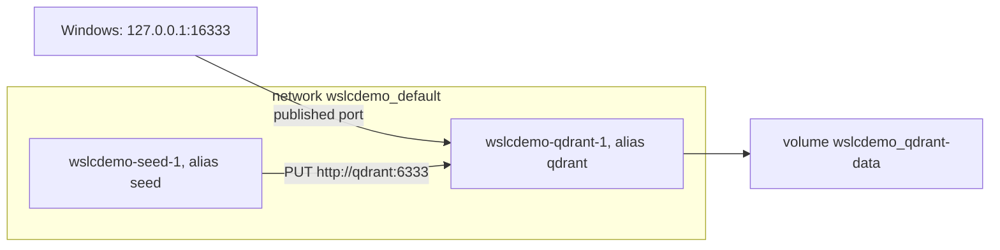

For most C# and Java developers, containers in daily work mean a `compose.yaml` file: a database, a message broker and sometimes the application itself, started together by `docker compose up`. Spring Boot can even start that file for you when the application starts, and .NET developers often use one next to their solution. So the first question about any new container tool is whether it reads `compose.yaml`.

For `wslc` 2.9.11, the answer is no. This lesson shows the checks behind that answer, a dead end worth knowing about, and what Compose actually does under the hood, so that you can reproduce a small stack with plain `wslc` commands. Every output comes from the [journal](../journal/).

## No `compose` command

```text
> wslc compose --help
Unrecognized command: 'compose'
```

`wslc --help` lists no Compose equivalent either, and the [official tutorial](https://learn.microsoft.com/windows/wsl/tutorials/wsl-containers) doesn't mention it. `wslc` 2.9.11 has no Compose support.

## Dead end: pointing `docker compose` at the session engine

With Docker Desktop, the `docker compose` command is only a client: it talks to the Docker Engine API through a named pipe or a Unix socket. So the idea is tempting: if the `wslc` session runs a compatible engine, point Compose at it. The session VM does run one:

```text
> wslc system session run ps -eo pid,args
  131 /usr/bin/containerd --address /run/containerd/containerd.sock --root /var/lib/docker/containerd/daemon --state /run/docker/containerd/daemon
  132 /usr/bin/dockerd --containerd /run/containerd/containerd.sock
> wslc system session run ls -la /var/run/docker.sock
srw-rw---- 1 root docker 0 Sep 13 18:47 /var/run/docker.sock
```

`wslc system session run` runs a command in the session VM itself, not in a container. It shows `dockerd` and its socket. But three doors are closed:

1. Nothing exposes that socket to Windows: `wslc` creates no named pipe for it.
2. The VM's own `docker` client doesn't work: `wslc system session run docker version` answers `The handle is invalid. Error code: ERROR_INVALID_HANDLE`.
3. It can't be mounted into a container that has the Docker CLI and Compose, such as `docker:cli`:

```powershell
wslc run --rm -e DOCKER_HOST=unix:///var/run/docker.sock -v /var/run/docker.sock:/var/run/docker.sock docker:cli docker ps
```

```text
Cannot connect to the Docker daemon at unix:///var/run/docker.sock. Is the docker daemon running?
```

The reason is in the mount table of that container. The source of `-v` is read as a **Windows** path: `/var/run/docker.sock` became `C:\var\run\docker.sock`, shared through virtiofs, not the VM's socket:

```text
drvfs on /run/docker.sock type virtiofs (rw,relatime)
```

:::caution[`wslc` creates a missing bind-mount source]
This test left an empty `C:\var\run\docker.sock\` folder on Windows: `wslc` creates the source of a bind mount when it doesn't exist. Remove it by hand afterwards. The long syntax doesn't help either: `--mount type=bind,source=/var/run/docker.sock,...` is refused with `The bind source path must be absolute.`
:::

The same wall stops any tool built on the Docker Engine API, such as Testcontainers for .NET or Java: it needs an endpoint on the Windows side. *To verify* with each release, since the API surface of the preview may change.

## What Compose actually does

Remove the YAML, and a Compose project is a handful of objects with predictable names. Take this two-service file, a qdrant database and a one-shot `seed` container that creates a collection in it:

```yaml
services:
  qdrant:
    image: qdrant/qdrant:v1.19.1
    ports:
      - "127.0.0.1:16333:6333"
    volumes:
      - qdrant-data:/qdrant/storage

  seed:
    image: curlimages/curl:8.16.0
    depends_on:
      - qdrant
    command: >
      --silent --show-error --retry 10 --retry-connrefused --retry-delay 1
      -X PUT http://qdrant:6333/collections/demo
      -H "Content-Type: application/json"
      -d '{"vectors":{"size":4,"distance":"Cosine"}}'

volumes:
  qdrant-data:
```

`docker compose -p wslcdemo config` validates it and prints the fully resolved model, which makes the implicit parts visible:

- **one network per project**, named `wslcdemo_default`, which every service joins;
- **named volumes** prefixed with the project name, here `wslcdemo_qdrant-data`;
- **containers** named `<project>-<service>-<index>`, such as `wslcdemo-qdrant-1`;
- **service names as DNS names** on the project network, which is why `seed` can call `http://qdrant:6333`;
- **start order** from `depends_on`, which only orders the starts: it doesn't wait for qdrant to be ready. That's the job of curl's `--retry-connrefused`.

The diagram shows those objects for the project `wslcdemo`.



## DNS names on a `wslc` network

The key piece is name resolution between containers. On a network created with `wslc network create`, it works, including extra aliases given with `--network-alias`. On the default network, it doesn't:

```text
> wslc run --rm --network demo alpine wget -qO- http://qdrant:6333/
{"title":"qdrant - vector search engine","version":"1.19.1","commit":"6ab21cac18ebb6f4ae29102c7f8f5cc11affd5de"}
> wslc run --rm --network demo alpine wget -qO- http://vectors:6333/readyz      # --network-alias vectors
all shards are ready
> wslc run --rm alpine wget -qO- -T 5 http://qdrant:6333/                      # default network
wget: bad address 'qdrant:6333'
```

In that test, a qdrant container called `qdrant` ran on a network named `demo`, with the extra alias `vectors`. Its name and every alias resolve for the other containers of that network. This is the same behavior as Docker's user-defined networks, and the reason Compose creates one per project.

## The translation, in PowerShell

With those pieces, the file becomes two scripts. The code is in [`code/wsl-containers/compose`](https://github.com/spareilleux/learn/tree/main/code/wsl-containers/compose). `wslc-up.ps1`:

```powershell
# Equivalent of `docker compose -p wslcdemo up -d` for compose.yaml, with wslc
$project = 'wslcdemo'

# What Compose creates implicitly: one network per project, named volumes
wslc network create "${project}_default"
wslc volume create "${project}_qdrant-data"

# service qdrant (the service name becomes a DNS alias on the project network)
wslc run -d --name "$project-qdrant-1" --network "${project}_default" --network-alias qdrant `
    -p 127.0.0.1:16333:6333 -v "${project}_qdrant-data:/qdrant/storage" qdrant/qdrant:v1.19.1

# service seed (depends_on only orders the start: curl retries until qdrant answers)
wslc run --name "$project-seed-1" --network "${project}_default" --network-alias seed `
    curlimages/curl:8.16.0 --silent --show-error --retry 10 --retry-connrefused --retry-delay 1 `
    -X PUT http://qdrant:6333/collections/demo -H 'Content-Type: application/json' `
    -d '{"vectors":{"size":4,"distance":"Cosine"}}'
```

`wslc-down.ps1`:

```powershell
# Equivalent of `docker compose -p wslcdemo down --volumes`
$project = 'wslcdemo'
wslc container stop "$project-qdrant-1"
wslc container remove "$project-qdrant-1" "$project-seed-1"
wslc network remove "${project}_default"
wslc volume remove "${project}_qdrant-data"
```

| `compose.yaml` | `wslc` |
|---|---|
| the project | a `$project` prefix on every name |
| the implicit default network | `wslc network create "${project}_default"` |
| `volumes:` at the top level | `wslc volume create` |
| a service | `wslc run --name <project>-<service>-1 --network … --network-alias <service>` |
| `ports:` | `-p 127.0.0.1:16333:6333` |
| `command:` | the arguments after the image name |
| `depends_on:` | the order of the lines in the script |
| `down --volumes` | `stop`, `remove`, then `network remove` and `volume remove` |

:::note[Quoting JSON in PowerShell]
The seed's `-d '{"vectors":…}'` passes double quotes to a native program. The run below worked; *to verify* in Windows PowerShell 5.1, whose native argument passing is known to drop embedded double quotes. The JSON files of [lesson 7](../07-volumes-and-a-real-service/) avoid the question entirely.
:::

## The result

After `wslc-up.ps1`, `wslc container list --all` shows the seed already done and qdrant running:

```text
CONTAINER ID   IMAGE                  COMMAND                  CREATED         STATUS                              PORTS                       NAMES
28be34e431f5   curlimages/curl:8.1…   "/entrypoint.sh --si…"   1 second ago    Exited (0) Less than a second ago                               wslcdemo-seed-1
c1f82d52d6ca   qdrant/qdrant:v1.19…   "./entrypoint.sh"        2 seconds ago   Up 1 second                         127.0.0.1:16333->6333/tcp   wslcdemo-qdrant-1
> wslc logs wslcdemo-seed-1
{"result":true,"status":"ok","time":0.409039704}
> curl.exe http://127.0.0.1:16333/collections
{"result":{"collections":[{"name":"demo"}]},"status":"ok","time":0.00004439}
```

The seed exited with code 0 and its log is qdrant's answer to the `PUT`, and the collection `demo` exists. After `wslc-down.ps1`, there is no container left, only the default `bridge`, `host` and `none` networks, and no volume.

On GitHub Actions, the hosted runners have no WSL containers service, so CI can't run these scripts. It runs the original `compose.yaml` with Docker Compose instead, and checks that the seed creates the collection: that proves the file the scripts translate is correct.

## Health checks exist, `condition: service_healthy` doesn't

Compose can wait for a service to be **healthy** before starting the next one, with `depends_on` and `condition: service_healthy`. The waiting is Compose's; the health check itself is the engine's, and `wslc run --help` lists the options: `--health-cmd`, `--health-interval`, `--health-retries`, `--health-start-period` and `--health-timeout`. A test for this lesson, with a container that only becomes ready after six seconds:

```powershell
wslc run -d --name hc --health-cmd 'test -f /tmp/ready' --health-interval 2s alpine sh -c 'sleep 6; touch /tmp/ready; sleep 60'
wslc container list
```

```text
CONTAINER ID   IMAGE    COMMAND                  CREATED         STATUS                            PORTS   NAMES
1f3750e9e55b   alpine   "sh -c 'sleep 6; tou…"   4 seconds ago   Up 3 seconds (health: starting)           hc
```

Eight seconds later:

```text
CONTAINER ID   IMAGE    COMMAND                  CREATED          STATUS                    PORTS   NAMES
1f3750e9e55b   alpine   "sh -c 'sleep 6; tou…"   12 seconds ago   Up 11 seconds (healthy)           hc
```

`wslc container inspect hc` also has a `"Health"` object, with a `FailingStreak` counter and a `Log` of the last checks. So a script can reproduce `service_healthy` by polling the status until it says `(healthy)` before running the next service. The health command runs inside the container, so it can only use the tools of the image.

## What the script doesn't give you

For a stack of two or three services, a script reproduces what matters: the network, the volumes, the DNS names and the start order. What it doesn't reproduce:

- **reading `compose.yaml`**: the file and the script can drift apart, and nothing checks it;
- **`depends_on` with `condition: service_healthy`**: the health check runs, but waiting for it is a loop you write yourself;
- **a diff-based `up`**, which only recreates the services whose configuration changed; the script runs every command again, and *to verify* is how each `create` and `run` behaves when its object already exists;
- **`logs -f` over all services**, interleaved and colored by service;
- **profiles, `extends`, `.env` interpolation** and the rest of the [Compose specification](https://compose-spec.io/).

For a real Compose project, Docker Desktop or Podman remains the tool. `wslc` fits a small, stable set of services, or a Windows application that starts its own containers ([lesson 9](../09-csharp-api/)).

## Key takeaways

- `wslc` 2.9.11 has no `compose` command, and doesn't expose its session's Docker engine to Windows, so `docker compose` and other Docker API clients can't use it.
- `-v /var/run/docker.sock:…` mounts a Windows path, not the VM's socket, and `wslc` silently creates a missing bind-mount source.
- Compose adds a network per project, prefixed volumes, predictable container names, DNS names for services and a start order.
- On a network created with `wslc network create`, container names and `--network-alias` values resolve; on the default network, they don't.
- `depends_on` only orders the start. Readiness is the client's job, here with curl's `--retry-connrefused`, or a loop that waits for the `(healthy)` status of a `--health-cmd`.
- A script can translate a small stack, but it doesn't read the YAML, doesn't wait for health checks unless you write the loop, and doesn't compare the running stack with the file.

## Exercises

1. Inside the `seed` container, the URL is `http://qdrant:6333`. From Windows, it's `http://127.0.0.1:16333`. Explain each part of both URLs.

<details>
<summary>Solution</summary>

`qdrant` is the DNS alias of the qdrant container on the project network, which only other containers of that network can resolve, and 6333 is the port qdrant listens on inside its container. From Windows, the container network isn't reachable: you go through the published port, `127.0.0.1:16333`, which `wslc` forwards to port 6333 of the container.

</details>

2. You remove `--retry 10 --retry-connrefused --retry-delay 1` from the seed command, because `depends_on` is there. What can go wrong, and why?

<details>
<summary>Solution</summary>

`depends_on`, like the order of the lines in the script, only guarantees that the qdrant container **started** first, not that qdrant is **listening**. If curl runs in the gap between the two, the connection is refused, curl exits with an error, and the collection is never created. In the test above, the seed started one second after qdrant: a race that happens to be won is not a guarantee. The retries turn the race into a wait.

</details>

3. Change the scripts so that `down` keeps the data, like `docker compose down` without `--volumes`. What happens at the next `up`?

<details>
<summary>Solution</summary>

Remove the last line of `wslc-down.ps1`, `wslc volume remove`, and update its comment. At the next `up`, `wslc volume create "${project}_qdrant-data"` meets an existing volume: *to verify* whether `wslc` reports an error there or reuses it. The qdrant container then mounts the old volume, and the seed's `PUT` targets a collection that already exists, which qdrant may refuse. Either way the data are still there, which you can check with `curl.exe http://127.0.0.1:16333/collections`.

</details>

4. A container on the default network runs `wget http://qdrant:6333/` and gets `bad address`. Give two fixes.

<details>
<summary>Solution</summary>

Name resolution only works on a user-defined network. Either run the client on the same network as qdrant, with `--network demo`, or, for a container that is already running, connect it with `wslc network connect demo <container>`. The second command appears in `wslc network --help`; *to verify:* its effect on a running container in 2.9.11.

</details>

5. Write the `wslc run` line for a third service, a `redis:8` cache reachable from the other containers as `cache`, with no port published to Windows.

<details>
<summary>Solution</summary>

```powershell
wslc run -d --name "$project-redis-1" --network "${project}_default" --network-alias cache redis:8
```

No `-p`, because only containers of the project network need it. Add `wslc container stop` and `remove` of `$project-redis-1` to the `down` script. *To verify:* this line was not run; the `redis:8` tag must exist on Docker Hub when you try it.

</details>

## Sources

- [Get started with containers on WSL — Microsoft Learn](https://learn.microsoft.com/windows/wsl/tutorials/wsl-containers)
- [WSL container — Microsoft Learn](https://learn.microsoft.com/windows/wsl/wsl-container)
- [Compose specification](https://compose-spec.io/) and [Networking in Compose](https://docs.docker.com/compose/how-tos/networking/) — Docker docs
- [Dockerfile reference: `HEALTHCHECK`](https://docs.docker.com/reference/dockerfile/#healthcheck) — Docker docs (the `--health-*` options of `run` override it)
- [Control startup order in Compose](https://docs.docker.com/compose/how-tos/startup-order/) — Docker docs
- [curl man page: `--retry-connrefused`](https://curl.se/docs/manpage.html#--retry-connrefused)
- [qdrant documentation](https://qdrant.tech/documentation/)
