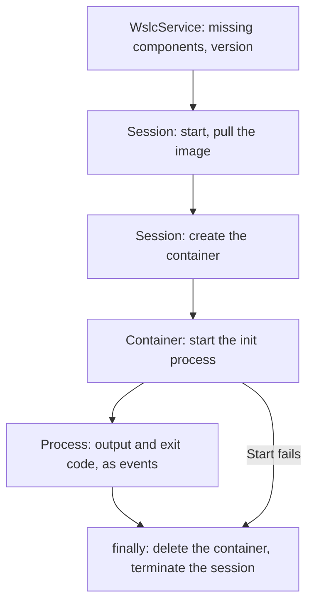
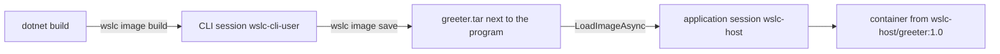

If you have started containers from .NET or Java code before, you probably did it through a Docker client: [Testcontainers](https://testcontainers.com/) for integration tests, or the Docker.DotNet and docker-java libraries. They all speak HTTP to the Docker Engine API, over a named pipe or a socket, and they share one engine with every other tool on the machine.

The WSL container API works differently. [`Microsoft.WSL.Containers`](https://www.nuget.org/packages/Microsoft.WSL.Containers) is a NuGet package that a **Windows application** calls in process. The application creates its own **session**, with its own VM, its own disk and its own limits, then pulls images and runs containers in it. There is no daemon to install and no socket to find: if WSL 2.9 or later is present, the application can use Linux containers as part of its own logic.

This lesson builds the smallest useful program, runs into what the preview documentation gets wrong, and then goes one step further: an image built during `dotnet build`, shipped as a file next to the program. The code is in [`code/wsl-containers/wslc-host`](https://github.com/spareilleux/learn/tree/main/code/wsl-containers/wslc-host); the outputs are from the [journal](../journal/), with package 2.9.9 on WSL 2.9.11.

## The objects

The API follows the life of a container:

| Object | Role |
|---|---|
| `WslcService` | check that WSL components are installed, service version |
| `Session` | WSL host that manages images and creates containers |
| `Container` | start, stop, inspect, delete; launch processes |
| `Process` | read `stdout`/`stderr`, write to `stdin`, send signals |

If you know the Docker CLI, a `Session` plays the role of the engine, `Container` the role of `docker create`, `start`, `inspect` and `rm`, and `Process` the role of the attached output of `docker run` or `docker exec`.

## A project that compiles

Start with the snippet of the [Microsoft Learn page](https://learn.microsoft.com/windows/wsl/wsl-container), paste it into a console project that references the package, and the build fails with five errors:

```text
error CS0103: The name 'ComponentFlags' does not exist in the current context
error CS0117: 'SessionSettings' does not contain a definition for 'MemoryMB'
error CS0117: 'ProcessSettings' does not contain a definition for 'CmdLine'
error CS0103: The name 'DeleteContainerFlags' does not exist in the current context
error CS1705: Assembly 'wslcsdkcs' with identity 'wslcsdkcs, Version=1.0.0.0, Culture=neutral, PublicKeyToken=null' uses 'Microsoft.Windows.SDK.NET, Version=10.0.26100.79, Culture=neutral, PublicKeyToken=31bf3856ad364e35' which has a higher version than referenced assembly 'Microsoft.Windows.SDK.NET' with identity 'Microsoft.Windows.SDK.NET, Version=10.0.19041.38, Culture=neutral, PublicKeyToken=31bf3856ad364e35'
```

### Four names changed

The page describes an earlier state of the API. The real names come from reading the public types of `wslcsdkcs.dll`, the managed assembly of the package, with [`MetadataLoadContext`](https://learn.microsoft.com/dotnet/standard/assembly/inspect-contents-using-metadataloadcontext), which loads an assembly for inspection without running it:

| Microsoft Learn | Package 2.9.9 |
|---|---|
| `ComponentFlags GetMissingComponents()` | `IReadOnlyList<Component> GetMissingComponents()` (`VirtualMachinePlatform`, `WslPackage`, `SdkNeedsUpdate`) |
| `SessionSettings.MemoryMB` | `SessionSettings.MemorySizeInMB` |
| `ProcessSettings.CmdLine` | `ProcessSettings.CommandLine` (`IList<string>`) |
| `DeleteContainerFlags.None` | `DeleteContainerOption.None` / `Force` |

In an IDE, the object browser or Go to Definition shows the same thing. For a preview package, trust the compiler over the page.

### `CS1705`: the Windows SDK projection

The package is a [C#/WinRT](https://learn.microsoft.com/windows/apps/develop/platform/csharp-winrt/) projection, with a native DLL for x64 and arm64 only. It declares the target `net8.0-windows10.0.19041.0`, but its `wslcsdkcs.dll` is compiled against `Microsoft.Windows.SDK.NET` 10.0.26100.79, a newer projection than the one that target brings.

Moving the project to `net10.0-windows10.0.26100.0` isn't enough: the .NET SDK then picks projection 10.0.26100.38, and the error stays. The version has to be forced with `WindowsSdkPackageVersion`, and `10.0.26100.79` itself doesn't exist on nuget.org: `NU1102`, the nearest being `10.0.26100.80`. The project file that works:

```xml
<PropertyGroup>
  <OutputType>Exe</OutputType>
  <TargetFramework>net10.0-windows10.0.26100.0</TargetFramework>
  <WindowsSdkPackageVersion>10.0.26100.80</WindowsSdkPackageVersion>
  <RuntimeIdentifier>win-x64</RuntimeIdentifier>
</PropertyGroup>
<ItemGroup>
  <PackageReference Include="Microsoft.WSL.Containers" Version="2.9.9" />
</ItemGroup>
```

`RuntimeIdentifier` picks the native DLL; use `win-arm64` on an Arm machine.

## The program

```csharp
using System.Runtime.InteropServices;
using System.Text;
using Microsoft.WSL.Containers;

const string ContainerName = "wslc-host-hello";

var missing = WslcService.GetMissingComponents();
if (missing.Count > 0)
{
    Console.WriteLine($"Missing WSL components: {string.Join(", ", missing)} (run wsl --install)");
    return 1;
}
var version = WslcService.GetVersion();
Console.WriteLine($"WSL container service {version.Major}.{version.Minor}.{version.Revision}");

// The session keeps its images and containers in its own storage.vhdx.
var storage = Path.Combine(Environment.GetFolderPath(Environment.SpecialFolder.LocalApplicationData), "WslcHost");
using var session = new Session(new SessionSettings("wslc-host", storage)
{
    CpuCount = 2,
    MemorySizeInMB = 2048
});
session.Start();
Console.WriteLine($"Session started, storage in {storage}");

// A container left by a crashed run survives in storage.vhdx and blocks the name.
try
{
    using var leftover = session.OpenContainer(ContainerName, ProcessOutputMode.Discard);
    leftover.Delete(DeleteContainerOption.Force);
    Console.WriteLine($"Removed leftover container {ContainerName}");
}
catch (COMException) { }

await session.PullImageAsync(new PullImageOptions("docker.io/library/alpine:latest"));
foreach (var image in session.GetImages())
    Console.WriteLine($"Image {image.Name} ({image.Size / 1024 / 1024} MB)");

using var container = session.CreateContainer(new ContainerSettings("alpine:latest")
{
    Name = ContainerName,
    InitProcess = new ProcessSettings
    {
        CommandLine = args.Length > 0 ? [.. args] : ["/bin/sh", "-c", "echo Hello from $(cat /etc/alpine-release) on $(uname -r)"],
        OutputMode = ProcessOutputMode.Event
    }
});

try
{
    var exited = new TaskCompletionSource<int>();
    container.InitProcess.OutputReceived += data => Console.Write(Encoding.UTF8.GetString(data));
    container.InitProcess.Exited += code => exited.TrySetResult(code);
    container.Start();

    var exitCode = await exited.Task.WaitAsync(TimeSpan.FromMinutes(2));
    Console.WriteLine($"Container {container.Id[..12]} exited with code {exitCode}");
    return exitCode;
}
finally
{
    container.Delete(DeleteContainerOption.Force);
    session.Terminate();
}
```

A few things a C# reader will recognize:

- The `Session` and the `Container` are `IDisposable`, so `using var` releases their native handles at the end of the method.
- The output arrives as **events**, `OutputReceived` with raw bytes and `Exited` with the exit code. A [`TaskCompletionSource<int>`](https://learn.microsoft.com/dotnet/api/system.threading.tasks.taskcompletionsource-1) turns the exit event into a task, and `WaitAsync` puts a timeout on it.
- Errors from the native side surface as [`COMException`](https://learn.microsoft.com/dotnet/api/system.runtime.interopservices.comexception), or as `ArgumentException` for an invalid parameter.
- Command-line arguments, when given, replace the default command: `dotnet run -- /bin/cat /etc/os-release` runs that command instead.

```text
WSL container service 2.9.11
Session started, storage in C:\Users\spare\AppData\Local\WslcHost
Image alpine:latest (8 MB)
Hello from 3.24.1 on 6.18.40.1-microsoft-standard-WSL2
Container b27dd2f80927 exited with code 0
```

The whole run took 7 seconds, including the pull of `alpine` into a new, empty session. The container sees the session's limits, not those of `settings.yaml`: `nproc` printed `2`, and `free -m` a total of `1907` MB for `MemorySizeInMB = 2048`.

The program uses the four objects in order, and its finally block cleans up even when the container fails to start.



## Where the application's session shows up

While a 20-second container ran, the CLI saw the application's session next to its own two:

```text
> wslc system session list
ID   Creator PID   Display Name
6    350476        wslc-cli-admin-spare
8    275812        wslc-cli-spare
16   110952        wslc-host
> Get-Process vmmem*
vmmemCmZygote     0
vmmemWSL       3307
vmmemwslc-host  510
> wslc --session wslc-host container list
CONTAINER ID   IMAGE           COMMAND                  CREATED         STATUS         PORTS   NAMES
2e75803c92a9   alpine:latest   "/bin/sh -c 'echo st…"   4 seconds ago   Up 3 seconds           wslc-host-hello
```

- The application's session is a regular `wslc` session: the same kind of `vmmem<session>` VM, visible and drivable from the CLI with `--session`. That's the first tool to reach for when the program misbehaves.
- Its disk is where the application chose, `%LocalAppData%\WslcHost\storage.vhdx`, 67 MB after the pull, not under `%LocalAppData%\wslc\sessions`.
- Its limits come from `SessionSettings`: the CLI sessions have 8 CPUs on this machine, the application's containers see 2.
- After `session.Terminate()`, the session and its `vmmem` process disappear at once, without the 30-second idle delay of the CLI sessions ([lesson 6](../06-resources-and-limits/)).

## Trap: a failed start leaves the container behind

The first version of the program had no leftover cleanup and no `Delete` in a `finally`. A run launched from Git Bash with `/bin/sh` as an argument failed: MSYS, the layer that runs Bash on Windows, converted the Linux-looking path to `C:/Program Files/Git/usr/bin/sh`, and `container.Start()` threw:

```text
Unhandled exception. System.ArgumentException: The parameter is incorrect.

failed to create task for container: failed to create shim task: OCI runtime create failed: runc create failed: unable to start container process: error during container init: exec: "C:/Program Files/Git/usr/bin/sh": stat C:/Program Files/Git/usr/bin/sh: no such file or directory: unknown
```

The next run, with a correct command, failed earlier, on `CreateContainer`:

```text
Unhandled exception. System.Runtime.InteropServices.COMException (0x800700B7): Cannot create a file when that file already exists.

Conflict. The container name "/wslc-host-hello" is already in use by container "176a59b772bebfb974a8404150407157d49cc279cbe2f66c2d6e2788f9bfbadc". You have to remove (or rename) that container to be able to reuse that name.
```

The container had been created, never started, and it survived the process in `storage.vhdx`. The program above has the two fixes: `Delete(DeleteContainerOption.Force)` in a `finally`, and, at startup, `OpenContainer` then `Delete` of a leftover with the same name, where a `COMException` simply means there is none. Verified: the leftover was removed (`Removed leftover container wslc-host-hello`), and a command that doesn't exist, `/nope`, no longer leaves anything behind.

It's the same discipline as with any unmanaged resource: a native object created by your process doesn't disappear with the process.

## Building the image during `dotnet build`

Pulling `alpine` from Docker Hub is fine for a test. A real application ships its own image, and the package has a way to build it with the program. Its MSBuild targets, in `build\Microsoft.WSL.Containers.common.targets`, add a `WslcImage` item: after `Build`, they run `wslc image build`, then `wslc image save` to a `.tar` next to the program. A test project:

```xml
<ItemGroup>
  <PackageReference Include="Microsoft.WSL.Containers" Version="2.9.9" />
  <WslcImage Include="greeter" Image="wslc-host/greeter:1.0" Dockerfile="container/Containerfile" Context="container/" />
</ItemGroup>
```

```dockerfile
FROM docker.io/library/alpine:3.24
COPY greet.sh /usr/local/bin/greet
RUN chmod +x /usr/local/bin/greet
ENTRYPOINT ["/usr/local/bin/greet"]
```

The first trap is the one from [lesson 2](../02-installation/): the targets call a bare `wslc`, so a terminal or an IDE opened before WSL was updated doesn't find it:

```text
error WSLC0001: The wslc CLI check failed: 'wslc --version' returned exit code 9009. Install WSL by running 'wsl --install --no-distribution', or set the WslcCliPath property to a specific wslc.exe path.
```

With `-p:WslcCliPath="C:\Program Files\WSL\wslc.exe"`, or from a new terminal:

```text
  WSLC: Building image 'wslc-host/greeter:1.0'...
    | naming to docker.io/wslc-host/greeter:1.0
  WSLC: Saving image 'wslc-host/greeter:1.0' to 'bin\Debug\net10.0-windows10.0.26100.0\win-x64\greeter.tar'...
Build succeeded.
```

That took 9 seconds and produced an 8.3 MB `greeter.tar`. The image is built in the CLI session, `wslc-cli-spare`, where it stays.

The build is incremental. The target compares the files of `Context`, and a `wslc.greeter.options` file that records the options, with the `.tar`:

| Change | `dotnet build` | `.tar` |
|---|---|---|
| none | 1 s, no `WSLC:` line | unchanged |
| `greet.sh` touched | 2 s, rebuilt (layer cache) | rewritten |
| `echo edited` added to `greet.sh` | 3 s, rebuilt | rewritten |
| none | 2 s, no `WSLC:` line | unchanged |

Each real change leaves the previous image untagged, as `<none>`, in the CLI session. That's what the `WslcPruneAfterBuild` property is for.

### Loading the `.tar` into the application's session

[`LoadImageAsync`](https://wsl.dev/api-reference/), the equivalent of `wslc load`, keeps the tag and the `ENTRYPOINT`. `CommandLine` then passes arguments to the entrypoint, like `docker run image args`:

```csharp
await session.LoadImageAsync(Path.Combine(AppContext.BaseDirectory, "greeter.tar"));
// ... new ContainerSettings("wslc-host/greeter:1.0") with CommandLine = ["Claude"]
```

```text
before: 
load 427 ms
after: wslc-host/greeter:1.0
Hello Claude from an image built by dotnet build (alpine 3.24.1)
edited
exit 0
```

The session had no image before, and the load took 427 ms. The full chain works without a registry: `dotnet build` produces the image, the `.tar` ships with the program, and the program loads it into its own session.



### `ImportImageAsync` is something else

`ImportImageAsync`, the equivalent of `wslc import`, expects a **flat filesystem**, like the one `wslc export` produces from a container. Given the `.tar` from `image save`, an OCI layout that starts with `blobs/sha256/…`, it accepts the file, but the resulting image has no entrypoint, so `CommandLine = ["Claude"]` fails with `exec: "Claude": executable file not found in $PATH`, and it has no `/bin/sh` either:

```text
failed to create task for container: failed to create shim task: OCI runtime create failed: runc create failed: unable to start container process: error during container init: exec: "/bin/sh": stat /bin/sh: no such file or directory: unknown
```

Checked with the CLI: `wslc export` of an Alpine container, then `wslc import`, then `wslc run --rm exptest/rootfs:1 /bin/cat /etc/alpine-release` printed `3.24.1`, and `image inspect` showed `"Cmd": null` and `"Entrypoint": null`. `save` and `load` carry an image; `export` and `import` carry a filesystem.

:::caution[No network by default]
A container created by the API gets `NetworkMode: none`: no interface other than `lo`, and no internet access, unlike `wslc run`. Set `NetworkingMode = ContainerNetworkingMode.Bridged` in `ContainerSettings` for a service that calls out or publishes ports. The measurement is in [lesson 10](../10-networking-kubernetes-gui/).
:::

## Continuous integration

On GitHub Actions, the hosted Windows runners have no WSL containers service. The [workflow](https://github.com/spareilleux/learn/blob/main/.github/workflows/wsl-containers-examples.yml) of this course only **compiles** `wslc-host`, which at least catches the `CS0117` and `CS1705` kind of errors when the package changes. Running it needs a Windows machine with WSL 2.9 or later.

## Key takeaways

- `Microsoft.WSL.Containers` runs in the application's process: no daemon, no socket, and a session of its own, with its own VM, disk and limits.
- Package 2.9.9 needs `net10.0-windows10.0.26100.0`, `WindowsSdkPackageVersion` 10.0.26100.80 and a runtime identifier, or the build fails with `CS1705`.
- The Microsoft Learn snippet uses older names: `GetMissingComponents` returns a list, and the properties are `MemorySizeInMB`, `CommandLine` and `DeleteContainerOption`.
- The application's session is a regular session: `wslc --session <name>` lists and inspects its containers.
- A container that fails to start survives the process. Delete it in a `finally`, and remove leftovers at startup.
- A `WslcImage` item builds and saves an image during `dotnet build`; load the `.tar` with `LoadImageAsync`, not `ImportImageAsync`.
- API containers have no network unless `NetworkingMode` is set to `Bridged`.

## Exercises

1. Rewrite these three lines from the Microsoft Learn page so that they compile against package 2.9.9:

```csharp
if (WslcService.GetMissingComponents() != ComponentFlags.None) return 1;
var settings = new SessionSettings("demo", storage) { MemoryMB = 1024 };
container.Delete(DeleteContainerFlags.None);
```

<details>
<summary>Solution</summary>

```csharp
if (WslcService.GetMissingComponents().Count > 0) return 1;
var settings = new SessionSettings("demo", storage) { MemorySizeInMB = 1024 };
container.Delete(DeleteContainerOption.None);
```

`GetMissingComponents` returns an `IReadOnlyList<Component>`, empty when everything is installed. *To verify:* these three lines were checked against the names read from the assembly, not compiled on their own.

</details>

2. Your program crashed during a run. The next run throws `COMException (0x800700B7)` with `Conflict. The container name … is already in use`. How do you get out of this state from the command line, without changing the code?

<details>
<summary>Solution</summary>

The leftover container is in the application's session, not in the CLI session. Name the session with the global option:

```powershell
wslc --session wslc-host container list --all
wslc --session wslc-host container remove wslc-host-hello
```

This only works while the application's session is running; *to verify:* whether the CLI can open a stopped application session by its name. The lasting fix is in the code: `Delete` in a `finally`, and removing a leftover at startup.

</details>

3. Why does the program pass `ProcessOutputMode.Event` for the init process, and what would you lose with `ProcessOutputMode.Discard`, the mode used to open the leftover container?

<details>
<summary>Solution</summary>

With `Event`, the process raises `OutputReceived` for each chunk of output, which the program writes to the console. With `Discard`, the output is thrown away: that's fine for a container you only open to delete, but you would no longer see `Hello from 3.24.1 …`. The exit code still arrives through `Exited` in both cases, *to verify* for `Discard`.

</details>

4. A colleague builds the project in Visual Studio and gets `WSLC0001` with exit code 9009, while `wslc --version` works in their terminal. Explain, and give two fixes.

<details>
<summary>Solution</summary>

Exit code 9009 means "command not found". Visual Studio was started before WSL 2.9 was installed and kept the old `PATH`, so the MSBuild target can't find the bare `wslc`. Either restart Visual Studio, so that it inherits the new `PATH`, or set the property in the project or on the command line: `-p:WslcCliPath="C:\Program Files\WSL\wslc.exe"`.

</details>

5. You receive two files: `app.tar`, made by `wslc save`, and `rootfs.tar`, made by `wslc export`. Which API method loads each one, and what do you have to add when you run the second?

<details>
<summary>Solution</summary>

`app.tar` is an image with its layers and configuration: load it with `LoadImageAsync`, and it keeps its tag and its `ENTRYPOINT`. `rootfs.tar` is only a filesystem: load it with `ImportImageAsync`. The resulting image has no `Cmd` and no `Entrypoint`, so you must give the full command in `CommandLine`, starting with an executable that exists in that filesystem, such as `/bin/cat`.

</details>

## Sources

- [WSL container — Microsoft Learn](https://learn.microsoft.com/windows/wsl/wsl-container): overview and API sample
- [WSL container API reference](https://wsl.dev/api-reference/), and the full samples at [aka.ms/wslc-samples](https://aka.ms/wslc-samples)
- [`Microsoft.WSL.Containers` — NuGet](https://www.nuget.org/packages/Microsoft.WSL.Containers)
- [C#/WinRT — Microsoft Learn](https://learn.microsoft.com/windows/apps/develop/platform/csharp-winrt/)
- [Inspect assembly contents using MetadataLoadContext — Microsoft Learn](https://learn.microsoft.com/dotnet/standard/assembly/inspect-contents-using-metadataloadcontext)
- [Target frameworks: OS version in TFMs — Microsoft Learn](https://learn.microsoft.com/dotnet/standard/frameworks#support-older-os-versions)
- [Testcontainers](https://testcontainers.com/)
