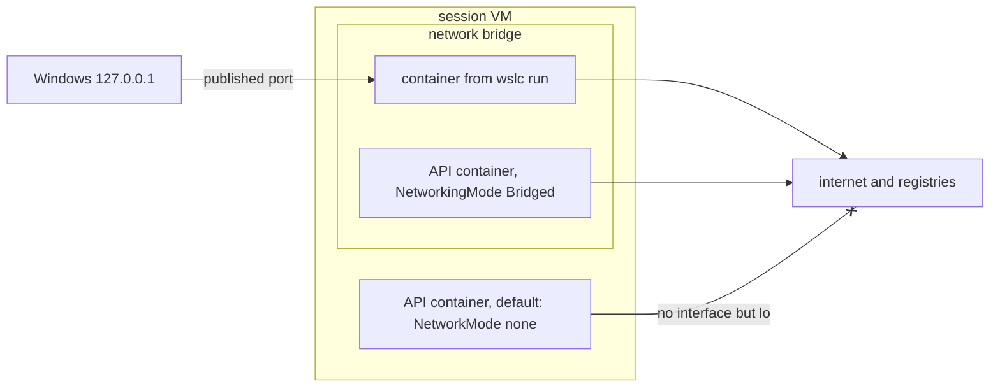

Docker Desktop is more than an engine. It has a dashboard, a Kubernetes checkbox, an extensions marketplace, and a network setup that most developers never have to think about: publish a port, open `localhost`, done. This last lesson checks those parts one by one against `wslc` 2.9.11, from the most useful day to day, networking, to what is simply not there.

The outputs come from the [journal](../journal/), except the capabilities check of the CLI container, run again for this lesson.

## Where a published port listens

By default, `wslc` publishes on `127.0.0.1` only, which you have seen in every `PORTS` column since [lesson 3](../03-first-containers/):

```text
CONTAINER ID   IMAGE   COMMAND                  CREATED         STATUS         PORTS                    NAMES
1796028d1f6a   nginx   "/docker-entrypoint.…"   3 seconds ago   Up 2 seconds   127.0.0.1:8080->80/tcp   web
```

Docker Desktop, by contrast, publishes on every address, IPv4 and IPv6, unless you give one. On Windows, the listener of the `wslc` container belongs to a `dllhost` process:

```text
TCP  0.0.0.0:8080     LISTENING  com.docker.backend
TCP  [::]:8080        LISTENING  com.docker.backend
TCP  127.0.0.1:8080   LISTENING  dllhost      ← wslc
TCP  [::1]:8080       LISTENING  wslrelay
```

That table comes from the port conflict test of [lesson 5](../05-wslc-vs-docker/), with Docker Desktop and `wslc` on the same port. Two settings of `settings.yaml` change this behavior ([lesson 6](../06-resources-and-limits/)):

- `defaultBindingAddress`, `127.0.0.1` by default, is the address `-p` uses when you don't give one;
- `hostLoopback` is about the other direction: the name `host.wslc.internal`, for a container that needs to reach a service running on Windows. *To verify:* the name was read in the settings file, not tested from a container.

An explicit address in `-p` is accepted: `wslc run -d -p 0.0.0.0:8082:80 nginx` started without an error, and `127.0.0.1:8082` reached it. *To verify:* whether such a port is then reachable from another machine on the network, which also depends on the Windows firewall.

A safe default for a developer machine: a database or a message broker in a container has no reason to be reachable from the local network.

## The networks of a session

Each session runs its own engine, so each one has its own networks. The same `wslc network list`, from the administrator session:

```text
> wslc network list
d9c6879f7df3   bridge    bridge    local
0dd65e6d15ec   host      host      local
34ad73ecd806   none      null      local
```

The three default networks are those of Docker: `bridge`, where `wslc run` connects a container by default; `host`, the network stack of the VM itself; and `none`, no network at all. In the non-elevated session, the same three networks have **different IDs**. A network created with `wslc network create` in one session doesn't exist in the other.

`wslc network --help` lists `create`, `remove`, `inspect`, `list`, `prune`, `connect` and `disconnect`. [Lesson 8](../08-compose/) showed the most important property of a created network: container names and `--network-alias` values resolve as DNS names on it, while on the default `bridge` network they don't.

## API containers start without a network

The CLI and the API don't have the same default. `container.Inspect()` reports `"NetworkMode":"none"` when `ContainerSettings.NetworkingMode` isn't set. Same Alpine container, created twice from C#, printing `ip -4 addr` then trying `wget` to the internet:

```text
--- NetworkingMode=default
NetworkMode in inspect: none
    inet 127.0.0.1/8 scope host lo
no internet
--- NetworkingMode=Bridged
NetworkMode in inspect: bridge
    inet 127.0.0.1/8 scope host lo
    inet 172.17.0.2/16 brd 172.17.255.255 scope global eth0
internet ok
```

Without the setting, the container only has the loopback interface. With `Bridged`, it gets an `eth0` address on the `bridge` network, `172.17.0.2`, and reaches the internet.

The image pull works either way, because the session pulls images, not the container. So a program can pull an image, start a container and get its output, and only discover the missing network when the service inside tries to call out, or when a published port doesn't answer.

```csharp
new ContainerSettings("alpine:latest")
{
    NetworkingMode = ContainerNetworkingMode.Bridged,
    // ...
}
```

The diagram sums up the three cases of this lesson.



## Kubernetes: no, not even k3s

`wslc` has no Kubernetes command, and the WSL Settings app has no Kubernetes page. With Docker, a common workaround is to run a small distribution such as [k3s](https://k3s.io/) inside a privileged container. It needs `--privileged`, because Kubernetes has to manage control groups and mounts, the very things a container is normally denied.

### From the CLI

`wslc run --help` has no `--privileged` or `--cap-add` option. Without them, k3s stops immediately:

```powershell
wslc run -d --name k3s-cli --tmpfs /run --tmpfs /var/run rancher/k3s:v1.36.4-k3s1 server
```

```text
time="2026-09-14T02:17:38Z" level=fatal msg="Error: failed to evacuate root cgroup: mkdir /sys/fs/cgroup/init: read-only file system"
```

The control group filesystem is mounted read-only in the container, so k3s can't create its own group. You can see the limits of a CLI container with three commands, run again for this lesson:

```powershell
wslc run --rm alpine sh -c 'grep cgroup /proc/mounts; grep CapEff /proc/self/status; ls /dev | wc -l'
```

```text
cgroup /sys/fs/cgroup cgroup2 ro,nosuid,nodev,noexec,relatime 0 0
CapEff:	00000000a80425fb
15
```

- The `ro` in the mount options is the read-only control group filesystem that stopped k3s.
- `CapEff` is the bit mask of the container's effective **capabilities**, the pieces of root's power that Linux hands out one by one. `a80425fb` is Docker's default set, without `CAP_SYS_ADMIN`, the capability that `mount` needs, among others.
- `/dev` has 15 entries: only the basic devices, not the host's.

### From the API: `Privileged` has no effect

The API has what the CLI lacks: `ContainerSettings.Privileged`. Two Alpine containers in the same session, one with each value, printing the same three facts:

```text
--- Privileged=False
cgroup /sys/fs/cgroup cgroup2 ro,nosuid,nodev,noexec,relatime 0 0
CapEff:	00000000a80425fb
15
--- Privileged=True
cgroup /sys/fs/cgroup cgroup2 ro,nosuid,nodev,noexec,relatime 0 0
CapEff:	00000000a80425fb
15
```

Nothing changes: same capabilities, same read-only control groups, same 15 entries in `/dev`. And k3s fails with the same error. The obvious suspect is the session: maybe privileges require an elevated one. The same test **as administrator**, in a session limited to 1 CPU and 1 GB, with one more check, `mount -t tmpfs none /mnt`:

```text
elevated: True
--- Privileged=False  HostConfig={"Memory":0,"NanoCpus":0,"NetworkMode":"none","Ulimits":[]}
cgroup /sys/fs/cgroup cgroup2 ro,nosuid,nodev,noexec,relatime 0 0
CapEff:	00000000a80425fb
dev=15
mount: permission denied (are you root?)
mount denied
--- Privileged=True  HostConfig={"Memory":0,"NanoCpus":0,"NetworkMode":"none","Ulimits":[]}
cgroup /sys/fs/cgroup cgroup2 ro,nosuid,nodev,noexec,relatime 0 0
CapEff:	00000000a80425fb
dev=15
mount: permission denied (are you root?)
mount denied
```

No difference either, and the `HostConfig` returned by `Inspect()` doesn't even have a `Privileged` field. Yet the flag exists in the C header of the SDK, as `WSLC_CONTAINER_FLAG_PRIVILEGED = 0x00000004` in `wslcsdk.h`: declared, but not applied in 2.9.11. k3s wasn't retried.

:::note[Kubernetes on this machine]
For a local cluster, use a tool built for it on top of Docker Desktop or Podman, such as [kind](https://kind.sigs.k8s.io/), which runs each node in a container. The [Kubernetes course](../../kubernetes/) of this site does exactly that, with the images of [lesson 4](../04-build-an-image/). Check the WSL release notes for `Privileged` in a later version.
:::

## Extensions and a graphical interface: none

- `wslc --help` lists `container`, `image`, `network`, `registry`, `settings`, `system`, `volume` and the Docker-style shortcuts. There is no extension or plugin mechanism.
- `wslc settings` only opens `settings.yaml` in the default editor.
- The **WSL Settings** app, the only WSL app in the Start menu besides `WSL` itself, has no container page. Its pages are `About`, `Developer`, `DistroManagement`, `DockerDesktopIntegration`, `FileSystem`, `General`, `GPUAcceleration`, `GUIApps`, `MemAndProc`, `Networking`, `NetworkingIntegration`, `OptionalFeatures`, `VSCodeIntegration`, `VSIntegration` and `WorkingAcrossFileSystems`.

So the day-to-day views of Docker Desktop's dashboard have command-line counterparts only: `wslc container list --all` for the containers, `wslc logs` for their output, `wslc stats` for resources, `wslc image list` and `wslc volume list` for storage.

## What the course found

`wslc` 2.9.11 is a **runtime**, not a platform. It runs, builds, publishes and limits Linux containers without any third-party product, and its API lets a Windows application own its containers, with an image built by `dotnet build` and loaded without a registry. Around that core, there is no Compose, no Kubernetes, no privileged containers, no extensions and no graphical interface. For a single service, a tool or an application that embeds containers, it's enough. For a Compose project, a local cluster or a team that shares a Docker setup, Docker Desktop or Podman stays the tool, and the two can coexist on one machine if you keep their ports apart ([lesson 5](../05-wslc-vs-docker/)).

## Key takeaways

- `wslc` publishes on `127.0.0.1` by default, set by `defaultBindingAddress`; Docker Desktop publishes on every address.
- Each session has its own `bridge`, `host` and `none` networks, with different IDs, and its own user-defined networks.
- Containers created by the API have `NetworkMode: none` unless `NetworkingMode` is `Bridged`, even though the image pull works.
- The CLI has no `--privileged` or `--cap-add`, and k3s stops on a read-only control group filesystem.
- `ContainerSettings.Privileged` is declared but has no effect in 2.9.11, in a normal or an elevated session.
- There are no extensions and no container page in WSL Settings: `wslc` is a runtime, and the CLI is its only interface.

## Exercises

1. A C# program starts an nginx container with a port mapping, but `curl.exe http://127.0.0.1:8080/` gets no answer, while `wslc run -d -p 8080:80 nginx` works. What do you check first?

<details>
<summary>Solution</summary>

The networking mode. An API container without `NetworkingMode` has `NetworkMode: none`, only the loopback interface, so a port mapping has nothing to forward to. Check with `container.Inspect()` or with `wslc --session <name> container inspect <container>`, then set `NetworkingMode = ContainerNetworkingMode.Bridged`. *To verify:* the exact behavior of `PortMappings` on a container with no network, which the journal didn't test.

</details>

2. Read `CapEff: 00000000a80425fb` with a tool of your choice, and say whether the container has `CAP_NET_ADMIN`, bit 12, and `CAP_SYS_ADMIN`, bit 21.

<details>
<summary>Solution</summary>

`capsh --decode=00000000a80425fb`, from the libcap tools of a Linux distribution, lists the capabilities by name. By hand, in PowerShell:

```powershell
$caps = 0xa80425fb
(($caps -shr 12) -band 1), (($caps -shr 21) -band 1)
```

Both lines print `0`. The mask has bits 0, 1, 3 to 8, 10, 13, 18, 27, 29 and 31 set. Bit 12 is not set, so no `CAP_NET_ADMIN`: the container can't change its own network configuration. Bit 21 is not set either, so no `CAP_SYS_ADMIN`, which explains `mount: permission denied` as root.

</details>

3. You want to know whether a later WSL version applies `Privileged`. Write the smallest check that would tell you, without installing k3s.

<details>
<summary>Solution</summary>

Create two containers from the API, one with `Privileged = false` and one with `true`, running the same command as in this lesson:

```text
grep cgroup /proc/mounts; grep CapEff /proc/self/status; ls /dev | wc -l
```

A privileged container should show a different `CapEff`, with every capability, more entries in `/dev`, and a successful `mount -t tmpfs none /mnt`. If the three lines are identical, the flag is still ignored.

</details>

4. From the non-elevated terminal, you created a network `demo` and ran a container on it. In an administrator terminal, `wslc network list` doesn't show `demo`, and the `bridge` ID is different. Is something broken?

<details>
<summary>Solution</summary>

No. The administrator terminal uses another session, `wslc-cli-admin-<user>`, with its own VM and its own engine, so its default networks have their own IDs and it doesn't see the networks of the other session. Use the same kind of terminal for everything, or name the session with `--session`.

</details>

5. Draw up, from the ten lessons, the list of what would make you choose Docker Desktop over `wslc` for a new project, and the list of what would make you choose `wslc`.

<details>
<summary>Solution</summary>

Docker Desktop, or Podman: a `compose.yaml` to run, `depends_on` with health conditions, a local Kubernetes cluster, privileged containers, tools that need the Docker Engine API such as Testcontainers, a team already set up with Docker, a graphical dashboard.

`wslc`: nothing to install beyond WSL, simple services started by a script, per-session limits and disks that are easy to measure and to delete, and above all a Windows application that runs its own Linux containers through `Microsoft.WSL.Containers`, with an image built by `dotnet build`. Both lists are valid for 2.9.11, a preview: check them again at each release.

</details>

## Sources

- [WSL container — Microsoft Learn](https://learn.microsoft.com/windows/wsl/wsl-container)
- [WSL container API reference](https://wsl.dev/api-reference/)
- [Networking overview](https://docs.docker.com/engine/network/) and [Runtime privilege and Linux capabilities](https://docs.docker.com/engine/containers/run/#runtime-privilege-and-linux-capabilities) — Docker docs
- [capabilities(7)](https://man7.org/linux/man-pages/man7/capabilities.7.html) — Linux manual page
- [k3s](https://docs.k3s.io/) and [kind](https://kind.sigs.k8s.io/)
- [WSL release notes — GitHub](https://github.com/microsoft/WSL/releases)
